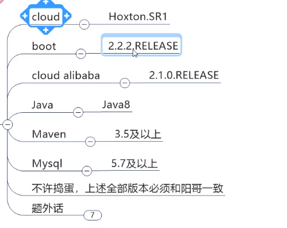
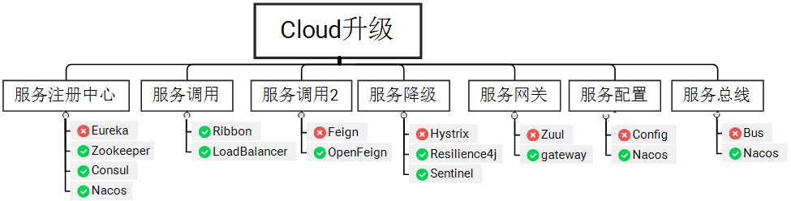

# FrameDay01_版本介绍

视频地址：https://www.bilibili.com/video/BV18E411x7eT

视频结构：

1-4 入门，5-9 初级，10-17 中级，17-21 高级

### 上篇 SpringBoot2.X版+SpringCloud H 版
### 下篇 SpringCloud Alibaba
### 官网查看 cloud与boot 版本对应关系
https://spring.io/projects/spring-cloud#overflow
### 更加详细的cloud与boot版本对应
https://start.spring.io/actuator/info

 微服务应该包括：

大致的微服务架构

原来主要技术

现在替换技术

