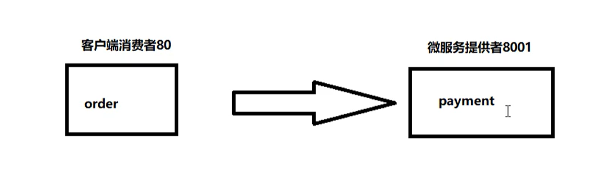

# 项目实践——订单-支付工程

[TOC]

## 一、新建父项目

- 新建 Maven 工程

- 选择模板 `org.apache.maven.archetypes:maven-archetypes-site`

- 选择项目字符编码 `setting->editor->file Encodings ->将所有字符编码全部换成 utf-8`

- 支持注解 `setting`->`Build,Execution,Deployment`->`Compiler`->`Annotation Processors` 内的 `Enable annotation processing` 打上勾表示能够使用注解。

- 更改编译版本setting->Build,Execution,Deployment->Compiler->Java Compiler 下 Pe-module butecode version 框内的编译版本换成 8

- 删除src文件夹

- 将 Pom 文件中的修改为：

```xml
<groupId>com.gjxaiou.springcloud</groupId>
  <artifactId>SpringCloud2020</artifactId>
  <version>1.0-SNAPSHOT</version>
	<!--加上这个-->
  <packaging>pom</packaging>
```


### 父工程POM

maven中的 dependencyManagement 与 dependencies 

完整的 Pom.xml 为：

```xml
<?xml version="1.0" encoding="UTF-8"?>

<project xmlns="http://maven.apache.org/POM/4.0.0"
         xmlns:xsi="http://www.w3.org/2001/XMLSchema-instance"
         xsi:schemaLocation="http://maven.apache.org/POM/4.0.0 http://maven.apache.org/xsd/maven-4.0.0.xsd">
    <modelVersion>4.0.0</modelVersion>

    <groupId>com.gjxaiou.springcloud</groupId>
    <artifactId>SpringCloud2020</artifactId>
    <version>1.0-SNAPSHOT</version>
    <!-- 表示总的 pom 工程-->
    <packaging>pom</packaging>

    <!--统一管理jar包版本-->
    <properties>
        <project.build.sourceEncoding>UTF-8</project.build.sourceEncoding>
        <maven.compiler.source>1.8</maven.compiler.source>
        <maven.compiler.target>1.8</maven.compiler.target>
        <junit.version>4.12</junit.version>
        <lombok.version>1.18.10</lombok.version>
        <log4j.version>1.2.17</log4j.version>
        <mysql.version>8.0.18</mysql.version>
        <druid.version>1.1.16</druid.version>
        <mybatis.spring.boot.version>1.3.0</mybatis.spring.boot.version>
    </properties>

    <!-- 用于父工程，子模块继承之后，提供作用：锁定版本 + 子 module 不用写 groupId 和 version -->
    <dependencyManagement>
        <dependencies>
            <dependency>
                <groupId>org.apache.maven.plugins</groupId>
                <artifactId>maven-project-info-reports-plugin</artifactId>
                <version>3.0.0</version>
            </dependency>
            <!--spring boot 2.2.2-->
            <dependency>
                <groupId>org.springframework.boot</groupId>
                <artifactId>spring-boot-dependencies</artifactId>
                <version>2.2.2.RELEASE</version>
                <type>pom</type>
                <scope>import</scope>
            </dependency>
            <!--spring cloud Hoxton.SR1-->
            <dependency>
                <groupId>org.springframework.cloud</groupId>
                <artifactId>spring-cloud-dependencies</artifactId>
                <version>Hoxton.SR1</version>
                <type>pom</type>
                <scope>import</scope>
            </dependency>

            <!--spring cloud 阿里巴巴-->
            <dependency>
                <groupId>com.alibaba.cloud</groupId>
                <artifactId>spring-cloud-alibaba-dependencies</artifactId>
                <version>2.1.0.RELEASE</version>
                <type>pom</type>
                <scope>import</scope>
            </dependency>
            <!--mysql-->
            <dependency>
                <groupId>mysql</groupId>
                <artifactId>mysql-connector-java</artifactId>
                <version>${mysql.version}</version>
                <scope>runtime</scope>
            </dependency>
            <!-- druid-->
            <dependency>
                <groupId>com.alibaba</groupId>
                <artifactId>druid</artifactId>
                <version>${druid.version}</version>
            </dependency>

           <!--mybatis-->
            <dependency>
                <groupId>org.mybatis.spring.boot</groupId>
                <artifactId>mybatis-spring-boot-starter</artifactId>
                <version>${mybatis.spring.boot.version}</version>
            </dependency>
            <!--junit-->
            <dependency>
                <groupId>junit</groupId>
                <artifactId>junit</artifactId>
                <version>${junit.version}</version>
            </dependency>
            <!--log4j-->
            <dependency>
                <groupId>log4j</groupId>
                <artifactId>log4j</artifactId>
                <version>${log4j.version}</version>
            </dependency>
        </dependencies>
    </dependencyManagement>
</project>

```


###  dependencyManagement 父类管理
Maven 使用 dependencyManagement 元素提供依赖版本号管理的方式
==通常会在一个组织或者项目的最顶级父 POM 中看到dependencyManagement==

使用 dependencyManagement 可以使所有子项目中引用一个依赖而不用显示列出版本号。Maven 会沿父子层级向上走，直到找到 dependencyManagement 元素的项目 ，然后它就会使用版本号。

如果某一个子项目需要另外一个版本，加上version即可。如果子项目中声明了版本号，那么使用子项目中的 jar包。

dependencyManagement 只是声明依赖，并不实现引入，**因此子项目需要显式的声明需要用的依赖**。

因此如果不在子项目中声明依赖，是不会从父项目中继承下来的。只有在子项目中写了该依赖项，并且没有指定具体版本，才会从父项目中继承该项，并且 `version` 和 `scope` 都读取来自父 pom。


#### Maven 跳过单元测试

在 IDEA 右边该项目的 Maven 处，有一个「小闪电」图标，点击之后然后看 「Lifecycle」中的 「test」就取消了。


## 二、项目结构




### （一）支付模块构建 cloud-provider-payment8001微服务提供者支持Moudle模块

1. 建module
    1. 新建maven工程，不使用任何模板，改jdk为1.8。
    2. 写入项目name即可。
    
2. 改POM
    1. 主POM内增加 moudle
    2. 子项目引入依赖
    
    ```xml
    <?xml version="1.0" encoding="UTF-8"?>
    <project xmlns="http://maven.apache.org/POM/4.0.0"
             xmlns:xsi="http://www.w3.org/2001/XMLSchema-instance"
             xsi:schemaLocation="http://maven.apache.org/POM/4.0.0 http://maven.apache.org/xsd/maven-4.0.0.xsd">
        <parent>
            <artifactId>SpringCloud2020</artifactId>
            <groupId>com.gjxaiou.springcloud</groupId>
            <version>1.0-SNAPSHOT</version>
        </parent>
        <modelVersion>4.0.0</modelVersion>
    
        <artifactId>cloud-provider-payment8001</artifactId>
    
        <dependencies>
            <!-- SpringBoot web 和监控依赖-->
            <dependency>
                <groupId>org.springframework.boot</groupId>
                <artifactId>spring-boot-starter-web</artifactId>
            </dependency>
            <!--监控-->
    <!--        <dependency>-->
    <!--            <groupId>org.springframework.boot</groupId>-->
    <!--            <artifactId>spring-boot-starter-actuator</artifactId>-->
    <!--        </dependency>-->
    
            <!-- Mybatis 依赖-->
            <dependency>
                <groupId>org.mybatis.spring.boot</groupId>
                <artifactId>mybatis-spring-boot-starter</artifactId>
            </dependency>
    
    <!--        &lt;!&ndash; 包含了sleuth zipkin 数据链路追踪&ndash;&gt;-->
    <!--        <dependency>-->
    <!--            <groupId>org.springframework.cloud</groupId>-->
    <!--            <artifactId>spring-cloud-starter-zipkin</artifactId>-->
    <!--        </dependency>-->
             <!--引用自己定义的api通用包，可以使用Payment支付Entity-->
            <dependency>
                <groupId>com.gjxaiou.springcloud</groupId>
                <artifactId>cloud-api-commons</artifactId>
                <version>1.0-SNAPSHOT</version>
            </dependency>
    
    
            <!--eureka client-->
    <!--        <dependency>-->
    <!--            <groupId>org.springframework.cloud</groupId>-->
    <!--            <artifactId>spring-cloud-starter-netflix-eureka-client</artifactId>-->
    <!--        </dependency>-->
    
            <dependency>
                <groupId>com.alibaba</groupId>
                <artifactId>druid-spring-boot-starter</artifactId>
                <!--如果没写版本,从父层面找,找到了就直接用,全局统一-->
            </dependency>
            <!-- https://mvnrepository.com/artifact/com.alibaba/druid-spring-boot-starter -->
    
    
            <!--mysql-connector-java-->
            <dependency>
                <groupId>mysql</groupId>
                <artifactId>mysql-connector-java</artifactId>
            </dependency>
    
            <!--jdbc-->
            <dependency>
                <groupId>org.springframework.boot</groupId>
                <artifactId>spring-boot-starter-jdbc</artifactId>
            </dependency>
    
            <!--热部署-->
            <dependency>
                <groupId>org.springframework.boot</groupId>
                <artifactId>spring-boot-devtools</artifactId>
                <scope>runtime</scope>
                <optional>true</optional>
            </dependency>
    
            <dependency>
                <groupId>org.projectlombok</groupId>
                <artifactId>lombok</artifactId>
                <optional>true</optional>
            </dependency>
    
            <dependency>
                <groupId>org.springframework.boot</groupId>
                <artifactId>spring-boot-starter-test</artifactId>
                <scope>test</scope>
            </dependency>
        </dependencies>
    
    </project>
    ```
    
3. 写 YML

    ```yaml
    # 服务端口号
    server:
      port: 8001
    
    # 服务名称
    spring:
      application:
        name: cloud-payment-service
    #  zipkin:
    #    # 放到 zipkin上
    #    base-url: http://localhost:9411
    #  sleuth:
    #    sampler:
    #      # 采样率介于0-1之间，1表示全部采集
    #      probability: 1
      datasource:
        type: com.alibaba.druid.pool.DruidDataSource  #数据源类型
        #driver-class-name: org.gjt.mm.mysql.Driver    #mysql驱动包
        driver-class-name: com.mysql.cj.jdbc.Driver
        url: jdbc:mysql://localhost:3306/spring_cloud_payment?useUnicode=true&characterEncoding=utf-8
        username: root
        password: GJXAIOU
    
        # 和 MyBatis 的整合
    
    mybatis:
      mapper-locations: classpath:mapper/*.xml
      type-aliases-package: com.gjxaiou.springcloud.entities  #实体类所在包
    ```

4. 主启动

5. 业务类

    1. 建表 SQL

        数据库名称：`spring_cloud_payment`，建表语句为：

        ```sql
        CREATE TABLE `payment`  (
          `id` bigint(20) NOT NULL AUTO_INCREMENT COMMENT '主键',
          `serial` varchar(200) CHARACTER SET utf8 COLLATE utf8_general_ci DEFAULT NULL COMMENT '支付流水号',
          PRIMARY KEY (`id`) USING BTREE
        ) ENGINE = InnoDB CHARACTER SET = utf8 COLLATE = utf8_general_ci COMMENT = '支付表' ROW_FORMAT = Dynamic;
        ```

    2. entities

        entities 仅仅包括：Payment，同时使用 CommonResult 将结果进行封装

        ```java
        package com.gjxaiou.springcloud.entities;
        
        
        import lombok.AllArgsConstructor;
        import lombok.Data;
        import lombok.NoArgsConstructor;
        
        import java.io.Serializable;
        
        // @Data ： 注在类上，提供类的get、set、equals、hashCode、canEqual、toString方法
        @Data
        @AllArgsConstructor
        @NoArgsConstructor
        public class Payment implements Serializable {
            // 因为数据库中 id 为 bigint
            private Long id;
            private String serial;
        }
        
        ```

        通过结果返回类：

        ```java
        package com.gjxaiou.springcloud.entities;
        
        
        import lombok.AllArgsConstructor;
        import lombok.Data;
        import lombok.NoArgsConstructor;
        
        /**
         * 用于返回给前端的封装结果，通常包括：
         * 1. 返回状态：code，值有 200，404,500...
         * 2. 返回信息：message 包括错误信息，异常信息等等
         * 3. 具体的数据：data
         */
        @Data
        @AllArgsConstructor
        @NoArgsConstructor
        public class CommonResult<T> {
            private Integer code;
            private String message;
            private T data;
        
            // 部分场景下不返回任何数据，即 data = null，因此单独提供一个构造方法
            public CommonResult(Integer code, String message) {
                this(code, message, null);
            }
        }
        
        ```

    3. dao 和 Mapper 文件

        ```java
        package com.gjxaiou.springcloud.dao;
        
        import com.gjxaiou.springcloud.entities.Payment;
        import org.apache.ibatis.annotations.Mapper;
        import org.apache.ibatis.annotations.Param;
        
        @Mapper
        public interface PaymentDao {
            // 提供读取和写入方法
            Payment getPaymentById(@Param("id") Long id);
        
            int createPayment(Payment payment);
        }
        
        ```

        对应的 Mapper 文件

        ```xml
        <?xml version="1.0" encoding="UTF-8" ?>
        
        <!DOCTYPE mapper PUBLIC
                "-//mybatis.org//DTD Mapper 3.0//EN"
                "http://mybatis.org/dtd/mybatis-3-mapper.dtd">
        
        <!--指定对应的映射端口-->
        <mapper namespace="com.gjxaiou.springcloud.dao.PaymentDao">
            <insert id="createPayment" parameterType="Payment"
                    useGeneratedKeys="true"
                    keyProperty="id">
                insert into payment(serial) values (#{serial});
            </insert>
        
            <resultMap id="BaseResultMap" type="com.gjxaiou.springcloud.entities.Payment">
                <id column="id" property="id" jdbcType="BIGINT"></id>
                <id column="serial" property="serial" jdbcType="VARCHAR"></id>
            </resultMap>
        
            <select id="getPaymentById" parameterType="Long" resultMap="BaseResultMap">
                SELECT * FROM payment WHERE id = #{id};
            </select>
        </mapper>
        ```

        

    4. service

        ```java
        package com.gjxaiou.springcloud.service;
        
        
        import com.gjxaiou.springcloud.entities.Payment;
        import org.apache.ibatis.annotations.Param;
        
        public interface PaymentService {
            // 这里直接使用 Dao 层的，未做过多的处理
            Payment getPaymentById(@Param("id") Long id);
        
            int createPayment(Payment payment);
        }
        
        ```

        对应的实现类为：

        ```java
        package com.gjxaiou.springcloud.service.impl;
        
        import com.gjxaiou.springcloud.dao.PaymentDao;
        
        import com.gjxaiou.springcloud.entities.Payment;
        import com.gjxaiou.springcloud.service.PaymentService;
        import org.springframework.stereotype.Service;
        
        import javax.annotation.Resource;
        
        @Service
        public class PaymentServiceImpl implements PaymentService {
        
            @Resource
            PaymentDao paymentDao;
        
            @Override
            public Payment getPaymentById(Long id) {
                return paymentDao.getPaymentById(id);
            }
        
            @Override
            public int createPayment(Payment payment) {
                return paymentDao.createPayment(payment);
            }
        }
        ```

    5. controller

        ```java
        package com.gjxaiou.springcloud.controller;
        
        
        import com.gjxaiou.springcloud.entities.CommonResult;
        import com.gjxaiou.springcloud.entities.Payment;
        import com.gjxaiou.springcloud.service.PaymentService;
        import lombok.extern.slf4j.Slf4j;
        import org.springframework.web.bind.annotation.*;
        
        import javax.annotation.Resource;
        
        @RestController
        @Slf4j
        public class PaymentController {
        
            @Resource
            PaymentService paymentService;
        
            @GetMapping(value = "/payment/get/{id}")
            public CommonResult getPaymentById(@PathVariable("id") Long id) {
                Payment payment = paymentService.getPaymentById(id);
                log.info("根据 ID：" + id + " 查询结果为 " + payment);
                return null == payment ? new CommonResult<Payment>(400, "查询结果为空", null) :
                        new CommonResult<Payment>(200, "查询成功", payment);
            }
        
            @PostMapping(value = "/payment/create")
            public CommonResult insertPayment(@RequestBody Payment payment) {
                int result = paymentService.createPayment(payment);
                log.info("插入成功，插入数据为： " + payment);
                return null == payment ? new CommonResult<Integer>(400, "查询结果为空", result) :
                        new CommonResult<Integer>(200, "查询成功", result);
            }
        }
        ```

6. 单元测试

    使用 IDEA 自带的 HTTP Client 进行测试：`http://localhost:8001/payment/get/1` 或者 `http://localhost:8001/payment/create?serial=XXX`
### 2. 热部署Devtools
1. 引入坐标依赖
    ```xml
    <!--热部署-->
    <dependency>
        <groupId>org.springframework.boot</groupId>
        <artifactId>spring-boot-devtools</artifactId>
        <scope>runtime</scope>
        <optional>true</optional>
    </dependency>
    ```
2. 添加插件到父类总工程中
    ```xml
    <build>
        <finalName>工程名字</finalName>
        <plugins>
            <plugin>
                <groupId>org.springframework.boot</groupId>
                <artifactId>spring-boot-maven-plugin</artifactId>
                <configuration>
                    <fork>true</fork>
                    <addResources>true</addResources>
                </configuration>
            </plugin>
        </plugins>
    </build>
    ```
3. 开启自动编译权限
setting->Build,Execution,Deployment->Compiler 内复选框全部打勾
4. 开启热注册
    1. 进入子模块通过快捷键：` ctrl + shift + alt + /`
    2. 在弹出的窗口中选择 Registry，然后将下面两个选项勾选。然后重启 IDEA。
        compiler.automake.allow.when.app.running
        actionSystem.assertFocusAccessFromEdit

### （二）cloud-consumer-order80微服务消费者订单Module模块
1. 建module
    1. 新建maven工程，不使用任何模板，改jdk为1.8。
    2. 写入项目name即可。
    
2. 改POM
    1. 主POM内增加 moudle
    
    2. 子项目引入依赖
    
        ```xml
        <?xml version="1.0" encoding="UTF-8"?>
        <project xmlns="http://maven.apache.org/POM/4.0.0"
                 xmlns:xsi="http://www.w3.org/2001/XMLSchema-instance"
                 xsi:schemaLocation="http://maven.apache.org/POM/4.0.0 http://maven.apache.org/xsd/maven-4.0.0.xsd">
            <parent>
                <artifactId>SpringCloud2020</artifactId>
                <groupId>com.gjxaiou.springcloud</groupId>
                <version>1.0-SNAPSHOT</version>
            </parent>
            <modelVersion>4.0.0</modelVersion>
        
            <artifactId>cloud-consumer-order80</artifactId>
        
        
            <dependencies>
        <!--        &lt;!&ndash; 包含了sleuth zipkin 数据链路追踪&ndash;&gt;-->
        <!--        <dependency>-->
        <!--            <groupId>org.springframework.cloud</groupId>-->
        <!--            <artifactId>spring-cloud-starter-zipkin</artifactId>-->
        <!--        </dependency>-->
                <dependency><!-- 引用自己定义的api通用包，可以使用Payment支付Entity -->
                    <groupId>com.gjxaiou.springcloud</groupId>
                    <artifactId>cloud-api-commons</artifactId>
                    <version>1.0-SNAPSHOT</version>
                </dependency>
                <dependency>
                    <groupId>org.springframework.boot</groupId>
                    <artifactId>spring-boot-starter-web</artifactId>
                </dependency>
        <!--        &lt;!&ndash;监控&ndash;&gt;-->
        <!--        <dependency>-->
        <!--            <groupId>org.springframework.boot</groupId>-->
        <!--            <artifactId>spring-boot-starter-actuator</artifactId>-->
        <!--        </dependency>-->
        <!--        &lt;!&ndash;eureka client&ndash;&gt;-->
        <!--        <dependency>-->
        <!--            <groupId>org.springframework.cloud</groupId>-->
        <!--            <artifactId>spring-cloud-starter-netflix-eureka-client</artifactId>-->
        <!--        </dependency>-->
                <!--热部署-->
                <dependency>
                    <groupId>org.springframework.boot</groupId>
                    <artifactId>spring-boot-devtools</artifactId>
                    <scope>runtime</scope>
                <optional>true</optional>
                </dependency>
                <dependency>
                    <groupId>org.projectlombok</groupId>
                    <artifactId>lombok</artifactId>
                    <optional>true</optional>
                </dependency>
                <dependency>
                    <groupId>org.springframework.boot</groupId>
                    <artifactId>spring-boot-starter-test</artifactId>
                    <scope>test</scope>
                </dependency>
            </dependencies>
        </project>
        ```
        
        
    
3. 写YML

    ```yaml
    server:
      port: 80
    ```

    

4. 主启动

5. 业务类
    1. 将第一个子模块支付模块的实体类包复制过来

    2. 新建Controller类

        ```java
        package com.gjxaiou.springcloud.controller;
        
        import com.gjxaiou.springcloud.entities.CommonResult;
        
        import com.gjxaiou.springcloud.entities.Payment;
        import lombok.extern.slf4j.Slf4j;
        import org.springframework.web.bind.annotation.GetMapping;
        import org.springframework.web.bind.annotation.PathVariable;
        import org.springframework.web.bind.annotation.RestController;
        import org.springframework.web.client.RestTemplate;
        
        import javax.annotation.Resource;
        
        @RestController
        @Slf4j
        public class OrderController {
        
            public static final String PAYMENT_URL = "http://localhost:8001";
            @Resource
            RestTemplate restTemplate;
        
            @GetMapping("/consumer/payment/create")
            public CommonResult<Payment> create(Payment payment) {
                return restTemplate.postForObject(PAYMENT_URL + "/payment/create", payment,
                        CommonResult.class);
            }
        
            @GetMapping("/consumer/payment/get/{id}")
            public CommonResult<Payment> getPayment(@PathVariable("id") Long id) {
                return restTemplate.getForObject(PAYMENT_URL + "/payment/get/" + id, CommonResult.class);
            }
        }
        
        ```

6. 使用 RestTemplate 进行两个模块之间的调用，由消费者订单模块调用支付模块。

    RestTemplate 提供了多种便捷访问远程 HTTP 服务的方法，是一种简单便捷的访问 restful 服务模板类，是 Spring 提供的用于访问 Rest 服务的客户端模板工具集。包名就是：`org.springframework.web.client.RestTemplate`

    通常使用方式：`方法(url, requestMap, ResponseBean.class)` 代表 REST 请求地址，请求参数、HTTP 响应转换被转换成的对象类型。

    1. 新建配置类，注册 RestTemplate bean
        ```java
        @Configuration
        public class ApplicationContextConfig {
            @Bean
            public RestTemplate getRestTemplate(){
                return new RestTemplate();
            }
        }
        ```

7. 写Controller方法

3. 启动  
    1. 先启动8001
    2. 再启动 80 
    3. idea右下角弹出窗口，选择show，共同管理两个端口号
    4. 使用http://localhost/consumer/payment/get/1访问，80为默认端口号可省略不写

## 工程重构：
1. 问题项目中有重复部分：两个工程中有完全相同的实体类
2. 新建公共项目 cloud-api-commons 将公共有的实体类包括工具类等放到里面，所有模块都可以使用
    * 导入依赖 lombok devtools 以及 hutool 工具包
    
        ```xml
        <?xml version="1.0" encoding="UTF-8"?>
        <project xmlns="http://maven.apache.org/POM/4.0.0"
                 xmlns:xsi="http://www.w3.org/2001/XMLSchema-instance"
                 xsi:schemaLocation="http://maven.apache.org/POM/4.0.0 http://maven.apache.org/xsd/maven-4.0.0.xsd">
            <parent>
                <artifactId>SpringCloud2020</artifactId>
                <groupId>com.gjxaiou.springcloud</groupId>
                <version>1.0-SNAPSHOT</version>
            </parent>
            <modelVersion>4.0.0</modelVersion>
        
            <artifactId>cloud-api-commons</artifactId>
        
            <dependencies>
                <dependency>
                    <groupId>org.springframework.boot</groupId>
                    <artifactId>spring-boot-devtools</artifactId>
                    <scope>runtime</scope>
                    <optional>true</optional>
                </dependency>
             
                <dependency>
                    <groupId>org.projectlombok</groupId>
                    <artifactId>lombok</artifactId>
                    <optional>true</optional>
                </dependency>
        
                <!--工具包-->
                <dependency>
                    <groupId>cn.hutool</groupId>
                    <artifactId>hutool-all</artifactId>
                    <version>5.4.7</version>
                </dependency>
            </dependencies>
        </project>
        ```
    
        
    
    * 将实体类包导入到项目中
3. maven clean install
    * 点击上面的闪电 跳过测试
    * 进入 maven 找到新建模块，进入 Lifecycle 先clean再  install重新安装
    * 注意观察公共模块 pom 文件中必须含有独立的 groupid 和 artifactid

如果找不到对应类了，需要将所有文件类的 import 删除重新导入。