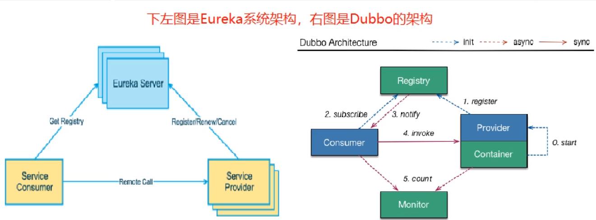
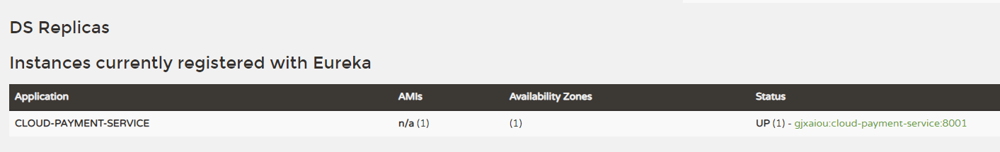
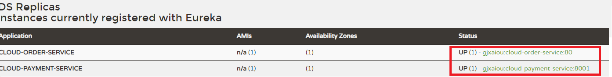
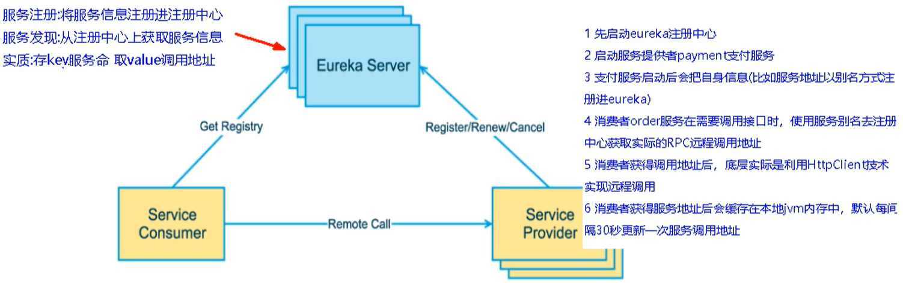
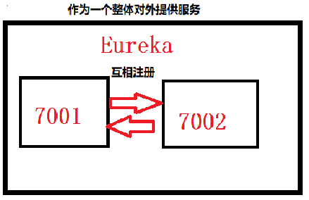
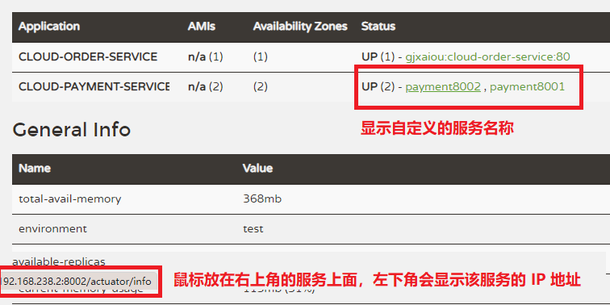

# Eureka 服务注册与发现

[TOC]


## 一、概述

### （一）服务注册
Eureka 采用了 CS 的设计架构，Eureka Server 作为服务注册功能的服务器，它是**服务注册中心**，而系统中其他微服务，使用 Eureka 的客户端连接到 Eureka Server 并**维持心跳连接**，这样系统维护人员就可以通过 Eureka Server 来监控各个微服务是否正常运行。

在服务注册与发现中有一个注册中心，服务器启动时，会把当前自己的服务器信息比如服务地址，通信地址等注册到注册中心上，另一方（消费者）以别名的方式在注册中心上获取实际的服务器通讯地址，然后再实现本地 RPC 调用远程 RPC。远程调用框架核心设计思想：在于注册中心，因为使用注册中心管理每个服务于服务之间的一个依赖关系（服务治理概念）。在任何 RPC 远程框架中，都会有一个注册中心（存放服务地址相关信息（接口地址））。


### （二）Eureka 的两个组件
- Eureka Server 提供服务注册服务
    各个微服务节点通过配置启动后，会在 EurekaServer 中进行注册，这样 EurekaServer 中的服务注册表中将会存储所有可用服务节点的信息。

- EurekaClient 通过注册中心进行访问
    是一个Java 客户端，用于简化与 Eureka Server 的交互，客户端也同时具备一个内置的，使用轮询负载算法的负载均衡器。在应用启动后，将会向 Eureka Server 发送心跳（默认周期30秒）。如果 Eureka Server 在多个心跳周期内没有接收到某个节点的心跳，EurekaServer 将会从服务注册表中将这个服务节点移除（默认 90 秒）

## 二、单机 Eureka 构建步骤
### （一）eurekaServer 端服务注册中心：cloud-eureka-server7001
- 完整的 pom 文件为：

    ```xml
    <?xml version="1.0" encoding="UTF-8"?>
    <project xmlns="http://maven.apache.org/POM/4.0.0"
             xmlns:xsi="http://www.w3.org/2001/XMLSchema-instance"
             xsi:schemaLocation="http://maven.apache.org/POM/4.0.0 http://maven.apache.org/xsd/maven-4.0.0.xsd">
        <parent>
            <artifactId>SpringCloud2020</artifactId>
            <groupId>com.gjxaiou.springcloud</groupId>
            <version>1.0-SNAPSHOT</version>
        </parent>
        <modelVersion>4.0.0</modelVersion>
    
        <artifactId>cloud-eureka-server7001</artifactId>
        <dependencies>
            
            <!-- eureka-server -->
            <dependency>
                <groupId>org.springframework.cloud</groupId>
                <artifactId>spring-cloud-starter-netflix-eureka-server</artifactId>
            </dependency>
            
            <!-- 引用自己定义的api通用包，可以使用Payment支付Entity -->
            <dependency>
                <groupId>com.gjxaiou.springcloud</groupId>
                <artifactId>cloud-api-commons</artifactId>
                <version>1.0-SNAPSHOT</version>
            </dependency>
            <dependency>
                <groupId>org.springframework.boot</groupId>
                <artifactId>spring-boot-starter-web</artifactId>
            </dependency>
            <!--监控-->
            <dependency>
                <groupId>org.springframework.boot</groupId>
                <artifactId>spring-boot-starter-actuator</artifactId>
            </dependency>
            <!-- 一般通用配置 -->
            <dependency>
                <groupId>org.springframework.boot</groupId>
                <artifactId>spring-boot-devtools</artifactId>
                <scope>runtime</scope>
                <optional>true</optional>
            </dependency>
            <dependency>
                <groupId>org.projectlombok</groupId>
                <artifactId>lombok</artifactId>
                <optional>true</optional>
            </dependency>
            <dependency>
                <groupId>org.springframework.boot</groupId>
                <artifactId>spring-boot-starter-test</artifactId>
                <scope>test</scope>
            </dependency>
        </dependencies>
    
    </project>
    ```

- 步骤二：配置 yaml 文件

    ```yaml
    server:
      port: 7001
    eureka:
      instance:
        hostname: eureka7001.com # eureka服务端实例名称
      client:
        # false表示不向注册中心注册自己
        register-with-eureka: false
        # false表示自己就是注册中心，职责是维护服务实例，并不需要去检索服务
        fetch-registry: false
        service-url:
          # 设置与 eureka server交互的地址查询服务和注册服务都需要依赖这个地址
          defaultZone:  http://${eureka.instance.hostname}:${server.port}/eureka/
    ```

- 步骤三：主启动类上标注：`@EnableEurekaServer` 注解，用于声明自己是 Eureka 的服务端。

- 测试
    浏览器进入 `http://localhost:7001/` 看能不能看到 eureka 的服务页面


### （二）EurekaClient 端服务提供者： cloud-provider-payment8001 

- 步骤一：pom 文件中引入 client 端坐标依赖

    ```xml
    <!--eureka-client-->
    <dependency>
        <groupId>org.springframework.cloud</groupId>
        <artifactId>spring-cloud-starter-netflix-eureka-client</artifactId>
    </dependency>
    ```

- 步骤二：设置完整的 yaml 文件为

    ```yaml
    # 服务端口号
    server:
      port: 8001
    
    # 服务名称
    spring:
      application:
        name: cloud-payment-service
    #  zipkin:
    #    # 放到 zipkin上
    #    base-url: http://localhost:9411
    #  sleuth:
    #    sampler:
    #      # 采样率介于0-1之间，1表示全部采集
    #      probability: 1
      datasource:
        type: com.alibaba.druid.pool.DruidDataSource  #数据源类型
        #driver-class-name: org.gjt.mm.mysql.Driver    #mysql驱动包
        driver-class-name: com.mysql.cj.jdbc.Driver
        url: jdbc:mysql://localhost:3306/spring_cloud_payment?useUnicode=true&characterEncoding=utf-8
        username: root
        password: GJXAIOU
    
    # 和 MyBatis 的整合
    mybatis:
      mapper-locations: classpath:mapper/*.xml
      type-aliases-package: com.gjxaiou.springcloud.entities  #实体类所在包
    
    eureka:
      client:
        # 表示是否将自己注册进 EurekaServer 默认为 true
        register-with-eureka: true
        #是否从EurekaServer抓取已有的注册信息，默认为true。单节点无所谓，集群必须设置为true才能配合ribbon使用 负载均衡
        fetch-registry: true
        service-url:
          #defaultZone: http://localhost:7001/eureka/ # Eureka 单机版
         
    
      instance:
        # 主机名称：服务名称的修改
        instance-id: payment8001
        # 暴露显示 IP 地址
        prefer-ip-address: true
    #    #eureka客户端发送心跳的时间间隔，默认30s
    #    lease-renewal-interval-in-seconds: 1
    #    #eureka服务端在收到最后一次心跳等待的时间上线，默认90s
    #    lease-expiration-duration-in-seconds: 2
    ```

- 步骤三：在 8001 主启动类上添加注解： `@EnableEurekaClient`。

- 测试
    进入http://localhost:7001/可以看到DS Replicas Instances currently registered with Eureka 下的服务端口




### （三）EurekaClient 端服务消费者： cloud-consumer-order80

设置步骤上，仅仅是端口号进行了修改。




## 三、Eureka 集群构建

### （一）原理说明



### （二）集群的目的
高可用，如果注册中心只有一个，出了故障就会导致整个服务环境不可用
解决方法：搭建Eureka注册中心集群，实现负载均衡+故障排错。多个 eureka serve 相互注册，保障信息共享。



### （三）搭建集群

- 步骤一：构建 cloud-eureka-server7002

    构建过程和 `cloud-eureka-server7001`完全一致，仅仅将里面的 7001 对应修改为 7002 即可。

- 步骤二：修改系统映射文件
    找到 `C:\Windows\System32\drivers\etc` 下的 hosts 文件添加

    ```shell
    127.0.0.1	eureka7001.com
    127.0.0.1	eureka7002.com
    ```

- 步骤三：修改 7001 和 7002 的 yml 文件

    分别将 defaultZone 的地址指向对方。

    ```yaml
    # 仅写修改的部分
    eureka:
      instance:
        hostname: eureka7001.com # eureka服务端实例名称，集群名字要不同有区分
      client:
        service-url:
        # 设置与 eureka server交互的地址查询服务和注册服务都需要依赖这个地址，因为两台集群所以相互注册
          defaultZone:  http://eureka7002.com:7002/eureka/
    ```

- 测试
    分别访问http://eureka7001.com:7001/ 和 http://eureka7002.com:7002/ 可以看到两者相互注册


### （四）在 Eureka 集群中发布微服务模块

- 步骤一：修改 `cloud-consumer-order80` 和 `cloud-provider-payment8001` 两个模块的 pom 文件
    `defaultZone:  http://eureka7002.com:7002/eureka/,http://eureka7001.com:7001/eureka/`

- 测试，启动微服务，先启动 EurekaServer（即 7001 和 7002 服务），然后启动服务提供者：8001，然后启动服务消费者：80。

    使用 `http://eureka7001.com:7001/` 和 `http://eureka7002.com:7002/` 查看是否都注入了两个服务，是否都注入了对方。


### （五）服务提供者集群配置

​	即 支付服务提供者也进行集群配置

- 步骤一：创建服务提供者 8002

    创建步骤和 8001 完全一样，只是将对应的端口修改为 8002 即可。

- 步骤二：修改 8001与8002的controller

    ```java
    // 在各个方法中调用 serverPort 查看端口号，这个取值就是从配置文件中进行取值。
    @Value("${server.port}")
    private String serverPort;
    ```

- 步骤三：修改 80 中 controller 

    因为这里使用 restTemplate 实现，所以消费端 80 访问服务提供端集群时候的路径 PAYMENT_URL 得修改

    - 在之前单机版中写死为8001，但是集群后有 8001 与 8002，可以进入 http://eureka7001.com:7001/ 查看 8001 与 8002 对应的名称 application。然后将 PAYMENT_URL 改为 http+application 名 :http://CLOUD-PAYMENT-SERVICE，即不再使用网址和端口，**只认服务名称**。

        ```java
        package com.gjxaiou.springcloud.controller;
        
        @RestController
        @Slf4j
        public class OrderController {
        
            public static final String PAYMENT_URL = "http://CLOUD-PAYMENT-SERVICE";
            @Resource
            RestTemplate restTemplate;
        
            @GetMapping("/consumer/payment/create")
            public CommonResult<Payment> create(Payment payment) {
                return restTemplate.postForObject(PAYMENT_URL + "/payment/create", payment,CommonResult.class);
            }
        
            @GetMapping("/consumer/payment/get/{id}")
            public CommonResult<Payment> getPayment(@PathVariable("id") Long id) {
                return restTemplate.getForObject(PAYMENT_URL + "/payment/get/" + id, CommonResult.class);
            }
        }
        ```

    - 此时未开启负载均衡不能访问页面：将 80 端口下的配置类 ApplicationContextConfig 下生成的 RestTemplate 的 bean 方法上添加注解 @LoadBalanced。该注解实现的效果默认就是轮训访问服务提供者。

        ```java
        package com.gjxaiou.springcloud.config;
        
        @Configuration
        public class ApplicationContextConfig {
            @Bean
            // 使用该注解赋予 RestTemplate 负载均衡的能力
            @LoadBalanced
            public RestTemplate getRestTemplate() {
                return new RestTemplate();
            }
        }
        ```

- 测试：不断访问 http://localhost/consumer/payment/get/1 查看输出的端口号，可以看到在8001与8002之间来回切换

### （六）actuator 微服务信息完善

此时 Eureka 集群上有三个微服务实例（instances)，分别为服务消费者 80 和服务提供者 8001 和 8002。为了便于查看我们对于 8001 和 8002 配置服务名称和访问信息有 IP 信息提示（便于监控）。

在 8001 和 8002 的 yaml 文件中增加配置如下来修改主机名与暴露ip地址

```yaml
eureka
    instance:
      instance-id: payment8002  # 自定义主机名
      prefer-ip-address: true # 设置暴露ip地址
```

测试：

可在http://eureka7002.com:7002/ 或者 7001 查看自定义主机名的变化
鼠标在主机名上方，浏览器下面会出现 ip 地址




## 四、服务发现 Discovery

目标：对于注册进入 Eureka 里面的微服务，可以通过服务发现拿到 Eureka 上注册是所有微服务的信息。

- 8001 和 8002 的 controller添加代码。这属于主动暴露给对方自己的微服务信息

  ```java
 /**
     * 用于主动的暴露给外面自己微服务的信息
     */

    @Resource
    DiscoveryClient discoveryClient;

    public Object discovery() {
        // 获取有哪些服务
        List<String> services = discoveryClient.getServices();
        for (String service : services) {
            log.info("** service **:" + service);
        }

        // 获取指定服务名称下面的具体有哪些实例
        List<ServiceInstance> instances = discoveryClient.getInstances("CLOUD-PAYMENT-SERVICE");
        for (ServiceInstance instance : instances) {
            log.info(instance.getServiceId() + "\t" + instance.getHost() + "\t" + instance.getPort() + "\t" + instance.getUri());
        }
        return this.discoveryClient;

    }
  ```
- 步骤二：8001 和 8002 主类添加注解 `@EnableDiscoveryClient`

- 步骤三：重启服务，观察日志

- 测试

    访问 URL：http://localhost:8001 结果返回为：`{"services":["cloud-payment-service","cloud-order-service"],"order":0}`，同时在 8001 服务的控制台窗口输出日志为：

    ```shell
     ** service **:cloud-payment-service
     ** service **:cloud-order-service
    CLOUD-PAYMENT-SERVICE	192.168.238.2	8001	http://192.168.238.2:8001
    CLOUD-PAYMENT-SERVICE	192.168.238.2	8002	http://192.168.238.2:8002
    ```

    

## 五、Eureka 自我保护

保护模式主要用于一组客户端和 Eureka Server 之间存在网络分区场景下的包含，一旦进入保护模式， Eureka Server 将会尝试保护其服务注册表中的信息，**不再删除服务表中的数据，即不会注销任何微服务**。

通常如果访问 Eureka Server 首页有以下提示表示进入保护模式了：EMERGENCY! EUREKA MAY BE INCORRECTLY CLAIMING INSTANCES  ARE UP WHEN THEY’RE NOT…….

总结：某时刻某一个微服务不可用了，Eureka 不会立刻清理，依旧会对该微服务的信息进行保存。

### 自我保护理论

- 为什么会产生自我保护？
    为了防止 EurekaClient 本可以正常运行，但是在 EurekaServer 网络不通的情况下，EurekaServer 不会立刻将 EurekaClient 服务剔除。

- 什么是自我保护模式？
    默认情况下，EurekaServer 在一定时间内没有接收到某个微服务实例的心跳，EurekaServer 将会注销该实例（默认 90s），但是当网络分区故障发生，微服务与 EurekaServer 之间无法正常通信，以上行为就非常危险。（因为微服务本身是健康的，不应该注销这个微服务）。因此当 EurekaServer 节点在短时间内丢失过多客户端时，那么这个节点就会进入自我保护模式来防止这个问题。

### 禁止自我保护
1. 将 7001 与 8001 改为单机版：修改对应 eureka 地址
2. yml文件
```yml
# 7001
eureka:
  server:
    # 关闭自我保护机制
    enable-self-preservation: false
    # 心跳时间默认90s，改为2000ms，即2s
    eviction-interval-timer-in-ms: 2000

# 8001
eureka:
  instance:
    #eureka客户端发送心跳的时间间隔，默认30s，即 8001 向 700X 发送时间
    lease-renewal-interval-in-seconds: 1
    #eureka服务端在收到最后一次心跳等待的时间上线，默认90s
    lease-expiration-duration-in-seconds: 2
```
3. 测试
  1. 访问 http://eureka7001.com:7001/ 可以看到红字THE SELF PRESERVATION MODE IS TURNED OFF. THIS MAY NOT PROTECT INSTANCE EXPIRY IN CASE OF NETWORK/OTHER PROBLEMS.代表自我保护关闭
  2. 关闭8001服务可以看到在 eureka 页面两秒后 8001 服务消失
