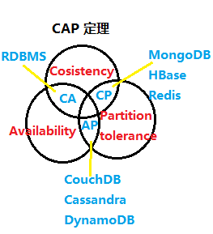

# Consul 服务注册中心

[TOC]

## 一、概述

### （一）简介

Consul 是一种服务网格解决方案，提供具有服务发现，配置和分段功能的全功能控制平面。这些功能中的每一个都可以根据需要单独使用，也可以一起使用以构建完整的服务网格。Consul 需要一个数据平面，并支持代理和本机集成模型。Consul 附带了一个简单的内置代理，因此一切都可以直接使用，还支持Envoy等第三方代理集成。

总结：Consul 是一套开源的**分布式服务发现和配置管理系统**，使用 Go 开发。提供了微服务系统中的服务治理、配置中心、控制总线等功能。

### （二）作用
* 服务发现：Consul的客户端可以注册服务，例如 api或mysql，其他客户端可以使用Consul来发现给定服务的提供者。使用DNS或HTTP，应用程序可以轻松找到它们依赖的服务。
* 运行状况检查：领事客户端可以提供任何数量的运行状况检查，这些检查可以与给定服务（“ Web服务器返回200 OK”）或与本地节点（“内存利用率低于90％”）相关联。操作员可以使用此信息来监视群集的运行状况，服务发现组件可以使用此信息将流量路由到运行状况不佳的主机之外。
* KV 键值对存储：应用程序可以将Consul的分层键/值存储用于多种目的，包括动态配置，功能标记，协调，领导者选举等。简单的HTTP API使其易于使用。
* 安全的服务通信：领事可以为服务生成并分发TLS证书，以建立相互TLS连接。 意图 可用于定义允许哪些服务进行通信。可以使用可以实时更改的意图轻松管理服务分段，而不必使用复杂的网络拓扑和静态防火墙规则。
* 多数据中心：Consul开箱即用地支持多个数据中心。这意味着Consul的用户不必担心会构建其他抽象层以扩展到多个区域。
* 可视化的 Web 界面。

[官网文档](https://www.consul.io/intro)/[软件下载](https://www.consul.io/downloads)/[中文说明文档](https://www.springcloud.cc/spring-cloud-consul.html)

### （三）安装启动
- 在下载的 exe 文件的目录下使用 cmd 打开

- 输入 `consul --version` 检测是否安装成功

- 启动服务：`consul agent -dev`

- 通过 `http://localhost:8500/`访问 web 界面


## 二、服务提供者：cloud-provider-consul-payment8006

- 步骤一：pom 文件主要新增

    ```xml
    <!--SpringCloud consul-server-->
    <dependency>
        <groupId>org.springframework.cloud</groupId>
        <artifactId>spring-cloud-starter-consul-discovery</artifactId>
    </dependency>
    ```

- 步骤二：完整的 yaml 文件为：

    ```yaml
    # consul 服务端口号
    server:
      port: 8006
    
    spring:
      application:
        name: consul-provider-payment
      # consul 注册中心地址
      cloud:
        consul:
          host: localhost
          port: 8500
          discovery:
            service-name: ${spring.application.name}
    ```

- 步骤三：启动类上添加注解：`@EnableDiscoveryClient`

- 步骤四：业务 controller 类

    ```java
    package com.gjxaiou.springcloud.controller;
    
    import java.util.UUID;
    
    @RestController
    @Slf4j
    public class PaymentController {
    
        @Value("${server.port}")
        private String serverPort;
    
        @RequestMapping(value = "/payment/consul")
        public String paymentConsul() {
            return "springCloud with consul : " + serverPort + "\t" + UUID.randomUUID().toString();
        }
    }
    ```

- 测试

  首先访问 `http://localhost:8500/` 可以看到新注册进入的服务

  

  同时访问：`http://localhost:8006/payment/consul` 可以成功访问服务

  `springCloud with consul : 8006 42bbeb65-c1bc-41e0-ad10-90bcaf9afecc`
## 三、服务消费者：cloud-consumer-consul-order80
- 步骤一：pom 文件主要内容为：

```xml
<!--SpringCloud consul-server-->
<dependency>
    <groupId>org.springframework.cloud</groupId>
    <artifactId>spring-cloud-starter-consul-discovery</artifactId>
</dependency>
```
- 步骤二：完整的 yaml 文件

```yml
server:
  port: 80
spring:
  application:
    name: cloud-consumer-order
  cloud:
    consul:
      host: localhost
      port: 8500
      discovery:
        service-name: ${spring.application.name}
```
- 步骤三：启动类上添加：`@EnableDiscoveryClient` 注解

- 步骤四：因为使用了 RestTemplate，所以需要设置配置类

    ```java
    package com.gjxaiou.springcloud.config;
    
    @Configuration
    public class ApplicationContextConfig {
    
        @Bean
        @LoadBalanced
        public RestTemplate getRestTemplate() {
            return new RestTemplate();
        }
    }
    ```

- 步骤五：业务 controller 类

    ```java
    package com.gjxaiou.springcloud.controller;
    
    @RestController
    @Slf4j
    public class OrderConsulController {
        public static final String INVOKE_URL = "http://consul-provider-payment";
    
        @Resource
        private RestTemplate restTemplate;
    
        @GetMapping(value = "/consumer/payment/consul")
        public String paymentInfo() {
            String result = restTemplate.getForObject(INVOKE_URL + "/payment/consul", String.class);
            return result;
        }
    }
    ```

- 步骤六：测试

    - 访问服务注册页

          

- 通过访问消费者也可以http://localhost/consumer/payment/consul

## 四、注册中心 Eureka、Zookeeper、Consul 的异同点

| 组件名称  | 语言 | CAP  | 服务健康检查 | 对外暴露接口 | Spring Cloud 集成 |
| --------- | ---- | ---- | ------------ | ------------ | ----------------- |
| Eureka    | Java | AP   | 可配支持     | HTTP         | 已集成            |
| Consul    | Go   | CP   | 支持         | HTTP、DNS    | 已集成            |
| Zookeeper | Java | CP   | 支持         | 客户端       | 已集成            |




### CAP 原理

**CAP理论关注粒度是数据，而不是整体系统设计的**

- C：Cosistency（强一致性）
- A：Availability（可用性）
- P：Partition tolerance（分区容错性）

CAP 理论的核心：一个分布式系统不可能同时很好的满足一致性、可用性和分区容错性这三个需求，因此，根据 CAP 原理将 NoSQL 数据库分成了满足 CA 原则、满足 CP 原则和满足 AP 原则三类：

- CA：单点集群，满足一致性，可用性的系统，通常在可拓展性上不太强大；
- CP：满足一致性、分区容忍性的系统，通常性能不是特别高；如：Zookeeper、Consul
- AP：满足可用性、分区容忍性的系统，通常可能对一致性要求低一些。如：Eureka
