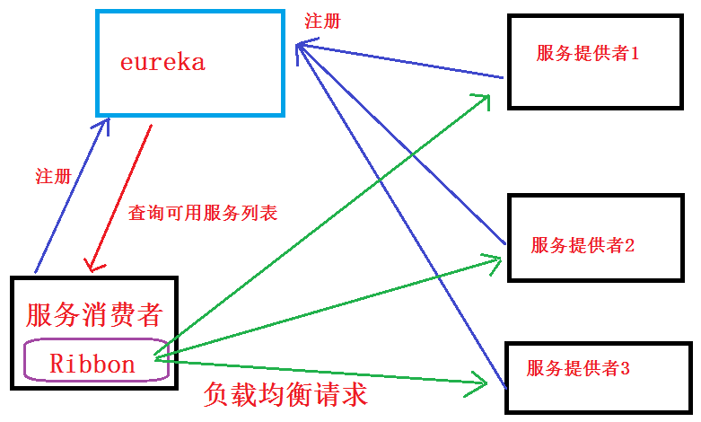
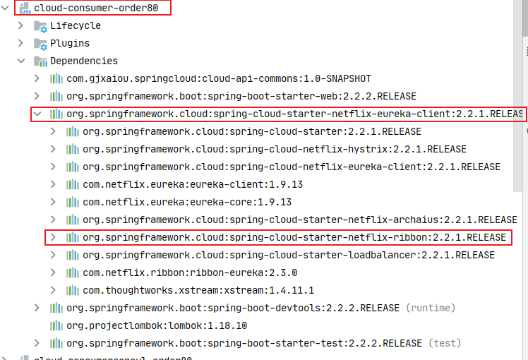
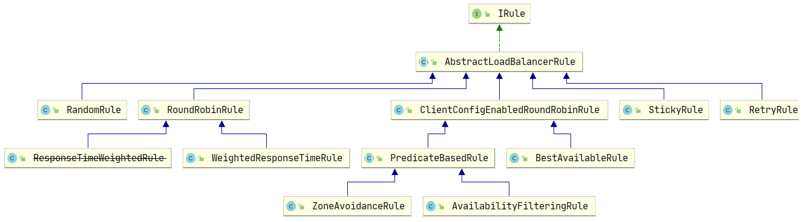

# Ribbon 负载均衡服务调用

主要涉及：

- EurekaMain7002
- PaymentMain8002
- PaymentMain8001
- EurekaMain7001
- OrderMain80

## 概述

### 是什么？
Spring Cloud Ribbon 是基于 Netflix Ribbon 实现的一套==客户端负载均衡的工具==。
简单的说，Ribbonn是Netflix的开源项目，主要功能 是提供==客户端的软件负载均衡算法和服务调用。==Ribbon客户端组件提供一系列完善的配置项，如连接超时，重试等。就是在配置文件中列出 Loa Balancer后面所有机器，Ribbon会自动帮助你基于某种规则 (如简单轮询，随机连接等)去连接这些机器。我们很容易使用Ribbon实现自定义的负载均衡算法。

### 官网资料，停更
https://github.com/Netflix/ribbon
### 能干什么？
1. 负载均衡
    * 负载均衡(Load Balance)是什么
        将用户的请求平摊的分配到多个服务上，从而达到HA(高可用)，常见的负载均衡有 Nginx,LVS,硬件 F5等。
    * Ribbon 本地负载均衡客户端（进程内的负载均衡） VS Nginx 服务端负载均衡（集中式的负载均衡）
        Nginx 是服务器 负载均衡，客户端所有请求都会交给 nginx，然后由 nginx实现请求转发。即负载均衡是由服务端实现的。
        Ribbon 是本地负载均衡，在微服务调用接口时，在注册中心上获取注册信息服务列表 之后缓存在JVM本地，从而实现本地RPC远程服务调用技术。
2. 实现
负载均衡+RestTemplate 调用



* Ribbon工作时有两步
    1. 第一步先选择 EurekaServer，优先选择统一区域负载较少的 server
    2. 第二部再根据用户指定的策略，从server取到的服务注册列表中选择一个地址。其中 Riibon 提供了多种策略（轮询，随机，根据响应时间加权）。

### 引入依赖
不需要
cloud-consumer-order80 模块下的 spring-cloud-starter-netflix-eureka-client 依赖已经引入了 Ribbon-Balance的依赖



# RestTemplate 使用
- getForObject 返回json

- getForEntity 返回 ResponseEnity对象，包含了响应中一些重要信息包括响应头、响应状态码、响应体等信息。

    具体使用可以参考： cloud-consumer-order80 模块中的 OrderController 类中方法演示：

    ```java
    package com.gjxaiou.springcloud.controller;
    
    @RestController
    @Slf4j
    public class OrderController {
    
        public static final String PAYMENT_URL = "http://CLOUD-PAYMENT-SERVICE";
        @Resource
        RestTemplate restTemplate;
    
        /**
         * ribbon 新增负载均衡
         */
        @GetMapping("/consumer/payment/getForEntity/{id}")
        public CommonResult<Payment> getPayment2(@PathVariable("id") Long id) {
            ResponseEntity<CommonResult> entity = restTemplate.getForEntity(PAYMENT_URL +
                    "/payment/get/" + id, CommonResult.class);
            if (entity.getStatusCode().is2xxSuccessful()) {
                return entity.getBody();
            } else {
                return new CommonResult<>(444, "操作失败");
            }
        }
    }
    ```

    

3. postForObject
与 get 方法一样，不同的是传进去的参数是对象
4. postForEntity
5. GET 请求方法
6. POST请求方法

# Ribbon 自带的负载均衡
### 核心接口组件 IRule



###### IRule默认自带的负载规则
- RoundRobinRule   轮询

- RandomRule   随机

- RetryRule    先按照RoundRobinRule的 策略获取服务，如果获取服务失败则在指定时间里进行重试，获取可用服务

- WeightedResponseTimeRule 对RoundRobinRule的扩展，响应速度越快，实例选择权重越大 ，越容易被选择

- BestAvailableRule    会先过滤掉由于多次访问故障而处于断路器 跳闸状态的服务，然后选择一个并发一个最小的服务

- BestAvaibilityFilteringRule  先过滤掉故障实例，再选择并发量较小的实例

- ZoneAvoidanceRule    默认规则，符合server所在区域的性能和server的可用性选择服务器

###### 如何替换

所有都是在 OrderMain80 模块中修改。

1. 注意：IRule配置类不能放在@ComponentSan 的包及子包下，因为默认的扫描会变成全局负载均衡都按照这样的规则。即当前自定义配置类会被所有 Ribbon 客户端所共享。

2. 新建包 `com.gjxaiou.myrule`

    因为目前主类 `OrderMain80` 上面含有 `@SpringBootApplication` 注解，该注解由一系列注解组合而成，其中包括：`@ComponentScan()` 注解，会扫描当前包及其子包。因此只要和主类不在同一个包即可（上一级或者其他包）。

3. 新建规则类 
    ```java
    package com.gjxaiou.myrule;
    
    import com.netflix.loadbalancer.IRule;
    import com.netflix.loadbalancer.RandomRule;
    import org.springframework.context.annotation.Bean;
    import org.springframework.context.annotation.Configuration;
    
    /**
     * @Author GJXAIOU
     * @Date 2020/11/30 14:13
     */
    @Configuration
    public class MySelfRule {
    
        @Bean
        public IRule myRule() {
            // 定义为随机方式
            return new RandomRule();
        }
    }
    ```

4. 主类添加注解
```java
// 选择要接收的服务和配置类，即该 80 要访问下面的微服务，同时自定义了配置类
// 注意：这里的 name 值是和 Controller 中的值是一样的
@RibbonClient(name = "CLOUD-PAYMENT-SERVICE",configuration = MySelfRule.class)
```
#### 测试

依次启动 7001/7002/8001/8002/80 之后，访问：`http://localhost/consumer/payment/get/1` 可以看到服务提供者在 8001 和 8002 中随机进行切换。


### 默认负载均衡轮回算法原理

###### 负载均衡算法
rest 接口 第几次请求数 % 服务器集群=实际调用服务器位置下标，每次服务重启后rest接口计数从1开始

总台数：2台（Eureka 上只有 8001 和 8002 两台实例）

请求数  调用下标
1       1%2=1       =>    index = 1     =>    list.get(index); 

2       2%2=0      =>     index = 0     =>    list.get(index);

3       3%2=1

4       4%2=0

######  RoundRobinRule源码分析
首先通过 `List<ServiceInstance> instances  = discoveryClient.getInstances('CLOUD-PAYMENT-SERVICE);` 获取该微服务下面的实例，共 两个。


大概结构理解

首先顶层类：IRule 中包括三个方法

```java

package com.netflix.loadbalancer;

public interface IRule{
    public Server choose(Object key);
    
    public void setLoadBalancer(ILoadBalancer lb);
    
    public ILoadBalancer getLoadBalancer();    
}
```

然后系统提供了一个抽象类，其中对 `setLoadBalancer()` 和 `getLoadBalancer()` 方法进行了实现，然后各个具体的负载均衡算法在 `choose()` 方法是实现是不同的：

```java
package com.netflix.loadbalancer;

import com.netflix.client.IClientConfigAware;

public abstract class AbstractLoadBalancerRule implements IRule, IClientConfigAware {

    private ILoadBalancer lb;
        
    @Override
    public void setLoadBalancer(ILoadBalancer lb){
        this.lb = lb;
    }
    
    @Override
    public ILoadBalancer getLoadBalancer(){
        return lb;
    }      
}
```

其中默认的实现算法就是轮训算法：RoundRobinRule

```java

package com.netflix.loadbalancer;

import com.netflix.client.config.IClientConfig;
import org.slf4j.Logger;
import org.slf4j.LoggerFactory;

import java.util.List;
import java.util.concurrent.atomic.AtomicInteger;

public class RoundRobinRule extends AbstractLoadBalancerRule {

    private AtomicInteger nextServerCyclicCounter;
    private static final boolean AVAILABLE_ONLY_SERVERS = true;
    private static final boolean ALL_SERVERS = false;

    private static Logger log = LoggerFactory.getLogger(RoundRobinRule.class);

    public RoundRobinRule() {
        nextServerCyclicCounter = new AtomicInteger(0);
    }

    public RoundRobinRule(ILoadBalancer lb) {
        this();
        setLoadBalancer(lb);
    }

    public Server choose(ILoadBalancer lb, Object key) {
        if (lb == null) {
            log.warn("no load balancer");
            return null;
        }

        Server server = null;
        int count = 0;
        while (server == null && count++ < 10) {
            List<Server> reachableServers = lb.getReachableServers();
            List<Server> allServers = lb.getAllServers();
            int upCount = reachableServers.size();
            int serverCount = allServers.size();

            if ((upCount == 0) || (serverCount == 0)) {
                log.warn("No up servers available from load balancer: " + lb);
                return null;
            }

            int nextServerIndex = incrementAndGetModulo(serverCount);
            server = allServers.get(nextServerIndex);

            if (server == null) {
                /* Transient. */
                Thread.yield();
                continue;
            }

            if (server.isAlive() && (server.isReadyToServe())) {
                return (server);
            }

            // Next.
            server = null;
        }

        if (count >= 10) {
            log.warn("No available alive servers after 10 tries from load balancer: "
                    + lb);
        }
        return server;
    }

    private int incrementAndGetModulo(int modulo) {
        for (;;) {
            int current = nextServerCyclicCounter.get();
            int next = (current + 1) % modulo;
            if (nextServerCyclicCounter.compareAndSet(current, next))
                return next;
        }
    }

    @Override
    public Server choose(Object key) {
        return choose(getLoadBalancer(), key);
    }

    @Override
    public void initWithNiwsConfig(IClientConfig clientConfig) {
    }
}
```

中间算法使用了 CAS 和 Hash 分流的思想来实现。


### 手写轮询算法

主要是修改 8001 和 8002 的 Controller 方法，加上的方法如下：

```java
/**
     * Ribbon：手写的负载均衡算法，作用：调用 8001 的时候返回该服务
     */
@GetMapping(value = "/payment/lb")
public String getPaymentLB() {
    return serverPort;
}
```


然后在 80 中修改使用自己的轮询算法。

- 步骤一：ApplicationContextConfig 去掉注解 `@LoadBalanced`

- 步骤二：LoadBalancer 接口

    ```java
    package com.gjxaiou.springcloud.lb;
    
    import org.springframework.cloud.client.ServiceInstance;
    
    import java.util.List;
    
    /**
     * @Author GJXAIOU
     * @Date 2020/11/30 15:28
     */
    public interface LoadBalancer {
        // 步骤一：收集 Eureka 上所有活着的机器数目
        ServiceInstance instances(List<ServiceInstance> serviceInstances);
    }
    ```

- 步骤三：LoadBalancerImpl 实现上面的接口

    ```java
    package com.gjxaiou.springcloud.lb;
    
    import org.springframework.cloud.client.ServiceInstance;
    import org.springframework.stereotype.Component;
    
    import java.util.List;
    import java.util.concurrent.atomic.AtomicInteger;
    
    /**
     * @Author GJXAIOU
     * @Date 2020/11/30 15:31
     */
    @Component
    public class LoadBalancerImpl implements LoadBalancer {
    
        // 步骤一：类比 RoundRibbonRule 中的 CAS，获取当前与下一个机器
        private AtomicInteger count = new AtomicInteger(0);
    
        public final int getAndIncrement() {
            int current;
            int next;
            do {
                current = this.count.get();
                next = current >= Integer.MAX_VALUE ? 0 : current + 1;
            } while (!this.count.compareAndSet(current, next));
            System.out.println("当前 next 值为：" + next);
            return next;
        }
    
        @Override
        public ServiceInstance instances(List<ServiceInstance> serviceInstances) {
            int index = getAndIncrement() % serviceInstances.size();
            return serviceInstances.get(index);
        }
    }
    ```

- 步骤四：OrderController，新增方法

    ```java
    /**
         * 自定义轮询算法
         */
    @Resource
    LoadBalancer loadBalancer;
    @Resource
    DiscoveryClient discoveryClient;
    
    @GetMapping(value = "/consumer/payment/lb")
    public String getPaymentLB(){
        List<ServiceInstance> instances = discoveryClient.getInstances("CLOUD-PAYMENT-SERVICE");
        if (instances == null || instances.size() <= 0){
            return null;
        }
        ServiceInstance serviceInstance = loadBalancer.instances(instances);
        URI uri = serviceInstance.getUri();
        return restTemplate.getForObject(uri + "/payment/lb", String.class);
    }
    ```

- 步骤五：测试：访问：`http://localhost/consumer/payment/lb`

    显示结果应该是 8001 和 8002 轮询显示。