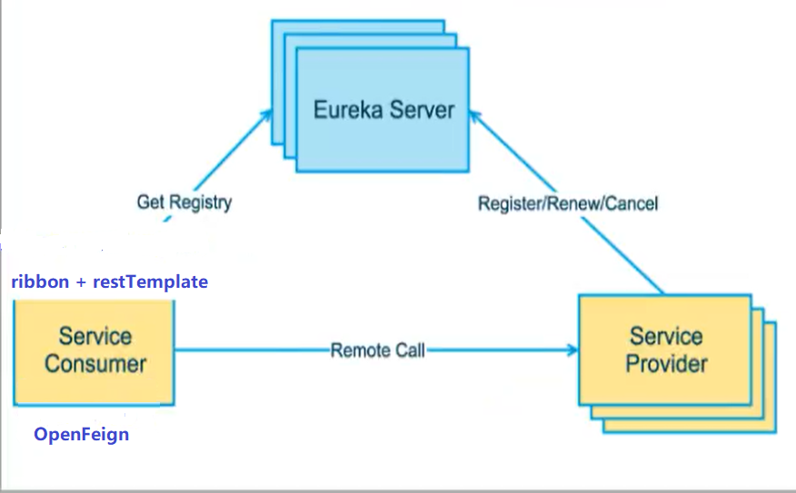

# OpenFeign 服务接口调用

## 是什么

Feign 是声明性 Web 服务**客户端**。它使编写 Web 服务客户端更加容易。要使用Feign，请**创建一个接口并对其添加注释**。它具有可插入的注释支持，包括Feign注释和JAX-RS注释。Feign还支持可插拔编码器和解码器。Spring Cloud添加了对Spring MVC注释的支持，并支持使用HttpMessageConvertersSpring Web中默认使用的注释。Spring Cloud集成了Ribbon和Eureka以及Spring Cloud LoadBalancer，以在使用Feign时提供负载平衡的http客户端。

[Github 开源地址](https://github.com/spring-cloud/spring-cloud-openfeign)

简而言之：就是服务提供者 8001/8002 提供了一些接口（在 service 层），则使用者同样通过 Feign 来创建一样的接口，从而实现接口之间的自由调用。更加的解耦合。

## 能干什么
* 使编写Java Http客户端更加容易
使用 RestTemplate+Ribbon 时，利用 RestTemplate 对http 请求的封装处理，形成一套模板化的调用方法，但是在实际中，由于对服务的调用可能不止一处，往往一个接口会被多处调用，所以通常都会针对每个微服务自行封装一些客户端类来包装这些依赖服务的调用。所以Feign在此基础上做了进一步封装，由他来帮助我们定义和实现服务接口的定义。在==Feign的实现下我们只需要创建一个接口并使用注解来配置它(以前是Dao接口上标注Mapper注解，现在是一个微服务接口上面标注一个Feign注解即可)==。自动封装服务调用客户端的开发量。
* Feign集成了Ribbon
利用Ribbon维护了Payment的服务列表信息，并且实现了轮询实现客户端的负载均衡。而与Ribbon不同的是，==feign只需要定义服务绑定接口且以声明式的方法==，优雅而简单的实现服务调用。
* Feign与OpenFeign区别


### 官网
https://cloud.spring.io/spring-cloud-openfeign/2.2.x/reference/html/

**整体的逻辑结构修改**



用在消费端。

## 建项目：cloud-consumer-feign-order80

1. 改pom

    

2. 建yml

3. 写启动类
```java
@SpringBootApplication
// 开启 OpenFeign
@EnableFeignClients
public class OrderFeignMain80 {
    public static void main(String[] args) {
        SpringApplication.run(OrderFeignMain80.class,args);
    }
}
```
4. 写业务类
    - 首先要一个业务逻辑接口，同时在该接口上使用 `@FeignClient` 配置调用服务提供者的服务
    - 然后实现 Controller 层。
```java
@Component
// 将业务提供者的名写进去
@FeignClient(value = "CLOUD-PAYMENT-SERVICE")
public interface PaymentFeignService {

// 将业务提供者的controller路径和方法复制粘贴进来
    @GetMapping("/payment/get/{id}")
    public CommonResult getPaymentById(@PathVariable("id")Long id);
}
```
5. controller
```java
package com.gjxaiou.springcloud.controller;

@RestController
@Slf4j
public class OrderFeignController {
    @Resource
    private PaymentFeignService paymentFeignService;

    @GetMapping(value = "/consumer/payment/get/{id}")
    public CommonResult<Payment> getPaymentById(@PathVariable("id") Long id) {
        return paymentFeignService.getPaymentById(id);
    }
}
```
流程：客户端访问上面 controller 的地址，然后会调用自身 80 的接口层（Service），其中在 Service 中会通过 Feign 在 Eureka 上寻找名称为：`CLOUD-PAYMENT-SERVICE` 的微服务接口，然后其调用接口就是 80 Service 中的地址。


#### 测试

启动 7001/7002/8001/8002/OderFeignMain80（当前项目），访问：`http://localhost/consumer/payment/get/1`。同时因为 Feign jar 中集成了 Ribbon，所以自带负载均衡功能。


# 超时控制

1. 8001 暂停，即在 Controller 中提供一个睡眠 3s 的方法

    ```java
        /**
         * 仅仅用于测试 Feign 的超时设置
         */
        @GetMapping(value = "/payment/feign/timeout")
        public String paymentFeignTimeout() {
            try {
                TimeUnit.SECONDS.sleep(3);
            } catch (InterruptedException e) {
                e.printStackTrace();
            }
            return serverPort;
        }
    ```

    同样 80 的 Service提供对应的接口，controller 层提供用户访问路径

    ```java
       @GetMapping(value = "/payment/feign/timeout")  	    
    public String paymentFeignTimeout();
    ```

    ```java
     @GetMapping(value = "/consumer/payment/feign/timeout")
        public String paymentFeignTimeout() {
            // 默认 OpenFeign 客户端是默认等待 1s
            return paymentFeignService.paymentFeignTimeout();
        }
    ```

    

    停掉 8002，通过 8001访问自身 `http://localhost:8001/payment/feign/timeout`
    可以访问

2. 通过80 访问：`http://localhost/consumer/payment/feign/timeout`
    超时异常

3. OpenFeign 客户端默认等待时间 1s，但是这里服务端等待时间是 3s，导致客户端无法等待从而直接报错。

4. 设置 OpenFeign 客户端超时时间，因为底层也是 Ribbon，所以其超时设置通过 Ribbon 在 yaml 中设置。80

    ```yaml
    # 设置 Feign 客户端的超时时间（OpenFeign 默认支持 Ribbon）
    ribbon:
      # 指的是建立连接所用的时间，适用于网络状况正常情况下，两端连接所用的时间
      ReadTimeout: 5000
      # 指的是建立连接后从服务器读取到可用资源所用的时间
      ConnectTimeout: 5000
    ```

5. 测试
# 日志增强
### 日志级别
1. NONE：默认不显示日志
2. BASIC：仅记录请求方法，URL，响应状态及执行时间
3. HEADERS：除了BASIC中定义的信息之外，还有请求和响应的头信息
4. FULL：除了HEADERS中定义的信息外，还有请求和响应的正文及元数据

通过配置来调整日志级别，从而了解 Feign 中 Http 请求的细节。即对 Feign 接口的调用情况进行监控和输出。

### 在消费端 80 配置类
```java
package com.gjxaiou.springcloud.config;

import feign.Logger;
import org.springframework.context.annotation.Bean;
import org.springframework.context.annotation.Configuration;

/**
 * @Author GJXAIOU
 * @Date 2020/11/30 18:52
 */
@Configuration
public class FeignConfig {

    @Bean
    Logger.Level feignLoggerLevel(){
        return Logger.Level.FULL;
    }
}
```
### 在 yml 中选择日志监听接口
```yml
logging:
  level:
    # Feign 日志是以什么级别监控哪个接口
    com.gjxaiou.springcloud.service.PaymentFeignService: debug
```
