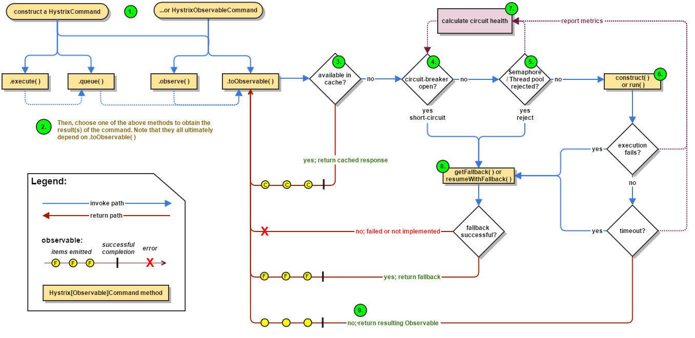
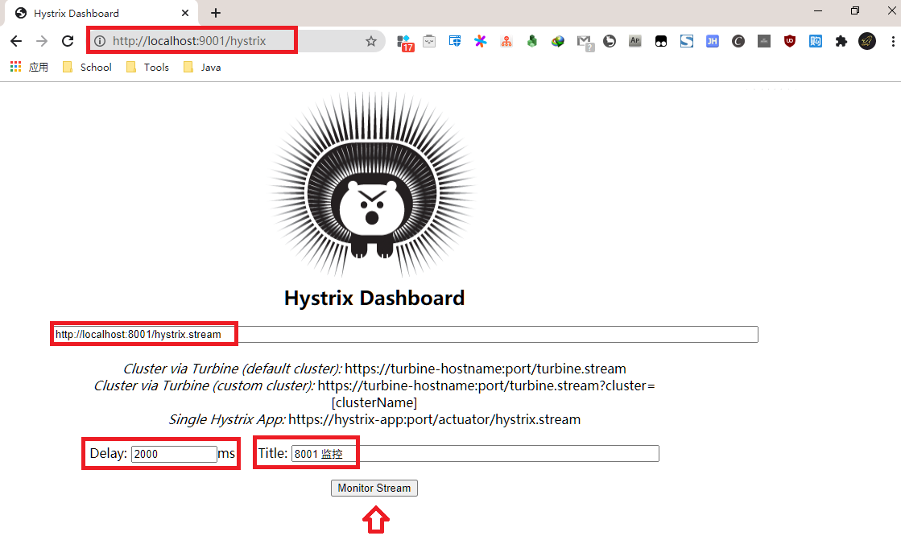
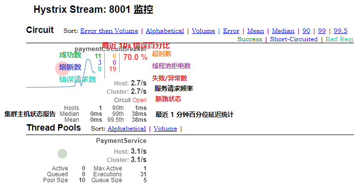

# Hystrix 断路器

[TOC]

## 一、概述

### （一）分布式系统面临的问题

复杂分布式系统中的应用程序有数十个依赖关系，每个依赖关系在某些时候不可避免的失败。

多个微服务之间调用时，假设 A 调B和C，B和C又调其他微服务，就是所谓的扇出。当扇出的链路上某个微服务响应时间过长或不可用对A的调用就会占用越来越多的资源，进而引起系统崩溃 ，所谓的**雪崩效应**。
### （二）Hystrix 含义
**Hystrix 是处理分布式系统的延迟和容错的开源库**，保证一个依赖出现问题时不会导致整体服务失败，避免级联故障，以提高分布式系统弹性。
断路器本身是一种开关装置，当某个服务单元发生故障后，通过断路器的故障监控，向调用方返回一个符合预期的可处理的备选响应，而不是长时间的等待或抛出调用方法无法处理的异常 。

详情可以查看 [Github](https://github.com/Netflix/Hystrix)。

### （三）重要概念
- 服务降级
    - 服务器忙，请稍后重试，不让客户端等待并立即返回一个友好的提示。

    - 以下会导致服务降级
        - 程序运行异常
        - 超时
        - 服务熔断触发服务降级
        - 线程池/信号量打满

- 服务熔断
    - 类比保险丝达到最大服务访问时，直接拒绝访问，拉闸限电，然后调用服务降级的方法返回友好提示。
    - 服务降级->进而熔断->恢复调用链路

- 服务限流

    秒杀高并发等操作，严禁一窝蜂过来拥挤，一秒N个有序进行。


## 二、高并发环境

首先针对模块 「hystrix-8001」进行自测，然后加入模块 「hystrix-80」从外部访问进行测试。

### （一）模块：cloud-provider-hystrix-payment8001

「注」：`cloud-provider-hystrix-payment8001` 模块以下简称为： `hystrix-8001`

首先将 7001 由集群模式换成单机版，修改 7001 的 pom 文件为：

```yaml
  service-url:
      # 设置与 eureka server交互的地址查询服务和注册服务都需要依赖这个地址
      # defaultZone: http://eureka7002.com:7002/eureka/
      # 测试 hystrix 时候换成单机版
      defaultZone: http://eureka7001.com:7001/eureka/
```

- 步骤一： `hystrix-8001` 的 pom 文件中引入 hystrix 依赖

    ```xml
    <dependency>
        <groupId>org.springframework.cloud</groupId>
        <artifactId>spring-cloud-starter-netflix-hystrix</artifactId>
    </dependency>
    ```

- 步骤二：hystrix-8001 的 application.yml 中配置如下

    ```yaml
    # 服务端口和服务名称
    server:
      port: 8001
    spring:
      application:
        name: cloud-provider-hystrix-payment
    
    # 注册到 Eureka 服务中心
    eureka:
      client:
        register-with-eureka: true
        fetch-registry: true
        service-url:
          # 这里使用单机版，也可以使用集群模式
         # defaultZone:  http://eureka7001.com:7001/eureka, http://eureka7002.com:7002/eureka
          defaultZone:  http://eureka7001.com:7001/eureka
    ```

- 步骤三：主启动类

    ```java
    @SpringBootApplication
    @EnableEurekaClient
    @EnableCircuitBreaker
    ```

- 步骤四：业务类

    提供 service 和 Controller，这里 Service 接口是实现类合并写了。

    其中 controller 中 `paymentInfoTrue()` 方法为正常方法，但是 `paymentInfoFalse()` 因为使用了 `sleep()`，所以访问时候会比较慢。

- 步骤五：测试
    先启动 7001，在启动 8001。测试两个方法，全部正常。首先通过 `http://eureka7001.com:7001/`可以看出 8001 已经正常注入了。

      访问链接为：`http://localhost:8001/payment/hystrix/ok/1` 和 `http://localhost:8001/payment/hystrix/timeout/1` 都可以正常访问。但是第一个访问没有任何延迟，第二个访问会有延迟。

### （二）使用 Jmeter 模拟高并发

步骤一：安装目录下的 「bin」=>「jmeter.sh」进行软件启动。

首先新建线程组：设置 200 个线程数， 100 次循环。

然后在该线程组上「右击」，选择「添加」，选择「取样器」，选择「HTTP请求」，设置路径为：`http://localhost:8001/payment/hystrix/ok/1` 点击发送之后。

`http://localhost:8001/payment/hystrix/ok/1`访问的时候也有延迟
上述还是8001单独测试，如果外部消费者80也来访问，那么消费者只能干等，最终导致消费端80不满意，服务端8001直接被拖死。

### （三）模块：cloud-consumer-feign-hystrix-order80

「注」：`cloud-consumer-feign-hystrix-order80` 模块以下简称 `hystrix-80`

80 调用 8001 用的是 feign，同时自身也加上 hystrix。hystrix 一般用在客户端侧，但是服务侧也可以使用。

- 步骤一：Pom 文件中主要就是 openfeign 和 hystrix

    ```xml
    <!-- openfeign -->
    <dependency>
        <groupId>org.springframework.cloud</groupId>
        <artifactId>spring-cloud-starter-openfeign</artifactId>
    </dependency>
    <dependency>
        <groupId>org.springframework.cloud</groupId>
        <artifactId>spring-cloud-starter-netflix-hystrix</artifactId>
    </dependency>
    ```

- 步骤二：yaml 文件如下

    ```yaml
    server:
      port: 80
    
    eureka:
      client:
        service-url:
          defaultZone: http://eureka7001.com:7001/eureka/
        register-with-eureka: false
    ```

- 步骤三：主启动类

    ```java
    @SpringBootApplication
    @EnableFeignClients
    @EnableHystrix
    ```

- 步骤四：业务代码 service 和 controller

- 步骤五：测试

    正常情况下

    - 自测 8001：` http://localhost:8001/payment/hystrix/ok/1`  和 `http://localhost:8001/payment/hystrix/timeout/1`成功
    - 80 访问 8001：`http://localhost/consumer/payment/hystrix/ok/1` 正常，访问 `http://localhost/consumer/payment/hystrix/timeout/1` 则是报错（正常的，因为没有配置超时时间）。

    此时如果将上面的 Jmeter 流量同时打到 8001 上，则 80 访问 ok 地址同样会变慢。

### （四）问题解决方案

微服务中问题一般总结为：运行时异常、超时、宕机。

- 超时导致服务器变慢（转圈）->超时不再等待

- 出错（宕机或程序运行时出错）->出错要有兜底

- 解决
    - 8001 超时，调用者 80 不能一直等待，必须有服务降级

    - 服务 8001 宕机，调用者 80 不能一直等待，必须有服务降级
    - 服务 8001 OK ，调用者自己出故障或有自我要求（自己的等待时间小于服务提供的时间。），自己降级处理

## 三、服务降级

降级分别在 hystrix-8001 和 hystrix-80 端都做。其中 hystrix-8001 的降级要处理自身超时问题和运行异常报错问题。

### （一）8001 自身降级处理

#### 1.针对 8001 自身超时问题

原有 service 层代码：

```java
package com.gjxaiou.springcloud.service;
import org.springframework.stereotype.Service;
import java.util.concurrent.TimeUnit;

@Service
public class PaymentService {

    /**
     *  服务降级
     * 分别提供一个正常访问和一个访问出错(这里是访问很慢)的方法
     */
    public String paymentInfoTrue(Integer id){
        return "线程池：" + Thread.currentThread().getName() + " paymentInfoTrue, id: " +id + " 访问成功方法" ;
    }

    // 故意耗时 5s
    public String paymentInfoFalse(Integer id){
        int timeNum = 5;
        try {
            TimeUnit.SECONDS.sleep(timeNum);
        } catch (InterruptedException e) {
            e.printStackTrace();
        }
        return "线程池：" + Thread.currentThread().getName() + " paymentInfoTrue, id: " +id + " 访问失败方法，共耗时：" + timeNum ;
    }
}
```

**需求**：`paymentInfoFalse()` 方法目前执行时间为 5s，假设如果执行小于 3s 则正常，超过则要降级。

对应解决：设置自身调用超时时间的峰值，峰值类可以正常运行，超过了需要有**兜底**的方案处理，做服务降级 fallback。对应代码修改如下：

```java
package com.gjxaiou.springcloud.service;

import com.netflix.hystrix.contrib.javanica.annotation.HystrixCommand;
import com.netflix.hystrix.contrib.javanica.annotation.HystrixProperty;
import org.springframework.stereotype.Service;

import java.util.concurrent.TimeUnit;

@Service
public class PaymentService {

    // 完全正常的方法不考虑
    public String paymentInfoTrue(Integer id) {
        return "线程池：" + Thread.currentThread().getName() + " paymentInfoTrue, id: " + id + " 访问成功方法";
    }


    // 含义：设置超时限定时间为： 3s，超时就不调用这个方法，反而调用 paymentInfoFalseHandler 处理。
    @HystrixCommand(fallbackMethod = "paymentInfoFalseHandler", commandProperties = {
            @HystrixProperty(name ="execution.isolation.thread.timeoutInMilliseconds",  value = "3000")
    })
    // 故意耗时 5s
    public String paymentInfoFalse(Integer id) {
        int timeNum = 5;
        try {
            TimeUnit.SECONDS.sleep(timeNum);
        } catch (InterruptedException e) {
            e.printStackTrace();
        }
        return "线程池：" + Thread.currentThread().getName() + " paymentInfoFalse, id: " + id + " 访问失败方法，共耗时：" + timeNum;
    }

    // 提供 fallback 方法
    public String paymentInfoFalseHandler(Integer id) {
        return "线程池：" + Thread.currentThread().getName() + " 系统繁忙，使用 paymentInfoFalseHandler 处理, " + "id: " + id + " 访问失败备份方法";
    }
}
```
然后主启动类上添加注解：`@EnableCircuitBreaker`

**测试：**

访问自身：`http://localhost:8001/payment/hystrix/timeout/1`	结果输出为：`线程池：HystrixTimer-1 系统繁忙，使用 paymentInfoFalseHandler 处理, id: 1 访问失败备份方法` 

#### 2.针对 8001 运行异常

即如果 service 中含有会出现运行时异常的方法，如下面的 `int a = 10 / 0;`，同样使用上面的配置测试结果为：无论是运行异常还是超时都可以使用兜底策略。
```java
@HystrixCommand(fallbackMethod = "paymentInfo_TimeoutHandler",commandProperties = {
        @HystrixProperty(name="execution.isolation.thread.timeoutInMilliseconds",value = "3000")
    })
    public String paymentInfo_Timeout(Integer id){
        int a = 10/0;
//        try {
//            TimeUnit.SECONDS.sleep(5);
//        } catch (InterruptedException e) {
//            e.printStackTrace();
//        }
        return "线程池："+Thread.currentThread().getName()+"Timeout"+id;
    }

    // 提供 fallback 方法
    public String paymentInfoFalseHandler(Integer id) {
        return "线程池：" + Thread.currentThread().getName() + " 系统繁忙，使用 paymentInfoFalseHandler 处理, " + "id: " + id + " 访问失败备份方法";
    }
```


### （二）80 订单侧降级保护

上面 8001 做的是如果超过 5s 则降级，是一种自我保护，这里是 80 调用 8001 时候自身做的降级保护，如果 80 端要求是 1.5s 内正常，超过就降级处理。

**需求修改**：修改设置参数：8001 默认运行 3s，自身设置超过 5s 则不行，但是 80 端要求 1.5s

==既可以配在客户端也可以配在服务端，一般建议放在客户端==
- 80 侧 application.yml 中新增以下内容从而开启 hystrix 保护

    ```yaml
    feign:
      hystrix:
        enabled: true
    ```

- controller 修改 
    改为同 8001 的 service 一样

  ```java
  package com.gjxaiou.springcloud.controller;
  
  import com.gjxaiou.springcloud.service.PaymentHystrixService;
  import com.netflix.hystrix.contrib.javanica.annotation.HystrixCommand;
  import com.netflix.hystrix.contrib.javanica.annotation.HystrixProperty;
  import lombok.extern.slf4j.Slf4j;
  import org.springframework.web.bind.annotation.GetMapping;
  import org.springframework.web.bind.annotation.PathVariable;
  import org.springframework.web.bind.annotation.RestController;
  
  import javax.annotation.Resource;
  
  @RestController
  @Slf4j
  public class OrderHystrixController {
      @Resource
      PaymentHystrixService paymentHystrixService;
  
      // 正常方法不用考虑
      @GetMapping("/consumer/payment/hystrix/ok/{id}")
      String paymentInfoOK(@PathVariable("id") Integer id) {
          String result = paymentHystrixService.paymentInfoOK(id);
          log.info("feign-hystrix-order80=> paymentInfoOK");
          return result;
      }
  
  
      @GetMapping("/consumer/payment/hystrix/timeout/{id}")
      @HystrixCommand(fallbackMethod="paymentInfoTimeoutFallback",commandProperties={
           @HystrixProperty(name="execution.isolation.thread.timeoutInMilliseconds",
                            value= "1500")
      })
      String paymentInfoTimeout(@PathVariable("id") Integer id) {
          String result = paymentHystrixService.paymentInfoTimeout(id);
          log.info("调用 feign-hystrix-order80=> paymentInfoTimeout");
          return result;
      }
  
      String paymentInfoTimeoutFallback(@PathVariable("id") Integer id){
          log.info("调用 feign-hystrix-order80=> paymentInfoTimeoutFallback");
          return "消费者 80，对方 8001 系统繁忙，请等待一段时间再试或者检查自身是否出错";
      }
  }
  
  ```

- 步骤三：主类添加 `@EnableHystrix` 注解

注意：降级处理方法参数列表必须跟异常方法一样

**测试**：访问 80 的 `http://localhost/consumer/payment/hystrix/timeout/1` 得到的是 80 端的 fallback 方法返回，因为 8001 自身是不满足降级需求的，但是 80 访问 8001 需要 3s，要求为 1.5s，所以 80 端会进行降级。

### （三）全面服务降级

上面的配置方式存在两个问题

- 每一个方法都需要配置一个降级方法

- 和业务代码在一起

#### 解决方案
- 针对第一个问题

    解决方案：整个类上标注：`@DefaultProperties(defaultFallback = "paymentGlobalFallback")`指定全局默认 fallback 方法。如果配置了 fallbackMethod 就用自己指定的，否则针对所有 `@HystrixCommand` 标注的方法对应全局默认 fallback 方法

    ```java
    package com.gjxaiou.springcloud.controller;
    
    import com.gjxaiou.springcloud.service.PaymentHystrixService;
    import com.netflix.hystrix.contrib.javanica.annotation.DefaultProperties;
    import com.netflix.hystrix.contrib.javanica.annotation.HystrixCommand;
    import lombok.extern.slf4j.Slf4j;
    import org.springframework.web.bind.annotation.GetMapping;
    import org.springframework.web.bind.annotation.PathVariable;
    import org.springframework.web.bind.annotation.RestController;
    
    import javax.annotation.Resource;
    
    /**
     * @Author GJXAIOU
     * @Date 2020/11/30 20:48
     */
    @RestController
    @Slf4j
    // 如果配置了 fallbackMethod 就用指定了，否则针对 @HystrixCommand 标注的方法对应全局默认 fallback 方法
    @DefaultProperties(defaultFallback = "paymentGlobalFallback")
    public class OrderHystrixController {
        @Resource
        PaymentHystrixService paymentHystrixService;
    
        @GetMapping("/consumer/payment/hystrix/ok/{id}")
        String paymentInfoOK(@PathVariable("id") Integer id) {
            String result = paymentHystrixService.paymentInfoOK(id);
            log.info("feign-hystrix-order80=> paymentInfoOK");
            return result;
        }
    
    
        @GetMapping("/consumer/payment/hystrix/timeout/{id}")
    //    @HystrixCommand(fallbackMethod = "paymentInfoTimeoutFallback", commandProperties = {
    //            @HystrixProperty(name = "execution.isolation.thread.timeoutInMilliseconds", value =
    //                    "1500")
    //    })
        @HystrixCommand
        String paymentInfoTimeout(@PathVariable("id") Integer id) {
            String result = paymentHystrixService.paymentInfoTimeout(id);
            log.info("调用 feign-hystrix-order80=> paymentInfoTimeout");
            return result;
        }
    
        String paymentInfoTimeoutFallback(@PathVariable("id") Integer id) {
            log.info("调用 feign-hystrix-order80=> paymentInfoTimeoutFallback");
            return "消费者 80，对方 8001 系统繁忙，请等待一段时间再试或者检查自身是否出错";
        }
    
        // 设置全局 fallback
        public String paymentGlobalFallback() {
            return "80 全局性的fallback";
        }
    }
    ```

- 第二个问题：和业务代码进行解耦

    实现功能：客户端调用服务端的时候，服务端宕机或者关闭了。

    因为 controller 层调用 service 层，所以新建一个实现类实现 service 接口，对所有方法进行重写统一进行处理。**不在需要在 Controller 层处理**。

    - 步骤一：针对需要进行服务降级的接口提供一个实现类，提供降级处理过程

        ```java
        package com.gjxaiou.springcloud.service;
        import org.springframework.stereotype.Component;
        
        @Component
        public class PaymentFallbackService implements PaymentHystrixService{
            @Override
            public String paymentInfoOK(Integer id) {
                return "PaymentFallbackService => paymentInfoOK => Fallback";
            }
        
            @Override
            public String paymentInfoTimeout(Integer id) {
                return "PaymentFallbackService => paymentInfoTimeout => Fallback";
            }
        }
        ```

    - 步骤二：针对需要降级的接口使用 `@FeignClient` 指定上述的降级处理类

        ```java
        package com.gjxaiou.springcloud.service;
        
        @Component
        @FeignClient(value = "CLOUD-PROVIDER-HYSTRIX-PAYMENT", fallback = PaymentFallbackService.class)
        
        public interface PaymentHystrixService {
            // 这里直接复制服务提供者 8001 controller 中接口即可
            @GetMapping("/payment/hystrix/ok/{id}")
            String paymentInfoOK(@PathVariable("id") Integer id);
        
            @GetMapping("/payment/hystrix/timeout/{id}")
            String paymentInfoTimeout(@PathVariable("id") Integer id);
        }
        ```

    - 步骤三：测试在 8001 内加异常，或使 8001 宕机 ，返回异常处理

        首先访问：`http://localhost/consumer/payment/hystrix/ok/1` 正常访问，然后关闭 8001

        再次访问上面的连接返回：`PaymentFallbackService => paymentInfoOK => Fallback`即调用了降级的方法。

## 四、服务熔断
类比保险丝，达到最大访问后直接拒绝访问，拉闸限电，然后调用服务降级。当检测==到该节点微服务调用正常后，恢复调用链路==。即当失败的调用达到一定阈值，缺省是5s内20次调用失败，就会启动熔断机制。熔断机制的注解是：`@HystrixCommand`。具体介绍见[博客](https://martinfowler.com/bliki/CircuitBreaker.html)。

### （一）熔断机制概述

**熔断机制是应对雪崩效应的一种微服务链路保护机制**。当扇出链路的某个微服务出错不可用或者响应时间太长时候，会进行服务的降级，进而熔断该结点微服务的调用，快速返回错误的响应信息。

**当检测到该结点微服务调用响应正常后，恢复调用链路**。

- 调用失败会触发降级，而降级会调用 fallback 返回
- 无论如何降级的流程一定会先调用正常的方法再调用 fallback 方法
- 加入单位时间内调用失败次数过多，也就是降级次数过多（缺省是 5s 内 20 次调用失败）就会触发熔断。
- 熔断之后会跳过正常方法直接调用 fallback 方法。

**熔断的过程**：见：https://github.com/Netflix/Hystrix/wiki/How-it-Works

The precise way that the circuit opening and closing occurs is as follows:

- Assuming the volume across a circuit meets a certain threshold (HystrixCommandProperties.circuitBreakerRequestVolumeThreshold())...
- And assuming that the error percentage exceeds the threshold error percentage (HystrixCommandProperties.circuitBreakerErrorThresholdPercentage())...
- Then the circuit-breaker transitions from CLOSED to OPEN.
- While it is open, it short-circuits all requests made against that circuit-breaker.
- After some amount of time (HystrixCommandProperties.circuitBreakerSleepWindowInMilliseconds()), the next single request is let through (this is the HALF-OPEN state). If the request fails, the circuit-breaker returns to the OPEN state for the duration of the sleep window. If the request succeeds, the circuit-breaker transitions to CLOSED and the logic in 1. takes over again.

### （二）8001 熔断实践

这里仅仅是 8001 进行自测，没有通过 80 进行调用，以下修改均针对 `hystrix-8001`。

- 在 Service 层进行服务熔断处理，同时服务熔断的方法也需要指定 Fallback 方法。

    ```java
    package com.gjxaiou.springcloud.service;
    
    @Service
    public class PaymentService {
        /**
         * 服务熔断
         */
        // Hystrix 的全部属性在类：HystrixCommandProperties 中
      @HystrixCommand(fallbackMethod = "paymentCircuitBreakerHandler", commandProperties={
          // 是否开启断路器
          @HystrixProperty(name = "circuitBreaker.enabled", value = "true"),
          // 请求次数
          @HystrixProperty(name = "circuitBreaker.requestVolumeThreshold", value = "10"),
          // 时间窗口期：经过多长时间后恢复一次尝试
          @HystrixProperty(name = "circuitBreaker.sleepWindowInMilliseconds", value = "10000"),
          // 失败率阈值
          @HystrixProperty(name = "circuitBreaker.errorThresholdPercentage", value = "60"),
        })
        public String paymentCircuitBreaker(@PathVariable("id") Integer id) {
            if (id < 0) {
                throw new RuntimeException("id 不能为负数");
            }
            String simpleUUID = IdUtil.simpleUUID();
    
            return Thread.currentThread().getName() + " 调用成功，流水号为：" + simpleUUID;
        }
    
        // 提供对应的服务降级 fallback 方法
        public String paymentCircuitBreakerHandler(@PathVariable("id") Integer id) {
            return "id 不能为负数，请稍后再试，This is fallback method.";
        }
    }
    ```

- controller 提供一个访问方法，这里就是直接调用 service 进行处理。

    ```java
    /**
         * 服务熔断
         */
    @GetMapping("/payment/circuit/{id}")
    public String paymentCircuitBreaker(@PathVariable("id") Integer id) {
        String result = paymentService.paymentCircuitBreaker(id);
        log.info("result: " + result);
        return result;
    }
    ```

- 测试

      首先启动 7001 和 8001，访问   `http://localhost:8001payment/circuit/1`  返回结果为：`hystrix-PaymentService-1 调用成功，流水号为：de734206603641b1948d3d6182c9b9f4`。访问  `http://localhost:8001payment/circuit/-1` 返回结果为：`id 不能为负数，请稍后再试，This is fallback method.`
        
      **一直多次输入id为负数，达到失败率后即使输入 id 为正数也进入错误页面，等一会才可以返回正确结果。**

### （三）总结

完整的服务熔断流程见 [Github](https://github.com/Netflix/Hystrix/wiki/How-it-Works)。



#### 1.熔断状态类型
- 熔断打开
    请求不再进行调用当前服务，内部设有时钟一般为 MTTR，当打开时长达时钟则进入半熔断状态

- 熔断关闭
    熔断关闭不会对服务进行熔断

- 熔断半开
    根据规则调用当前服务，符合规则恢复正常，关闭熔断

#### 2.熔断打开时机
涉及三个参数：时间窗，请求总阈值，错误百分比阈值
- 快照时间窗：默认为最近的10s

- 请求总数阈值：必须满足请求总阈值才有资格熔断。默认为20。意味着在10s内，如果命令调用次数不足20次，即使所有请求都超时或其他原因失败断路器都不会打开

- 错误百分比阈值：在快照时间窗内请求总数超过阈值，且错误次数占总请求次数的比值大于阈值，断路器将会打开


## 五、图形化展示Dashboard

### 搭建模块：cloud-consumer-hystrix-dashboard9001
- 步骤一：Pom 中新增 dashboard 依赖

    ```xml
    <dependency>
        <groupId>org.springframework.cloud</groupId>
        <artifactId>spring-cloud-starter-netflix-hystrix-dashboard</artifactId>
    </dependency>
    ```

- 步骤二： application.yml 配置如下

    ```yaml
    server:
      port: 9001
    
    # 如果页面一直为 Loading，则开启这个选项
    hystrix:
      dashboard:
        proxy-stream-allow-list: "*"
    
    # 注册进入 Eureka
    eureka:
      client:
        service-url:
          defaultZone: http://eureka7001.com:7001/eureka
    ```

- 步骤三：启动类上加上 `@EnableHystrixDashboard` 注解。

- 项目测试
    启动模块之后，访问`http://localhost:9001/hystrix`有页面即为成功。

### 监控服务

- 步骤一：这里要监控 80、8001/8002，受监控的模块依赖中必须有：

    ```xml
    <!--监控-->
    <dependency>
        <groupId>org.springframework.boot</groupId>
        <artifactId>spring-boot-starter-actuator</artifactId>
    </dependency>
    ```

- 步骤二：在受监控模块的主类中增加如下方法或者在 yaml 文件中进行将配置开启受监控，这里以 8001 为例。

    - 受监控模块的主类中进行硬编码

        ```java
        @Bean
        public ServletRegistrationBean getServlet(){
            HystrixMetricsStreamServlet streamServlet = new HystrixMetricsStreamServlet();
            ServletRegistrationBean registrationBean = new ServletRegistrationBean(streamServlet);
            registrationBean.setLoadOnStartup(1);
            registrationBean.addUrlMappings("/hystrix.stream");
            registrationBean.setName("HystrixMetricsStreamServlet");
            return registrationBean;
        }
        ```

    - 在受监控模块的 yaml 中增加如下配置

        ```yaml
        management:
          endpoints:
            web:
              exposure:
                include: hystrix.stre
        ```

- 测试过程：

    首先需要启动一个或者多个 Eureka，同时这里因为是 9001 监控 8001，所以两者均需要启动。

    然后在监控页面：`localhost:9001/hystrix` 中配置监控服务为：`http://localhost:8001/hystrix.stream` ，delay 可以配置为 2000，Title 随便配置，然后点击 「monitor Stream」。

    

分别通过上面两个路径：`http://localhost:8001payment/circuit/1` 和 `http://localhost:8001payment/circuit/- 1` 访问 8001 的。通过页面就可以看到访问的变化

