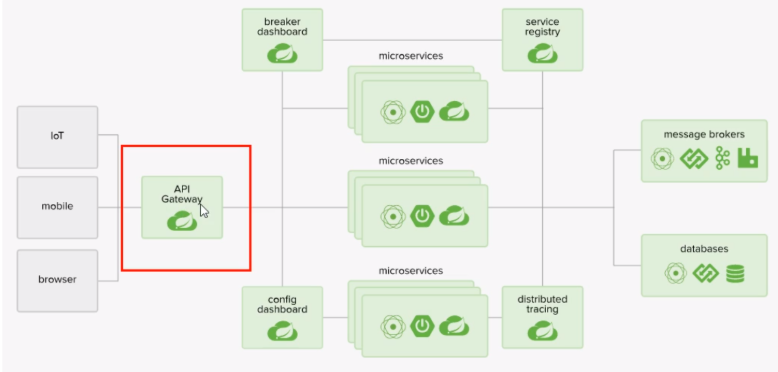
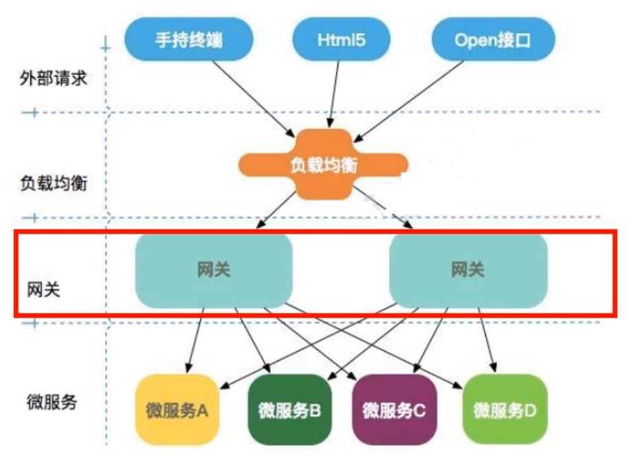
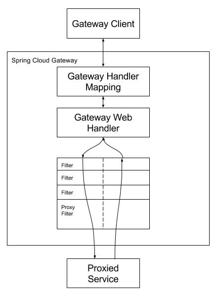
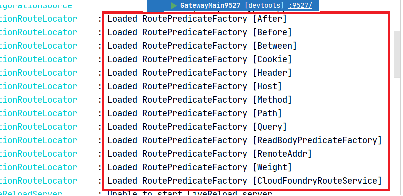

# Gateway 服务网关

[TOC]

## 一、概述

基于异步非阻塞模型进行开发。详情见[官网文档](https://cloud.spring.io/spring-cloud-static/spring-cloud-gateway/2.2.2.RELEASE/reference/html/)。

### （一）项目结构





### （二）特性

- 基于 Spring Framework5， Project Reactor 和 SpringBoot 2.0 进行构建

- 动态路由：能够匹配任何请求属性
- 可以对路由指定 Predicate（断言）和 Filter（过滤器）
- 集成 Hystrix 的断路器功能
- 集成 Spring Cloud 服务发现功能
- 易于编写的 Predicate（断言） 和 Filter（过滤器）
- 请求限流功能
- 支持路径重写

### （三）Zuul 和 Gateway 区别

- Zuul 1.x 是一个基于**阻塞 I/O 的 API 网关**
- Zuul 1.x 基于 Servlet 2.5 **使用阻塞架构**，它不支持任何长连接（如 WebSocket）。整体的设计模式和 Nginx 相似，每次 I/O 操作都是从工作线程中选取一个执行，请求线程被阻塞到工作线程完成，但是差别在于 Nginx 用 C++ 实现， Zuul 使用 Java 实现，而 JVM 本身会有第一次加载较慢的情况，使得 Zuul 性能相对较差。
- Zuul 2.x 基于 Netty 非阻塞和支持长连接，但是尚未完成。
- Spring Cloud Gateway 建立在 Spring Framework 5、Project Reactor 和 Spring Boot2 之上。**使用非阻塞 API**。
- Spring Cloud Gateway 支持 WebSocket，与 Spring 结合更好。


### （四）三大核心概念

- Route（路由）
    网关的基本构建块。它由 ID，目标 URI，一系列的断言和过滤器来界定。如果所有断言为 true，则匹配路由。

- Predicate（断言）
    这是 Java 8 函数式接口中的断言。输入类型是 Spring FrameworkServerWebExchange。使得**可以匹配HTTP 请求中的所有内容**，例如 请求头或参数。

- Filter（过滤器）
    这些是使用特定工厂构造的 Spring FrameworkGatewayFilter 实例。在这里，您可以在发送下游请求之前或之后修改请求和响应。

### （五）工作流程


Clients make requests to Spring Cloud Gateway. If the Gateway Handler Mapping determines that a request matches a route, it is sent to the Gateway Web Handler. This handler runs the request through a filter chain that is specific to the request. The reason the filters are divided by the dotted（遍布的） line is that filters can run logic both before and after the proxy request is sent. All “pre” filter logic is executed. Then the proxy request is made. After the proxy request is made, the “post” filter logic is run.

## 二、路由实践

**目标**：

微服务：`cloud-provider-payment8001` 中的 Controller 中提供了两个方法：`http://localhost:8001/payment/get/{id}` 和 `http://localhost:8001/payment/lb`。但是目前我们不想再暴露 8001 端口，只暴露 Gateway 的 9527 端口来实现访问到 8001 ，需要进行路由。

### 构建 cloud-gateway-gateway9527

- pom 文件中新增 gateway 依赖

    「注意」：不要添加 web 的依赖，因为与 gateway 里的 web flux 冲突

    ```xml
    <dependency>
        <groupId>org.springframework.cloud</groupId>
        <artifactId>spring-cloud-starter-gateway</artifactId>
    </dependency>
    ```

- 在 9527 的 application.yml  中配置如下路由规则

    ```yaml
    server:
      port: 9527
    
    spring:
      application:
        # 设定服务名称
        name: cloud-gateway
      # 路由规则映射
      cloud:
        gateway:
          routes: # 可以配置多个路由
            - id: payment_routh1   # 路由的 ID，没有固定规则但是要求唯一，建议配合服务名称
              uri: http://localhost:8001  # 匹配后提供服务的路由地址
              predicates:
                - Path=/payment/get/**   # 断言：路径相匹配的进行路由
    
            - id: payment_routh2
              uri: http://localhost:8001
              predicates:
                - Path=/payment/lb/**
    
    eureka:
      instance:
        hostname: cloud-gateway-service
        # 服务提供者 provider 注册进 Eureka 服务列表中，网关本身也是一个微服务
      client:
        service-url:
          register-with-eureka: true
          fetch-registry: true
          defaultZone: http://eureka7001.com:7001/eureka
    ```

    或者使用硬编码的方式来实现路由规则映射：

    ```java
    package com.gjxiaou.springcloud.config;
    
    import org.springframework.cloud.client.circuitbreaker.EnableCircuitBreaker;
    import org.springframework.cloud.gateway.route.RouteLocator;
    import org.springframework.cloud.gateway.route.builder.RouteLocatorBuilder;
    import org.springframework.context.annotation.Bean;
    import org.springframework.context.annotation.Configuration;
    
    /**
     * @Author GJXAIOU
     * @Date 2020/12/1 16:19
     */
    @Configuration
    public class GatewayConfig {
        @Bean
        public RouteLocator customRouteLocator(RouteLocatorBuilder routeLocatorBuilder) {
            RouteLocatorBuilder.Builder routes = routeLocatorBuilder.routes();
            routes.route("test_routh", item -> item.path("/guonei").uri("http://news.baidu" +
                    ".com/guonei"));
            return routes.build();
        }
    }
    ```

- 自定义启动类，需要加上下面三个注解

    ```java
    @SpringBootApplication
    @EnableEurekaClient
    @EnableDiscoveryClient // 不一定需要
    ```

- 测试

    先后启动 7001、cloud-provider-payment8001、9527。

    添加网关之前需要通过：`http://localhost:8001/payment/get/1` 访问，添加网关配置之后只需要通过 `http://localhost:9527/payment/get/1` 可以访问8001中的信息,不再暴露 8001 的端口。

    同样通过硬编码也可以实现路由功能：访问 `localhost:9527/guonei` 就会跳转到 `http://news.baidu.com/guonei`


## 三、动态路由

上述路由路径都是固定的，即`http://localhost:8001`，如果是集群模式需要实现负载均衡功能。

默认情况下 Gateway 会根据注册中心注册的服务列表，以注册中心上的微服务名为路径创建**动态路由进行转发，从而实现动态路由的功能**。

### 修改步骤：application.yml

- 步骤一：在 9527 的 application.yml 中开启从注册中心动态创建路由功能。
- 步骤二：设置每个路由地址（uri) 为服务名称。

修改之后完整的 yaml 文件为：

```yaml
spring:
  application:
    name: cloud-gateway
  # 路由规则映射
  cloud:
    gateway:
      # 步骤一：开启从服务在注册中心动态创建路由的功能
      discovery:
        locator:
          enabled: true
      routes: # 可以配置多个路由
        - id: payment_routh1   # 路由的 ID，没有固定规则但是要求唯一，建议配合服务名称
          # 步骤二：使用服务名称代替具体的服务
          # uri: http://localhost:8001  # 匹配后提供服务的路由地址
          # 使用服务名称代替具体的服务， lb 表示负载均衡
          uri: lb://cloud-payment-service
          predicates:
            - Path=/payment/get/**   # 断言：路径相匹配的进行路由

        - id: payment_routh2
          # uri: http://localhost:8001
          # 使用服务名称代替具体的服务， lb 表示负载均衡
          uri: lb://cloud-payment-service
          predicates:
            - Path=/payment/lb/**
```

- 测试：

分别启动 7001/cloud-provider-payment8001/cloud-provider-payment8002/9527 然后访问：`http://localhost:9527/payment/lb` 或者 `http://localhost:9527/payment/get/1` 都可以看出默认是在 8001 和 8002 进行轮询提供服务。


## 四、Predicate

根据上面的 yaml 文件可以看出，我们可以自定义断言规则。

常见的断言规则在 9527 模块启动的时候在控制台上进行了输出（如下图），所有的配置选项[看官网文档](https://cloud.spring.io/spring-cloud-static/spring-cloud-gateway/2.2.2.RELEASE/reference/html/#the-between-route-predicate-factory)。



「测试工具说明」直接在命令行 cmd 中使用 Curl，如 `curl http://localhost:9527/payment/get/1` 本质上就是一个 get 请求。

- After

    ```yaml
    # 表示在该时间之后才可以使用
    - After=2020-05-26T17:07:03.043+08:00[Asia/Shanghai]
    ```

    获取当前时区的时间

    ```java
    import java.time.ZonedDateTime;
    public class Main {
        public static void main(String[] args) {
            ZonedDateTime nowTime = ZonedDateTime.now();
            System.out.println(nowTime);
        }
    }
    // 2020-12-01T20:45:49.724+08:00[Asia/Shanghai]
    ```

- Before

    ```yaml
    # 之前
    - Before=2017-01-20T17:42:47.789-07:00[America/Denver]
    ```

- Between

    ```yaml
    # 之间
    - Between=2017-01-20T17:42:47.789-07:00[America/Denver], 2017-01-21T17:42:47.789-07:00[America/Denver]
    ```

- Cookie

    需要两个参数：Cookie name 和一个正则表达式，路由规则通过获取对应的 Cookie name 值和正则表达式去匹配，如果匹配上就会执行路由反之不执行。

    ```yaml
    # 查看有没有指定kv的cookie
    - Cookie=username,gjxaiou
    ```

    测试格式：`curl http://localhost:9527/payment/get/1 --cookie "username=gjxaiou"`

- Header

    同上，两个参数：属性名称和正则表达式

    ```yaml
    # 请求头，跟cookie一样指定kv键值对，示例如下：表示请求头必须为：X-Request-Id,值必须为整数
    - Header=X-Request-Id, \d+
    ```

     测试格式：`curl http://localhost:9527/payment/get1 -H "X-Request-Id:1234"`

- Host

    接收一组参数，一组匹配的域名列表，这个模板是一个 ant 分割的模板，用 `.` 号作为分隔符。它公国参数中的主机地址作为匹配规则。

    ```yaml
    - Host=**.somehost.org,**.antherhost.org
    ```

    测试格式：`curl http://localhost:9527/payment/get1 -H "Host:www.somehost.org"`

- Method

    ```yaml
    - Method=GET
    ```

- Path

- Query

- ReadBodyPredicateFactory

- RemoteAddr

- Weight

- CloudFoundryRouteService


## 五、过滤器 Filter

路由过滤器可以用于修改**进入的 HTTP 请求和返回的 HTTP 响应**，路由过滤器只能指定路由进行使用。

Spring Cloud Gateway 内置了多种路由过滤器，他们都由 GatewayFilter 的工厂类来产生。可以分为两类：

- 单一过滤器

    共 31 种，全部见官网：[官网](https://cloud.spring.io/spring-cloud-static/spring-cloud-gateway/2.2.2.RELEASE/reference/html/#gatewayfilter-factories)

- 全局过滤器

### 自定义过滤器

在「全局日志记录」、「统一网关鉴权」等需求方面需要自定义过滤器，自定义步骤如下：

在 9527 模块中自定义类实现接口：GlobalFilter 和 Ordered

```java
package com.gjxiaou.springcloud.filter;

import lombok.extern.slf4j.Slf4j;
import org.springframework.cloud.gateway.filter.GatewayFilterChain;
import org.springframework.cloud.gateway.filter.GlobalFilter;
import org.springframework.core.Ordered;
import org.springframework.http.HttpStatus;
import org.springframework.stereotype.Component;
import org.springframework.web.server.ServerWebExchange;
import reactor.core.publisher.Mono;

import java.util.Date;

/**
 * @Author GJXAIOU
 * @Date 2020/12/1 19:04
 */
@Component
@Slf4j
public class MyLogGatewayFilter implements GlobalFilter, Ordered {
    // 过滤规则：访问必须带着某个用户名
    @Override
    public Mono<Void> filter(ServerWebExchange exchange, GatewayFilterChain chain) {
        log.info("进入 Gateway 的 Filter 中......" + new Date());
        String userName = exchange.getRequest().getQueryParams().getFirst("uname");
        if (userName == null) {
            log.info("用户名为 null，非法用户........");
            exchange.getResponse().setStatusCode(HttpStatus.NOT_ACCEPTABLE);
            return exchange.getResponse().setComplete();
        }
        // 通过则放行
        return chain.filter(exchange);
    }

    @Override
    public int getOrder() {
        // 加载该过滤器的优先级，值越小越优先。
        return 0;
    }
}
```

**测试**：如果访问：`http://localhost:9527/payment/lb?uname=zhangsan` 则可以正常访问。但是如果后面没有 `uname`则报错