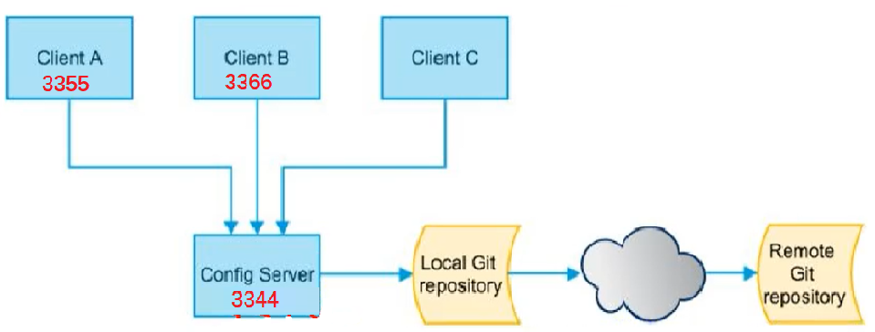

# Config 分布式配置中心

[TOC]


## 一、概述

SpringCloud Config 为微服务架构中的微服务**提供集中化的外部配置支持**，将不同微服务应用提供一个中心化外部配置。

分布式系统面临的配置问题
每建一个微服务都需要一次 yaml 配置，例如 10 个微服务访问相同的数据库，如果数据库名更改了，要改十次。

## 二、服务端配置与整合

- **服务端也称为分布式配置中心**，它是一个独立的微服务应用，用来连接配置服务器 并为客户端提供配置信息。加密解密信息接口。
- 客户端则是通过指定的配置中心来管理应用资源。并在启动的时候从配置中心获取和加载配置信息配置服务器默认采用 git 来存储配置信息。这样有助于对环境配置进行版本管理，并且可以通过 git 客户端方便管理和配置服务内容。
- 将配置信息以 REST 接口的形式暴露。通过 post、 curl 刷新。



### （一）配置中心模块：cloud-config-center-3344

前提：在 GitHub 上新建仓库：[springcloud-config](https://github.com/GJXAIOU/springcloud-config)

- 步骤一： pom 依赖

    ```xml
    <dependency>
        <groupId>org.springframework.cloud</groupId>
        <artifactId>spring-cloud-config-server</artifactId>
    </dependency>
    ```

- 步骤二：yaml 文件

    ```yaml
    server:
      port: 3344
    
    spring:
      application:
        name: cloud-config-center
      cloud:
        config:
          server:
            git:
              #Github上的git仓库名字
              uri: https://github.com/GJXAIOU/springcloud-config.git
              ##搜索目录.这个目录指的是github上的目录
              search-paths:
                - springcloud-config
          ##读取分支
          label: master
    
    # 服务注册到 Eureka
    eureka:
      client:
        service-url:
          defaultZone: http://eureka7001.com:7001/eureka/
    ```

- 步骤三：主启动类

    ```java
    @SpringBootApplication
    @EnableConfigServer
    ```

- 步骤四：修改 Host 文件

    添加记录： `127.0.0.1 config-3344.com`

- 测试

    使用  http://config-3344.com:3344/master/config-dev.yml 可以访问到 Github 上面仓库中该 `config-dev.yml` 文件的内容。

备注：配置读取规则

即 Github 上文件名称与路径：推荐规则为：`/{label}/{application}-{profile}.yml`

例如上面的路径。默认是 master 分支。

### （二）客户端模块：cloud-config-client3355

实现从 3344 那里读取配置文件， 3344 是从 github 上直接读取的文件

- 步骤一：Pom 文件，这里是 Config 即客户端，上面是 server

    ```xml
    <!-- 注意与上述不同：config 客户端 -->
    <dependency>
        <groupId>org.springframework.cloud</groupId>
        <artifactId>spring-cloud-starter-config</artifactId>
    </dependency>
    ```

- 步骤二：yaml 文件，这里是 bootstrap.yml

    ```yaml
    server:
      port: 3355
    
    spring:
      application:
        name: config-client
      cloud:
        # config 客户端配置
        config:
          # 分支名称
          label: master
          # 配置文件名称
          name: config
          # 后缀名称。三个综合就是 master 分支上的 config-dev.yml 的配置文件被读取。
          profile: dev
          # 配置中心地址
          uri: http://localhost:3344
    
    # 服务注册到 Eureka
    eureka:
      client:
        service-url:
          defaultZone: http://localhost:7001/eureka
    ```

- 步骤三：主启动类

    ```java
    @EnableEurekaClient
    @SpringBootApplication
    ```

- 步骤四：主业务类

    ```java
    package com.gjxaiou.springcloud.controller;
    
    @RestController
    @RefreshScope
    public class ConfigClientController {
        @Value("${config.info}")
        private String configInfo;
    
        @GetMapping("/configInfo")
        public String getConfigInfo() {
            return configInfo;
        }
    }
    ```

- 测试

    启动 7001，3344，3355，看通过 config.info 能不能得到配置信息。

    首先自测 3344：`http://config-3344.com:3344/master/config-dev.yml`

    然后测试 3355： `http://localhost:3355/configInfo` 两者得到的信息完全一样。

### （三）boostrap.yml 使用说明

- application.yml 是用户级的资源配置项。
- bootstrap.yml 是系统级别的，优先级更高。

Spring cloud 会创建一个 Bootstrap Context，作为 Spring 应用的 Application Context 的**父上下文**，初始化的时候， Boostrap Context 负责从**外部源**加载配置属性并进行解析配置，这两个上下文共享一个从外部获取的 Environment。

Boostrap 属性有高优先级，默认它们**不会被本地配置覆盖**。

## 四、客户端动态刷新

如果 github 端的配置文件进行了修改，通过服务端的 3344 访问可以获取到最新的配置信息，但是通过客户端 3355 访问无法得到最新的配置，需要重启客户端的微服务。避免每次更新配置都要更新客户端需要实现动态刷新。

- 步骤一：客户端 3355 添加 actuator 依赖（一般除了网关 Gateway 不需要其它一般都需要）

    ```xml
    <!--监控-->
    <dependency>
        <groupId>org.springframework.boot</groupId>
        <artifactId>spring-boot-starter-actuator</artifactId>
    </dependency>
    ```

- 步骤二：修改客户端 3355 yml暴露端口

    ```yaml
    # 暴露监控端点
    management:
      endpoints:
        web:
          exposure:
            include: "*"
    ```

- 步骤三：业务类 controller 上面添加 `@RefreshScope`修饰

- 步骤四：发送 POST 请求刷新 3355， 但是 3355 不需要重新启动

```shell
curl -X POST "http://localhost:3355/actuator/refresh"
```
- 测试，先修改 github、然后分别测试 3344 和 3355 

上述本质上还是手动刷新，可以通过 Bus 和 Config 配置实现配置的动态刷新。