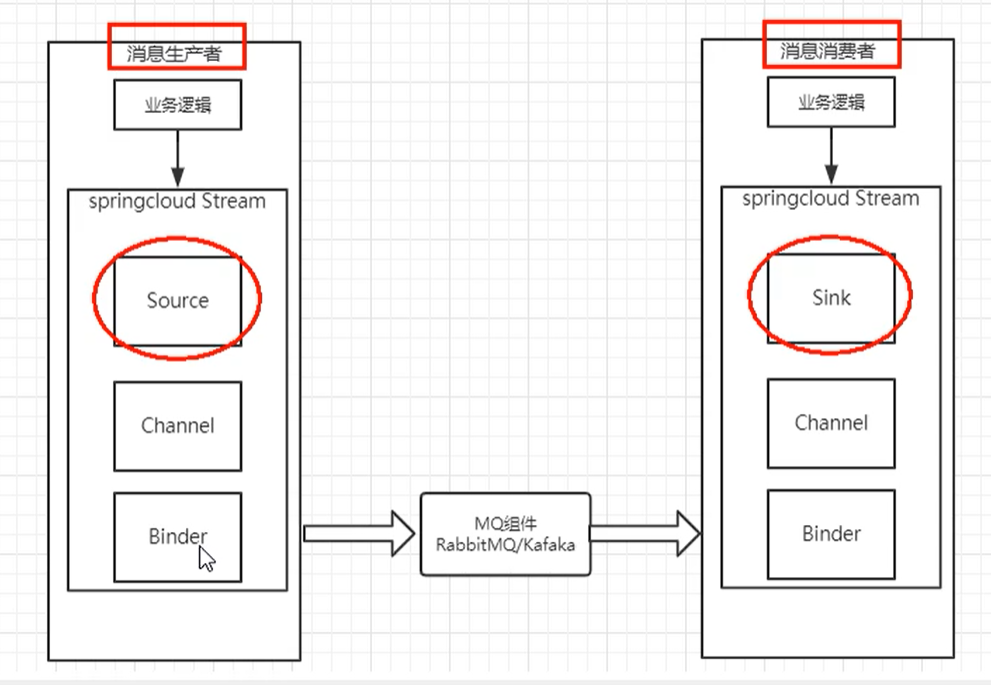
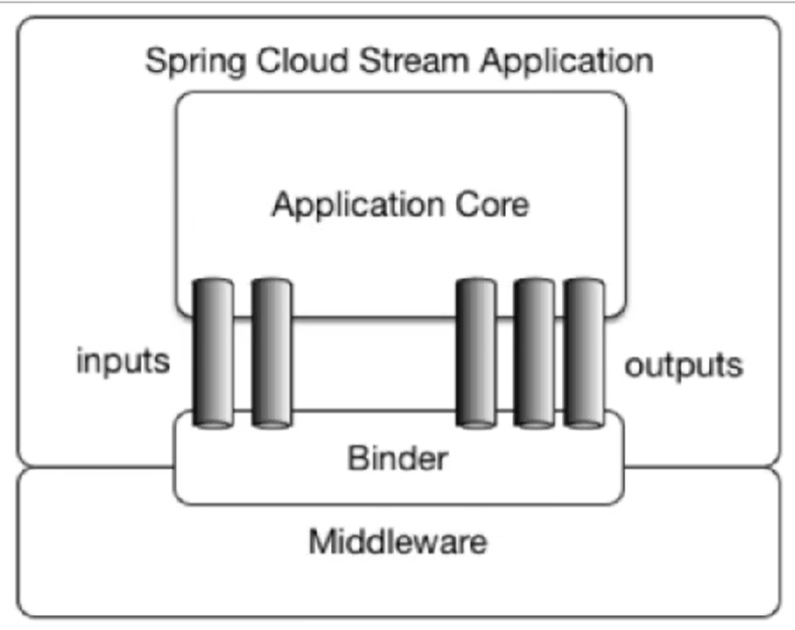

# Stream 消息驱动

[TOC]

## 一、概述

### （一）概念

[官网](https://spring.io/projects/spring-cloud-stream)

Spring Cloud Stream 是一个框架，用于构建与共享消息传递系统连接的高度可扩展的事件驱动型微服务。

应用程序通过 inputs 和 outputs 来与 Spring Cloud Stream 中的 binder 对象交互。而 Spring Cloud Stream 的 **binder 对象负责与消息中间件交互**。==目前仅支持 RabbitMQ,Kafka==

**通过定义绑定器 Binder 作为中间层，实现了应用程序与消息中间件细节之间的隔离。**

使用发布-订阅模式：使用 Topic 主题进行广播

- 对应 RabbitMQ 就是 Exchange
- 对应 KafKa 就是 Topic

### （二）作用
- 一个系统中采用多个消息中间件，解决不同消息中间件之间通信的问题。

- 屏蔽底层消息中间件的差异，降低切换成本，统一消息的编程模型。

### （三）消息中间件
ActiveMQ、RabbitMQ、RocketMQ、Kafka

**标准MQ**

- 生产者和消费者之间靠消息媒介传递消息内容？Message

- 消息必须走特定通道？MessageChannel

- 消息通道里的消息如何被消费？
    消息通道MessageChannel的子接口SubscribableChanner，由MessageHandler消息处理器所订阅

### （四）整体架构





标准流程：

- Binder：很方便的连接中间件、屏蔽差异
- Channel：通道，是队列 Queue 的一种抽象，在消息通讯系统中就是实现存储和转发的媒介，通过 Channel 对队列进行配置。
- Source 和 Sink：简单的可理解为参照对象是 Spring Cloud Stream 自身，从  Stream 发布消息就是输出，接收消息就是输入。

常用注解

- @Input
    注解标识输入通道，通过该输入通道收到的消息进入应用程序

- @Output
    注解标识输出通道，发布的消息通过该通道离开应用程序

- @StreamListener
    监听队列，用于消费者的队列的消息接收

- @EnableBinding
    指 channel 和 exchange 绑定在一起

## 二、项目试验
### （一）消息生产者模块 cloud-stream-rabbitmq-provider8801
- 步骤一：pom 中增加 rabbitMQ 依赖

    ```xml
    <dependency>
        <groupId>org.springframework.cloud</groupId>
        <artifactId>spring-cloud-starter-stream-rabbit</artifactId>
    </dependency>
    ```

- 步骤二：yml 配置 

    ```yaml
    server:
      port: 8801
    
    spring:
      application:
        name: cloud-stream-provider
      cloud:
        stream:
          binders: #在此配置要绑定的 rabbitmq的服务信息
            defaultRabbit: # 表示定义的名称，用于 binding整合
              type: rabbit  # 消息组件类型
              environment: # 设置rabbitmq相关的环境配置
                spring:
                  rabbitmq:
                    host: localhost
                    port: 5672
                    username: guest
                    password: guest
          bindings: # 服务的整合处理
            output: # 输出通道的名称
              destination: studyExchange  #表示要使用的 Exchange 名称定义
              content-type: application/json  # 消息类型，本次为 json，文本则设置为： text/plain
              binder: defaultRabbit  # 设置要绑定的消息服务的具体设置
    
    eureka:
      client:
        service-url:
          defaultZone: http://localhost:7001/eureka
      instance:
        lease-renewal-interval-in-seconds: 2 # 设置心跳时间间隔默认30s
        lease-expiration-duration-in-seconds: 5 # 如果超过了5秒的间隔默认90s
        instance-id: send-8001.com  #信息列表显示主机名称
        prefer-ip-address: true # 访问路径变为ip地址
    ```

- 步骤三：主启动类

    ```java
    @SpringBootApplication
    @EnableEurekaClient
    ```

- 步骤四：业务类：

    发送消息接口、发送消息接口的实现类、Controller

    - Service 接口

        ```java
        public interface IMessageProvider {
            public String send();
        }
        ```

    - Service 实现类

        ```java
        package com.gjxaiou.springcloud.service.impl;
        
        // 定义消息的推送管道，这里不在是 controller 调用 service 的逻辑结构，所以不需要加上 @Service
        @EnableBinding(Source.class)
        @Slf4j
        public class MessageProviderImpl implements IMessageProvider {
        
            // 消息发送管道
            @Resource
            private MessageChannel output;
        
            // 因为构建了 message 对象，然后将其传递给管道 source，然后在传递给 MQ，不用返回值。
            @Override
            public String send() {
                String value = UUID.randomUUID().toString();
                output.send(MessageBuilder.withPayload(value).build());
                log.info("**** 进入 send 方法：value = " + value);
                return null;
            }
        }
        ```

    - 提供访问的 controller

        ```java
        @RestController
        public class SendMessageController {
            @Resource
            private IMessageProvider messageProvider;
        
            @GetMapping(value = "/sendMessage")
            public String sendMessage(){
               return messageProvider.send();
            }
        }
        ```

- 测试
    - 进入rabbitmq 查看Exchanges中有没有studyExchange对应 yml中的自定义名字
    - 多次访问http://localhost:8801/sendMessage
    - 查看rabbitmq 中overview中 Message rates 的折线变化

### （二）消费者模块 cloud-stream-rabbitmq-consumer8802
- 步骤一：pom 文件和 8801 一样。

- 步骤二：yaml 文件如下：

    ```yaml
    server:
      port: 8802
    
    spring:
      application:
        name: cloud-stream-consumer
      cloud:
        stream:
          binders: #在此配置要绑定的 rabbitmq的服务信息
            defaultRabbit:  # 表示定义的名称，用于 binding整合
              type: rabbit  # 消息组件类型
              environment:  # 设置rabbitmq相关的环境配置
                spring:
                  rabbitmq:
                    host: localhost
                    port: 5672
                    username: guest
                    password: guest
          bindings: # 服务的整合处理
            input: # 输出通道的名称
              destination: studyExchange  #表示要使用的 Exchange 名称定义
              content-type: application/json  # 消息类型
              binder: defaultRabbit
              group: gjxaiouA
    
    eureka:
      client:
        service-url:
          defaultZone: http://localhost:7001/eureka
      instance:
        lease-renewal-interval-in-seconds: 2 # 设置心跳时间间隔默认30s
        lease-expiration-duration-in-seconds: 5 # 如果超过了5秒的间隔默认90s
        instance-id: receive-8002.com  #信息列表显示主机名称
        prefer-ip-address: true # 访问路径变为ip地址
    ```

- 步骤三：主启动类

    ```java
    @SpringBootApplication
    ```

- 步骤四：业务类：因为本身就是消费者，所以仅仅提供一个 controller

    ```java
    @Component
    @Slf4j
    @EnableBinding(Sink.class)
    public class ReceiveMessageListenerController {
        @Value("${server.port}")
        private String serverPort;
    
        @StreamListener(Sink.INPUT)
        public void input(Message<String> message) {
            log.info("消费者1号接收到消息" + message.getPayload() + "\t port:" + serverPort);
        }
    }
    ```

- 测试
    - 依次启动7001，8801,8802
    - 访问http://localhost:8801/sendMessage
    - 查看8801 和 8802 控制台是否有输出

### （三）消息重复消费

首先参考 8802 新建 8803 模块，形成架构为：8801 生产、8802 和 8803 消费，然后访问：http://localhost:8801/sendMessage ，结果就是：8802 与 8803 都可以访问消息。

存在的问题：

- 重复消费：8802/8803 都同时收到了消息

    - 导致原因：通过 RabbitMQ 的页面可以看到默认两个的分组 group 是不同的，不同组可以重复消费。

        

    - 解决方案：可是使用分组和持久化属性 group 解决。即自定义配置分组，然后自定义配置分到同一个组即可。

## 三、消息分组与持久化

### （一）消息分组

在 8802 和 8803 的 yaml 文件中添加 `group: gjxaiouA` 就可以自定义分组。8803 也可以自定义指定，如果和 8802 相同则在一组否则不再一组。

```yaml
 bindings: # 服务的整合处理
        input: # 输出通道的名称
          destination: studyExchange  #表示要使用的 Exchange 名称定义
          content-type: application/json  # 消息类型
          binder: defaultRabbit
          group: gjxaiouA
```

将两个微服务分到一个组group中，保证消息只能被一个组中的一个应用消费一次，不同的组可以同时消费

默认是轮询竞争消息。

### （二）持久化
- 停掉8802,8803，然后删除 8802 的 yaml 中的分组配置，8801 不停止并且不断发送消息。

- 8802 和 8803 重启之后 8802 没有消费任何消息，但是 8803 将之前发送的消息进行了消费。即 8802 丢失了消息。

 