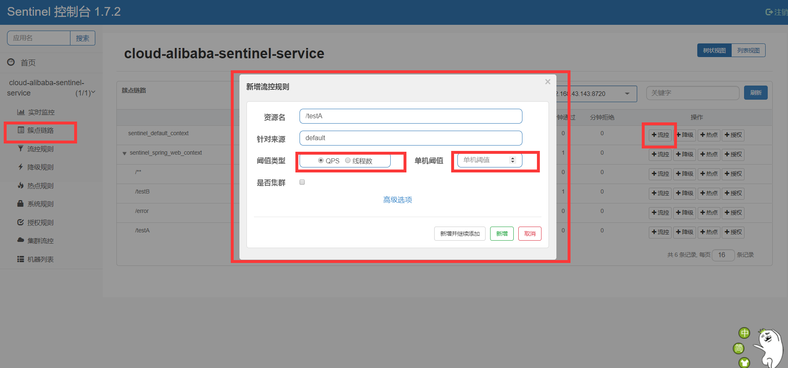
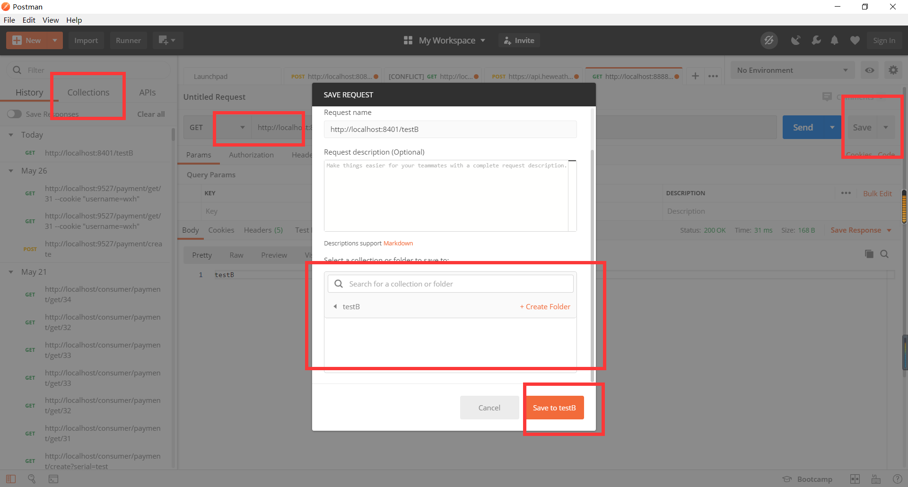
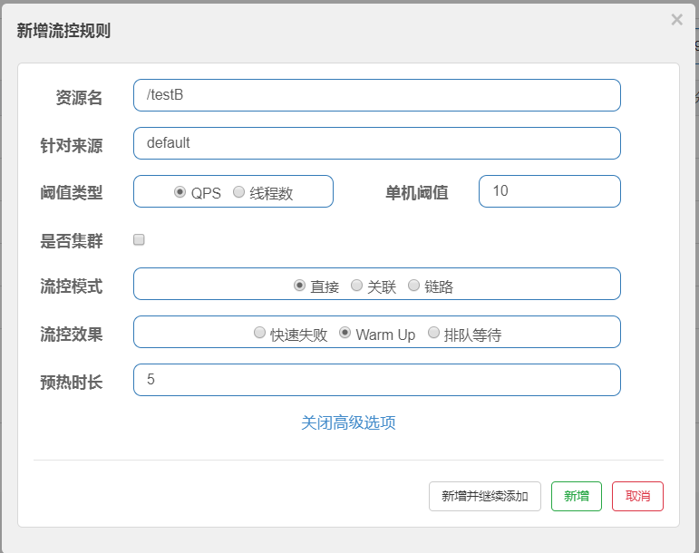
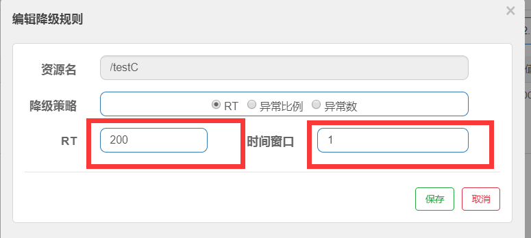
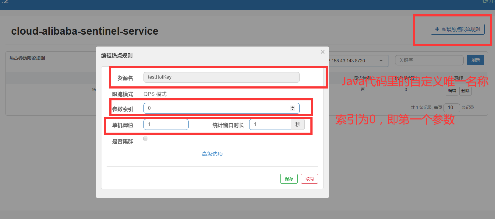
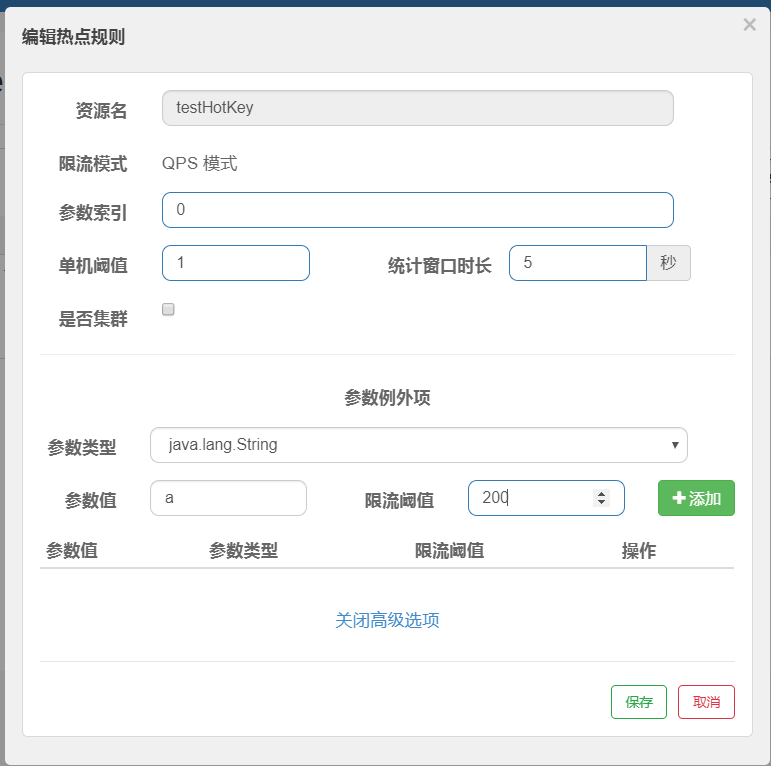

# 简介
### 官网
https://github.com/alibaba/Sentinel/wiki/%E4%B8%BB%E9%A1%B5
### 与Hystrix区别
###### Hystrix
1. 需要自己搭建监控平台。
2. 没有一套web界面可以进行更加细粒度的配置，流控，速率控制，服务熔断，服务降级。
###### Sentinel
1. 单独一个组件，可以独立出来
2. 页面化的细粒度统一配置
### 是什么
随着微服务的流行，服务和服务之间的稳定性变得越来越重要。Sentinel 是面向分布式服务架构的流量控制组件，主要以流量为切入点，从限流、流量整形、熔断降级、系统负载保护、热点防护等多个维度来帮助开发者保障微服务的稳定性。
### 能干什么
1. 流量控制
2. 熔断降级
3. 系统自适应保护
# Sentinel 控制台
### 组件由两部分组成
1. 核心库，jar包，不依赖任何框架，能够运行于所有Java运行的环境。
2. 控制台，基于springboot开发，打包后直接运行，不需要额外的tomcat。
### 安装
1. https://github.com/alibaba/Sentinel/releases
选择sentinel-dashboard-1.7.2.jar
2. 命令行切换到jar包目录
3. ``java -jar sentinel-dashboard-1.7.2.jar``
4. http://localhost:8080/
5. 账号密码 sentinel

# 使用
### 建模块cloud-alibaba-sentinel-service8401
1. pom
```xml
<!-- 后续做持久化用到 -->
<dependency>
    <groupId>com.alibaba.csp</groupId>
    <artifactId>sentinel-datasource-nacos</artifactId>
</dependency>
<dependency>
    <groupId>com.alibaba.cloud</groupId>
    <artifactId>spring-cloud-starter-alibaba-sentinel</artifactId>
</dependency>
```
2. yml
```yml
server:
  port: 8401

spring:
  application:
    name: cloud-alibaba-sentinel-service
  cloud:
    nacos:
      discovery:
        # 服务注册中心地址
        server-addr: localhost:8848
    sentinel:
      transport:
        # 配置sentinel dashboard地址
        dashboard: localhost:8080
        # 默认 8719端口，假如被占用从8719开始+1扫描直到直到未被占用的端口
        port: 8719

management:
  endpoints:
    web:
      exposure:
        include: '*'
```
3. main
@SpringBootApplication
@EnableDiscoveryClient
4. controller
```java
    @GetMapping("/testA")
    public String testA(){
        return "testA";
    }

    @GetMapping("/testB")
    public String testB(){
        return "testB";
    }
```
5. 启动 nacos，sentinel，启动模块
6. 访问模块，观察 sentinel里变化
# 流控规则
### 介绍
1. 资源名：唯一名称，默认请求路径
2. 针对来源：Sentinel可以针对调用者进行限流 ，填写微服务名，默认 default
3. 阈值类型
    * QPS（每秒请求数量）：当调用api的QPS达到阈值后进行限流
    * 线程数：调用该api的线程数达到阈值后进行限流
4. 是否集群：不需要集群
5. 流控模式：
    * 直接：api达到限流条件时直接限流
    * 关联：当关联的资源达到阈值时就限流自己
    * 链路：只记录指定链路上的流量（指定资源从入口资源进来的流量，如果达到阈值就进行限流）
6. 流控效果
    * 快速失败：直接失败，抛异常
    * Warm Up：根据codeFactor（冷加热因子，默认3）的值，从阈值 codeFactor，经过预热时长，才达到设定的QPS阈值。
### 流控模式


###### 直接
1. 按上图设置QPS为1，然后访问 testA 观察效果
2. 达到阈值快速失败
3. 自定义报错信息
###### 关联
1. 关联 testA 与 testB
2. B达到阈值，限流A
3. 使用 postman 模拟并发请求
    
    
    1. 先访问testB
    2. save到新建collection里
    3. 选择runner，选择testB，选择迭代次数和等待时长
4. 启动postman，再访问testA查看效果
###### 链路
1. 两个入口a，b调用同一个资源，只记录a上的限流，而不关系心b的使用
### 流控效果
###### 直接快速失败（默认）
###### 预热


1. 初始QPS = QPS/3
2. 阈值从初始QPS主键增加到 QPS
3. 访问 testB 观察随时间变化错误的数量变化
###### 排队等待


为 testB 设置打印当前时间
可以观察到一秒一个挨个执行
即请求按照顺序依次执行

# 熔断降级
### 基本介绍
 熔断降级会在调用链路中某个资源出现不稳定状态时（例如调用超时或异常比例升高），对这个资源的调用进行限制，让请求快速失败，避免影响到其它的资源而导致级联错误。
 ==没有半开状态==
### 触发降级的标准
1. 平均响应时间 (DEGRADE_GRADE_RT)：当 1s 内持续进入 N 个请求，对应时刻的平均响应时间（秒级）均超过阈值（count，以 ms 为单位），那么在接下的时间窗口（DegradeRule 中的 timeWindow，以 s 为单位）之内，对这个方法的调用都会自动地熔断（抛出 DegradeException）。注意 Sentinel 默认统计的 RT 上限是 4900 ms，超出此阈值的都会算作 4900 ms，若需要变更此上限可以通过启动配置项 -Dcsp.sentinel.statistic.max.rt=xxx 来配置。
2. 异常比例 (DEGRADE_GRADE_EXCEPTION_RATIO)：当资源的每秒请求量 >= N（可配置），并且每秒异常总数占通过量的比值超过阈值（DegradeRule 中的 count）之后，资源进入降级状态，即在接下的时间窗口（DegradeRule 中的 timeWindow，以 s 为单位）之内，对这个方法的调用都会自动地返回。异常比率的阈值范围是 [0.0, 1.0]，代表 0% - 100%。
3. 异常数 (DEGRADE_GRADE_EXCEPTION_COUNT)：当资源近 1 分钟的异常数目超过阈值之后会进行熔断。注意由于统计时间窗口是分钟级别的，若 timeWindow 小于 60s，则结束熔断状态后仍可能再进入熔断状态。
### 开启
###### 平均响应时间


1. jmeter压力测试每秒10次，永远循环
2. 如何 1s 内持续进了 N 个请求且 平均响应时间均超过阈值，那么下一个窗口期服务熔断
3. 该例中设置个请求 sleep 1s 所以，jmeter 每秒 10次（访问总次数）超过 n=5（默认是5），在下一个时间窗口期内服务熔断
###### 异常比例
1. 默认请求量大于5时
2. 异常比例占通过总量和的比例超过阈值时
3. 进入降级状态，且下一个时间窗口期对这个方法调用自动返回
###### 异常数
1. ==将窗口期超过 60s==
2. 模拟异常 10/0
3. jmeter压测
4. 进入熔断异常
5. 过了时间窗口期，之间不要做任何操作，即可访问

# 热点参数限流
### 是什么
即经常访问的数据
* 商品id为参数，统计一段时间最常购买的商品 id 并进行限制。
* 用户id为参数，针对一段时间内频繁访问的用户 id 进行限制。
### 怎么用
1. controller
  ```java
      @GetMapping("/testHotKey")
      // 名字可以随意起，但为唯一标识
      @SentinelResource(value = "testHotKey",blockHandler = "deal_testHotKey")
      // required 表示是否必须包含此参数
      public String testHostKey(@RequestParam(value = "p1",required = false) String p1,
          @RequestParam(value="p2",required = false)String p2){
          System.out.println(p1);
          return "testHostKey";
      }

      public String deal_testHotKey(String p1, String p2, BlockException exception){
          return "deal_testHotKey";
      }
  ```
2. 
3. 多次访问 http://localhost:8401/testHotKey?p1=a 查看效果,可以生效
4. 多次访问 http://localhost:8401/testHotKey?p1=a&p2=b 查看效果,可以生效
5. 多次访问 http://localhost:8401/testHotKey?p2=a 查看效果,不能生效
6. 多次访问 http://localhost:8401/testHotKey?p2=b&p1=a 查看效果,可以生效
7. 总结上图的参数索引0，对应Java代码参数列表里的参数下标
### 参数特殊项


1. 当参数为特定值的时候拥有不同的阈值
2. 即使其他参数项熔断，特定参数项也不会熔断

# 系统自适应限流
### 简介
###### 系统保护的目的
1. 保证系统不被拖垮
2. 在系统稳定的前提下，保持系统吞吐量
###### 系统保护的问题
长期以来系统保护是根据负载来做系统过载保护。当负载超过某个阈值，就禁止或减少流量进入，负载好转后恢复流量进入。
1. 如果根据当前负载的情况调节流量通过率，始终有延迟。这样会浪费系统处理能力。所以看到的曲线总会有所抖动。
2. 恢复慢，下游应用不可靠导致应用 RT 很好，从而负载很高，但过了一段时间下游恢复了，其实应该大幅增加流量通过率。但这时候load仍然很高。通过率恢复仍然不高。
==最终目的：在系统不被拖垮的情况下，提高系统的吞吐率，而不是 load 一定要到低于某个阈值==
###### 是什么
从单台机器的 load、CPU 使用率、平均 RT、入口 QPS 和并发线程数等几个维度监控应用指标，让系统尽可能跑在最大吞吐量的同时保证系统整体的稳定性。
###### 能做什么
1. Load 自适应（仅对 Linux/Unix-like 机器生效）：系统的 load1 作为启发指标，进行自适应系统保护。当系统 load1 超过设定的启发值，且系统当前的并发线程数超过估算的系统容量时才会触发系统保护（BBR 阶段）。系统容量由系统的 maxQps * minRt 估算得出。设定参考值一般是 CPU cores * 2.5。
2. CPU usage（1.5.0+ 版本）：当系统 CPU 使用率超过阈值即触发系统保护（取值范围 0.0-1.0），比较灵敏。
3. 平均 RT：当单台机器上所有入口流量的平均 RT 达到阈值即触发系统保护，单位是毫秒。
4. 并发线程数：当单台机器上所有入口流量的并发线程数达到阈值即触发系统保护。
5. 入口 QPS：当单台机器上所有入口流量的 QPS 达到阈值即触发系统保护。

###### 怎么做


==简而言之就是对整个系统添加限流，不推荐使用==

# SentinelResource 配置兜底方法的两种实现
### 自定义方法
```java
@RestController
public class RateLimitController {
    @GetMapping("/A")
    @SentinelResource(value = "A",blockHandler = "exceptionA")
    public String A(){
        return "a";
    }

    public String exceptionA(BlockException e){
        return "exceptionA";
    }
}
```
### 自定义异常处理类
```java
    @GetMapping("/B")
    @SentinelResource(value = "B",blockHandlerClass = ExceptionHandler.class,blockHandler = "handler1")
    public String B(){
        return "B";
    }
```
异常处理类
```java
public class ExceptionHandler {
    public static String handler1(BlockException e){
        return "hanlder1";
    }
    public static String handler2(BlockException e){
        return "hanlder2";
    }
}
```

# 服务熔断Ribbon
### 准备
###### 提供者模块 cloud-ali-provider-payment9003/9004
1. pom
nacos
2. yml
```yml
server:
  port: 9003
spring:
  application:
    name: nacos-payment-provider
  cloud:
    nacos:
      discovery:
        server-addr: localhost:8848
management:
  endpoints:
    web:
      exposure:
        include: '*'
```
3. 主启动 
@SpringBootApplication
@EnableDiscoveryClient
4. 业务类
```java
@RestController
public class PaymentController {
    @Value("${server.port}")
    private String serverPort;

    public static HashMap<Long,String> hashMap = new HashMap<>();
    static {
        hashMap.put(1l,"aaaaaaaaaaaaaa");
        hashMap.put(2l,"bbbbbbbbbbbbbb");
        hashMap.put(3l,"cccccccccccccc");
    }

    @GetMapping("/payment/{id}")
    public String payment(@PathVariable("id") Long id){
        return hashMap.get(id)+serverPort;
    }
}
```
###### 消费者模块 cloud-ali-consumer-nacos-order84
1. pom
```xml
  <dependency>
      <groupId>com.alibaba.cloud</groupId>
      <artifactId>spring-cloud-starter-alibaba-nacos-discovery</artifactId>
  </dependency>
  <dependency>
      <groupId>com.alibaba.cloud</groupId>
      <artifactId>spring-cloud-starter-alibaba-sentinel</artifactId>
  </dependency>
```
2. yml
```yml
server:
  port: 84

spring:
  application:
    name: nacos-order-consumer
  cloud:
    nacos:
      discovery:
        server-addr: localhost:8848
    sentinel:
      transport:
        dashboard: localhost:8080
        port: 8719

service-url:
  nacos-user-service: http://nacos-payment-provider
```
3. main
@SpringBootApplication
@EnableDiscoveryClient
4. config
配置RestTemplate
5. controller
```java
@RestController
public class CircleBreakerController {
    public static final String SERVICE_URL = "http://nacos-payment-provider";

    @Resource
    private RestTemplate restTemplate;

    @RequestMapping("/consumer/fallback/{id}")
    @SentinelResource(value = "fallback")
    public String fallback(@PathVariable("id") Long id){

        String result = restTemplate.getForObject(SERVICE_URL+"/payment/"+id,String.class,id);
        if (id==4){
            throw new RuntimeException("非法参数异常");
        }

        return result;
    }
}
```
### 使用
###### 配置fallback
1. 改变 84 中的 controller
```java
@RestController
public class CircleBreakerController {
    public static final String SERVICE_URL = "http://nacos-payment-provider";

    @Resource
    private RestTemplate restTemplate;

    @RequestMapping("/consumer/fallback/{id}")
//    @SentinelResource(value = "fallback")   // 没有配置
    @SentinelResource(value = "fallback",fallback = "handlerFallback")
    public String fallback(@PathVariable("id") Long id){

        String result = restTemplate.getForObject(SERVICE_URL+"/payment/"+id,String.class,id);
        if (id==4){
            throw new RuntimeException("非法参数异常");
        }

        return result;
    }

    public String handlerFallback(@PathVariable Long id){
        return id+"异常";
    }
}
```
2. 访问 84 输入 id=4 模拟异常
3. 有异常时进入fallback，其实就是兜底方法

###### 配置 blockHanlder
1. 改变 84 中的controller
```java
    @RequestMapping("/consumer/fallback/{id}")
//    @SentinelResource(value = "fallback")   // 没有配置
//    @SentinelResource(value = "fallback",fallback = "handlerFallback")
    @SentinelResource(value = "fallback",blockHandler = "blockHandler")
    public String fallback(@PathVariable("id") Long id){

        String result = restTemplate.getForObject(SERVICE_URL+"/payment/"+id,String.class,id);
        if (id==4){
            throw new RuntimeException("非法参数异常");
        }

        return result;
    }

//    public String handlerFallback(@PathVariable Long id){
//        return id+"异常";
//    }

    public String blockHandler(Long id, BlockException e){
        return "blockHandler异常";
    }
```
2. 访问 84 输入 id=4 模拟异常
3. 结果 
==没有在sentinel中配置服务降级只会报出异常界面，而fallback不需要配置sentinel==
4. 再测试

配置异常数为 2 ，单独点 1 次 爆异常界面，连续两次爆blockhandler的方法

###### 配置fallback+blockHanlder
未进入限流条件进 fallback，进入限流条件进 blockhandler

###### 异常忽略
``    @SentinelResource(value = "fallback",fallback = "handlerFallback",blockHandler = "blockHandler",exceptionsToIgnore = RuntimeException.class)
``
忽略某种类型的异常

# 服务熔断OpenFeign
### 更改84
1. pom
  ```xml
  <dependency>
      <groupId>org.springframework.cloud</groupId>
      <artifactId>spring-cloud-starter-openfeign</artifactId>
      <version>2.2.1.RELEASE</version>
  </dependency>
  ```
2. yml
  ```yml
  feign:
    sentinel:
      enabled: true
  ```
3. main
@EnableFeignClients
4. 新建service
```java
@FeignClient(value = "nacos-payment-provider",fallback = PaymentFailService.class)
public interface PaymentService {
    @GetMapping("/payment/{id}")
    public String payment(@PathVariable("id") Long id);
}
```
5. 新建service兜底类
```java
@Component
public class PaymentFailService implements PaymentService {
    @Override
    public String payment(Long id) {
        return "feign失败调用";
    }
}
```
6. 更改controller
```java
    @Resource
    private PaymentService paymentService;
    @GetMapping("consumer/payment/{id}")
    public String payment(@PathVariable("id") Long id){
        return paymentService.payment(id);
    }
```
7. 测试关闭 9003,9004 访问 84 查看是否进入兜底方案

# 持久化
1. 简介
存到nacos中
2. pom
```xml
 <!-- 后续做持久化用到 -->
        <dependency>
            <groupId>com.alibaba.csp</groupId>
            <artifactId>sentinel-datasource-nacos</artifactId>
        </dependency>
```
3. yml
```yml
spring:
  cloud:
    sentinel:
      datasource:
        ds1:
          nacos:
            server-addr: localhost:8848 #nacos地址
            dataId: cloud-alibaba-sentinel-service  #微服务名称
            groupId: DEFAULT_GROUP  #默认分组
            data-type: json #数据格式
            rule-type: flow #流控规则
```
4. nocos 8848 中新增配置


```json
[
    {
        "resource":"/A",//资源名称
        "limitApp":"default",//来源应用
        "grade":1,//阈值类型，0线程数，1QPS
        "count":1,//单机阈值
        "strategy":0,//流控模式，0表示直接，1表示关联，2表示链路
        "controlBehavior":0,//流控效果 ，0表示快速失败，1表示warm up，2表示排队等待
        "clusterMode":false //是否集群
    }
]
```
5. 重启8401，刷新sentinel查看效果

