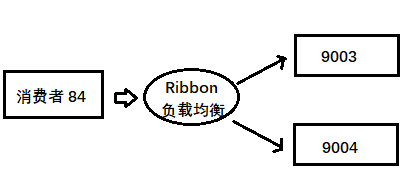

# 简介

### 官网
https://github.com/alibaba/Sentinel/wiki/%E4%B8%BB%E9%A1%B5
### 与 Hystrix 区别
###### Hystrix
1. 需要自己搭建监控平台（9001 中搭建和配置哪些微服务）。
2. 没有一套web界面可以进行更加细粒度的配置，流控，速率控制，服务熔断，服务降级。
###### Sentinel
1. 单独一个组件，可以独立出来
2. 支持页面化的细粒度统一配置
### 是什么
随着微服务的流行，服务和服务之间的稳定性变得越来越重要。Sentinel 是面向分布式服务架构的流量控制组件，主要以流量为切入点，从限流、流量整形、熔断降级、系统负载保护、热点防护等多个维度来帮助开发者保障微服务的稳定性。
### 能干什么
1. 流量控制
2. 熔断降级
3. 系统自适应保护
# Sentinel 控制台
### 组件由两部分组成
1. 核心库，jar包，不依赖任何框架，能够运行于所有Java运行的环境。
2. 控制台（Dashboard），基于springboot开发，打包后直接运行，不需要额外的tomcat。
### 安装
1. https://github.com/alibaba/Sentinel/releases
选择sentinel-dashboard-1.7.2.jar
2. 命令行切换到jar包目录
3. `java -jar sentinel-dashboard-1.7.2.jar`
4. http://localhost:8080/
5. 账号密码 sentinel

# 使用
### 建模块cloud-alibaba-sentinel-service8401

是的 8401 可以注入 Nacos 8848，同时可以被 Sentinel 8080 监控保护。

1. pom
```xml
<!-- 后续做持久化用到 -->
<dependency>
    <groupId>com.alibaba.csp</groupId>
    <artifactId>sentinel-datasource-nacos</artifactId>
</dependency>
<dependency>
    <groupId>com.alibaba.cloud</groupId>
    <artifactId>spring-cloud-starter-alibaba-sentinel</artifactId>
</dependency>
```
2. yml
```yml
server:
  port: 8401

spring:
  application:
    name: cloud-alibaba-sentinel-service
  cloud:
    nacos:
      discovery:
        # 服务注册中心地址
        server-addr: localhost:8848
    sentinel:
      transport:
        # 配置sentinel dashboard地址
        dashboard: localhost:8080
        # 默认 8719端口，假如被占用从8719开始+1扫描直到直到未被占用的端口
        port: 8719

management:
  endpoints:
    web:
      exposure:
        include: '*'
```
3. main
@SpringBootApplication
@EnableDiscoveryClient
4. controller
```java
    @GetMapping("/testA")
    public String testA(){
        return "testA";
    }

    @GetMapping("/testB")
    public String testB(){
        return "testB";
    }
```
5. 启动 nacos(startup.cml)，sentinel，启动模块
6. 因为 Sentinel 使用懒加载机制，所有启动模块之后直接打开 Sentinel 是看不到的，只有访问（`http://localhost:8401/testA` 或者访问 B）模块，观察 sentinel里变化。


# 流控规则（流量控制）

### 介绍

1. 资源名：唯一名称，默认请求路径
2. 针对来源：Sentinel可以针对调用者进行限流 ，填写微服务名，默认 default
3. 阈值类型
    * QPS（每秒请求数量）：当调用api的QPS达到阈值后进行限流
    * 线程数：调用该api的线程数达到阈值后进行限流
4. 是否集群：不需要集群
5. 流控模式：
    * 直接：api 达到限流条件时直接限流
    * 关联：当关联的资源达到阈值时就限流自己
    * 链路：只记录指定链路上的流量（指定资源从入口资源进来的流量，如果达到阈值就进行限流）
6. 流控效果
    * 快速失败：直接失败，抛异常
    * Warm Up：根据codeFactor（冷加热因子，默认3）的值，从阈值 codeFactor，经过预热时长，才达到设定的QPS阈值。
### 流控模式


###### 直接+ 快速失败
1. 按上图设置QPS为1，然后访问 testA 观察效果

2. 达到阈值快速失败

    `Blocked by Sentinel (flow limiting)`

3. 自定义报错信息，或者使用 fallback 方法来处理。
- 测试 线程数限制，需要在上面的 controller 方法中（比如 testB) 中增加如下代码：【仅在测试这里时候加入，测完删除）

    ```java
        @GetMapping("/testB")
        public String testB() {
            try {
                Thread.sleep(3);
            } catch (InterruptedException e) {
                e.printStackTrace();
            }
            return "-----testB----";
        }
    ```

    然后比如限制线程数为 1 进行测试。

###### 关联
1. 关联 testA 与 testB

2. B达到阈值，限流A

3. 使用 postman 模拟并发请求

    

4. 
    

    1. 先访问testB
    2. save到新建collection里
    3. 选择runner，选择testB，选择迭代次数和等待时长

5. 启动postman，再访问testA查看效果
###### 链路
1. 两个入口a，b调用同一个资源，只记录a上的限流，而不关系心b的使用
### 流控效果
###### 直接快速失败（默认）
###### 预热

图片含义：最终的 QPS 阈值应该达到 10 ，但是刚开始是 10/3 = 3 个，5 秒钟之后要达到 10 的阈值。


1. 初始QPS = QPS 阈值/3 开始
2. 阈值从初始QPS主键增加到 QPS
3. 访问 testB 观察随时间变化错误的数量变化
###### 排队等待


为 testB 设置打印当前时间
可以观察到一秒一个挨个执行
即请求按照顺序依次执行

# 熔断降级
### 基本介绍
 熔断降级会在调用链路中某个资源出现不稳定状态时（例如调用超时或异常比例升高），对这个资源的调用进行限制，让请求快速失败，避免影响到其它的资源而导致级联错误。
 ==没有半开状态==
### 触发降级的标准
1. 平均响应时间 (DEGRADE_GRADE_RT)：当 1s 内持续进入 N 个请求，对应时刻的平均响应时间（秒级）均超过阈值（count，以 ms 为单位），那么在接下的时间窗口（DegradeRule 中的 timeWindow，以 s 为单位）之内，对这个方法的调用都会自动地熔断（抛出 DegradeException）。注意 Sentinel 默认统计的 RT 上限是 4900 ms，超出此阈值的都会算作 4900 ms，若需要变更此上限可以通过启动配置项 -Dcsp.sentinel.statistic.max.rt=xxx 来配置。
2. 异常比例 (DEGRADE_GRADE_EXCEPTION_RATIO)：当资源的每秒请求量 >= N（可配置），并且每秒异常总数占通过量的比值超过阈值（DegradeRule 中的 count）之后，资源进入降级状态，即在接下的时间窗口（DegradeRule 中的 timeWindow，以 s 为单位）之内，对这个方法的调用都会自动地返回。异常比率的阈值范围是 [0.0, 1.0]，代表 0% - 100%。
3. 异常数 (DEGRADE_GRADE_EXCEPTION_COUNT)：当资源近 1 分钟的异常数目超过阈值之后会进行熔断。注意由于统计时间窗口是分钟级别的，若 timeWindow 小于 60s，则结束熔断状态后仍可能再进入熔断状态。
### 开启
###### 平均响应时间

> 一秒持续进入 5 个请求，并且平均响应时间大于阈值，则触发降级（断路器打开），等到时间窗口结束则关闭降级。


1. controller 代码层面新增方法：

    ```java
    // 用于测试 RT：平均响应时间
    @GetMapping("/testD")
    public String testD(){
        try {
            TimeUnit.SECONDS.sleep(1);
        } catch (InterruptedException e) {
            e.printStackTrace();
        }
        return "---testD---";
    }
    ```

2. jmeter压力测试每秒10次，永远循环

    

    

    

3. 如何 1s 内持续进了 N 个请求且 平均响应时间均超过阈值，那么下一个窗口期服务熔断

4. 该例中设置个请求 sleep 1s 所以，jmeter 每秒 10次（访问总次数）超过 n=5（默认是5），在下一个时间窗口期内服务熔断
###### 异常比例

> QPS  >= 5 并且异常比例（秒级统计）超过阈值则触发降级（断路器打开），然后等到时间窗口结束之后关闭降级。

1. 默认请求量大于5时
2. 异常比例占通过总量和的比例超过阈值时
3. 进入降级状态，且下一个时间窗口期对这个方法调用自动返回

测试代码修改：

```java
// 用于测试异常比例
@GetMapping("/testE")
public String testE() {
    log.info("进入 testE------");
    int age = 10 / 0;
    return "---testE---";
}
```


然后 Jmeter 使用上面的测试，肯定是直接熔断了，然后自己在浏览器中进行访问者还是处于降级阶段。当然如果停止 Jmeter 发送，则不再满足每秒 5 个请求以上的要求，但是错误率仍然是 100%，则不再满足降级的设置条件。再次访问之后就会报正常的异常（ 10 /0）。

###### 异常数

> 异常数（分钟统计）超过阈值则触发降级（断路器打开），然后等待时间窗口结束，从而关闭降级。

1. ==将窗口期超过 60s==
2. 模拟异常 10/0
3. jmeter压测
4. 进入熔断异常
5. 过了时间窗口期，之间不要做任何操作，即可访问

# 热点参数限流

源代码：`com.alibaba.csp.sentinal.slots.block.BlockException`

如果使用了热点参数限流，一定要使用 `blockHandler` 来指定兜底方法，如果没有指定则到达阈值之后会直接返回报错页面，很不友好。

**注意**：

@SentinelResource 处理的是 Sentinel 控制台配置的违规情况，是有  blockHandler 配置的方法来进行兜底。但是如果程序是 RuntimeException ，则不管，会直接抛出异常。

### 是什么
即经常访问的数据
* 商品id为参数，统计一段时间最常购买的商品 id 并进行限制。
* 用户id为参数，针对一段时间内频繁访问的用户 id 进行限制。
### 怎么用

演示效果：当第一个参数 p1 的访问 QPS 超过 1 秒 1 次点击之后马上被限流。

1. controller
  ```java
  /**
     * 热点参数限流
     */
    @GetMapping("/testHotKey")
    // 名字可以随意起，但为唯一标识
    @SentinelResource(value = "testHotKey",blockHandler = "deal_testHotKey")
    // required 表示是否必须包含此参数
    public String testHostKey(@RequestParam(value = "p1",required = false) String p1,
                              @RequestParam(value="p2",required = false)String p2){
        System.out.println(p1);
        return "正常执行：testHostKey";
    }

    public String deal_testHotKey(String p1, String p2, BlockException exception){
        return "兜底方法：deal_testHotKey";
    }
  ```
2.  Sentinel 进行热点限流规则配置

    

3. 多次访问 http://localhost:8401/testHotKey?p1=a 查看效果,可以生效

4. 多次访问 http://localhost:8401/testHotKey?p1=a&p2=b 查看效果,可以生效

5. 多次访问 http://localhost:8401/testHotKey?p2=a 查看效果,不能生效

6. 多次访问 http://localhost:8401/testHotKey?p2=b&p1=a 查看效果,可以生效

7. 总结上图的参数索引0，对应Java代码参数列表里的参数下标
### 参数特殊项

> 即正常情况才仍然像上面一样， 当 p1 访问超过 1 秒 1 个的阈值之后马上限流，但是当 p1 参数为某个特殊值的之后，限流的阈值可以不一样。


1. 当参数为特定值的时候拥有不同的阈值
2. 即使其他参数项熔断，特定参数项也不会熔断


# 系统自适应限流

### 简介
###### 系统保护的目的
1. 保证系统不被拖垮
2. 在系统稳定的前提下，保持系统吞吐量
###### 系统保护的问题
长期以来系统保护是根据负载来做系统过载保护。当负载超过某个阈值，就禁止或减少流量进入，负载好转后恢复流量进入。
1. 如果根据当前负载的情况调节流量通过率，始终有延迟。这样会浪费系统处理能力。所以看到的曲线总会有所抖动。
2. 恢复慢，下游应用不可靠导致应用 RT 很好，从而负载很高，但过了一段时间下游恢复了，其实应该大幅增加流量通过率。但这时候load仍然很高。通过率恢复仍然不高。
==最终目的：在系统不被拖垮的情况下，提高系统的吞吐率，而不是 load 一定要到低于某个阈值==
###### 是什么
从单台机器的 load、CPU 使用率、平均 RT、入口 QPS 和并发线程数等几个维度监控应用指标，让系统尽可能跑在最大吞吐量的同时保证系统整体的稳定性。
###### 能做什么
1. Load 自适应（仅对 Linux/Unix-like 机器生效）：系统的 load1 作为启发指标，进行自适应系统保护。当系统 load1 超过设定的启发值，且系统当前的并发线程数超过估算的系统容量时才会触发系统保护（BBR 阶段）。系统容量由系统的 maxQps * minRt 估算得出。设定参考值一般是 CPU cores * 2.5。
2. CPU usage（1.5.0+ 版本）：当系统 CPU 使用率超过阈值即触发系统保护（取值范围 0.0-1.0），比较灵敏。
3. 平均 RT：当单台机器上所有入口流量的平均 RT 达到阈值即触发系统保护，单位是毫秒。
4. 并发线程数：当单台机器上所有入口流量的并发线程数达到阈值即触发系统保护。
5. 入口 QPS：当单台机器上所有入口流量的 QPS 达到阈值即触发系统保护。

###### 怎么做


==简而言之就是对整个系统添加限流，不推荐使用==


# @SentinelResource 配置兜底方法的两种实现

### （一）按照资源名称限流 + 后续处理

首先在 8401 中新建一个 controller 用于测试

```java
@RestController
public class RateLimitController {
    @GetMapping("/byResource")
    @SentinelResource(value = "byResource",blockHandler = "handleException")
    public CommonResult byResource(){
        return new CommonResult(200, "按照自愿名称限流测试", new Payment(2020L, "serial001"));
    }

    public CommonResult handleException(BlockException e){
        return  new CommonResult(444, e.getClass().getCanonicalName() + " 服务不可用");
    }
}
```
然后按照资源名称进行配置，


通过快速访问：`http://localhost:8401/byResource`，从抛出的异常可以看到，是 `"com.alibaba.csp.sentinel.slots.block.flow.FlowException 服务不可用"` 进行处理，即  `FlowException` 类进行了处理。

「注意」：如果关闭了 8401 服务，则 Sentinel 中配置的上述规则也消失了=》临时


### （二）按照 URL 地址限流 + 后续处理

上述 controller 新增方法：没有兜底的方法，会用系统默认的

```java
    /**
     * 测试使用 URL 进行限流
     */
    @GetMapping("/rateLimit/byUrl")
    @SentinelResource(value = "byUrl")
    public CommonResult byUrl(){
        return new CommonResult(200, "按照  URL 限流测试", new Payment(2020L, " serial002"));
    }
```

按照 URL 进行限流配置如下：


如果快速点击则返回：`Blocked by Sentinel (flow limiting)`


**总结**， 流控规则可以通过 URL 或者资源名称，同时如果配置了 blockHandler 则用自己的，如果没有配置则使用系统自带的。


### （三）上述配置的问题

- 系统默认的没有体现我们业务要求。
- 自定义的处理方法和业务代码耦合在一起，不直观。
- 每个业务方法都添加了一个兜底的，代码比较膨胀。
- 全局统一的处理方法没有体现。


### （四）客户自定义限流处理逻辑

单独创建 CustomerBlockHandler 类用于自定义限流处理逻辑。

- 首先在 controller 层提供入口

    ```java
    /**
         * 测试自定义限流异常方法
         */
    @GetMapping("/rateLimit/customerBlockHandler")
    @SentinelResource(value = "customerBlockerHandler",
                      blockHandlerClass = CustomBlockHandler.class,
                      blockHandler = "handlerException2")
    public CommonResult customerBlockHandler() {
        return new CommonResult(200, "按照用户自定义", new Payment(2020L, "serial003"));
    }
    ```

- 提供自定义异常处理类

    ```java
    package com.gjxaiou.springcloud.myHandler;
    
    import com.alibaba.csp.sentinel.slots.block.BlockException;
    import com.gjxaiou.springcloud.entities.CommonResult;
    import com.gjxaiou.springcloud.entities.Payment;
    
    public class CustomBlockHandler {
        public static CommonResult handlerException1(BlockException exception) {
            return new CommonResult(4444, "用户自定义，global handlerException1", new Payment(2000L,
                    "serial 004"));
        }
        public static CommonResult handlerException2(BlockException exception) {
            return new CommonResult(4444, "用户自定义，global handlerException2", new Payment(2000L,
                    "serial 004"));
        }
    }
    ```

测试：http://localhost:8401/rateLimit/customerBlockHandler


快速访问

```json
{
    "code": 4444,
    "message": "用户自定义，global handlerException2",
    "data": {
        "id": 2000,
        "serial": "serial 004"
    }
}
```


### 自定义异常处理类

## 服务熔断

使用架构



### 服务熔断Ribbon


#### 提供者模块 cloud-ali-provider-payment9003/9004
1. pom
nacos
2. yml
```yml
server:
  port: 9003

# 注入 Nacos
spring:
  application:
    name: nacos-payment-provider
  cloud:
    nacos:
      discovery:
        # 配置 Nacos 地址
        server-addr: localhost:8848

management:
  endpoints:
    web:
      exposure:
        include: '*'
```
3. 主启动 
@SpringBootApplication
@EnableDiscoveryClient
4. 业务类
```java
@RestController
public class PaymentController {

    @Value("${server.port}")
    private String serverPort;

    /**
     * 使用 HashMap 模拟数据库，即为了测试简便省略 DAO 层。
     */
    public static HashMap<Long, Payment> hashMap = new HashMap<>();

    static {
        hashMap.put(1L, new Payment(1L, "klsdjfietjg34it34tkio"));
        hashMap.put(2L, new Payment(2L, "34rrjejkrfg34it374hru"));
        hashMap.put(3L, new Payment(3L, "8378r4ietjg34it8743rh"));
    }


    @GetMapping(value = "/paymentSQL/{id}")
    public CommonResult<Payment> paymentSQL(@PathVariable("id") Long id) {
        Payment payment = hashMap.get(id);
        CommonResult result = new CommonResult(200,
                " from mysql, serverPort: " + serverPort, payment);
        return result;
    }
}

```
9003,9004，和 84 配置完成之后启动测试：

http://localhost:9004/paymentSQL/1，其中 id 范围为： 1 -3,4 就取不到值了。

#### 消费者模块 cloud-ali-consumer-nacos-order84

1. pom
```xml
  <dependency>
      <groupId>com.alibaba.cloud</groupId>
      <artifactId>spring-cloud-starter-alibaba-nacos-discovery</artifactId>
  </dependency>
  <dependency>
      <groupId>com.alibaba.cloud</groupId>
      <artifactId>spring-cloud-starter-alibaba-sentinel</artifactId>
  </dependency>
```
2. yml
```yml
server:
  port: 84

spring:
  application:
    name: nacos-order-consumer
  cloud:
    nacos:
      discovery:
        server-addr: localhost:8848
    sentinel:
      transport:
        dashboard: localhost:8080
        port: 8719

service-url:
  nacos-user-service: http://nacos-payment-provider
```
3. main
@SpringBootApplication
@EnableDiscoveryClient
4. config，因为使用 ribbon 进行负载均衡
配置RestTemplate
5. controller
```java
@RestController
public class CircleBreakerController {
    public static final String SERVICE_URL = "http://nacos-payment-provider";

    @Resource
    private RestTemplate restTemplate;

    @RequestMapping("/consumer/fallback/{id}")
    @SentinelResource(value = "fallback")
    public String fallback(@PathVariable("id") Long id){

        String result = restTemplate.getForObject(SERVICE_URL+"/payment/"+id,String.class,id);
        if (id==4){
            throw new RuntimeException("非法参数异常");
        }

        return result;
    }
}
```


「注意」： fallback 管运行异常， blockHandler 管配置违规。

系统的基本测试，通过 94 轮询访问 9003 和 9004：http://localhost:84/consumer/fallback/1

如果 id = 4，直接抛出代码中指定的异常，因为 Sentinel 中没有配置，所以没有熔断和降级，直接抛出异常。

- 如果没有配置任何 sentinel， 则直接返回 error 页面，不友好。
- 只配置 fallback
- 只配置 blockHandler

### 使用

###### 配置fallback
1. 改变 84 中的 controller
```java
@RestController
public class CircleBreakerController {
    public static final String SERVICE_URL = "http://nacos-payment-provider";

    @Resource
    private RestTemplate restTemplate;

    @RequestMapping("/consumer/fallback/{id}")
//    @SentinelResource(value = "fallback")   // 没有配置
    @SentinelResource(value = "fallback",fallback = "handlerFallback")
    public String fallback(@PathVariable("id") Long id){

        String result = restTemplate.getForObject(SERVICE_URL+"/payment/"+id,String.class,id);
        if (id==4){
            throw new RuntimeException("非法参数异常");
        }

        return result;
    }

    public String handlerFallback(@PathVariable Long id){
        return id+"异常";
    }
}
```
2. 访问 84 输入 id=4 模拟异常
3. **有异常时进入fallback，其实就是兜底方法**

###### 配置 blockHanlder
1. 改变 84 中的controller
```java
    @RequestMapping("/consumer/fallback/{id}")
//    @SentinelResource(value = "fallback")   // 没有配置
//    @SentinelResource(value = "fallback",fallback = "handlerFallback")
    @SentinelResource(value = "fallback",blockHandler = "blockHandler")
    public String fallback(@PathVariable("id") Long id){

        String result = restTemplate.getForObject(SERVICE_URL+"/payment/"+id,String.class,id);
        if (id==4){
            throw new RuntimeException("非法参数异常");
        }

        return result;
    }

//    public String handlerFallback(@PathVariable Long id){
//        return id+"异常";
//    }

    public String blockHandler(Long id, BlockException e){
        return "blockHandler异常";
    }
```
2. 访问 84 输入 id=4 模拟异常
3. 结果 
==没有在sentinel中配置服务降级只会报出异常界面，而fallback不需要配置sentinel==
4. 再测试

**配置异常数为 2 ，单独点 1 次 爆异常界面，连续两次爆blockhandler的方法**

###### 配置fallback+blockHanlder
未进入限流条件进 fallback，进入限流条件进 blockhandler）（被限流降级而抛出 BlockException 则只会进入 BlockHandler 处理逻辑）

一个管理 Java 异常，一个管理配置违规异常。

###### 异常忽略
``    @SentinelResource(value = "fallback",fallback = "handlerFallback",blockHandler = "blockHandler",exceptionsToIgnore = RuntimeException.class)
``
忽略某种类型的异常


### 服务熔断OpenFeign

### 更改84
1. pom
  ```xml
  <dependency>
      <groupId>org.springframework.cloud</groupId>
      <artifactId>spring-cloud-starter-openfeign</artifactId>
      <version>2.2.1.RELEASE</version>
  </dependency>
  ```
2. yml
  ```yml
  # 激活 Sentinel 对 Feign 的支持
  feign:
    sentinel:
      enabled: true
  ```
3. main
@EnableFeignClients
4. 新建service
```java
@FeignClient(value = "nacos-payment-provider",fallback = PaymentFailService.class)
public interface PaymentService {
    @GetMapping("/payment/{id}")
    public String payment(@PathVariable("id") Long id);
}
```
5. 新建service兜底类
```java
@Component
public class PaymentFailService implements PaymentService {
    @Override
    public String payment(Long id) {
        return "feign失败调用";
    }
}
```
6. 更改controller
```java
    @Resource
    private PaymentService paymentService;
    @GetMapping("consumer/payment/{id}")
    public String payment(@PathVariable("id") Long id){
        return paymentService.payment(id);
    }
```
7. 测试：访问：http://localhost:84/consumer/paymentSQL/1

8. 测试关闭 9003,然后再次访问，进入服务降级。==消费侧 84 没有进行服务降级==，即没哟返回：

    ```
    44444, "服务降级返回,---PaymentFallbackService", new Payment(id,
            "errorSerial"
    ```


# 规则持久化

关闭 8401 之后配置在 Sentinel 控制台中的流控规则消失了。怎么保存配置在 Sentinel 中的配置。只要在 Nacos 里面的配置不删除，针对 8401 上 sentinel 的流控规则就将持续有效。

修改 8401

1. 简介
本方案将限流配置规则持久化存到nacos中（其他如数据库、问题等等也可以）
2. pom
```xml
 <!-- 后续做持久化用到 -->
        <dependency>
            <groupId>com.alibaba.csp</groupId>
            <artifactId>sentinel-datasource-nacos</artifactId>
        </dependency>
```
3. yml
```yml
spring:
  cloud:
    sentinel:
      datasource:
        ds1:
          nacos:
            server-addr: localhost:8848 #nacos地址
            dataId: cloud-alibaba-sentinel-service  #微服务名称
            groupId: DEFAULT_GROUP  #默认分组
            data-type: json #数据格式
            rule-type: flow #流控规则
```
4. nocos 8848 中新增业务规则配置
    

  写入 Nacos 时候，下面的注释一定要删掉。

```json
[
    {
        "resource":"/rateLimit/byUrl",//资源名称
        "limitApp":"default",//来源应用
        "grade":1,//阈值类型，0线程数，1QPS
        "count":1,//单机阈值
        "strategy":0,//流控模式，0表示直接，1表示关联，2表示链路
        "controlBehavior":0,//流控效果 ，0表示快速失败，1表示warm up，2表示排队等待
        "clusterMode":false //是否集群
    }
]
```
5. 重启8401，调用`http:localhost:8401/rateLimit/byUrl` 一次之后，刷新 sentinel 查看效果

