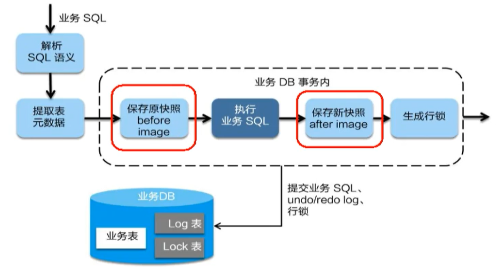

# Seata 处理分布式事务

[TOC]

## 一、概述

[Github Page](http://seata.io/zh-cn/)

### （一）解决的问题
单体应用被拆分为微服务应用，原来的多个模块被拆分为多个独立的应用，分别对应使用多个独立的数据源。且业务操作需要调用多个服务来完成，此时每个服务内部的数据一致性由本地事务来保证，但是全局的数据一致性无法保证。

### （二）概念

Seata 是一款开源的分布式事务解决方案，致力于提供高性能和简单易用的分布式事务服务。Seata 将为用户提供了 AT、TCC、SAGA 和 XA 事务模式，为用户打造一站式的分布式解决方案。
### （三）系统组成和处理过程

#### 1.系统组成：一个ID + 三个组件

- id：全局唯一的事务 ID：XID

- 三大组件
    - TC - 事务协调者
        维护全局和分支事务的状态，驱动全局事务提交或回滚。
    - TM - 事务管理器
        定义全局事务的范围：开始全局事务、提交或回滚全局事务。
    - RM - 资源管理器
        管理分支事务处理的资源，与 TC 交谈以注册分支事务和报告分支事务的状态，并驱动分支事务提交或回滚。


#### 2.处理过程
- TM 向 TC 申请开启一个全局事务，全局事务创建成功并生成一个全局唯一的 XID

- XID 在微服务调用链路的上下文中传播

- RM 向 TC 注册分支事务，将其纳入 XID 对应全局事务的管辖

- TM 向 TC 发起针对 XID 的全局提交或回滚请求

- TC 调度 XID 下管辖的全部分支事务完成提交或回滚请求

## 二、安装配置

[软件下载地址](https://github.com/seata/seata/releases)

- 找到解压之后的 conf 目录下的 file.conf 文件 
    - 将 mode 改为 db代表将日志存储到数据库
    - 修改数据库账号密码端口
- 找到 register.conf
    - 将 registry 与 config 里的 type 均改为 nacos
    - 同时修改两者下面的 nacos 信息为：`serverAddr = "localhost:8848"`

- 创建数据库 seata

    然后执行  config 目录下面的 mysql.sql 文件。1.0.0 之后不在提供，可以在 0.9 分支下面下载或者使用 https://github.com/seata/seata/tree/develop/script/client下 db 中的 mysql

- 先启动 nacos，然后启动 Seata。


## 三、项目模块配置

### （一）数据库准备
- 使用下面语句创建数据库：订单库：`seata_order`，库存库：`seata_storage`，账户信息库：`seata_account`。

    ```sql
    create database seata_order;
    create database seata_storage;
    create database seata_account;
    ```

- 创建对应的数据表：

    ```sql
    use seata_order;
    create table t_order(
        id bigint(11) not null auto_increment primary key,
        user_id bigint(11) default null comment '用户id',
        product_id bigint(11) default null comment '产品id',
        count  int(11) default null comment '数量',
        money decimal(11,0) default null comment '金额',
        status int(1) default null comment '订单状态：0 表示创建中， 1 表示已完结'
    )ENGINE = INNODB AUTO_INCREMENT = 7 default charset = utf8;
    
    
    use seata_storage;
    create table t_storage(
        id bigint(11) not null auto_increment primary key,
        product_id bigint(11) default null  comment '产品id',
        total int(11) default null comment  '总库存',
        used int(11) default null comment '已用库存',
        residue int(11) default null comment '剩余库存'
    )ENGINE = INNODB AUTO_INCREMENT = 2 default charset =utf8;
    
    INSERT INTO  seata_storage.t_storage(id, product_id, total, used, residue) values(1,1,100,0, 100);
    
    
    use seata_account;
    create table t_count(
        id bigint(11) not null auto_increment primary key  comment 'id',
        user_id bigint(11) default null comment '用户 id',
        total decimal(10,0) default null comment '总额度',
        used decimal (10,0) default null  comment  '已用额度',
        residue decimal(10,0) default 0 comment '剩余可用额度'
    )engine = INnodb auto_increment= 2 default charset =utf8;
    
    insert into seata_account.t_count(id, user_id, total, used, residue) values(1,1,1000,0,1000);
    ```

- 步骤三：将 conf 目录下的 db.undo_log.sql **在每个库**下面都执行一遍，总的库和表结构如下：


### （二）模块构建

**整体的流程**：下订单 => 减库存 => 扣余额 => 改订单状态。

- 用户下单时， 会在订单服务中创建一个订单、然后将通过远程调用库存服务来扣减下单商品的库存

- 在通过远程调用账户服务来扣减用户账户里面的余额。

- 最后在订单服务中修改订单状态为已完成。

对应包括三个微服务：订单、库存、账户

### （三）订单 Module：seata-order-service2001
- 步骤一：pom 文件

    nacos/seata/openfeign/mysql-connector

    ```xml
    <!-- seata-->
    <dependency>
        <groupId>com.alibaba.cloud</groupId>
        <artifactId>spring-cloud-starter-alibaba-seata</artifactId>
        <!-- 因为兼容版本问题,所以需要剔除它自己的seata的包 -->
        <exclusi
                 ons>
            <exclusion>
                <groupId>io.seata</groupId>
                <artifactId>seata-all</artifactId>
            </exclusion>
        </exclusions>
    </dependency>
    <!--引入我们使用的自己的seata对应的版本的依赖,而不是使用starter默认的版本-->
    <dependency>
        <groupId>io.seata</groupId>
        <artifactId>seata-all</artifactId>
        <version>1.4.0</version>
    </dependency>
    ```

- 步骤二：配置 yaml 文件

    ```yaml
    server:
      port: 2001
    
    spring:
      application:
        name: seata-order-service
      cloud:
        alibaba:
          seata:
            #自定义事务组名称需要与seata-server中的对应
            tx-service-group: fsp_tx_group
        nacos:
          discovery:
            server-addr: localhost:8848
      datasource:
        driver-class-name: com.mysql.jdbc.Driver
        url: jdbc:mysql://localhost:3306/seata_order
        username: root
        password: GJXAIOU
    
    feign:
      hystrix:
        enabled: false
    
    logging:
      level:
        io:
          seata: info
    
    mybatis:
      mapperLocations: classpath:mapper/*.xml
    ```

- 步骤三：在 resource 文件夹下面新建并配置 file.conf 和 registry.conf。

- 步骤四：主启动类

    ```java
    // 取消数据源的自动创建
    @SpringBootApplication(exclude = DataSourceAutoConfiguration.class)
    @EnableFeignClients
    @EnableDiscoveryClient
    ```

- 步骤五：实体类 domain

    - Order 类，对应于数据库表

        ```java
        @Data
        @NoArgsConstructor
        @AllArgsConstructor
        public class Order {
            private Long id;
            private Long userId;
            private Long productId;
            private Integer count;
            private BigDecimal money;
            //订单状态：0：创建中；1：已完结
            private Integer status;
        }
        ```

    - 返回结果封装类

        ```java
        @Data
        @AllArgsConstructor
        @NoArgsConstructor
        public class CommonResult<T> {
            private Integer code;
            private String message;
            private T data;
        
            public CommonResult(Integer code, String message) {
                this(code, message, null);
            }
        }
        ```

- 步骤六：dao 接口以及  Mapper 文件

    因为主要就是下单和修改订单状态两个步骤

    ```java
    @Mapper
    public interface OrderDao {
        // 1. 新建订单（下订单）
        void create(Order order);
    
        // 2. 修改订单状态，从 0 到 1
        void update(@Param("userId") Long userId, @Param("status") Integer status);
    }
    ```

    对应的 mapper 文件

    ```xml
    <mapper namespace="com.gjxaiou.springcloud.dao.OrderDao">
    
        <resultMap id="BaseResultMap" type="com.gjxaiou.springcloud.domain.Order">
            <id column="id" property="id" jdbcType="BIGINT"/>
            <result column="user_id" property="userId" jdbcType="BIGINT"/>
            <result column="product_id" property="productId" jdbcType="BIGINT"/>
            <result column="count" property="count" jdbcType="INTEGER"/>
            <result column="money" property="money" jdbcType="DECIMAL"/>
            <result column="status" property="status" jdbcType="INTEGER"/>
        </resultMap>
        <insert id="create">
            insert into t_order (id,user_id,product_id,count,money,status)
            values (null,#{userId},#{productId},#{count},#{money},0);
        </insert>
    
    
        <update id="update">
            update t_order set status = 1
            where user_id=#{userId} and status = #{status};
        </update>
    </mapper>
    ```

- 步骤七：==service 接口与实现类==

    OrderService 是入口，所以需要调用其它微服务接口，因为使用 Feign，所以同时需要提供其它微服务的对应接口。

    - OrderService

        ```java
        public interface OrderService {
            void create(Order order );
        }
        ```

    - StorageService

        ```java
        /**
         * 订单微服务要调用库存微服务，通过 Feign 接口调用，即过一会要去这个微服务：seata-stroage-service 下 /storage/decrease 方法区减库存。
         *
         * @Author GJXAIOU
         * @Date 2020/12/6 14:30
         */
        
        @FeignClient(value = "seata-stroage-service")
        public interface StorageService {
        
            @PostMapping(value = "/storage/decrease")
            CommonResult decrease(@RequestParam("productId") Long productId,
                                  @RequestParam("count") Integer count);
        }
        ```

    - AccountService

        ```java
        @FeignClient(value = "seate-account-service")
        public interface AccountService {
        
            @PostMapping(value = "/account/decrease")
            CommonResult decrease(@RequestParam("userId") Long userId,
                                  @RequestParam("money") BigDecimal money);
        
        }
        ```

        「注意」StorageService 和  AccountService 路径和其自身的模块路径一样。

    - OrderService 对应的实现类 OrderServiceImpl

        ```java
        @Service
        @Slf4j
        public class OrderServiceImpl implements OrderService {
        
            @Resource
            private OrderDao orderDao;
            @Resource
            private StorageService storageService;
            @Resource
            private AccountService accountService;
        
            @Override
            public void create(Order order) {
                // 1.新建订单（下订单）
                log.info("------> 开始新建订单---");
                orderDao.create(order);
        
                // 2.扣库存
                log.info("------> 订单微服务开始调用库存，扣减 count 操作开始");
                storageService.decrease(order.getProductId(), order.getCount());
                log.info("------> 订单微服务开始调用库存，扣减 count 操作完成");
        
                // 3.减金额
                log.info("------> 订单微服务开始调用账户，扣减 money 操作开始");
                accountService.decrease(order.getUserId(), order.getMoney());
                log.info("------> 订单微服务开始调用账户，扣减 money 操作结束");
        
                // 4.修改订单状态
                log.info("-------> 开始修改订单状态");
                orderDao.update(order.getUserId(), 0);
                log.info("-------> 结束修改订单状态");
        
                log.info("-------> 整个下单过程完成");
            }
        }
        ```

- 步骤八：controller 层

    这里的 controller 就是直接调用 service

    ```java
    @RestController
    public class OrderController {
    
        @Resource
        private OrderService orderService;
    
        @GetMapping("/order/create")
        public CommonResult create(Order order) {
            orderService.create(order);
            return new CommonResult(200, "订单创建成功");
        }
    }
    ```

- 步骤九：config 配置：MyBatis 的config 和数据源代理 config

    MyBatis 扫描位置配置

    ```java
    @Configuration
    @MapperScan("com.gjxaiou.springcloud.dao")
    public class MyBatisConfig {
    }
    ```

    数据源代理配置

    ```java
    @Configuration
    public class DataSourceProxyConfig {
        @Value("${mybatis.mapperLocations}")
        private String mapperLocations;
    
        @Bean
        @ConfigurationProperties(prefix = "spring.datasource")
        public DataSource druidDataSource() {
            return new DruidDataSource();
        }
    
        @Bean
        public DataSourceProxy dataSourceProxy(DataSource dataSource) {
            return new DataSourceProxy(dataSource);
        }
    
        @Bean
        public SqlSessionFactory sqlSessionFactoryBean(DataSourceProxy dataSourceProxy) throws Exception {
            SqlSessionFactoryBean sqlSessionFactoryBean = new SqlSessionFactoryBean();
            sqlSessionFactoryBean.setDataSource(dataSourceProxy);
            sqlSessionFactoryBean.setMapperLocations(new PathMatchingResourcePatternResolver().getResources(mapperLocations));
            sqlSessionFactoryBean.setTransactionFactory(new SpringManagedTransactionFactory());
            return sqlSessionFactoryBean.getObject();
        }
    }
    ```

### （四）库存模块：seata-storage-service2002

基本配置如上， service 和 controller 见下。

- StorageService

    ```java
    public interface StorageService {
        void decrease(Long productId, Integer count);
    }
    ```

- 对应的实现类： StorageServiceImpl

    ```java
    @Service
    public class StorageServiceImpl implements StorageService {
    
        private static final Logger LOGGER = LoggerFactory.getLogger(StorageServiceImpl.class);
    
        @Resource
        private StorageDao storageDao;
    
        /**
         * 扣减库存
         */
        @Override
        public void decrease(Long productId, Integer count) {
            LOGGER.info("------->storage-service中扣减库存开始");
            storageDao.decrease(productId, count);
            LOGGER.info("------->storage-service中扣减库存结束");
        }
    }
    ```

- controller

    ```java
    @RestController
    public class StorageController {
    
        @Autowired
        private StorageService storageService;
    
        /**
         * 扣减库存
         */
        @RequestMapping("/storage/decrease")
        public CommonResult decrease(Long productId, Integer count) {
            storageService.decrease(productId, count);
            return new CommonResult(200, "扣减库存成功！");
        }
    }
    ```

### （五）金额模块：seata-account-service2003

基本配置如上， service 和 controller 见下。

- AccountService

    ```java
    public interface AccountService {
        void  decrease(@RequestParam("userId") Long userId, @RequestParam("money")BigDecimal money);
    }
    ```

- 对应的实现类： AccountServiceImpl

    ```java
    @Service
    public class AccountServiceImpl implements AccountService {
        private static final Logger LOGGER = LoggerFactory.getLogger(AccountServiceImpl.class);
    
        @Resource
        AccountDao accountDao;
    
        /**
         * 扣减账户余额
         *
         * @param userId
         * @param money
         */
        @Override
        public void decrease(Long userId, BigDecimal money) {
            LOGGER.info("------->account-service中扣减账户余额开始");
            //模拟超时异常，全局事务回滚
            //暂停几秒钟线程
            try {
                TimeUnit.SECONDS.sleep(20);
            } catch (InterruptedException e) {
                e.printStackTrace();
            }
            accountDao.decrease(userId, money);
            LOGGER.info("------->account-service中扣减账户余额结束");
        }
    }
    ```

- controller

    ```java
    package com.gjxaiou.springcloud.controller;
    
    @RestController
    public class AccountController {
        @Resource
        AccountService accountService;
    
        /**
         * 扣减账户余额
         */
        @RequestMapping("/account/decrease")
        public CommonResult decrease(@RequestParam("userId") Long userId,
                                     @RequestParam("money") BigDecimal money) {
            accountService.decrease(userId, money);
            return new CommonResult(200, "扣减账户余额成功！");
        }
    }
    ```


### （六）测试

起始情况：共 100 个产品，用户共 1000 元，没有任何订单

- 正常情况测试：

通过 http://localhost:2001/order/create?userId=1&productId=1&count=10&money=100 执行之后可以看到 seata_storage 中库存少了 10，同时 seata_account 中钱少了 100.

- 异常情况测试：

    因为 Feign 默认调用超时时间为 1s，所以在 AccountServiceImpl 方法中暂停 20s 肯定会抛出异常（完整代码如上所示）。

    ```java
    //模拟超时异常，全局事务回滚
    //暂停几秒钟线程
    try {
        TimeUnit.SECONDS.sleep(20);
    } catch (InterruptedException e) {
        e.printStackTrace();
    }
    ```

    结果：订单加上了一个，但是状态为 0（未支付），但是，库存表中数据被扣除了。

- 解决：在业务的入口：OrderServiceImpl 类的 create 方法上面加上 @globalTransactional 注解

    再次访问前台还是异常，但是后台数据库进行了回滚，所以数据库也没有变化。


## 四、分布式事务执行流程

- TM 开启分布式 事务（TM 向 TC 注册全局事务记录）
- 按照业务场景，编排数据库、服务等事务内资源（RM 向 TC 汇报资源准备状态）
- TM 结束分布式事务，事务一阶段结束（TM 通知 TC 提交/回滚分布式事务）
- TC 汇总事务信息，决定分布式事务是提交还是回滚。
- TC 通知所有 RM 提交/ 回滚资源，事务二阶段结束。


两阶段提交协议的演变：

- 一阶段：业务数据和回滚日志记录在同一个本地事务中提交，释放本地锁和连接资源。

    在一阶段， SeaTa 会拦截「业务 SQL」

    - 解析 SQL 语义，找到「业务 SQL」要更新的业务数据，在业务数据被更新之前，将其保存成「before image」。
    - 执行「业务 SQL」更新业务数据，在业务数据更新之后将其保存为「after image」，最后生成行锁。

    以上操作全部在一个数据库事务内完成，保证操作的原子性。

    

- 二阶段：

    - 提交异步化，非常快速地完成。
    - 回滚通过一阶段的回滚日志进行反向补偿。

    二阶段分为两种情况：提交和回滚

    - 提交

        二阶段如果顺利提交，因为「业务 SQL」在一阶段已经提交至数据库，所以 Seata 框架只需要将**一阶段保存的快照数据和行锁删除，完成数据清理即可**。

        

    - 回滚

        二阶段如果是回滚， Seata 就需要回滚一阶段已经执行的 「业务 SQL」，还原业务数据。

        回滚方式便是使用 「before image」还原业务数据，但是在还原前要首先检验脏写，对比「数据库当前业务数据」和 「after image」。如果两份

        

        数据完全一致就说明没有脏写，可以还原业务数据。如果不一致就说明有脏写，出现脏写之后需要人工处理。

        

### Debug 调试

三个项目全部开启 debug，然后访问上述网址，注意在 AccountServiceImpl 类的 decrease 方法的最后一行 LOGGER.info 这行打断点。

访问之后，查看 seata 库的 branch_table 表以及其他库中的 undo_log

xid 全局 id  是一样的， 但是 branch_Id 不同。

比如在 seata_order 中的 undo_log 中就有 rollback_info 列，可以复制出来 JSON 格式化之后，可以看到你们有 before image 和 after image。其他的 undo_log 也都有 

