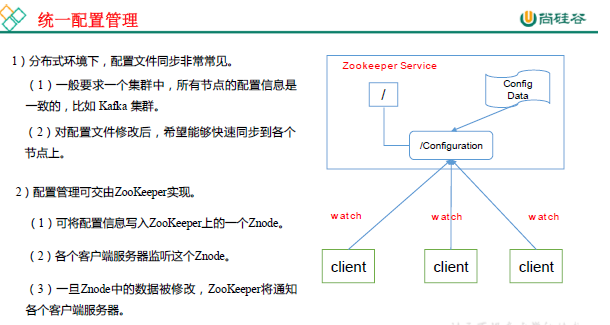
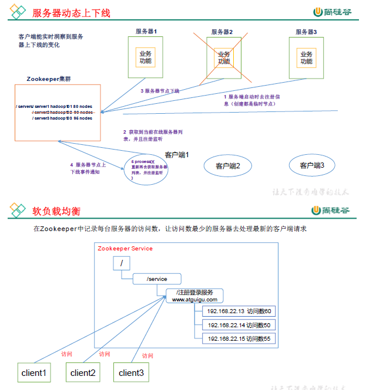
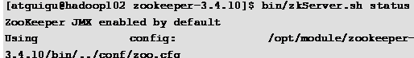

# 尚硅谷大数据技术之 Zookeeper


## 第 1 章 Zookeeper 入 门

## 1.1   概述

Zookeeper 是一个开源的分布式的，**为分布式应用提供协调服务**的Apache 项目。

              

## 1.2特点


**1.3**    数据结构**

ZooKeeper数据模型的结构与Unix文件系统很类似，整体上可以看作是一棵树，每个节点称做一
个ZNode。**每一个ZNode默认能够存储1MB的数据**，每个ZNode都可以通过其路径唯一标识。


 

**1.4**   **应用场景**

提供的服务包括：统一命名服务、统一配置管理、统一集群管理、服务器节点动态上下线、软负载均衡等。




 		



 

## 1.5   下载地址

### 1.  官网首页：

https://zookeeper.apache.org/


###                       

### 2．下载截图，如图 5-5，5-6，5-7 所示

图 5-5  Zookeeper 下载（一）

 

|      |                                              |
| ---- | -------------------------------------------- |
|      |  |


 

图 5-6  Zookeeper 下载（二）

 

|      |                                              |
| ---- | -------------------------------------------- |
|      |  |

图 5-7  Zookeeper 下载（三）


# 第 2 章 Zookeeper 安 装

## 2.1   本地模式安装部署

### 1.  安装前准备

（1） 安装Jdk

（2） 拷贝 Zookeeper 安装包到 Linux 系统下

（3）  解压到指定目录


### 2.  配置修改

（1）  将/opt/module/zookeeper-3.4.10/conf 这个路径下的 zoo_sample.cfg 修改为 zoo.cfg；


（2） 打开zoo.cfg 文件，修改 dataDir 路径：

![文本框: [atguigu@hadoop102 zookeeper-3.4.10]$ vim zoo.cfg](Zookeeper.resource/clip_image021.gif)

修改如下内容：

dataDir=/opt/module/zookeeper-3.4.10/zkData


（3）  在/opt/module/zookeeper-3.4.10/这个目录上创建zkData 文件夹


### 3.  操作 Zookeeper

（1）  启动 Zookeeper


（2） 查看进程是否启动

![文本框: [atguigu@hadoop102 zookeeper-3.4.10]$ jps 4020 Jps 4001 QuorumPeerMain ](Zookeeper.resource/clip_image024.gif)

（3）  查看状态：




（4） 启动客户端：

![文本框: [atguigu@hadoop102 zookeeper-3.4.10]$ bin/zkCli.sh](Zookeeper.resource/clip_image026.gif)

（5） 退出客户端：

 

（6） 停止 Zookeeper

![文本框: [atguigu@hadoop102 zookeeper-3.4.10]$ bin/zkServer.sh stop](Zookeeper.resource/clip_image028.gif)


## 2.2   配置参数解读

Zookeeper中的配置文件zoo.cfg中参数含义解读如下：

- 1．tickTime =2000：通信心跳数，Zookeeper 服务器与客户端心跳时间，单位毫秒

    Zookeeper使用的基本时间，服务器之间或客户端与服务器之间维持心跳的时间间隔， 也就是每个tickTime时间就会发送一个心跳，时间单位为毫秒。

    它用于心跳机制，并且设置最小的session超时时间为两倍心跳时间。(session的最小超时时间是2*tickTime)

- 2．initLimit =10：LF 初始通信时限（启动时候）

    集群中的Follower跟随者服务器与Leader领导者服务器之间初始连接时能容忍的最多心跳数（tickTime的数量），用它来限定集群中的Zookeeper服务器连接到Leader的时限。（tickTime * initLimit）

- 3．syncLimit =5：LF 同步通信时限（正常运行时候）

    集群中Leader与Follower之间的最大响应时间单位，假如响应超过syncLimit * tickTime，Leader认为Follwer死掉，从服务器列表中删除Follwer。（tickTime * initLimit）

- 4．dataDir：数据文件目录+数据持久化路径

    主要用于保存 Zookeeper 中的数据。

- 5．clientPort =2181：客户端连接端口

    监听客户端连接的端口。

 

# 第 3 章 Zookeeper 实战（开发重点）

## 3.1   分布式安装部署

### 1.  集群规划

在 hadoop102、hadoop103 和 hadoop104 三个节点上部署 Zookeeper。【步骤见上】

### 2.  解压安装

（1）  解压 Zookeeper 安装包到/opt/module/目录下：`tar -zxvf zookeeper-3.4.10.tar.gz -C /opt/module/`

（2） 同步/opt/module/zookeeper-3.4.10 目录内容到 hadoop103、hadoop104：【在  module 目录下输入】`xsync zookeeper-3.4.10/`

### 3.  配置服务器编号【这里示例序号分别为 2,3，4】

（1） 在/opt/module/zookeeper-3.4.10/这个目录下创建 zkData：`mkdir -p zkData`

（2）  在/opt/module/zookeeper-3.4.10/zkData 目录下创建一个 myid 的文件：`touch myid`

​	添加 myid 文件，注意一定要在 linux 里面创建，在notepad++里面很可能乱码

（3）  编辑 myid 文件,在文件中添加与 server 对应的编号：`vi myid` 然后里面输入 2 即可。

（4）  拷贝配置好的 zookeeper 到其他机器上：【在 zkData 中输入】`xsync myid`

​	并分别在 hadoop103、hadoop104 上修改 myid 文件中内容为 3、4

### 4.  配置 zoo.cfg 文件

（1）  重命名/opt/module/zookeeper-3.4.10/conf 这个目录下的zoo_sample.cfg 为 zoo.cfg：`mv zoo_sample.cfg zoo.cfg`

（2） 打开zoo.cfg 文件：`vim zoo.cfg`

修改数据存储路径配置：`dataDir=/opt/module/zookeeper-3.4.10/zkData`

并增加如下配置

```properties
##########################cluster#######################
server.2=hadoop102:2888:3888
server.3=hadoop103:2888:3888
server.4=hadoop104:2888:3888
```

（3）  同步zoo.cfg 配置文件：`xsync zoo.cfg`

（4） 第二步配置参数解读：`server.A=B:C:D`

​	**A** 是一个数字，表示这个是第几号服务器；

 集群模式下配置一个文件myid，这个文件在 dataDir 目录下，这个文件里面有一个数据就是 A 的值，Zookeeper 启动时读取此文件，拿到里面的数据与 zoo.cfg 里面的配置信息比较从而判断到底是哪个 server。

**B** 是这个服务器的地址；

**C** 是这个服务器 Follower 与集群中的 Leader 服务器交换信息的端口；

**D** 是万一集群中的 Leader 服务器挂了，需要一个端口来重新进行选举，选出一个新的Leader，而这个端口就是用来执行选举时服务器相互通信的端口。

### 4．集群操作

（1）  **分别在每个机器**的 zookeeper-3.4.10 文件夹下面使用命令分别启动 Zookeeper：`bin/zkServer.sh start`；

（2）  查看状态：同上可以在每个机器的上述文件夹下面输入：`bin/zkServer.sh status JMX enabled by default`

## 3.2   客户端命令行操作

| 命令基本语法     | 功能描述                                               |
| ---------------- | ------------------------------------------------------ |
| help             | 显示所有操作命令                                       |
| ls path [watch]  | 使用 ls 命令来查看当前 znode 中所包含的内容            |
| ls2 path [watch] | 查看当前节点数据并能看到更新次数等数据                 |
| create           | 普通创建  -s   含有序列  -e   临时（重启或者超时消失） |
| get path [watch] | 获得节点的值                                           |
| set              | 设置节点的具体值                                       |
| stat             | 查看节点状态                                           |
| delete           | 删除节点                                               |
| rmr              | 递归删除节点                                           |

### 1.  启动客户端

`[guigu@hadoop103 zookeeper-3.4.10\]bin/zkCli.sh`

### 2.  显示所有操作命令

`[zk: localhost:2181(CONNECTED) 1] help`             

### 3.  查看当前 znode 中所包含的内容

`ls /`

\4.  查看当前节点详细数据

```shell
zk: localhost:2181(CONNECTED) 1] ls2 / 
[zookeeper] 
cZxid = 0x0 
ctime = Thu Jan 01 08:00:00 CST 1970 
mZxid = 0x0 
mtime = Thu Jan 01 08:00:00 CST 1970 
pZxid = 0x0
cversion = -1
dataVersion = 0
aclVersion = 0 ephemeralOwner = 0x0 dataLength = 0
numChildren = 1
```

5. 分别创建 2 个普通节点【创建结点同时必须写数据】

```shell
[zk: localhost:2181(CONNECTED) 3] create /sanguo "jinlian" 
Created /sanguo
[zk:	localhost:2181(CONNECTED) 4] create	/sanguo/shuguo "liubei"
Created /sanguo/shuguo
```

6. 获得节点的值

```shell
[zk: localhost:2181(CONNECTED) 5] get /sanguo jinlian
cZxid = 0x100000003
ctime = Wed Aug 29 00:03:23 CST 2018 mZxid = 0x100000003
mtime = Wed Aug 29 00:03:23 CST 2018 pZxid = 0x100000004
cversion = 1
dataVersion = 0
aclVersion = 0 ephemeralOwner = 0x0 dataLength = 7
numChildren = 1
[zk: localhost:2181(CONNECTED) 6]
[zk: localhost:2181(CONNECTED) 6] get /sanguo/shuguo liubei
cZxid = 0x100000004
ctime = Wed Aug 29 00:04:35 CST 2018 mZxid = 0x100000004
mtime = Wed Aug 29 00:04:35 CST 2018 pZxid = 0x100000004
cversion = 0
dataVersion = 0
aclVersion = 0 ephemeralOwner = 0x0 dataLength = 6
numChildren = 0
```

7. 创建短暂节点

```shell
[zk:	localhost:2181(CONNECTED)	7]	create	-e	/sanguo/wuguo "zhouyu"
Created /sanguo/wuguo
```

（1）  在当前客户端是能查看到的

```shell
[zk: localhost:2181(CONNECTED) 3] ls /sanguo [wuguo, shuguo]
```

（2） 退出当前客户端然后再重启客户端

```shell
[zk: localhost:2181(CONNECTED) 12] quit 
[atguigu@hadoop104 zookeeper-3.4.10]$ bin/zkCli.sh
```

（3）  再次查看根目录下短暂节点已经删除

 ```shell
[zk: localhost:2181(CONNECTED) 0] ls /sanguo 
[shuguo] ## 没有 wuguo 了
 ```

### 8.  创建带序号的节点

（1）  先创建一个普通的根节点/sanguo/weiguo

```shell
[zk:	localhost:2181(CONNECTED)	1]	create	/sanguo/weiguo "caocao"
Created /sanguo/weiguo
```

（2） 创建带序号的节点

```shell
[zk:	localhost:2181(CONNECTED)	2]	create	-s /sanguo/weiguo/xiaoqiao "jinlian"
Created /sanguo/weiguo/xiaoqiao0000000000
[zk:	localhost:2181(CONNECTED)	3]	create	-s /sanguo/weiguo/daqiao "jinlian"
Created /sanguo/weiguo/daqiao0000000001
[zk:	localhost:2181(CONNECTED)	4]	create	-s /sanguo/weiguo/diaocan  "jinlian" Created /sanguo/weiguo/diaocan0000000002
```

如果原来没有序号节点，序号从 0 开始依次递增。如果原节点下已有 2 个节点，则再排序时从 2 开始，以此类推。

9.  修改节点数据值

`[zk: localhost:2181(CONNECTED) 6] set /sanguo/weiguo "simayi"`

10. 节点的值变化监听

（1）  在 hadoop104 主机上注册监听/sanguo 节点数据变化

```shell
[zk: localhost:2181(CONNECTED) 26] [zk: localhost:2181(CONNECTED) 8] get /sanguo watch
```

（2） 在 hadoop103 主机上修改/sanguo 节点的数据

​	`[zk: localhost:2181(CONNECTED) 1] set /sanguo "xisi"`

（3）  观察hadoop104 主机收到数据变化的监听

```shell
WATCHER::
WatchedEvent  state:SyncConnected    type:NodeDataChanged    path:/sanguo
```

**只通知一次，如果再次修改就不会通知，除非再次创建路径监听**。

11.  节点的子节点变化监听（路径变化）

（1）  在 hadoop104 主机上注册监听/sanguo 节点的子节点变化

```shell
[zk: localhost:2181(CONNECTED) 1] ls /sanguo watch [aa0000000001, server101]
```

（2） 在 hadoop103 主机/sanguo 节点上创建子节点

```shell
[zk: localhost:2181(CONNECTED) 2] create /sanguo/jin "simayi" Created /sanguo/jin
```

（3）  观察hadoop104 主机收到子节点变化的监听

```shell
WATCHER::
WatchedEvent   state:SyncConnected     type:NodeChildrenChanged
path:/sanguo
```

12.   删除节点

`[zk: localhost:2181(CONNECTED) 4] delete /sanguo/jin`

13. 递归删除节点

`[zk: localhost:2181(CONNECTED) 15] rmr /sanguo/shuguo`

14.   查看节点状态

```shell
[zk: localhost:2181(CONNECTED) 17] stat /sanguo cZxid = 0x100000003
ctime = Wed Aug 29 00:03:23 CST 2018 mZxid = 0x100000011
mtime = Wed Aug 29 00:21:23 CST 2018 pZxid = 0x100000014
cversion = 9
dataVersion = 1
aclVersion = 0 ephemeralOwner = 0x0 dataLength = 4
numChildren = 1
```

### **3.3** **API** **应用**

**3.3.1**  **Eclipse** **环境搭建**

1. 创建一个 Maven 工程

2. 添加 pom 文件

```xml
<dependencies>
	<dependency>
		<groupId>junit</groupId>
		<artifactId>junit</artifactId>
		<version>RELEASE</version>
	</dependency>
	<dependency>
		<groupId>org.apache.logging.log4j</groupId>
		<artifactId>log4j-core</artifactId>
		<version>2.8.2</version>
	</dependency>
<!--
https://mvnrepository.com/artifact/org.apache.zookeeper/zook eeper -->
	<dependency>
		<groupId>org.apache.zookeeper</groupId>
		<artifactId>zookeeper</artifactId>
		<version>3.4.10</version>
	</dependency>
</dependencies>

```

3. 拷贝 log4j.properties 文件到项目根目录

    需要在项目的 src/main/resources 目录下，新建一个文件，命名为“log4j.properties”，在文件中填入。

```properties
log4j.rootLogger=INFO, stdout log4j.appender.stdout=org.apache.log4j.ConsoleAppender log4j.appender.stdout.layout=org.apache.log4j.PatternLayout log4j.appender.stdout.layout.ConversionPattern=%d	%p	[%c]
- %m%n log4j.appender.logfile=org.apache.log4j.FileAppender log4j.appender.logfile.File=target/spring.log
log4j.appender.logfile.layout=org.apache.log4j.PatternLayout log4j.appender.logfile.layout.ConversionPattern=%d	%p	[%c]
- %m%n        
```


3.3.2  创建 ZooKeeper 客户端

```java
private static String connectString = "hadoop102:2181,hadoop103:2181,hadoop104:2181"; private static int sessionTimeout = 2000; 
private ZooKeeper zkClient = null;

@Before
public void init() throws Exception {

	zkClient = new ZooKeeper(connectString, sessionTimeout, new Watcher() {
		@Override
		public void process(WatchedEvent event) {
            // 收到事件通知后的回调函数（用户的业务逻辑）
			System.out.println(event.getType()	+"--"+ event.getPath());
			// 再次启动监听，监听代码放在这里
			try {
				zkClient.getChildren("/", true);
			} catch (Exception e) { 
                e.printStackTrace();
				}
        });
    }
```


**3.3.3**   **创建子节点**

```java
// 创建子节点
@Before
public void create() throws Exception {

// 参数 1：要创建的节点的路径； 参数 2：节点数据 ； 参数 3：节点权限 ；参数 4：节点的类型
String	nodeCreated	= zkClient.create("/atguigu", "jinlian".getBytes(),Ids.OPEN_ACL_UNSAFE,CreateMode.PERSISTENT);
}
```


**3.3.4**    **获取子节点并监听节点变化**

```java
// 获取子节点
@Test
public void getChildren() throws Exception {
	List<String> children = zkClient.getChildren("/",true);
    for(String child : children){
    	System.out.println(child);
    }
    // 延迟阻塞
    Thread.sleep(Long.MAX_VALUE);
}    
```


**3.3.5**    **判断** **Znode** **是否存在**

```java
// 判断 Znode 是否存在
@Test
public void exist() throws Exception{
	Stat stat = zkClient.exists("eclipse", false);
    System.out.println(stat == null ? "not exist" : "exist");
}
```

**3.4**   **监听服务器节点动态上下线案例**

1. 需求

    某分布式系统中，主节点可以有多台，可以动态上下线，任意一台客户端都能实时感知到主节点服务器的上下线。

2. 需求分析，如图 5-12 所示

    

### 3.  具体实现

（0）  先在集群上创建/servers 节点

`[zk: localhost:2181(CONNECTED) 10] create /servers "servers" Created /servers`

（1） 服务器端向 Zookeeper 注册代码

```java
package com.atguigu.zkcase;

import java.io.IOException;

import org.apache.zookeeper.WatchedEvent;
import org.apache.zookeeper.Watcher;
import org.apache.zookeeper.ZooKeeper;
import org.apache.zookeeper.ZooDefs.Ids;

public class DistributeServer {

    private static String connectString = "hadoop102:2181,hadoop103:2181,hadoop104:2181";
    private static int sessionTimeout = 2000;
    private ZooKeeper zk = null;
    private String parentNode = "/servers";

    // 创建到 zk 的客户端连接
    public void getConnect() throws IOException {
        zk = new ZooKeeper(connectString, sessionTimeout, new Watcher() {
            @Override
            public void process(WatchedEvent event) {
            }
        });
    }

    // 注册服务器
    public void registServer(String hostname) throws Exception {
        String create = zk.create(parentNode + "/server", hostname.getBytes(),
                Ids.OPEN_ACL_UNSAFE, CreateMode.EPHEMERAL_SEQUENTIAL);
        System.out.println(hostname + " is online " + create);
    }

    // 业务功能
    public void business(String hostname) throws Exception {
        System.out.println(hostname + " is working ...");
        Thread.sleep(Long.MAX_VALUE);
    }

    public static void main(String[] args) throws Exception {

        // 1 获取zk 连接
        DistributeServer server = new DistributeServer();
        server.getConnect();

        // 2 利用zk 连接注册服务器信息
        server.registServer(args[0]);

        // 3 启动业务功能
        server.business(args[0]);
    }
```

（2） 客户端代码

```java
package com.atguigu.zkcase;

import java.io.IOException;
import java.util.ArrayList;
import java.util.List;

import org.apache.zookeeper.WatchedEvent;
import org.apache.zookeeper.Watcher;
import org.apache.zookeeper.ZooKeeper;

public class DistributeClient {

    private static String connectString = "hadoop102:2181,hadoop103:2181,hadoop104:2181";
    private static int sessionTimeout = 2000;
    private ZooKeeper zk = null;
    private String parentNode = "/servers";

    // 创建到 zk 的客户端连接
    public void getConnect() throws IOException {
        zk = new ZooKeeper(connectString, sessionTimeout, new Watcher() {

            @Override
            public void process(WatchedEvent event) {
                // 再次启动监听
                try {
                    getServerList();
                } catch (Exception e) {
                    e.printStackTrace();
                }
            }
        });
    }

    // 获取服务器列表信息
    public void getServerList() throws Exception {
        // 1 获取服务器子节点信息，并且对父节点进行监听
        List<String> children = zk.getChildren(parentNode, true);
        // 2 存储服务器信息列表
        ArrayList<String> servers = new ArrayList<>();
        // 3 遍历所有节点，获取节点中的主机名称信息
        for (String child : children) {
            byte[] data = zk.getData(parentNode + "/" + child, false, null);
            servers.add(new String(data));
        }
        // 4 打印服务器列表信息
        System.out.println(servers);
    }

    // 业务功能
    public void business() throws Exception {

        System.out.println("client is working ...");
        Thread.sleep(Long.MAX_VALUE);
    }

    public static void main(String[] args) throws Exception {

        // 1 获取zk 连接
        DistributeClient client = new DistributeClient();
        client.getConnect();

        // 2 获取 servers 的子节点信息，从中获取服务器信息列表
        client.getServerList();

        // 3 业务进程启动
        client.business();
    }
}
```

## 第 4 章 Zookeeper 内部原理

### 选举机制

1） 半数机制：集群中半数以上机器存活，集群可用。所以 Zookeeper 适合安装奇数台服务器。

2） Zookeeper 虽然在配置文件中并没有指定 Master 和 Slave。但是，Zookeeper 工作时，是有一个节点为Leader，其他则为 Follower，Leader 是通过内部的选举机制临时产生的。

3） 以一个简单的例子来说明整个选举的过程。

 

假设有五台服务器组成的Zookeeper 集群，它们的 id 从 1-5，同时它们都是最新启动的，也就是没有历史数据，在存放数据量这一点上，都是一样的。假设这些服务器依序启动，来看看会发生什么，如图 5-8 所示。

 

图 5-8 Zookeeper 的选举机制

**总结**：每个先投自己，然后投完如果不够半数以上，就该投 id 大的一个，如果某个 ID 的票数超过一半则成为 Leader，后续不会变动了。

（1） 服务器 1 启动，发起一次选举。服务器 1 投自己一票。此时服务器 1 票数一票， 不够半数以上（3 票），选举无法完成，服务器 1 状态保持为 LOOKING；

（2） 服务器 2 启动，再发起一次选举。服务器 1 和 2 分别投自己一票并交换选票信息：此时服务器 1 发现服务器 2 的 ID 比自己目前投票推举的（服务器 1）大，更改选票为推举服务器 2。此时服务器 1 票数 0 票，服务器 2 票数 2 票，没有半数以上结果，选举无法完成，服务器 1，2 状态保持 LOOKING

（3） 服务器 3 启动，发起一次选举。此时服务器 1 和 2 都会更改选票为服务器 3。此次投票结果：服务器 1 为 0 票，服务器 2 为 0 票，服务器 3 为 3 票。此时服务器 3 的票数已经超过半数，服务器 3 当选 Leader。服务器 1，2 更改状态为 FOLLOWING，服务器 3 更改状态为 LEADING；

（4） 服务器 4 启动，发起一次选举。此时服务器 1，2，3 已经不是 LOOKING 状态， 不会更改选票信息。交换选票信息结果：服务器 3 为 3 票，服务器 4 为 1 票。此时服务器 4 服从多数，更改选票信息为服务器 3，并更改状态为 FOLLOWING；

（5） 服务器 5 启动，同 4 一样当小弟。

## 3.2 节点类型


**4.2**  **Stat** **结构体**

就是使用 stat 之后显示的结点信息。

1）czxid-创建节点的事务 zxid

每次修改ZooKeeper 状态都会收到一个zxid 形式的时间戳，也就是 ZooKeeper 事务 ID。事务 ID 是 ZooKeeper 中所有修改总的次序。每个修改都有唯一的 zxid，如果 zxid1 小于 zxid2，那么 zxid1 在 zxid2 之前发生。

2）ctime - znode 被创建的毫秒数(从 1970 年开始) 

3）mzxid - znode 最后更新的事务 zxid

4）mtime - znode 最后修改的毫秒数(从 1970 年开始) 5）pZxid-znode 最后更新的子节点 zxid

6） cversion - znode 子节点变化号，znode 子节点修改次数

7） dataversion - znode 数据变化号

8） aclVersion - znode 访问控制列表的变化号

9） ephemeralOwner- 如果是临时节点，这个是 znode 拥有者的 session id。如果不是临时节点则是 0。

10） dataLength- znode 的数据长度

11） numChildren - znode 子节点数量

## 4.3   监听器原理（面试重点）


**监听器原理**

1、监听原理详解：

1） 首先要有一个main()线程

2） 在main线程中创建Zookeeper客户端，这时就会创建两个线

程，一个负责网络连接通信（connet），一个负责监听（listener）。

3） 通过connect线程将注册的监听事件发送给Zookeeper。

4） 在Zookeeper的注册监听器列表中将注册的监听事件添加到列表中。

5） Zookeeper监听到有数据或路径变化，就会将这个消息发送

给listener线程。

6） listener线程内部调用了process()方法。


2、常见的监听

1）    监听节点数据的变化  get path [watch]

2） 监听子节点增减的变化  ls path [watch]

## 4.5写数据流程

 

## 第 **5** 章 企业面试真题

**5.1**   **请简述** **ZooKeeper** **的选举机制**

详见 4.4。

## 5.2  ZooKeeper 的监听原理是什么？

详见 4.3。

## 5.3  ZooKeeper 的部署方式有哪几种？集群中的角色有哪些？集群最少需要几台机器？

（1） 部署方式单机模式、集群模式

（2） 角色：Leader 和 Follower

（3） 集群最少需要机器数：3

## 5.4  ZooKeeper 的常用命令

ls create get delete set…

## 什么是Zookeeper

------

**ZooKeeper 是一种分布式==协调==服务，用于管理大型主机**。在分布式环境中协调和管理服务是一个复杂的过程。ZooKeeper 通过其简单的架构和 API 解决了这个问题。ZooKeeper 允许开发人员专注于核心应用程序逻辑，而不必担心应用程序的分布式特性。


## Zookeeper数据模型

**类似于树**

Znode包含的有


- data:Znode存储的数据信息
- ACL:记录Znode的访问权限，即哪些人或哪些 IP 可以访问本节点
- stat:包含Znode的各种元数据（如事务ID,版本号、时间戳）
- child:子节点

## Zookeeper的事件通知

------

可以把Watch理解成Znode的触发器，当Znode发生改变（create、delete、setData），就会触发Znode上注册的事件，请求Watch的客户会接收到异步通知。
具体交互过程如下：

- 客户端调用 getData 方法，watch 参数是 true。服务端接到请求，返回节点数据，并且在对应的哈希表里插入被 Watch 的 Znode 路径，以及 Watcher 列表。
    
- 当被 Watch 的 Znode 已删除，服务端会查找哈希表，找到该 Znode 对应的所有 Watcher，异步通知客户端，并且删除哈希表中对应的 Key-Value。
    

## Zookeeper 的一致性

------


Zookeeper Service集群是一主多从结构。
更新数据时，首先更新到主节点，在同步到从节点。
读取数据，从任意从节点读取。
为保证主从节点数据一致性，Zookeeper采用ZAB协议。

### ZAB

ZAB协议定义的三种节点状态：

- Looking:选举状态
- Following:从节点所出状态
- Leading:Leader节点所处状态

**最大ZAID**：最大 ZXID 也就是节点本地的最新事务编号

假如 Zookeeper 当前的主节点挂掉了，集群会进行崩溃恢复。ZAB 的崩溃恢复分成三个阶段：

- 选举阶段，此时集群中的节点处于 Looking 状态。它们会各自向其他节点发起投票，投票当中包含自己的服务器 ID 和最新事务 ID（ZXID）。接下来，节点会用自身的 ZXID 和从其他节点接收到的 ZXID 做比较，如果发现别人家的 ZXID 比自己大，也就是数据比自己新，那么就重新发起投票，投票给目前已知最大的 ZXID 所属节点。每次投票后，服务器都会统计投票数量，判断是否有某个节点得到半数以上的投票。如果存在这样的节点，该节点将会成为准 Leader，状态变为 Leading。其他节点的状态变为 Following。
- 发现阶段，用于在从节点中发现最新的 ZXID 和事务日志。
- 同步阶段，把 Leader 刚才收集得到的最新历史事务日志，同步给集群中所有的 Follower。只有当半数 Follower 同步成功，这个准 Leader 才能成为正式的 Leader。

### ZAB 的数据写入

ZAB 的数据写入涉及到 Broadcast 阶段，简单来说，就是 Zookeeper 常规情况下更新数据的时候，由 Leader 广播到所有的 Follower。其过程如下：

- 客户端发出写入数据请求给任意 Follower。
- Follower 把写入数据请求转发给 Leader。
- Leader 采用二阶段提交方式，先发送 Propose 广播给 Follower。
- Follower 接到 Propose 消息，写入日志成功后，返回 ACK 消息给 Leader。
- Leader 接到半数以上ACK消息，返回成功给客户端，并且广播 Commit 请求给 Follower


ZAB 协议既不是强一致性，也不是弱一致性，而是处于两者之间的单调一致性（顺序一致性）。它依靠事务 ID 和版本号，保证了数据的更新和读取是有序的。

## Zookeeper应用场景

------

- 分布式锁：利用 Zookeeper 的临时顺序节点，可以轻松实现分布式锁。
- 服务注册与发现：利用Znode和Watcher，可以实现分布式的注册和发现（Dubbo）
- 共享配置和状态信息：Redis 的分布式解决方案 Codis，就利用了 Zookeeper 来存放数据路由表和 codis-proxy 节点的元信息。同时 codis-config 发起的命令都会通过 ZooKeeper 同步到各个存活的 codis-proxy。此外，Kafka、HBase、Hadoop，也都依靠Zookeeper同步节点信息，实现高可用。