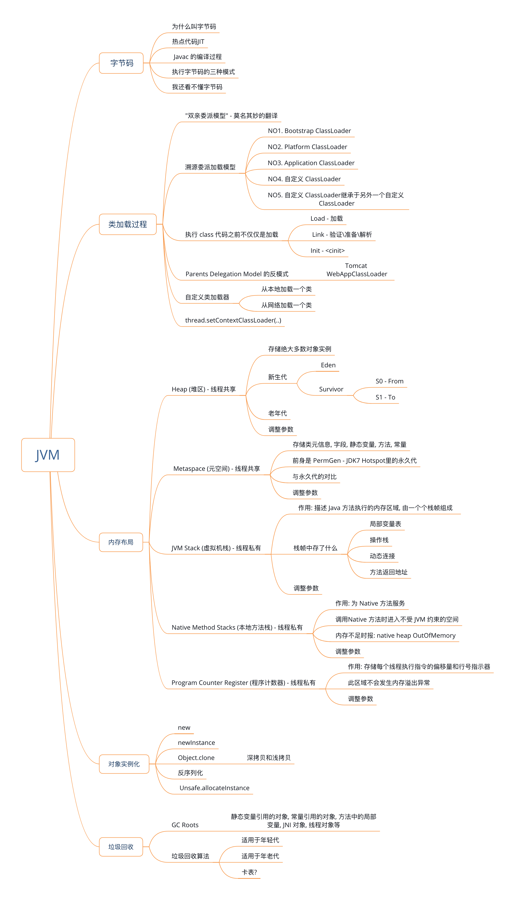

## 第四章 JVM




- 字节码

  - 什么是字节码? 以及为什么要引入字节码?

    因为在 Java 出现之前,开发软件需要为每个平台比如 Linux\ Windows \Unix , 分别开发出一个对应版本, 工作存在重复性;

    Java 为每个平台分别提供一个相应的JVM实现, 在运行时JVM 启动后通过把字节码解释成对应平台的机器指令运行. 这样实现了跨平台特性.

    字节码是Java 程序和机器指令之间的一个中间层.

  - 为什么叫字节码

    因为在 JVM 当中大概有 200 多个虚拟机指令, 一个字节 8 Byte可以存储 256个指令,因此成为字节码.

  - javac 的编译过程

    Javac 编译 Java 文件成为 class 文件的过程分为三个步骤:

    1. 词法分析: 分割出单词, 操作符, 控制符, 得到 token 流, 传给语法解析器
    2. 语法解析: 把此法解析得到的 token 流转化为语法树
    3. 语义分析: 检查关键字的使用是否合理, 类型是否匹配, 作用于是否正确等. 语义分析完成之后生成字节码.

  - 执行字节码的三种模式

    1. 解释执行

       JVM 在运行时把读取到的字节码指令转为机器指令,来执行程序

    2. 编译执行

       JVM 把 Java 代码直接编译成本地机器指令, 运行时直接运行机器指令, 这种方式编译阶段比较耗时

    3. 混合执行

       启动时用解释执行的方式, 这样有利于快速启动;

       执行时如果发现热点代码, 会把热点代码转化成机器码,直接交给 CPU 执行.

  - 热点代码 JIT - Just In Time

    在 Java 程序执行过程中, JVM 通过热点代码的统计, 识别高频调用的方法, 循环体, 公共模块等,把这些热点代码转为机器码之后直接交由 CPU 执行, 速度很快

  - 我还看不懂字节码(TBC-1)

    字节码指令看不懂

- 类加载过程. [极客时间深入拆解 Java 虚拟机](<https://time.geekbang.org/column/article/11523>)

  - 类加载是将一个.class 文件字节码文件实例化成 Class 对象并进行相关初始化的过程. 在这个过程中, JVM 会初始化继承树上还没有初始化过的所有父类, 并且执行父类中的静态代码块和静态变量赋值语句.

  - 类加载所使用的方式英文原意是: "Parents Delegation Model". 国内第一批翻译人员将其翻译为"双亲委派模型" 实在会让人觉得莫名其妙, "双亲"总会给人"要问问爸爸和妈妈"的感觉.

  - "Parents Delegation Model" 翻译为 溯源委派加载模型 更为贴切, 因为这个类加载的过程就是, 当前使用的类加载器如果加载不到需要使用的类的时候, 就会先让自己的父类加载器尝试加载这个类; 而他的父类加载器不是先尝试自己加载, 而是也会先让他自己的父类加载器尝试加载这个类; 一致问到最根上的那个类加载器.

    因为最根上的那个类加载器没有父类加载器, 那么他就会尝试自己去加载指定的类, 如果能加载到,则会告诉自己子类加载器自己加载到了, 子类加载器就会使用这个类; 如果自己加载不到, 则子类加载器才会去尝试加载

  - 溯源委派加载模型的步骤 / 内置类加载器

    1. 离我们写的程序最近的类加载器是 Application ClassLoader, 由 Platform ClassLoader 创建
    2. Application ClassLoader 的父类加载器是 Extention ClassLoader (Java 9 之后称之为 Platform ClassLoader), 他是由 Bootstrap ClassLoader 创建的
    3. 最根的类加载器是 Bootstrap ClassLoader. 他没有父类加载器了. 他是在 JVM 启动的时候创建的类加载器
    4. 除了 Bootstrap ClassLoader 之外所有的 ClassLoader 都是 java.lang.ClassLoader的子类

  - 自定义一个类加载器

    - 从本地文件系统加载一个类: 无需自定义 class loader, 直接用 URLClassLoader

      ```java
      URL[] urls = new URL[1];
      File loadPath = new File("SomeDirectory");
      urls[0] = loadPath.toURI().toURL();
      ClassLoader classLoader = new URLClassLoader(urls);
      Class clazzA = classLoader.loadClass("xx.yy.zz.A"); // 得到 A类对象
      ```

    - 从网络加载一个类. 跟上面的类似, 只是把 File 改成一个 URI

      ```java
      URI uri = new URI("http://localhost/myweb/easycoding.jar");
      urls[0] = uri.toURL();
      ClassLoader classLoader = new URLClassLoader(urls);
      ```

      - 注意: 从指定位置加载一个类时, 可以有两种资源指定方式:

        1. 指定一个目录: 这个目录下的文件夹结构必须跟类路径保持一致

        2. 指定一个 jar: 这个 class 要打包进入jar 文件, 并且保证打包路径与类路径一致

        3. [看这里-SOF](https://stackoverflow.com/a/738422/853191) >> So you have two options:

           1. Refer to the directory that the .class file is in
           2. Put the .class file into a JAR and refer to that

           (1) is easier in this case, but (2) can be handy if you're using networked resources.

    - 加密这个.class文件, 类加载器中解密加载

      1. 对类进行加密

         ```java
         // 得到对称密钥
         KeyGenerator keyGenerator = KeyGenerator.getInstance("DESede");
         keyGenerator.init(168);
         SecretKey secretKey = keyGenerator.generateKey();
         
         // 把对称密钥按照 byte 数组进行保存
         byte[] keyBytes = secretKey.getEncoded();
         FileOutputStream fileOutputStream = new FileOutputStream("ThePathToTheFileYouWantToSave");
         fileOutputStream.write(keyBytes);
         
         // 读取密钥并用密钥
         FileInputStream fileInputStream = new FileInputStream("ThePathToTheKey");
         byte[] keyBytes = new byte[fileInputStream.available()];
         fileInputStream.read(keyBytes);
         SecrectKeySpec key = new SecretKeySpec(keyBytes, "DESede");
         
         // 以 byte[] 形式读取 class 文件
         FileInputStream classInputStream = new FileInputStream("ThePathToTheClass");
         byte[] classBytes = new byte[classInputStream.available()];
         classInputStream.read(classBytes);
         
         // 用密钥将 class 文件加密
         Cipher cipher = Cipher.getInstance("DESede");
         cipher.init(Cipher.ENCRYPT_MODE, key); // 加密模式
         byte[] encryptedBytes = cipher.doFinal(classBytes);
         
         // 将加密后的byte[]保存到 class 文件
         FileOutputStream fileOutputStream = new FileOutputStream("ThePathToSaveEncryptedClass");
         fileOutputStream.write(encryptedBytes);
         ```

         

      2. 自定义 classloader, 并且在 findClass 方法中对加密过的类进行加载并解密

         ```java
         class MyClassLoader extends ClassLoader {
           @Override
           public Class findClass(String name) {
             // 首先根据要加载的类的name 得到加密该类存储的路径
             String classPath = "xx";
             FileInputStream classInputStream = new FileInputStream(classPath);
             byte[] encryptedBytes = new byte[classInputStream.available()];
             classInputStream.read(encryptedBytes);
             
             // 得到密钥
             FileInputStream keyInputStream = new FileInputStream("ThePathToKey");
             byte[] keyBytes = new byte[keyInputStream.available()];
             SecretKeySpec key = new SecretKeySpec(keyBytes, "DESede");
             
             // 解密
             Cipher cipher = Cipher.getInstance("DESede");
             cipher.init(Cipher.DECRYPT_MODE, key);
             byte[] classBytes = cipher.doFinal(encryptedBytes);
             
             // 加载字节码
             return defineClass(name, classBytes, 0, classBytes.length);
           }
         }
         
         // 在 main 方法中调用这个 class loader
         public class ClassLoaderDemo {
           
           public static void main(String[] args) {
             MyClassLoader classLoader = new MyClassLoader();
             Class clazz = classLoader.findClass("xx.yy.zz.A");
             Object object = clazz.newInstance();
             Method method = clazz.getMethod("test");
             method.invoke(object);
           }
         }
         ```

         

      3. class loader 执行逻辑. loadClass / findClass

         1. 执行 ApplicationClassLoader.loadClass(), 此方法会调用 findLoadedClass() 来检查该类是否已经被加载; 如果被加载过了则直接使用, 如果没被加载则执行第2步;
         2. 执行 parent (PlatformClassLoader) classloader.loadClass() 方法, 也会调用 findLoadedClass() 检查, 如果被加载过了则直接使用, 如果没被加载则执行第3步;
         3. 执行 parent (BootstrapClassLoader) classLoader.loadClass() 方法, 如果加载不到则执行第 4 步
         4. 执行 (PlatformClassLoader) findClass() 方法, 如果加载不到则执行第 5 步
         5. 执行 (ApplicationClassLoader) findClass() 方法
         6. 如果还是加载不到则 ClassNotFoundException

         * 注意: 这个过程是先调用 loadClass 整个调用链先走到 BootstrapClassLoader, 先让这个class loader 去加载,如果加载不到的情况下, 让二级 loader 也就是 PlatformClassLoader 去加载, 如果还是加载不到, 则由三级 loader 也就是 ApplicationClassLoader 进行findClass. 然后再由自定义的 class loader 进行 findClass 的操作
         * 所以一般情况下我们自定义 class loader 只需要extends ClassLoader 然后 override findClass 即可
         * 只有我们需要修改 loadclass 的过程时, 才会考虑 override loadClass 方法
         * 例如: Tomcat中的 WebAppClassLoader 就是优先加载 web application 下的 class
         * Tomcat 类加载器 (TBC-3)
         * 热插拔的类加载器OSGi (TBC-4)

      4. 关于 findLoadedClass 方法

         loadClass() 方法默认会先去已经加载过的类中检查要访问的类是否已经被加载, 如果已经被加载就不会重复加载, 这个检查的方法是 `ClassLoader.findLoadedClass(name)` 他的实现是一个 native 方法, 说明他会去本地内存中检查这个类是否已经被加载过. 而从 Java8 之后, JVM 中引入了元空间 MetaSpace. 他存储了已经加载过的类\ 常量\ 静态变量等. 而元空间使用的就是本地内存.

    - 类的唯一性是由类的描述符以及类的 class loader 共同确定(TBC-5)

  - 执行 class 代码之前要做的事情

    1. Load: 读取 .class 文件的二进制流, 并转化为特定的数据结构. 最终生成 java.lang.Class的一个实例对象

    2. Link.

       验证: 校验 class 文件是否满足 JVM 的约束条件,比如变量\常量类型是否正确, final 是否合法等

       准备: 为静态变量分配内存等, 还会在准备阶段构造其他跟类层次相关的数据结构, 比如说用来实现虚方法动态绑定的方法表. 

       - 在 class 文件被加载到 JVM 之前, 他不可能知道他要调用的其他类和方法的内存地址, 因此在需要引用到这些成员时, 会根据调用方法的类名\方法名\参数信息得到一个符号引用

       解析: 确保类与类之间相互引用的关系是否正确

       - 将符号引用转化为实际引用

    3. Init 类的初始化. 这个阶段会调用 <clinit> 方法, 这个方法是 Java 编译器提供的方法,因为这个方法名'<clinit>' 在 Java 语法中不是一个合法的方法名所以不会跟 Java 代码冲突. 类的初始化包括静态代码块, 静态变量的赋值, 静态常量的赋值 (TBC-2) [类的初始化和对象的初始化](https://www.javaworld.com/article/3040564/java-101-class-and-object-initialization-in-java.html)

       - JVM 会通过加锁来确保类的 <clinit> 方法只会被执行一次
       - 因此可以在 static 代码块中创建实例来实现单例模式

  - ClassNotFoundException V.S. NoClassDefFoundError

    - ClassNotFoundException, 在编码的时候是需要主动 catch exception 的. 可能发生的有三种方法的调用:
      1. Class.forName()
      2. ClassLoader.loadClass()
      3. ClassLoader.findSystemClass()
    - NoClassDefFoundError 只有运行时才能体现
    - ClassNotFoundException 是发生在类加载阶段, 需要的类加载不到的情景
    - NoClassDefFoundError 是: 发生在类link 阶段,:当把已经加载到的类中的符号引用解析成实际引用的时候发现需要的那个类没有在 JVM 内(class 文件丢失) 
      1. 另外在 init 阶段, 引用到的那个类的实例化过程失败(类的实例化<clinit>, 并非对象的实例化<init>, 比如在 static 代码块中的代码抛出异常导致类加载失败), 会抛出 `ExceptionInInitializerError`
    - [SOF - What are the differences between ClassNotFoundException and NoClassDefFoundError](https://stackoverflow.com/a/28323193/853191)
    - [DZone - ClassNotFoundException vs. NoClassDefFoundError](<https://dzone.com/articles/java-classnotfoundexception-vs-noclassdeffounderro>)
    
  - thread.setContextClassLoader(..) 线程上下文类加载器 (TBC-6)

- 内存布局

  - JVM内存布局由5 部分组成

    1. Heap 堆

       1. 存储着绝大多数的对象实例

       2. 分为新生代(也有叫年轻代的) 和 老年代.

       3. 新生代分为一个 Eden 和两个 Survivor 区.

          两个Survivor 区大小一样. S0 / S1. 其中只使用一块空间, 另一块空间保持空闲, 只做垃圾回收过程当中的对象复制使用.

          默认情况下 Eden 和 Survivor 的比例是 8:1:1

          通常情况下对象会在 Eden 区创建, 当 Eden 区域的内存不够用的时候会触发 YGC (Young Garbage Collection), 这个过程会将不再使用的对象直接回收, 而正在使用的对象会被复制到其中一个 Survivor 区.

          正在使用的 Survivor 区的对象也会进行垃圾回收扫描,如果不再使用也会内存回收.

          然后把Eden 区存活的对象以及 Survivor 区存活的对象一并复制到另外一个空闲的 Survivor 区. 

          并且交换 S0/S1.始终保持一个区是空闲的.

          在每个对象的对象头中有一个标记位是用来记录这个对象在 S0/S1之间来回复制的次数. 默认当复制的次数超过 15 次就会进入老年代.

          如果 Eden 区经过垃圾回收之后, 他所占用的内存加上 Survivor 区对象的内存不能在另外一个 Survivor 区完全存放, 则复制次数较高的对象就算复制次数不够 15 次也会进入老年代

       4. 当老年代空间不够用的时候就会触发 FGC (Full Garbage Collection)
       5. [调整参数 - 极客时间: 深入拆解 Java 虚拟机 - 垃圾回收*下](<https://time.geekbang.org/column/article/13137>)
          - -Xms256M -Xmx1024M — 设定JVM 最小的 heap 内存为 256MB. 最大为 1024MB.
          - -XX:SurvivorRatio — 调整 Survivor 区内存大小
          - ...

    2. Metaspace 元空间

       - 存储了类的元信息, 字段, 静态属性, 方法, 常量等

       - 在 JDK7 以及之前的版本中称为 PermGen - 持久代, JDK8 之后称为元空间

       - 持久代使用的是JVM 内存, 元空间使用的是本地内存; 字符串常量在JDK7 是存在持久代的, 而在 JDK8 之后是存到了堆内存中

       - PermGen调整内存大小的参数是: -XX:MaxPermSize-1280m

       - Metaspace 不能调整内存大小, 但加上这个参数启动 JVM不报错

         | PermGen (JDK7) 存储内容 | Metaspace (JDK8)存储内容 |
         | ----------------------- | ------------------------ |
         | 字符串常量              | 移动到堆内存 - 去存储了  |
         | 类元信息                | 还在 Metaspace           |
         | 方法                    | 还在 Metaspace           |
         | 静态属性                | 还在 Metaspace           |
         | 常量                    | 还在 Metaspace           |
         | 字段                    | 还在 Metaspace           |

       

    3. JVM Stack 虚拟机栈 - 线程私有
       - JVM Stack 是描述 Java 方法执行的内存区域
       - Java 方法的执行过程就是虚拟机栈中的栈帧入栈和出栈的过程. 进入一个方法时就会往虚拟机栈中压入一个栈帧; 而方法执行完毕时就会把栈帧从栈中弹出来.
       - 栈帧中存储了方法执行时所需的必要因子:
         1. 局部变量表 - 保存了方法的参数和方法中的局部变量
         2. 操作栈 - 方法执行过程中,会有各种指令往栈中写入和提取信息, JVM 的执行引擎是基于栈的执行引擎, 字节码指令集的定义都是基于栈类型的.
         3. 动态连接 ??
         4. 方法返回地址 - 方法执行时有两种退出情况, 正常退出和异常退出. 无论何种情况都要能保证回到方法被调用的地址
       - 调整参数? 如果无限循环对方法进行递归调用, 则会出现 StackOverflowError. 
         - -Xss128k — 调整虚拟机栈内存大小
    4. Native Method Stack 本地方法栈
       - 类似于虚拟机栈. 不过这个内存区域是用来保存本地方法调用相关参数的
       - 本地内存不足的时候, JVM 会报 native heap OutOfMemory
    5. Program Counter Register 程序计数器
       - 用来存放执行指令的偏移量和行号指示器等.
       - 线程的执行或恢复都要依赖程序计数器
       - JVM 中唯一一块不会发生内存溢出的区域

- 对象实例化

  -  调用构造方法 new Object() 来实例化一个对象
  - Class.forName 或 classLoader.loadClass('xx') 得到一个 class 对象, 然后调用 class 对象的 newInstance 方法得到对象实例 - 会调用无参构造. 如果没有无参构造则会出现异常: InstantiationException.
  - Object.clone (TBC-7)
  - 反序列化. 反序列化不是不会调用任何对象的构造方法; 而是会调用到类的继承链当中第一个(从本类开始到父类的方向上)不可序列化类的无参构造
  - Unsafe.allocateInstance() (TBC-8)

- 垃圾回收

  - 垃圾回收的过程是从 GC Roots 开始遍历, 把被这些 GC Roots 引用到的对象标记为可达对象; 而没有被标记的对象说明是不可达的, 则会被垃圾回收器释放内存
  - GC Roots 有:
    1. 静态变量引用的对象
    2. 常量引用引用的对象
    3. 方法中局部变量
    4. JNI 对象
    5. 线程对象
  - 常见的垃圾回收算法
    - 首先JVM可以给不同代使用不同的垃圾回收算法
    - 对于新生代,由于对象存活期较短, 因此可以频繁的调用耗时较短的垃圾回收算法
    - 对于老年代里的对象大部分都是存活期很长, 不容易被回收的对象. 因此不能频繁触发老年代的垃圾回收
    - 针对新生代的垃圾回收器共有三个:
      - Serial, Parallel Sacavenge 和 Parallel New . 采用的都是 标记-复制 算法. 
      - 标记-复制 算法是将新生代当中存活的对象复制到 Survivor 区
    - 针对老年代的垃圾回收器也有三个:
      - Serial Old, Parallel Old. 他们采用的是标记-压缩算法
      - Serial 是单线程执行; Parallel 是多线程执行
      - 标记-压缩算法, 是将标记过的仍然存活的对象复制到一块连续的内存空间
      - CMS 采用的是 标记-清除 算法; 并发执行. 除了少数的几个操作需要 Stop-The-World 之外, 他可以在应用程序运行的过程当中执行老年代的垃圾回收.
      - G1出现之后, Java 9 中废弃了 CMS 垃圾回收器
    - G1(Garbage First) 横跨新生代和老年代, 将内存区域划分为多个大小相同的 region. 包括 Eden, Survivor, Old, Humongus 四种类型.
      - G1能够针对每个细分的区域来进行垃圾回收. 在选择进行垃圾回收的区域时, 他会优先选择可回收对象较多的区域.
    - 卡表
      - 在 YGC 时主要关注的是 GC Roots 对新生代内存对象的引用关系, 但仍然需要考虑老年代对象对新生代对象的引用
      - 为了在 YGC 的时候不遍历整个老年代, 引入了卡表的概念
      - 卡表将整个堆划分为一个个大小为 512 字节的空间,每个空间称为一个卡表, 用来存储一个标识位. 如果有这个卡表中代表的对象持有对新生代对象的引用, 则这个卡表是脏的
      - 在进行 YGC 的时候, 就不用扫描整个老年代,而是仅仅需要扫描标记为脏的卡表上的对象即可.
  - JVM 内存为什么要分代?
    - 对象存活时间不同; 大部分对象在 new 出来之后很块就可以被回收了; 如果不分代的话, 垃圾回收的时候每次都需要遍历所有的内存空间, 性能低
  - JDK 11 - ZGC ??
  - YGC / Minor GC / Major GC / Full GC 的关系
    - Young GC 基本就是 Minor GC, 只回收新生代
    - Major GC 基本就是 Full GC, 新生代和老年代都回收
    - 还有一种叫做 Old GC, 只触发老年代的回收


### 资源

- [Custom ClassLoader Java Example](<https://www.concretepage.com/java/custom-classloader-java-example>)
- [Java ClassLoader](<https://www.journaldev.com/349/java-classloader>)
- [how is the control flow to findClass of](https://stackoverflow.com/questions/3544614/how-is-the-control-flow-to-findclass-of)
- [[How should I load Jars dynamically at runtime?](https://stackoverflow.com/questions/60764/how-should-i-load-jars-dynamically-at-runtime)](<https://stackoverflow.com/questions/60764/how-should-i-load-jars-dynamically-at-runtime>)
- [IBM-探讨 Java 类加载器](<https://www.ibm.com/developerworks/cn/java/j-lo-classloader/index.html>)


(TBC-1) [学习阅读字节码](<https://github.com/chinalwb/EasyCoding/issues/13>)

(TBC-2) [<init> / <clinit>, 类的初始化和对象的初始化](<https://github.com/chinalwb/EasyCoding/issues/14>)

(TBC-3)[Tomcat的类加载器](<https://github.com/chinalwb/EasyCoding/issues/15>)

(TBC-4)[热插拔的类加载器OSGi](<https://github.com/chinalwb/EasyCoding/issues/16>)

(TBC-5)[类的唯一性](<https://github.com/chinalwb/EasyCoding/issues/17>)

(TBC-6) [线程上下文类加载器](<https://github.com/chinalwb/EasyCoding/issues/18>)

(TBC-7) [对象的深拷贝和浅拷贝](<https://github.com/chinalwb/EasyCoding/issues/19>)

(TBC-8) [Unsafe](<https://github.com/chinalwb/EasyCoding/issues/20>)

(TBC-9) [JVM垃圾回收-任重道远啊!](<https://github.com/chinalwb/EasyCoding/issues/21>)

-9-
