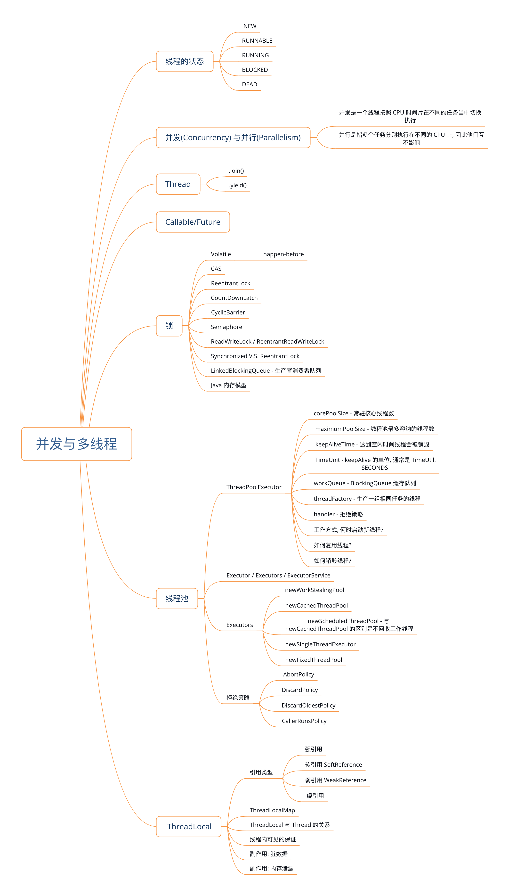

## 并发与多线程

#### 线程的状态:

----

NEW: 线程被创建出来但是还没有执行的时候是NEW 状态

RUNNABLE: 调用了线程的start 方法之后, 真正进入运行之前的状态. start 方法不能多次被调用,否则抛出 IllegalStateException

RUNNING: run方法在执行过程当中的状态. 

BLOCKED: 线程进入阻塞状态: 锁被其他线程占用; 主动阻塞: Thread.sleep() / join() 等; 等待阻塞: Object.wait()

DEAD: run 方法执行完毕. 或线程因异常退出.

#### 并发 (Concurrency) 与 并行 (Parallelism)

----

Concurrency - 在一个 CPU 上面按照 CPU 时间片执行不同的线程中的代码,称为并发

Parallelism - 多个 CPU 并行执行多个任务

#### Callable / Future

-----

- Callable / Future 需要配合 ThreadPoolExecutor 来使用
- Callable 是一个接口, 并且带有泛型参数, 其中有一个 call 方法, 返回值就是 Callable 指定的泛型类型.
- 当往 ThreadPoolExecutor 上 submit 一个 callable 之后会返回一个 Future 对象, callable 的 call 方法会被调用
- Future调用 get 方法会阻塞调用线程, 直到该 Future 对应的线程已经返回结果.

#### Semaphore / CountDownLatch / CyclicBarrier

----

- Semaphore - 设置一个数字, 代表可用的资源总数. 
  - aquire() — 每个线程需要取得一个资源的时候, 都要从 semaphore 获取一下, 获取成功则可以继续执行; 否则需要等待(阻塞)
  - release() — 每个线程在执行完任务之后都要调用 release 方法来释放信号. 这样其他线程可以继续 acquire.
- CountDownLatch - 设置一个数字, 代表要完成的任务数
   - countDown() -- 完成一个任务之后调用这个方法, count down 就会减去 1
   - await() -- 调用此方法之后阻塞当前线程, 等待 count down 变为 0 之后, 继续执行后续代码
   - 任务线程(worker thread)调用 countDown 方法. 主线程(启动线程/调度线程)调用 await. 当所有的任务线程都执行完毕之后, 主线程继续执行后续代码.
- CyclicBarrier - 设置一个数字, 代表要完成的任务数(这一点跟 CountDownLatch 非常相似)
  - await() — 完成一个任务之后,调用这个方法,表示此线程已经到达 barrier. 调用此方法之后会将完成数量+1, 直到完成处理达到设定的数值, 就可以继续执行 await 后续的代码
  - 每个任务一个线程, 当所有线程都完成各自的任务之后调用 await 方法, 然后所有线程同时执行await 后续的代码. 
  - 用 CyclicBarrier 时, 子线程在调用完 await 之后也会进入阻塞状态, 当所有的线程都执行到 await 之后又同时开始执行各自的 await 后续的代码.
  - CyclicBarrier 默认是可重复利用的. 当所有的线程都执行了 await 方法之后 CyclicBarrier 默认开启下一轮的拦截: 即如果有新的线程继续调用 await 方法, 则重复利用CyclicBarrier, 此时这个线程会被阻塞, 直到其他线程也trip the barrier.
- [ArrayBlockingQueue V.S. LinkedBlockingQueue](https://stackoverflow.com/a/35975458/853191)

#### ThreadPoolExcutor

----

- 线程池核心参数:
  1. coreSize - 核心线程数量
  2. Maximum pool size - 最大线程池线程数量
  3. keepAliveTime - 非核心线程存活时间
  4. TimeUnit - 存活时间单位
  5. BlockingQueue - workQueue
  6. ThreadFactory - 线程工厂
  7. RejectExecutionHandler - 拒绝策略

- 线程池工作方式
  1. 调用 threadPoolExecutor.execute(Runnable) 或者 submit 方法激活线程池来执行任务
  2. 如果当前线程池中的线程数量还没有达到核心线程数, 则每次提交任务都会新建一个线程(worker thread)
  3. 如果线程池中的核心线程都已经被激活并且都在执行任务中, 则此时提交任务的话需要排队, 进入 work queue
  4. 如果 work queue 已经满了, 不能再接收新的任务了, 则会创建新的线程 worker thread
  5. 如果线程池中的线程数量已经达到了最大数量, 则此时再提交任务的时候就会被拒绝, 触发拒绝策略
- 线程复用
  1. 每个 worker thread 被启动之后, 都会进入一个循环, 在循环体中, 会尝试从 work queue 当中取出新的任务来执行
  2. 如果新的任务来了 则直接在这个 worker thread 当中运行, 以此来实现了线程复用
- 线程销毁
  1. worker thread 从 work queue 中取出任务的时候, 如果当前的线程数已经大于核心线程数量, 则会调用 workQueue.pool(keepAliveTime, TimeUnit)方法, 此方法启用超时策略, 即 keepAliveTime, 这个 worker thread 如果在指定时间内得不到新的任务, 则会返回 null
  2. worker thread 的循环如果得到了一个空任务(null) 就会销毁这个线程.
  3. 另: 如果从 work queue 中取出任务的时候, 线程池中的线程数量小于 core size, 则调用的是 workQueue.take() 方法, 该方法不指定timeout, 则会一直阻塞.

#### Executor / ExecutorService / Executors

----

- Executor 是一个接口: 里面只有一个方法 `execute(Runnable)`
- ExecutorService 也是一个接口. 他 extends Executor 接口. 里面增加了一些方法: `submit(Runnable)` / `submit(Callable)` / `shutdown()` / `shutdownNow()` / `awaitTermination(timeout, timeUnit)` / ..
- Executors 是一个工厂工具类, 里面有一些静态方法, 比如:
  -  `Executors.newWorkStealingPool()` 返回 `ForkJoinPool`
  -  `Executors.newCachedThreadPool()`  最大可以允许创建 Integer.MAX_VALUE 个线程. 默认线程存活时间是 60 秒
  -  `Executors.newSingleThreadExecutor()`  创建只有一个线程的线程池, 提交到这个线程池中的任务会串行执行
  -  `Executors.newScheduledThreadPool()`  线程数最大可以到 Integer.MAX_VALUE. 可以周期性运行任务`executeAtFixedRate` - 如果上一个任务执行超时, 则下一个立刻执行; `executeAtFixedDelay` - 始终在上一个执行完毕之后的指定时间后执行下一个. 这个 ScheduledThreadPool 线程池不会回收工作线程.
  -  `Executors.newFixedThreadPool()` - 创建一个固定线程数量的线程池. keepAliveTime 为 0.

#### RejectExecutionHandler

---

1. ThreadPoolExecutor.AbortPolicy - 直接拒绝并抛出异常: RejectedExecutionException
2. ThreadPoolExecutor.DiscardPolicy - 什么也不做, 直接忽略
3. ThreadPoolExecutor.DiscardOldestPolicy - 先把队列中第一个删除 然后把任务加到队列末尾. workQueue.pool() / execute(runnable)
4. ThreadPoolExecutor.CallerRunsPolicy - 往线程池中放任务的那个线程来执行这个 runnable

#### ThreadLocal

----

- 引用类型
  1. 强引用: 即便是要 OOM 了也不会回收强引用的对象内存
  2. 软引用: OOM发生之前会清除软引用的内存
  3. 弱引用: 如果只有一条线路弱引用到某对象, 则下一次 YGC 的时候就会回收这个对象的内存
  4. 虚引用: 当这个对象被回收时收到一个系统通知
- ThreadLocal 执行原理以及弱引用的使用
  - [ThreadLocal.pdf](./ThreadLocal.pdf)

- To Read

----

* [Multithreading interview questions](<https://dzone.com/articles/top-15-java-multithreading-concurrency-interview-q>)
* [J.U.C. samples](<http://tutorials.jenkov.com/java-util-concurrent/java-fork-and-join-forkjoinpool.html>)

TBC

----

1. [CompletableFuture](<https://github.com/chinalwb/EasyCoding/issues/29>)
2. [AbstractQueuedSynchronizer](<https://github.com/chinalwb/EasyCoding/issues/30>)
3. [SOF - ArrayBlockingQueue V.S. LinkedBlockingQueue](<https://github.com/chinalwb/EasyCoding/issues/31>)