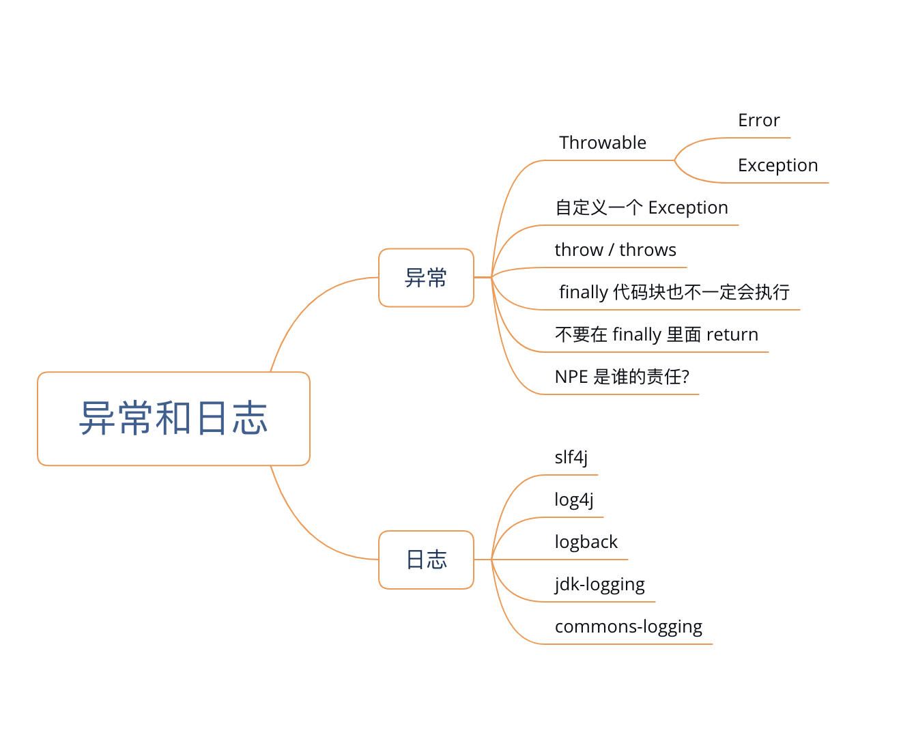
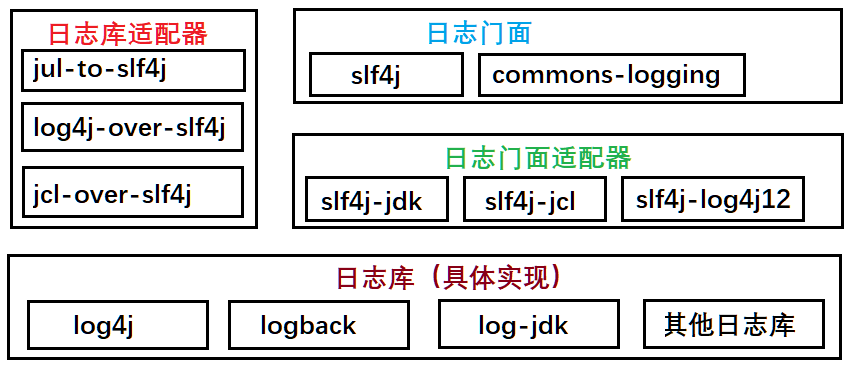

## 第五章：异常和日志



异常即需要解决以下三个问题：

- 哪里发生异常：
    - 代码中通过 try - catch 来发现异常，捕获异常时分为稳定代码（不会出错的代码，如参数定义）和非稳定代码（异常需要捕获的）
    - 原则：稳定代码不要放在 try-catch 中，减少 try-catch 范围，便于定位问题；
- 谁来处理异常：
    - throw 是方法内部抛出具体异常类对象的关键字，throws 是用于方法签名上，表示方法定义者可以通过次方法声明向上抛出异常对象；
    - 如果异常在当前方法的处理范围内则直接捕获异常并处理，没必要向外透出；否则向上抛出，有上层方法或者框架来处理；
- 如何处理异常：
    - 如果方法内处理，**需要根据不同的业务场景进行定制化处理，如重试、回滚等操作**，如果向上抛出，需要在异常对象中添加上下文参数、局部变量、运行环境等信息，有利于排查问题。
    - 严禁捕获异常后什么都不做或者打印一行日志；

## 一、异常分类

- 从 Java 类结构上看，所有异常都是 Throwable 的子类， 细分为：`java.lang.Error` 类和 `java.lang.Exception` 类。

- 从程序运行角度来看

  - Error 通常是致命异常，如 StackOverflowError / OutOfMemoryError，出现这种情况说明系统出现了不可控的错误，程序无法自行处理,，需要人工介入处理。
  - Exception 是非致命异常，比如 ArrayIndexOutOfBoundsException / ClassNotFoundException 等

- 从编码角度来看，Exception 分为 checked exception 和 unchecked exception：

  - checked exception 又叫做受检异常，需要在编码过程中显式的处理（比如方法内 try-catch 或处理不了则在方法上 throws 出去），比如 ClassNotFoundException / SQLException，因为这种异常如果不处理的话 编译器会提醒编程人员处理, 所以叫做受检异常；又细分为两类：

      - 无能为力、引起注意型：

          此类异常程序无法处理，如字段超长导致 SQLException，即使多次重试也无法解决异常，则处理方式为：完整的保存异常现场，供开发人员解决；

      - 可以处理类型：

          如发生未授权异常（UnAuthorizedException），程序可以跳转到权限申请页面；

  - unchecked exception 为非受检异常（运行时异常）, 这种异常都继承于 RuntimeException，如 NullPointerException / ArrayIndexOutOfBoundsException 等；可以细分为三类：

      - 可预测的异常（Predicted Exception）

          包括 IndexOutOfBoundsException/NullPointerException，基于对代码稳定性考虑，**该类异常不应该产生或者抛出，应该提前做好边界检查和空指针判断等）

      - 需要捕获的异常（Caution Exception）

          如使用 Dubbo 进行 RPC 调用时候产生的远程服务超时异常 DubboTimeException，**此类异常客户端必须显式处理，不能因为服务端异常导致客户端的不可用**，处理方式可以是重试或者降级处理；

      - 可以透传的异常（Ignored Exception）

          主要是框架或者系统产生的且会自行处理的异常，程序是无需关心的；如 Spring 框架中抛出 NoSuchRequestsHandleMethodException 异常，Spring 会自己完成异常处理，默认将自身抛出的异常自动映射到合适的状态码，如启动防护机制然后跳转到 404 页面；

## 二、Try 代码块

Try 后面必须跟随 catch 或者 finally 两者之一；

- try 代码块监视代码的执行过程，一旦发现异常就直接跳转到 catch，如果没有 catch 则跳转到 finally；

- catch 代码块，如果没有任何异常则不会执行，如果发现异常可以处理或者向上抛出；

- finally 代码块，主要用于清理资源、释放连接、关闭管道流等；**如果此时出现异常也要 try - catch**，无论是否发生异常（即使发生 OutOfMemoryError），该部分都会执行除非遇到以下三种情况:

    - 没有进入 try 代码块

    - try 代码块进入死循环或死锁状态

    - 在 try 代码块中执行了 system.exit() 操作

- finally 是在 return 之后执行的，此时将要 return 的结果已经被暂存起来，等待 finally 代码块执行结束之后再将之前暂存的结果返回；因此如果方法有返回值，在 finally 代码块中对数据进行更改不会直接传递给被调用者 。

  ```java
  // 示例一：finally 中赋值
  public class Demo1 {
  	public static void main(String[] args) {
  		System.out.println(finallyNotWork());
  	}
  
  	public static  int finallyNotWork(){
  		int temp  = 100;
  		try {
  			throw new Exception();
  		}catch (Exception e){
  			return ++temp;
  		}finally {
  			temp = 999;
  		}
  	}
  }
  // 程序输出为 101，而不是 999
  ```

  对应字节码为：

  ```java
  Compiled from "Demo1.java"
  public class Demo1 {
    public Demo1();
      Code:
         0: aload_0
         1: invokespecial #1                  // Method java/lang/Object."<init>":()V
         4: return
  
    public static void main(java.lang.String[]);
      Code:
         0: getstatic     #2                  // Field java/lang/System.out:Ljava/io/PrintStream;
         3: invokestatic  #3                  // Method finallyNotWork:()I
         6: invokevirtual #4                  // Method java/io/PrintStream.println:(I)V
         9: return
  
    public static int finallyNotWork();
      Code:
         0: bipush        100
         2: istore_0
         3: new           #5                  // class java/lang/Exception
         6: dup
         7: invokespecial #6                  // Method java/lang/Exception."<init>":()V
        10: athrow
        11: astore_1
            // 对变量 temp 进行 +1 操作
        12: iinc          0, 1
        15: iload_0
            // return 表达式的计算结果存在到 slot_2 上
        16: istore_2
           // finally 存储 9999 到 slot_0 上
        17: sipush        999
        20: istore_0
            // 返回返回的时候，直接获取的是 slot_2 上的值（101）
        21: iload_2
        22: ireturn
        23: astore_3
        24: sipush        999
        27: istore_0
        28: aload_3
        29: athrow
      Exception table:
         from    to  target type
             3    11    11   Class java/lang/Exception
             3    17    23   any
  }
  ```

  

  ```java
  // 示例二：finally 中 return
  public class Demo2 {
      private  static int x = 1;
      private static int y = 10;
      private static int z = 100;
  
      public static void main(String[] args) {
          int result = finallyReturn();
          System.out.println("result = " + result + " x = " + x + " y = " + y + " z = " + z);
      }
  
      private static int finallyReturn() {
          try {
              return ++x;
          }catch (Exception e){
              return ++y;
          }finally {
              return ++z;
          }
      }
  }
  // 输出结果为：result = 101 x = 2 y = 10 z = 101
  // 无论如何最终的 return 动作是 finally 代码块中的 return ++z 完成，所以返回返回值为 101
  // 因为 return ++x 中的 ++x 正常执行（没有异常），所以 x 值为 2
  // 如果有异常抛出，则运行结果为 y =11 且 x = 1
  ```

- 不要在finally中进行 return, 容易使返回值的判断变的复杂.

  1. Try-catch-finally 如果在 try 和 catch 当中都有 return 的操作, 那么如果 try 代码块中没有出现异常则以 try 代码块中的 return 为最终返回值; 如果出现了异常则以 catch 代码块中的return结果为返回值
  2. 如果 try - catch - finally 中都有 return 操作. 那么情况就变成了: 如果 try 代码块中出现了异常, 则会执行 catch 代码块也会执行 finally, 最终以 finally 为准 (但这里要注意的是 catch 的代码块也被执行); 
  3. 但实际情况还是有可能出现这种情况的

- 补充：加锁的 lock() 方法应该放在 try 上面的最近一行，中间不能有其他操作，也不能放在 try 中，因为 try 可能抛出 unchecked 异常，导致 finally 中的 unlock() 方法执行，但是对于未加锁的对象执行 unlock 会抛出 unchecked 异常，如 IllegalMonitorStateException，**虽然是加锁失败导致程序中断，但是这样的话真正加锁失败的原因可能被后者覆盖**。

## 三、异常的抛与接

- 对外提供的开放接口使用错误码；

- 公司内部跨应用远程服务调用优先考虑使用 Result 对象来封装错误码、错误描述信息；

    因为如果使用抛异常的方式返回，一旦调用方没有捕获，就会产生运行时异常，导致程序中断。同时如果抛出的异常中不添加调用栈信息，只是 New 自定义异常并加入自定义的错误信息，对于调用端解决问题的帮助不大。如果加入栈信息，则如果频繁调用出错，信息序列化和传输的损耗较大；

- 应用内部推荐直接抛出异常对象；

### NPE 处理

方式一：提供方明确可以返回 null 值，调用方进行非空判断；【防御式】

方式二：服务方保证返回类似于 Optional、空对象或者空集合；【契约式】

**推荐**：防御式，即方法的返回值可以为 NULL，不强制返回空集合或者空对象，但是必须注释说明什么情况下回返回 null 值，防止 NPE 是调用方的责任，需要调用方进行事先判断；

因为就算是方法在执行过程当中永远不可能返回 null，但也无法排除由于其他原因比如网络不可用而导致的异常：可能被调用的方法都没有被执行到，而这一点是调用方所不容易感知的。

## 四、日志

日志是否有人看、看到这条日志能做什么、能不能提升问题排查效率。

记录系统日志的三大原因：

- 记录操作轨迹

    记录用户操作行为和操作轨迹数据，可以数据化分析用户偏好，有助于优化业务逻辑，为用户提供个性化服务，如通过 access.log 记录用户的操作频度和跳转链接，有助于分析用户的后续行为；

- 监控系统运行状态

    实时监控系统运行状况：及时预警来避免故障发生，如服务器的 CPU、内存等使用情况；

    应用运行情况：如响应时间、QPS 等；

    应用错误信息：如空指针、SQL 异常等监控；

- 回溯系统故障

    完整的现场日志有助于快速定位问题；

### （一）日志规范

日志文件命名规范：`appName_logType_logName.log`，logType 为日志类型，推荐分类有 stats、monitor、visit 等，logName 为日志描述；

日志级别从低到高分别为：

- DEBUG：记录对调试程序有帮助的信息；
- INFO：记录程序运行现场，虽然此处没有发生错误，但是对排查其他错误有指导意义；
- WARN：可以用于记录程序运行现场，但是更偏向于表明此处有出现潜在错误的可能；
- ERROR：表明当前程序运行发生了错误，但是发生的错误并没有影响系统的继续运行；
- FATAL：表明当前程序运行出现了严重的错误事件，并且将会导致程序中断；

#### 预先判断日志级别

对于 DEBUG 、INFO 级别的日志，必须使用条件输出或者使用占位符的方式打印。

如在配置 WARN 级别的应用中，对于 DEBUG 级别的日志，如果在程序中写 `logger.debug("hello" + id + "param = " + ReqVO)`，**该日志不会被打印，但是会执行字符串拼接操作**，如果 ReqVO 是对象还会执行 toString() 方法，浪费系统资源。正确示例如下：

```java
// 方式一：使用条件判断形式
if (logger.isDebugEnabled()){
    logger.debug("hello " + id + "param = " + ReqVO);
}

// 方式二：使用占位符形式
logger.debug("hello {},param = {}",id,ReqVO);
```

#### 避免无效日志打印

生产环境禁止输出 DEBUG 日志且**有选择**的输出 INFO 日志，控制日志输出量。同时为了避免重复打印，需要在日志配置文件中设置 `additivity = false`；

#### 区别对待错误日志

- WARN、ERROR 都是和错误相关的日志级别。一些业务异常是可以通过引导重试就能恢复正常的（如入参错误），此时**记录日志是为了在用户咨询是否可以还原现场**，所以归类为 WARN 级别即可；

- ERROR 级别一般只记录系统逻辑错误、异常或者违反重要的业务规则，如果输出该级别表示需要人工介入；

#### 保证记录内容完整

- 记录异常时一定要输出异常堆栈；
- 日志中如果输出对象实例，确保实例类重写了 toString 方法，否则只会输出对象的 hashCode 值；

### （二）日志框架

日志框架分为三部分：日志门面、日志适配器、日志库。利用门面设计模式，即 Facade 来进行解构，使日志变得简单；



- 日志门面提供了一套接口规范，自身不负责日志功能的实现。目的是为了让使用者无需关注底层具体是哪个日志库来负责日志打印和具体的使用细节；
- 日志库负责具体实现日志的相关功能。最早为 log4j，然后 JDK 也在 1.4 版本引入日志库 java.util.logging.Logger，将成为 log-jdk，slf4j 是 log4j 的升级版（同一个作者）且其自身就实现了 slf4j 接口。
- 日志适配器分为两种场景：
    - 日志门面适配器：因为 slf4j 规范是后来提出了，则之前的日志库是没有实现 slf4j 的接口的（如 log4j），因此如果工程中如果使用 slf4j + log4j 模式，就需要额外的适配器（slf4j-log4j12）来解决接口不兼容问题；
    - 日志库适配器：在一些老的工程里，一开始为了开发简单而直接使用了日志库 API 来完成日志打印，随着时间的推移想将原来直接调用日志库的模式改为业界标准的门面模式（例如 slf4j+logback 组合），但老工程代码里打印日志的地方太多，难以改动，所以需要一个适配器来完成从旧日志库的 API 到 slf4j 的路由，这样在不改动原有代码的情况下也能使用slf4j 来统一管理日志，而且后续自由替换具体日志库也不是问题。

### （三）日志库的选用

如果是**新工程，则推荐使用 slf4j+logback 模式**，因为 logback 自身实现了 slf4j 的接口，不需要额外引入适配器，另外 logback 是log4j 的升级版，具备比 log4j 更多的优点，可通过如下配置进行集成：

```xml
<dependency>
    <groupId>org.slf4j</groupId>
    <artifactId>slf4j-api</artifactId>
    <version>${slf4j-api.version}</version>
</dependency>
<dependency>
    <groupId>ch.qos.logback</groupId>
    <artifactId>logback-core</artifactId>
    <version>${logback-core.version}</version>
</dependency>
<dependency>
    <groupId>ch.qos.logback</groupId>
    <artifactId>logback-classic</artifactId>
    <version>${logback-classic.version}</version>
</dependency>
```

 如果是老工程，则需要根据所使用的日志库来确定门面适配器，通常情况下老工程使用的都是 log4j，因此以 log4j 日志库为例，可通过如下配置进行集成：

```xml
<dependency>
    <groupId>org.slf4j</groupId>
    <artifactId>slf4j-api</artifactId>
    <version>${slf4j-api.version}</version>
</dependency>
<dependency>
    <groupId>org.slf4j</groupId>
    <artifactId>slf4j-log4j12</artifactId>
    <version>${slf4j-log4j12.version}</version>
</dependency>
<dependency>
    <groupId>log4j</groupId>
    <artifactId>log4j</artifactId>
    <version>${log4j.version}</version>
</dependency>
```

 如果老代码直接使用了 log4j 日志库提供的接口来打印日志，则还需要引入日志库适配器，配置实例如下所示：

```xml
<dependency>
    <groupId>org.slf4j</groupId>
    <artifactId>log4j-over-slf4j</artifactId>
    <version>${log4j-over-slf4j.version}</version>
</dependency>
```

### logback.xml 配置文件

```xml
<?xml version="1.0" encoding="UTF-8"?>

<configuration scan="true">
	<property name="application_name" value="web" />
    <property name="LOG_PATH" value="c:" />
	 <!-- 控制台输出 -->
        <appender name="stdout" class="ch.qos.logback.core.ConsoleAppender">
            <encoder charset="UTF-8">
                <pattern>%date %-5level %logger{80} [%X{trans_id}] - %msg%n</pattern>
                <!-- <pattern>%date [%thread] %-5level %logger{80} - %msg%n</pattern> -->
            </encoder>
        </appender>
        <!-- 时间滚动输出 文件日志 -->
        <appender name="file—debug" class="ch.qos.logback.core.rolling.RollingFileAppender">
            <filter class="ch.qos.logback.classic.filter.ThresholdFilter">
                <level>debug</level>
            </filter>
            <rollingPolicy class="ch.qos.logback.core.rolling.TimeBasedRollingPolicy">
                <FileNamePattern>${LOG_PATH}/logs/${application_name}/${application_name}_debug.%d{yyyy-MM-dd}_%i.log</FileNamePattern>
                <MaxHistory>100</MaxHistory>
                <timeBasedFileNamingAndTriggeringPolicy class="ch.qos.logback.core.rolling.SizeAndTimeBasedFNATP">
                    <maxFileSize>10mb</maxFileSize>
                </timeBasedFileNamingAndTriggeringPolicy>
            </rollingPolicy>
            <encoder charset="UTF-8">
                <pattern>%date [%thread] %-5level %logger{80} [%X{trans_id}] - %msg%n</pattern>
            </encoder>
        </appender>
    <!-- 时间滚动输出 文件日志 -->
    <appender name="file—info" class="ch.qos.logback.core.rolling.RollingFileAppender">
        <filter class="ch.qos.logback.classic.filter.ThresholdFilter">
            <level>info</level>
        </filter>
        <rollingPolicy class="ch.qos.logback.core.rolling.TimeBasedRollingPolicy">
            <FileNamePattern>${LOG_PATH}/logs/${application_name}/${application_name}_info.%d{yyyy-MM-dd}_%i.log</FileNamePattern>
            <MaxHistory>100</MaxHistory>
            <timeBasedFileNamingAndTriggeringPolicy class="ch.qos.logback.core.rolling.SizeAndTimeBasedFNATP">
                <maxFileSize>10mb</maxFileSize>
            </timeBasedFileNamingAndTriggeringPolicy>
        </rollingPolicy>
        <encoder charset="UTF-8">
            <pattern>%date [%thread] %-5level %logger{80} [%X{trans_id}] - %msg%n</pattern>
        </encoder>
    </appender>
        <!-- 时间滚动输出 level为 ERROR 日志 -->
        <appender name="file—error" class="ch.qos.logback.core.rolling.RollingFileAppender">
            <filter class="ch.qos.logback.classic.filter.LevelFilter">
                <level>ERROR</level>
                <onMatch>ACCEPT</onMatch>
                <onMismatch>DENY</onMismatch>
            </filter>
            <rollingPolicy class="ch.qos.logback.core.rolling.TimeBasedRollingPolicy">
                <FileNamePattern>${LOG_PATH}/logs/${application_name}/${application_name}_error.%d{yyyy-MM-dd}_%i.log</FileNamePattern>
                <MaxHistory>100</MaxHistory>
                <timeBasedFileNamingAndTriggeringPolicy class="ch.qos.logback.core.rolling.SizeAndTimeBasedFNATP">
                    <maxFileSize>10mb</maxFileSize>
                </timeBasedFileNamingAndTriggeringPolicy>
            </rollingPolicy>
            <encoder charset="UTF-8">
                <pattern>%date [%thread] %-5level %logger{80} [%X{trans_id}] - %msg%n</pattern>
            </encoder>
        </appender>


    <Logger name="org.apache.http.impl.conn.PoolingHttpClientConnectionManager" level="DEBUG" additivity="false">
        <appender-ref ref="file—debug" />
    </Logger>

    <appender name="ASYNC-ERROR" class="ch.qos.logback.classic.AsyncAppender">
        <!-- 不丢失日志.默认的,如果队列的80%已满,则会丢弃TRACT、DEBUG、INFO级别的日志 -->
        <discardingThreshold>0</discardingThreshold>
        <!-- 更改默认的队列的深度,该值会影响性能.默认值为256 -->
        <queueSize>256</queueSize>
        <!-- 添加附加的appender,最多只能添加一个 -->
        <appender-ref ref="file—error"/>
    </appender>

        <root level="info">
            <appender-ref ref="stdout" />
            <appender-ref ref="file—info" />
            <appender-ref ref="file—error" />
        </root>
  
</configuration>
```

实例代码如下：

```java
private static  final Logger logger = LoggerFactory.getLogger(ConfigureQuartz.class);
```

注意，logger 对象被定义为 static 变量，这是因为这个 logger 与当前类绑定，避免每次都 new 一个新对象，造成资源浪费，甚至引发 OutOfMemoryError 问题。

在使用slf4j+具体日志库模式时，由于slf4j相当于充当api抽象接口，所以我们的日志打印是也是面向接口编程的，当我们需要更换具体的日志库时，我们只需要引入具体的maven依赖就可以了，并对原有的日志库依赖进行移除，而不需要改动代码。

同样，使用该模式要防止日志库冲突，如果日志库冲突可能导致日志打印功能失效；如当前工程代码配置的日志库为 log4j，但是工程依赖的 jar 包间接引入 logback 日志库，导致打印日志的 Logger 引用实际指向 ch.qos.logback.classic.Logger 对象，两者冲突导致日志打印失效。