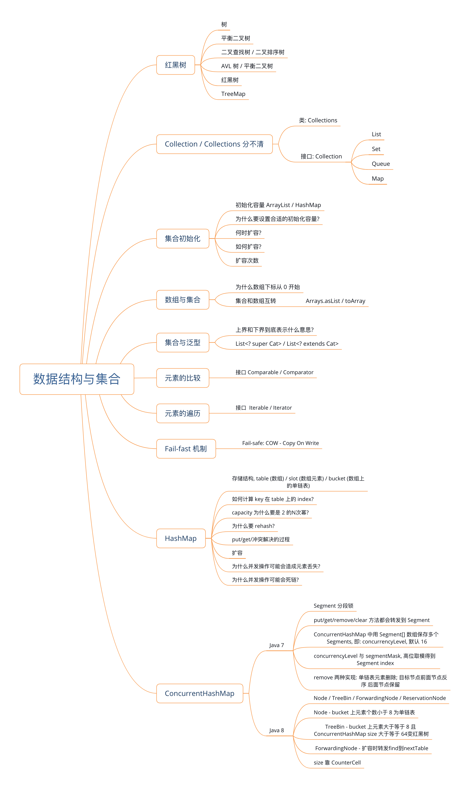
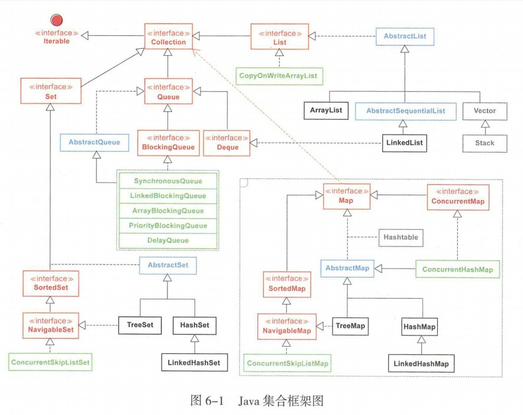

# 第六章 数据结构与集合

----



## 一、数据结构

程序 = 数据结构 + 算法，集合作为数据结构的载体，可以对元素进行加工和输出，以一定的算法实现最基本的增删改查，因此集合是所有编程语言的基础。

数据结构是指逻辑意义上的数据组织方式及其相应的处理方式；

- 逻辑意义：因为数据结构的抽象表达非常丰富，但是实际物理存储方式相对单一。例如二叉树在物理存储上一般就是顺序存储或者链式存储方式，而不是使用树形排列；
- 数据组织方式：逻辑组织方式很多，包括树、图、队列、哈希等，树又可以划分为二叉树、B+ 树等；
- 数据处理方式：在既定的数据组织方式上，以某种特定的算法实现数据的增删改查以及遍历。

### （一）数据结构分类

从直接前继和直接后继个数的维度进行区分：

- 线性结构：0 到 1 个直接前继和直接后继。除了首尾元素，每个元素都只有唯一的直接前继和直接后继，线性结构包括：顺序表、链表、栈（后进先出 Last-In，First-out，LIFO）、队列（先进先出 Fast-in,First-out,FIFO）等。
- 树结构：0 至 1 个直接前继和 0 至 n 个直接后继（n 大于或等于 2）。是一种有层次的非线性数据结构，结构比较稳定和均衡。
- 图结构：0 到 n 个直接前继和直接后继（n 大于或等于 2）。图结构包括简单图、多重图、有向图和无向图。
- 哈希结构：没有直接前继和直接后继，通过特定哈希函数将索引与存储的值关联起来。

因为目前存储设备越来越便宜，所以时间复杂度重要性（反映了程序执行时间随输入规模增长而增长的量级）大于空间复杂度；从好到坏为：参数级 O(1)/对数级O(logn)/线性级O(n)/线性对数级O(nlogn)/平方级O(n^2^)/立方级O(n^3^)/指数级O(2^n^)；

## 二、集合框架



在集合框架图中，红色代表接口，蓝色代表抽象类，绿色代表并发包中的类，灰色代表早期线程安全的类（基本已经弃用）。可以看到，与 Collection 相关的四条线分别是 List 、Queue 、Set、Map 它们的子类会映射到数据结构中的表，数，哈希等。

### List 集合

List 集合是线性数据结构的主要实现，集合元素通常存在明确的上一个和下一个元素，也存在明确的第一个元素和最后一个元素。**List 集合的遍历结果是稳定的**。该体系最常用的是 ArryList 和 LinkedList 两个集合类。

ArryList 是容量可以改变的非线程安全集合。内部实现使用数组进行存储，集合扩展时会创建更大的数组空间，把原有数据复制到新数组中。 ArrayList 支持对元素的快速随机访问，但是插入与删除时速度通常很慢，因为这个过程很有可能需要移动其他移动元素。

LinkedList 的本质是双向链表。与 ArrayList 相比， LinkedList 的插入和删除速度更快，**但是随机访问速度很慢**。LinkedList 还继承了 Deque 接口，该接口同时具有队列和栈的性质，且 LinkedList 中包含了 3 个重要的成员：size、first、last。size 是双向链表中节点的个数。first 和 last 分别指向第一个和最后一个节点的引用，其可以将零散的内部类单元通过附加引用的方式关联，内存利用率更高。

### Queue 集合

Queue（队列）是一种先进先出的数据结构，队列是一种特殊的线性表，它只允许在表的一端进行获取操作，在表的另一端进行插入操作。当队列中没有元素时，称为空队列。自从 BlockingQueue （阻塞队列）问世以来，队列的地位得到极大地提升，在各种高并发编程场景中，由于其本身 FIFO 的特点和阻塞操作的特点，经常被作为为 Buffer（数据缓冲区）使用。

### Map 集合

Map 集合是以 Key-Value 键值对作为存储元素实现的哈希结构，Key 按某种哈希函数计算后是唯一的，Value 则是可以重复的。Map 类提供三种 Collection 视图，在集合框架图中，Map 指向 Collection 的箭头仅表示两个类之间的依赖关系。可以使用 keySet（）查看所有的 key ，使用 values() 查看所有的 Value ，使用 entrySet() 查看所有的键值的键值对。最早使用存储键值对的 Hashtable 因为性能瓶颈已经被淘汰，而如今广泛使用的 HashMap ，线程是不安全的。 ConcurrentHashMap 是线程安全的，在 JDK 8 中进行了锁的大幅度优化，体现出不错的性能。在多线程并发场景中，优先推荐使用 ConcurrentHashMap ，而不是 HashMap 。 ThreeMap 是 Key 有序的 Map 类集合。

### Set 集合

Set 是不允许出现重复元素的集合类型。Set 体系最常用的是 Hashset 、 TreeSet 和 LinkedHashSet 三个集合类。 **HashSet** 从源码分析是使用 HashMap 来实现的，只是 Value 固定为一个静态对象，使用 Key 保证集合元素的唯一性，但它**不保证集合元素的顺序**。 TreeSet 也是如此，从源码分析是使用 TreeMap 来实现的，底层为树结构，在添加新元素到集合中时，按照某种比较规则将其插入合适的位置，保证插入后的集合仍然是有序的。**LinkedHashSet 继承自 HashSet ，具有 HashSet 的优点，内部使用链表维护了元素插入顺序。**

##  三、集合初始化

##### 1. 初始化容量

- ArrayList 的初始化容量默认是 10，即 `new ArrayList()` 不指定 size 的情况下默认容量为 10。每次扩容都会调用 Array.copyOf() 方法，创建新的数组然后复制，
- HashMap 的初始化容量默认是 16. 负载因子默认是 0.75 `new HashMap()` 不指定 size 的情况下默认容量是 16, 负载因子是 0.75. 当元素个数大于等于 16*0.75 = 12 的时候开始扩容

##### 2. 为什么要设置合适的初始化容量

- 扩容: 当集合中元素个数达到一定数量的时候, 集合内部的数据结构不足以容纳更多的数据, 此时必须通过扩容来增加容量来得到更多的存储空间
- 而整个扩容过程是比较耗时的.
- 如果能提前知道集合大致的容量,那么就可以避免扩容或者减少扩容次数

##### 3. 何时扩容

- ArrayList 扩容触发条件: 当元素个数大于当前数组的长度时进行扩容. 比如默认capacity 是 10, 当添加第 11 个元素时进行扩容.
- HashMap 扩容触发条件:  当元素个数大于阈值(threshold)时进行扩容. 

##### 4. 如何扩容

- ArrayList 扩容: 创建一个原数组1.5 倍长度的新数组, 将原数组中的元素复制到新的数组中.

  ```java
  newLength = oldLength + (oldLength >> 1);
  Arrays.copyOf(T[] original, int newLength);
  System.arrayCopy(orignalArray, srcPos, destArray, desPos, length);
  ```

- HashMap 扩容: (TODO) 待完善. 每次扩容都是原容量的 2 倍

  ```java
  
  ```

##### 5. 扩容次数

- ArrayList. 不指定size的情况下, 默认为 10, 往 ArrayList 里面加 1000 个元素扩容过程为:

  ```
  10
  15
  22
  33
  49
  73
  109
  163
  244
  366
  549
  823
  1234
  ```

- HashMap 不指定 size 的情况下, 默认为 16, 在添加第 13 个元素的时候开始扩容, 添加 1000 个元素扩容过程为:

  ```
  16
  32
  64
  128
  256
  512
  1024
  ```


## 数组与集合

- 数组下标从 0 开始的原因是：源于 BCPL 语言，其将指针设置在 0 的位置，用数组下标来作为直接偏移量进行计算，如果从 1 开始则计算偏移量就要使用当前下标减 1，加减法对 CPU 是一种双数运算，且数组下标使用频率较高因此每次计算则耗时较大。
- 数组用来存储同一类型的对象，一旦分配内存则无法扩容，定义数组时使用类型 + 中括号结合的方式，因为如 String[] 用来指代 String 数组对象。

#### 数组定义

```java
// 方式一：静态初始化，容量的大小登录大括号内元素的个数；
String[] arr1 = {"a","g"};

// 方式二：动态初始化，指定容量大小必须大于等于 0，否则运行时会抛出 NegativeArraySizeException
String[] arr2 = new String[3];
arr2[0] = "a";
arr2[1] = "b";
```

以上两种方式的数组都是固定容量大小的；

对应集合：对于动态大小的数组，集合提供 Vector 和 ArrayList 类，前者线程安全、性能较差，弃用，后者线程不安全，使用频率高。

#### 数组遍历

方式一：推荐使用 foreach 方式；

方式二：针对 fori 方式中的 length，其是数组对象的一个属性，不是方法（String 类是使用 length() 方法来获取字符串长度的）。

方式三：Lambda 表达式，如 `Arrays.asList(arg).stream().forEach(System.out::println);`

Arrays 是针对数组对象进行操作的工具类，包括数组的排序、查找、对比、拷贝、将数组转换为集合等。

#### 集合和数组互转

数组转集合时候需要注意时候使用视图方式直接返回数组中的数据，如使用 `Arrays.asList()` 将数组转换为集合时，或者直接使用 `Arrays.asList("a","b")`等，不能使用其修改集合相关的方法，`add/remove/clear` 方法会修改元素的个数，都会抛出 UnSupportedOperationException 异常。但是可以使用 set() 方法修改元素的值，原有数组对应位置的值同时也会被修改。

Arrays.asList 体现了适配器模式，**后台的数据仍然是原数组**，asList 的返回对象是一个 Arrays 的内部类，**它并没有实现集合个数的相关修改操作，因此会抛出异常**。

```java
public static <T> List<T> asList(T... a) {
    return new ArrayList<>(a);
}
```

Arrays 类中的 `Arrays.asList()` 返回源码如上，其返回的对象是 Arrays 的内部类 ArrayList（非常用的 ArrayList），其源码如下：

```java
// 部分实现省略
private static class ArrayList<E> extends AbstractList<E>
    implements RandomAccess, java.io.Serializable
{
    private static final long serialVersionUID = -2764017481108945198L;
    // final 修饰不准修改其引用，使得用于存储集合的数组引用始终被强制指向原有数组
    private final E[] a;

    // 直接把数组应用赋值给 a
    ArrayList(E[] array) {
        a = Objects.requireNonNull(array);
    }

    @Override
    public int size() {
        return a.length;
    }

    @Override
    public Object[] toArray() {
        return a.clone();
    }

    @Override
    @SuppressWarnings("unchecked")
    public <T> T[] toArray(T[] a) {
      // 省略实现
    }

    @Override
    public E get(int index) {
        return a[index];
    }

    // 实现了修改特定位置元素的 set 方法
    @Override
    public E set(int index, E element) {
        E oldValue = a[index];
        a[index] = element;
        // set 返回的是旧值
        return oldValue;
    }

    @Override
    public int indexOf(Object o) {
       // 省略实现
    }

    @Override
    public boolean contains(Object o) {
        return indexOf(o) != -1;
    }

    @Override
    public Spliterator<E> spliterator() {
        return Spliterators.spliterator(a, Spliterator.ORDERED);
    }

    @Override
    public void forEach(Consumer<? super E> action) {
        Objects.requireNonNull(action);
        for (E e : a) {
            action.accept(e);
        }
    }

    @Override
    public void replaceAll(UnaryOperator<E> operator) {
        // 省略实现
    }

    @Override
    public void sort(Comparator<? super E> c) {
        Arrays.sort(a, c);
    }
}
```

因为内部类没有修改元素集合个数的地方，所以异常是有内部 ArrayList 类的父类 AbstractList 抛出：

```java
// 下面为部分源码
public abstract class AbstractList<E> extends AbstractCollection<E> implements List<E> {

    protected AbstractList() {
    }

    // 子类重写实现了，所以不抛异常了
    public E set(int index, E element) {
        throw new UnsupportedOperationException();
    }

    // 子类没有重写，抛异常了
    public void add(int index, E element) {
        throw new UnsupportedOperationException();
    }

    public E remove(int index) {
        throw new UnsupportedOperationException();
    }

    public void clear() {
        removeRange(0, size());
    }

    protected void removeRange(int fromIndex, int toIndex) {
        ListIterator<E> it = listIterator(fromIndex);
        for (int i=0, n=toIndex-fromIndex; i<n; i++) {
            it.next();
            it.remove();
        }
    }
}
```

**推荐使用**：数组转集合时候，使用 `java.util.ArrayList` 直接创建一个新的集合，参数就是 Arrays.asList 返回的不可变集合。`List<Object> newList = new ArrayList<>(Arrays.asList("a","b"));`

集合转数组更多是适配别人接口或者进行局部方法计算，示例代码如下：

```java
public static void main(String[] args) {
    List<String> list = new ArrayList<>();
    list.add("one");
    list.add("two");
    list.add("three");

    // 方式一：造成泛型丢失，无法使用 String[] 接收无参方法返回的结果
    Object[] arr = list.toArray();
    // 输出 [one, two, three]
    System.out.println(Arrays.asList(arr));

    // 方式二：数组长度小于列表元素个数
    String[] temp = new String[2];
    String[] arr2 = list.toArray(temp);

    // 输出 [null, null]
    System.out.println(Arrays.asList(temp));
    // 输出 [one, two, three]
    System.out.println(Arrays.asList(arr2));
    // 方式三：两者长度相等
    String[] arr3 = list.toArray(new String[3]);
    // 输出 [one, two, three]
    System.out.println(Arrays.asList(arr3));
}
```

ArrayList 中对于 toArray() 方法的实现为：

```java
public Object[] toArray() {
    return Arrays.copyOf(elementData, size);
}

// 如果入参数组长度空间不够，则入参数组会被无视，会直接分配一个新的空间，复制完成之后返回一个新的数组引用。
// 如果空间足够（大于或等于集合大小），则将集合中元素复制到数组即可
@SuppressWarnings("unchecked")
public <T> T[] toArray(T[] a) {
    if (a.length < size){
        // Make a new array of a's runtime type, but my contents:
        return (T[]) Arrays.copyOf(elementData, size, a.getClass());
    }
    System.arraycopy(elementData, 0, a, 0, size);
    if (a.length > size)
        a[size] = null;
    // 只有在数组容量足够的情况下才返回传入参数
    return a;
}
```

`if (a.length < size)` 时候对应的 copyOf 源码为：

```java
// 会新创建一个数组用于 copy
public static <T,U> T[] copyOf(U[] original, int newLength, Class<? extends T[]> newType) {
    @SuppressWarnings("unchecked")
    T[] copy = ((Object)newType == (Object)Object[].class)
        ? (T[]) new Object[newLength]
        : (T[]) Array.newInstance(newType.getComponentType(), newLength);
    System.arraycopy(original, 0, copy, 0,
                     Math.min(original.length, newLength));
    return copy;
}
```

其中 elementData 是ArrayList 集合对象中真正存储数据的数组：`transient Object[] elementData;`。同时其使用 transient 表示该字段在类的序列化时候会被忽略。因为集合序列化时系统会调用 writeObject 写入流中，在网络客户端反序列化的 readObject 时，会重新赋值到新对象的 elementData 中，这样操作主要因为 elementData 容量经常会大于实际存储元素的数量，所以只需要发送真正有实际值的数组元素即可。

**推荐使用**：使用集合的 `toArray(T[] array)` 方法转换为数组是否，需要传入类型完全一致的数组，且容量大小为 list.size();


#### 集合与泛型

List ：完全没有类型限制和赋值限定。

`List<Object>` ：看似用法与List一样，但是在**接受其他泛型赋值时**会出现编译错误，转为其他类型也会报错；

```java
List<Object> objectList = new ArrayList<>();
List<Integer> integerList = new ArrayList<>();

// 以下两种都会编译出错，数组可以这样赋值，因为数组是协变的，但是集合不是
List<Object> list1 = integerList;
List<Integer> list2 = objectList;
```

`List<?>` 为通配符集合，可以接受任何类型的集合引用赋值，但是不能添加任何元素，可以 remove 和 clear，其并非 immutable （不可变）集合，`List<?> ` 一般作为参数来接收外部的集合，或者返回一个不知道具体元素类型的集合。

`List<T>` 只能放置一种类型，如果随意转换类型就失去了类型安全的意义。

`List<? extends T>` 是 Get First，适用于消费集合元素为主的场景，`List<? super T>` 是 Put First，适用于生产集合元素为主的场景。

- **<? extends T>** ：可以赋值给任意 T 及 T 的子类集合，上界为 T，**取出来的类型带有泛型限制**，向上强制转型为 T。**null 可以表示任何类型，所以 null 除外**，任何元素都不得添加进 `<? extends T>` 集合内。
- **<? super T>** : 可以赋值给任何 T 及 T 的父类集合，下界为 T。生活中，投票选举类似于 `<? super T>` 的操作，选举投票时，你只能往里投票，取数据时，根本不知道时是谁的票，**相当于泛型丢失**。

**<? extends T>的场景是put功能受限，而<? super T>的场景是get功能受限**。

List<? extends Cat>

1. 用在引用. List<? extends Cat> catsList = getCatsList(); 此时这个对象是只读的. 只能遍历不能 add
2. 赋值: 只能赋值给 `List<Cat>` 或 `List<KittyCat>` 不能赋值给`List<Animal>`. 因为 Animal 不 extends Cat
3. 用在方法. private void doSomething(List<? extends Cat> catsList). 只可以接收 `List<Cat>` 或者 `List<Cat 的子类> ` 不能接收 `List<Animal>` 因为传入的 Animal extends Cat 不成立.(类似 2)
4. 用在方法. `public static <T extends Comparable<? extends T>> doSomething(List<T> t) `. 这个要求传入的 list 中的每个元素都要 extends Comparable (接口和类都是用 extends 关键字). 并且 T类中为 Comparable 提供的泛型参数应该 extends T (即: T的子类, T为上界)

List<? super Cat>

1. 用在引用. List<? super Cat> catsList = new ArrayList<>(); 此时这个对象可读可写. 写入的时候(add 方法)传入的类型应该是 Cat 的子类. 遍历的时候泛型丢失. 只能以 Object 进行遍历
2. 赋值: 只能赋值给 `List<Animal>/ List<Cat>` 不能赋值给 `List<KittyCat>` 因为 KittyCat 不 super Cat
3. 用在方法: public void doSomething(List<? super Cat>) 可以接收`List<Animal> / List<Cat>` 不能接收 `List<KittyCat>`
4. 用在方法. `public static <T extends Comparable<? super T>> sort(List<T> tList)`. List 中的元素都要implements Comparable 接口, 同时T类为 Comparable 提供的泛型类型应该是 super T (即为 T 的父类, T为下界).

#### Comparable / Comparator

----

- Comparable - 自己定义的类 implements 这个接口, 并实现其中的 compareTo(Object o) 方法. 返回 int. 1 / 0 / -1.
- Comparator - 当需要对第三方提供的类进行排序时用这个接口. 
  - 自定义一个类 implements Comparator<第三方 class>. 实现其 `compareTo(Object o1, Object o2)`方法.
  - 返回 1 / 0 / -1

- 对 List 进行升序排序, list 中的元素需要 implements Comparable 接口: 

```java
Collections.sort(List)
  
// 降序排列. Collections.reverseOrder 返回的是一个 comparator  
Collections.sort(list, Collections.reverseOrder())
```


#### Iterable / Iterator

----

(TODO) Head First 设计模式, 迭代器模式


#### Fail-fast

----

- Fail-fast 是什么? fail-fast 意思是某个过程可能会失败, 而且在这个过程中一直去检查,一旦发现异常立即停止. 
- 为什么需要 Fail-fast? fail-fast 机制避免了某些可能发生的灾害性的错误.
- fail-safe: 弱一致性. Weakly-consistent. 
- 支持Fail-fast的集合: ArrayList / HashSet.
- fail-safe 的集合: CopyOnWriteArrayList / CopyOnWriteArraySet
- Fail-safe 的原理: 支持多个线程遍历同一个集合 (多线程读). 当有线程需要修改集合的时候, 会将集合中全部内容 copy 到另外一个新的集合当中, 在新集合当中进行修改, 修改完毕之后将原来的集合指向新集合. 原来的集合同时可以被读取,但在新集合被赋值给原集合之前读线程访问不到最新的修改. (弱一致性).
- [StackOverflow - What are fail-safe & fail-fast Iterators in Java](https://stackoverflow.com/a/17377698/853191)
- [StackOverflow - Why we need fail fast and fail safe software design?](https://stackoverflow.com/a/45714229/853191)

#### HashMap

----

- 数据结构

  table - Entry[] 数组

  slot - Entry 元素

  bucket -  Entry 有一个 next 属性, 指向下一个 Entry, 这样就形成了一个单链表

- 如何确定一个key 在 table 上的 index?

  用 key 的 hashCode (re-hash) 对数组的长度取余数(mod %). 得到的就是 index 

- [为什么 capacity 需要是 2 的倍数?](https://stackoverflow.com/a/53526992/853191) - 为了更快的计算出 key 对应在 table 上的 index. `(size - 1) & hashCode`. 当 size 是 16 时, 16-1=15 对应的二进制是 1111. 这个数字跟 hashCode 进行位与运算之后就得到 hashCode % 16的值, 用二进制进行计算更高效.

- [为什么要用右移 16 位的方式 rehash? ](https://stackoverflow.com/a/45140621/853191) - 为了减少冲突. 如果两个 key 的 hashCode 的后面几位(转化为二进制)相同,则他们跟(size-1) 进行与运算得到的结果就会相同, 这样就产生了冲突. 用 `hashCode ^ (hasCode >>> 16)` 可以让 int 的高 16 位和低 16 位进行异或运算这样就把得到的 hash 进行打散. 使得 key 分步的更加均匀.

  那为什么用异或 ^ 而不用 & 或 | 运算符呢? 使用XOR的原因 - 因为它具有1/0的50/50％分布（而不是 | 或者 & , 具有75/25或25/75）。 — 并不是十分理解. 大致能知道 XOR 相同为 1, 不同为 0. 所以相同和不同的概率是一样的; 而 | 是 (1/0, 0/1, 1/1) 三种情况都能得到 1, (0/0) 一种情况得到 0, 所以他是 75/25 的分布; 同理 & 是 25/75的分布.

- 哈希冲突/碰撞处理

  - 什么是哈希冲突? 哈希冲突也叫做哈希碰撞. 指的就是两个不同的对象的 hashCode 相同, 或者他们的 hashCode 不同, 但他们对 table size 的取模%结果一样, 而导致他们落入了同一个哈希槽: 即 slot 的 index 相同; 这样就称为发生了碰撞
  - 如何解决? HashMap 中解决方法就是用链表的方式. 也就是哈希桶 bucket. 每个 slot 都是一个 Entry. 这个 Entry 中包含了 K / V. 以及 Entry 的 next (和 hash). 其中 next 就是为了解决哈希冲突而设立的, next 的存在使得 Entry 变成了一个可以指向下一节点的单链表结构.

- put 方法执行过程

  1. 先用 key 的 hashCode 得到 table index. 如果 key 为 null, hashCode 为 0, table index 也为 0.
  2. 如果 table[i] 上没有元素,则直接把指定的 key / value 作为一个 Entry 插入到 table[i] 的slot 中
  3. 如果 table[i] 上已经有了元素, 则去遍历以 entry 为头单链表. 每遍历一个entry, 查看当前插入的这个 key的 hashCode 跟 正在遍历 Entry 的 key 的 hashCode 是否相等, 如果相等, 再去查看插入的 key 跟 entry 的 key 是否为同一个对象(key == entry.key)或equals (key.equals(entry.key)). 如果成立, 则替换; 如果不相等, 则用当前的 K/V组成的 entry, 放到table[i]的位置, 同时将 entry 的 next 指向原来的 table[i]. 即: 头插法.

- get 方法执行过程

  1. 跟 put 类似. 先用key 的 hashCode 计算出来table index
  2. 然后看 table[i]上是否有元素, 如果没有则返回 null
  3. 如果有元素则需要遍历这个单链表, 从这个链表上找到跟当前 key 的 hashCode 相等并且 key 也相等或者 key 相互 equals 的那个 entry, 返回这个 entry 的 value; 如果找不到则返回 null

- 扩容

  - 何时扩容? HashMap 中有两个参数决定了扩容的条件. 一个是 capacity, 默认 16, 另一个是 load factor, 默认 0.75. 当 HashMap 的 size 大于 capacity * load factor (默认 13)之后就会扩容.  
  - 如何扩容? 扩容过程分为两步.
    1. 创建一个两倍于原 entry[] 长度的新数组
    2. 把原来的 Entry 复制到新的 Entry 数组中
    3. 完成之后把 entry 数组的指针指向新数组, 并重新计算出阈值 = 新数组的长度 * load factor
  - 扩容时把原数组元素复制到新数组的具体过程.
    1. 双重循环遍历原 entry 数组, 外层循环是针对 entry 数组; 内存循环是针对 bucket 单链表
    2. 循环内部, 根据每个 entry 的 key 的 hash, 针对新的capacity 重新计算出来这个 key 在新的 table 上的 index. 然后把当前 entry.next 指向当前 index: entry.next = table[i]. 最后把 entry 设置为index 的首位元素: table[i] = entry.

- 为什么并发操作 HashMap 时元素可能会丢失

  1. 头插法插入新的 Entry 时可能发生元素丢失.

     ```java
     void createEntry(int hash, K key, V value, int bucketIndex) {
       // 假设多线程同时插入元素, 线程 1 插入 K1/V1. 线程 2 插入 K2/V2
       // 此时他们同时运行到这行代码, T1 和 T2 都拿到了table[bucketIndex]的 entry: e
       Entry<K, V> e = table[bucketIndex];
       // 假设此时 T1 先得到了 CPU 运行权, T1 会 new 一个 Entry1: K1/V1, next 指向 e.
       // 然后将table[bucketIndex] 指向 Entry1.
       // 然后 T2 开始执行, T2也会new 一个 Entry2. K2/V2, next 也是指向 e
       // 然后将 table[bucketIndex] 指向 Entry2.
       // -- 问题发生了 --
       // table[bucketIndex]目前指向了 Entry2
       // T1插入的 Entry1 被 Entry2 覆盖了. 造成了元素丢失
       table[bucketIndex] = new Entry<>(hash, key, value, e);
       size++;
     }
     ```

     

     扩容和数据迁移代码:

     ```java
     void resize(int newCapacity) {
       Entry[] newTable = new Entry[newCapacity];
       transfer(newTable, initHashSeedAsNeeded(newCapacity));
       table = newTable;
       threhold = (int) Math.min(newCapacity * loadFactor, MAXIMUM_CAPACITY + 1);
     }
     
     void transfer(Entry[] newTable, boolean rehash) {
       int newCapacity = newTable.length;
       for (Entry<K, V> e : table) { // table 为entry[] 即: old table
         while (null != e) {
           Entry<K, V> next = e.next;
           if (rehash) {
             ...
           }
           int i = indexFor(e.hash, newCapacity);
           e.next = newTable[i];
           newTable[i] = e;
           e = next;
         }
       }
     }
     ```

     2. 扩容过程中已经遍历过的区间插入了新的元素造成对象丢失

        假设 T1 和 T2 同时操作 hashmap

        假设目前size=12, T1 / T2 都要插入一个新的 entry, 发现需要 resize, 假设他们现在都执行到了resize 方法并初始化好 newTable, 即将进入 transfer 方法

        假设T1 先被执行, T1 执行完毕 transfer 之后, T2 开始执行.

        假设T2 遍历到 bucketIndex = 8, 执行权交给了 T1. 则 T1 此时可以进行 createEntry 方法来把 entry 加入到 newTable 中. 

        假设 K1 的 hashCode 对应的 bucketIndex = 6. 则 newTable[6]对应的 bucket 当中是包含了 T1 刚刚插入的 entry 的

        但是 T2 线程并不知道 bucketIndex = 6 的地方发生了改变或者说, 他没有关心已经遍历过的 bucket 是否有改动, 那么 T2 继续执行遍历. 完毕之后把 table 指向了 T2 创建的 newTable

        则 T1 插入的 entry 就被 T2 覆盖掉了.

     3. "新表"被覆盖

        这个情景跟 2 类似.

        T1 和 T2 同时 transfer

        T1 先transfer 完毕, 并插入了元素

        T2 遍历到一半

        当 T3 插入元素时 size 已经扩容过了, 则会直接插入到 entry[] 中

        T2 transfer 完毕之后把 table 指向了他所在线程中的newTable 

        这样T1的新表就被 T2 的新表覆盖了. 因此 T3 在基于 T1 的 newTable 插入的 entry 就会丢失.

     4. 多个线程并发迁移, entry.next 可能提前被置为 null

        T1 和 T2 同时进行 transfer

        ```html
        - Bucket0: Entry1 > Entry2
        - Bucket1: Entry3
        ```

        

        T1 将 entry1 的 next 指向了 newTable[newIndex], 假设 newIndex 是 5:

        ```html
        - Bucket0
        ...
        - Bucket5: Entry1 > null
        ```

        

        则 T1 将 Entry1 的 next 改成了 null

        T2 在遍历 Bucket0 时, 发现 Entry1 的 next 是 null 就会直接去遍历 Entry3. Entry2 被 T2 忽略了.

        如果 T2 最后执行 table = newTable 则造成数据丢失.

        

- 为什么并发操作 HashMap 时可能会发生死链问题

transfer方法执行循环遍历过程当中的一次循环情景可能如下:

```java
while (null != e) {
  Entry<K, V> next = e.next; // 1
  e.next = newTable[5883]; // 2
  newTable[5883] = e; // 3
  e = next; // 4
}
```

- 对同一个 entry, T1 执行到 3. T2 执行到 2.

则 entry.next = newTable[5883] = entry. 此情景为自己链接到自己.

- 另一个场景:

  ```html
  假设 old table 中
  table[x] = A -> B -> ^
  
  也就是 A是在 x 号 slot. A.next 指向 B.
  ```

  T1 执行 x bucket 的 transfer:

  Round 1:

  // 1 — Entry next = A.next;

  // 2 — A.next = newTable[5883] = null

  // 3 — newTable[5883] = A

  // 4 — e = B

  Round 2:

  // 1 — Entry next = B.next = null

  // 2 — B.next = newTable[5883] = A

  // 3 — newTable[5883] = B

  // 4 — e = null

  然后T2 也执行到 x bucket 的 transfer:

  Round 1:

  // 1 — Entry next = A.next;

  // 2 — A.next = newTable[5883] = B

  // 3 — newTable[5883] = A

  // 4 — e = B — !重要!

  Round 2: 

  // 1 — Entry next = B.next = A

  // 2 — B.next = A

  ….

  // ————>>以上是可能发生 A/B 两个 entry 之间互链的分析. 但还是想不太清楚! 最终多线程环境下执行出死链的情形就是 A.next = B / B.next = A <<


#### ConcurrentHashMap

----

- JDK 7 [IBM - Developerworks 探索 ConcurrentHashMap 高并发性的实现机制](https://www.ibm.com/developerworks/cn/java/java-lo-concurrenthashmap/index.html)

  ConcurrentHashMap = Segment (类似于 HashMap) + Entry[] (数组 table) + HashEntry (Node, K / V / Next)

  ConcurrentHahsMap 使用的是 Segment, 将 HashMap 分成了16 个(默认)数据段. Segment 的数量也就是 HashMap 当中的 concurrency level.

  Segment extends ReentrantLock. 每个 Segment自己有一个锁, 对某个 Segment 加锁不影响其他线程访问其他 Segment.

  Segment 内部维护了一个 Entry[] table. 此处 Segment 类似于一个 HashMap. 也有 capacity 和 load factor 的概念. 以及在 Segment 的 count 超过 capacity*load factor 时进行扩容.

  Segment 内部维护了一个 count, 表示该 Segment 中 HashEntry 的个数. 这样当需要更新 ConcurrentHashMap 的数量时 不需要锁定整个 ConcurrentHashMap. 统计ConcurrentHashMap 的 size 的时候只需要统计每个 Segment 当中的 count 即可.

  `segmentFor`方法: 根据传入的 Key 得到这个 key 应该放到哪个 Segment 当中. 其工作原理是: 与`根据 key 的 hashcode 计算key 应该落入哪个 bucket `类似. 根据 key 计算 bucket 的 index 的过程是: 首先保证 HashMap 的 size 是2 的倍数, 这样size - 1 得到的二进制各位上全部都是 1. 在进行与操作时, 用 hashCode 的二进制跟 size-1得到的二进制进行与操作 得到的就是小于等于 size - 1的值, 此值就是 bucket index. 类似的, segmentFor 用的是高位. 先根据传入的concurrecy level, 计算出 Segment 数组的长度. 此长度为不小于传入 concurrency level 的 2 的次幂. 比如传入的是 31, 则 Segment 数组的长度是 32, 即 2 的 5 次幂. Concurrency level - 1 也可以得到一个全部是 1 的二进制 (Segment mask). 然后用 hashCode 右移(32-N次幂)得到一个结果, 此结果将原来 hashCode 的高 N位转化成了低 N位,高位补 0. 此值与segment mask 进行与操作得到的结果就是此 key 应该放到哪个 Segment 的 index.

  - Get/put/remove/clear

    get - 先用 key 得到segment, 然后再在 Segment 内部去查找这个 key.  不会加锁.

    clear - 遍历 ConcurrentHashMap中的所有Segment. 把 ConcurrentHashMap 中所有的bucket 置空. 不影响读操作 - get 方法.

    put - 先用 key 得到segment. 再调用 Segment 的 put 方法. 在 put 方法中, 会先取得锁, 然后找到要插入的 key 的 bucket index. 然后看这个 bucket 中的第一个位置是否已经被占用, 如果没有被占用则直接 table[index] = new HashEntry(..) 即可; 如果, 已经被占用了, 则需要按照 HashEntry 的单链表遍历去查找链表中是否存在与要插入的 key 相同的 Entry, 找到了就替换 value; 如果找不到则创建一个新的 HashEntry, new HashEntry 的 next 指向 table[index].

    remove -  先用key 得到 Segment. 再调用 Segment 的 remove 方法. 在 remove 方法中会先得到 lock. 根据 key 的 hashCode 得到 bucket index. 在 table[i] 单链表中, 找到指定的 key, 并删除相对应的 HashEntry. 删除的过程有在 JDK 7 代码两种实现, 一种是传统的单链表删除节点; 另一种是, 目标节点之前的 nodes 反转之后设定到 table[i]中, 目标节点之后的 nodes 则保持顺序不变.

    

    size 方法:

    1. 遍历所有的 Segment, 并得到 Segment 的 count
    2. 如果 Segment 结构发生了变化, 则再次遍历; 直到遍历超过了 3 次就会对所有的 Segment 进行加锁, 然后再计算所有 Segment 中的 count 之和
    3. 如果 Segment 结构在遍历过程之中没有发生过变化, 则直接统计 Segment 的 count 之和.

    

- JDK 8

  - 取消了 Segment 分段锁
  - 引入了 4 种不同的 Node 类型: Node / TreeBin / ForwardingNode / ReservationNode
  - Node - 冲突时用链表保存hash冲突的元素
  - TreeBin + TreeNode - 冲突时, 默认使用单链表保存元素, 当单链表中元素个数超过 8 且 table 的容量大于等于 64 时, 则用红黑树来存储, table 的容量小于 64 时则只会扩容但并不会把单链表转为红黑树; 当节点进行 remove 默认当数量降到 6 的时候, 退化为单链表
  - ForwardingNode - 当 table 扩容时, forwardingNode 记录了扩容后的 table: nextTable. 原 table 的槽内放置的是一个 ForwardingNode. 如果此时访问原 table的这个槽, find 操作则会把请求转发到 nextTable. put 操作的线程会协助进行迁移.
  - ReservationNode在 computeIfAbsent 及其相关方法中作为一个预留节点使用.
  - size 方法. CAS and CounterCell


###### TBC

------

1. [红黑树与 TreeMap](<https://github.com/chinalwb/EasyCoding/issues/23>)
2. [HashMap 死链对象之间互链的情形分析](https://github.com/chinalwb/EasyCoding/issues/24)
3. [ConcurrentHashMap 中的 ReentrantLock](https://github.com/chinalwb/EasyCoding/issues/25)
4. [ConcurrentHashMap 中的 Volatile](https://github.com/chinalwb/EasyCoding/issues/26)
5. [ConcurrentHashMap 中的 CAS](https://github.com/chinalwb/EasyCoding/issues/27)
6. [ConcurrentHashMap size 方法中的 CAS 和 CounterCell](https://github.com/chinalwb/EasyCoding/issues/28)