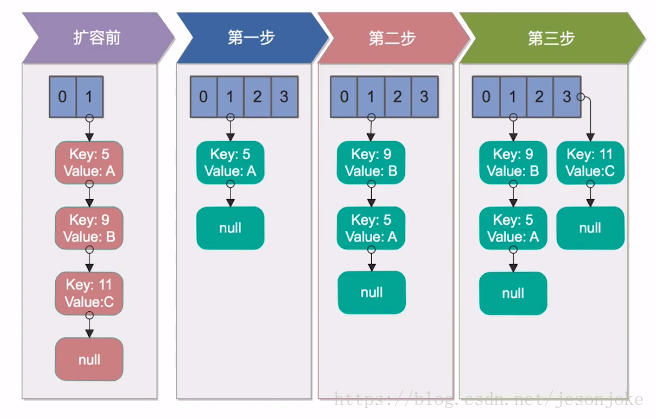
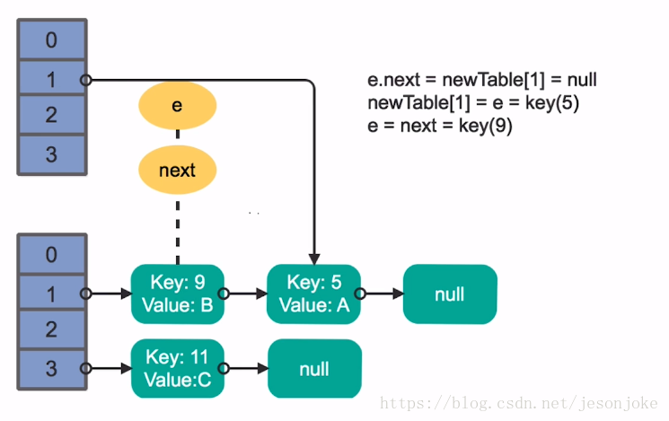
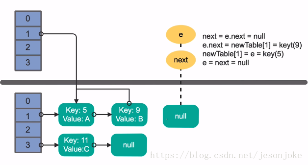

<!-- GFM-TOC -->
* [多线程并发拓展](#多线程并发拓展)
    * [死锁](#死锁)
    * [多线程并发的最佳实践](#多线程并发的最佳实践)
    * [Spring与线程安全](#Spring与线程安全)
    * [HashMap与ConcurrentHashMap](#HashMap与ConcurrentHashMap)
  
<!-- GFM-TOC -->
# 多线程并发拓展
## 死锁
### 什么是死锁？
通俗的说，死锁就是两个或者多个线程，相互占用对方需要的资源，而都不进行释放，导致彼此之间都相互等待对方释放资源，产生了无限制等待的现象，如同下图中相互阻塞的汽车一样。
死锁一旦发生，**如果没有外力介入，这种等待将永远存在**，从而对程序产生严重影响。


### 发生的必要条件
- 互斥条件：进程对锁分配的资源进行排他性使用，每次请求只有一个进程能够使用该资源。
- 请求和保持条件：线程已经保持了一个资源，但是又提出了其他请求，而该资源已被其他线程占用。
- 不剥夺条件：在使用时不能被剥夺，只能自己用完释放。
- 环路等待条件：资源调用是一个环形的链。
### 死锁的实例
```java
@Slf4j
public class DeadLockExample implements Runnable {
    public int flag = 1;
    //静态对象是类的所有对象共享的
    private static Object o1 = new Object(), o2 = new Object();

    @Override
    public void run() {
        log.info("flag:{}", flag);
        if (flag == 1) {
            synchronized (o1) {
                try {
                    Thread.sleep(500);
                } catch (Exception e) {
                    e.printStackTrace();
                }
                synchronized (o2) {
                    log.info("1");
                }
            }
        }
        if (flag == 0) {
            synchronized (o2) {
                try {
                    Thread.sleep(500);
                } catch (Exception e) {
                    e.printStackTrace();
                }
                synchronized (o1) {
                    log.info("0");
                }
            }
        }
    }

    public static void main(String[] args) {
        DeadLockExample td1 = new DeadLockExample();
        DeadLockExample td2 = new DeadLockExample();
        td1.flag = 1;
        td2.flag = 0;
        //td1,td2都处于可执行状态，但JVM线程调度先执行哪个线程是不确定的。
        //td2的run()可能在td1的run()之前运行
        new Thread(td1).start();
        new Thread(td2).start();
    }
}
```
### 避免死锁
* 注意加锁顺序（这个很好理解，就像上边的例子）
* 加锁时限（超过时限放弃加锁） 
* 实现方式–使用重入锁。
* 死锁检测:一种比较好的死锁预防机制，主要针对那些不可能按序加锁并且锁超时也不可行的场景。每当一个线程获得了一个锁，会在线程和锁的
数据结构中记录下来，除此之外，每当有线程请求锁的时候就记录在这个数据结构中，当一个线程请求锁失败的时候
，这个线程可以遍历锁的关系图看是否有死锁发生并决定后序操作要怎么办，这个结构需要根据实际情况来设计。当检测出死锁以后，一个可行的做法是释放所有锁回退，并且
在等待一段时间（随机）后重试，只有死锁发生才会回退；更好的方案是给这些线程设置优先级，让一个或几个线程回退，其他的线程就像没有发生过死锁一样继续保持它们的锁；如果
赋予这些线程的锁的优先级是固定不变的，那么同一批线程总会有更高的优先级，为了避免这一现象，可以在死锁发生的时候设置随机的优先级。

## 多线程并发的最佳实践
- 使用本地变量：
尽量使用本地变量而不是创建一个类或者实例的变量。
- 使用不可变量：
尽量降低代码中需要同步的变量数量
- 最小化锁的作用域范围：
S=1/(1-a+a/n),a:并行计算部分所占的比例；n:并行计算的结点个数；S:加速比
- 使用线程池的Executor,而不是直接new Thread执行
- 宁可使用同步也不要使用线程的wait和notify
- 使用BlockingQueue实现生产-消费模式
：可以处理多个生产和多个消费问题
- 使用并发集合而不是加了锁的同步集合
- 使用Semaphore创建有界的访问：
为了建立可靠稳定的系统，对于数据库、文件系统和socket等资源
必须要做有界的访问，Semaphore是一个可以限制这些资源开销的工具，可以通过它来控制同时访问资源的请求数量。
- 宁可使用同步代码块，也不使用同步的方法
- 避免使用静态变量
## Spring与线程安全
Spring能够保证线程安全性，主要是因为其无状态对象的设置。
- Spring bean:单例对象（只有在第一次被注入的时候才会被创建，其生命周期和IOC容器一致）、多例对象（每次注入的时候都会创建一个新的对象）
- 无状态对象：无状态的对象必然是线程安全的。
>无状态对象：自身没有状态的对象，不会因为多个线程的相互调度而影响其状态而导致线程安全问题，包括Dao，Service和Controller等对象
## HashMap与ConcurrentHashMap
### HashMap
HashMap的实现方式是：数组+链表 的形式。 

#### 初始化方法
其中下面两个因素主要影响其效率
- 容量：hash表中桶的容量，其在创建时候的容量
- 加载因子：表示hash表最大容纳比例，当其超过加载因子的时候，会进行扩容操作
 
源码分析：
```java
/**
     * The default initial capacity - MUST be a power of two.
     */
    static final int DEFAULT_INITIAL_CAPACITY = 1 << 4; // aka 16
    
     /**
         * The load factor used when none specified in constructor.
         */
        static final float DEFAULT_LOAD_FACTOR = 0.75f;

```

#### 寻址方式
对于一个新插入的数据或者要读取的数据，
HashMap将key按一定规则计算出hash值，并对数组长度进行**取模mod**结果作为在数组中查找的下标。
由于在计算机中取模的代价远远高于位操作的代价，因此HashMap要求数组的长度必须为2的N次方。此时它将key的hash值对2的n-1次方进行与运算，等同于取模运算。
HashMap并不要求用户一定要设置一个2的N次方的初始化大小，它本身内部会通过运算（tableSizeFor方法）确定一个合理的符合2的N次方的大小去设置。
```java
/**
     * Returns a power of two size for the given target capacity.
     */
    static final int tableSizeFor(int cap) {
        int n = cap - 1;
        n |= n >>> 1;
        n |= n >>> 2;
        n |= n >>> 4;
        n |= n >>> 8;
        n |= n >>> 16;
        return (n < 0) ? 1 : (n >= MAXIMUM_CAPACITY) ? MAXIMUM_CAPACITY : n + 1;
    }
```
#### 线程不安全的原因
1. 死循环
原因在于HashMap在多线程情况下，**执行resize()进行扩容**时容易造成死循环。 
扩容思路为它要创建一个大小为原来**两倍**的数组，保证新的容量仍为2的N次方，
从而保证上述寻址方式仍然能够适用。扩容后将原数组重新插入到新数组中，这个过程称为reHash。
* 单线程下的reHash的过程
单线程情况下完全没有问题


扩容前：HashMap初始容量为2，加载因子为1，需要向其中存入3个key，分别为5、9、11，放入第三个元素11的时候就涉及到了扩容。

   1. 第一步：先创建一个两倍大小的数组，接下来将原数组中的元素reHash到新数组中，5插入新的数组，没有问题。
   2. 第二步：将9插入到新的数组中，经过Hash计算，插入到5的后面。
   3. 第三步：将11经过Hash插入到index为3的数组节点中。
   
* 多线程下的reHash的过程


我们假设有两个线程同时执行了put操作，并同时触发了reHash的操作，图示的上层的线程1，下层是线程2。

1. 线程1某一时刻执行完扩容，准备将key为5的元素的next指针指向9，由于线程调度分配的时间片被用完而停在了这一步操作
2. 线程2在这一刻执行reHash操作并执行完数据迁移的整个操作。

接下来线程1被唤醒继续操作:


执行上一轮的剩余部分，在处理key为5的元素时，将此key放在我们线程1申请的数组的索引1位置的链表的首部。理想状态是（线程1数组索引1）—> (Key=5) —> null


接着处理Key为9的元素，将key为9的元素插入在（索引1）与（key=5）之间，

理想状态：
（线程1数组索引1）—> （Key=9）—> （Key=5）—>null 



但是在处理完key为9的元素之后按理说应该结束了，但是由于线程2已经处理过了key=9与key=5的元素，
即真实情况为（线程2数组索引1 —>（key=9）—> （key=5）—> null）|（线程1数组索引1 —> (key=9)—> （key=5）—> null），

这时让线程1误以为key=9后面的key=5是从原数组还没有进行数组迁移的，
接着又处理key=5。尝试将key=5放在k=9的前边，所以key=9与key=5之间就出现了一个循环。不断的被处理，交换顺序。

key = 11的元素是无法插入到新数组中的。一旦我们去从新的数组中获取值得时候，就会出现死循环。

2. fail-fast
如果在使用迭代器的过程中有其他线程修改了map，那么将抛出ConcurrentModificationException，这就是所谓fail-fast。 
在每一次对HashMap进行修改的时候，都会变动类中的modCount域，即modCount变量的值。
```java
abstract class HashIterator {
        ...
        int expectedModCount;  // for fast-fail
        int index;             // current slot

        HashIterator() {
            expectedModCount = modCount;
            Node<K,V>[] t = table;
            current = next = null;
            index = 0;
            if (t != null && size > 0) { // advance to first entry
                do {} while (index < t.length && (next = t[index++]) == null);
            }
        }
        ...
}
```
在每次迭代的过程中，都会判断modCount跟expectedModCount是否相等，如果不相等代表有人修改HashMap。
```java
final Node<K,V> nextNode() {
    Node<K,V>[] t;
    Node<K,V> e = next;
    if (modCount != expectedModCount)
        throw new ConcurrentModificationException();
    if (e == null)
        throw new NoSuchElementException();
    if ((next = (current = e).next) == null && (t = table) != null) {
        do {} while (index < t.length && (next = t[index++]) == null);
    }
    return e;
}
```
解决办法：可以使用Collections的synchronizedMap方法构造一个同步的map，或者直接使用线程安全的ConcurrentHashMap来保证不会出现fail-fast策略。
### ConcurrentHashMap
#### 结构
ConcurrentHashMap是由**Segment**数组结构和**HashEntry**数组结构组成。
Segment是一种可重入锁（ReentrantLock），在ConcurrentHashMap里扮演锁的角色；
HashEntry则用于存储键值对数据。一个ConcurrentHashMap里只包含**一个Segment数组**。
Segment的结构和HashMap类似，是一种数组和链表结构。**一个Segment里包含一个HashEntry数组**，
每个HashEntry是一个链表结构的元素，每个Segment守护着一个HashEntry数组里的元素，当对HashEntry数组的数据进行修改时，
必须首先获得与它对应的Segment锁，才能进行操作。


#### 初始化
ConcurrentHashMap初始化方法是通过initialCapacity、loadFactor和concurrencyLevel等几个
参数来初始化segment数组、段偏移量segmentShift、段掩码segmentMask和每个segment里的
HashEntry数组来实现的。
1. 初始化segment数组

源码：
```java
if (concurrencyLevel > MAX_SEGMENTS)
    concurrencyLevel = MAX_SEGMENTS;    //MAX_SEGMENTS=65535
int sshift = 0;
int ssize = 1;
while (ssize < concurrencyLevel) {
++sshift;
ssize <<= 1;
}
segmentShift = 32 - sshift;
segmentMask = ssize - 1;
this.segments = Segment.newArray(ssize);
```
由上面的代码可知，segments数组的长度ssize是通过concurrencyLevel计算得出的。为了能
通过按位与的散列算法来定位segments数组的索引，必须保证segments数组的长度是2的N次方
，所以必须计算出一个大于或等于concurrencyLevel的最小的2的N次方值
来作为segments数组的长度。假如concurrencyLevel等于14、15或16，ssize都会等于16，即容器里
锁的个数也是16。

2. 初始化segmentShift和segmentMask

这两个全局变量需要在定位segment时的散列算法里使用，sshift等于ssize从1向左移位的
次数，在默认情况下concurrencyLevel等于16，1需要向左移位移动4次，所以sshift等于4。
segmentShift用于定位参与散列运算的位数，segmentShift等于32减sshift(segmentShift=32-sshift)，
所以这里等于28，这里**之所
以用32是因为ConcurrentHashMap里的hash()方法输出的最大数是32位的**。
segmentMask是散列运算的掩码，等于ssize减1，即15（1111），掩码的二进制各个位的
值都是1。因为ssize的最大长度是65536，所以segmentShift最大值是16，segmentMask最大值是
65535，对应的二进制是16位，每个位都是1。

3. 初始化每个segment

输入参数initialCapacity是ConcurrentHashMap的初始化容量，loadfactor是每个segment的负
载因子，在构造方法里需要通过这两个参数来初始化数组中的每个segment。
```java
if (initialCapacity > MAXIMUM_CAPACITY)
    initialCapacity = MAXIMUM_CAPACITY;
int c = initialCapacity / ssize;
if (c * ssize < initialCapacity)
    ++c;
int cap = 1;
while (cap < c)
    cap <<= 1;
for (int i = 0; i < this.segments.length; ++i)
    this.segments[i] = new Segment<K,V>(cap, loadFactor);
```
上面代码中的变量cap就是segment里HashEntry数组的长度，它等于initialCapacity除以ssize
的倍数c，如果c大于1，就会取大于等于c的2的N次方值，所以cap不是1，就是2的N次方。
segment的容量threshold＝（int）cap*loadFactor，默认情况下initialCapacity等于16，loadfactor等于
0.75，通过运算cap等于1，threshold等于零。
#### 定位Segment
既然ConcurrentHashMap使用分段锁Segment来保护不同段的数据，那么在插入和获取元素
的时候，必须先通过散列算法定位到Segment。可以看到ConcurrentHashMap会首先使用
Wang/Jenkins hash的变种算法对元素的hashCode进行一次**再散列**。

之所以进行再散列，目的是**减少散列冲突，使元素能够均匀地分布在不同的Segment上，
从而提高容器的存取效率**。

#### 操作
1. get操作

Segment的get操作实现非常简单和高效。先经过一次再散列，然后使用这个散列值通过散
列运算定位到Segment，再通过散列算法定位到元素，代码如下：
```java
public V get(Object key) {
    int hash = hash(key.hashCode());
    return segmentFor(hash).get(key, hash);
}
```
get操作的高效之处在于**整个get过程不需要加锁，除非读到的值是空才会加锁重读**。我们
知道HashTable容器的get方法是需要加锁的，那么ConcurrentHashMap的get操作是如何做到不
加锁的呢？原因是**它的get方法里将要使用的共享变量都定义成volatile类型**，如用于统计当前
Segement大小的**count**字段和用于存储值的HashEntry的**value**。定义成volatile的变量，能够在线
程之间保持可见性，能够被多线程同时读，并且保证不会读到过期的值，但是只能被单线程写
（有一种情况可以被多线程写，就是写入的值不依赖于原值），在get操作里只需要读不需要写
共享变量count和value，所以可以不用加锁。

之所以不会读到过期的值，是因为根据Java内存模型的happen before原则，对volatile字段的写入操作先于读操作，即使两个线程同时修改和获取
volatile变量，get操作也能拿到最新的值，这是用volatile替换锁的经典应用场景。
```java
transient volatile int count;
volatile V value;
```

在定位元素的代码里我们可以发现，定位HashEntry和定位Segment的散列算法虽然一样，
都与数组的长度减去1再相“与”，但是相“与”的值不一样，定位Segment使用的是元素的
hashcode通过再散列后得到的值的高位，而定位HashEntry直接使用的是再散列后的值。其目的
是避免两次散列后的值一样，虽然元素在Segment里散列开了，但是却没有在HashEntry里散列
开。
```java
hash >>> segmentShift) & segmentMask　　// 定位Segment所使用的hash算法
int index = hash & (tab.length - 1);　　// 定位HashEntry所使用的hash算法
```

2. put操作

由于put方法里需要对共享变量进行写入操作，所以为了线程安全，在操作共享变量时必
须加锁。put方法首先定位到Segment，然后在Segment里进行插入操作。插入操作需要经历两个
步骤，第一步判断是否需要对Segment里的HashEntry数组进行扩容，第二步定位添加元素的位
置，然后将其放在HashEntry数组里。

（1）是否需要扩容
在插入元素前会先判断Segment里的HashEntry数组是否超过容量（threshold），如果超过阈
值，则对数组进行扩容。值得一提的是，Segment的扩容判断比HashMap更恰当，**因为HashMap
是在插入元素后判断元素是否已经到达容量的，如果到达了就进行扩容，但是很有可能扩容
之后没有新元素插入，这时HashMap就进行了一次无效的扩容。**

（2）如何扩容
在扩容的时候，首先会创建一个容量是原来容量两倍的数组，然后将原数组里的元素进
行再散列后插入到新的数组里。**为了高效，ConcurrentHashMap不会对整个容器进行扩容，而只
对某个segment进行扩容。**

3. size操作

如果要统计整个ConcurrentHashMap里元素的大小，就必须统计所有Segment里元素的大小
后求和。Segment里的全局变量count是一个volatile变量，那么在多线程场景下，是不是直接把
所有Segment的count相加就可以得到整个ConcurrentHashMap大小了呢？不是的，虽然相加时
可以获取每个Segment的count的最新值，**但是可能累加前使用的count发生了变化，那么统计结
果就不准了**。

所以，最安全的做法是在统计size的时候把所有Segment的put、remove和clean方法
全部锁住，但是这种做法显然非常低效。
因为在累加count操作过程中，之前累加过的count发生变化的几率非常小，所以
ConcurrentHashMap的做法是**先尝试2次通过不锁住Segment的方式来统计各个Segment大小，如
果统计的过程中，容器的count发生了变化，则再采用加锁的方式来统计所有Segment的大小。**
那么ConcurrentHashMap是如何判断在统计的时候容器是否发生了变化呢？使用modCount
变量，在put、remove和clean方法里操作元素前都会将变量modCount进行加1，那么在统计size
前后比较modCount是否发生变化，从而得知容器的大小是否发生变化。

#### Java7和Java8中ConcurrentHashMap的区别
- Java7里面的ConcurrentHashMap的底层结构仍然是数组和链表，与HashMap不同的是ConcurrentHashMap的最外层不是一个大的数组，而是一个Segment数组。每个Segment包含一个与HashMap结构差不多的链表数组。
- 当我们读取某个Key的时候它先取出key的Hash值，并将Hash值得高sshift位与Segment的个数取模，决定key属于哪个Segment。接着像HashMap一样操作Segment。
- 为了保证不同的Hash值保存到不同的Segment中，ConcurrentHashMap对Hash值也做了专门的优化。
- Segment继承自J.U.C里的ReetrantLock，所以可以很方便的对Segment进行上锁。即分段锁。 


- Java8废弃了Java7中ConcurrentHashMap中分段锁的方案，并且不使用Segment，转为使用大的数组。同时为了提高Hash碰撞下的寻址做了性能优化。

- Java8在列表的长度超过了一定的值（默认8）时，将链表转为红黑树实现。寻址的复杂度从O(n)转换为Olog(n)。


### 对比
- HashMap非线程安全、ConcurrentHashMap线程安全
- HashMap允许Key与Value为空，ConcurrentHashMap不允许
- HashMap不允许通过迭代器遍历的同时修改，ConcurrentHashMap允许,并且更新可见对于后续遍历

