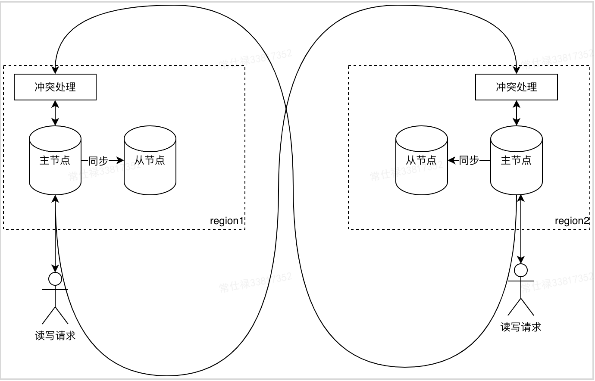
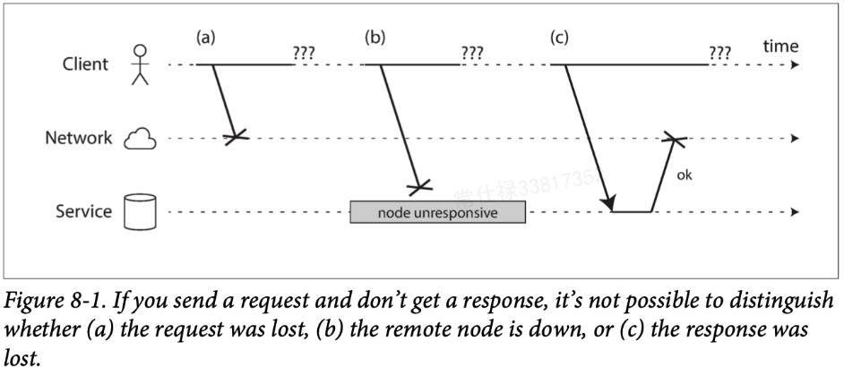
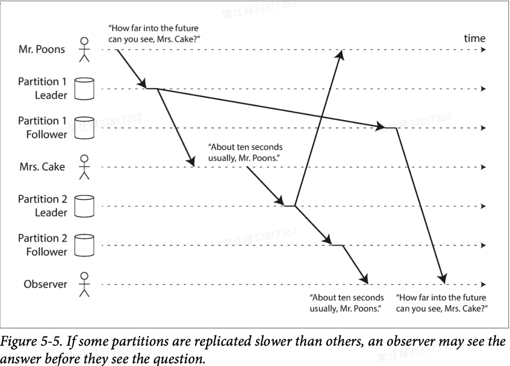
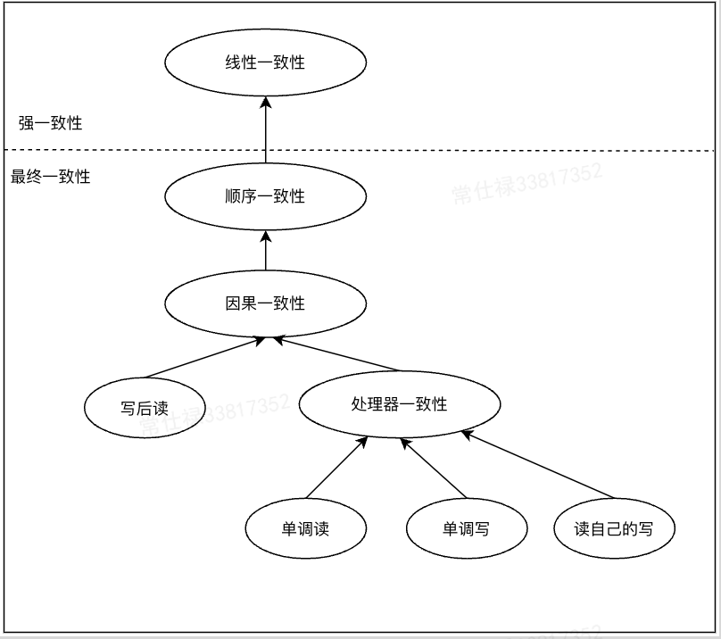
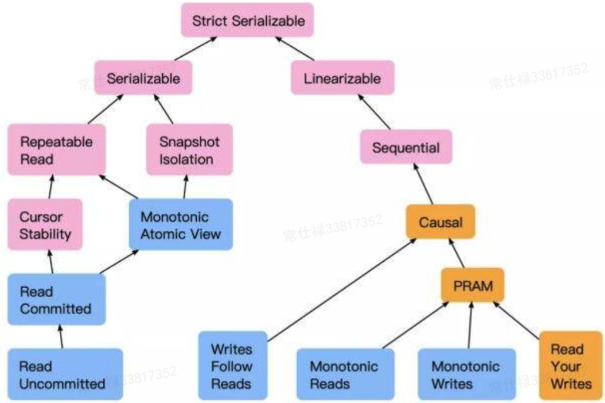

# [Replication（上）：常见复制模型&分布式系统挑战](https://tech.meituan.com/2022/08/25/replication-in-meituan-01.html)

2022年08月25日 作者: 仕禄 [文章链接](https://tech.meituan.com/2022/08/25/replication-in-meituan-01.html) 16168字 33分钟阅读

本系列文章分上下两篇，以《数据密集型应用系统设计（DDIA）》（下文简称《DDIA》）为主线，文中的核心理论讲解与图片来自于此书。在此基础上，加入了日常工作中对这些概念的理解与个性化的思考，并将它们映射到Kafka中，跟大家分享一下如何将具体的理论应用于实际生产环境中。

## 1. 简介

### 1.1 简介——使用复制的目的

在分布式系统中，数据通常需要被分散在多台机器上，主要为了达到以下目的：

1. 扩展性，数据量因读写负载巨大，一台机器无法承载，数据分散在多台机器上可以有效地进行负载均衡，达到灵活的横向扩展。
2. 容错、高可用，在分布式系统中，单机故障是常态，在单机故障下仍然希望系统能够正常工作，这时候就需要数据在多台机器上做冗余，在遇到单机故障时其他机器就可以及时接管。
3. 统一的用户体验，如果系统客户端分布在多个地域，通常考虑在多个地域部署服务，以方便用户能够就近访问到他们所需要的数据，获得统一的用户体验。

数据的多机分布的方式主要有两种，一种是将数据分片保存，每个机器保存数据的部分分片（Kafka中称为Partition，其他部分系统称为Shard），另一种则是完全的冗余，其中每一份数据叫做一个副本（Kafka中称为Replica），通过数据复制技术实现。在分布式系统中，两种方式通常会共同使用，最后的数据分布往往是下图的样子，一台机器上会保存不同数据分片的若干个副本。本系列博文主要介绍的是数据如何做复制，分区则是另一个主题，不在本文的讨论范畴。

图1 常见数据分布

复制的目标需要保证若干个副本上的数据是一致的，这里的“一致”是一个十分不确定的词，既可以是不同副本上的数据在任何时刻都保持完全一致，也可以是不同客户端不同时刻访问到的数据保持一致。一致性的强弱也会不同，有可能需要任何时候不同客端都能访问到相同的新的数据，也有可能是不同客户端某一时刻访问的数据不相同，但在一段时间后可以访问到相同的数据。因此，“一致性”是一个值得单独抽出来细说的词。在下一篇文章中，我们将重点介绍这个词在不同上下文之间的含义。

此时，大家可能会有疑问，直接让所有副本在任意时刻都保持一致不就行了，为啥还要有各种不同的一致性呢？我们认为有两个考量点，第一是性能，第二则是复杂性。

**性能**比较好理解，因为冗余的目的不完全是为了高可用，还有延迟和负载均衡这类提升性能的目的，如果只一味地为了地强调数据一致，可能得不偿失。**复杂性**是因为分布式系统中，有着比单机系统更加复杂的不确定性，节点之间由于采用不大可靠的网络进行传输，并且不能共享统一的一套系统时间和内存地址（后文会详细进行说明），这使得原本在一些单机系统上很简单的事情，在转到分布式系统上以后就变得异常复杂。这种复杂性和不确定性甚至会让我们怀疑，这些副本上的数据真的能达成一致吗？下一篇文章会专门详细分析如何设计算法来应对这种复杂和不确定性。

### 1.2 文章系列概述

本系列博文将分为上下两篇，第一篇将主要介绍几种常见的数据复制模型，然后介绍分布式系统的挑战，让大家对分布式系统一些稀奇古怪的故障有一些感性的认识。

第二篇文章将针对本篇中提到的问题，分别介绍事务、分布式共识算法和一致性，以及三者的内在联系，再分享如何在分布式系统中保证数据的一致性，进而让大家对数据复制技术有一个较为全面的认识。此外，本系列还将介绍业界验证分布式算法正确性的一些工具和框架。接下来，让我们一起开始数据复制之旅吧！

## 2. 数据复制模式

总体而言，最常见的复制模式有三种，分别为主从模式、多主节点模式、无主节点模式，下面分别进行介绍。

### 2.1 最简单的复制模式——主从模式

#### 简介

对复制而言，最直观的方法就是将副本赋予不同的角色，其中有一个主副本，主副本将数据存储在本地后，将数据更改作为日志，或者以更改流的方式发到各个从副本（后文也会称节点）中。在这种模式下，所有写请求就全部会写入到主节点上，读请求既可以由主副本承担也可以由从副本承担，这样对于读请求而言就具备了扩展性，并进行了负载均衡。但这里面存在一个权衡点，就是客户端视角看到的一致性问题。这个权衡点存在的核心在于，数据传输是通过网络传递的，数据在网络中传输的时间是不能忽略的。

图2 同步复制与异步复制

如上图所示，在这个时间窗口中，任何情况都有可能发生。在这种情况下，客户端何时算写入完成，会决定其他客户端读到数据的可能性。这里我们假设这份数据有一个主副本和一个从副本，如果主副本保存后即向客户端返回成功，这样叫做异步复制（1）。而如果等到数据传送到从副本1，并得到确认之后再返回客户端成功，称为同步复制（2）。这里我们先假设系统正常运行，在异步同步下，如果从副本承担读请求，假设reader1和reader2同时在客户端收到写入成功后发出读请求，两个reader就可能读到不一样的值。

为了避免这种情况，实际上有两种角度的做法，第一种角度是让客户端只从主副本读取数据，这样，在正常情况下，所有客户端读到的数据一定是一致的（Kafka当前的做法）；另一种角度则是采用同步复制，假设使用纯的同步复制，当有多个副本时，任何一个副本所在的节点发生故障，都会使写请求阻塞，同时每次写请求都需要等待所有节点确认，如果副本过多会极大影响吞吐量。而如果仅采用异步复制并由主副本承担读请求，当主节点故障发生切换时，一样会发生数据不一致的问题。

很多系统会把这个决策权交给用户，这里我们以Kafka为例，首先提供了同步与异步复制的语义（通过客户端的acks参数确定），另外提供了ISR机制，而只需要ISR中的副本确认即可，系统可以容忍部分节点因为各种故障而脱离ISR，那样客户端将不用等待其确认，增加了系统的容错性。当前Kafka未提供让从节点承担读请求的设计，但在高版本中已经有了这个Feature。这种方式使系统有了更大的灵活性，用户可以根据场景自由权衡一致性和可用性。

#### 主从模式下需要的一些能力

**增加新的从副本（节点）**

1. 在Kafka中，我们所采取的的方式是通过新建副本分配的方式，以追赶的方式从主副本中同步数据。
2. 数据库所采用的的方式是通过快照+增量的方式实现。

a.在某一个时间点产生一个一致性的快照。 b.将快照拷贝到从节点。 c.从节点连接到主节点请求所有快照点后发生的改变日志。 d.获取到日志后，应用日志到自己的副本中，称之为追赶。 e.可能重复多轮a-d。

**处理节点失效**

**从节点失效——追赶式恢复**

针对从节点失效，恢复手段较为简单，一般采用追赶式恢复。而对于数据库而言，从节点可以知道在崩溃前所执行的最后一个事务，然后连接主节点，从该节点将拉取所有的事件变更，将这些变更应用到本地记录即可完成追赶。

对于Kafka而言，恢复也是类似的，Kafka在运行过程中，会定期项磁盘文件中写入checkpoint，共包含两个文件，一个是recovery-point-offset-checkpoint，记录已经写到磁盘的offset，另一个则是replication-offset-checkpoint，用来记录高水位（下文简称HW），由ReplicaManager写入，下一次恢复时，Broker将读取两个文件的内容，可能有些被记录到本地磁盘上的日志没有提交，这时就会先截断（Truncate）到HW对应的offset上，然后从这个offset开始从Leader副本拉取数据，直到认追上Leader，被加入到ISR集合中

**主节点失效–节点切换**

主节点失效则会稍稍复杂一些，需要经历三个步骤来完成节点的切换。

1. 确认主节点失效，由于失效的原因有多种多样，大多数系统会采用超时来判定节点失效。一般都是采用节点间互发心跳的方式，如果发现某个节点在较长时间内无响应，则会认定为节点失效。具体到Kafka中，它是通过和Zookeeper（下文简称ZK）间的会话来保持心跳的，在启动时Kafka会在ZK上注册临时节点，此后会和ZK间维持会话，假设Kafka节点出现故障（这里指被动的掉线，不包含主动执行停服的操作），当会话心跳超时时，ZK上的临时节点会掉线，这时会有专门的组件（Controller）监听到这一信息，并认定节点失效。
2. 选举新的主节点。这里可以通过通过选举的方式（民主协商投票，通常使用共识算法），或由某个特定的组件指定某个节点作为新的节点（Kafka的Controller）。在选举或指定时，需要尽可能地让新主与原主的差距最小，这样会最小化数据丢失的风险（让所有节点都认可新的主节点是典型的共识问题）——这里所谓共识，就是让一个小组的节点就某一个议题达成一致，下一篇文章会重点进行介绍。
3. 重新配置系统是新的主节点生效，这一阶段基本可以理解为对集群的元数据进行修改，让所有外界知道新主节点的存在（Kafka中Controller通过元数据广播实现），后续及时旧的节点启动，也需要确保它不能再认为自己是主节点，从而承担写请求。

**问题**

虽然上述三个步骤较为清晰，但在实际发生时，还会存在一些问题：

1. 假设采用异步复制，在失效前，新的主节点与原主节点的数据存在Gap，选举完成后，原主节点很快重新上线加入到集群，这时新的主节点可能会收到冲突的写请求，此时还未完全执行上述步骤的第三步，也就是原主节点没有意识到自己的角色发生变化，还会尝试向新主节点同步数据。这时，一般的做法是，将原主节点上未完成复制的写请求丢掉，但这又可能会发生数据丢失或不一致，假设我们每条数据采用MySQL的自增ID作为主键，并且使用Redis作为缓存，假设发生了MySQL的主从切换，从节点的计数器落后于主节点，那样可能出现应用获取到旧的自增ID，这样就会与Redis上对应ID取到的数据不一致，出现数据泄露或丢失。
2. 假设上面的问题，原主节点因为一些故障永远不知道自己角色已经变更，则可能发生“脑裂”，两个节点同时操作数据，又没有相应解决冲突（没有设计这一模块），就有可能对数据造成破坏。
3. 此外，对于超时时间的设定也是个十分复杂的问题，过长会导致服务不可用，设置过短则会导致节点频繁切换，假设本身系统处于高负载状态，频繁角色切换会让负载进一步加重（团队内部对Kafka僵尸节点的处理逻辑）。

#### 异步复制面临的主要问题–复制滞后

如前文所述，如果我们使用纯的同步复制，任何一台机器发生故障都会导致服务不可写入，并且在数较多的情况下，吞吐和可用性都会受到比较大的影响。很多系统都会采用半步复制或异步复制来在可用性和一致性之间做权衡。

在异步复制中，由于写请求写到主副本就返回成功，在数据复制到其他副本的过程中，如果客户端进行读取，在不同副本读取到的数据可能会不一致，《DDIA》将这个种现象称为复制滞后（Replication Lag），存在这种问题的复制行为所形成的数据一致性统称为最终一致性。未来还会重点介绍一下一致性和共识，但在本文不做过多的介绍，感兴趣的同学可以提前阅读《Problems with Replication Lag》这一章节。

### 2.2 多主节点复制

前文介绍的主从复制模型中存在一个比较严重的弊端，就是所有写请求都需要经过主节点，因为只存在一个主节点，就很容易出现性能问题。虽然有从节点作为冗余应对容错，但对于写入请求实际上这种复制方式是不具备扩展性的。

此外，如果客户端来源于多个地域，不同客户端所感知到的服务相应时间差距会非常大。因此，有些系统顺着传统主从复制进行延伸，采用多个主节点同时承担写请求，主节点接到写入请求之后将数据同步到从节点，不同的是，这个主节点可能还是其他节点的从节点。复制模式如下图所示，可以看到两个主节点在接到写请求后，将数据同步到同一个数据中心的从节点。此外，该主节点还将不断同步在另一数据中心节点上的数据，由于每个主节点同时处理其他主节点的数据和客户端写入的数据，因此需要模型中增加一个冲突处理模块，最后写到主节点的数据需要解决冲突。

图3 多主节点复制

#### 使用场景

**a. 多数据中心部署**

一般采用多主节点复制，都是为了做多数据中心容灾或让客户端就近访问（用一个高大上的名词叫做异地多活），在同一个地域使用多主节点意义不大，在多个地域或者数据中心部署相比主从复制模型有如下的优势：

- **性能提升**：性能提升主要表现在两个核心指标上，首先从吞吐方面，传统的主从模型所有写请求都会经过主节点，主节点如果无法采用数据分区的方式进行负载均衡，可能存在性能瓶颈，采用多主节点复制模式下，同一份数据就可以进行负载均衡，可以有效地提升吞吐。另外，由于多个主节点分布在多个地域，处于不同地域的客户端可以就近将请求发送到对应数据中心的主节点，可以最大程度地保证不同地域的客户端能够以相似的延迟读写数据，提升用户的使用体验。
- **容忍数据中心失效**：对于主从模式，假设主节点所在的数据中心发生网络故障，需要发生一次节点切换才可将流量全部切换到另一个数据中心，而采用多主节点模式，则可无缝切换到新的数据中心，提升整体服务的可用性。

**b.离线客户端操作**

除了解决多个地域容错和就近访问的问题，还有一些有趣的场景，其中一个场景则是在网络离线的情况下还能继续工作，例如我们笔记本电脑上的笔记或备忘录，我们不能因为网络离线就禁止使用该程序，我们依然可以在本地愉快的编辑内容（图中标记为Offline状态），当我们连上网之后，这些内容又会同步到远程的节点上，这里面我们把本地的App也当做其中的一个副本，那么就可以承担用户在本地的变更请求。联网之后，再同步到远程的主节点上。

图4 Notion界面

**c.协同编辑**

这里我们对离线客户端操作进行扩展，假设我们所有人同时编辑一个文档，每个人通过Web客户端编辑的文档都可以看做一个主节点。这里我们拿美团内部的学城（内部的Wiki系统）举例，当我们正在编辑一份文档的时候，基本上都会发现右上角会出现“xxx也在协同编辑文档”的字样，当我们保存的时候，系统就会自动将数据保存到本地并复制到其他主节点上，各自处理各自端上的冲突。

另外，当文档出现了更新时，学城会通知我们有更新，需要我们手动点击更新，来更新我们本地主节点的数据。书中说明，虽然不能将协同编辑完全等同于数据库复制，但却是有很多相似之处，也需要处理冲突问题。

### 冲突解决

通过上面的分析，我们了解到多主复制模型最大挑战就是解决冲突，下面我们简单看下《DDIA》中给出的通用解法，在介绍之前，我们先来看一个典型的冲突。

#### a.冲突实例

图5 冲突实例

在图中，由于多主节点采用异步复制，用户将数据写入到自己的网页就返回成功了，但当尝试把数据复制到另一个主节点时就会出问题，这里我们如果假设主节点更新时采用类似CAS的更新方式时更新时，都会由于预期值不符合从而拒绝更新。针对这样的冲突，书中给出了几种常见的解决思路。

#### b.解决思路

**1. 避免冲突**

所谓解决问题最根本的方式则是尽可能不让它发生，如果能够在应用层保证对特定数据的请求只发生在一个节点上，这样就没有所谓的“写冲突”了。继续拿上面的协同编辑文档举例，如果我们把每个人的都在填有自己姓名表格的一行里面进行编辑，这样就可以最大程度地保证每个人的修改范围不会有重叠，冲突也就迎刃而解了。

**2. 收敛于一致状态**

然而，对更新标题这种情况而言，冲突是没法避免的，但还是需要有方法解决。对于单主节点模式而言，如果同一个字段有多次写入，那么最后写入的一定是最新的。ZK、KafkaController、KafkaReplica都有类似Epoch的方式去屏蔽过期的写操作，由于所有的写请求都经过同一个节点，顺序是绝对的，但对于多主节点而言，由于没有绝对顺序的保证，就只能试图用一些方式来决策相对顺序，使冲突最终收敛，这里提到了几种方法：

给每个写请求分配Uniq-ID，例如一个时间戳，一个随机数，一个UUID或Hash值，最终取最高的ID作为最新的写入。如果基于时间戳，则称作最后写入者获胜（LWW），这种方式看上去非常直接且简单，并且非常流行。但很遗憾，文章一开始也提到了，分布式系统没有办法在机器间共享一套统一的系统时间，所以这个方案很有可能因为这个问题导致数据丢失（时钟漂移）。

每个副本分配一个唯一的ID，ID高的更新优先级高于地域低的，这显然也会丢失数据。

当然，我们可以用某种方式做拼接，或利用预先定义的格式保留冲突相关信息，然后由用户自行解决。

**3. 用户自行处理**

其实，把这个操作直接交给用户，让用户自己在读取或写入前进行冲突解决，这种例子也是屡见不鲜，Github采用就是这种方式。

这里只是简单举了一些冲突的例子，其实冲突的定义是一个很微妙的概念。《DDIA》第七章介绍了更多关于冲突的概念，感兴趣同学可以先自行阅读，在下一篇文章中也会提到这个问题。

#### c.处理细节介绍

此外，在书中将要结束《复制》这一章时，也详细介绍了如何进行冲突的处理，这里也简单进行介绍。

这里我们可以思考一个问题，为什么会发生冲突？通过阅读具体的处理手段后，我们可以尝试这样理解，正是因为我们对事件发生的先后顺序不确定，但这些事件的处理主体都有重叠（比如都有设置某个数据的值）。通过我们对冲突的理解，加上我们的常识推测，会有这样几种方式可以帮我们来判断事件的先后顺序。

**1. 直接指定事件顺序**

对于事件发生的先后顺序，我们一个最直观的想法就是，两个请求谁新要谁的，那这里定义“最新”是个问题，一个很简单的方式是使用时间戳，这种算法叫做最后写入者获胜LWW。

但分布式系统中没有统一的系统时钟，不同机器上的时间戳无法保证精确同步，那就可能存在数据丢失的风险，并且由于数据是覆盖写，可能不会保留中间值，那么最终可能也不是一致的状态，或出现数据丢失。如果是一些缓存系统，覆盖写看上去也是可以的，这种简单粗暴的算法是非常好的收敛冲突的方式，但如果我们对数据一致性要求较高，则这种方式就会引入风险，除非数据写入一次后就不会发生改变。

**2. 从事件本身推断因果关系和并发**

上面直接简单粗暴的制定很明显过于武断，那么有没有可能时间里面就存在一些因果关系呢，如果有我们很显然可以通过因果关系知道到底需要怎样的顺序，如果不行再通过指定的方式呢？

例如：

图6 违背因果关系示例

这里是书中一个多主节点复制的例子，这里ClientA首先向Leader1增加一条数据x=1，然Leader1采用异步复制的方式，将变更日志发送到其他的Leader上。在复制过程中，ClientB向Leader3发送了更新请求，内容则是更新Key为x的Value，使Value=Value+1。

原图中想表达的是，update的日志发送到Leader2的时间早于insert日志发送到Leader2的时间，会导致更新的Key不存在。但是，这种所谓的事件关系本身就不是完全不相干的，书中称这种关系为依赖或者Happens-before。

我们可能在JVM的内存模型（JMM）中听到过这个词，在JMM中，表达的也是多个线程操作的先后顺序关系。这里，如果我们把线程或者请求理解为对数据的操作（区别在于一个是对本地内存数据，另一个是对远程的某处内存进行修改），线程或客户端都是一种执行者（区别在于是否需要使用网络），那这两种Happens-before也就可以在本质上进行统一了，都是为了描述事件的先后顺序而生。

书中给出了检测这类事件的一种算法，并举了一个购物车的例子，如图所示（以餐厅扫码点餐的场景为例）：

图7 扫码点餐示例

图中两个客户端同时向购物车里放东西，事例中的数据库假设只有一个副本。

1. 首先Client1向购物车中添加牛奶，此时购物车为空，返回版本1，Value为[牛奶]。
2. 此时Client2向其中添加鸡蛋，其并不知道Client1添加了牛奶，但服务器可以知道，因此分配版本号为2，并且将鸡蛋和牛奶存成两个单独的值，最后将两个值和版本号2返回给客户端。此时服务端存储了[鸡蛋] 2 [牛奶]1。
3. 同理，Client1添加面粉，这时候Client1只认为添加了[牛奶]，因此将面粉与牛奶合并发送给服务端[牛奶，面粉]，同时还附带了之前收到的版本号1，此时服务端知道，新值[牛奶，面粉]可以替换同一个版本号中的旧值[牛奶]，但[鸡蛋]是并发事件，分配版本号3，返回值[牛奶，面粉] 3 [鸡蛋]2。
4. 同理，Client2向购物车添加[火腿]，但在之前的请求中，返回了[鸡蛋][牛奶]，因此和火腿合并发送给服务端[鸡蛋，牛奶，火腿]，同时附带了版本号2，服务端直接将新值覆盖之前版本2的值[鸡蛋]，但[牛奶，面粉]是并发事件，因此存储值为[牛奶，面粉] 3 [鸡蛋，牛奶，火腿] 4并分配版本号4。
5. 最后一次Client添加培根，通过之前返回的值里，知道有[牛奶，面粉，鸡蛋]，Client将值合并[牛奶，面粉，鸡蛋，培根]联通之前的版本号一起发送给服务端，服务端判断[牛奶，面粉，鸡蛋，培根]可以覆盖之前的[牛奶，面粉]但[鸡蛋，牛奶，火腿]是并发值，加以保留。

通过上面的例子，我们看到了一个根据事件本身进行因果关系的确定。书中给出了进一步的抽象流程：

- 服务端为每个主键维护一个版本号，每当主键新值写入时递增版本号，并将新版本号和写入值一起保存。
- 客户端写主键，写请求比包含之前读到的版本号，发送的值为之前请求读到的值和新值的组合，写请求的相应也会返回对当前所有的值，这样就可以一步步进行拼接。
- 当服务器收到有特定版本号的写入时，覆盖该版本号或更低版本号的所有值，保留高于请求中版本号的新值（与当前写操作属于并发）。

有了这套算法，我们就可以检测出事件中有因果关系的事件与并发的事件，而对于并发的事件，仍然像上文提到的那样，需要依据一定的原则进行合并，如果使用LWW，依然可能存在数据丢失的情况。因此，需要在服务端程序的合并逻辑中需要额外做些事情。

在购物车这个例子中，比较合理的是合并新值和旧值，即最后的值是[牛奶，鸡蛋，面粉，火腿，培根]，但这样也会导致一个问题，假设其中的一个用户删除了一项商品，但是union完还是会出现在最终的结果中，这显然不符合预期。因此可以用一个类似的标记位，标记记录的删除，这样在合并时可以将这个商品踢出，这个标记在书中被称为墓碑（Tombstone）。

### 2.3 无主节点复制

之前介绍的复制模式都是存在明确的主节点，从节点的角色划分的，主节点需要将数据复制到从节点，所有写入的顺序由主节点控制。但有些系统干脆放弃了这个思路，去掉了主节点，任何副本都能直接接受来自客户端的写请求，或者再有一些系统中，会给到一个协调者代表客户端进行写入（以Group Commit为例，由一个线程积攒所有客户端的请求统一发送），与多主模式不同，协调者不负责控制写入顺序，这个限制的不同会直接影响系统的使用方式。

### 处理节点失效

假设一个数据系统拥有三个副本，当其中一个副本不可用时，在主从模式中，如果恰好是主节点，则需要进行节点切换才能继续对外提供服务，但在无主模式下，并不存在这一步骤，如下图所示：

图8 Quorum写入处理节点失效

这里的Replica3在某一时刻无法提供服务，此时用户可以收到两个Replica的写入成功的确认，即可认为写入成功，而完全可以忽略那个无法提供服务的副本。当失效的节点恢复时，会重新提供读写服务，此时如果客户端向这个副本读取数据，就会请求到过期值。

为了解决这个问题，这里客户端就不是简单向一个节点请求数据了，而是向所有三个副本请求，这时可能会收到不同的响应，这时可以通过类似版本号来区分数据的新旧（类似上文中并发写入的检测方式）。这里可能有一个问题，副本恢复之后难道就一直让自己落后于其他副本吗？这肯定不行，这会打破一致性的语义，因此需要一个机制。有两种思路：

1. 客户端读取时对副本做修复，如果客户端通过并行读取多个副本时，读到了过期的数据，可以将数据写入到旧副本中，以便追赶上新副本。
2. 反熵查询，一些系统在副本启动后，后台会不断查找副本之间的数据diff，将diff写到自己的副本中，与主从复制模式不同的是，此过程不保证写入的顺序，并可能引发明显的复制滞后。

### 读写Quorum

上文中的实例我们可以看出，这种复制模式下，要想保证读到的是写入的新值，每次只从一个副本读取显然是有问题的，那么需要每次写几个副本呢，又需要读取几个副本呢？这里的一个核心点就是让写入的副本和读取的副本有交集，那么我们就能够保证读到新值了。

直接上公式：w+r>N�+�>� 。其中N为副本的数量，w为每次并行写入的节点数，r为每次同时读取的节点数，这个公式非常容易理解，就不做过多赘述。不过这里的公式虽然看着比较直白也简单，里面却蕴含了一些系统设计思考：

- 一般配置方法，取w=r=⌈(N+1)2⌉�=�=⌈(�+1)2⌉
- w，r与N的关系决定了能够容忍多少的节点失效
  - 假设N=3, w=2, r=2，可以容忍1个节点故障。
  - 假设N=5，w=3, r=3 可以容忍2个节点故障。
  - N个节点可以容忍可以容忍⌈(N+1)2⌉−1⌈(�+1)2⌉−1个节点故障。
- 在实际实现中，一般数据会发送或读取所有节点，w和r决定了我们需要等待几个节点的写入或读取确认。

### Quorum一致性的局限性

看上去这个简单的公式就可以实现很强大的功能，但这里有一些问题值得注意：

- 首先，Quorum并不是一定要求多数，重要的是读取的副本和写入副本有重合即可，可以按照读写的可用性要求酌情考虑配置。
- 另外，对于一些没有很强一致性要求的系统，可以配置w+r <= N，这样可以等待更少的节点即可返回，这样虽然有可能读取到一个旧值，但这种配置可以很大提升系统的可用性，当网络大规模故障时更有概率让系统继续运行而不是由于没有达到Quorum限制而返回错误。
- 假设在w+r>N的情况下，实际上也存在边界问题导致一些一致性问题：
  - 首先假设是Sloppy Quorum（一个更为宽松的Quorum算法），写入的w和读取的r可能完全不相交，因此不能保证数据一定是新的。
  - 如果两个写操作同时发生，那么还是存在冲突，在合并时，如果基于LWW，仍然可能导致数据丢失。
  - 如果写读同时发生，也不能保证读请求一定就能取到新值，因为复制具有滞后性（上文的复制窗口）。
  - 如果某些副本写入成功，其他副本写入失败（磁盘空间满）且总的成功数少于w，那些成功的副本数据并不会回滚，这意味着及时写入失败，后续还是可能读到新值。

虽然，看上去Quorum复制模式可以保证获取到新值，但实际情况并不是我们想象的样子，这个协议到最后可能也只能达到一个最终的一致性，并且依然需要共识算法的加持。

### 2.4 本章小结

以上我们介绍了所有常见的复制模式，我们可以看到，每种模式都有一定的应用场景和优缺点，但是很明显，光有复制模式远远达不到数据的一致性，因为分布式系统中拥有太多的不确定性，需要后面各种事务、共识算法的帮忙才能去真正对抗那些“稀奇古怪”的问题。

到这里，可能会有同学就会问，到底都是些什么稀奇古怪的问题呢？相比单机系统又有那些独特的问题呢？下面本文先来介绍分布式系统中的几个最典型的挑战（Trouble），让一些同学小小地“绝望”一下，然后我们会下一篇文章中再揭晓答案。

## 3. 分布式系统的挑战

这部分存在的意义主要想让大家理解，为什么一些看似简单的问题到了分布式系统中就会变得异常复杂。顺便说一声，这一章都是一些“奇葩”现象，并没有过于复杂的推理和证明，希望大家能够较为轻松愉悦地看完这些内容。

### 3.1 部分失效

这是分布式系统中特有的一个名词，这里先看一个现实当中的例子。假设老板想要处理一批文件，如果让一个人做，需要十天。但老板觉得有点慢，于是他灵机一动，想到可以找十个人来搞定这件事，然后自己把工作安排好，认为这十个人一天正好干完，于是向他的上级信誓旦旦地承诺一天搞定这件事。他把这十个人叫过来，把任务分配给了他们，他们彼此建了个微信群，约定每个小时在群里汇报自己手上的工作进度，并强调在晚上5点前需要通过邮件提交最后的结果。于是老版就去愉快的喝茶去了，但是现实却让他大跌眼镜。

首先，有个同学家里信号特别差，报告进度的时候只成功报告了3个小时的，然后老板在微信里问，也收不到任何回复，最后结果也没法提交。另一个同学家的表由于长期没换电池，停在了下午四点，结果那人看了两次表都是四点，所以一点都没着急，中间还看了个电影，慢慢悠悠做完交上去了，他还以为老板会表扬他，提前了一小时交，结果实际上已经是晚上八点了。还有一个同学因为前一天没睡好，效率极低，而且也没办法再去高强度的工作了。结果到了晚上5点，只有7个人完成了自己手头上的工作。

这个例子可能看起来并不是非常恰当，但基本可以描述分布式系统特有的问题了。在分布式的系统中，我们会遇到各种“稀奇古怪”的故障，例如家里没信号（网络故障)，不管怎么叫都不理你，或者断断续续的理你。另外，因为每个人都是通过自己家的表看时间的，所谓的5点需要提交结果，在一定程度上旧失去了参考的绝对价值。因此，作为上面例子中的“老板”，不能那么自信的认为一个人干工作需要10天，就可以放心交给10个人，让他们一天搞定。

我们需要有各种措施来应对分派任务带来的不确定性，回到分布式系统中，部分失效是分布式系统一定会出现的情况。作为系统本身的设计人员，我们所设计的系统需要能够容忍这种问题，相对单机系统来说，这就带来了特有的复杂性。

### 3.2 分布式系统特有的故障

#### 不可靠的网络

对于一个纯的分布式系统而言，它的架构大多为Share Nothing架构，即使是存算分离这种看似的Share Storage，它的底层存储一样是需要解决Share Nothing的。所谓Nothing，这里更倾向于叫Nothing but Network，网络是不同节点间共享信息的唯一途径，数据的传输主要通过以太网进行传输，这是一种异步网络，也就是网络本身并不保证发出去的数据包一定能被接到或是何时被收到。这里可能发生各种错误，如下图所示：

图9 不可靠的网络

1. 请求丢失
2. 请求正在某个队列中等待
3. 远程节点已经失效
4. 远程节点无法响应
5. 远程节点已经处理完请求，但在ack的时候丢包
6. 远程接收节点已经处理完请求，但回复处理很慢

本文认为，造成网络不可靠的原因不光是以太网和IP包本身，其实应用本身有时候异常也是造成网络不可靠的一个诱因。因为，我们所采用的节点间传输协议大多是TCP，TCP是个端到端的协议，是需要发送端和接收端两端内核中明确维护数据结构来维持连接的，如果应用层发生了下面的问题，那么网络包就会在内核的Socket Buffer中排队得不到处理，或响应得不到处理。

1. 应用程序GC。
2. 处理节点在进行重的磁盘I/O，导致CPU无法从中断中恢复从而无法处理网络请求。
3. 由于内存换页导致的颠簸。

这些问题和网络本身的不稳定性相叠加，使得外界认为的网络不靠谱的程度更加严重。因此这些不靠谱，会极大地加重上一章中的 复制滞后性，进而带来各种各样的一致性问题。

#### 应对之道

网络异常相比其他单机上的错误而言，可能多了一种不确定的返回状态，即延迟，而且延迟的时间完全无法预估。这会让我们写起程序来异常头疼，对于上一章中的问题，我们可能无从知晓节点是否失效，因为你发的请求压根可能不会有人响应你。因此，我们需要把上面的“不确定”变成一种确定的形式，那就是利用“超时”机制。这里引申出两个问题：

1. 假设能够检测出失效，我们应该如何应对？

   a. 负载均衡需要避免往失效的节点上发数据（服务发现模块中的健康检查功能）。 b. 如果在主从复制中，如果主节点失效，需要出发选举机制（Kafka中的临时节点掉线，Controller监听到变更触发新的选举，Controller本身的选举机制）。 c. 如果服务进程崩溃，但操作系统运行正常，可以通过脚本通知其他节点，以便新的节点来接替（Kafka的僵尸节点检测，会触发强制的临时节点掉线）。 d. 如果路由器已经确认目标节点不可访问，则会返回ICMP不可达（ping不通走下线）。

2. 如何设置超时时间是合理的？

很遗憾地告诉大家，这里面实际上是个权衡的问题，短的超时时间会更快地发现故障，但同时增加了误判的风险。这里假设网络正常，那么如果端到端的ping时间为d，处理时间为r，那么基本上请求会在2d+r的时间完成。但在现实中，我们无法假设异步网络的具体延迟，实际情况可能会更复杂。因此这是一个十分靠经验的工作。

### 3.2 不可靠的时钟

说完了“信号”的问题，下面就要说说每家的“钟表”——时钟了，它主要用来做两件事：

1. 描述当前的绝对时间
2. 描述某件事情的持续时间

在DDIA中，对于这两类用途给出了两种时间，一类成为墙上时钟，它们会返回当前的日期和时间，例如clock_gettime(CLOCK_REALTIME)或者System.currentTimeMills，但这类反应精确时间的API，由于时钟同步的问题，可能会出现回拨的情况。因此，作为持续时间的测量通常采用单调时钟，例如clock_gettime(CLOCK_MONOTONIC) 或者System.nanoTime。高版本的Kafka中把请求的相应延迟计算全部换成了这个API实现，应该也是这个原因。

这里时钟同步的具体原理，以及如何会出现不准确的问题，这里就不再详细介绍了，感兴趣的同学可以自行阅读书籍。下面将介绍一下如何使用时间戳来描述事件顺序的案例，并展示如何因时钟问题导致事件顺序判断异常的：

图10 不可靠的时钟

这里我们发现，Node1的时钟比Node3快，当两个节点在处理完本地请求准备写Node2时发生了问题，原本ClientB的写入明显晚于ClientA的写入，但最终的结果，却由于Node1的时间戳更大而丢弃了本该保留的x+=1，这样，如果我们使用LWW，一定会出现数据不符合预期的问题。

由于时钟不准确，这里就引入了统计学中的置信区间的概念，也就是这个时间到底在一个什么样的范围里，一般的API是无法返回类似这样的信息的。不过，Google的TrueTime API则恰恰能够返回这种信息，其调用结果是一个区间，有了这样的API，确实就可以用来做一些对其有依赖的事情了，例如Google自家的Spanner，就是使用TrueTime实现快照隔离。

### 如何在这艰难的环境中设计系统

上面介绍的问题是不是挺“令人绝望”的？你可能发现，现在时间可能是错的，测量可能是不准的，你的请求可能得不到任何响应，你可能不知道它是不是还活着……这种环境真的让设计分布式系统变得异常艰难，就像是你在100个人组成的大部门里面协调一些工作一样，工作量异常的巨大且复杂。

但好在我们并不是什么都做不了，以协调这件事为例，我们肯定不是武断地听取一个人的意见，让我们回到学生时代。我们需要评选一位班长，肯定我们都经历过投票、唱票的环节，最终得票最多的那个人当选，有时可能还需要设置一个前提，需要得票超过半数。

映射到分布式系统中也是如此，我们不能轻易地相信任何一台节点的信息，因为它有太多的不确定，因此更多的情况下，在分布式系统中如果我们需要就某个事情达成一致，也可以采取像竞选或议会一样，大家协商、投票、仲裁决定一项提议达成一致，真相由多数人商议决定，从而达到大家的一致和统一，这也就是后面要介绍的分布式共识协议。这个协议能够容忍一些节点的部分失效，或者莫名其妙的故障带来的问题，让系统能够正常地运行下去，确保请求到的数据是可信的。

下面给出一些实际分布式算法的理论模型，根据对于延迟的假设不同，这里介绍三种系统模型。

**1. 同步模型**

该模型主要假设网络延迟是有界的，我们可以清楚地知道这个延迟的上下界，不管出现任何情况，它都不会超出这个界限。

**2. 半同步模型（大部分模型都是基于这个假设）**

半同步模型认为大部分情况下，网络和延迟都是正常的，如果出现违背的情况，偏差可能会非常大。

**3. 异步模型**

对延迟不作任何假设，没有任何超时机制。

而对于节点失效的处理，也存在三种模型，这里我们忽略恶意谎言的拜占庭模型，就剩下两种。

**1.崩溃-终止模型（Crash-Stop）**：该模型中假设一个节点只能以一种方式发生故障，即崩溃，可能它会在任意时刻停止响应，然后永远无法恢复。

**2.崩溃-恢复模型**：节点可能在任何时刻发生崩溃，可能会在一段时间后恢复，并再次响应，在该模型中假设，在持久化存储中的数据将得以保存，而内存中的数据会丢失。

而多数的算法都是基于半同步模型+崩溃-恢复模型来进行设计的。

#### Safety and Liveness

这两个词在分布式算法设计时起着十分关键的作用，其中安全性（Safety）表示没有意外发生，假设违反了安全性原则，我们一定能够指出它发生的时间点，并且安全性一旦违反，无法撤销。而活性（Liveness）则表示“预期的事情最终一定会发生”，可能我们无法明确具体的时间点，但我们期望它在未来某个时间能够满足要求。

在进行分布式算法设计时，通常需要必须满足安全性，而活性的满足需要具备一定的前提。

## 7. 总结

以上就是第一篇文章的内容，简单做下回顾，本文首先介绍了复制的三种常见模型，分别是主从复制、多主复制和无主复制，然后分别介绍了这三种模型的特点、适用场景以及优缺点。接下来，我们用了一个现实生活中的例子，向大家展示了分布式系统中常见的两个特有问题，分别是节点的部分失效以及无法共享系统时钟的问题，这两个问题为我们设计分布式系统带来了比较大的挑战。如果没有一些设计特定的措施，我们所设计的分布式系统将无法很好地满足设计的初衷，用户也无法通过分布式系统来完成自己想要的工作。

以上这些问题，我们会下篇文章《Replication（下）：事务，一致性与共识》中逐一进行解决，而事务、一致性、共识这三个关键词，会为我们在设计分布式系统时保驾护航。

## 8. 作者简介

仕禄，美团基础研发平台/数据科学与平台部工程师。

# [Replication（下）：事务，一致性与共识](https://tech.meituan.com/2022/08/25/replication-in-meituan-02.html)

2022年08月25日 作者: 仕禄 [文章链接](https://tech.meituan.com/2022/08/25/replication-in-meituan-02.html) 21647字 44分钟阅读

## 1. 前文回顾

在上一篇中，我们主要介绍了分布式系统中常见的复制模型，并描述了每一种模型的优缺点以及使用场景，同时阐述了分布式系统中特有的一些技术挑战。首先，常见的分布式系统复制模型有3种，分别是主从复制模型、多主复制模型以及无主复制模型。此外，复制从客户端的时效性来说分为同步复制&&异步复制，异步复制具有滞后性，可能会造成数据不一致，因为这个不一致，会带来各种各样的问题。

此外，第一篇文章用了“老板安排人干活”的例子比喻了分布式系统中特有的挑战，即部分失效以及不可靠的时钟问题。这给分布式系统设计带来了很大的困扰。似乎在没有机制做保证的情况下，一个朴素的分布式系统什么事情都做不了。

在上一篇的最后，我们对分布式系统系统模型做了一些假设，这些假设对给出后面的解决方案其实是非常重要的。首先针对部分失效，是我们需要对系统的超时进行假设，一般我们假设为半同步模型，也就是说一般情况下延迟都非常正常，一旦发生故障，延迟会变得偏差非常大。另外，对于节点失效，我们通常在设计系统时假设为崩溃-恢复模型。最后，面对分布式系统的两个保证Safty和Liveness，我们优先保证系统是Safety，也就是安全；而Liveness（活性）通常在某些前提下才可以满足。

## 2. 本文简介

通过第一篇文章，我们知道了留待我们解决的问题有哪些。那么这篇文章中，将分别根据我们的假设去解决上述的挑战。这些保证措施包括事务、一致性以及共识。接下来讲介绍它们的作用以及内在联系，然后我们再回过头来审视一下Kafka复制部分的设计，看看一个实际的系统在设计上是否真的可以直接使用那些套路，最后介绍业界验证分布式算法的一些工具和框架。接下来，继续我们的数据复制之旅吧！

## 3. 事务&外部一致性

说到事务，相信大家都能简单说出个一二来，首先能本能做出反应出的，应该就是所谓的“ACID”特性了，还有各种各样的隔离级别。是的，它们确实都是事务需要解决的问题。

在这一章中，我们会更加有条理地理解下它们之间的内在联系，详细看一看事务究竟要解决什么问题。在《DDIA》一书中有非常多关于数据库事务的具体实现细节，但本文中会弱化它们，毕竟本文不想详细介绍如何设计一款数据库，我们只需探究问题的本身，等真正寻找解决方案时再去详细看设计，效果可能会更好。下面我们正式开始介绍事务。

### 3.1 事务的产生

系统中可能会面临下面的问题：

1. 程序依托的操作系统层，硬件层可能随时都会发生故障（包括一个操作执行到一半时）。
2. 应用程序可能会随时发生故障（包括操作执行到一半时）。
3. 网络中断可能随时会发生，它会切断客户端与服务端的链接或数据库之间的链接。
4. 多个客户端可能会同时访问服务端，并且更新统一批数据，导致数据互相覆盖（临界区）。
5. 客户端可能会读到过期的数据，因为上面说的，可能操作执行一半应用程序就挂了。

假设上述问题都会出现在我们对于存储系统（或者数据库）的访问中，这样我们在开发自己应用程序的同时，还需要额外付出很大代价处理这些问题。事务的核心使命就是尝试帮我们解决这些问题，提供了从它自己层面所看到的安全性保证，让我们在访问存储系统时只专注我们本身的写入和查询逻辑，而非这些额外复杂的异常处理。而说起解决方式，正是通过它那大名鼎鼎的ACID特性来进行保证的。

### 3.2 不厌其烦——ACID特性

这四个缩写所组成的特性相信大家已形成本能反应，不过《DDIA》一书中给出的定义确实更加有利于我们更加清晰地理解它们间的关系，下面将分别进行说明：

**A：原子性(Atomicity)**：原子性实际描述的是同一个客户端对于多个操作之间的限制，这里的原子表示的是不可分割，原子性的效果是，假设有操作集合{A,B,C,D,E}，执行后的结果应该和单个客户端执行一个操作的效果相同。从这个限制我们可以知道：

1. 对于操作本身，就算发生任何故障，我们也不能看到任何这个操作集中间的结果，比如操作执行到C时发生了故障，但是事务应该重试，直到我们需要等到执行完之后，要么我们应该恢复到执行A之前的结果。
2. 对于操作作用的服务端而言，出现任何故障，我们的操作不应该对服务端产生任何的副作用，只有这样客户端才能安全的重试，否则，如果每次重试都会对服务端产生副作用，客户端是不敢一直安全的重试的。

因此，对于原子性而言，书中描述说的是能在执行发生异常时丢弃，可以直接终止，且不会对服务端产生任何副作用，可以安全的重试，原子性也成为“可终止性”。

**C：一致性（Consistency）**：这个名词有太多的重载，也就是说它在不同语境中含义会截然不同，但可能又有联系，这就可能让我们陷入混乱，比如：

1. 数据复制时，副本间具有一致性，这个一致性应该指上一章中提到的不同副本状态的一致。
2. 一致性Hash，这是一种分区算法，个人理解是为了能够在各种情况下这个Hash算法都可以以一致的方式发挥作用。
3. CAP定理中的一致性指的是后面要介绍的一个特殊的内部一致性，称为“线性一致性”。
4. 我们稍后要介绍ACID中的一致性，指的是程序的某些“不变式”，或“良好状态”。

我们需要区分不同语境中一致性所表达含义的区别，也希望大家看完今天的分享，能更好地帮助大家记住这些区别。话说回来，这里的一致性指的是对于数据一组特定陈述必须成立，即“不变式”，这里有点类似于算法中的“循环不变式”，即当外界环境发生变化时，这个不变式一定需要成立。

书中强调，这个里面的一致性更多需要用户的应用程序来保证，因为只有用户知道所谓的不变式是什么。这里举一个简单的小例子，例如我们往Kafka中append消息，其中有两条消息内容都是2，如果没有额外的信息时，我们也不知道到底是客户端因为故障重试发了两次，还是真的就有两条一模一样的数据。

如果想进行区分，可以在用户程序消费后走自定义的去重逻辑，也可以从Kafka自身出发，客户端发送时增加一个“发号”环节标明消息的唯一性（高版本中Kafka事务的实现大致思路）这样引擎本身就具备了一定的自己设置“不变式”的能力。不过如果是更复杂的情况，还是需要用户程序和调用服务本身共同维护。

**I：隔离性（Isolation）**：隔离性实际上是事务的重头戏，也是门道最多的一环，因为隔离性解决的问题是多个事务作用于同一个或者同一批数据时的并发问题。一提到并发问题，我们就知道这一定不是个简单的问题，因为并发的本质是时序的不确定性，当这些不确定时序的作用域有一定冲突（Race）时就可能会引发各种各样的问题，这一点和多线程编程是类似的，但这里面的操作远比一条计算机指令时间长得多，所以问题会更严重而且更多样。

这里给一个具体的实例来直观感受下，如下图展示了两个客户端并发的修改DB中的一个counter，由于User2的get counter发生的时刻在User1更新的过程中，因此读到的counter是个旧值，同样User2更新也类似，所以最后应该预期counter值为44，结果两个人看到的counter都是43（类似两个线程同时做value++）。

一个完美的事务隔离，在每个事务看来，整个系统只有自己在工作，对于整个系统而言这些并发的事务一个接一个的执行，也仿佛只有一个事务，这样的隔离成为“可序列化（Serializability）”。当然，这样的隔离级别会带来巨大的开销，因此出现了各种各样的隔离级别，进而满足不同场景的需要。后文会详细介绍不同的隔离级别所解决的问题。

图1 隔离性问题导致更新丢失

**D：持久性（Durability）**：这个特性看似比较好理解，就一点，只要事务完成，不管发生任何问题，都不应该发生数据丢失。从理论上讲，如果是单机数据库，起码数据已被写入非易失性存储（至少已落WAL），分布式系统中数据被复制到了各个副本上，并受到副本Ack。但实际情况下，也未必就一定能保证100%的持久性。这里面的情况书中有详细的介绍，这里就不做重复的Copy工作了，也就是说事务所保证的持久性一般都是某种权衡下的结果。

上面四个特性中，实际上对于隔离性的问题，可能是问题最多样的，也是最为复杂的。因为一味强调“序列化”可能会带来不可接受的性能开销。因此，下文将重点介绍一些比可序列化更弱的隔离级别。

### 3.3 事务按操作对象的划分&&安全的提交重试

在介绍后面内容前，有两件事需要事先做下强调，分别是事务操作的对象以及事务的提交与重试，分为单对象&&多对象。

**单对象写入**：这种书中给出了两种案例。

1. 第一个是单个事物执行一个长时间的写入，例如写入一个20KB的JSON对象，假设写到10KB时断掉会发生什么？

   a. 数据库是否会存在10KB没法解析的脏数据。 b. 如果恢复之后数是否能接着继续写入。 c. 另一个客户端读取这个文档，是否能够看到恢复后的最新值，还是读到一堆乱码。

2. 另一种则是类似上图中Counter做自增的功能。

这种事务的解决方法一般是通过日志回放（原子性）、锁（隔离性）、CAS（隔离性）等方式来进行保证。

**多对象事务**：这类事务实际上是比较复杂的，比如可能在某些分布式系统中，操作的对象可能会跨线程、跨进程、跨分区，甚至跨系统。这就意味着，我们面临的问题多于上一篇文章提到的那些分布式系统特有的问题，处理那些问题显然要更复杂。有些系统干脆把这种“锅”甩给用户，让应用程序自己来处理问题，也就是说，我们可能需要自己处理因没有原子性带来的中间结果问题，因为没有隔离性带来的并发问题。当然，也有些系统实现了这些所谓的分布式事务，后文中会介绍具体的实现手段。

另一个需要特别强调的点是重试，事务的一个核心特性就是当发生错误时，客户端可以安全的进行重试，并且不会对服务端有任何副作用，对于传统的真的实现ACID的数据库系统，就应该遵循这样的设计语义。但在实际实践时，如何保证上面说的能够“安全的重试”呢？书中给出了一些可能发生的问题和解决手段：

1. 假设事务提交成功了，但服务端Ack的时候发生了网络故障，此时如果客户端发起重试，如果没有额外的手段，就会发生数据重复，这就需要服务端或应用程序自己提供能够区分消息唯一性的额外属性（服务端内置的事务ID或者业务自身的属性字段）。
2. 由于负载太大导致了事务提交失败，这是贸然重试会加重系统的负担，这时可在客户端进行一些限制，例如采用指数退避的方式，或限制一些重试次数，放入客户端自己系统所属的队列等。
3. 在重试前进行判断，尽在发生临时性错误时重试，如果应用已经违反了某些定义好的约束，那这样的重试就毫无意义。
4. 如果事务是多对象操作，并且可能在系统中发生副作用，那就需要类似“两阶段提交”这样的机制来实现事务提交。

### 3.4 弱隔离级别

事务隔离要解决的是并发问题，并发问题需要讨论两个问题时序与竞争，往往由于事物之间的操作对象有竞争关系，并且又因为并发事务之间不确定的时序关系，会导致这些所操作的有竞争关系的对象会出现各种奇怪的结果。

所谓不同的隔离级别，就是试图去用不同的开销来满足不同场景下对于时序要求的严格程度。我们可能不一定知道具体怎么实现这些事务隔离级别，但每个隔离级别解决的问题本身我们应该非常清晰，这样才不会在各种隔离级别和开销中比较轻松的做权衡。这里，我们不直接像书中一样列举隔离级别，我们首先阐述并发事务可能产生的问题，然后再去介绍每种隔离级别分别能够解决那些问题。

#### 脏读

所谓脏读，指的就是用户能不能看到一个还没有提交事务的结果，如果是，就是脏读。下图展示了没有脏读应该满足什么样的承诺，User1的一个事务分别设置x=3、y=3，但在这个事务提交之前，User2在调用get x时，需要返回2，因为此时User1并没有提交事务。

图2 脏读

防止脏读的意义：

1. 如果是单对象事务，客户端会看到一个一会即将可能被回滚的值，如果我需要依据这个值做决策，就很有可能会出现决策错误。
2. 如果是多对象事务，可能客户端对于不同系统做访问时一部分数据更新，一部分未更新，那样用户可能会不知所措。

#### 脏写

如果一个客户端覆盖了另一个客户端尚未提交的写入，我们就称这样的现象为脏写。

这里同样给个实例，对于一个二手车的交易，需要更新两次数据库实现，但有两个用户并发的进行交易，如果像图中一样不禁止脏写，就可能存在销售列表显示交易属于Bob但发票却发给了Alice，因为两个事务对于两个数据的相同记录互相覆盖。

图3 脏写

#### 读偏差（不可重复读）

直接上例子，Alice在两个银行账户总共有1000块，每个账户500，现在她想从一个账户向另一个账户转账100，并且她想一直盯着自己的两个账户看看钱是否转成功了。不巧的是，他第一次看账户的时候转账还没发生，而成功后只查了一个账户的值，正好少了100，所以最后加起来会觉得自己少了100元。

如果只是这种场景，其实只是个临时性的现象，后面再查询就会得到正确的值，但是如果基于这样的查询去做别的事情，那可能就会出现问题了，比如将这个记录Select出来进行备份，以防DB崩溃。但不巧如果后面真的崩溃，如果基于这次查询到的数据做备份，那这100元可能真的永久的丢失了。如果是这样的场景，不可重复读是不能被接受的。

图4 读偏差

#### 更新丢失

这里直接把之前那个两个用户同时根据旧值更新计数器的例子搬过来，这是个典型的更新丢失问题：

图5 隔离性问题导致更新丢失

#### 写偏差 && 幻读

这种问题描述的是，事务的写入需要依赖于之前判断的结果，而这个结果可能会被其他并发事务修改。

图6 幻读

实例中有两个人Alice和Bob决定是否可以休班，做这个决定的前提是判断当前是否有两个以上的医生正在值班，如果是则自己可以安全的休班，然后修改值班医生信息。但由于使用了快照隔离（后面会介绍）机制，两个事务返回的结果全都是2，进入了修改阶段，但最终的结果其实是违背了两名医生值班的前提。

造成这个问题的根本原因是一种成为“幻读”的现象，也就是说两个并发的事务，其中一个事务更改了另一个事物的查询结果，这种查询一般都是查询一个聚合结果，例如上文中的count或者max、min等，这种问题会在下面场景中出现问题。

- 抢订会议室
- 多人游戏更新位置
- 唯一用户名

上面我们列举了事务并发可能产生的问题，下面我们介绍各种隔离级别所能解决的问题。

| 隔离级别&&简单实现手段/问题      | 脏读 | 脏写 | 读偏差 | 更新丢失 | 写偏差(幻读) |
| :------------------------------- | :--- | :--- | :----- | :------- | :----------- |
| 读已提交(行锁 or 记住旧值)       | Y    | Y    | N      | N        | N            |
| 可重复读(快照隔离，CAS)          | Y    | Y    | Y      | Maybe    | N            |
| 可串行化(2PL悲观锁 or SSI乐观锁) | Y    | Y    | Y      | Y        | Y            |

### 3.5 本章小结

事务用它的ACID特性，为用户屏蔽了一些错误的处理。首先，原子性为用户提供了一个可安全重试的环境，并且不会对相应的系统产生副作用。一致性能够在一定程度上让程序满足所谓的不变式，隔离性通过不同的隔离级别解决不同场景下由于事务并发导致的不同现象，不同的隔离性解决的问题不同，开销也不同，需要用户按需决策，最后持久性让用户安心的把数据写进我们设计的系统。

总体而言，事务保证的是不同操作之间的一致性，一个极度完美的事务实现，让用户看上去就只有一个事务在工作，每次只执行了一个原子操作。因此，我们称事务所解决的是操作的一致性。这一章中，我们更多谈论的还是单机范围的事务。接下来，我们会把问题阈扩大，实际上分布式系统也有这样的问题，并且分布式系统还有类似的复制滞后问题，导致就算看似是操作的是一个对象，也存在不同的副本，这会使得我们所面对的问题更加复杂。下一章，我们重点介绍另一种一致性问题以及解决。

## 4. 内部一致性与共识

### 4.1 复制滞后性的问题

这里我们首先回到上一篇中讲的复制的滞后性，滞后性所带来的的一个最直观的问题就是，如果在复制期间客户端发起读请求，可能不同的客户端读到的数据是不一样的。这里面书中给了三种不同类型的一致性问题。我们分别来看这些事例：

图7 复制滞后问题

第一张图给出的是一个用户先更新，然后查看更新结果的事例，比如用户对某一条博客下做出了自己的评论，该服务中的DB采用纯的异步复制，数据写到主节点就返回评论成功，然后用户想刷新下页面看看自己的评论能引发多大的共鸣或跟帖，这是由于查询到了从节点上，所以发现刚才写的评论“不翼而飞”了，如果系统能够避免出现上面这种情况，我们称实现了“写后读一致性”（读写一致性）。

上面是用户更新后查看的例子，下一张图则展示了另一种情况。用户同样是在系统中写入了一条评论，该模块依旧采用了纯异步复制的方法实现，此时有另一位用户来看，首先刷新页面时看到了User1234的评论，但下一次刷新，则这条评论又消失了，好像时钟出现了回拨，如果系统能够保证不会让这种情况出现，说明系统实现了“单调读”一致性（比如腾讯体育的比分和详情页）。

图8 复制滞后问题

除了这两种情况外，还有一种情况，如下图所示：

图9 复制滞后问题

这个问题会比前面的例子看上去更荒唐，这里有两个写入客户端，其中Poons问了个问题，然后Cake做出了回答。从顺序上，MrsCake是看到Poons的问题之后才进行的回答，但是问题与回答恰好被划分到了数据库的两个分区（Partition）上，对于下面的Observer而言，Partition1的Leader延迟要远大于Partition2的延迟，因此从Observer上看到的是现有答案后有的问题，这显然是一个违反自然规律的事情，如果能避免这种问题出现，那么可称为系统实现了“前缀读一致性”。

在上一篇中，我们介绍了一可以检测类似这种因果的方式，但综上，我们可以看到，由于复制的滞后性，带来的一个后果就是系统只是具备了最终一致性，由于这种最终一致性，会大大的影响用户的一些使用体验。上面三个例子虽然代表了不同的一致性，但都有一个共性，就是由于复制的滞后性带来的问题。所谓复制，那就是多个客户端甚至是一个客户端读写多个副本时所发生的的问题。这里我们将这类一致性问题称为“内部一致性（内存一致性）”，即表征由于多个副本读写的时序存在的数据不一致问题。

### 4.2 内部一致性概述

实际上，内部一致性并不是分布式系统特有的问题，在多核领域又称内存一致性，是为了约定多处理器之间协作。如果多处理器间能够满足特定的一致性，那么就能对多处理器所处理的数据，操作顺序做出一定的承诺，应用开发人员可以根据这些承诺对自己的系统做出假设。如下图所示：

图10 CPU结构

每个CPU逻辑核心都有自己的一套独立的寄存器和L1、L2Cache，这就导致如果我们在并发编程时，每个线程如果对某个主存地址中变量进行修改，可能都是优先修改自己的缓存，并且读取变量时同样是会先读缓存。这实际上和我们在分布式中多个客户端读写多个副本的现象是类似的，只不过分布式系统中是操作粒度，而处理器则是指令粒度。在多处理器的内存一致性中，有下面几种常见的模型。

图11 内存一致性--百度百科

可以看到，这些一致性约束的核心区分点就是在产生并发时对顺序的约束，而用更专业一点的词来说，线性一致性需要的是定义“全序”，而其他一致性则是某种“偏序”，也就是说允许一些并发操作间不比较顺序，按所有可能的排列组合执行。

### 4.3 举一反三：分布式系统中的内部一致性

如下图所示：

图12 内存一致性

分布式中的内部一致性主要分为4大类：线性一致性–>顺序一致性–>因果一致性–>处理器一致性，而从偏序与全序来划分，则划分为强一致性（线性一致性）与最终一致性。

但需要注意的是，只要不是强一致的内部一致性，但最终一致性没有任何的偏序保障。图中的这些一致性实际都是做了一些偏序的限制，比朴素的最终一致性有更强的保证，这里其他一致性性的具体实例详见《大数据日知录》第二章，那里面有比较明确对于这些一致性的讲解，本章我们重点关注强一致。

### 4.4 我们口中的“强一致性”——线性一致性

满足线性一致性的系统给我们这样一种感觉，这系统看着只有一个副本，这样我就可以放心地读取任何一个副本上的数据来继续我们的应用程序。这里还是用一个例子来具体说明线性一致性的约束，如下图所示：

图13 线性一致性

这里有三个客户端同时操作主键x，这个主键在书中被称为寄存器（Register），对该寄存器存在如下几种操作：

1. write(x，v) =>r表示尝试更新x的值为v，返回更新结果r。
2. read(x) => v表示读取x的值，返回x的值为v。

如图中所示，在C更新x的值时，A和B反复查询x的最新值，比较明确的结果是由于ClientA在ClientC更新x之前读取，所以第一次read(x)一定会为0，而ClientA的最后一次读取是在ClientC成功更新x的值后，因此一定会返回1。而剩下的读取，由于不确定与write(x,1)的顺序（并发），因此可能会返回0也可能返回1。对于线性一致性，我们做了下面的规定：

图14 线性一致性

在一个线性一致性系统中，在写操作调用到返回之前，一定有一个时间点，客户端调用read能读到新值，在读到新值之后，后续的所有读操作都应该返回新值。（将上面图中的操作做了严格的顺序，及ClientA read->ClientB read->ClientC write-ClientA read->clientB read->clientAread）这里为了清晰，书中做了进一步细化。在下面的例子中，又增加了一种操作：

- cas(x, v_old, v_new)=>r 及如果此时的值时v_old则更新x的值为v_new，返回更新结果。

如图：每条数显代表具体事件发生的时点，线性一致性要求：如果连接上述的竖线，要求必须按照时间顺序向前推移，不能向后回拨（图中的read(x)=2就不满足线性化的要求，因为x=2在x=4的左侧）。

图15 线性一致性

### 4.5 什么时候需要依赖线性化？

如果只是类似论坛中评论的先后顺序，或者是体育比赛页面刷新页面时的来回跳变，看上去并不会有什么致命的危害。但在某些场景中，如果系统不是线性的可能会造成更严重的后果。

1. **加锁&&选主**：在主从复制模型下，需要有一个明确的主节点去接收所有写请求，这种选主操作一般会采用加锁实现，如果我们依赖的锁服务不支持线性化的存储，那就可能出现跳变导致“脑裂”现象的发生，这种现象是绝对不能接受的。因此针对选主场景所依赖的分布式锁服务的存储模块一定需要满足线性一致性（一般而言，元数据的存储也需要线性化存储）。
2. **约束与唯一性保证**：这种场景也是显而易见的，比如唯一ID、主键、名称等等，如果没有这种线性化存储承诺的严格的顺序，就很容易打破唯一性约束导致很多奇怪的现象和后果。
3. **跨通道（系统）的时间依赖**：除了同一系统中，可能服务横跨不同系统，对于某个操作对于不同系统间的时序也需要有限制，书中举了这样一个例子。

图16 跨通道线性一致性

比如用户上传图片，类似后端存储服务可能会根据全尺寸图片生成低像素图片，以便增加用户服务体验，但由于MQ不适合发送图片这种大的字节流，因此全尺寸图片是直接发给后端存储服务的，而截取图片则是通过MQ在后台异步执行的，这就需要2中上传的文件存储服务是个可线性化的存储。如果不是，在生成低分辨率图像时可能会找不到，或读取到半张图片，这肯定不是我们希望看到的。

线性化不是避免竞争的唯一方法，与事务隔离级别一样，对并发顺序的要求，可能会根据场景不同有不同的严格程度。这也就诞生了不同级别的内部一致性级别，不同的级别也同样对应着不同的开销，需要用户自行决策。

### 4.6 实现线性化系统

说明了线性化系统的用处，下面我们来考虑如何实现这样的线性化系统。

根据上文对线性化的定义可知，这样系统对外看起来就像只有一个副本，那么最容易想到的方式就是，干脆就用一个副本。但这又不是分布式系统的初衷，很大一部分用多副本是为了做容错的，多副本的实现方式是复制，那么我们来看看，上一篇分享中那些常见的复制方式是否可以实现线性系统：

1. 主从复制（部分能实现）：如果使用同步复制，那样系统确实是线性化的，但有一些极端情况可能会违反线性化，比如由于成员变更过程中的“脑裂”问题导致消费异常，或者如果我们使用异步复制故障切换时会同时违反事务特性中的持久化和内部一致性中的线性化。
2. 共识算法（线性化）：共识算法在后文会重点介绍，它与主从复制类似，但通过更严格的协商机制实现，可以在主从复制的基础上避免一些可能出现的“脑裂”等问题，可以比较安全的实现线性化存储。
3. 多主复制（不能线性化）。
4. 无主复制（可能不能线性化）：主要取决于具体Quorum的配置，对强一致的定义，下图给了一种虽然满足严格的Quorum，但依然无法满足线性化的例子。

图17 Quorum无法实现线性一致

#### 实现线性化的代价——是时候登场了，CAP理论

在上一次分享中，我们讲过，分布式系统中网络的不可靠性，而一旦网络断开（P），副本间一定会导致状态无法达到线性一致，这时候到底是继续提供服务但可能得到旧值（A），还是死等网络恢复保证状态的线性一致呢（C），这就是著名的CAP了。

但是其实CAP理论的定义面还是比较窄的，其中C只是线性一致性，P只代表网络分区（彻底断开，而不是延迟），这里面实际有相当多的折中，就可以完全满足我们系统的需求了，所以不要迷信这个理论，还是需要根据具体的实际情况去做分析。

#### 层层递进–实现线性化系统

从对线性一致性的定义我们可以知道，顺序的检测是实现线性化系统的关键，这里我们跟着书中的思路一步步地来看：我们怎么能对这些并发的事务定义出它们的顺序。

#### a.捕捉因果关系

与上一次分享的内容类似，并发操作间有两种类型，可能有些操作间具有天然逻辑上的因果关系，还有些则没法确定，这里我们首先先尝试捕获那些有因果关系的操作，实现个因果一致性。这里的捕获我们实际需要存储数据库（系统）操作中的所有因果关系，我们可以使用类似版本向量的方式（忘记的同学，可以回看上一篇中两个人并发操作购物车的示例）。

#### b.化被动为主动–主动定义

上面被动地不加任何限制的捕捉因果，会带来巨大的运行开销（内存，磁盘），这种关系虽然可以持久化到磁盘，但分析时依然需要被载入内存，这就让我们有了另一个想法，我们是否能在操作上做个标记，直接定义这样的因果关系？

最最简单的方式就是构建一个全局发号器，产生一些序列号来定义操作间的因果关系，比如需要保证A在B之前发生，那就确保A的全序ID在B之前即可，其他的并发操作顺序不做硬限制，但操作间在处理器的相对顺序不变，这样我们不但实现了因果一致性，还对这个限制进行了增强。

#### c.Lamport时间戳

上面的设想虽然比较理想，但现实永远超乎我们的想象的复杂，上面的方式在主从复制模式下很容易实现，但如果是多主或者无主的复制模型，我们很难设计这种全局的序列号发号器，书中给出了一些可能的解决方案，目的是生成唯一的序列号，比如：

1. 每个节点各自产生序列号。
2. 每个操作上带上时间戳。
3. 预先分配每个分区负责产生的序列号。

但实际上，上面的方法都可能破坏因果关系的偏序承诺，原因就是不同节点间负载不同、时钟不同、参照系不同。这里我们的并发大神Lamport登场了，他老人家自创了一个Lamport逻辑时间戳，完美地解决了上面的所有问题。如下图所示：

图18 Lamport时间戳

初识Lamport时间戳，还是研究生分布式系统课上，当时听得云里雾里，完全不知道在说啥。今天再次拿过来看，有了上下文，稍微懂了一点点。简单来说定义的就是使用逻辑变量定义了依赖关系，它给定了一个二元组，然后给定了一个比较方式：

1. 先比较Counter，Counter大的后发生（会承诺严格的偏序关系）。
2. 如果Counter相同，直接比较NodeId，大的定义为后发生（并发关系）。

如果只有这两个比较，还不能解决上面的因果偏序被打破的问题，但是这个算法不同的是，它会把这个Node的Counter值内嵌到请求的响应体中，比如图中的A，在第二次向Node2发送更新max请求时，会返回当前的c=5，这样Client会把本地的Counter更新成5，下一次会增1这样使用Node上的Counter就维护了各个副本上变量的偏序关系，如果并发往两个Node里写就直接定义为并发行为，用NodeId定义顺序了。

#### d. 我们可以实现线性化了吗——全序广播

到此我们可以确认，有了Lamport时间戳，我们可以实现因果一致性了，但仍然无法实现线性化，因为我们还需要让这个全序通知到所有节点，否则可能就会无法做决策。 举个例子，针对唯一用户名这样的场景，假设ABC同时向系统尝试注册相同的用户名，使用Lamport时间戳的做法是，在这三个并发请求中最先提交的返回成功，其他返回失败，但这里面我们因为有“上帝视角”，知道ABC，但实际请求本身在发送时不知道有其他请求存在（不同请求可能被发送到了不同的节点上）这样就需要系统做这个收集工作，这就需要有个类似协调者来不断询问各个节点是否有这样的请求，如果其中一个节点在询问过程中发生故障，那系统无法放心决定每个请求具体的RSP结果。所以最好是系统将这个顺序广播到各个节点，让各个节点真的知道这个顺序，这样可以直接做决策。

假设只有单核CPU，那么天然就是全序的，但是现在我们需要的是在多核、多机、分布式的情况下实现这个全序的广播，就存在这一些挑战。主要挑战是两个：

- 多机
- 分布式

对于多机，实际上实现全序广播最简单的实现方式使用主从模式的复制，让所有的操作顺序让主节点定义，然后按相同的顺序广播到各个从节点。对于分布式环境，需要处理部分失效问题，也就是如果主节点故障需要处理主成员变更。下面我们就来看看书中是怎么解决这个问题的。

**这里所谓的全序一般指的是分区内部的全序，而如果需要跨分区的全序，需要有额外的工作。**

对于全序广播，书中给了两条不变式：

1. 可靠发送：需要保证消息做到all-or-nothing的发送（想想上一章）。
2. 严格有序：消息需要按完全相同的顺序发给各个节点。

**实现层面**

我们对着上面的不变式来谈谈简单的实现思路，首先要做到可靠发送，这里有两层含义：

1. 消息不能丢
2. 消息不能发一部分

其中消息不能丢意味着如果某些节点出现故障后需要重试，如果需要安全的重试，那么广播操作本身失败后就不能对系统本身有副作用，否则就会导致消息发送到部分节点上的问题。上一章的事务的原子性恰好就解决的是这个问题，这里也就衍射出我们需要采用事务的一些思路，但与上面不同，这个场景是分布式系统，会发到多个节点，所以一定是分布式事务（耳熟能详的2PC一定少不了）。

另外一条是严格有序，实际上我们就是需要一个能保证顺序的数据结构，因为操作是按时间序的一个Append-only结构，恰好Log能解决这个问题，这里引出了另一个常会被提到的技术，复制状态机，这个概念是我在Raft的论文中看到的，假设初始值为a，如果按照相同的顺序执行操作ABCDE最后得到的一定是相同的结果。因此可以想象，全序广播最后的实现一定会用到Log这种数据结构。

#### e.线性系统的实现

现在假设我们已经有了全序广播，那么我们继续像我们的目标–线性化存储迈进，首先需要明确一个问题，线性化并不等价于全序广播，因为在分布式系统模型中我们通常采用异步模型或者半同步模型，这种模型对于全序关系何时成功发送到其他节点并没有明确的承诺，因此还需要再全序广播上做点什么才真正能实现线性化系统。

书中仍然举了唯一用户名的例子：可以采用线性化的CAS操作来实现，当用户创建用户名时当且仅当old值为空。实现这样的线性化CAS，直接采用全序广播+Log的方式。

1. 在日志中写入一条消息，表明想要注册的用户名。
2. 读取日志，将其广播到所有节点并等待回复 （同步复制）。
3. 如果表名第一次注册的回复来自当前节点，提交这条日志，并返回成功，否则如果这条回复来自其他节点，直接向客户端返回失败。

而这些日志条目会以相同的顺序广播到所有节点，如果出现并发写入，就需要所有节点做决策，是否同意，以及同意哪一个节点对这个用户名的占用。以上我们就成功实现了一个对线性CAS的写入的线性一致性。然而对于读请求，由于采用异步更新日志的机制，客户端的读取可能会读到旧值，这可能需要一些额外的工作保证读取的线性化。

1. 线性化的方式获取当前最新消息的位置，即确保该位置之前的所有消息都已经读取到，然后再进行读取（ZK中的sync()）。
2. 在日志中加入一条消息，收到回复时真正进行读取，这样消息在日志中的位置可以确定读取发生的时间点。
3. 从保持同步更新的副本上读取数据。

### 4.7 共识

上面我们在实现线性化系统时，实际上就有了一点点共识的苗头了，即需要多个节点对某个提议达成一致，并且一旦达成，不能被撤销。在现实中很多场景的问题都可以等价为共识问题：

- 可线性化的CAS
- 原子事务提交
- 全序广播
- 分布式锁与租约
- 成员协调
- 唯一性约束

实际上，为以上任何一个问题找到解决方案，都相当于实现了共识。

#### 两阶段提交

#### a. 实现

书中直接以原子提交为切入点来聊共识。这里不过多说明，直接介绍两阶段提交，根据书中的描述，两阶段提交也算是一种共识算法，但实际上在现实中，我们更愿意把它当做实现更好共识算法的一个手段以及分布式事务的核心实现方法（Raft之类的共识算法实际上都有两阶段提交这个类似的语义）。

图19 两阶段提交

这个算法实际上比较朴素，就是两个阶段，有一个用于收集信息和做决策的协调者，然后经过朴素的两个阶段：

1. 协调者向参与者发送准备请求询问它们是否可以提交，如果参与者回答“是”则代表这个参与者一定会承诺提交这个消息或者事务。
2. 如果协调者收到所有参与者的区确认信息，则第二阶段提交这个事务，否则如果有任意一方回答“否”则终止事务。

这里一个看似非常简单的算法，平平无奇，无外乎比正常的提交多了个准备阶段，为什么说它就可以实现原子提交呢？这源于这个算法中的约定承诺，让我们继续拆细这个流程：

1. 当启动一个分布式事务时，会向协调者请求一个事务ID。
2. 应用程序在每个参与节点上执行单节点事务，并将这个ID附加到操作上，这是读写操作都是单节点完成，如果发生问题，可以安全的终止（单节点事务保证）。
3. 当应用准备提交时，协调者向所有参与者发送Prepare，如果这是有任何一个请求发生错误或超时，都会终止事务。
4. 参与者收到请求后，将事务数据写入持久化存储，并检查是否有违规等，此时出现了第一个承诺：如果参与者向协调者发送了“是”意味着该参与者一定不会再撤回事务。
5. 当协调者收到所有参与者的回复后，根据这些恢复做决策，如果收到全部赞成票，则将“提交”这个决议写入到自己本地的持久化存储，**这里会出现第二个承诺：协调者一定会提交这个事务，直到成功**。
6. 假设提交过程出现异常，协调者需要不停重试，直到重试成功。

正是由于上面的两个承诺保证了2PC能达成原子性，也是这个范式存在的意义所在。

#### b.局限性

1. 协调者要保存状态，因为协调者在决定提交之后需要担保一定要提交事务，因此它的决策一定需要持久化。
2. 协调者是单点，那么如果协调者发生问题，并且无法恢复，系统此时完全不知道应该提交还是要回滚，就必须交由管理员来处理。
3. 两阶段提交的准备阶段需要所有参与者都投赞成票才能继续提交，这样如果参与者过多，会导致事务失败概率很大。

#### 更为朴素的共识算法定义

看完了一个特例，书中总结了共识算法的几个特性：

1. **协商一致性**：所有节点都接受相同的提议。
2. **诚实性**：所有节点一旦做出决定，不能反悔，不能对一项提议不能有两次不同的决议。
3. **合法性**：如果决定了值v，这个v一定是从某个提议中得来的。
4. **可终止性**：节点如果不崩溃一定能达成决议。

如果我们用这几个特性对比2PC，实际上却是可以认为它算是个共识算法，不过这些并不太重要，我们重点还是看这些特性会对我们有什么样的启发。

前三个特性规定了安全性（Safety），如果没有容错的限制，直接人为指定个Strong Leader，由它来充当协调者，但就像2PC中的局限性一样，协调者出问题会导致系统无法继续向后执行，因此需要有额外的机制来处理这种变更（又要依赖共识），第四个特性则决定了活性（Liveness）之前的分型中说过，安全性需要优先保证，而活性的保证需要前提。这里书中直接给出结论，想让可终止性满足的前提是大多数节点正确运行。

#### 共识算法与全序广播

实际在最终设计算法并落地时，并不是让每一条消息去按照上面4条特性来一次共识，而是直接采用全序广播的方式，全序广播承诺消息会按相同的顺序发送给各个节点，且有且仅有一次，这就相当于在做多轮共识，每一轮，节点提出他们下面要发送的消息，然后决定下一个消息的全序。使用全序广播实现共识的好处是能提供比单轮共识更高的效率（ZAB, Raft，Multi-paxos）。

#### 讨论

这里面还有一些事情可以拿出来做一些讨论。首先，从实现的角度看，主从复制的模式特别适用于共识算法，但在之前介绍主从复制时，但光有主从复制模型对解决共识问题是不够的，主要有两点：

1. 主节点挂了如何确定新主
2. 如何防止脑裂

这两个问题实际上是再次用了共识解决。在共识算法中，实际上使用到了epoch来标识逻辑时间，例如Raft中的Term，Paxos中的Balletnumber，如果在选举后，有两个节点同时声称自己是主，那么拥有更新Epoch的节点当选。

同样的，在主节点做决策之前，也需要判断有没有更高Epoch的节点同时在进行决策，如果有，则代表可能发生冲突（Kafka中低版本只有Controller有这个标识，在后面的版本中，数据分区同样带上了类似的标识）。此时，节点不能仅根据自己的信息来决定任何事情，它需要收集Quorum节点中收集投票，主节点将提议发给所有节点，并等待Quorum节点的返回，并且需要确认没后更高Epoch的主节点存在时，节点才会对当前提议做投票。

详细看这里面涉及两轮投票，使用Quorum又是在使用所谓的重合，如果某个提议获得通过，那么投票的节点中一定参加过最近一轮主节点的选举。这可以得出，此时主节点并没有发生变化，可以安全的给这个主节点的提议投票。

另外，乍一看共识算法全都是好处，但看似好的东西背后一定有需要付出的代价：

1. 在达成一致性决议前，节点的投票是个同步复制，这会使得共识有丢消息的风险，需要在性能和线性一直间权衡（CAP）。
2. 多数共识架设了一组固定的节点集，这意味着不能随意的动态变更成员，需要深入理解系统后才能做动态成员变更（可能有的系统就把成员变更外包了）。
3. 共识对网络极度敏感，并且一般采用超时来做故障检测，可能会由于网络的抖动导致莫名的无效选主操作，甚至会让系统进入不可用状态。

#### 外包共识

虽然，可以根据上面的描述自己来实现共识算法，但成本可能是巨大的，最好的方式可能是将这个功能外包出去，用成熟的系统来实现共识，如果实在需要自己实现，也最好是用经过验证的算法来实现，不要自己天马行空。ZK和etcd等系统就提供了这样的服务，它们不仅自己通过共识实现了线性化存储，而且还对外提供共识的语义，我们可以依托这些系统来实现各种需求：

1. 线性化CAS
2. 操作全序
3. 故障检测
4. 配置变更

### 4.8 本章小结

本章花费了巨大力气讲解了分布式系统中的另一种一致性问题，内部一致性，这种问题主要是因为复制的滞后性产生，首先我们介绍了这种问题的起源，然后映射到分布式系统中，对不同一致性进行分类。

对于里面的强一致性，我们进行了详细的探讨，包括定义、使用场景以及实现等方面，并从中引出了像全序与偏序、因果关系的捕捉与定义（Lamport时间戳）、全序广播、2PC最后到共识，足以见得这种一致性解决起来的复杂性。

## 5. 再谈分布式系统

至此，我们从复制这一主题出发，讨论了分布式系统复制模型、挑战、事务以及共识等问题，这里结合两篇文章的内容，我尝试对分布式系统给出更细节的描述，首先描述特性和问题，然后给出特定的解决。

- 与单机系统一样，分布式系统同样会有多个客户端同时对系统产生各种操作。每个操作所涉及的对象可能是一个，也可能是多个，这些客户端并发的操作可能会产生正确性问题。
- 为了实现容错，分布式系统的数据一般会有多个备份，不同副本之间通过复制实现。
- 常见复制模型包括：
  - 主从模式
  - 多主模式
  - 无主模式
- 而从时效性和线性一致性出发，可分为：
  - 同步复制
  - 异步复制
- 异步复制可能存在滞后问题，会引发各种内部一致性问题。
- 分布式系统相比单机系统，具有两个独有的特点。
  - 部分失效
  - 缺少全局时钟

面对这么多问题，如果一个理想的分布式数据系统，如果不考虑任何性能和其他的开销，我们期望实现的系统应该是这样的：

1. 整个系统的数据对外看起来只有一个副本，这样用户并不用担心更改某个状态时出现任何的不一致（线性一致性）。
2. 整个系统好像只有一个客户端在操作，这样就不用担心和其他客户端并发操作时的各种冲突问题（串行化）。

所以我们知道，线性一致性和串行化是两个正交的分支，分别表示外部一致性中的最高级别以及内部一致性的最高级别。如果真的实现这个，那么用户操作这个系统会非常轻松。但很遗憾，达成这两方面的最高级别都有非常大的代价，因此由着这两个分支衍生出各种的内部一致性和外部一致性。

用Jepsen官网对这两种一致性的定义来说，内部一致性约束的是单操作对单对象可能不同副本的操作需要满足时间全序，而外部一致性则约束了多操作对于多对象的操作。这类比于Java的并发编程，内部一致性类似于volatile变量或Atomic的变量用来约束实现多线程对同一个变量的操作，而外部一致性则是类似于synchronize或者AQS中的各种锁来保证多线程对于一个代码块（多个操作，多个对象）的访问符合程序员的预期。

图20 一致性

但是需要注意的是，在分布式系统中，这两种一致性也并非完全孤立，我们一般采用共识算法来实现线性一致，而在实现共识算法的过程中，同样可能涉及单个操作涉及多个对象的问题，因为分布式系统的操作，往往可能是作用在多个副本上的。也就是说，类似2PC这样的分布式事务同样会被用来解决共识问题（虽然书中把它也成为共识，但其实还是提供了一种类似事务原子性的操作），就像Java并发编程中，我们在synchronize方法中也可能会使用一些volatile变量一样。

而2PC不是分布式事务的全部，可能某些跨分区的事务同样需要用基于线性一致性的操作来满足对某个对象操作的一致性。也就是说想完整的实现分布式的系统，这两种一致性互相依赖，彼此互补，只有我们充分了解它们的核心作用，才能游刃有余地在实战中应用这些看似枯燥的名词。

## 6. 士别三日，当刮目相看–再看Kafka

了解完上面这些一致性，我们再回过头来看看Kafka的实复制，我们大致从复制模型、内部一致性、外部一致性等角度来看。Kafka中与复制模式相关的配置大致有下面几个：

1. 复制因子（副本数）
2. min.insync.replicas
3. acks

用户首先通过配置acks先大体知道复制模式，如果ack=1或者0，则表示完全的异步复制；如果acks=all则代表完全的同步复制。而如果配置了异步复制，那么单分区实际上并不能保证线性一致性，因为异步复制的滞后性会导致一旦发生Leader变更可能丢失已经提交的消息，导致打破线性一致性的要求。

而如果选择ack=-1，则代表纯的同步复制，而此时如果没有min.insync.replicas的限制，那样会牺牲容错，多副本本来是用来做容错，结果则是有一个副本出问题系统就会牺牲掉Liveness。而min.insync.replicas参数给了用户做权衡的可能，一般如果我们要保证单分区线性一致性，需要满足多数节点正常工作，因此我们需要配置min.insync.replicas为majority。

而针对部分失效的处理，在实现复制时，kafka将成员变更进行了外包，对于数据节点而言，托管给Controller，直接由其指定一个新的主副本。而对于Controller节点本身，则将这个职责托管给了外部的线性存储ZK，利用ZK提供的锁于租约服务帮助实现共识以达成主节点选举，而在高版本中，Kafka去掉了外部的共识服务，而转而自己用共识算法实现Controller选主，同时元数据也由原来依赖ZK变为自主的Kraft实现的线性化存储进行自治。

而在外部一致性范畴，目前低版本Kafka并没有类似事务的功能，所以无法支持多对象的事务，而高版本中，增加了事务的实现（详见[blog](http://matt33.com/2018/11/04/kafka-transaction/)）。由于对象跨越多机，因此需要实现2PC，引入了TransactionCoordinator来承担协调者，参考上面2PC的基本流程。

一个大致的实现流程基本如下：首先向协调者获取事务ID（后文统称TID），然后向参与者发送请求准备提交，带上这个TID，参与者现在本地做append，如果成功返回，协调者持久化决策的内容，然后执行决策，参与者将消息真正写到Log中（更新LSO，与HW高水位区分）。但是上文也讲了2PC实际上是有一些问题的，首先2PC协调者的单点问题，Kafka的解决方法也比较简单，直接利用自己单分区同步复制保证线性一致性的特性，将协调者的状态存储在内部Topic中，然后当协调者崩溃时可以立刻做转移然后根据Topic做恢复，因为Topic本身就单分区而言就是个线性存储。

另外，就是2PC的协调者本质是个主从复制的过程，由于TransactionCoordinator本来就挂靠在Broker上，所以这个选举依然会委托给Controller，这样就解决了2PC中的比较棘手的问题。而对于事务的隔离级别，Kafka仅实现到了“读已提交（RC）”级别。

## 7. 分布式系统验证框架

在分布式领域有两把验证分布式算法的神器，其中一款是用于白盒建模的工具TLA+[TLA Homepage](https://lamport.azurewebsites.net/tla/tla.html)，对于TLA+，强烈推荐看一看Lamport老人家的视频教程[视频教程（带翻译）](https://www.bilibili.com/video/BV15a411A7k1/?spm_id_from=333.788.recommend_more_video.1&vd_source=efafd41e8d4e8300dd4a3482b964cb9c)，或去看一看《Specifing Systems》。我们会知道，这个语言不光能定义分布式算法，应该说是可以定义整个计算机系统，如果掌握了使用数学定义系统的能力，可以让我们从代码细节中走出来，以状态机的思维来看待系统本身，我们可能会有不一样的感悟。TLA+的核心是通过数学中的集合论，数理逻辑和状态搜索来定义系统的行为。我们需要正确的对我们的系统或算法做抽象，给出形式化的规约，然后使用TLA+进行验证。

另一款则是黑盒[Jepsen Homepage](https://jepsen.io/)，其核心原理则是生成多个客户端对一个存储系统进行正常的读写操作并记录每次操作的结果，在测试中间引入故障，最后根据检测这些操作历史是否符合各种一致性所满足的规定。我们简单看下它的架构，然后本文将大致演示它的使用方法。

图21 Jepsen

Jepsen主要有下面几个模块构成：

1. DB Node（引擎本身的节点，存储节点）。
2. Control Node控制节点，负责生成客户端，生成操作，生成故障等，其与DB Node通常是SSH免密的。
3. Client客户端用于进行正常读写操作。
4. Generator用来生成计划。
5. Nemesis故障制造者。
6. Checker用来进行最后的一致性校验。

我们团队使用Jepsen测试了Kafka系统的一致性，其中Kafka客户端与服务端的配置分别为：同步复制（ack=-1），3复制因子（副本数），最小可用副本为2（min.insync.isr）。在该配置下，Jepsen内置的故障注入最后均通过了验证。

## 8. 小结

我们的数据之旅到这里就要告一段落了，希望大家通过我的文章了解常见分布式系统的核心问题，以及面对这些问题所谓的事务，一致性和共识所能解决的问题和内在联系，能够在适当的时候合理的使用校验工具或框架对我们的系统的正确性和活性进行校验，这样就达到两篇系列文章的目的了。

分布式系统是个“大家伙”，希望今后能够跟大家一起继续努力，先将其“庖丁解牛”，然后再“逐个击破”，真正能够掌控一些比较复杂的分布式系统的设计。最后感谢团队中的小伙伴们，能将这样的思考系统化的产出，离不开组内良好的技术分享文化和浓厚的技术氛围，也欢迎大家加入美团技术团队。

## 9. 作者简介

仕禄，美团基础研发平台/数据科学与平台部工程师。

