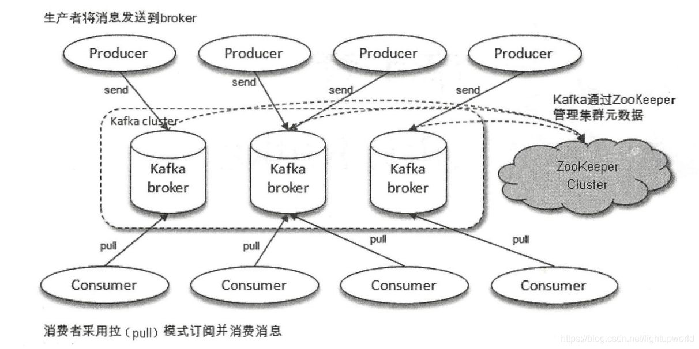
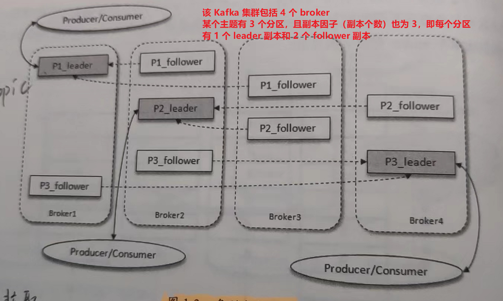
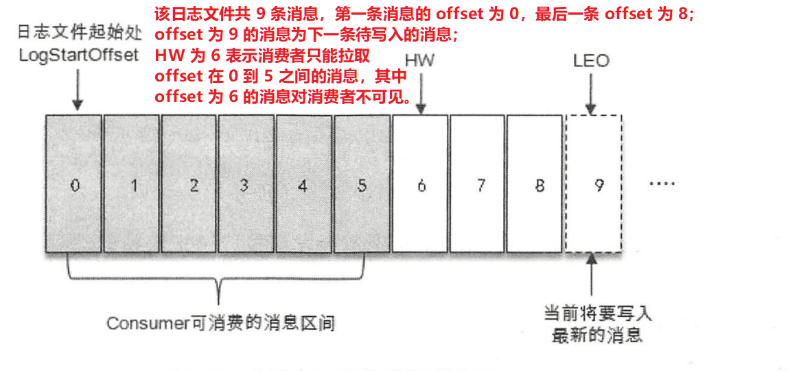
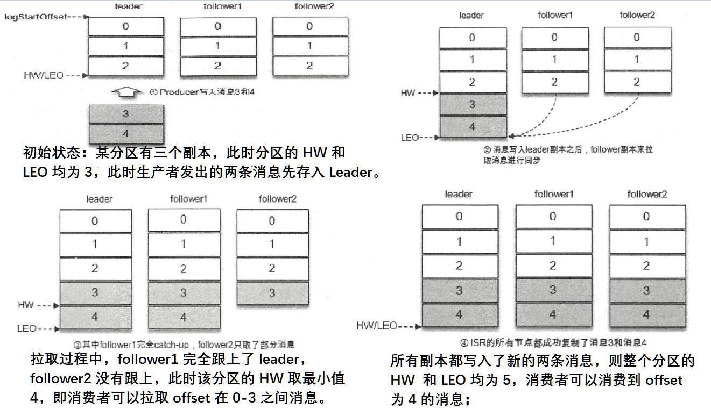

# 一、初识 Kafka

Kafka 定位为一个分布式流式处理平台，特点是：**高吞吐、可持久化、可水平扩展、支持流数据处理**。

Kafka 主要「扮演」的三大角色：

- 消息系统

  具备消息系统的解耦、冗余存储、流量削峰、缓冲、异步通信、扩展性、可恢复性等功能。同时 Kafka 还提供了大多数消息系统难以实现的**消息顺序性保障及回溯消费**的功能。

- 存储系统

  Kafka 把消息持久化到磁盘，相比于其他基于内存存储的系统而言，有效地降低了数据丢失的风险。

- 流式处理平台

  Kafka 不仅为每个流行的流式处理框架提供了可靠的数据来源，还提供了一个完整的流式处理类库，比如窗口、连接、变换和聚合等各类操作。

## （一）基本概念

一个 Kafka 体系架构包括若干 Producer、若干 Broker、若干 Consumer，以及一个 ZooKeeper 集群。

- ZooKeeper 是 Kafka 用来负责集群元数据的管理、控制器的选举等操作的。
- Producer 将消息发送到 Broker；
- Broker 是服务代理节点，Broker 可以简单看做一个独立的 kafka 节点/服务实例，如果 Kafka 服务器上只部署了一个 Kafka 实例，则可以将 Broker 看成一台 Kafka 服务器，一个或多个 Broker 组成了一个 Kafka 集群，其负责将收到的消息存储到磁盘中；
- Consumer 负责从 Broker 订阅并消费消息。



### 1.主题与分区

Kafka 中的消息以主题（Topic）为单位进行归类，生产者负责将消息发送到特定的主题，而消费者负责订阅主题并进行消费。

主题是一个逻辑上的概念，它还可以细分为多个分区（Partition），一个分区只属于单个主题。

同一主题下的不同分区包含的消息是不同的，**分区在存储层面可以看作一个可追加的日志（Log）文件**，消息在被追加到分区日志文件的时候都会分配一个特定的偏移量（offset）。**offset 是消息在分区中的唯一标识，Kafka 通过它来保证消息在分区内的顺序性，不过 offset 并不跨越分区，即 Kafka 保证的是分区有序而不是主题有序。**

Kafka 中的分区可以分布在不同的服务器（broker）上，即一个主题可以横跨多个 broker，以此来提供比单个 broker 更强大的性能。

每条消息被发送到 broker 之前，会根据分区规则选择存储到哪个具体的分区。如果分区规则设定得合理，所有的消息都可以均匀地分配到不同的分区中。并且可以通过增加分区来实现水平拓展。

Kafka 为分区引入了多副本（Replica）机制，通过增加副本数量可以提升容灾能力。同一分区的不同副本中保存的是相同的消息（在同一时刻，副本之间并非完全一样），副本之间是「一主多从」的关系，其中 leader 副本负责处理读写请求，follower 副本只负责与 leader 副本的消息同步。且副本处于不同 broker 中，当 leader 副本出现问题，则从 follower 副本中选举新的 leader 提供服务。通过多副本实现故障的自动转移，即当集群中某个 broker 失效但是保证服务可用。



Kafka 消费端也具备一定的容灾能力。Consumer 使用拉（Pull）模式从服务端拉取消息，并且保存消费的具体位置，当消费者宕机后恢复上线时可以根据之前保存的消费位置重新拉取需要的消息进行消费，从而不会造成消息丢失。

分区中的所有副本统称为 **AR**（Assigned Replicas）。所有与 leader 副本保持一定程度同步的副本（包括 leader 副本在内）组成 ISR（In-SyncReplicas），ISR 集合是 AR 集合中的一个子集。与 leader 副本同步滞后过多的副本（不包括leader副本）组成 OSR（Out-of-Sync Replicas），由此可见，AR=ISR+OSR。

> 正常所有 follower 都应该和 leader 保持一定程度的同步，即 AR = ISR。

leader 副本负责维护和跟踪 ISR 集合中所有 follower 副本的滞后状态，当 follower 副本落后太多或失效时，leader副本会把它从 ISR 集合中剔除。如果 OSR 集合中有 follower 副本“追上”了 leader 副本，那么 leader 副本会把它从 OSR 集合转移至 ISR 集合。默认情况下，当 leader 副本发生故障时，只有在 ISR 集合中的副本才有资格被选举为新的leader，而在 OSR 集合中的副本则没有任何机会。

ISR 与 HW 和 LEO 也有紧密的关系。HW（High Watermark，高水位）标识了一个特定的消息偏移量（offset），消费者只能拉取到这个 offset 之前的消息。



LEO（Log End Offset）标识当前日志文件中下一条待写入消息的 offset，LEO 等于当前日志分区中最后一条消息的 offset 值加一；

分区 ISR 集合中的每个副本都会维护自身的 LEO，而 **ISR 集合中最小的 LEO 即为分区的 HW**，对消费者而言只能消费 HW 之前的消息。



## （二）安装与配置

因为 Kafka 和 ZooKeeper 都是运行在 JVM 上的服务，因此需要首先安装 JDK。

Kafka 通过 ZooKeeper 来实施对元数据信息的管理，包括集群、broker、主题、分区等内容。

ZooKeeper是一个开源的分布式协调服务，是Google Chubby的一个开源实现。分布式应用程序可以基于 ZooKeeper 实现诸如数据发布/订阅、负载均衡、命名服务、分布式协调/通知、集群管理、Master 选举、配置维护等功能。在 ZooKeeper 中共有 3 个角色：leader、follower 和 observer，同一时刻 ZooKeeper 集群中只会有一个 leader，其他的都是follower 和 observer。observer 不参与投票，默认情况下 ZooKeeper 中只有 leader 和 follower 两个角色。

## （三）生产与消费

系统中的相关配置详见：kafka 安装目录下的 README.md

### 创建 Topic 

生产者将消息发送到 Kafka 的 Topic 中（Topic 的主题）中，消费者也通过 Topic 消费消息；可以直接使用 kafka 安装目录的 bin 目录下脚本工具创建：

创建格式详解：

`--zookeeper`：指定了 Kafka 所连接的 ZooKeeper 服务地址；

`--topic`：指定要创建的主题名称；

`--replication-factor`：指定了副本因子；

`--partitions`：指定了分区个数；

`--create`：为创建主题的动作；

```shell
## 老版本创建方式
bin/kafka-topic.sh --zookeeper localhost:2181 --create --topic topic-demo --replication-factor 3 --partitions 4
# 新版本创建方式

```

> 需要首先将 kafka 的 server.properties 中的 num.partitions 的值调大，否则会抛出异常：
>
>  Error processing create topic request CreatableTopic(name='t
> opic-demo', numPartitions=4, replicationFactor=3, assignments=[], configs=[]) (kafka.server.ZkAdminManager)
> org.apache.kafka.common.errors.InvalidReplicationFactorException: Replication factor: 3 larger than available brokers: 1


## 1.4 服务端参数配置

Kafka 服务端（broker）还有很多参数配置，涉及使用、调优的各个方面，虽然这些参数在大多数情况下不需要更改，但了解这些参数，以及在特殊应用需求的情况下进行有针对性的调优，可以更好地利用 Kafka为我们工作。以下配置均在 `server.properties` 中

**1.zookeeper.connect**

该参数指明 broker 要连接的 ZooKeeper 集群的服务地址（包含端口号），没有默认值，且此参数为必填项。如果 Zookeeper 集群中有多个节点，则使用逗号隔开，例如：`localhost1:2181,localhost2:2181`，最好是新加一个 [chroot](https://blog.csdn.net/zhaominyong/article/details/118219798) 路径（类似于 `localhost1:2181,localhost2:2181/kafka`），即可以明确该 chroot 路径下的节点是给 kafka 用的，同时实现多个 kafka 集群复用一套 zookeeper 集群，如果不指定则默认使用 zookeeper 的根路径。

**2.listeners**

该参数指明 broker 监听客户端连接的地址列表，即为客户端要连接 broker 的入口地址列表，默认为 NULL，格式为：`协议类型（支持 PLAINTEXT/SSL/SASL_SSL）://主机名:服务端口`，例如：`PLAINTEXT://198.162.0.2:9092`，多个则使用逗号隔开。

主机名不指定则表示绑定默认网卡，因此最好不要为空，如果绑定到 127.0.0.1 则无法对外提供服务，如果绑定到 0.0.0.0 则表示绑定所有的网卡。

该参数类似于 advertised.listeners，区别在于否则主要用于 IaaS 环境，如公用云会配备包含私有网卡和公有网卡等多块网卡，此时可以将前者参数来绑定私网 IP 地址供 broker 间通信使用，否则绑定公网 IP 供外部客户端使用。

**3.broker.id**

该参数用来指定 Kafka 集群中 broker 的唯一标识，默认值为 -1(新版默认为 0)。

> 和 meta.properties 文件以及服务端参数 broker.id.generation.enable 和 reserved.broker.max.id 相关。

**4.log.dir 和 log.dirs**

Kafka 把所有的消息都保存在磁盘上，而这两个参数用来配置 Kafka 日志文件存放的根目录。

两者都可以用于配置单个或者多个根目录（逗号分隔），两者如果都有值则 log.dirs 比 log.dir 优先级高。

**5.message.max.bytes**

该参数用来指定 broker 所能接收消息的最大值，默认值为 1000012（B），约等于 976.6KB。如果 Producer 发送的消息大于这个参数所设置的值，那么（Producer）就会报出 RecordTooLargeException 的异常。

> 如果修改，需要考虑 max.request.size（客户端参数）/max.message.bytes（topic 端参数）之间的关系；