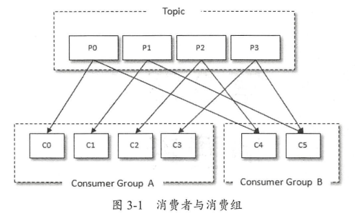
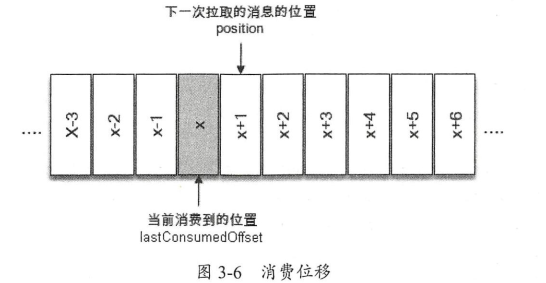
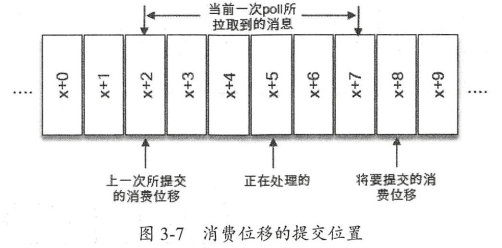
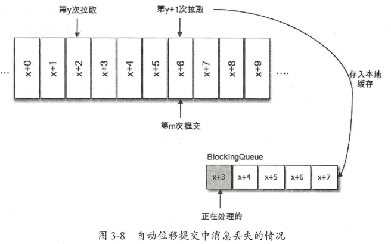

# 消费者

## 一、消费者与消费组

消费者（Consumer）负责订阅 Kafka 中的主题（Topic），并且从订阅的主题上拉取消息。

在 Kafka 的消费理念中还有一层**消费组**（Consumer Group）的概念，每个消费者都有一个对应的消费组。当消息发布到主题后，只会被投递给订阅它的每个消费组中的一个消费者。

> 同一个消费者组中的 consumer 的 group.id 是一样的；

如图所示，某个主题中共有 4 个分区（Partition）：P0、P1、P2、P3。有两个消费组 A 和 B 都订阅了这个主题，消费组 A 中有 4 个消费者（C0、C1、C2 和 C3），消费组 B 中有 2 个消费者（C4 和 C5）。按照 Kafka 默认的规则，最后的分配结果是消费组 A 中的每一个消费者分配到 1 个分区，消费组 B 中的每一个消费者分配到 2 个分区，两个消费组之间互不影响。每个消费者只能消费所分配到的分区中的消息。**换言之**，每一个分区只能被一个消费组中的一个消费者所消费。



消费者与消费组这种模型可以让整体的消费能力具备横向伸缩性，可以通过增加（或减少）消费者的个数来提高（或降低）整体的消费能力。**但是如果分区固定，当消费者个数超过分区数则会导致部分消费者分配不到任何分区从而无法消费任何消息。**

可以通过消费者客户端参数 `partition.assignment.strategy` 来设置消费者与订阅主题之间的**分区分配策略**。该值内置有两个值：

```json
## 轮询策略  RoundRabin
partition.assignment.strategy=org.apache.kafka.clients.consumer.RoundRobinAssignor
## 范围策略  Range
partition.assignment.strategy=org.apache.kafka.clients.consumer.RangeAssignor
```

> 说明：当出现下列情况时，kafka 会进行分区分配，称为重新平衡（rebalance）；
>
> - 同一个 Comsumer Group 中新增消费者，或者消费者离开当前所属的 Consumer Group,包括 shuts down 或者 crashes；
> - 订阅的主题新增分区；

详细的分区分配策略示例详见 [^1]

Kafka 支持点对点（P2P，Point-to-Point）模式和发布/订阅（Pub/Sub）模式。

- 点对点模式是基于队列的，消息发布者发送消息到队列，消息消费者从队列中接收消息；
- 发布/订阅模式：定义了如何向一个内容节点（即 Topic）发布和订阅消息，主题是消息传递的中介，使得消息的订阅者和发布者互相独立，该模式在消息的一对多广播时采用。

**如果所有消费者都是属于同一个消费组，则所有消息都会均衡的投递给每一个消费者，即每条消息只会被一个消费者处理，相当于点对点模式。如果不属于同一个消费组，则所有消息都会被广播给所有的消费者，即每条消息会被所有的消费者处理，相当于发布/订阅模式。**

消费组是逻辑上概念，每个消费组由固定的名称，消费者在消费前需要指定其所属消费组的名称（可以通过消费者客户端参数 group.id 配置，默认值为空字符串）。

**消费者是实际的应用实例，非逻辑上概念，其可以是一个线程或者一个进程，同一个消费组内的消费者可以部署在同一台/不同的机器上。**

## 二、客户端开发

一个正常的消费逻辑需要具备以下几个步骤：

1. 配置消费者客户端参数及创建相应的消费者实例。
2. 订阅主题。
3. 拉取消息并消费。
4. 提交消费位移。
5. 关闭消费者实例。

```java
package com.gjxaiou.consumer;

import org.apache.kafka.clients.consumer.ConsumerRecord;
import org.apache.kafka.clients.consumer.ConsumerRecords;
import org.apache.kafka.clients.consumer.KafkaConsumer;
import org.apache.kafka.common.serialization.StringDeserializer;

import java.util.Arrays;
import java.util.Properties;
import java.util.concurrent.atomic.AtomicBoolean;

public class KafkaConsumerAnalysis {
    public static final String brokerList = "localhost:9092";
    public static final String topic = "topic-demo";
    public static final String groupId = "group.demo";
    public static final AtomicBoolean isRunning = new AtomicBoolean(true);

    public static Properties initConfig(){
        Properties properties = new Properties();
        properties.put("key.deserializer", StringDeserializer.class.getName());
        properties.put("value.deserializer",StringDeserializer.class.getName());
        properties.put("bootstrap.servers",brokerList);
        properties.put("group.id",groupId);
        // 该参数用于设定 KafkaConsumer 对应的客户端 Id，默认值为“”，如果不设置会自动设置为 “consumer-数字” 格式
        properties.put("client.id","consumer.client.id.demo");
        return properties;
    }

    public static void main(String[] args) {
        Properties properties = initConfig();
        KafkaConsumer<String, String> consumer = new KafkaConsumer<>(properties);
        consumer.subscribe(Arrays.asList(topic));

        try {
            while (isRunning.get()){
                ConsumerRecords<String, String> records = consumer.poll(1000);
                for (ConsumerRecord<String, String> record : records) {
                    System.out.println(record.topic() + record.key() + record.value() + record.partition() + record.offset());
                    // 处理 record 流程
                }
            }
        }catch (Exception e){
            System.out.println("发生异常" + e);
        }finally {
            consumer.close();
        }
    }
}
```

代码清单 3-1 消费者客户端示例

### （一）必要的参数配置

在 Kafka 消费者客户端 KafkaConsumer 中有 4 个参数是必填的。

- `bootstrap.servers`：该参数用来指定连接 Kafka 集群所需的 broker 地址清单，详见 KafkaProducer 中的该参数含义。
- `group.id`：消费者隶属的消费组的名称，默认值为“”，如果设置为空，则会报 InvalidGroupIdException 异常。
- `key.deserializer` 和 `value.deserializer`：消费者从 broker 端获取的消息格式都是字节数组（byte[]）类型，所以需要执行相应的反序列化操作才能还原成原有的对象格式，两参数无默认值，需要与序列化器进行对应。

### （二）订阅主题与分区

在创建好消费者之后，我们就需要为该消费者订阅相关的主题了。**一个消费者可以订阅一个或多个主题**。subscribe 的几个重载方法如下：

```java
void subscribe(Collection<String> topics);
void subscribe(Collection<String> topics, ConsumerRebalanceListener listener);
// ConsumerRebalanceListener 参数用于设置相应的再均衡监听器
void subscribe(Pattern pattern, ConsumerRebalanceListener listener);
// 使用正则的形式订阅特定模式的主题，如 consumer.subscribe(Pattern.compile("topic-.*"));
void subscribe(Pattern pattern);
```

如果前后两次订阅了不同的主题（即执行两次 subscribe 方法），那么消费者以最后一次的为准。

消费者 KafkaConsumer 不仅可以通过 `subscribe()` 方法订阅主题，还可以通过 `assign()` 方法直接订阅某些主题的特定分区：

```java
// 参数 partitions 用于指定需要订阅的分区集合
public void assign(Collection<TopicPartition> partitions);
```

TopicPartition 类用于在 Kafka 客户端中表示分区，其只有 2 个属性：topic 和 partition，分别代表分区所属的主题和自身的分区编号。如果我们事先并不知道主题中有多少个分区可以通过 KafkaConsumer 中的 `partitionsFor()` 方法来查询指定主题的元数据信息。

```java
 public List<PartitionInfo> partitionsFor(String topic)
```

返回的 PartitionInfo 即为主题的分区元数据信息

```java
public class PartitionInfo {
    // 主题名称
    private final String topic;
    // 分区编号
    private final int partition;
    // 分区中 leader 副本所在位置
    private final Node leader;
    // 分区的 AR 集合
    private final Node[] replicas;
    // 分区的 ISR 集合
    private final Node[] inSyncReplicas;
    // 分区的 OSR 集合
    private final Node[] offlineReplicas;
    // 省略其他构造方法等   
}
```

可以使用 KafkaConsumer 中的 `unsubscribe()` 方法来取消主题的订阅。如果将 `subscribe(Collection)` 或 `assign(Collection)` 中的集合参数设置为空集合，那么作用等同于 `unsubscribe()` 方法。

**通过 `subscribe()` 方法订阅主题具有消费者自动再均衡的功能，在多个消费者的情况下可以根据分区分配策略来自动分配各个消费者与分区的关系。即当消费组内增加/减少消费者时分区分配关系自动调整，从而实现消费负载均衡和故障自动转移。但是 `assign()` 方法不具备该功能**。

消费者可以用两种方式消费分区里面的数据：

1. **指定主题，不指定分区**：该主题下的所有分区的数据，订阅该主题的消费者都能消费到，但需要注意的是，不同分区之间的数据是不能保证消费顺序的
2. **指定主题，指定分区**：可以指定任意分区进行消费

### （三）反序列化

Kafka 所提供的反序列化器有 ByteBufferDeserializer、ByteArrayDeserializer、BytesDeserializer、String/Double/Float/Integer/Long/ShortDeserializer，它们分别用于 ByteBuffer、ByteArray、Bytes、String/Double/Float/Integer/Long/Short 类型的反序列化，这些序列化器也都实现了 org.apache.kafka.common.serialization.Deserializer 接口：

```java
public interface Deserializer<T> extends Closeable {
    // 用于配置当前类
    void configure(Map<String, ?> configs, boolean isKey);
    // 用来执行反序列化。如果 data 为 null，那么处理的时候直接返回 null 而不是抛出一个异常
    T deserialize(String topic, byte[] data);
    // 用来关闭当前序列化器
    void close();
}
```

下面实现了生产者自定义的序列化器对应的反序列化器：

```java
package com.gjxaiou.consumer;

import com.gjxaiou.produce.Company;
import org.apache.kafka.common.errors.SerializationException;
import org.apache.kafka.common.serialization.Deserializer;

import java.io.UnsupportedEncodingException;
import java.nio.ByteBuffer;
import java.nio.charset.StandardCharsets;
import java.util.Map;

public class CompanyDeserializer implements Deserializer<Company> {
    @Override
    public void configure(Map<String, ?> configs, boolean isKey) {

    }

    // 将字节数组转换为对应的 Company 对象
    @Override
    public Company deserialize(String topic, byte[] data) {
        if (data == null) {
            return null;
        }
        if (data.length < 8) {
            throw new SerializationException("接收到的长度不符合");
        }

        ByteBuffer buffer = ByteBuffer.wrap(data);
        int nameLen;
        int addressLen;
        String name;
        String address;
        nameLen = buffer.getInt();
        byte[] nameBytes = new byte[nameLen];
        buffer.get(nameBytes);
        addressLen = buffer.getInt();
        byte[] addressBytes = new byte[addressLen];
        buffer.get(addressBytes);

        name = new String(nameBytes, StandardCharsets.UTF_8);
        address = new String(addressBytes, StandardCharsets.UTF_8);
        return new Company(name, address);
    }

    @Override
    public void close() {

    }
}
```

使用的时候在 properties 中指定 `value.deserializer` 参数值为上述的自定义反序列化类的全限定性类名即可。

**但是自定义序列化和反序列化器使得 producer 和 consumer 过于耦合，上游使用这个序列化器，下游就得使用对应的反序列化器，同时上游类结构改变，下游也必须改变；因此实际使用中如果 Kafka 提供的序列化/反序列化器无法满足，则推荐使用 Avro/JSON/Thrift/ProtoBuf/Protostuff 等通用化的序列化工具。**

### （四）消息消费

**Kafka 中的消费是基于拉模式的**。Kafka 中的消息消费是一个不断轮询的过程，消费者所要做的就是重复地调用 `poll()` 方法，而 `poll()` 方法返回的是所订阅的主题（分区）上的一组消息。

```java
// 该方法在 2.0 版本之后过时，推荐使用下面 JDK8 中新增时间类型的参数方法
@Deprecated
public ConsumerRecords<K, V> poll(long timeoutMs); 
// timeout 超时参数用于控制 poll 方法的阻塞时间，在消费者的缓冲区中没有可用数据时会发生阻塞
// 单位为毫秒，可以通过 Duration 类中的 ofMillis()/ofSeconds() 等指定不同的时间单位；
public ConsumerRecords<K, V> poll(Duration timeout);
```

注意，timeout 的设置取决于应用程序对响应速度的要求，如需要在多长时间内将控制权移交给执行轮询的应用线程。如果该值为 0 则表示 `poll()` 方法不管是否已经拉取到消息都立刻返回。但是如果应用线程唯一工作就是从 kafka 中拉取并消费消息，则可以将该参数设置为最大值 Long.MAX_VALUE;

> 如果拉到数据的话 会立即放回；如果拉不到数据的话，poll 方法中指定的时间是最长的等待时间；
>
> 参数 `max.poll.records` 用于指定每一次 poll 方法调用拉取的最大消息条数，默认为 500

**问题**：如果没有拉取到 500 条，即没有这么多数据，是等待还是返回？ 如果超过 500 是只拉取 500？ 拉取是从每个分区逐个遍历拉取吗？

消费者消费到的每条消息的类型为 ConsumerRecord（对应于生产者发送的消息类型 ProducerRecord），具体的结构参考如下代码：

```java
public class ConsumerRecord<K, V> {
    public static final long NO_TIMESTAMP = -1L;
    public static final int NULL_SIZE = -1;
    public static final int NULL_CHECKSUM = -1;
    // 消息所属的主题
    private final String topic;
    // 消息所属的分区
    private final int partition;
    // 消息在所在分区的偏移量
    private final long offset;
    // 时间戳
    private final long timestamp;
    // 时间戳类型，分为 CreateTime（消息创建的时间戳）和 LogAppendTime（消息追加到日志的时间戳）
    private final TimestampType timestampType;
    // key 经过序列化之后的字节大小，如果 key 为空则该值为 -1
    private final int serializedKeySize;
    // value 经过序列化后的字节大小，如果 value 为空则值为 -1
    private final int serializedValueSize;
    // 消息头部
    private final Headers headers;
    // 消息的键
    private final K key;
    // 消息的值
    private final V value;
    private final Optional<Integer> leaderEpoch;
    // CRC32 的校验
    private volatile Long checksum;
    // 省略 getter/setter/construct 等
}
```

`poll()` 方法返回值类型 ConsumerRecords 表示一次性拉取操作所获得的消息集，内部包括多个 ConsumerRecord，同时可以使用其内部提供的 iterator() 方法进行遍历。

消费方式一：按照分区维度进行消费

ConsumerRecords 类中的 `records(TopicPartition)` 方法可以用于获取消息集中指定分区的消息。

```java
// 按照分区消费方式
ConsumerRecords<String, String> recordList = consumer.poll(Duration.ofSeconds(1000));
// 获取拉取的消息集中所有分区
Set<TopicPartition> partitions = recordList.partitions();
for (TopicPartition tp : partitions) {
    List<ConsumerRecord<String, String>> crList  = recordList.records(tp);
    for (ConsumerRecord<String, String> record : crList) {
        System.out.println(record.partition() + record.value());
    }
}
```

消费方式二：按照主题进行消费

因为 ConsumerRecords 类中没有直接获取拉取的消息集中所有包含的主题列表，所以只能根据消费者订阅主题时的列表来进行逻辑处理；

```java
// 按照主题来消费
ConsumerRecords<String, String> consumerRecords = consumer.poll(Duration.ofSeconds(1000));
for (String topic : Arrays.asList(topic)) {
    Iterable<ConsumerRecord<String, String>> records1 =
        consumerRecords.records(topic);
    for (ConsumerRecord<String, String> rec : records1) {
        System.out.println(rec.topic() + rec.value());
    }
}
```

`poll()` 方法不仅仅为拉取一下消息，其内部涉及消费位移、消费者协调器、组协调器、消费者选举、分区分配的分发、再均衡的逻辑、心跳等等。

### （五）位移提交

对于 Kafka 中的分区而言，它的每条消息都有唯一的 offset（偏移量），**用来表示消息在分区中对应的位置**。对于消费者而言，它也有一个 offset（位移）的概念，**消费者使用 offset 来表示消费到分区中某个消息所在的位置**。对于一条消息而言，它的偏移量和消费者消费它时的消费位移是相等的。

在旧消费者客户端中，消费位移是存储在 ZooKeeper 中的。而在新消费者客户端中，消费位移存储在 Kafka 内部的主题 `__consumer_offsets` 中。这里把将消费位移存储起来（持久化）的动作称为“提交”，**消费者在消费完消息之后需要执行消费位移的提交**。



**图中 x 表示某次拉取操作中此分区的最大偏移量，如果当前消费者消费了 X 位置的消息，则消费者的消费位移为 X，但是消费者需要提交的消费位移为 X + 1，即下一条需要拉取的消费的位置**。KafkaConsumer 类中提供了两个方法获取以上两个位置：

```java
// 获取 position 位置
public long position(TopicPartition partition);
// 获取 committed offset 位置
 @Deprecated
public OffsetAndMetadata committed(TopicPartition partition)
```

示例：向某主题中分区编号为 0 的分区发送若干消息，然后一个消费者消费，消费完之后同步提交消费位移（调用 commitSync()）最终观察各个值的大小。

===缺少书上 P64 页代码==

位移提交时机很重要，否则会造成重复消费和消息丢失。例如当前一次 `poll()` 操作拉取的消息集为 [x+2,x+7]，其中 x+2 表示上一次提交的消费位移（即已经完成包括 x+1 在内与之前的所有消息的消费），x+5 表示当前正在处理的而为之，**如果拉取到消息就进行位移提交**，即提交了 x+8，但是当消费到 x+5 的时候发生异常进行故障恢复，则重新拉取的消息从 x+8 开始，导致部分消息丢失未消费。**如果消费完所有拉取到的消息之后才进行位移提交**，则同样发生故障之后，重新拉取是从 x+2 开始，即部分消息会重复消费。



在 Kafka 中默认的消费位移的提交方式是自动提交，这个由消费者客户端参数 `enable.auto.commit` 配置，默认值为 true。该自动提交是定期提交，定期的周期时间由 `auto.commit.interval.ms` 设置（默认为 5s）。即默认情况下，消费者每隔 5s 会将拉取到的每个分区中最大的消息位移进行提交。自动位移提交的动作是在 `poll()` 方法中完成，在每次真正向服务端发起拉取请求之前会检查是否可以进行位移提交，如果可以则提交上一次轮询的位移。

**自动提交问题**

- 重复消费：即刚刚提交完一次消费位移，然后拉取一批消息进行消费，在下一次自动提交消费位移之前消费者崩溃了，就得从上一次位移提交的地方重新开始消费。可以通过减少位移提交的时间间隔来减少重复消息的窗口大小；

- 消息丢失：拉取线程 A 不断拉取消息并存入本地缓存（如 BlockingQuere），另一个线程 B 从缓存中读取消息并进行逻辑处理。假设目前进行到了第 y+1 次拉取，以及第 m 次位移提交的时候，即 x+6 之前的位移已经确认提交了，但是线程 B 还在消费 x+3 的消息，此时如果处理线程 B 发生异常，等恢复之后会从第 m 次位移提交（即 x+6 开始拉取消息），就导致了消息丢失。

  

  **手动位移提交**
  自动位移提交无法做到精确的位移管理，如果先等拉取到的消息进行了一系列逻辑处理之后才认为成功消费，这时候可以将参数 `enable.auto.commit` 设置为 false 即可。同时手动提交分为同步提交和异步提交，分别对应 KafkaConsumer 的 `commitSync()` 和 `conmitAsync()` 方法。

  ```java
  // 其他部分参考上述的 consumer 即可
  public static void main(String[] args) {
      Properties properties = initConfig();
      KafkaConsumer<String, String> consumer = new KafkaConsumer<>(properties);
      consumer.subscribe(Arrays.asList(topic));
      while (isRunning.get()) {
          ConsumerRecords<String, String> records = consumer.poll(Duration.ofSeconds(1000));
          for (ConsumerRecord<String, String> record : records) {
              // 逻辑处理
          }
          // 批量同步提交
          consumer.commitSync();
      }
  }
  ```

  上述也可以将 record 保存下来然后批量处理，最后批量同步提交。但是两种方式都可能出现重复提交，即业务逻辑处理完到同步位移提交前程序崩溃，则恢复之后只能从上一次位移提交的地方拉取消息，导致重复消费。

  `commitSync()` 方法会根据 `poll()` 方法拉取的最新位移来进行提交（提交的值即为 position 位置），只要没有发生不可恢复的错误，就会阻塞消费者线程直至位移提交完成。
  
  该无参方法的提交消费位移的频率和拉取批次消息、处理批次消息的频率一致。即只能提交当前消费批次对应的 position 值，如果需要提交一个中间值，如业务每消费一条消息就提交一次消息可以使用下面方式：
  
  ```java
  // offsets 用于提交指定分区的位移    
  public void commitSync(Map<TopicPartition, OffsetAndMetadata> offsets);
  ```
  
  ```java
  public static void main(String[] args) {
      Properties properties = initConfig();
      KafkaConsumer<String, String> consumer = new KafkaConsumer<>(properties);
      consumer.subscribe(Arrays.asList(topic));
      while (isRunning.get()) {
          ConsumerRecords<String, String> records = consumer.poll(Duration.ofSeconds(1000));
          for (ConsumerRecord<String, String> record : records) {
              TopicPartition partition = new TopicPartition(record.topic(),
                                                            record.partition());
              // commitSync() 本身为同步执行，所以消耗性能，这种方式不常使用
              consumer.commitSync(Collections.singletonMap(partition,
                                                           new OffsetAndMetadata(record.offset() + 1)));
          }
      }
  }
  ```
  
  通常可以按照分区的粒度划分提交位移的界限，例如：
  
  ```java
  public static void main(String[] args) {
      Properties properties = initConfig();
      KafkaConsumer<String, String> consumer = new KafkaConsumer<>(properties);
      consumer.subscribe(Arrays.asList(topic));
      while (isRunning.get()) {
          ConsumerRecords<String, String> records = consumer.poll(Duration.ofSeconds(1000));
          for (TopicPartition partition : records.partitions()) {
              List<ConsumerRecord<String, String>> partitionRecords = records.records(partition);
              for (ConsumerRecord<String, String> partitionRecord : partitionRecords) {
                  // 逻辑处理
              }
              long lastConsumerOffset =
                  partitionRecords.get(partitionRecords.size() - 1).offset();
              consumer.commitSync(Collections.singletonMap(partition,
                                                           new OffsetAndMetadata(lastConsumerOffset + 1)));
          }
      }
  }
  ```
  
  异步提交（commitAsync())在执行的时候消费者线程不会被阻塞，可能在提交消费位移的结果还没有返回之前就开始新一次的拉取操作，从而提升消费者性能。
  
  ```java
  public void commitAsync();
  // callback 提供了一个异步提交的回调返回，位移提交完成之后会回调 OffsetCommitCallback 中的 onComplete() 方法
  public void commitAsync(OffsetCommitCallback callback);
  
  public void commitAsync(Map<TopicPartition, OffsetAndMetadata> offsets, OffsetCommitCallback callback);
  ```
  
  示例：
  
  ```java
  public static void main(String[] args) {
      Properties properties = initConfig();
      KafkaConsumer<String, String> consumer = new KafkaConsumer<>(properties);
      consumer.subscribe(Arrays.asList(topic));
  
      while (isRunning.get()){
          ConsumerRecords<String, String> records = consumer.poll(Duration.ofSeconds(1000));
          for (ConsumerRecord<String, String> record : records) {
              System.out.println(record.topic() + record.key() + record.value() + record.partition() + record.offset());
              // 处理 record 流程
          }
  
          consumer.commitAsync(new OffsetCommitCallback() {
              @Override
              public void onComplete(Map<TopicPartition, OffsetAndMetadata> offsets,
                                     Exception e) {
                  if (e == null){
                      System.out.println(offsets);
                  }else {
                      System.out.println("has exception");
                  }
              }
          });
      }
  }
  ```
  
  如果 `commitAsync()` 提交时候发生异常，如果使用重试可能导致重复消费，如某次异步提交的消费位移 x 但是失败了，下次有异步提交了消费位移 x + y，然后 x 的重试成功了，则恢复之后消费者就会从 x 开始消费。
  
  解决方式：设置一个递增的序号来维护异步提交的顺序，每次位移提交都更新该值，则如果失败需要重试的时候如果要提交的位移值小于该序号，则说明更大的位移以及提交，不用重试了。否则重试。
  
  但是重试会增加代码逻辑复杂度，不重试会增加重复消费概率，如果消费者异常退出，则重复消费问题难以避免，因为这种情况下是无法及时提交消费位移的。但是如果消费者正常退出或者发生再均衡，则可以在这两种操作之前使用同步方式进行兜底。一般提交失败很少发生，不重试没问题，因为后面的提交也会成功。
  
  ```java
  public static void main(String[] args) {
      Properties properties = initConfig();
      KafkaConsumer<String, String> consumer = new KafkaConsumer<>(properties);
      consumer.subscribe(Arrays.asList(topic));
  
      try{
          while (isRunning.get()){
              ConsumerRecords<String, String> records = consumer.poll(Duration.ofSeconds(1000));
              for (ConsumerRecord<String, String> record : records) {
                  System.out.println(record.topic() + record.key() + record.value() + record.partition() + record.offset());
                  // 处理 record 流程
              }
  
              consumer.commitAsync();
          }
      }finally{
          try{
              // 同步方式提交兜底
              consumer.commitSync();
          }finally{
              consumer.close();
          }
      }
  }
  ```

###  （六）控制或关闭消费

KafkaConsumer 中使用 `pause()` 和 `resume()` 方法来分别实现暂停某些分区在拉取操作时返回数据给客户端和恢复某些分区向客户端返回数据的操作，从而实现对消费速度的控制。

```java
public void pause(Collection<TopicPartition> partitions);
public void resume(Collection<TopicPartition> partitions);
// 该方法返回被暂停的分区集合
public Set<TopicPartition> paused();
```

之前的示例展示的都是使用一个 while 循环来包裹住 `poll()` 方法及相应的消费逻辑，如何优雅地退出这个循环也很有考究。细心的读者可能注意到有些示例代码并不是以 while（true）的形式做简单的包裹，而是使用 `while(isRunning.get())` 的方式，这样可以通过在其他地方设定 `isRunning.set(false)` 来退出 while 循环。**还有一种方式是调用 KafkaConsumer 的 `wakeup()` 方法，其是 KafkaConsumer 中唯一可以从其他线程里安全调用的方法**（KafkaConsumer 是非线程安全的，可以通过（十）了解更多细节），调用 `wakeup()` 方法后可以退出 `poll()` 的逻辑，并抛出 WakeupException 的异常，我们也不需要处理 WakeupException 的异常，它只是一种跳出循环的方式。

**跳出循环以后一定要显式地执行关闭动作（调用 close() 方法）以释放运行过程中占用的各种系统资源，包括内存资源、Socket 连接等。**

```java
// 无参数，默认最长等待时间为 30s
public void close() {
    this.close(Duration.ofMillis(30000L));
}

// 有参数，可以指定超时时间
public void close(Duration timeout);

// 已经废弃
@Deprecated
public void close(long timeout, TimeUnit timeUnit) ;
```

### （七）指定位移消费

当一个新的消费组建立的时候，它根本没有可以查找的消费位移。或者消费组内的一个新消费者订阅了一个新的主题，它也没有可以查找的消费位移。当 `__consumer_offsets` 主题中有关这个消费组的位移信息过期而被删除后，它也没有可以查找的消费位移。在 Kafka 中每当消费者查找不到所记录的消费位移时，就会根据消费者客户端参数 `auto.offset.reset` 的配置（默认值为：`latest`,表示从分区末尾开始消费消息）来决定从何处开始进行消费。如果将该参数配置为 `earliest`，那么消费者会从起始处，也就是 0 开始消费。如果找不到消费位移并且该参数配置为 `none` 则会直接抛出 NoOffsetForPartitionException 异常。

同时当位移越界的时候，也会执行该参数，详见 seek 系统方法；

> 默认的 `latest` 配置即表示从分区末尾开始消费消息，即从图中的 9 开始进行消费（9 为下一条要写入消息的位置），确切为从 9 开始拉取消息。


因为 `poll()` 方法负责消息的拉取，是一个黑盒，开发人员无法精确掌握其消费的起始位置。上述的参数也是只有在找不到消费位移或者位移越界时候才可使用。我们需要一种更细粒度的掌控，可以让我们从特定的位移处开始拉取消息，而 KafkaConsumer 中的 `seek()` 方法提供了追前消费或者回溯消费能力。

```java
// partition 表示分区，offset 用于指定从分区的哪个位置开始消费
public void seek(TopicPartition partition, long offset);
```

注意：`seek()` 方法只能重置消费者分配到的分区的消费位置，而分区的分配是在 `poll()` 方法的调用过程中实现，因此执行 `seek()` 方法前应该先执行 `poll()` 方法，等分配分区之后才能重置消费位置。

```java
public static void main(String[] args) {
    Properties properties = initConfig();
    KafkaConsumer<String, String> consumer = new KafkaConsumer<>(properties);
    consumer.subscribe(Arrays.asList(topic));
    // 这里的 1000 不能设置为 0，因为如果为 0 则 poll() 方法立刻返回，其内部进行分区分配的逻辑就来不及实施，导致分配到空列表
    consumer.poll(Duration.ofMillis(1000));
    // 获取消费者所分配到的分区信息
    Set<TopicPartition> assignment = consumer.assignment();
    for (TopicPartition tp : assignment) {
        // 设置每个分区的消费位置为 10
        consumer.seek(tp, 10);
    }
    while (true) {
        ConsumerRecords<String, String> records = consumer.poll(Duration.ofMillis(1000));
        // 消费 records
    }
}
```

但是因为 `poll()` 方法中的值太短会导致分配分区动作失败，太长则造成不必要的等待，所以常见使用方式如下：

```java
public static void main2(String[] args) {
    Properties properties = initConfig();
    KafkaConsumer<String, String> consumer = new KafkaConsumer<>(properties);
    consumer.subscribe(Arrays.asList(topic));

    Set<TopicPartition> assignmentSet = new HashSet<>();
    // 如果不为 0 则表示已经成功分配到分区
    while (assignmentSet.size() == 0) {
        consumer.poll(Duration.ofMillis(1000));
        // 获取消费者所分配到的分区信息
        assignmentSet = consumer.assignment();
    }

    for (TopicPartition tp : assignmentSet) {
        // 设置每个分区的消费位置为 10
        consumer.seek(tp, 10);
    }
    while (true) {
        ConsumerRecords<String, String> records = consumer.poll(Duration.ofMillis(1000));
        // 消费 records
    }
}
```

如果消费组内的消费者在启动的时候能找到消费位移，则除非发生位移越界，否则上述的参数不会奏效，此时如果先指定从头或末尾开始消费，则需要使用 `seek()` 方法。

```java
public static void main3(String[] args) {
    Properties properties = initConfig();
    KafkaConsumer<String, String> consumer = new KafkaConsumer<>(properties);
    consumer.subscribe(Arrays.asList(topic));

    Set<TopicPartition> assignmentSet = new HashSet<>();

    while (assignmentSet.size() == 0) {
        consumer.poll(Duration.ofMillis(1000));
        assignmentSet = consumer.assignment();
    }

    // endOffsets() 方法用于获取指定分区的末尾的消费位置
    Map<TopicPartition, Long> offsets = consumer.endOffsets(assignmentSet);
    for (TopicPartition tp : assignmentSet) {
        consumer.seek(tp, offsets.get(tp));
    }

    while (true) {
        ConsumerRecords<String, String> records = consumer.poll(Duration.ofMillis(1000));
        // 消费 records
    }
}
```

其中 `endOffsets()` 方法含义如下：

```java
public Map<TopicPartition, Long> endOffsets(Collection<TopicPartition> partitions);
// partitions 为分区集合，timeout 用于设置等待获取的超时时间，如果未设置，则为客户端参数 request.timeout.ms 参数设置（默认为 30000）
public Map<TopicPartition, Long> endOffsets(Collection<TopicPartition> partitions, Duration timeout);
```

对应的 `beginningOffsets()` 定义如下：

```java
public Map<TopicPartition, Long> beginningOffsets(Collection<TopicPartition> partitions);
public Map<TopicPartition, Long> beginningOffsets(Collection<TopicPartition> partitions, Duration timeout);
```

一个分区的起始位置最初为 0 但是并非每时每刻均为 0，因为日志清理的动作会清理旧的数据，所以分区的起始位置会自然的增加。

整合：上述的操作步骤可以使用 kafkaConsumer 中的 `seekToBeginning()` 和 `seekToEnd()` 来直接替代。

```java
public void seekToBeginning(Collection<TopicPartition> partitions);

public void seekToEnd(Collection<TopicPartition> partitions);
```

#### 从某个时间点开始消费

即如果不指定特定的消费位置，但是知道某个确定的时间点，从某个确定的时间点之后开始消费；

```java
public Map<TopicPartition, OffsetAndTimestamp> offsetsForTimes(Map<TopicPartition, Long> timestampsToSearch);
// timestampsToSearch 为 Map,key 为待查询的分区，value 为待查询的时间戳
// 该方法返回时间戳大于等于待查询时间的第一条消息对应的位置和时间戳
public Map<TopicPartition, OffsetAndTimestamp> offsetsForTimes(Map<TopicPartition, Long> timestampsToSearch, Duration timeout);
```

使用示例：

```java
public static void main4(String[] args) {
    Properties properties = initConfig();
    KafkaConsumer<String, String> consumer = new KafkaConsumer<>(properties);
    consumer.subscribe(Arrays.asList(topic));

    // assignmentSet 为消费者分配到的分区集合
    Set<TopicPartition> assignmentSet = new HashSet<>();

    while (assignmentSet.size() == 0) {
        consumer.poll(Duration.ofMillis(1000));
        assignmentSet = consumer.assignment();
    }


    Map<TopicPartition, Long> timestampToSearch = new HashMap<>();
    for (TopicPartition tp : assignmentSet) {
        timestampToSearch.put(tp, System.currentTimeMillis() - 1 * 24 * 3600 * 1000);
    }

    // 获取一天前的消息位置
    Map<TopicPartition, OffsetAndTimestamp> offsets =
        consumer.offsetsForTimes(timestampToSearch);

    for (TopicPartition tp : assignmentSet) {
        OffsetAndTimestamp offsetAndTimestamp = offsets.get(tp);
        if (offsetAndTimestamp != null) {
            // seek() 方法追溯到相应位置开始消费
            consumer.seek(tp, offsetAndTimestamp.offset());
        }
    }

    while (true) {
        ConsumerRecords<String, String> records = consumer.poll(Duration.ofMillis(1000));
        // 消费 records
    }
}
```

第五部分提到了 kafka 的消费位移存储在一个内部主题中，但是 seek() 方法可以突出该限制，即消费位移可以保存到任意存储介质中，如数据库等，然后下次消费时候可以读取存储的消费位移，然后通过 seek() 方法来指向该具体位置。即 seek() 方法提供了从特定位置读取消息的能力，可以向前跳过或者回溯若干消息。示例如下：

```java
public static void main(String[] args) {
    Properties properties = initConfig();
    KafkaConsumer<String, String> consumer = new KafkaConsumer<>(properties);
    consumer.subscribe(Arrays.asList(topic));

    // assignmentSet 为消费者分配到的分区集合
    Set<TopicPartition> assignmentSet = new HashSet<>();

    while (assignmentSet.size() == 0) {
        consumer.poll(Duration.ofMillis(1000));
        assignmentSet = consumer.assignment();
    }

    for (TopicPartition tp : assignmentSet) {
        // 从 DB 中读取消费位移
        long offset = getOffsetFromDB(tp);
        consumer.seek(tp, offset);
    }

    while (true) {
        ConsumerRecords<String, String> records = consumer.poll(Duration.ofMillis(1000));

        for (TopicPartition partition : records.partitions()) {
            List<ConsumerRecord<String, String>> partitionRecords = records.records(partition);
            for (ConsumerRecord<String, String> record : partitionRecords) {
                // 处理 record
            }

            long lastConsumedOffset =
                partitionRecords.get(partitionRecords.size() - 1).offset();
            // 将消费位移存储到 DB 中
            storedOffsetToDB(partition, lastConsumedOffset + 1);
        }
    }
}
```

### （八）再均衡

再均衡是指分区的所属权从一个消费者转移到另一消费者的行为，它为消费组具备高可用性和伸缩性提供保障，使我们可以既方便又安全地删除消费组内的消费者或往消费组内添加消费者。该操作应该尽量避免。

- 再均衡发生期间，消费组内的消费者是无法读取消息的。即这段时间内消费组会变得不可用。

- 当一个分区被重新分配给另一个消费者时，消费者当前的状态会丢失，如消费者消费完某个分区中的一部分消息时还没有来得及提交消费位移就发生再均衡，然后这个分区又被分配给消费组内的另一个消费者，则原来被消费完的那部分消息又被重新消费一遍，导致重复消费。

ConsumerRebalanceListener 接口，即再均衡监听器用来设定发生再均衡动作前后的一些准备或收尾的动作，通常用于 `subscribe()` 中：

```java
 public void subscribe(Collection<String> topics, ConsumerRebalanceListener listener);
public void subscribe(Pattern pattern, ConsumerRebalanceListener listener); 
```

该接口中主要方法包括两个：

```java
// 这个方法会在再均衡开始之前和消费者停止读取消息之后被调用。可以通过这个回调方法来处理消费位移的提交，以此来避免一些不必要的重复消费现象的发生。 partitions 表示再均衡前所分配到的分区
void onPartitionsRevoked(Collection＜TopicPartition＞partitions);

// 这个方法会在重新分配分区之后和消费者开始读取消费之前被调用。
void onPartitionsAssigned(Collection＜TopicPartition＞partitions);
```

使用示例：

```java
public static void main(String[] args) {
    Properties properties = initConfig();
    KafkaConsumer<String, String> consumer = new KafkaConsumer<>(properties);

    Map<TopicPartition, OffsetAndMetadata> currentOffsetMap = new HashMap<>();

    consumer.subscribe(Arrays.asList(topic), new ConsumerRebalanceListener() {
        @Override
        public void onPartitionsRevoked(Collection<TopicPartition> collection) {
            consumer.commitSync(currentOffsetMap);
            currentOffsetMap.clear();
        }

        @Override
        public void onPartitionsAssigned(Collection<TopicPartition> collection) {
            // do nothing
        }
    });

    try {
        while (isRunning.get()) {
            ConsumerRecords<String, String> records = consumer.poll(Duration.ofMillis(100));
            for (ConsumerRecord<String, String> record : records) {
                // 处理 record
                currentOffsetMap.put(new TopicPartition(record.topic(), record.partition()),
                                     new OffsetAndMetadata(record.offset() + 1));
            }
            consumer.commitAsync(currentOffsetMap, null);
        }
    } finally {
        consumer.close();
    }
}
```

将消费位移暂存到局部变量 currentOffsetMap 中，正常消费时候通过 commitAsync() 来异步提交消费位移，发生再均衡动作前可以通过再均衡监听器的 onPartitionsRevoked() 回调执行 commitSync() 方法同步提交消费位移，尽量避免了重复消费。

同时可以配合外部存储使用，即将消费位移保存到数据库中，然后可以通过再均衡监听器查找分配到的分区的消息位移。

```java
public static void main(){
    Properties properties = initConfig();
    KafkaConsumer<String,String> consumer = new KafkaConsumer<>(properties);
    consumer.subscribe(Arrays.asList(topic), new ConsumerRebalanceListener() {
        @Override
        public void onPartitionsRevoked(Collection<TopicPartition> partitions) {
            // 将 offset 存储到 DB 中
        }

        @Override
        public void onPartitionsAssigned(Collection<TopicPartition> partitions) {
            for (TopicPartition partition : partitions) {
                // 从 DB 中读取消费位移
                consumer.seek(partition,getOffsetFromDB(partition));
            }
        }
    });

}
```

### （九）消费者拦截器

消费者拦截器主要在消费到消息或在提交消费位移时进行一些定制化的操作。

消费者拦截器需要自定义实现 `org.apache.kafka.clients.consumer.ConsumerInterceptor` 接口，该接口包含 3 个方法：

```java
public ConsumerRecords＜K,V＞ onConsume(ConsumerRecords＜K,V＞records);
public void onCommit(Map＜TopicPartition,OffsetAndMetadata＞offsets);
public void close();
```

- KafkaConsumer 会在 `poll()` 方法返回之前调用拦截器的 `onConsume()` 方法来对消息进行相应的定制化操作。

  如修改返回的消息内容，按某规则过滤消息等，该方法如果抛出异常，会被捕获并记录日志，但不会继续向上传递；

- KafkaConsumer 会在提交完消费位移之后调用拦截器的 `onCommit()` 方法，可以使用这个方法来记录跟踪所提交的位移信息。

- `close()` 方法和 ConsumerInterceptor 的父接口中的 `configure()` 方法与生产者的 ProducerInterceptor 接口中的用途一样。

实现自定义拦截器之后，需要在 kafkaConsumer 中通过指定 `interceptor.classess`（默认为 “”）配置这个拦截器：

`properties.put(ConsumerConfig.INTERCEPTOR_CLASSES_CONFIG,XXXXIntecepror.class.getName())`

消费者拦截链和生产者一样，按照 `interceptor.classes` 配置的拦截器顺序逐次执行，如果某个拦截器失败，则下一个拦截器会接着上一个执行成功的拦截器继续执行。

### （十）多线程实现

KafkaProducer 是线程安全的，然而 KafkaConsumer 却是非线程安全的。

KafkaConsumer 中定义了一个 `acquire()` 方法，用来检测当前是否只有一个线程在操作，若有其他线程正在操作则会抛出 ConcurrentModifcationException 异常。

KafkaConsumer 中的每个公用方法在执行所要执行的动作之前都会调用这个 `acquire()` 方法，只有 `wakeup()` 方法是个例外。`acquire()` 方法的具体定义如下：

```java
private final AtomicLong currentThread = new AtomicLong(-1L);

private void acquire() {
    long threadId = Thread.currentThread().getId();
    if (threadId != this.currentThread.get() && !this.currentThread.compareAndSet(-1L, threadId)) {
        throw new ConcurrentModificationException("KafkaConsumer is not safe for multi-threaded access");
    } else {
        this.refcount.incrementAndGet();
    }
}
```

`acquire()` 方法和我们通常所说的锁（synchronized、Lock 等）不同，它不会造成阻塞等待，我们可以将其看作一个轻量级锁，它**仅通过线程操作计数标记的方式来检测线程是否发生了并发操作**，以此保证只有一个线程在操作。

`acquire()` 方法和 `release()` 方法成对出现，表示相应的加锁和解锁操作。同时两者都是私有方法，因此不需要我们显式调用。

```java
private void release() {
    if (this.refcount.decrementAndGet() == 0) {
        this.currentThread.set(-1L);
    }
}
```

但是仍然可以通过多线程的方式来实现消息消费，从而提高整体的消费能力；

多线程的实现方式有多种，**第一种**也是最常见的方式：线程封闭，即为每个线程实例化一个 KafkaConsumer 对象。第二种线程池。


**一个线程对应一个 KafkaConsumer 实例，称之为消费线程，一个消费线程可以消费一个或者多个分区中消息，所有的消费线程属于同一个消费组。这种实现方式的并发度受限于分区的实际个数，因为当消费线程的个数大于分区数时，则部分消费线程一直处于空闲状态。**

```java
// 该内部类表示消费线程
public static class KafkaConsumerThread extends Thread {
    // 内部包裹独立的 kafkaConsumer 实例
    private KafkaConsumer<String, String> kafkaConsumer;

    public KafkaConsumerThread(Properties properties, String topic) {
        this.kafkaConsumer = new KafkaConsumer<String, String>(properties);
        this.kafkaConsumer.subscribe(Arrays.asList(topic));
    }

    @Override
    public void run() {
        try {
            while(true) {
                ConsumerRecords<String, String> records =
                    kafkaConsumer.poll(Duration.ofMillis(100));
                for (ConsumerRecord<String, String> record : records) {
                    // 处理消息
                    // 如果处理快速则 poll() 拉取的速度也会块，从而提升整体消费性能，反之如果处理逻辑复杂，则消费性能下降。
                }
            }
        } catch (Exception e) {
            e.printStackTrace();
        } finally {
            kafkaConsumer.close();
        }
    }
}

public static void main(String[] args) {
    // 注意，这里的 initConfig() 增加以下的配置，表示具体实现没有考虑位移提交的情况
    // properties.put(ConsumerConfig.ENABLE_AUTO_COMMIT_CONFIG,true);
    Properties properties = initConfig();
    // 启动多线程消费，该数不超过该主题对应的分区数即可
    int consumerThreadNum = 4;
    for (int i = 0; i < consumerThreadNum; i++) {
        new KafkaConsumerThread(properties, topic).start();
    }
}
```

但是该种多线程实现方式和开启多个消费进程的方式没有本质区别，优点：每个线程可以按照顺序消费各个分区中消息，缺点：每个消费线程都要维护一个独立的 TCP 连接，如果分区数和 consumerThreadNum 都较大，则系统开销较大。

- 方式二：多个消费线程同时消费同一个分区

  通过 `assign()` 和 `seek()` 等实现，突破了消费线程的个数不能超过分区数的限制，但是该方式对位移提交和顺序控制的处理很复杂，实际很少使用，因为一般分区是消费线程的最小划分单位。

- 方式三：对方式一的修改，将处理消息模块修改为多线程实现方式

  

  ```java
  // 该内部类表示消费线程
  public static class KafkaConsumerThread extends Thread {
      // 内部包裹独立的 kafkaConsumer 实例
      private KafkaConsumer<String, String> kafkaConsumer;
      private ExecutorService executorService;
      private int threadNum;
  
      public KafkaConsumerThread(Properties properties, String topic, int threadNum) {
          this.kafkaConsumer = new KafkaConsumer<String, String>(properties);
          this.kafkaConsumer.subscribe(Arrays.asList(topic));
          this.threadNum = threadNum;
          // CallerRunsPolicy 可以防止线程池的总消费能力跟不上 poll() 拉取速度时候，导致异常发生
          executorService = new ThreadPoolExecutor(threadNum, threadNum, 0L, TimeUnit.MILLISECONDS, new ArrayBlockingQueue<>(1000), new ThreadPoolExecutor.CallerRunsPolicy());
      }
  
      @Override
      public void run() {
          try {
              while (true) {
                  ConsumerRecords<String, String> records =
                      kafkaConsumer.poll(Duration.ofMillis(100));
                  if (!records.isEmpty()) {
                      executorService.submit(new RecordsHandler(records));
                      // 这里可以添加具体的位移提交代码  ==》见下
                  }
              }
          } catch (Exception e) {
              e.printStackTrace();
          } finally {
              kafkaConsumer.close();
          }
      }
  }
  
  // 用来处理消息
  public static class RecordsHandler extends Thread {
      public final ConsumerRecords<String, String> records;
  
      public RecordsHandler(ConsumerRecords<String, String> records) {
          this.records = records;
      }
  
      @Override
      public void run() {
          // 处理 records
      }
  }
  
  public static void main(String[] args) {
      Properties properties = initConfig();
      KafkaConsumerThread kafkaConsumerThread = new KafkaConsumerThread(properties, topic, Runtime.getRuntime().availableProcessors());
      kafkaConsumerThread.start();
  }
  ```

  KafkaConsumerThread 类对应为消费线程，里面通过线程池方式调用 RecordHandler 处理一批批的消息，同时该方式还可以通过开启多个 KafkaConsumerThread 实例来实现横向拓展，从而提升整体的消费能力。

  同时该方式比第一种减少了 TCP 连接对系统资源的消耗，但是缺点是对消息的顺序处理较为困难。

  **位移提交**
  第一种方式如果要做具体的位移提交，见[位移提交](（五）位移提交)，第三种则需要引入一个共享变量 offsets 来参与提交。

  

  每个处理消息的 RecordHandler 类在处理完消息之后都将对应的消费位移保存到共享变量 offsets 中，KafkaConsumerThread 在每次 poll() 之后都会读取 offsets 中的内容并对其进行位移提交。示例如下：

  ```java
  // 首先在上述代码的补充处，添加以下代码
  synchronized(offsets){
      if(!offsets.isEmpty()){
          kafkaConsumer.commitSync(offsets);
      }
  }
  ```
  
其中 RecordHandler 类中 run() 方法重写为以下实现：
  ```java
  for(TopicPartition tp : records.partitions()){
      List<ConsumerRecord<String,String>> tpRecords = records.records(tp);
      // 处理 tpRecords
      long lastConsumerOffset = tpRecords.get(tpRecords.size() - 1).offset();
      synchronized(offsets){
          if(!offsets.containsKey(tp)){
              offsets.put(tp, new OffsetAndMetadata(lastConsumerOffset + 1));
          }else{
              long position = offsets.get(tp).offset();
              if(position < lastConsumerOffset + 1){
                  offsets.put(tp, new OffsetAndMetadata(lastConsumerOffset  + 1));
              }
          }
      }
  }
  ```
  
上述代码问题：正常执行没有问题，但是如果某处理线程 RecordHandler1 正在处理 offset 为 0-99 消息，但是另一个线程已经处理完 100-199 消息并进行了位移提交，但是第一个线程发生异常，导致后续消费只能从 200 开始消费，导致消息丢失。
  
 ==P91-92==

### （十一）重要的消费者参数

- **1-fetch.min.bytes**
  配置 Consumer 在一次拉取请求(调用 poll()方法)中能从[kafka](https://so.csdn.net/so/search?q=kafka&spm=1001.2101.3001.7020)中拉取的最小量，默认值 1B。如果返给 Consumer 的数据量小于该值则等待，直到满足这个参数。
  调大可以增加[吞吐量](https://so.csdn.net/so/search?q=吞吐量&spm=1001.2101.3001.7020)，但是会延迟。

  **2-fetch.max.bytes**
  配置 Consumer 在一次拉取中获取的最[大数据](https://so.csdn.net/so/search?q=大数据&spm=1001.2101.3001.7020)量，默认值 50M。
  若非空分区第一条消息大于设置值，也可以正常消费，kafka 接收消息的的最大值通过服务端 message.max.bytes 来设置。

  **3-fetch.max.wait.ms**
  指定 kafka 的等待时间，默认值是 500ms。
  如果一值不满足拉取数据最小量，则等待该设置时间返回，与延迟有关。

  **4-max.patition.fetch.bytes**
  配置每个分区返回给 Consumer 的最大数据量，默认值 1M。每次拉取消息分区的最大消息量。

  **5-max.poll.records**
  配置一次拉取请求中最大的消息数，默认 500 条。

  **6-connection.max.idle.ms**
  指定多久之后关闭闲置连接，默认 540000ms，即 9 分钟。

  **7-exclude.internal.topics**
  指定内部主题是否向消费者公开，默认 false。
  如果设置 true，只能用 subscribe(Collection)方式订阅内部主题。

  **8-receive.buffer.bytes**
  设置 Socket 接收消息缓冲区（SO_RECBUF）的大小，默认 65336B，64KB。
  设置为-1 则使用默认值。

  **9-send.buffer.bytes**
  设置 Socket 发送消息缓冲区（SO_SNDBUF），默认 131072B，即 128KB。

  **10-request.timeout.ms**
  设置 Consumer 等待请求相应的最长时间，默认 30000 ms。

  **11-metadata.max.age.ms**
  配置元数据过期时间，默认 3000 ms，即 5 分钟。

  **12-reconnect.backoff.ms**
  设置尝试重连主机之间的等待时间，默认 50 ms。

  **13-retry.backoff.ms**
  设置重新发送失败请求到指定主题分区的等待时间，默认 100 ms 。

  **14-isolation.level**
  设置消费者事务隔离级别。
  详细内容待补充。

- fetch.min.bytes

  该参数用来配置 Consumer 在一次拉取请求（调用 poll（）方法）中能从 Kafka 中拉取的最小数据量，默认值为 1（B）。Kafka 在收到 Consumer 的拉取请求时，如果返回给 Consumer 的数据量小于这个参数所配置的值，那么它就需要进行等待，直到数据量满足这个参数的配置大小。可以适当调大这个参数的值以提高一定的吞吐量，不过也会造成额外的延迟（latency），对于延迟敏感的应用可能就不可取了。

- fetch.max.bytes

  该参数与 fetch.max.bytes 参数对应，它用来配置 Consumer 在一次拉取请求中从 Kafka 中拉取的最大数据量，默认值为 52428800（B），也就是 50MB。如果这个参数设置的值比任何一条写入 Kafka 中的消息要小，那么会不会造成无法消费呢？很多资料对此参数的解读认为是无法消费的，比如一条消息的大小为 10B，而这个参数的值是 1（B），既然此参数设定的值是一次拉取请求中所能拉取的最大数据量，那么显然 1B＜10B，所以无法拉取。这个观点是错误的，该参数设定的不是绝对的最大值，如果在第一个非空分区中拉取的第一条消息大于该值，那么该消息将仍然返回，以确保消费者继续工作。也就是说，上面问题的答案是可以正常消费。与此相关的，Kafka 中所能接收的最大消息的大小通过服务端参数 message.max.bytes（对应于主题端参数 max.message.bytes）来设置。

- fetch.max.wait.ms

  这个参数也和 fetch.min.bytes 参数有关，如果 Kafka 仅仅参考 fetch.min.bytes 参数的要求，那么有可能会一直阻塞等待而无法发送响应给 Consumer，显然这是不合理的。fetch.max.wait.ms 参数用于指定 Kafka 的等待时间，默认值为 500（ms）。如果 Kafka 中没有足够多的消息而满足不了 fetch.min.bytes 参数的要求，那么最终会等待 500ms。这个参数的设定和 Consumer 与 Kafka 之间的延迟也有关系，如果业务应用对延迟敏感，那么可以适当调小这个参数。

- max.partition.fetch.bytes

  这个参数用来配置从每个分区里返回给 Consumer 的最大数据量，默认值为 1048576（B），即 1MB。这个参数与 fetch.max.bytes 参数相似，只不过前者用来限制一次拉取中每个分区的消息大小，而后者用来限制一次拉取中整体消息的大小。同样，如果这个参数设定的值比消息的大小要小，那么也不会造成无法消费，Kafka 为了保持消费逻辑的正常运转不会对此做强硬的限制。

- max.poll.records

  这个参数用来配置 Consumer 在一次拉取请求中拉取的最大消息数，默认值为 500（条）。如果消息的大小都比较小，则可以适当调大这个参数值来提升一定的消费速度。

- connections.max.idle.ms

  这个参数用来指定在多久之后关闭限制的连接，默认值是 540000（ms），即 9 分钟。

- exclude.internal.topics

  Kafka 中有两个内部的主题：__consumer_offsets 和__transaction_state。exclude.internal.topics 用来指定 Kafka 中的内部主题是否可以向消费者公开，默认值为 true。如果设置为 true，那么只能使用 subscribe（Collection）的方式而不能使用 subscribe（Pattern）的方式来订阅内部主题，设置为 false 则没有这个限制。

- receive.buffer.bytes

  这个参数用来设置 Socket 接收消息缓冲区（SO_RECBUF）的大小，默认值为 65536（B），即 64KB。如果设置为-1，则使用操作系统的默认值。如果 Consumer 与 Kafka 处于不同的机房，则可以适当调大这个参数值。

- send.buffer.bytes

  这个参数用来设置 Socket 发送消息缓冲区（SO_SNDBUF）的大小，默认值为 131072（B），即 128KB。与 receive.buffer.bytes 参数一样，如果设置为-1，则使用操作系统的默认值。

- request.timeout.ms

  这个参数用来配置 Consumer 等待请求响应的最长时间，默认值为 30000（ms）。

- session.timeout.ms：会话超时时间

- heartbeat.interval.ms  心跳时间，心跳时间间隔要小于 session.timeout.ms 的三分之一

- metadata.max.age.ms

  这个参数用来配置元数据的过期时间，默认值为 300000（ms），即 5 分钟。如果元数据在此参数所限定的时间范围内没有进行更新，则会被强制更新，即使没有任何分区变化或有新的 broker 加入。

- reconnect.backoff.ms

  这个参数用来配置尝试重新连接指定主机之前的等待时间（也称为退避时间），避免频繁地连接主机，默认值为 50（ms）。这种机制适用于消费者向 broker 发送的所有请求。

- retry.backoff.ms

  这个参数用来配置尝试重新发送失败的请求到指定的主题分区之前的等待（退避）时间，避免在某些故障情况下频繁地重复发送，默认值为 100（ms）。

- isolation.level

  这个参数用来配置消费者的事务隔离级别。字符串类型，有效值为“read_uncommitted”和“read_committed”，表示消费者所消费到的位置，如果设置为“read_committed”，那么消费者就会忽略事务未提交的消息，即只能消费到 LSO（LastStableOffset）的位置，默认情况下为“read_uncommitted”，即可以消费到 HW（High Watermark）处的位置。


## 补充

### （一）分区分配策略

[^1]:假设我们有个名为 T1 的主题，其包含了 10 个分区，然后我们有两个消费者（C1，C2）来消费这 10 个分区里面的数据，而且 C1 的 num.streams = 1，C2 的 num.streams = 2。

#### 1.Range strategy

Range 策略是对每个主题而言的，首先对同一个主题里面的分区按照序号进行排序，并对消费者按照字母顺序进行排序。该例子中排完序的分区将会是 0, 1, 2, 3, 4, 5, 6, 7, 8, 9；消费者线程排完序将会是 C1-0, C2-0, C2-1。然后将 partitions 的个数除于消费者线程的总数来决定每个消费者线程消费几个分区。如果除不尽，那么前面几个消费者线程将会多消费一个分区。该例子中我们有 10 个分区，3 个消费者线程，10 / 3 = 3，而且除不尽，那么消费者线程 C1-0 将会多消费一个分区，所以最后分区分配的结果看起来是这样的：

```bash
C1-0 将消费 0, 1, 2, 3 分区
C2-0 将消费 4, 5, 6 分区
C2-1 将消费 7, 8, 9 分区
```

假如我们有 11 个分区，那么最后分区分配的结果看起来是这样的：

```bash
C1-0 将消费 0, 1, 2, 3 分区
C2-0 将消费 4, 5, 6, 7 分区
C2-1 将消费 8, 9, 10 分区
```

假如我们有 2 个主题(T1 和 T2)，分别有 10 个分区，那么最后分区分配的结果看起来是这样的：

```bash
C1-0 将消费 T1主题的 0, 1, 2, 3 分区以及 T2主题的 0, 1, 2, 3分区
C2-0 将消费 T1主题的 4, 5, 6 分区以及 T2主题的 4, 5, 6分区
C2-1 将消费 T1主题的 7, 8, 9 分区以及 T2主题的 7, 8, 9分区
```

可以看出，C1-0 消费者线程比其他消费者线程多消费了 2 个分区，这就是 Range strategy 的一个很明显的弊端。

#### 2.RoundRobin strategy

使用 RoundRobin 策略有两个前提条件必须满足：

- 同一个 Consumer Group 里面的所有消费者的 num.streams 必须相等；
- 每个消费者订阅的 主题必须相同。

所以这里假设前面提到的 2 个消费者的 num.streams = 2。RoundRobin 策略的工作原理：将所有主题的分区组成 TopicAndPartition 列表，然后对 TopicAndPartition 列表按照 hashCode 进行排序，这里文字可能说不清，看下面的代码应该会明白：

```bash
val allTopicPartitions = ctx.partitionsForTopic.flatMap { case(topic, partitions) =>
  info("Consumer %s rebalancing the following partitions for topic %s: %s"
       .format(ctx.consumerId, topic, partitions))
  partitions.map(partition => {
    TopicAndPartition(topic, partition)
  })
}.toSeq.sortWith((topicPartition1, topicPartition2) => {
  /*
   * Randomize the order by taking the hashcode to reduce the likelihood of all partitions of a given topic ending
   * up on one consumer (if it has a high enough stream count).
   */
  topicPartition1.toString.hashCode < topicPartition2.toString.hashCode
})
```

最后按照 round-robin 风格将分区分别分配给不同的消费者线程。

在我们的例子里面，加入按照 hashCode 排序完的 topic-partitions 组依次为 T1-5, T1-3, T1-0, T1-8, T1-2, T1-1, T1-4, T1-7, T1-6, T1-9，我们的消费者线程排序为 C1-0, C1-1, C2-0, C2-1，最后分区分配的结果为：

```bash
C1-0 将消费 T1-5, T1-2, T1-6 分区；
C1-1 将消费 T1-3, T1-1, T1-9 分区；
C2-0 将消费 T1-0, T1-4 分区；
C2-1 将消费 T1-8, T1-7 分区；
```

多个主题的分区分配和单个主题类似，这里就不在介绍了。

根据上面的详细介绍相信大家已经对 Kafka 的分区分配策略原理很清楚了。不过遗憾的是，目前我们还不能自定义分区分配策略，只能通过 partition.assignment.strategy 参数选择 range 或 roundrobin。partition.assignment.strategy 参数默认的值是 range。
