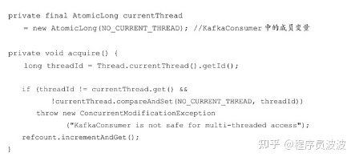
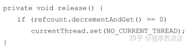

# 消费者

## 一、消费者与消费组

消费者（Consumer）负责订阅 Kafka 中的主题（Topic），并且从订阅的主题上拉取消息。

在 Kafka 的消费理念中还有一层**消费组**（Consumer Group）的概念，每个消费者都有一个对应的消费组。当消息发布到主题后，只会被投递给订阅它的每个消费组中的一个消费者。

如图所示，某个主题中共有 4 个分区（Partition）：P0、P1、P2、P3。有两个消费组 A 和 B 都订阅了这个主题，消费组A 中有 4 个消费者（C0、C1、C2 和 C3），消费组 B 中有 2 个消费者（C4 和 C5）。按照 Kafka 默认的规则，最后的分配结果是消费组 A 中的每一个消费者分配到1个分区，消费组 B 中的每一个消费者分配到 2 个分区，两个消费组之间互不影响。每个消费者只能消费所分配到的分区中的消息。**换言之**，每一个分区只能被一个消费组中的一个消费者所消费。


消费者与消费组这种模型可以让整体的消费能力具备横向伸缩性，可以通过增加（或减少）消费者的个数来提高（或降低）整体的消费能力。但是如果分区固定，当消费者个数超过分区数则会导致部分消费者分配不到任何分区从而无法消费任何消息。

可以通过消费者客户端参数 `partition.assignment.strategy` 来设置消费者与订阅主题之间的分区分配策略。

Kafka 支持点对点（P2P，Point-to-Point）模式和发布/订阅（Pub/Sub）模式。

- 点对点模式是基于队列的，消息发布者发送消息到队列，消息消费者从队列中接收消息；
- 发布/订阅模式：定义了如何向一个内容节点（即 Topic）发布和订阅消息，主题是消息传递的中介，使得消息的订阅者和发布者互相独立，该模式在消息的一对多广播时采用。

如果所有消费者都是属于同一个消费组，则所有消息都会均衡的投递给每一个消费者，即每条消息只会被一个消费者处理，相当于点对点模式。如果不属于同一个消费组，则所有消息都会被广播给所有的消费者，即每条消息会被所有的消费者处理，相当于发布/订阅模式。

消费组是逻辑上概念，每个消费组由固定的名称，消费者在消费前需要指定其所属消费组的名称（可以通过消费者客户端参数 group.id 配置，默认值为空字符串）。

消费者是实际的应用实例，非逻辑上概念，其可以是一个线程或者一个进程，同一个消费组内的消费者可以部署在同一台/不同的机器上。

## 二、客户端开发

一个正常的消费逻辑需要具备以下几个步骤：

1. 配置消费者客户端参数及创建相应的消费者实例。
2. 订阅主题。
3. 拉取消息并消费。
4. 提交消费位移。
5. 关闭消费者实例。

```java
package com.gjxaiou.consumer;

import org.apache.kafka.clients.consumer.ConsumerRecord;
import org.apache.kafka.clients.consumer.ConsumerRecords;
import org.apache.kafka.clients.consumer.KafkaConsumer;
import org.apache.kafka.common.serialization.StringDeserializer;

import java.util.Arrays;
import java.util.Properties;
import java.util.concurrent.atomic.AtomicBoolean;

public class KafkaConsumerAnalysis {
    public static final String brokerList = "localhost:9092";
    public static final String topic = "topic-demo";
    public static final String groupId = "group.demo";
    public static final AtomicBoolean isRunning = new AtomicBoolean(true);

    public static Properties initConfig(){
        Properties properties = new Properties();
        properties.put("key.deserializer", StringDeserializer.class.getName());
        properties.put("value.deserializer",StringDeserializer.class.getName());
        properties.put("bootstrap.servers",brokerList);
        properties.put("group.id",groupId);
        // 该参数用于设定 KafkaConsumer 对应的客户端 Id，默认值为“”，如果不设置会自动设置为 “consumer-数字” 格式
        properties.put("client.id","consumer.client.id.demo");
        return properties;
    }

    public static void main(String[] args) {
        Properties properties = initConfig();
        KafkaConsumer<String, String> consumer = new KafkaConsumer<>(properties);
        consumer.subscribe(Arrays.asList(topic));

        try {
            while (isRunning.get()){
                ConsumerRecords<String, String> records = consumer.poll(1000);
                for (ConsumerRecord<String, String> record : records) {
                    System.out.println(record.topic() + record.key() + record.value() + record.partition() + record.offset());
                    // 处理 record 流程
                }
            }
        }catch (Exception e){
            System.out.println("发生异常" + e);
        }finally {
            consumer.close();
        }

    }
}
```

代码清单 3-1 消费者客户端示例

### （一）必要的参数配置

在 Kafka 消费者客户端 KafkaConsumer 中有 4 个参数是必填的。

- `bootstrap.servers`：该参数用来指定连接 Kafka 集群所需的 broker 地址清单，详见 KafkaProducer 中的该参数含义。
- `group.id`：消费者隶属的消费组的名称，默认值为“”，如果设置为空，则会报 InvalidGroupIdException 异常。
- `key.deserializer` 和 `value.deserializer`：消费者从 broker 端获取的消息格式都是字节数组（byte[]）类型，所以需要执行相应的反序列化操作才能还原成原有的对象格式，两参数无默认值，需要与序列化器进行对应。

### （二）订阅主题与分区

在创建好消费者之后，我们就需要为该消费者订阅相关的主题了。一个消费者可以订阅一个或多个主题。subscribe 的几个重载方法如下：

```java
void subscribe(Collection<String> topics);
void subscribe(Collection<String> topics, ConsumerRebalanceListener listener);
// ConsumerRebalanceListener 参数用于设置相应的再均衡监听器
void subscribe(Pattern pattern, ConsumerRebalanceListener listener);
// 使用正则的形式订阅特定模式的主题，如 consumer.subscribe(Pattern.compile("topic-.*"));
void subscribe(Pattern pattern);
```

如果前后两次订阅了不同的主题（即执行两次 subscribe 方法），那么消费者以最后一次的为准。

消费者 KafkaConsumer 不仅可以通过 `subscribe()` 方法订阅主题，还可以通过 `assign()` 方法直接订阅某些主题的特定分区：

```java
// 参数 partitions 用于指定需要订阅的分区集合
public void assign(Collection<TopicPartition> partitions);
```

TopicPartition 类用于在 Kafka 客户端中表示分区，其只有 2 个属性：topic 和 partition，分别代表分区所属的主题和自身的分区编号。如果我们事先并不知道主题中有多少个分区可以通过 KafkaConsumer 中的 `partitionsFor()` 方法来查询指定主题的元数据信息。

```java
 public List<PartitionInfo> partitionsFor(String topic)
```

返回的 PartitionInfo 即为主题的分区元数据信息

```java
public class PartitionInfo {
    // 主题名称
    private final String topic;
    // 分区编号
    private final int partition;
    // 分区中 leader 副本所在位置
    private final Node leader;
    // 分区的 AR集合
    private final Node[] replicas;
    // 分区的 ISR 集合
    private final Node[] inSyncReplicas;
    // 分区的 OSR 集合
    private final Node[] offlineReplicas;
    // 省略其他构造方法等   
}
```

可以使用 KafkaConsumer 中的 `unsubscribe()` 方法来取消主题 的订阅。如果将 `subscribe(Collection)` 或`assign(Collection)` 中的集合参数设置为空集合，那么作用等同于 `unsubscribe()` 方法。

通过 `subscribe()` 方法订阅主题具有消费者自动再均衡的功能，在多个消费者的情况下可以根据分区分配策略来自动分配各个消费者与分区的关系。即当消费组内增加/减少消费者时分区分配关系自动调整，从而实现消费负载均衡和故障自动转移。但是 `assign()` 方法不具备该功能。

### （三）反序列化

Kafka所提供的反序列化器有 ByteBufferDeserializer、ByteArrayDeserializer、BytesDeserializer、String/Double/Float/Integer/Long/ShortDeserializer，它们分别用于 ByteBuffer、ByteArray、Bytes、String/Double/Float/Integer/Long/Short 类型的反序列化，这些序列化器也都实现了 org.apache.kafka.common.serialization.Deserializer 接口：

```java
public interface Deserializer<T> extends Closeable {
    // 用于配置当前类
    void configure(Map<String, ?> configs, boolean isKey);
    // 用来执行反序列化。如果 data 为 null，那么处理的时候直接返回 null 而不是抛出一个异常
    T deserialize(String topic, byte[] data);
    // 用来关闭当前序列化器
    void close();
}
```

下面实现了生产者自定义的序列化器对应的反序列化器：

```java
package com.gjxaiou.consumer;

import com.gjxaiou.produce.Company;
import org.apache.kafka.common.errors.SerializationException;
import org.apache.kafka.common.serialization.Deserializer;

import java.io.UnsupportedEncodingException;
import java.nio.ByteBuffer;
import java.nio.charset.StandardCharsets;
import java.util.Map;

public class CompanyDeserializer implements Deserializer<Company> {
    @Override
    public void configure(Map<String, ?> configs, boolean isKey) {

    }

    // 将字节数组转换为对应的 Company 对象
    @Override
    public Company deserialize(String topic, byte[] data) {
        if (data == null) {
            return null;
        }
        if (data.length < 8) {
            throw new SerializationException("接收到的长度不符合");
        }

        ByteBuffer buffer = ByteBuffer.wrap(data);
        int nameLen;
        int addressLen;
        String name;
        String address;
        nameLen = buffer.getInt();
        byte[] nameBytes = new byte[nameLen];
        buffer.get(nameBytes);
        addressLen = buffer.getInt();
        byte[] addressBytes = new byte[addressLen];
        buffer.get(addressBytes);

        name = new String(nameBytes, StandardCharsets.UTF_8);
        address = new String(addressBytes, StandardCharsets.UTF_8);
        return new Company(name, address);
    }

    @Override
    public void close() {

    }
}
```

使用的时候在 properties 中指定 `value.deserializer` 参数值为上述的自定义反序列化类的全限定性类名即可。

但是自定义序列化和反序列化器使得 producer 和 consumer 过于耦合，上游使用这个序列化器，下游就得使用对应的反序列化器，同时上游类结构改变，下游也必须改变；因此实际使用中如果 Kafka 提供的序列化/反序列化器无法满足，则推荐使用 Avro/JSON/Thrift/ProtoBuf/Protostuff 等通用化的序列化工具。

### （四）消息消费

Kafka 中的消费是基于拉模式的。Kafka 中的消息消费是一个不断轮询的过程，消费者所要做的就是重复地调用 `poll()` 方法，而 `poll()` 方法返回的是所订阅的主题（分区）上的一组消息。

```java
// 该方法在 2.0 版本之后过时，推荐使用下面 JDK8 中新增时间类型的参数方法
@Deprecated
public ConsumerRecords<K, V> poll(long timeoutMs); 
// timeout 超时参数用于控制 poll 方法的阻塞时间，在消费者的缓冲区中没有可用数据时会发生阻塞
// 单位为毫秒，可以通过 Duration 类中的 ofMillis()/ofSeconds() 等指定不同的时间单位；
public ConsumerRecords<K, V> poll(Duration timeout);
```

注意，timeout 的设置取决于应用程序对响应速度的要求，如需要在多长时间内将控制权移交给执行轮询的应用线程。如果该值为 0 则表示 `poll()` 方法不管是否已经拉取到消息都立刻返回。但是如果应用线程唯一工作就是从 kafka 中拉取并消费消息，则可以将该参数设置为最大值 Long.MAX_VALUE;

消费者消费到的每条消息的类型为 ConsumerRecord（对应于生产者发送的消息类型 ProducerRecord），具体的结构参考如下代码：

```java
public class ConsumerRecord<K, V> {
    public static final long NO_TIMESTAMP = -1L;
    public static final int NULL_SIZE = -1;
    public static final int NULL_CHECKSUM = -1;
    // 消息所属的主题
    private final String topic;
    // 消息所属的分区
    private final int partition;
    // 消息在所在分区的偏移量
    private final long offset;
    // 时间戳
    private final long timestamp;
    // 时间戳类型，分为 CreateTime（消息创建的时间戳）和 LogAppendTime（消息追加到日志的时间戳）
    private final TimestampType timestampType;
    // key 经过序列化之后的字节大小，如果 key 为空则该值为 -1
    private final int serializedKeySize;
    // value 经过序列化后的字节大小，如果 value 为空则值为 -1
    private final int serializedValueSize;
    // 消息头部
    private final Headers headers;
    // 消息的键
    private final K key;
    // 消息的值
    private final V value;
    private final Optional<Integer> leaderEpoch;
    // CRC32 的校
    private volatile Long checksum;
    // 省略 getter/setter/construct 等
}
```

`poll()` 方法返回值类型 ConsumerRecords 表示一次性拉取操作所获得的消息集，内部包括多个 ConsumerRecord，同时可以使用其内部提供的 iterator() 方法进行遍历。

消费方式一：按照分区维度进行消费

ConsumerRecords 类中的 `records(TopicPartition)` 方法可以用于获取消息集中指定分区的消息。

```java
// 按照分区消费方式
ConsumerRecords<String, String> recordList = consumer.poll(Duration.ofSeconds(1000));
// 获取拉取的消息集中所有分区
Set<TopicPartition> partitions = recordList.partitions();
for (TopicPartition tp : partitions) {
    List<ConsumerRecord<String, String>> crList  = recordList.records(tp);
    for (ConsumerRecord<String, String> record : crList) {
        System.out.println(record.partition() + record.value());
    }
}
```

消费方式二：按照主题进行消费

因为 ConsumerRecords 类中没有直接获取拉取的消息集中所有包含的主题列表，所以只能根据消费者订阅主题时的列表来进行逻辑处理；

```java
// 按照主题来消费
ConsumerRecords<String, String> consumerRecords = consumer.poll(Duration.ofSeconds(1000));
for (String topic : Arrays.asList(topic)) {
    Iterable<ConsumerRecord<String, String>> records1 =
        consumerRecords.records(topic);
    for (ConsumerRecord<String, String> rec : records1) {
        System.out.println(rec.topic() + rec.value());
    }
}
```

`poll()` 方法不仅仅为拉取一下消息，其内部涉及消费位移、消费者协调器、组协调器、消费者选举、分区分配的分发、再均衡的逻辑、心跳等等。

### （五）位移提交

对于 Kafka 中的分区而言，它的每条消息都有唯一的 offset（偏移量），用来表示消息在分区中对应的位置。对于消费者而言，它也有一个 offset（位移）的概念，消费者使用 offset 来表示消费到分区中某个消息所在的位置。对于一条消息而言，它的偏移量和消费者消费它时的消费位移是相等的。

在旧消费者客户端中，消费位移是存储在 ZooKeeper 中的。而在新消费者客户端中，消费位移存储在 Kafka 内部的主题`__consumer_offsets` 中。这里把将消费位移存储起来（持久化）的动作称为“提交”，消费者在消费完消息之后需要执行消费位移的提交。


图中 x 表示某次拉取操作中此分区的最大偏移量，如果当前消费者消费了 X 位置的消息，则消费者的消费位移为 X，但是消费者需要提交的消费位移为 X + 1，即下一条需要拉取的消费的位置。KafkaConsumer 类中提供了两个方法获取以上两个位置：

```java
// 获取 position 位置
public long position(TopicPartition partition);
// 获取 committed offset 位置
 @Deprecated
public OffsetAndMetadata committed(TopicPartition partition)
```

示例：向某主题中分区编号为 0 的分区发送若干消息，然后一个消费者消费，消费完之后同步提交消费位移（调用 commitSync()）最终观察各个值的大小。

===缺少书上 P64 页代码==

位移提交时机很重要，否则会造成重复消费和消息丢失。例如当前一次 `poll()` 操作拉取的消息集为 [x+2,x+7]，其中 x+2 表示上一次提交的消费位移（即已经完成包括 x+1 在内与之前的所有消息的消费），x+5 表示当前正在处理的而为之，**如果拉取到消息就进行位移提交**，即提交了 x+8，但是当消费到 x+5 的时候发生异常进行故障恢复，则重新拉取的消息从 x+8 开始，导致部分消息丢失未消费。**如果消费完所有拉取到的消息之后才进行位移提交**，则同样发生故障之后，重新拉取是从 x+2 开始，即部分消息会重复消费。


在 Kafka 中默认的消费位移的提交方式是自动提交，这个由消费者客户端参数 `enable.auto.commit` 配置，默认值为 true。该自动提交是定期提交，定期的周期时间由 `auto.commit.interval.ms` 设置（默认为 5s）。即默认情况下，消费者每隔 5s 会将拉取到的每个分区中最大的消息位移进行提交。自动位移提交的动作是在 `poll()` 方法中完成，在每次真正向服务端发起拉取请求之前会检查是否可以进行位移提交，如果可以则提交上一次轮询的位移。

**自动提交问题**

- 重复消费：即刚刚提交完一次消费位移，然后拉取一批消息进行消费，在下一次自动提交消费位移之前消费者崩溃了，就得从上一次位移提交的地方重新开始消费。可以通过减少位移提交的时间间隔来减少重复消息的窗口大小；

- 消息丢失：拉取线程 A 不断拉取消息并存入本地缓存（如 BlockingQuere），另一个线程 B 从缓存中读取消息并进行逻辑处理。假设目前进行到了第 y+1 次拉取，以及第 m 次位移提交的时候，即 x+6 之前的位移已经确认提交了，但是线程 B 还在消费 x+3 的消息，此时如果处理线程 B 发生异常，等恢复之后会从第 m 次位移提交（即 x+6 开始拉取消息），就导致了消息丢失。

  

  **手动位移提交**
  自动位移提交无法做到精确的位移管理，如果先等拉取到的消息进行了一系列逻辑处理之后才认为成功消费，这时候可以将参数 `enable.auto.commit` 设置为 false 即可。同时手动提交分为同步提交和异步提交，分别对应 KafkaConsumer 的 `commitSync()` 和 `conmitAsync()` 方法。

  ```java
  // 其他部分参考上述的 consumer 即可
  public static void main(String[] args) {
      Properties properties = initConfig();
      KafkaConsumer<String, String> consumer = new KafkaConsumer<>(properties);
      consumer.subscribe(Arrays.asList(topic));
      while (isRunning.get()) {
          ConsumerRecords<String, String> records = consumer.poll(Duration.ofSeconds(1000));
          for (ConsumerRecord<String, String> record : records) {
              // 逻辑处理
          }
          // 批量同步提交
          consumer.commitSync();
      }
  }
  ```

  上述也可以将 record 保存下来然后批量处理，最后批量同步提交。但是两种方式都可能出现重复提交，即业务逻辑处理完到同步位移提交前程序崩溃，则恢复之后只能从上一次位移提交的地方拉取消息，导致重复消费。

  `commitSync()` 方法会根据 `poll()` 方法拉取的最新位移来进行提交（提交的值即为 position 位置），只要没有发生不可恢复的错误，就会阻塞消费者线程直至位移提交完成。
  
  该无参方法的提交消费位移的频率和拉取批次消息、处理批次消息的频率一致。即只能提交当前消费批次对应的 position 值，如果需要提交一个中间值，如业务每消费一条消息就提交一次消息可以使用下面方式：
  
  ```java
  // offsets 用于提交指定分区的位移    
  public void commitSync(Map<TopicPartition, OffsetAndMetadata> offsets);
  ```
  
  ```java
  public static void main(String[] args) {
      Properties properties = initConfig();
      KafkaConsumer<String, String> consumer = new KafkaConsumer<>(properties);
      consumer.subscribe(Arrays.asList(topic));
      while (isRunning.get()) {
          ConsumerRecords<String, String> records = consumer.poll(Duration.ofSeconds(1000));
          for (ConsumerRecord<String, String> record : records) {
              TopicPartition partition = new TopicPartition(record.topic(),
                                                            record.partition());
              // commitSync() 本身为同步执行，所以消耗性能，这种方式不常使用
              consumer.commitSync(Collections.singletonMap(partition,
                                                           new OffsetAndMetadata(record.offset() + 1)));
          }
      }
  }
  ```
  
  通常可以按照分区的粒度划分提交位移的界限，例如：
  
  ```java
  public static void main(String[] args) {
      Properties properties = initConfig();
      KafkaConsumer<String, String> consumer = new KafkaConsumer<>(properties);
      consumer.subscribe(Arrays.asList(topic));
      while (isRunning.get()) {
          ConsumerRecords<String, String> records = consumer.poll(Duration.ofSeconds(1000));
          for (TopicPartition partition : records.partitions()) {
              List<ConsumerRecord<String, String>> partitionRecords = records.records(partition);
              for (ConsumerRecord<String, String> partitionRecord : partitionRecords) {
                  // 逻辑处理
              }
              long lastConsumerOffset =
                  partitionRecords.get(partitionRecords.size() - 1).offset();
              consumer.commitSync(Collections.singletonMap(partition,
                                                           new OffsetAndMetadata(lastConsumerOffset + 1)));
          }
      }
  }
  ```
  
  异步提交（commitAsync())在执行的时候消费者线程不会被阻塞，可能在提交消费位移的结果还没有返回之前就开始新一次的拉取操作，从而提升消费者性能。
  
  ```java
  public void commitAsync();
  // callback 提供了一个异步提交的回调返回，位移提交完成之后会回调 OffsetCommitCallback 中的 onComplete() 方法
  public void commitAsync(OffsetCommitCallback callback);
  
  public void commitAsync(Map<TopicPartition, OffsetAndMetadata> offsets, OffsetCommitCallback callback);
  ```
  
  示例：
  
  ```java
  public static void main(String[] args) {
      Properties properties = initConfig();
      KafkaConsumer<String, String> consumer = new KafkaConsumer<>(properties);
      consumer.subscribe(Arrays.asList(topic));
  
      while (isRunning.get()){
          ConsumerRecords<String, String> records = consumer.poll(Duration.ofSeconds(1000));
          for (ConsumerRecord<String, String> record : records) {
              System.out.println(record.topic() + record.key() + record.value() + record.partition() + record.offset());
              // 处理 record 流程
          }
  
          consumer.commitAsync(new OffsetCommitCallback() {
              @Override
              public void onComplete(Map<TopicPartition, OffsetAndMetadata> offsets,
                                     Exception e) {
                  if (e == null){
                      System.out.println(offsets);
                  }else {
                      System.out.println("has exception");
                  }
              }
          });
      }
  }
  ```
  
  如果 `commitAsync()` 提交时候发生异常，如果使用重试可能导致重复消费，如某次异步提交的消费位移 x 但是失败了，下次有异步提交了消费位移 x + y，然后 x 的重试成功了，则恢复之后消费者就会从 x 开始消费。
  
  解决方式：设置一个递增的序号来维护异步提交的顺序，每次位移提交都更新该值，则如果失败需要重试的时候如果要提交的位移值小于该序号，则说明更大的位移以及提交，不用重试了。否则重试。
  
  但是重试会增加代码逻辑复杂度，不重试会增加重复消费概率，如果消费者异常退出，则重复消费问题难以避免，因为这种情况下是无法及时提交消费位移的。但是如果消费者正常退出或者发生再均衡，则可以在这两种操作之前使用同步方式进行兜底。一般提交失败很少发生，不重试没问题，因为后面的提交也会成功。
  
  ```java
  public static void main(String[] args) {
      Properties properties = initConfig();
      KafkaConsumer<String, String> consumer = new KafkaConsumer<>(properties);
      consumer.subscribe(Arrays.asList(topic));
  
      try{
          while (isRunning.get()){
              ConsumerRecords<String, String> records = consumer.poll(Duration.ofSeconds(1000));
              for (ConsumerRecord<String, String> record : records) {
                  System.out.println(record.topic() + record.key() + record.value() + record.partition() + record.offset());
                  // 处理 record 流程
              }
  
              consumer.commitAsync();
          }
      }finally{
          try{
              // 同步方式提交兜底
              consumer.commitSync();
          }finally{
              consumer.close();
          }
      }
  }
  ```

###  3.2.6 控制或关闭消费

KafkaConsumer中使用pause（）和resume（）方法来分别实现暂停某些分区在拉取操作时返回数据给客户端和恢复某些分区向客户端返回数据的操作。

之前的示例展示的都是使用一个while循环来包裹住poll（）方法及相应的消费逻辑，如何优雅地退出这个循环也很有考究。细心的读者可能注意到有些示例代码并不是以 while（true）的形式做简单的包裹，而是使用 while（isRunning.get（））的方式，这样可以通过在其他地方设定isRunning.set（false）来退出while循环。还有一种方式是调用KafkaConsumer的wakeup（）方法，**wakeup**（）方法是 KafkaConsumer 中唯一可以从其他线程里安全调用的方法（KafkaConsumer 是非线程安全的，可以通过3.2.10节了解更多细节），调用wakeup（）方法后可以退出poll（）的逻辑，并抛出 WakeupException 的异常，我们也不需要处理 WakeupException的异常，它只是一种跳出循环的方式。

跳出循环以后一定要显式地执行关闭动作以释放运行过程中占用的各种系统资源，包括内存资源、Socket连接等。

### 3.2.7 指定位移消费

当一个新的消费组建立的时候，它根本没有可以查找的消费位移。或者消费组内的一个新消费者订阅了一个新的主题，它也没有可以查找的消费位移。当__consumer_offsets主题中有关这个消费组的位移信息过期而被删除后，它也没有可以查找的消费位移。在 Kafka 中每当消费者查找不到所记录的消费位移时，就会根据消费者客户端参数**auto.offset.reset**的配置来决定从何处开始进行消费，这个参数的默认值为“latest”，表示从分区末尾开始消费消息。如果将auto.offset.reset参数配置为“earliest”，那么消费者会从起始处，也就是0开始消费。

有些时候，我们需要一种更细粒度的掌控，可以让我们从特定的位移处开始拉取消息，而KafkaConsumer 中的 seek（）方法正好提供了这个功能。

### 3.2.8 再均衡

再均衡是指分区的所属权从一个消费者转移到另一消费者的行为，它为消费组具备高可用性和伸缩性提供保障，使我们可以既方便又安全地删除消费组内的消费者或往消费组内添加消费者。

不过在再均衡发生期间，消费组内的消费者是无法读取消息的。也就是说，在再均衡发生期间的这一小段时间内，消费组会变得不可用。

ConsumerRebalanceListener再均衡监听器用来设定发生再均衡动作前后的一些准备或收尾的动作。

(1)void onPartitionsRevoked(Collection＜TopicPartition＞partitions)

这个方法会在再均衡开始之前和消费者停止读取消息之后被调用。可以通过这个回调方法来处理消费位移的提交，以此来避免一些不必要的重复消费现象的发生。

(2)void onPartitionsAssigned(Collection＜TopicPartition＞partitions)

这个方法会在重新分配分区之后和消费者开始读取消费之前被调用。

### 3.2.9 消费者拦截器

消费者拦截器主要在消费到消息或在提交消费位移时进行一些定制化的操作。

消费者拦截器需要自定义实现org.apache.kafka.clients.consumer.**ConsumerInterceptor**接口。ConsumerInterceptor接口包含3个方法：

- public ConsumerRecords＜K,V＞onConsume(ConsumerRecords＜K,V＞records);·
- public void onCommit(Map＜TopicPartition,OffsetAndMetadata＞offsets);
- public void close().

KafkaConsumer会在poll（）方法返回之前调用拦截器的**onConsume**（）方法来对消息进行相应的定制化操作。

KafkaConsumer会在提交完消费位移之后调用拦截器的**onCommit**（）方法，可以使用这个方法来记录跟踪所提交的位移信息。

close（）方法和ConsumerInterceptor的父接口中的configure（）方法与生产者的ProducerInterceptor接口中的用途一样。

### 3.2.10 多线程实现

KafkaProducer是线程安全的，然而KafkaConsumer却是非线程安全的。

KafkaConsumer中定义了一个 **acquire**（）方法，用来检测当前是否只有一个线程在操作，若有其他线程正在操作则会抛出ConcurrentModifcationException异常。

KafkaConsumer中的每个公用方法在执行所要执行的动作之前都会调用这个acquire（）方法，只有wakeup（）方法是个例外。acquire （）方法的具体定义如下：



acquire（）方法和我们通常所说的锁（synchronized、Lock等）不同，它不会造成阻塞等待，我们可以将其看作一个轻量级锁，它仅通过线程操作计数标记的方式来检测线程是否发生了并发操作，以此保证只有一个线程在操作。

acquire（）方法和release（）方法成对出现，表示相应的加锁和解锁操作。



多线程的实现方式有多种，**第一种**也是最常见的方式：线程封闭，即为每个线程实例化一个KafkaConsumer对象。第二种线程池。

### 3.2.11 重要的消费者参数

**1.fetch.min.bytes**

**2.fetch.max.bytes**

**[3.fetch.max.wait.ms](https://link.zhihu.com/?target=http%3A//3.fetch.max.wait.ms)**

**4.max.partition.fetch.bytes**

**5.max.poll.records**

**[6.connections.max.idle.ms](https://link.zhihu.com/?target=http%3A//6.connections.max.idle.ms)**