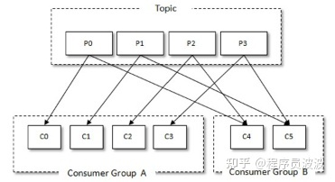
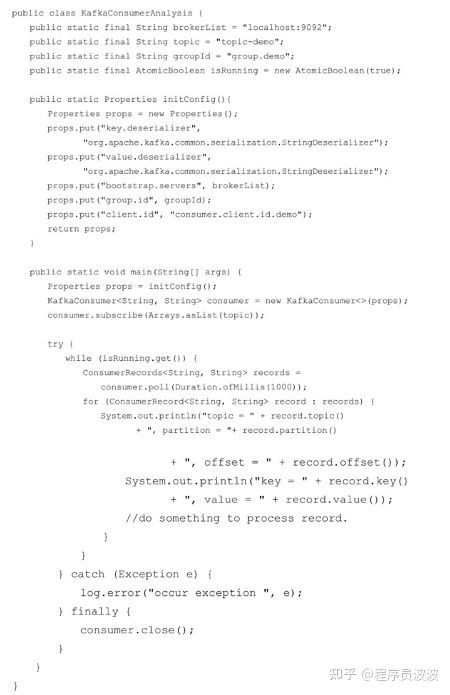
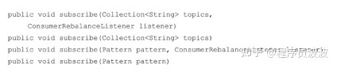
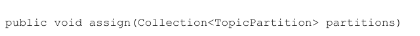
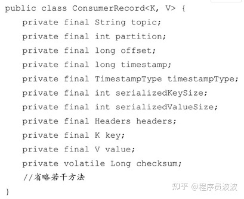

# 三、消费者

## 3.1 消费者与消费组

消费者（Consumer）负责订阅Kafka中的主题（Topic），并且从订阅的主题上拉取消息。

在Kafka的消费理念中还有一层**消费组**（Consumer Group）的概念，每个消费者都有一个对应的消费组。当消息发布到主题后，只会被投递给订阅它的每个消费组中的一个消费者。

如图3-1所示，某个主题中共有4个分区（Partition）：P0、P1、P2、P3。有两个消费组A和B都订阅了这个主题，消费组A中有4个消费者（C0、C1、C2和C3），消费组B中有2个消费者（C4和C5）。按照Kafka默认的规则，最后的分配结果是消费组A中的每一个消费者分配到1个分区，消费组B中的每一个消费者分配到2个分区，两个消费组之间互不影响。每个消费者只能消费所分配到的分区中的消息。**换言之**，每一个分区只能被一个消费组中的一个消费者所消费。

图3-1 消费者与消费组

可以通过消费者客户端参数partition.assignment.**strategy** 来设置消费者与订阅主题之间的分区分配策略。

Kafka 支持点对点（P2P，Point-to-Point）模式和发布/订阅（Pub/Sub）模式。

## 3.2 客户端开发

一个正常的消费逻辑需要具备以下几个步骤：

1. 配置消费者客户端参数及创建相应的消费者实例。
2. 订阅主题。
3. 拉取消息并消费。
4. 提交消费位移。
5. 关闭消费者实例。

代码清单3-1 消费者客户端示例

### 3.2.1 必要的参数配置

在Kafka消费者客户端KafkaConsumer中有4个参数是必填的。

- bootstrap.servers：该参数用来 指 定 连 接Kafka 集 群 所 需 的 broker 地 址 清 单。
- [group.id](https://link.zhihu.com/?target=http%3A//group.id)：消费者隶属的消费组的名称，默认值为“”。
- key.deserializer 和 value.deserializer：消费者从broker端获取的消息格式都是字节数组（byte[]）类型，所以需要执行相应的反序列化操作才能还原成原有的对象格式。

### 3.2.2 订阅主题与分区

在创建好消费者之后，我们就需要为该消费者订阅相关的主题了。一个消费者可以订阅一个或多个主题。subscribe的几个重载方法如下：

如果前后两次订阅了不同的主题，那么消费者以最后一次的为准。

在 subscribe 的重载方法中有一个参数类型是 ConsumerRebalanceListener，这个是用来设置相应的再均衡监听器的。

消费者不仅可以通过KafkaConsumer.subscribe（）方法订阅主题，还可以直接订阅某些主题的特定分区，在KafkaConsumer中还提供了一个assign（）方法来实现这些功能，此方法的具体定义如下：

TopicPartition类只有2个属性：topic和partition，分别代表分区所属的主题和自身的分区编号。如果我们事先并不知道主题中有多少个分区怎么办？KafkaConsumer 中的partitionsFor（）方法可以用来查询指定主题的元数据信息。

可以使用 KafkaConsumer 中的 unsubscribe（）方法来取消主题的订阅。如果将subscribe（Collection）或assign（Collection）中的集合参数设置为空集合，那么作用等同于unsubscribe（）方法。

通过 subscribe（）方法订阅主题具有消费者自动再均衡的功能，在多个消费者的情况下可以根据分区分配策略来自动分配各个消费者与分区的关系。

### 3.2.3 反序列化

Kafka所提供的反序列化器有ByteBufferDeserializer、ByteArrayDeserializer、BytesDeserializer、StringDeserializer，它们分别用于ByteBuffer、ByteArray、Bytes、String类型的反序列化，这些序列化器也都实现了 **Deserializer** 接口，Deserializer接口也有三个方法。

- public void configure（Map＜String，？＞ configs，boolean isKey）：用来配置当前类。
- public byte[] serialize（String topic，T data）：用来执行反序列化。如果data为null，那么处理的时候直接返回null而不是抛出一个异常。
- public void close（）：用来关闭当前序列化器。

### 3.2.4 消息消费

Kafka中的消费是基于拉模式的。Kafka中的消息消费是一个不断轮询的过程，消费者所要做的就是重复地调用poll（）方法，而poll（）方法返回的是所订阅的主题（分区）上的一组消息。

消费者消费到的每条消息的类型为ConsumerRecord，具体的结构参考如下代码：

### 3.2.5 位移提交

对于Kafka中的分区而言，它的每条消息都有唯一的offset，用来表示消息在分区中对应的位置。对于消费者而言，它也有一个offset的概念，消费者使用offset来表示消费到分区中某个消息所在的位置。

在旧消费者客户端中，消费位移是存储在ZooKeeper中的。而在新消费者客户端中，消费位移存储在Kafka内部的主题__consumer_offsets中。这里把将消费位移存储起来（持久化）的动作称为“提交”，消费者在消费完消息之后需要执行消费位移的提交。

在 Kafka 中默认的消费位移的提交方式是自动提交，这个由消费者客户端参数enable.auto.commit配置，默认值为 true。

### 3.2.6 控制或关闭消费

KafkaConsumer中使用pause（）和resume（）方法来分别实现暂停某些分区在拉取操作时返回数据给客户端和恢复某些分区向客户端返回数据的操作。

之前的示例展示的都是使用一个while循环来包裹住poll（）方法及相应的消费逻辑，如何优雅地退出这个循环也很有考究。细心的读者可能注意到有些示例代码并不是以 while（true）的形式做简单的包裹，而是使用 while（isRunning.get（））的方式，这样可以通过在其他地方设定isRunning.set（false）来退出while循环。还有一种方式是调用KafkaConsumer的wakeup（）方法，**wakeup**（）方法是 KafkaConsumer 中唯一可以从其他线程里安全调用的方法（KafkaConsumer 是非线程安全的，可以通过3.2.10节了解更多细节），调用wakeup（）方法后可以退出poll（）的逻辑，并抛出 WakeupException 的异常，我们也不需要处理 WakeupException的异常，它只是一种跳出循环的方式。

跳出循环以后一定要显式地执行关闭动作以释放运行过程中占用的各种系统资源，包括内存资源、Socket连接等。

### 3.2.7 指定位移消费

当一个新的消费组建立的时候，它根本没有可以查找的消费位移。或者消费组内的一个新消费者订阅了一个新的主题，它也没有可以查找的消费位移。当__consumer_offsets主题中有关这个消费组的位移信息过期而被删除后，它也没有可以查找的消费位移。在 Kafka 中每当消费者查找不到所记录的消费位移时，就会根据消费者客户端参数**auto.offset.reset**的配置来决定从何处开始进行消费，这个参数的默认值为“latest”，表示从分区末尾开始消费消息。如果将auto.offset.reset参数配置为“earliest”，那么消费者会从起始处，也就是0开始消费。

有些时候，我们需要一种更细粒度的掌控，可以让我们从特定的位移处开始拉取消息，而KafkaConsumer 中的 seek（）方法正好提供了这个功能。

### 3.2.8 再均衡

再均衡是指分区的所属权从一个消费者转移到另一消费者的行为，它为消费组具备高可用性和伸缩性提供保障，使我们可以既方便又安全地删除消费组内的消费者或往消费组内添加消费者。

不过在再均衡发生期间，消费组内的消费者是无法读取消息的。也就是说，在再均衡发生期间的这一小段时间内，消费组会变得不可用。

ConsumerRebalanceListener再均衡监听器用来设定发生再均衡动作前后的一些准备或收尾的动作。

(1)void onPartitionsRevoked(Collection＜TopicPartition＞partitions)

这个方法会在再均衡开始之前和消费者停止读取消息之后被调用。可以通过这个回调方法来处理消费位移的提交，以此来避免一些不必要的重复消费现象的发生。

(2)void onPartitionsAssigned(Collection＜TopicPartition＞partitions)

这个方法会在重新分配分区之后和消费者开始读取消费之前被调用。

### 3.2.9 消费者拦截器

消费者拦截器主要在消费到消息或在提交消费位移时进行一些定制化的操作。

消费者拦截器需要自定义实现org.apache.kafka.clients.consumer.**ConsumerInterceptor**接口。ConsumerInterceptor接口包含3个方法：

- public ConsumerRecords＜K,V＞onConsume(ConsumerRecords＜K,V＞records);·
- public void onCommit(Map＜TopicPartition,OffsetAndMetadata＞offsets);
- public void close().

KafkaConsumer会在poll（）方法返回之前调用拦截器的**onConsume**（）方法来对消息进行相应的定制化操作。

KafkaConsumer会在提交完消费位移之后调用拦截器的**onCommit**（）方法，可以使用这个方法来记录跟踪所提交的位移信息。

close（）方法和ConsumerInterceptor的父接口中的configure（）方法与生产者的ProducerInterceptor接口中的用途一样。

### 3.2.10 多线程实现

KafkaProducer是线程安全的，然而KafkaConsumer却是非线程安全的。

KafkaConsumer中定义了一个 **acquire**（）方法，用来检测当前是否只有一个线程在操作，若有其他线程正在操作则会抛出ConcurrentModifcationException异常。

KafkaConsumer中的每个公用方法在执行所要执行的动作之前都会调用这个acquire（）方法，只有wakeup（）方法是个例外。acquire （）方法的具体定义如下：

acquire（）方法和我们通常所说的锁（synchronized、Lock等）不同，它不会造成阻塞等待，我们可以将其看作一个轻量级锁，它仅通过线程操作计数标记的方式来检测线程是否发生了并发操作，以此保证只有一个线程在操作。

acquire（）方法和release（）方法成对出现，表示相应的加锁和解锁操作。

多线程的实现方式有多种，**第一种**也是最常见的方式：线程封闭，即为每个线程实例化一个KafkaConsumer对象。第二种线程池。

### 3.2.11 重要的消费者参数

**1.fetch.min.bytes**

**2.fetch.max.bytes**

**[3.fetch.max.wait.ms](https://link.zhihu.com/?target=http%3A//3.fetch.max.wait.ms)**

**4.max.partition.fetch.bytes**

**5.max.poll.records**

**[6.connections.max.idle.ms](https://link.zhihu.com/?target=http%3A//6.connections.max.idle.ms)**