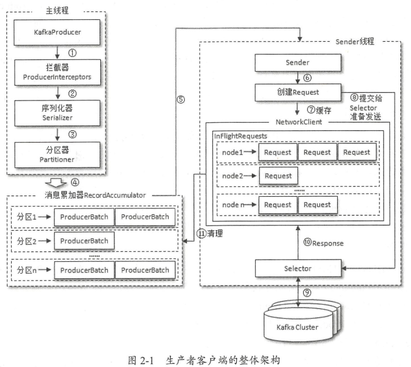
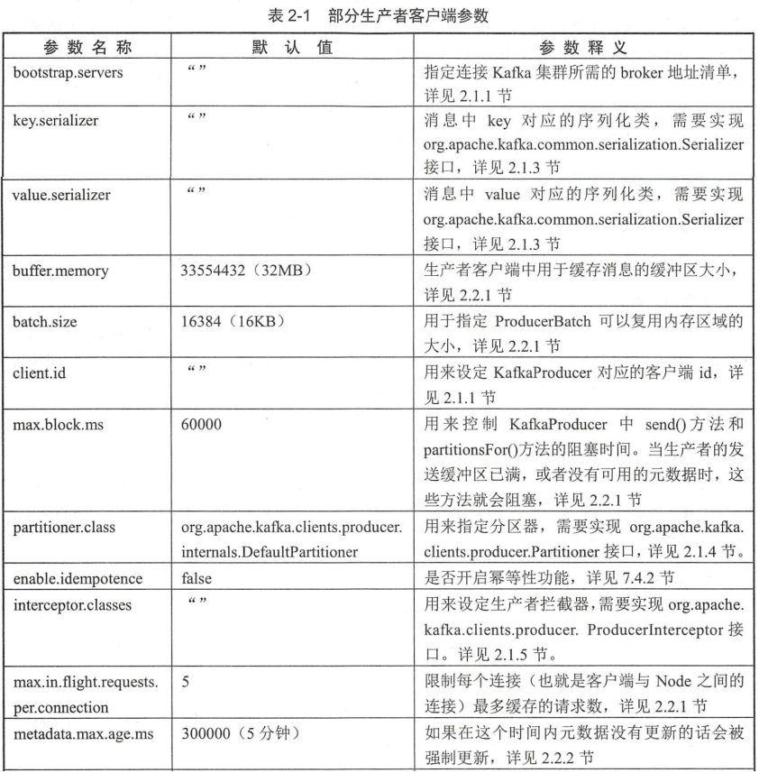

# 生产者

## 一、客户端开发

kafka 生产者客户端从 0.9.x 版本开始使用 Java 语言编写，之前为 scala。

一个正常的生产逻辑需要具备以下几个步骤：

1. 配置生产者客户端参数及创建相应的生产者实例。
2. 构建待发送的消息。
3. 发送消息。
4. 关闭生产者实例。

```java
package com.gjxaiou.produce;

import org.apache.kafka.clients.producer.KafkaProducer;
import org.apache.kafka.clients.producer.ProducerRecord;

import java.util.Properties;

public class KafkaProducerAnalysis {
    private static final String brokerList = "localhost:9092";
    private static final String topic = "topic-demo";

    private static Properties initConfig() {
        Properties properties = new Properties();
        properties.put("bootstrap.servers", brokerList);
        // 方式一:
        properties.put("key.serializer", "org.apache.kafka.common.serialization.StringSerializer");
        // 方式二：其中 key.serializer 也能配置为常量
        properties.put("key.serializer", StringSerializer.class.getName());
        properties.put("value.serializer", "org.apache.kafka.common.serialization" +
                ".StringSerializer");
        properties.put("client.id", "producer.client.id.demo");
        return properties;
    }

    public static void main(String[] args) {
        // 配置参数
        Properties properties = initConfig();
        // 创建生产客户端，也可以使用其他的构造方法
        KafkaProducer<String, String> producer = new KafkaProducer<>(properties);
        // 构建消息
        ProducerRecord<String, String> record = new ProducerRecord<>(topic,
                "Hello,Kafka");
        try {
            // 发送消息
            producer.send(record);
        } catch (Exception e) {
            e.printStackTrace();
        }
    }
}
```

其中构建的消息对象 **ProducerRecord**，包含了多个属性，请并不是单纯的消息，消息体只是其中的一个 value 属性。

```java
public class ProducerRecord<K, V> {
    // 消息要发往的主题
    private final String topic;
    // 消息要发往的分区号
    private final Integer partition;
    // 消息头部，一般设置一些与应用相关信息，可省略
    private final Headers headers;
    // 键
    private final K key;
    // 值
    private final V value;
    // 消息的时间戳
    private final Long timestamp;
    // 省略其他成员方法和构造方法
}
```

key 是用来指定消息的键，它不仅是消息的附加信息，还可以用来计算分区号进而可以让消息发往特定的分区。前面提及消息以主题为单位进行归类，而这个 key 可以让消息再进行二次归类，**同一个 key 的消息会被划分到同一个分区中**。有 key 的消息还可以支持日志压缩的功能。

value 是指消息体，一般不为空，如果为空则表示特定的消息—墓碑消息。

timestamp 是指消息的时间戳，它有 CreateTime 和 LogAppendTime 两种类型，前者表示消息创建的时间，后者表示消息追加到日志文件的时间。

### （一）必要的参数配置

在 Kafka 生产者客户端 KafkaProducer 中有 3 个参数是必填的：

- `bootstrap.servers`：该参数用来指定生产者客户端连接 Kafka 集群所需的 broker 地址清单。格式为：`host1:port1,host2:port2` 即多个使用逗号隔开；

  > 不需要配置所有的 broker 地址，因为生产者会从给定 broker 中查找其他 broker 信息，建议配置两个以上即可，防止其中一个宕机；

- `key.serializer` 和 `value.serializer`：broker 端接收的消息必须以字节数组（byte[]）的形式存在。在发往 broker 之前需要将消息中对应的 key 和 value 做相应的序列化操作来转换成字节数组。`key.serializer` 和 `value.serializer` 这两个参数分别用来指定 key 和 value 序列化操作的序列化器，这两个参数无默认值。注意这里必须填写序列化器的全限定名（可以使用配置类通过 StringSerializer.class.getName 来配置）。

  > 注意：KafkaProducer<String, String> 和 ProducerRecord<String, String> 中的 <String, String>  分别为消息中的 key/value 类型；

- `client.id`： 用来设定 KafkaProducer 对应的客户端 id，默认值为 “”。如果客户端不设置，则 KafkaProducer 会自动生成一个非空字符串，样式为：`producer-XXX`。

- **KafkaProducer 是线程安全的**，可以在多个线程中共享单个 KafkaProducer 实例，也可以将 KafkaProducer 实例进行池化来供其他线程调用。即可以使用依赖注入。

### （二）消息的发送

在创建完生产者实例之后，接下来的工作就是构建消息，即创建 ProducerRecord 对象。其构造方法很多：

```java
// 本质上都是调用这个最完整的构造方法，没有指定的值都是赋值为 NULL   
public ProducerRecord(String topic, Integer partition, Long timestamp, K key, V value, Iterable<Header> headers)；
public ProducerRecord(String topic, Integer partition, Long timestamp, K key, V value);
public ProducerRecord(String topic, Integer partition, K key, V value, Iterable<Header> headers);
public ProducerRecord(String topic, Integer partition, K key, V value);
public ProducerRecord(String topic, K key, V value); 
public ProducerRecord(String topic, V value);
```

创建生产者实例和构建消息之后，便可开始发送消息了。发送消息主要有三种模式：**发后即忘**（fire-and-forget）、**同步**（sync）及**异步**（async）。

- 发后即忘：只管往 Kafka 中发送消息而并不关心消息是否正确到达。这种发送方式的性能最高，可靠性也最差。

- 同步: 可靠性高，要么消息被发送成功，要么发生异常。但性能较低，需要阻塞等待一条消息发送完才能发下一条；

KafkaProducer 的 send() 方法并非是 void 类型，而是 Future＜RecordMetadata＞类型，send() 方法有 2 个重载方法，具体定义如下：

```java
Future<RecordMetadata> send(ProducerRecord<K, V> var1);
Future<RecordMetadata> send(ProducerRecord<K, V> var1, Callback var2);
```

要实现同步的发送方式，可以利用返回的 Future 对象实现，示例如下：

```java
// 同步方式
try {
    producer.send(record).get();
}catch (ExecutionException |InterruptedException e){
    e.printStackTrace();
}
```

实际上 `send()` 方法本身就是异步的，`send()` 方法返回的 Future 对象可以使调用方稍后获得发送的结果。

示例中在执行 `send()` 方法之后直接链式调用了 `get()` 方法来阻塞等待 Kafka 的响应，直到消息发送成功，或者发生异常。如果发生异常，那么就需要捕获异常并交由外层逻辑处理。同步发送的方式也可以执行完 `send()` 方法之后不直接调用 get 方法：

```java
// 同步方式
try {
    Future<RecordMetadata> future = producer.send(record);
    // RecordMetadata 包括当前消息的主题号、分区、分区中偏移量（offset）、时间戳等；
    RecordMetadata recordMetadata = future.get();
    System.out.println(recordMetadata.topic() + recordMetadata.partition() + recordMetadata.offset());
}catch (ExecutionException |InterruptedException e){
    e.printStackTrace();
}
```

Future 表示一个任务的生命周期，并提供了相应的方法来判断任务是否已经完成或取消，以及获取任务的结果和取消任务等。同时可以使用 `get(long timeout,TimeUnit unit)` 实现可超时的阻塞。

KafkaProducer 中会产生可重试异常和不可重试异常。

- 可重复异常：NewWorkException/LeaderNotAvailableException/UnknownTopicOrPartitionException/NotEnoughReplicasException/NotCoordinatorException 等，通过重试之后可以重新恢复；

  通过配置 retries 常数（默认为 0），在尝试次数内会尝试自动恢复，超过次数还没恢复则抛出异常；

- 不可重复异常：RecordTooLargeException 等，即发送消息太大，无法重试，直接抛出异常；

异步发送的方式，一般是在 `send（）`方法里指定一个 Callback 的回调函数，Kafka 在返回响应时调用该函数来实现异步的发送确认。虽然 send() 方法返回的 future 可以用作异步逻辑处理，但是不断的发送消息，返回对应的 future 对象在何时如何调用都是问题；而 Callback 当 kafka 有响应的时候就会回调，要么发送成功，要么抛出异常。

异步发送方式的示例如下：

```java
// 异步方式
producer.send(record, new Callback() {
    @Override
    // 两个参数有且只有一个不为 NULL
    public void onCompletion(RecordMetadata recordMetadata, Exception e) {
        if (e != null) {
            // 可以记录日志或者进行消息重发
            e.printStackTrace();
        } else {
            System.out.println(recordMetadata.topic() + recordMetadata.partition() + recordMetadata.offset());
        }
    }
});
```

同时对于同一个分区，如果消息 record1 早于 record2 发送，则对应可保证 callback1 早于 callback2 调用，即回调函数的调用可以保证分区有序。

一个 KafkaProducer 不会只负责发送单条消息，更多的是发送多条消息，在发送完这些消息之后，需要调用 KafkaProducer 的 close（）方法来回收资源。该方法会阻塞等待之前所有的发送请求完成后再关闭 KafkaProducer，同时 close() 有带超时时间的方法（超过指定时间之后强行退出）。

### （三）序列化

生产者需要用序列化器（Serializer）把对象转换成字节数组才能通过网络发送给 Kafka。

消费者需要用反序列化器（Deserializer）把从 Kafka 中收到的字节数组转换成相应的对象。

例如 org.apache.kafka.common.serialization.StringSerializer 用于 String 类型的序列化器，还有ByteArray、ByteBuffer、Bytes、Double、Integer、Long 这几种类型（具体使用要根据消息中的 key 和 value 的数据类型），都实现了 org.apache.kafka.common.serialization.Serializer 接口，此接口有3个方法：

> 详细的实现可以参考 StringSerializer 类中对下述方法的实现；

```java
public interface Serializer<T> extends Closeable {
    void configure(Map<String, ?> configs, boolean isKey);

    byte[] serialize(String topic, T data);

    void close();
}
```

`configure()` 方法用来配置当前类。该方法在创建 KafkaProducer 实例时候调用，主要用于确认编码类型，且通常 encoding 值默认为 UTF-8，因为一般客户端都不会配置 `key.serializer.encoding/value.serializer.encoding/serializer.encoding` 值，具体逻辑可以看 StringSerializer 源码。

serialize（）方法用来执行序列化操作。在 StringSerializer 中就是将 String类型转换为 byte[] 类型。

close（）方法用来关闭当前的序列化器，一般 close（）是一个空方法，如果实现了此方法，则必须确保此方法的幂等性，因为这个方法很可能会被 KafkaProducer 调用多次。

注意：生产者使用的序列化器和消费者使用的反序列化器是需要一一对应的。

如果 Kafka 客户端提供的几种序列化器无法满足需求，可以选择 JSON、Thrift、ProtoBuf、Protostuff 等通用的序列化工具，或者自定义类型序列化器，例如：

```java
package com.gjxaiou.produce;

import lombok.Data;

@Data
public class Company {
    private String name;
    private String address;
}
```

以上自定义类对应的序列化器为：

其中 configure() 和  close() 暂时为空；

```java
package com.gjxaiou.produce;

import org.apache.kafka.common.serialization.Serializer;

import java.nio.ByteBuffer;
import java.nio.charset.StandardCharsets;
import java.util.Map;

public class CompanySerializer implements Serializer<Company> {

    @Override
    public void configure(Map<String, ?> map, boolean b) {

    }

    @Override
    public byte[] serialize(String s, Company company) {
        if (company == null){
            return null;
        }
        byte[] name;
        byte[] address;
        if (company.getName() != null){
            name = company.getName().getBytes(StandardCharsets.UTF_8);
        }else {
            name = new byte[0];
        }

        if (company.getAddress() != null){
            address = company.getAddress().getBytes(StandardCharsets.UTF_8);
        }else {
            address = new  byte[0];
        }

        ByteBuffer buffer = ByteBuffer.allocate(4 + 4 + name.length + address.length);
        buffer.putInt(name.length);
        buffer.put(name);
        buffer.putInt(address.length);
        buffer.put(address);

        return buffer.array();
    }

    @Override
    public void close() {

    }
}
```

只需要在 KafkaProducer 的 `value.serializer` 参数设置为上面自定义序列化类的全限定类名即可。

```java
package com.gjxaiou.produce;

import org.apache.kafka.clients.producer.KafkaProducer;
import org.apache.kafka.clients.producer.ProducerRecord;
import org.apache.kafka.clients.producer.RecordMetadata;
import org.apache.kafka.common.serialization.StringSerializer;

import java.util.Properties;
import java.util.concurrent.ExecutionException;

public class CompanyProducer  {
    private static final String brokerList = "localhost:9092";
    private static final String topic = "topic-demo";

    private static Properties initConfig() {
        Properties properties = new Properties();
        properties.put("bootstrap.servers", brokerList);

        properties.put("key.serializer", StringSerializer.class.getName());
        properties.put("value.serializer", CompanySerializer.class.getName());
        properties.put("client.id", "producer.client.id.demo");
        return properties;
    }

    public static void main(String[] args) throws ExecutionException, InterruptedException {
        Properties properties = initConfig();
        KafkaProducer<String, Company> producer = new KafkaProducer<>(properties);
        Company company = new Company("gjxaiou", "beijing");
        ProducerRecord<String, Company> record = new ProducerRecord<String,
                Company>(topic,company);
        RecordMetadata recordMetadata = producer.send(record).get();
        System.out.println(recordMetadata.toString());
    }
}
```

输出结果为：

`topic-demo-0@3`

### （四）分区器

消息在通过 `send()` 方法发往 broker 的过程中，有可能需要经过拦截器（Interceptor）、序列化器（Serializer）和分区器（Partitioner）的一系列作用之后才能被真正地发往 broker。

拦截器一般不是必需的，而序列化器是必需的。消息经过序列化之后就需要确定它发往的分区**，如果消息 ProducerRecord 中指定了 partition 字段（代表要发往的分区号），则就不需要分区器的作用。否则需要分区器通过 key 来计算 partition 值即为该消息分配分区。**

Kafka 中默认分区器 `org.apache.kafka.clients.producer.internals.DefaultPartitioner`，它实现了`org.apache.kafka.clients.producer.Partitioner` 接口，这个接口中定义了 2 个方法，具体如下所示：

```java
public interface Partitioner extends Configurable, Closeable {
    // 参数含义：主题、键、序列化后的键、值、序列化后的值、集群的元数据信息
    int partition(String topic, Object key, byte[] keyBytes, Object value, byte[] valueBytes, Cluster cluster);

    void close();
}
```

`partition()` 方法用来计算分区号，返回值为 int 类型。`close()` 方法在关闭分区器的时候用来回收一些资源。

同时其父接口 Configurable 中唯一的方法：`void configure(Map<String, ?> configs);` 用于获取配置信息和初始化数据；

在默认分区器 **DefaultPartitioner** 的实现中，`close()` 是空方法，而在 `partition()` 方法中定义了主要的分区分配逻辑。如果 key 不为 null，那么默认的分区器会对 key 进行哈希（采用 MurmurHash2 算法，具备高运算性能及低碰撞率），最终根据得到的哈希值来计算分区号（即 key 的 hash 值 % 主题分区数来得到分区号），**拥有相同 key 的消息会被写入同一个分区**。**如果 key 为 null，那么消息将会以轮询的方式发往主题内的各个可用分区。**

> key 不为 null 则计算得到的分区号是**所有分区**中的任意一个；
>
> key 为 null 且有可用分区时，计算得到的分区号是**可用分区**中的任意一个；

在不改变主题分区数量的情况下，key 与分区之间的映射可以保持不变。不过，一旦主题中增加了分区，那么就难以保证 key 与分区之间的映射关系了。

同时可以通过继承 Partitioner 接口来自定义分区器，使用的时候，在 properties 中通过参数 `partitioner.class` 指定该自定义分区器的全限定性类名。

### （五）生产者拦截器

拦截器（Interceptor）有：生产者拦截器和消费者拦截器。

生产者拦截器既可以**用来在消息发送前做一些准备工作**，比如按照某个规则过滤不符合要求的消息、修改消息的内容等，也可以用来**在发送回调逻辑前做一些定制化的需求**，比如统计类工作。

生产者拦截器的使用主要是自定义实现 `org.apache.kafka.clients.producer.ProducerInterceptor` 接口。ProducerInterceptor 接口中包含 3 个方法：

```java
public interface ProducerInterceptor<K, V> extends Configurable {
    ProducerRecord<K, V> onSend(ProducerRecord<K, V> var1);

    void onAcknowledgement(RecordMetadata var1, Exception var2);

    void close();
}
```

KafkaProducer 在将消息序列化和计算分区**之前**会调用生产者拦截器的 `onSend()` 方法来对消息进行相应的定制化操作。

KafkaProducer 会在消息被应答（Acknowledgement）之前或消息发送失败时调用生产者拦截器的 `onAcknowledgement()` 方法，优先于用户设定的 Callback 之前执行。但是该方法运行在 Producer 的 IO 线程中，所以其实现应尽可能简单，否则影响消息的发送速度。

close（）方法主要用于在关闭拦截器时执行一些资源的清理工作。

以上三个方法中抛出的异常都会被捕获并且记录到日志中，**但不会再向上传递**。

KafkaProducer 中不仅可以指定一个拦截器，还可以指定多个拦截器以形成拦截链。拦截链会按照 interceptor.classes 参数配置的拦截器的顺序来一一执行（配置的时候，各个拦截器全限定类名之间使用逗号隔开）。

注意：拦截链中如果某个拦截器执行失败，那么下一个拦截器会接着上一个执行成功的拦截器继续执行。所以尽量减少拦截器之间的依赖关系。

示例：自定义一个拦截器，然后在 properties 配置为上述参数的值即可；

```java
package com.gjxaiou.produce;

import org.apache.kafka.clients.producer.ProducerInterceptor;
import org.apache.kafka.clients.producer.ProducerRecord;
import org.apache.kafka.clients.producer.RecordMetadata;

import java.util.Map;

public class ProducerInterceptorPreFix implements ProducerInterceptor<String, String> {
    private volatile int successCount;
    private volatile int failCount;

    @Override
    public ProducerRecord<String, String> onSend(ProducerRecord<String, String> producerRecord) {
        String newValue = "gjxaiou-" + producerRecord.value();
        return new ProducerRecord<String, String>(producerRecord.topic(),
                producerRecord.partition(), producerRecord.timestamp(), producerRecord.key(),
                newValue, producerRecord.headers());
    }

    @Override
    public void onAcknowledgement(RecordMetadata recordMetadata, Exception e) {
        if (e == null) {
            successCount++;
        } else {
            failCount++;
        }
    }

    @Override
    public void close() {
        double successRatio = (double) successCount / (successCount + failCount);
        System.out.println("发送成功率为" + String.format("%f", successRatio * 100) + "%");
    }

    // 从 Configurable 中继承得到
    @Override
    public void configure(Map<String, ?> map) {

    }
}
```

## 二、原理分析

本节的内容主要是对 Kafka 生产者客户端的内部原理进行分析。

### （一）整体架构

消息在真正发往Kafka之前，有可能需要经历拦截器（Interceptor）、序列化器（Serializer）和分区器（Partitioner）等一系列的作用。



整个生产者客户端由两个线程协调运行，分别为**主线程**和 **Sender 线程**（发送线程）。在主线程中由 KafkaProducer 创建消息，然后通过可能的拦截器、序列化器和分区器的作用之后缓存到消息累加器（RecordAccumulator，也称消息收集器）中。Sender 线程负责从 RecordAccumulator 中获取消息并将其发送到 Kafka 中。

**RecordAccumulator** 主要用来缓存消息以便 Sender 线程可以批量发送，进而减少网络传输的资源消耗以提升性能。RecordAccumulator 缓存的大小可以通过生产者客户端参数 `buffer.memory` 配置，默认值为 33554432B，即 32MB。如果生产者发送消息速度超过发送到服务器速度，则导致生产者空间不足，则 kafkaProducer 的 `onSend()` 方法调用要不被阻塞、要不抛出异常，其取决于参数 `max.block.ms` 配置，默认为值 6000 即 60s。

主线程发送过来的消息都会被追加到 RecordAccumulator 的某个双端队列中，在其内部为每个分区都维护了一个**双端队列**，队列中的内容就是 ProducerBatch（其中包括一到多个 ProducerRecord），即 Deque＜ProducerBatch＞。消息写入缓存时，追加到双端队列的尾部；Sender 读取消息时，从双端队列的头部读取。

消息在网络上都是以字节（Byte）的形式传输的，在发送之前需要创建一块内存区域来保存对应的消息。在 Kafka 生产者客户端中，通过 `java.io.ByteBuffer` 实现消息内存的创建和释放。不过频繁的创建和释放是比较耗费资源的，在 RecordAccumulator 的内部还有一个 **BufferPool**，它主要用来实现 ByteBuffer 的复用，以实现缓存的高效利用。BufferPool 只针对特定大小的 ByteBuffer 进行管理，而其他大小的 ByteBuffer 不会缓存进 BufferPool 中，这个特定的大小由 `batch.size` 参数来指定，默认值为 16384B，即 16KB。

当一条消息 ProducerRecord 流入 ProducerAccumlator 之后，会先寻找与消息分区所对应的双端队列（如果没有则创建），再从该双端队列的尾部取一个 ProducerBatch（没有则创建），查看该 ProducerBatch 中是否还可以写入该 ProducerRecord，如果可以则写入，反之则需要创建一个新的 ProducerBatch。在新建 ProducerBatch 时评估这条消息的大小是否超过 batch.size 参数大小，如果不超过则以 `batch.size` 大小来创建 ProducerBatch，这样在使用完这段内存区域后，可以通过 BufferPool 的管理进行复用，如果超过则以评估的大小来创建 ProducerBatch，该内存区域不会被复用。

> 问题：怎么找消息分区对应的双端队列，即怎么维护两者的关系；

Sender 从 RecordAccumulator 中获取缓存的消息之后，会进一步将原本 `＜分区，Deque＜ProducerBatch＞＞` 的保存形式转变成 `＜Node，List＜ProducerBatch＞` 的形式，其中 Node 表示 Kafka 集群的 broker 节点。因为生产者客户端是与具体的 broker 节点建立连接的，即想具体的 broker 节点发送消息，并不关系消息属于哪个分区；但是对于 KafkaProducer 的应用逻辑，只关注向哪个分区发送哪些消息，因为需要进行应用逻辑层到网络 I/O 层转换；

在转换成`＜Node，List＜ProducerBatch＞＞` 的形式之后，Sender 还会进一步封装成 `＜Node，Request＞`的形式，这样就可以将 Request 请求发往各个 Node 了，这里的 Request 是指 Kafka 的各种协议请求，对于消息发送而言就是指具体的 ProduceRequest。

请求在从 Sender 线程发往 Kafka 之前还会保存到 InFlightRequests 中，InFlightRequests 保存对象的具体形式为 `Map＜NodeId，Deque＜Request＞＞`，它的主要作用是缓存了已经发出去但还没有收到响应的请求（NodeId 是一个 String 类型，表示节点的 id 编号）。可以通过配置参数 `max.in.flight.requests.per.connection`(默认值为 5) 来限制每个连接（即客户端与 Node 之间的连接）最多缓存的请求数，即每个连接最多只能缓存 5 个未响应的请求，超过则不能在向这个连接发送更多的请求，除非有缓存的请求收到了响应。通过比较 Deque<Request> 的 size 和该参数大小判断对应的 Node 中是否已经堆积了很多未响应的消息。如果有则说明该 Node 节点负载较大或者网络连接有问题，继续向其发送请求会增大请求超时的可能。

### （二）元数据的更新

InFlightRequests 还可以获得 leastLoadedNode，即所有 Node 中负载最小的那一个。这里的负载最小是通过每个 Node 在 InFlightRequests 中还未确认的请求决定的，未确认的请求越多则认为负载越大。选择 leastLoadedNode 发送请求可以使其尽快发出。

元数据是指 Kafka 集群的元数据，这些元数据具体记录了集群中有哪些主题，这些主题有哪些分区，每个分区的 leader 副本分配在哪个节点上，follower 副本分配在哪些节点上，哪些副本在 AR、ISR 等集合中，集群中有哪些节点，控制器节点又是哪一个等信息。

当客户端中没有需要使用的元数据信息时，如没有指定的主题信息，或者超过 `metadata.max.age.ms` 时间没有更新元数据都会引起元数据的更新操作。元数据的更新操作是在客户端内部进行的，对客户端的外部使用者不可见。当需要更新元数据时，会先挑选出 leastLoadedNode，然后向这个 Node 发送 MetadataRequest 请求来获取具体的元数据信息。这个更新操作是由Sender 线程发起的，在创建完 MetadataRequest 之后同样会存入 InFlightRequests，之后的步骤就和发送消息时的类似。元数据虽然由 Sender 线程负责更新，但是主线程也需要读取这些信息，这里的数据同步通过 synchronized 和 final 关键字来保障。

## 三、重要的生产者参数

### （一）acks

这个参数用来指定分区中必须要有多少个副本收到这条消息，之后生产者才会认为这条消息是成功写入的。涉及消息的可靠性和吞吐量之间的平衡。该参数的值为字符串类型。

- `acks=1`（默认值）。生产者发送消息之后，只要分区的 leader 副本成功写入消息，那么它就会收到来自服务端的成功响应。

  > 特殊情况：消息写入 leader 副本并返回成功响应给生产者，且在被其他 follower 副本拉取之前 leader 副本崩溃，则此消息还是丢失了，因为新选取的 leader 副本中没有该消息。

- `acks=0`。生产者发送消息之后不需要等待任何服务端的响应，吞吐量最大。

- `acks=-1或acks=all`。生产者在消息发送之后，需要等待ISR中的所有副本都成功写入消息之后才能够收到来自服务端的成功响应，可靠性最大。

  > 特殊情况：如果 ISR 中只有 leader 副本，则退化为 acks = 1 的情况。如果还想提高可靠性，则可以配合 `min.insync.replicas` 参数使用。

### （二）max.request.size

该参数用来限制生产者客户端能发送的消息的最大值，默认值为 1048576B，即 1MB。

> 谨慎修改，因为 broker 端的 `message.max.bytes` 参数与其相关联。

### （三）retries 和 retry.backoff.ms

retries 参数用来配置生产者重试的次数，默认值为 0，即在发生异常的时候不进行任何重试动作。

`retry.backoff.ms` 参数的默认值为100，它用来设定两次重试之间的时间间隔，避免无效的频繁重试以及生产者过早的放弃重试。

Kafka 可以保证同一个分区中的消息是有序的，即生产者按照顺序发送消息，这些消息也会顺序的写入分区，从而消费者会按照相同的顺序消费它们。

> 如果 acks 参数设置为非零值，并且 `max.in.flight.requests.per.connection` 参数设置为大于 1 的值，则消息会出现错序的现象，如果第一批消息写入失败，但是第二批写入成功，生产者重试第一批并成功，导致最终两个批次消息错序。
>
> 建议：如果要保证消息顺序，需要将 `max.in.flight.requests.per.connection` 参数配置为 1，而不是将 acks 的配置设置为 0，但是最终会影响整体吞吐量。

### （四）compression.type

这个参数用来指定消息的压缩方式，默认值为 `"none"`，即默认情况下，消息不会被压缩。该参数还可以配置为 `"gzip"/"snappy"/"lz4"`。消息压缩是使用时间换空间，可以极大减少网络传输量、降低网络 I/O，但是如果对时延有要求则不推荐对消息压缩。

### （五）connections.max.idle.ms

这个参数用来指定在多久之后关闭限制的连接，默认值是 540000（ms），即 9 分钟。

### （六）linger.ms

这个参数用来指定生产者发送 ProducerBatch 之前等待更多消息（ProducerRecord）加入 ProducerBatch 的时间，默认值为 0。生产者客户端会在 ProducerBatch 被填满或等待时间超过 `linger.ms` 值时发送出去。增大该参数会增加消息的延迟但是会提升一定的吞吐量。

### （七）receive.buffer.bytes

这个参数用来设置 Socket 接收消息缓冲区（SO_RECBUF）的大小，默认值为 32768（B），即 32KB。如果设置为 -1，则使用操作系统的默认值。如果 Producer 与 Kafka 处于不同的机房，则可以适当调大该值。

### （八）send.buffer.bytes

这个参数用来设置 Socket 发送消息缓冲区（SO_SNDBUF）的大小，默认值为 131072（B），即 128KB。与`receive.buffer.bytes` 参数一样，如果设置为 -1，则使用操作系统的默认值。

### （九）request.timeout.ms

这个参数用来配置 Producer 等待请求响应的最长时间，默认值为 30000（ms）。请求超时之后可以选择进行重试。该参数需要大于 broker 端参数 `replica.lag.time.max.ms` 的值要大，可以减少因客户端重试而引起的消息重复的概率。

### （十）其它重要参数


