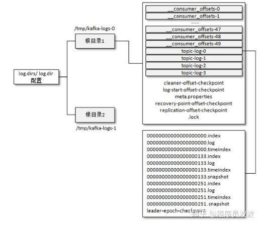

# 五、日志存储

## 5.1 文件目录布局

不考虑多副本的情况，一个分区对应一个日志（Log）。为了防止 Log 过大，Kafka又引入了日志分段（LogSegment）的概念，将Log切分为多个LogSegment，相当于一个巨型文件被平均分配为多个相对较小的文件，这样也便于消息的维护和清理。

事实上，Log 和LogSegment 也不是纯粹物理意义上的概念，Log 在物理上只以文件夹的形式存储，而每个LogSegment 对应于磁盘上的一个日志文件和两个索引文件，以及可能的其他文件（比如以“.txnindex”为后缀的事务索引文件）。

图5-1 日志关系

向Log 中追加消息时是顺序写入的，只有最后一个 LogSegment 才能执行写入操作，在此之前所有的 LogSegment 都不能写入数据。

消费者提交的位移是保存在 Kafka 内部的主题__consumer_offsets中的，初始情况下这个主题并不存在，当第一次有消费者消费消息时会自动创建这个主题。

图5-2 文件目录布局

## 5.2 日志格式的演变

## 5.3 日志索引

每个日志分段文件对应了两个索引文件，主要用来提高查找消息的效率。

偏移量索引文件用来建立消息偏移量（offset）到物理地址之间的映射关系，方便快速定位消息所在的物理文件位置；时间戳索引文件则根据指定的时间戳（timestamp）来查找对应的偏移量信息。

Kafka 中的索引文件以稀疏索引（sparse index）的方式构造消息的索引，它并不保证每个消息在索引文件中都有对应的索引项。

稀疏索引通过MappedByteBuffer将索引文件映射到内存中，以加快索引的查询速度。

### 5.3.1 偏移量索引

偏移量索引项的格式如图5-8所示。每个索引项占用8个字节，分为两个部分。

（1）relativeOffset：相对偏移量，表示消息相对于baseOffset 的偏移量，占用4 个字节，当前索引文件的文件名即为baseOffset的值。

（2）position：物理地址，也就是消息在日志分段文件中对应的物理位置，占用4个字节。

### 5.3.2 时间戳索引

每个索引项占用12个字节，分为两个部分。

（1）timestamp：当前日志分段最大的时间戳。

（2）relativeOffset：时间戳所对应的消息的相对偏移量。

## 5.4 日志清理

Kafka提供了两种日志清理策略。

（1）日志删除（Log Retention）：按照一定的保留策略直接删除不符合条件的日志分段。（2）日志压缩（Log Compaction）：针对每个消息的key进行整合，对于有相同key的不同value值，只保留最后一个版本。

可以通过broker端参数log.cleanup.policy来设置日志清理策略，此参数的默认值为“delete”，即采用日志删除的清理策略。如果要采用日志压缩的清理策略，就需要将log.cleanup.policy设置为“compact”，并且还需要将log.cleaner.enable（默认值为true）设定为true。通过将log.cleanup.policy参数设置为“delete，compact”，还可以同时支持日志删除和日志压缩两种策略。

### 5.4.1 日志删除

在Kafka的日志管理器中会有一个专门的日志删除任务来周期性地检测和删除不符合保留条件的日志分段文件，这个周期可以通过broker端参数log.retention.check.interval.ms来配置，默认值为300000，即5分钟。

当前日志分段的保留策略有3种：基于**时间**的保留策略、基于**日志大小**的保留策略和基于**日志起始偏移量**的保留策略。

### 5.4.2 日志压缩

## 5.5 磁盘存储

Kafka 在设计时采用了**文件追加**的方式来写入消息，即只能在日志文件的尾部追加新的消息，并且也不允许修改已写入的消息，这种方式属于典型的顺序写盘的操作，所以就算 Kafka使用磁盘作为存储介质，它所能承载的吞吐量也不容小觑。

### 5.5.1 页缓存

Kafka 中大量使用了**页缓存**，这是 Kafka 实现高吞吐的重要因素之一。

虽然消息都是先被写入页缓存，然后由操作系统负责具体的刷盘任务的，但在Kafka中同样提供了同步刷盘及间断性强制刷盘（fsync）的功能，这些功能可以通过 log.flush.interval.messages、[log.flush.interval.ms](https://link.zhihu.com/?target=http%3A//log.flush.interval.ms) 等参数来控制。

### 5.5.2 磁盘I/O流程

### 5.5.3 零拷贝

除了消息顺序追加、页缓存等技术，Kafka还使用**零拷贝**（Zero-Copy）技术来进一步提升性能。

所谓的零拷贝是指将数据直接从磁盘文件复制到网卡设备中，而不需要经由应用程序之手。零拷贝大大提高了应用程序的性能，减少了内核和用户模式之间的上下文切换。

对 Linux操作系统而言，零拷贝技术依赖于底层的 sendfile（）方法实现。对应于 Java 语言，FileChannal.transferTo（）方法的底层实现就是sendfile（）方法。