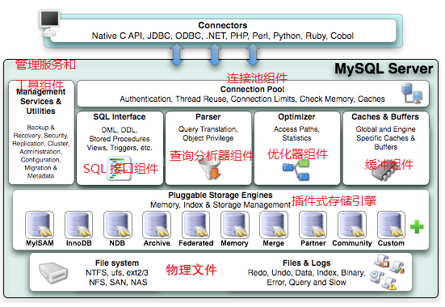

# 第一章：MySQL 体系结构和存储引擎

[TOC]

## 一、数据库和实例

- 数据库：**物理操作系统文件或其他形式文件类型的集合。**  数据库文件可以是 fun、MYD、MYI、ibd 结尾的文件。当使用 NDB 引擎时， 该文件是存放于内存而不是操作系统之中的文件。
- 实例： **MySQL 数据库由后台线程以及一个共享内存区组成**。 共享内存可以被运行的后台线程所共享。 **数据库实例才是真正用于操作数据库文件的**。

> 数据库是文件的集合（通常就是二进制文件），是依照某种数据模型组织起来并存放于二级存储器中的数据集合；
>
> 数据库实例是程序，是位于用户与操作系统之间的一层数据管理软件，用户对数据库数据的任何操作，包括数据库定义、数据查询、数据维护、数据库运行控制等都是在数据库实例下进行的，应用程序只有通过数据库实例才能和数据库打交道。【数据库系统与文件系统很大的一个不同之处在于对事务的支持】

- **实例与数据库的关系通常是一一对应的，但在集群情况下可能存在一个数据库被多个数据实例使用的情况**。
- **MySQL 是一个单进程多线程架构的数据库，MySQL 数据库实例在系统上的表现就是一个进程**。
- 当启动实例时， MySQL 数据库会去读取配置文件， 根据配置文件的参数来启动数据库实例。如果没有配置文件，  MySQL 会按照编译时的默认参数设置启动实例。 用 `mysql --help I grep my.cnf` 命令可以查看当 MySQL 数据库实例启动时配置， 会在`/etc/my.cnf`、  `/etc/mysql/my.cnf`  `/usr/etc/my.cnf` 、 `/export/servers/mysql/etc/my.cnf` 、`~/.my.cnf` 位置**依次**查找配置文件，**重复参数以最后为准**。

- 配置文件中的 `datadir` 指定了数据库所在路径。`show variables like 'datadir';`，结果目录本质上为一个链接，链接是指向 `/opt/mysql_data` 目录，所以得有该目录的用户和权限。

docker 中启动命令：`docker run -p3306:3306 --name XXX -e MYSQL_ROOT_PASSWORD=XXX 镜像ID`，其中镜像 ID 使用 `docker images` 查看；

进入 MySQL：`docker ps`，然后执行 `docker exec -it 容器ID /bin/bash`

## 二、MySQL 体系结构

MySQL 大体可以分为 Server 层和存储引擎层两部分。

- Server 层包括连接器、查询缓存、分析器、优化器、执行器等，以及所有的内置函数（如日期、时间、数学和加密函数等），**所有跨存储引擎的功能都在这一层实现，比如存储过程、触发器、视图等。**

- 存储引擎层负责数据的存储和提取。其架构模式是插件式的，5.5.8 之后 InnoDB 为默认存储引擎。==存储引擎是基于表的，不是数据库。==



### 一条 SQL 语句的执行过程


以 `mysql> select * from T where ID=10；` 为例

#### 步骤一：连接器

第一步先通过连接器连接到这个数据库上。**连接器负责跟客户端建立连接、获取权限、维持和管理连接。**连接命令通常为：`mysql -h$ip -P$port -u$userName -p` 然后输入密码。

连接命令中的 **mysql 是客户端工具**，用来跟服务端建立连接。在完成经典的 TCP 握手后，连接器就要开始认证你的身份，这个时候用的就是你输入的用户名和密码。

- 如果用户名或密码不对，你就会收到一个"Access denied for user"的错误，然后客户端程序结束执行。
- 如果用户名密码认证通过，**连接器会到权限表里面查出你拥有的权限**。之后，这个连接里面的权限判断逻辑，都将依赖于此时读到的权限。所以用户连接成功建立之后，即是修改该用户权限也只有再次连接时候才能生效。

连接完成后，如果你没有后续的动作，这个连接就处于空闲状态，你可以在 `show processlist` 命令中看到它。Command 列显示为「Sleep」的这一行，就表示现在系统里面有一个空闲连接。


客户端如果太长时间没动静，连接器就会自动将它断开。参数 wait_timeout 控制该时间（默认 8 小时）。如果在连接被断开之后，客户端再次发送请求的话，就会收到一个错误提醒： Lost connection to MySQL server during query。这时候如果你要继续，就需要重连，然后再执行请求了。

长连接是指连接成功后，如果客户端持续有请求，则一直使用同一个连接。短连接则是指每次执行完很少的几次查询就断开连接，下次查询再重新建立一个。因为建立连接过程复杂，应该尽量使用长连接。

但是全部使用长连接后，有些时候 MySQL 占用内存涨得特别快，这是因为 **MySQL在执行过程中临时使用的内存是管理在连接对象里面的。这些资源会在连接断开的时候才释放**。所以如果长连接累积下来，可能导致内存占用太大，被系统强行杀掉（OOM），从现象看就是MySQL异常重启了。

解决方案：

- 定期断开长连接。使用一段时间，或者程序里面判断执行过一个占用内存的大查询后，断开连接，之后要查询再重连。

- 如果你用的是MySQL 5.7或更新版本，可以在每次执行一个比较大的操作后，通过执行 `mysql_reset_connection` 来重新初始化连接资源。这个过程不需要重连和重新做权限验证，但是会将连接恢复到刚刚创建完时的状态。

#### 步骤二：查询缓存

连接建立完成后，开始执行 select 语句了。执行逻辑就会来到第二步：查询缓存。

MySQL 拿到一个查询请求后，会先到查询缓存看看，之前是不是执行过这条语句。**之前执行过的语句及其结果可能会以 key-value 对的形式，被直接缓存在内存中。key 是查询的语句，value 是查询的结果**。如果能查到 key 则直接将 value 返回给客户端。

如果语句不在查询缓存中，就会继续后面的执行阶段。执行完成后，执行结果会被存入查询缓存中。

**使用查询缓存的弊端**：

查询缓存的失效非常频繁**，只要有对一个表的更新，这个表上所有的查询缓存都会被清空**。导致缓存中的结果还没有使用就被清空了，针对更新压力大的数据库造成查询缓存的命中率比较低。除非你的业务就是有一张静态表（如系统配置表），很长时间才会更新一次。

可以通过将参数 `query_cache_type` 设置成 `DEMAND`，这样**对于默认的 SQL 语句都不使用查询缓存。而对于你确定要使用查询缓存的语句，可以用 SQL_CACHE 显式指定**，像下面这个语句一样：

```
mysql> select SQL_CACHE * from T where ID=10；
```

注意：MySQL 5.6 开始默认关闭，支持到 5.7 结束， 8.0 版本直接将查询缓存的整块功能删掉了。[官方回应](https://mysqlserverteam.com/mysql-8-0-retiring-support-for-the-query-cache/)。

查询有没有开启查询缓存命令为：

```sql
mysql> show variables like '%query_cache%';
+------------------------------+---------+
| Variable_name                | Value   |
+------------------------------+---------+
| have_query_cache             | YES     |      --查询缓存是否可用
| query_cache_limit            | 1048576 |      --可缓存具体查询结果的最大值
| query_cache_min_res_unit     | 4096    |      --查询缓存分配的最小块的大小(字节)
| query_cache_size             | 599040  |      --查询缓存的大小
| query_cache_type             | ON      |      --是否支持查询缓存
| query_cache_wlock_invalidate | OFF     |      --控制当有写锁加在表上的时候，是否先让该表相关的 Query Cache失效
+------------------------------+---------+
6 rows in set (0.02 sec)
```


#### 步骤三：分析器

如果没有命中查询缓存，就要开始真正执行语句了。首先，MySQL需要知道你要做什么，因此需要对SQL语句做解析。

- 步骤一：分析器先会做「词法分析」。你输入的是由多个字符串和空格组成的一条SQL语句，MySQL需要识别出里面的字符串分别是什么，代表什么。MySQL 从输入的「select」这个关键字识别出来，这是一个查询语句。它也要把字符串「T」识别成「表名 T」，把字符串「ID」识别成「列 ID」。

- 步骤二：识别完成之后开始进行「语法分析」。根据词法分析的结果，语法分析器会根据语法规则，判断你输入的这个 SQL 语句是否满足MySQL语法。如果你的语句不对，就会收到 `You have an error in your SQL syntax` 的错误提醒。

  一般语法错误会提示第一个出现错误的位置，所以你要关注的是紧接“use near”的内容。

#### 步骤四：优化器

经过了分析器，MySQL就知道你要做什么了。在开始执行之前，还要先经过优化器的处理。

**优化器是在表里面有多个索引的时候，决定使用哪个索引；或者在一个语句有多表关联（join）的时候，决定各个表的连接顺序**。比如你执行下面这样的语句，这个语句是执行两个表的 join：

```sql
mysql> select * from t1 join t2 using(ID)  where t1.c=10 and t2.d=20;
```

- 既可以先从表 t1 里面取出 c=10 的记录的 ID 值，再根据 ID 值关联到 t2，再判断 t2 里面 d 的值是否等于 20。
- 也可以先从表 t2 里面取出 d=20 的记录的 ID 值，再根据 ID 值关联到 t1，再判断 t1 里面 c 的值是否等于 10。

这两种执行方法的逻辑结果是一样的，但是执行的效率会有不同，而优化器的作用就是决定选择使用哪一个方案。

优化器阶段完成后，这个语句的执行方案就确定下来了，然后进入执行器阶段。优化器是怎么选择索引的，有没有可能选择错等等，会在后面的文章中单独展开说明优化器的内容。

#### 步骤五：执行器

MySQL 通过分析器知道了你要做什么，通过优化器知道了该怎么做，于是就进入了执行器阶段，开始执行语句。

开始执行的时候，要先判断一下你对这个表 T 有没有执行查询的**权限**【因为有些时候，SQL 语句要操作的表不只是 SQL 字面上那些。比如如果有个触发器，得在执行器阶段（过程中）才能确定。所以还得验证权限】，如果没有，就会返回没有权限的错误，如下所示(在工程实现上，如果命中查询缓存，会在查询缓存放回结果的时候，做权限验证。查询也会在优化器之前调用precheck验证权限)。

```mysql
mysql> select * from T where ID=10;

ERROR 1142 (42000): SELECT command denied to user 'b'@'localhost' for table 'T'
```

如果有权限，就打开表继续执行。打开表的时候，执行器就会根据表的引擎定义，去使用这个引擎提供的接口。

比如我们这个例子中的表T中，ID字段没有索引，那么执行器的执行流程是这样的：

- 调用InnoDB引擎接口取这个表的第一行，判断ID值是不是10，如果不是则跳过，如果是则将这行存在结果集中；

- 调用引擎接口取“下一行”，重复相同的判断逻辑，直到取到这个表的最后一行。

- 执行器将上述遍历过程中所有满足条件的行组成的记录集作为结果集返回给客户端。

至此，这个语句就执行完成了。

对于有索引的表，执行的逻辑也差不多。第一次调用的是“取满足条件的第一行”这个接口，之后循环取“满足条件的下一行”这个接口，这些接口都是引擎中已经定义好的。

你会在数据库的慢查询日志中看到一个 `rows_examined` 的字段，表示这个语句执行过程中扫描了多少行。这个值就是在执行器每次调用引擎获取数据行的时候累加的。

在有些场景下，执行器调用一次，在引擎内部则扫描了多行，因此**引擎扫描行数跟rows_examined并不是完全相同的。**我们后面会专门有一篇文章来讲存储引擎的内部机制，里面会有详细的说明。


## 三、MySQL 存储引擎

可以通过 `SHOW ENGINES` 语句或者 `information_schema` 架构下的 ENGINES 表查看当前使用的 MySQL 数据库所支持的存储引擎。

插件式存储引擎的好处： 每个存储引擎都有各自的特点，能够根据具体的应用建立不同存储引擎表，或者自定义。

### （一）InnoDB

- InnoDB **支持事务**，主要**面向在线事务处理(OLTP，online Transaction Processing)的应用**。其特点是**行锁设计、支持外键**，并支持「非锁定读」即默认读取操作不会产生锁。**是默认的存储引擎**。

- **InnoDB存储引擎将数据放在一个逻辑的表空间中并进行管理**，同时每个表单独存放到一个独立的 ibd 文件中。
- InnoDB 通过使用多版本并发控制（MVCC）来获得高并发性，并且实现了 SQL 标准的 4 种隔离级别， 默认为 REPEATABLE 级别。同时，使用 next-key locking 策略来避免幻读（phantom）现象的产生。
- 除此之外，提供了插入缓冲（insert buffer）、二次写（double write）、 自适应哈希索引（adaptive hash index）、预读（read ahead）等高性能和高可用的功能。

- 采用聚集（clustered）的方式存储表中的数据，因此每张表的存储都是按主键的顺序进行存放。**如果没有显式地在表定义时指定主键，InnoDB 会为每一行生成一个 6 字节的 ROWID，并以此作为主键。**

### （二）MyISAM

- MyISAM **不支持事务**（并不是所有应用都需要的，例如仅仅查询），表锁设计， **支持全文索引**，主要面向一些 OLAP 数据库应用。
- **它的缓冲池只缓存索引文件，而不缓冲数据文件，数据文件的缓存交由操作系统本身来完成，这与其他使用 LRU 算法缓存数据的大部分数据库大不相同。**

- **MyISAM 存储引擎表由 MYD （存放数据文件）和 MYI （存放索引文件）组成**。可以使用  myisampack 工具（使用赫夫曼编码静态算法）来压缩数据文件，压缩后的表是只读的，也可以通过 myisampack 来解压数据文件。 

- 5.0 版本之后 MylSAM 默认支持 256TB 的单表数据。

### （三）NDB 

- **NDB 存储引擎是一个集群存储引擎**，其结构是 share nothing 的集群架构，因此具有更高的可用性。**NDB 的特点是数据全部放在内存中**（ 5.1 之后可以将非索引数据放在磁盘上），因此主键查找的速度极快，并且通过添加 NDB 数据存储节点(Data Node)可以线性地提高数据库性能，是高可用、高性能的集群系统。
-  **NDB 存储引擎的连接操作(JOIN)是在 MySQL数据库层完成的，而不是在存储引擎层完成的**。因为复杂的连接操作需要巨大的网络开销，因此查询速度很慢。

### （四）Memory

- **Memory（HEAP）存储引擎将表中的数据存放在内存中，速度较快，如果数据库重启或发生崩溃，表中的数据都将消失。适合用于存储临时数据的临时表，以及数据仓库中的纬度表。**

- **默认使用哈希索引而非 B+ 树索引。**

- **只支持表锁，并发性能较差，并且不支持 TEXT 和 BLOB 列类型**。同时存储变长字段（varchar）时是按照定长字段（char）的方式进行的，因此会浪费内存（可通过 patch 方法解决该问题）。 

- MySQL 数据库使用 Memory 存储引擎作为临时表来存放查询的中间结果集。**如果中间结果集大于 Memory 存储引擎表的容量设置，又或者中间结果含有 TEXT 或  BLOB列类型字段，则 MySQL 数据库会把其转换到 MylSAM 存储引擎表而存放到磁盘中。之前提到 MyISAM 不缓存数据文件，因此这时产生的临时表的性能对与查询会有损失。**

### （五）Archive

- Archive 存储引擎只支持 INSERT 和 SELECT 操作， 从 5.1 开始支持索引。
- 使用 zlib 算法将数据行进行压缩后存储， 压缩比一般可达 1:10。
- **非常适合存储归档数据，如日志信息**。使用行锁来实现高并发的插入操作，但是其本身并不是事务安全的存储引擎，其设计目标主要是提供高速的插入和压缩功能。

。。。。。等等存储引擎

### （六）常见问题

- MySQL 数据库的 MylSAM、InnoDB(1.2版本）和 Sphinx 存储引擎都支持全文索引。

- MySQL 是数据库，不是文件，随着数据行数的增加， 性能当然会有所下降，但不是线性下降，如果用户选择了正确的存储引擎与配置， 再多的数据量 MySQL 也能承受。


## 四、连接 MySQL

**连接 MySQL 操作是一个连接进程和 MySQL 数据库实例进行通信，本质上就是进程通信**。常用的进程通信方式有管道、命名管道、命名字、TCP/IP套接字、UNIX域套接字。MySQL 数据库提供的连接方式从本质上看都是上述提及的进程通信方式。

- TCP/IP 套接字方式是 MySQL 数据库在任何平台下都提供的连接方式，这种方式在 TCP/IP 连接上建立一个基于网络的连接请求，一般情况下客户端(client)在一台服务器 上，而MySQL 实例(server)在另一台服务器上，这两台机器通过一个TCP/IP网络连接：`mysql -h192.168.0.1 -u XXXX -p`
  
    在通过 TCP/IP 连接到 MySQL 实例时， MySQL 数据库会先检查一张权限视图， 用来判断发起请求的客户端 IP 是否允许连接到 MySQL 实例。 该视图在 mysql 架构下， 表名为 user。里面包括可以连接的 host（IP 地址）、用户名和密码，如果想看可是 select 看一下。
    
- 命名管道和共享内存：

    Windows 下面如果两个需要进程通信的进程**在同一台服务器上**， 那么可以使用命名管道，在 MySQL 数据库中须在配置文件中启用 `--enable-named-pipe`选项。如果使用共享内存的连接方式：使用 `--protocol=memory` 选项。

- UNIX 域套接字

    在 Linux 和 UNIX 环境下， 还可以使用 UNIX 域套接字。UNIX 域套接字其实不是一个网络协议， 所以只能在 MySQL 客户端和数据库实例**在一台服务器上**的情况下使用。
    用户可以在配置文件中指定套接字文件的路径， 如 `--socket=/tmp/mysql.sock`。