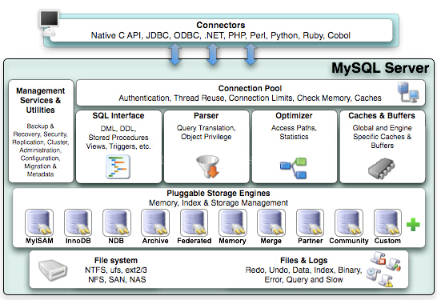

# 第一章：MySQL 体系结构和存储引擎

## 1.1 定义数据库和实例

- 数据库：**物理操作系统文件或其他形式文件类型的集合。** 在MySQL数据库中， 数据库文件可以是 fun、MYD、MYI、ibd 结尾的文件。当使用 NDB 引擎时， 数据库的文件可以是存放于内存之中的文件。
- 实例： **MySQL 数据库由后台线程以及一个共享内存区组成**。 共享内存可以被运行的后台线程所共享。 **数据库实例才是真正用于操作数据库文件的**。

> 数据库是文件的集合，是依照某种数据模型组织起来并存放于二级存储器中的数据集合；数据库实例是程序，是位
> 千用户与操作系统之间的一层数据管理软件，用户对数据库数据的任何操作，包括数据库定义、数据查询、数据维护、数据库运行控制等都是在数据库实例下进行的，应用程序只有通过数据库实例才能和数据库打交道。【数据库系统与文件系统很大的一个不同之处在千对事务的支持】

在MySQL数据库中， 实例与数据库的关系通常是一一对应的，但在集群情况下可能存在一个数据库被多个数据实例使用的情况。

MySQL被设计为一个单进程多线程架构的数据库，数据库实例在系统上的表现就是一个进程。

当启动实例时， MySQL 数据库会去读取配置文件， 根据配置文件的参数来启动数据库实例。在 MySQL 数据库中，可以没有配置文件， 在这种悄况下， MySQL 会按照编译时的默认参数设置启动实例。 用`mysql --help I grep my.cnf`命令可以查看当 MySQL 数据库实例启动时， 会在`/etc/my.cnf /etc/mysql/my.cnf /usr/local/mysql/etc/my.cnf ~/.my.cnf`位置依次查找配置文件，重复参数以最后为准。

## 1.2 MySQL 体系结构

MySQL 大体可以分为Server层和存储引擎层两部分。

- Server层包括连接器、查询缓存、分析器、优化器、执行器等，涵盖MySQL的大多数核心服务功能，以及所有的内置函数（如日期、时间、数学和加密函数等），**所有跨存储引擎的功能都在这一层实现，比如存储过程、触发器、视图等。**

- 而存储引擎层负责数据的存储和提取。其架构模式是插件式的，支持InnoDB、MyISAM、Memory等多个存储引擎。5.5 之后 InnoDB 为默认。




- 连接池组件
- 管理服务和工具组件
- SQL接口组件
- 查询分析器组件
- 优化器组件
- 缓冲(Cache) 组件
- 插件式存储引擎
- 物理文件

MySQL数据库区别千其他数据库的最重要的一个特点就是其**插件式的表存储引擎**。MySQL插件式的存储引擎架构提供了一系列标准的管理和服务支持，这些标准与存储引擎本身无关，可能是每个数据库系统本身都必需的，如 SQL分析器和优化器等，而存储引擎是底层物理结构的实现， 每个存储引擎开发者可以按照自己的意愿来进行开发。
**需要特别注意的是，存储引擎是基千表的，而不是数据库。**

### 一条 SQL 语句的执行过程

以 `mysql> select * from T where ID=10；` 为例

#### 步骤一：连接器

第一步先连接到这个数据库上，这时候接待你的就是连接器。**连接器负责跟客户端建立连接、获取权限、维持和管理连接。**连接命令一般是这么写的，然后输入密码即可。

```
mysql -h$ip -P$port -u$user -p
```

连接命令中的mysql是客户端工具，用来跟服务端建立连接。在完成经典的TCP握手后，连接器就要开始认证你的身份，这个时候用的就是你输入的用户名和密码。

- 如果用户名或密码不对，你就会收到一个"Access denied for user"的错误，然后客户端程序结束执行。
- 如果用户名密码认证通过，**连接器会到权限表里面查出你拥有的权限**。之后，这个连接里面的权限判断逻辑，都将依赖于此时读到的权限。所以用户连接成功建立之后，即是修改该用户权限也只有再次连接时候才能生效。

连接完成后，如果你没有后续的动作，这个连接就处于空闲状态，你可以在show processlist命令中看到它。文本中这个图是show processlist的结果，其中的Command列显示为“Sleep”的这一行，就表示现在系统里面有一个空闲连接。


客户端如果太长时间没动静，连接器就会自动将它断开。这个时间是由参数wait_timeout控制的，默认值是8小时。如果在连接被断开之后，客户端再次发送请求的话，就会收到一个错误提醒： Lost connection to MySQL server during query。这时候如果你要继续，就需要重连，然后再执行请求了。

数据库里面，长连接是指连接成功后，如果客户端持续有请求，则一直使用同一个连接。短连接则是指每次执行完很少的几次查询就断开连接，下次查询再重新建立一个。

建立连接的过程通常是比较复杂的，所以我建议你在使用中要尽量减少建立连接的动作，也就是尽量使用长连接。

但是全部使用长连接后，你可能会发现，有些时候MySQL占用内存涨得特别快，这是因为MySQL在执行过程中临时使用的内存是管理在连接对象里面的。这些资源会在连接断开的时候才释放。所以如果长连接累积下来，可能导致内存占用太大，被系统强行杀掉（OOM），从现象看就是MySQL异常重启了。

怎么解决这个问题呢？你可以考虑以下两种方案。

1. 定期断开长连接。使用一段时间，或者程序里面判断执行过一个占用内存的大查询后，断开连接，之后要查询再重连。
2. 如果你用的是MySQL 5.7或更新版本，可以在每次执行一个比较大的操作后，通过执行 mysql_reset_connection来重新初始化连接资源。这个过程不需要重连和重新做权限验证，但是会将连接恢复到刚刚创建完时的状态。

#### 步骤二：查询缓存

连接建立完成后，你就可以执行select语句了。执行逻辑就会来到第二步：查询缓存。

MySQL拿到一个查询请求后，会先到查询缓存看看，之前是不是执行过这条语句。**之前执行过的语句及其结果可能会以key-value对的形式，被直接缓存在内存中。key是查询的语句，value是查询的结果**。如果你的查询能够直接在这个缓存中找到key，那么这个value就会被直接返回给客户端。

如果语句不在查询缓存中，就会继续后面的执行阶段。执行完成后，执行结果会被存入查询缓存中。你可以看到，如果查询命中缓存，MySQL不需要执行后面的复杂操作，就可以直接返回结果，这个效率会很高。

**但是大多数情况下我会建议你不要使用查询缓存，为什么呢？因为查询缓存往往弊大于利。**

查询缓存的失效非常频繁**，只要有对一个表的更新，这个表上所有的查询缓存都会被清空**。因此很可能你费劲地把结果存起来，还没使用呢，就被一个更新全清空了。对于更新压力大的数据库来说，查询缓存的命中率会非常低。除非你的业务就是有一张静态表，很长时间才会更新一次。比如，一个系统配置表，那这张表上的查询才适合使用查询缓存。

好在MySQL也提供了这种“按需使用”的方式。你可以将参数query_cache_type设置成DEMAND，这样**对于默认的SQL语句都不使用查询缓存。而对于你确定要使用查询缓存的语句，可以用SQL_CACHE显式指定**，像下面这个语句一样：

```
mysql> select SQL_CACHE * from T where ID=10；
```

需要注意的是，MySQL 8.0版本直接将查询缓存的整块功能删掉了，也就是说8.0开始彻底没有这个功能了。

#### 步骤三：分析器

如果没有命中查询缓存，就要开始真正执行语句了。首先，MySQL需要知道你要做什么，因此需要对SQL语句做解析。

分析器先会做“词法分析”。你输入的是由多个字符串和空格组成的一条SQL语句，MySQL需要识别出里面的字符串分别是什么，代表什么。

MySQL从你输入的"select"这个关键字识别出来，这是一个查询语句。它也要把字符串“T”识别成“表名T”，把字符串“ID”识别成“列ID”。

做完了这些识别以后，就要做“语法分析”。根据词法分析的结果，语法分析器会根据语法规则，判断你输入的这个SQL语句是否满足MySQL语法。

如果你的语句不对，就会收到“You have an error in your SQL syntax”的错误提醒，比如下面这个语句select少打了开头的字母“s”。

```
mysql> elect * from t where ID=1;

ERROR 1064 (42000): You have an error in your SQL syntax; check the manual that corresponds to your MySQL server version for the right syntax to use near 'elect * from t where ID=1' at line 1
```

一般语法错误会提示第一个出现错误的位置，所以你要关注的是紧接“use near”的内容。

#### 步骤四：优化器

经过了分析器，MySQL就知道你要做什么了。在开始执行之前，还要先经过优化器的处理。

优化器是在表里面有多个索引的时候，决定使用哪个索引；或者在一个语句有多表关联（join）的时候，决定各个表的连接顺序。比如你执行下面这样的语句，这个语句是执行两个表的join：

```
mysql> select * from t1 join t2 using(ID)  where t1.c=10 and t2.d=20;
```

- 既可以先从表t1里面取出c=10的记录的ID值，再根据ID值关联到表t2，再判断t2里面d的值是否等于20。
- 也可以先从表t2里面取出d=20的记录的ID值，再根据ID值关联到t1，再判断t1里面c的值是否等于10。

这两种执行方法的逻辑结果是一样的，但是执行的效率会有不同，而优化器的作用就是决定选择使用哪一个方案。

优化器阶段完成后，这个语句的执行方案就确定下来了，然后进入执行器阶段。如果你还有一些疑问，比如优化器是怎么选择索引的，有没有可能选择错等等，没关系，我会在后面的文章中单独展开说明优化器的内容。

#### 步骤五：执行器

MySQL通过分析器知道了你要做什么，通过优化器知道了该怎么做，于是就进入了执行器阶段，开始执行语句。

开始执行的时候，要先判断一下你对这个表T有没有执行查询的**权限**【因为有些时候，SQL语句要操作的表不只是SQL字面上那些。比如如果有个触发器，得在执行器阶段（过程中）才能确定。所以还得验证权限】，如果没有，就会返回没有权限的错误，如下所示(在工程实现上，如果命中查询缓存，会在查询缓存放回结果的时候，做权限验证。查询也会在优化器之前调用precheck验证权限)。

```mysql
mysql> select * from T where ID=10;

ERROR 1142 (42000): SELECT command denied to user 'b'@'localhost' for table 'T'
```

如果有权限，就打开表继续执行。打开表的时候，执行器就会根据表的引擎定义，去使用这个引擎提供的接口。

比如我们这个例子中的表T中，ID字段没有索引，那么执行器的执行流程是这样的：

1. 调用InnoDB引擎接口取这个表的第一行，判断ID值是不是10，如果不是则跳过，如果是则将这行存在结果集中；
2. 调用引擎接口取“下一行”，重复相同的判断逻辑，直到取到这个表的最后一行。
3. 执行器将上述遍历过程中所有满足条件的行组成的记录集作为结果集返回给客户端。

至此，这个语句就执行完成了。

对于有索引的表，执行的逻辑也差不多。第一次调用的是“取满足条件的第一行”这个接口，之后循环取“满足条件的下一行”这个接口，这些接口都是引擎中已经定义好的。

你会在数据库的慢查询日志中看到一个rows_examined的字段，表示这个语句执行过程中扫描了多少行。这个值就是在执行器每次调用引擎获取数据行的时候累加的。

在有些场景下，执行器调用一次，在引擎内部则扫描了多行，因此**引擎扫描行数跟rows_examined并不是完全相同的。**我们后面会专门有一篇文章来讲存储引擎的内部机制，里面会有详细的说明。


## 1.3 MySQL 存储引擎

可以通过 `SHOW ENGINES` 语句查看当前使用的 MySQL 数据库所支持的存储引擎，

存储引擎的好处： 每个存储引擎都有各自的特点，能够根据具体的应用建立不同存储引擎表，或者自定义。

- InnoDB

    InnoDB **支持事务**，主要**面向在线事务处理(OLTP)的应用**。其特点是**行锁设计、支持外键**，并支持非锁定 读即默认 读取操作不会产生锁。**是默认的存储引擎**。

    **InnoDB存储引擎将数据放在一个逻辑的表空间中并进行管理**，同时表单独存放到一个独立的 ibd文件中。此外支持用裸设备(row disk)用来建立其表空间。
    InnoDB通过使用多版本并发控制(MVCC)来获得高并发性，并且实现了SQL标准的4种隔离级别， 默认为REPEATABLE级别。同时，使用 一种被称为next-key locking的策略来避免幻读(phantom)现象的产生。除此之外，InnoDB储存引擎 还提供了插人缓冲(insert buff er)、二次写(double write)、 自适应哈希索引(adaptive hash
    index)、预读(read ahead)等高性能和高可用的功能。

    对于表中数据的存储，InnoDB存储引擎采用了聚集(clustered)的方式，因此每张表的存储都是按主键的顺序进行存放。**如果没有显式地在表定义时指定 主键，InnoDB存储引擎会为每一 行生成一个6字节的 ROWID, 并以此作为主键。**

- MyISAM

    MyISAM **不支持事务**（并不是所有应用都需要的，例如仅仅查询）、表锁设计， 支持全文索引，主要面向一些OLAP 数据库应用。**它的缓冲池只 缓存(cache)索引文件，而不缓冲数据文件，数据文件的缓存交由操作系统本身来完成，这与其他使用 LRU 算法缓存数据的大部分数据库大不相同。**

    MyISAM 存储引擎表由 MYD （存放数据文件）和 MYI （存放索引文件）组成，可以通过使用 myisampack工具来进一步压缩数据文件，该工具使用赫夫曼(Huffma n)编码静态算法来压缩数据，因此使用myis ampack工具压缩后的表是只读的，当然用户也可以通过myisampack来解压数据文件。 

    5.0 之后MylSAM默认支持256TB的单 表 数据。

- NDB 

    **NDB 存储引擎是一个集群存储引擎**，其结构是 share nothing 的集群架构，因此能提供更高的可用性。**NOB 的特点是数据全部放在内存中**（ 5.1 之后可以将非索引数据放在 磁盘上），因此主键查找的速度极快，并且通过添加 NOB 数据存储节点(Data Node)可以线性地提高数据库性能，是高可用、高性能的集群系统。
     **NDB存储引擎的连接操作(JOIN)是在 MySQL数据库层完成的，而不是在存储引擎层完成的**。这意味着，复杂的连接操作需要巨大的网络开销，因此查询速度很慢。

- Memory

    **Memory（HEAP）存储引擎将表中的数据存放在内存中，速度较快，如果数据库重启或发生崩溃，表中的数据都将消失。它非常适合用千存储临时数据的临时表，以及数据仓库中的纬度表。Memory 存储引擎默认使用哈希索引。**

    该存储引擎**只支持表锁，并发性能较差，并且不支持 TEXT 和 BLOB 列类型**。同时存储变长字段(varchar)时是按照定常字段(char)的方式进行的，因此会浪费内存。 

    MySQL 数据库使用 Memory 存储引擎作为临时表来存放查询的中间结果集(intermediate result)。**如果中间结果集大于 Memory 存储引擎表的容量设置，又或者中间结果含有 TEXT 或  BLOB列类型字段，则 MySQL 数据库会把其转换到 MylSAM 存储引擎表而存放到磁盘中。之前提到 MyISAM 不缓存数据文件，因此这时产生的临时表的性能对与查询会有损失。**

- Archive

    Archive 存储引擎只支持 INSERT 和 SELECT 操作， 从 5.1开始支持索引。Archive 存储引擎使用 zlib 算法将数据行进行压缩后存储， 压缩比一般可达 1:10。正如其名字所示，**Archive 存储引擎非常适合存储归档数据，如日志信息**。Archive存储引擎使用行锁来实现高并发的插入操作，但是其本身并不是事务安全的存储引擎，其设计目标主要是提供高速的插入和压缩功能。

。。。。。

MySQL数据库 支持全文索引？MylSAM、InnoDB(1.2版本）和Sphinx存储引擎都支持全文索引。

MySQL数据库速度快是因为不支持 事务？错！虽然MySQL的 MyISAM存储引擎不支持事务，但是InnoDB 支持。“快” 是相对于不同应用来说的，对于ETL这种操作，MyISAM会有其优势，但在OLTP环境中，InnoDB存储引擎的效率更好。

当表的数据散大千1000万时MySQL的性能会急剧下降吗？不! MySQL是数据库， 不是文件， 随着数据行数的增加， 性能当然会有所下降， 但是这些下降不是线性的， 如果用户选择了正确的存储引擎， 以及正确的配置， 再多的数据量MySQL也能承受


## 1.5 连接 MySQL

连接MySQL操作是一个连接进程和MySQL数据库实例进行通信，本质上就是进程通信。常用的进程通信方式有管道、命名管道、命名字、TCP/IP套接字、UNIX域套接字。MySQL数据库提供的连接方式从本质上看都是上述提及的进程通信方式。

- TCP/IP套接字方式是MySQL数据库在任何平台下都提供的连接方式，这种方式在TCP/IP连接上建立一个基千网络的连接请求，一般情况下客户端(client)在一台服务器 上，而MySQL 实例(server)在另一台服务器
    上，这两台机器通过一个TCP/IP网络连接

    `mysql -h192.168.0.1 -u XXXX -p`

    在通过TCP/I P连接到MySQL实例时， MySQL数据库会先检查一张权限视图， 用来判断发起请求的客户端IP是否允许连接到MySQL实例。 该视图 在mysql架构下， 表名为user。里面包括可以连接的 host（IP 地址）、用户名和密码，如果想看可是 select 看一下。

- 命名管道和共享内存：

    Windows 下面如果两个需要进程通信的进程在同一台服务器上， 那么可以使用命名管道，在 MySQL 数据库中须在配置文件中启用 --enable-named-pipe 选项。如果使用共享内存的连接方式：使用 --protocol=memory 选项。

- UNIX 域套接字

    在Linux和UNIX环境下， 还可以使用UNIX域套接字。UNIX域套接字其实不是一个网络协议， 所以只能在 MySQL 客户端和数据库实例在一台服务器上的情况下使用。
    用户可以在配置文件中指定套接字文件的路径， 如 --socket=/tmp/mysql.sock。