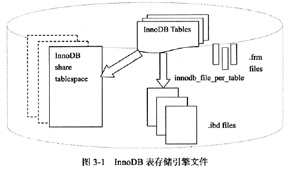

## 第三章 文件

构成 Mysql数据库和InnoDB存储引擎表的文件类型包括：

- 参数文件：MySQL实例启动时在哪里可以找到数据库文件，并且指定某些初始化参数，这些参数定义了某些内存结构的大小等设置，还会介绍各种参数的类型。

- 日志文件：用来记录MySQL实例对某种条件做出相应时写入的文件。如错误日志文件、二进制日志文件、慢查询日志文件、查询日志文件等。

- socket文件：当用Unix域套接字方式进行连接时需要的文件。

- pid文件：MySQL实例的进程ID文件。

- MySQL表结构文件：用来存放MySQL表结构定义文件。

- 存储引擎文件：因为MySQL表存储引擎的关系，每个存储引擎都会有自己的文件来保存各种数据。这些存储引擎真正存储了数据和索引等数据。

### 3.1 参数文件

MySQL实例启动时，MySQL会先去读一个配置参数文件（以文本方式存储），用来寻找数据库的各种文件所在位置以及指定某些初始化参数，这些参数通常定义了某种内存结构有多大等设置。

默认依次读取文件的顺序命令为：`mysql--help | grep my.cnf`。mysql 实例可以不需要参数文件，这时所有的参数值取决于编译 MySQL 时候指定的默认值和源代码中指定参数的默认值。

但是如果 MySQL 实例在默认的数据库目录下面找不到 mysql 架构（记录了访问该实例的权限），则会启动失败并报错 `[ERROR] Fatal error: Can't open and lock privilege tables: Table 'mysql host' doesn't exist;`

参数查看：`show variables like 'XXXX'` 即可。

**参数分类**

- 动态参数：MySQL 实例运行过程中可以进行更改，可以通过 SET 进行修改。

    SET 设置每个参数作用范围分为三类，当前会话、全局、两者都可以（对于每个参数只有一种作用类型），示例如下：

    SET  包括 global 和 session 关键字，他们表明该参数的修改是基于当前会话还是整个实例的生命周期，即有些动态参数只能在会话中进行修改， 如autocommit ; 而有些参数修改完后， 在整个实例生命周期中都会生效， 如binlog_cache_size; 而有些参数既可以在会话中又可以在整个实例的生命周期内生效， 如read_buffer_size;

    ```mysql
    mysql> show variables like 'read_buffer_size';
    +------------------+-------+
    | Variable_name    | Value |
    +------------------+-------+
    | read_buffer_size | 40960 |
    +------------------+-------+
    1 row in set, 1 warning (0.00 sec)
    
    ## 调整当前会话中的参数
    mysql> set read_buffer_size=524288;
    Query OK, 0 rows affected (0.04 sec)
    
    mysql> SELECT @@session.read_buffer_size;
    +----------------------------+
    | @@session.read_buffer_size |
    +----------------------------+
    |                     524288 |
    +----------------------------+
    1 row in set (0.00 sec)
    ## 全局没有改变，其他用户使用另一个会话登录看到的值没有变
    mysql> SELECT @@global.read_buffer_size;
    +---------------------------+
    | @@global.read_buffer_size |
    +---------------------------+
    |                     40960 |
    +---------------------------+
    1 row in set (0.00 sec)
    ```

    如果要设置全局或者当前会话：`SET @@global.XXXX=XXX` 或者 `SET @@session.XXXX=XXX`

    注意对变量的全局值进行 SET 修改之后，在本地实例的生命周期中都优化，但是该 MySQL 实例本身不会对参数文件中的该值进行修改，即下次启动 MySQL 实例的时候还是会读取参数文件，如果要永久有效只能修改参数配置文件。

- 静态参数：实例运行过程中不可修改。

### 3.2 日志文件

日志文件记录了影响SQL数据库的各种类型活动。常见的日志文件有错误日志、二进制日志、慢查询日志、查询日志。

#### 3.2.1 错误日志

错误日志文件对MySQL的启动、运行、关闭过程进行了记录，不仅包括所有的错误信息，也会记录一些警告信息或者正确信息。

定位 log_error 文件位置，默认错误文件的文件名就是服务器的主机名。

```
mysql> show variables like 'log_error';
+---------------+---------------------+
| Variable_name | Value               |
+---------------+---------------------+
| log_error     | /var/log/mysqld.log |
+---------------+---------------------+
1 row in set (0.00 sec)
```

然后可以使用 `tail -n 50  日志位置` 查看日志内容。

#### 3.2.2 慢查询日志（slow log）

慢查询日志用于定位可能存在问题的 SQL 语句，从而进行 SQL 语言层面的优化。

慢查询日志的所在路径：`slow_query_log_file`

```mysql
mysql> show variables like 'slow_query_log_file';
+---------------------+-----------------------------------+
| Variable_name       | Value                             |
+---------------------+-----------------------------------+
| slow_query_log_file | /var/lib/mysql/localhost-slow.log |
+---------------------+-----------------------------------+
1 row in set (0.00 sec)
```

 参数 long_query_time : 将运行时间将**超过**（等于不会）该值的所有SQL语句记录到慢查询日志文件中，语句执行时间精确到微秒。默认10秒。默认情况下，MySQL数据库并不启动慢查询日志，需要手工将这个参数设为ON。

```mysql
mysql> show variables like 'long_query_time';
+-----------------+-----------+
| Variable_name   | Value     |
+-----------------+-----------+
| long_query_time | 10.000000 |
+-----------------+-----------+
1 row in set (0.00 sec)
```

```mysql
# 默认是关闭的
mysql> show variables like 'slow_query_log';
+----------------+-------+
| Variable_name  | Value |
+----------------+-------+
| slow_query_log | OFF   |
+----------------+-------+
1 row in set (0.00 sec)

```

如果想将没有使用索引的 SQL 语句也记录到慢查询日志文件中，需要打开下面的参数：`log_queries_not_using_indexes`

```mysql
mysql> show variables like 'log_queries_not_using_indexes';
+-------------------------------+-------+
| Variable_name                 | Value |
+-------------------------------+-------+
| log_queries_not_using_indexes | OFF   |
+-------------------------------+-------+
1 row in set (0.00 sec)
```

配合 `log_throttle_queries_not_using_indexes` 使用，该参数限制每分钟允许记录到 slow log 中的且未使用索引的 SQL 语句次数，默认为 0。防止生产环境中大量未使用索引的 SQL 语句导致日志过多。


日志文件SQL记录越来越多，使用mysqldumpslow 查看日志文件中内容

```
mysqldumpslow xxx.log
```

得到执行时间最长的10条SQL语句，可以运行：

```
mysqldumpslow -s al - n 10 XXX.log
```

mysql 5.1 之后将慢查询记录的日志记录放入表 `slow_log`，方便查看

```
mysql> show create table mysql.slow_log;

+---------------------------------------------------------+
CREATE TABLE `slow_log` (
  `start_time` timestamp(6) NOT NULL DEFAULT CURRENT_TIMESTAMP(6) ON UPDATE CURRENT_TIMESTAMP(6),
  `user_host` mediumtext NOT NULL,
  `query_time` time(6) NOT NULL,
  `lock_time` time(6) NOT NULL,
  `rows_sent` int(11) NOT NULL,
  `rows_examined` int(11) NOT NULL,
  `db` varchar(512) NOT NULL,
  `last_insert_id` int(11) NOT NULL,
  `insert_id` int(11) NOT NULL,
  `server_id` int(10) unsigned NOT NULL,
  `sql_text` mediumblob NOT NULL,
  `thread_id` bigint(21) unsigned NOT NULL
) ENGINE=CSV DEFAULT CHARSET=utf8 COMMENT='Slow log' 

+---------------------------------------------------------+
1 row in set (0.01 sec)

```


参数 `log_output` 表示慢查询输出的格式，默认FILE，可以将它设为TABLE

```mysql
mysql> show variables like 'log_output';
+---------------+-------+
| Variable_name | Value |
+---------------+-------+
| log_output    | FILE  |
+---------------+-------+
1 row in set (0.00 sec)

mysql> SET  GLOBAL log_output='TABLE';
Query OK, 0 rows affected (0.00 sec)

# 该参数是动态的，并且是全局的。
mysql> show variables like 'log_output';
+---------------+-------+
| Variable_name | Value |
+---------------+-------+
| log_output    | TABLE |
+---------------+-------+
1 row in set (0.01 sec)


mysql> mysql> sleep(30);
+-----------+
| sleep(30) |
+-----------+
|         0 |
+-----------+
1 row in set (30.01 sec)

mysql> select * from mysql.slow_log;
+----------------------------+------------------------------------------+-----------------+-----------------+-----------+---------------+-------+----------------+-----------+-----------+------------------+-----------+
| start_time | user_host | query_time | lock_time | rows_sent | rows_examined | db    | last_insert_id | insert_id | server_id | sql_text  | thread_id |
+----------------------------+------------------------------------------+-----------------+-----------------+-----------+---------------+-------+----------------+-----------+-----------+------------------+-----------+
| 2021-01-24 16:02:33.522256 | skip-grants user[GJXAIOU] @ localhost [] | 00:00:30.001868 | 00:00:00.000000 |         1 |             1 | mysql |              0 |         0 |         1 | select sleep(30) |        15 |
+----------------------------+------------------------------------------+-----------------+-----------------+-----------+---------------+-------+----------------+-----------+-----------+------------------+-----------+
```

将该日志表的存储引擎由 CSV 改为 MyIsam

```mysql
mysql> SET GLobal slow_query_log=off;
Query OK, 0 rows affected (0.00 sec)

mysql> alter table mysql.slow_log engine=MYISAM;
Query OK, 1 rows affected (1.07 sec)
Records: 1  Duplicates: 0  Warnings: 0
```


#### 3.2.3 查询日志

查询日志记录了所有MySQL数据库请求的信息，无论该请求时候得到正确的执行。默认文件名：主机名.log.

查询日志所有记录都存放在 mysql 架构下的 general_log 表中。使用方式同上。

```mysql
mysql> show create table mysql.general_log;

+-------------+-------------------------+
CREATE TABLE `general_log` (
  `event_time` timestamp(6) NOT NULL DEFAULT CURRENT_TIMESTAMP(6) ON UPDATE CURRENT_TIMESTAMP(6),
  `user_host` mediumtext NOT NULL,
  `thread_id` bigint(21) unsigned NOT NULL,
  `server_id` int(10) unsigned NOT NULL,
  `command_type` varchar(64) NOT NULL,
  `argument` mediumblob NOT NULL
) ENGINE=CSV DEFAULT CHARSET=utf8 COMMENT='General log' 
+-------------+-------------+
1 row in set (0.00 sec)
```


#### 3.2.4 二进制文件

二进制日志记录了对数据库执行更改的所有操作，但是不包括SELECT和SHOW这类操作。但是部分操作虽然对没有导致数据库变化（返回的 Changed:0），但是也可能会被写入二进制日志。通过 `show binlog event` 可以看二进制日志中的记录。

只能通过查询日志来记录 SELECT 和 SHOW 操作。二进制日志主要作用如下：

- 恢复：某些数据库的恢复需要二进制日志。例如在数据库全备文件恢复后，可以通过二进制日志进行point-in-time的恢复。
- 复制：类似于恢复，通过复制和执行二进制日志使得一台远程的MySQL数据库（一般称为slave或者standby）与一台MySQL数据库（一般称为master或者primary）进行实时同步。
- 审计：通过二进制日志中的信息来进行审计，判断是否有对数据库进行注入的攻击。


配置参数 `log-bin[=name]` 可以启动二进制日志。不指定name，则默认二进制日志文件名为主机名，后缀名为二进制日志的序列号，所在路径为数据库所在目录。

```mysql
mysql> show variables like 'datadir';
+---------------+-----------------+
| Variable_name | Value           |
+---------------+-----------------+
| datadir       | /var/lib/mysql/ |
+---------------+-----------------+
1 row in set (0.00 sec)

mysql> exit;

[GJXAIOU@localhost mysql]$ sudo ls -lh /var/lib/mysql/
总用量 165M
-rw-r-----. 1 mysql mysql   56 10月 20 2019 auto.cnf
-rw-r-----  1 mysql mysql  178 1月  23 14:14 binlog.000012  # 二进制日志文件
-rw-r-----  1 mysql mysql   16 1月  23 14:14 binlog.index   # 二进制的索引文件，存放过往产生的二进制日志序号
-rw-------. 1 mysql mysql 1.7K 10月 20 2019 ca-key.pem
-rw-r--r--. 1 mysql mysql 1.1K 10月 20 2019 ca.pem
-rw-r--r--. 1 mysql mysql 1.1K 10月 20 2019 client-cert.pem
-rw-------. 1 mysql mysql 1.7K 10月 20 2019 client-key.pem
-rw-------. 1 mysql mysql 1.7K 10月 20 2019 server-key.pem
drwxr-x---. 2 mysql mysql   28 10月 20 2019 sys
-rw-r-----. 1 mysql mysql  10M 1月  24 16:10 undo_001
-rw-r-----. 1 mysql mysql  10M 1月
```

二进制日志文件默认情况下关闭，需要手动设置参数启动。开启这个选项对数据库性能有影响，但是可以接受。官方说明会下降 1%。

**常用的配置参数**：

- `max_binlog_size`

    表示单个二进制日志文件最大值，超过则产生新的二进制日志文件，后缀名 + 1，并且记录到 .index 文件中，默认为 1G。

- `binlog_cache_size`

    InnoDB 中所有未提交的事务的二进制日志会记录到缓存中，等事务提交时直接将缓冲中的二进制日志写入二进制日志文件。该参数决定缓冲的大小，默认为 32K。

    binlog_cache_size是基于会话(session)的， 也就是说， 当一个线程开始一个事务时，MySQL会自动分配一个大小为binlog_cache_ size的缓存， 因此该值的设置需要相当小心， 不能设置过大。 当一个事务的记录大于设定的binlog_cache_ size 时，MySQL会把缓冲中的日志写入一个临时文件中， 因此该值又不能设得太小。 通过SHOW GLOBAL STATUS命令查看binlog_cache_ use、binlog_cache_ disk_ use的状态， 可以判断当前binlog_ cache_ size的设置是否合适。 Binlog_ cache_ use记录了使用缓冲写二 进制日志的次数，binlog_cache_ disk_ use记录了使用临时文件写二进制日志的次数。 现在来看一个数据库的状态：

    ```mysql
    mysql> show variables like 'binlog_cache_size';
    +-------------------+-------+
    | Variable_name     | Value |
    +-------------------+-------+
    | binlog_cache_size | 32768 |
    +-------------------+-------+
    1 row in set (0.00 sec)
    
    mysql> show global status like 'binlog_cache%';
    +-----------------------+-------+
    | Variable_name         | Value |
    +-----------------------+-------+
    | Binlog_cache_disk_use | 0     |
    | Binlog_cache_use      | 4     |
    +-----------------------+-------+
    2 rows in set (0.35 sec)
    ```

    缓冲使用了 2 次，临时文件使用了 0 次，则目前 32 K 的缓冲大小是够用的，不需要增加。

- `sync_binlog`

    在默认情况下，二进制日志并不是在每次写的时候同步到磁盘（用户可理解为缓冲写）。因此，当数据库 所在操作系统 发宕机时，可能会有最后一部分数据 没有写入二进制日志文件中 ，这会给恢复和复制带来问题 。参数sync_binlog= [N]表示每写多少次缓冲就同步到磁盘。如果 将N设为l, 即sync_binlog= l表示采用同步写 磁盘的方式来写二进制日志，这时写 操作不使用操作系统的缓冲来写 二进制日志。sync_bin log的默认值为0, 如果使用InnoDB存储引擎进行复制，并且想得到最大的高可 用性，建议将该值设为ON 。不过该值为ON 时，确实会对数据库的IO 系统 带来一定影响。

    但是，即使将sync_bin log设为l, 还是会有一种情况导致问题的发生。当使用InnoDB存储引擎时，在一
    个事务发出COMMIT动作之前，由于 sync_binlog为I, 因此会将二进制日志立即写入磁盘。如果这时已经写入了二进制日志，但是提交还没有发生，并且此时发生了宕机，那么在MySQL 数据库下次启动时，由于 COMMIT 操作并没有发生，这个事务会被回滚掉。但是二进制日志已经记录了该事务信息，不能被回滚。这个 问题可以通过将参数innodb_ support_xa设为1来解决，虽然innodb_support_ xa与XA事务有关 ，但它 同时也确保了二进制日志和InnoDB存储引擎数据 文件的同步。

- `binlog-do-db` 和 `binlog-ignore-db`

    参数binlog-do-db 和binlog-ignore-db表示需要写入或忽略写入哪些库的日志。 默认为空，表示需要同步所有库的日志到二进制日志。

- `log-slave-update`

    如果当前数据库 是复制中的slave角色，则它不会将从master取得并执行的二进制日志写入自己的二进制日志文件中去。如果需要写入，要设置 log-slave-update 。如果需 要搭建master=>slave =>slave架构的复制，则必须设置该参数。

- `binlog_format`

- 在MySQL 5.1版本之前，没有这个参数。所有二进制文件的格式都是基于SQL语句(statement)级别的，因此基于这个 格式的二进制日志文件的复制(Replication)和Oracle的逻辑Standby有点相似。 同时， 对于复制是有一定 要求的。如在主服务器运行rand、uuid等函数，又或者使用触发器等操作 ，这些都可能会导致主从服务器上表中数据的不一致(not sync)。另一 个影响是，会发现lnnoDB存储引擎的默认事务隔离级别 是REPEATABLE READ 。这其实也是因为二进制日志文件 格式的关系，如果使用READ COMMITTED的事务隔离级别 （大多数数据库 ，如 Oracle, Microsoft SQL Server 数据库的默认隔离级别），会 出现类似丢失更新的现象，从而出现主从数据库上的数据 不一致。

    该参数影响记录二进制日志的形式，该参数可设 的值 有STATEMENT、ROW和MIXED。

    - STATEMENT格式和之前的MySQL版本一样，二进制日志文件记录的是 日志的逻辑SQL语句。

    - 在ROW格式下， 二进制日志记录的不再是简单的SQL语句 了， 而是 记录表的行更改情况 。 基于ROW格式的复制类似于Or acle 的物理Standby (当然， 还是有些区别）。 同时， 对上述提及的Statement格式下复制的问题予以解决。 从MySQL 5.1版本开始， 如果设置了binlog_format为ROW , 可以将InnoDB的事务隔离基本设为READ COMMITTED, 以获得更好的并发性。

    - 在MIXED格式下， MySQL默认采用STATEMENT格式进行二进制日志文件的记录， 但是在一些情况 下会使用ROW格式， 可能的情况有：

        - 表的存储引擎为NDB, 这时对表的DML操作都会以 ROW格式记录。
        - 使用了UUID()、USER()、 CURRENT_USER()、FOUND_ROWS()、ROW_COUNT() 等不确定函数。
        - 使用了INSERT DELAY语句。 
        - 使用了用户定义函数(UDF)。 
        - 使用了临时表(temporary table)。

        

    该参数是动态参数，即可以将当前会话的 binlog_format 设置为 ROW。

    ```mysql
    mysql> SET @@session.binlog_format='ROW';
    
    # 也可以设置全局的 binlog_format 设置为该格式，但是确保更改不会对复制造成影响。
    mysql> SET GLOBAL binlog_format='ROW'
    ```

    通常都会设置为 ROW，可以为数据库的恢复和复制带来更好的可靠性，但是会带来二进制文件的增加。这是因为 MySQL 数据库不再将逻辑的 SQL 操作记录到二进制日志中，而是记录对于每行的修改。

    可以通过在执行语句前后使用 `show master status` 查看 bin 文件的 Position 增加情况（字节）。

    二进制日志文件的文件格式是二进制，如果要查看该日志文件内容，只能使用 mysqlbinlog 打开。如果使用 `STATEMENT` 格式则可以看到 SQL 语句：`mysqlbinlog --start-position=自定义指定想要开始看的位置     二进制文件名称`。如果使用 `ROW` 格式，需要在上面语句中 `mysqlbinlog` 的后面加上 `v` 或者 `-vv`（更加详细）。可以看出记录了整个行的修改信息。

### 3.3 套接字文件

Unix系统下本地连接MySQL可以采用Unix域套接字方式，这种方式需要一个套接字文件。该方式需要的套接字（socket）文件，该文件由参数 socket 控制。

```mysql
mysql> show variables like 'socket';
+---------------+---------------------------+
| Variable_name | Value                     |
+---------------+---------------------------+
| socket        | /var/lib/mysql/mysql.sock |
+---------------+---------------------------+
1 row in set (0.00 sec)
```


### 3.4 pid文件

当 MySQL 实例启动时，会将自己的进程 ID 写入一个 pid 文件，该文件由参数 `pid_file` 进行控制。

```mysql
mysql> show variables like 'pid_file';
+---------------+----------------------------+
| Variable_name | Value                      |
+---------------+----------------------------+
| pid_file      | /var/run/mysqld/mysqld.pid |
+---------------+----------------------------+
1 row in set (0.00 sec)
```


### 3.5 表结构定义文件

MySQL 数据的存储是根据表进行的，每个表都有对应的文件，同时MySQL 会有一个 frm 为后缀的文件来记录该表的表结构信息。同样在创建一个视图的时候也会创建对应的 .frm 文件存放该视图的定义，同时该文件为文本文件。


以上都是 MySQL 数据库本身的文件，和存储引擎无关，下面介绍 InnoDB 表存储引擎自身独有的文件。

### 3.6 InnoDB存储引擎文件

每个表存储引擎还有其自己独有的文件。InnoDB存储引擎密切相关的文件包括日志文件，表空间文件。

#### 3.6.1 表空间文件

InnoDB 将存储的数据按照表空间（tablespace）进行存放，默认表空间文件为一个名为 ibdata1 的 12M 文件。可以使用如下方式在配置文件中进行自定义

`innodb_data_file_path= /db/ibdata1:2000M; /db/ibdata2:3000M:autoextend`。即将这两个文件组成表空间，如果文件在两个磁盘上，负载可能被平均来提升数据库性能。文件后面属性表示文件初始大小和如果空间用完则自动增长。

上述设置的是共享表空间，即所有基于 InnoDB 存储引擎的表的数据都会记录到该共享表空间中。用户可以通过设置参数 `innodb_file_per_table` 为 ON 来使得 InnoDB 存储引擎的每一个表都会产生一个独立的表空间，独立空间命名为： 表名.ibd，即不用将所有的数据都存放在默认的表空间中。

但是单独的表空间文件仅存储该表的数据、索引和插入缓冲 BITMAP 等信息，其余信息还是存在在默认的表空间中。



#### 3.6.2 重做日志文件

重做日志文件（redo log file）记录了 InnoDB 存储引擎的事务日志。当实例失败时候 InnoDB 会通过重做日志恢复到掉电前的时刻来保证数据的完整性。

每个 InnoDB 存储引擎至少有一个重做日志组（group），每个重做日志组下面至少有 2 个重做日志文件（默认为 ib_logfile0 和 ib_logfile1），可以有多个镜像重做日志组放在不同机器来保证重做日志的高可用。同时重做日志组中的每个重做日志大小完全一致，并且以**循环写**的方式运行，即 InnoDB 先写 0 号，写满写 1 号。。。最后在写 0 号。

重做日志文件的主要参数：

- `innodb_log_file_size`

    每个重做日志文件的大小，默认为 48M（不同版本不同）。很重要，太大则恢复时候耗费时间很长，太小导致一个事务的日志需要多次切换重做日志文件，同时会导致频繁的发生 async checkpoint，导致性能的抖动。

    太小警告示例：

    `InnoDB:ERROR: the age of the last checkpoint is 9433645, InnoDB:which exceeds the log group capacity 9433498`。因为重做日志有一个 capacity 变量，如果检查点超过该值这必须将缓冲池（innodb buffer pool）中脏页列表（flush list ）中的部分脏数据页写回磁盘，这会导致用户线程的阻塞。

- `innodb_log_files_in_group`

    指定日志文件组中重做日志的数量，默认为 2。

- `innodb_mirrored_log_groups`

    指定日志镜像文件组的数量，默认为 1，即只有一个日志组，没有镜像。

- `innodb_log_group_home_dir`

    指定日志文件组所在路径，默认为 `./`。


同样是记录事务日志，和之前介绍的二进制日志有什么区别？

- 二进制日志会记录所有与MySQL数据库有关的日志记录，包括InnoDB、 MylSAM、Heap等其他存储引擎的日志。而InnoDB存储引擎的重做日志只记录有关该 存储引擎本身的事务日志。
- 记录的内容不同，无论用户将二进制日志文件记录的格式设为STATEMENT还是ROW,又或者是MIXED,其记录的都是关于一个事务的具体操作内容，即该日志是逻辑日志。而lnnoDB存储引擎的重做日志文件记录的是关于每个页(Page)的更改的物理情况。
- 写入的时间也不同，二进制日志文件仅在事务提交前进行提交，即只写磁盘一次，不论这时该事务多大。而在事务进行的过程中，却不断有重做日志条目（redo entry）被写入到重做日志文件中。

在InnoDB存储引擎中，对于各种不同的操作有着不同的重做日志格式（目前约 51 种重做日志类型）。但是总体格式类似，重做日志条目结构如下：

- redo_log_type占用1字节， 表示重做日志的类型。
- space表示表空间的ID, 但采用压缩的方式， 因此占用的空间可能小于4字节。
- page_no表示页的偏移量， 同样采用压缩的方式。
- redo_log_body 表示每个重做日志的数据部分， 恢复时需要调用相应的函数进行解析。


同样写入重做日志文件的操作不是直接写， 而是先写入一个重做日志缓冲(redo log buff er)中， 然后按照一定的条件顺序地写入日志文件。 图3-3很好 地诠释了重做日志的写入过程。

从重做日志缓冲往磁盘写人时， 是按512个字节， 也就是一个扇区的大小进行写 入。 因为扇区是写入的最小单位， 因此可以保证写入必定是成功的。 因此在重做日志的 写人过程中不需要有doublewrite。


日志缓冲写入磁盘上的重做日志文件是按照一定条件执行的，条件如下：

- 主线程会每秒将重做日志缓冲写入磁盘的重做日志文件中，无论事务是否已经提交。
- 通过参数 `innodb_flush_log_at_trx_commit`控制，表示在提交（commit）操作时候处理重做日志形式，共 0,1,2 三种选值。
    - 0代表当提交事务时， 不将事务的重做日志写入磁盘上的日志文件，而是等待主线程每秒的刷新。
    - 1表示在执行commit时将重做日志缓冲同步写到磁盘，即伴有fsync的调用。
    - 2表示将重做日志异步写到磁盘，即写到文件系统的缓存中。因此不能完全保证在执行commit时肯定会写入重做日志文件，只是有这个动作发生。
        因此为了保证事务的ACID中的持久性，必须将innodb_flush_log_at_trx_commit设置为1,也就是每当有事务提交时，就必须确保事务都已经写入重做日志文件。那么当数据库因为意外发生宅机时，可以通过重做日志文件恢复，并保证可以恢复已经提交的事务。而将重做日志文件设置为0或2,都有可能发生恢复时部分事务的丢失。不同之处在于，设置为2时，当MySQL数据库发生者机而操作系统及服务器并没有发生者机时，由于此时未写人磁盘的事务日志保存在文件系统缓存中，当恢复时同样能保证数据 不丢失。


### 3.7 总结

介绍了MySQL数据库相关的文件，文件分为MySQL数据库文件以及和各存储引擎有关的文件。与MySQL数据库有关的文件中，错误文件和二进制文件。当MySQL数据库发生任何错误时，DBA首先就应该去查看错误文件，从文件提示内容找出问题的所在。同时也记录了警告信息，通过警告信息有助于DBA对于数据库和存储引擎的优化。

 二进制文件可以用来进行 point in time的恢复以及复制（replication）环境的搭建。建议任何时候都启用二进制日志的记录，二进制日志支持STATEMENT，ROW，MIX三种格式，用来更好的保证从数据库和主数据库之间数据的一致性。

 最后介绍了和InnoDB存储引擎相关的文件，包括表空间文件和重做日志文件。表空间文件是用来管理InnoDB存储引擎的存储，分为共享表空间和独立表空间。重做日志用来记录InnoDB存储引擎的事务日志，也因为重做日志的存在，才使得InnoDB存储引擎可以提供可靠的事务。


