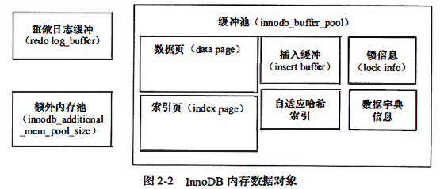

# 第二章：InnoDB 存储引擎

[TOC]

**特点**：行锁设计、支持 MVCC、支持外键、提供一致性非锁定读、更加有效利用内存和 CPU。

**命令**：查看 InnoDB  版本号：`show variables like 'innodb_version'`，5.5 之前因为可以动态加载 自定义 InnoDB 引擎，所以存在内置静态编译的和动态加载的 InnoDB 两个版本的存储引擎，之后则没有动态加载的 InnoDB Plugin。

万能命令：`show engine innodb status;`，该命令显示的不是当前的状态，而是过去某个时间范围内 InnoDB 存储引擎的状态。

## 一、InnoDB 体系架构「InnoDB 的内部结构」

InnoDB 的存储引擎的体系架构如图，lnnoDB 存储引擎有多个内存块，其共同组成一个大的内存池，作用如下：

- 维护所有进程／线程需要访问的多个内部数据结构。
- 缓存磁盘上的数据， 方便快速地读取， 同时在对磁盘文件的数据修改之前在这里缓存。
- 重做日志(redo log)缓冲。
- 。。。


### （一）后台线程

**InnoDB 存储引擎是多线程的模型**， 因此其后台有多个不同的后台线程，**后台线程的主要作用是负责刷新内存池中的数据， 保证缓冲池中的内存缓存的是最近的数据。 此外将已修改的数据文件刷新到磁盘文件， 同时保证在数据库发生异常的情况下 InnoDB 能恢复到正常运行状态。**

- **Master Thread**（核心的线程）： **主要负责将缓冲池中的数据异步刷新到磁盘， 保证数据的一致性**， 包括~~脏页的刷新~~、合并插入缓冲(INSERT BUFFER)、undo 页的回收等。

- **IO Thread**：在 InnoDB 存储引擎中大量使用了 AIO (Async IO)来处理写 IO 请求， 极大提高了数据库的性能。而 IO Thread 的主要负责这些 IO 请求的回调(call back)处理。

    共有 10 个 IO Thread，分别为 `insert buffer(1)/log(1)/read(4)/write(4)`，当然后面两个 IO Thread 的数量可以根据 `innodb_read_io_threads` 和 `innodb_write_io_threads` 参数进行调节指定。同时可以看出读线程的 ID 总是小于写线程。

    ```mysql
    mysql > show engine innodb status;
    
    --------
    FILE I/O
    --------
    I/O thread 0 state: wait Windows aio (insert buffer thread)
    I/O thread 1 state: wait Windows aio (log thread)
    I/O thread 2 state: wait Windows aio (read thread)
    I/O thread 3 state: wait Windows aio (read thread)
    I/O thread 4 state: wait Windows aio (read thread)
    I/O thread 5 state: wait Windows aio (read thread)
    I/O thread 6 state: wait Windows aio (write thread)
    I/O thread 7 state: wait Windows aio (write thread)
    I/O thread 8 state: wait Windows aio (write thread)
    I/O thread 9 state: wait Windows aio (write thread)
    ```

- Purge Thread ：事务被提交后， 其所使用的 undolog 可能不再需要， 因此需要 Purge Thread（可以设置多个该线程来加快回收）来**回收已经使用并分配的 undo 页**。

    默认的回收线程数量为 4， 可以在 `/etc/my.cnf` 「不应该在这里，感觉应该是后续的配置文件，因为改了还是 4」中通过增加配置 `innodb_purge_threads=XXX` 来自定义数目，通过 `show variables like 'innodb_purge_threads'` 可以查看配置。

    **注意**：修改 `/etc/my.cnf` 下面文件之前需要使用 `chmod 777 /etc/my.cnf` 进行赋权，修改完成之后将其权限改为 `664`，然后使用 `service mysqld restart` 重启服务，否则会出现无法运行情况。

- Page Cleaner Thread：将**脏页的刷新操作**都放入该单独的线程中来完成。减轻原 Master Thread 的工作及对于用户查询线程的阻塞。

### （二）内存

#### 1.缓冲池

缓冲池大小通过 `innodb_buffer_pool_size` 来设置，默认值如下： 134217728 /1024/1024 =  128M（mysql 8)，如果是 5.6 则为 8 M。通常为物理机器的 80%。

```sql
mysql> show variables like 'innodb_buffer_pool_size';
+-------------------------+-----------+
| Variable_name           | Value     |
+-------------------------+-----------+
| innodb_buffer_pool_size | 134217728 |
+-------------------------+-----------+
1 row in set (0.00 sec)
```

lnnoDB 存储引擎是基于磁盘存储的， 并将**其中的记录按照页的方式进行管理**。因此使用缓冲池（就是一块内存区域）技术来提高数据库的整体性能（平衡 CPU 和磁盘速度差）。

- 在数据库中进行读取页的操作， 首先将从磁盘读到的页「Fix」存放在缓冲池中。下一次再读相同的页时， 首先判断该页是否在缓冲池中。若在缓冲池中， 称该页在缓冲池中被命中， 直接读取该页。否则， 读取磁盘上的页。

- 对于数据库中页的修改操作， 则首先修改在缓冲池中的页， 然后再以一定的频率刷新到磁盘上。 页从缓冲池刷新回磁盘的操作并不是在每次页发生更新时触发，而是通过一种称为**Checkpoint 的机制刷新回磁盘。**

**缓冲池中缓存的数据页类型有：数据页、索引页、undo 页、插入缓冲(insert buffer)、自适应哈希索引(adaptive hash index)、InnoDB 存储的锁信息(lock info)、数据字典信息(data dictionary)等**。



​	

**InnoDB 允许有多个缓冲池实例**。每个页根据哈希值平均分配到不同缓冲池实例中 。这样做的好处是减少数据库内部的资源竞争，增加数据库的并发处理能力，默认为 1 个。可以通过 `innodb_buffer_pool_instances` 进行设置。多个缓冲池状态可以通过 `show engine innodb status` 或者 `information_schema` 架构下的表 `INNODB_BUFFER_POOL_STATS` 表进行查看。

```mysql
mysql> show variables like 'innodb_buffer_pool_instances';
+------------------------------+-------+
| Variable_name                | Value |
+------------------------------+-------+
| innodb_buffer_pool_instances | 1     |
+------------------------------+-------+
1 row in set (0.02 sec)
```

#### 2、LRU List、Free List 和 Flush List「InnoDB 对缓冲池内存区域的管理方式」

缓冲池是通过 LRU (Latest Recent Used, 最近最少使用）算法来进行管理的。 即最频繁使用的页在 LRU 列表的前端， 而最少使用的页在 LRU 列表的尾端。 **当缓冲池不能存放新读取到的页时， 将首先释放 LRU 列表中尾端的页。**

在 InnoDB 存储引擎中， 缓冲池中页的大小默认为 16 KB，同时对 LRU 算法进行了优化：

**LRU 列表中加入了 midpoint 位置（默认在列表长度的 5/8 处）**，也可以通过 `innodb_old_blocks_pct` 参数进行调整 New 和 old 比例（值默认为 37，即大致是距离尾端的位置  3/8  处）。新读取到的页，虽然是最新访问的页，但并不是直接放入到 LRU 列表的首部，而是放入到 LRU 列表的 midpoint 位置【midpoint insertion strategy 算法】。midpoint 之后的列表称为 old 列表， 之前列表为 new 列表（该列表中的页都是最为活跃的热点数据）。

**原因**：**因为若直接将读取到的页放入到 LRU 的首部， 那么某些 SQL 操作（如索引或数据的扫描操作）可能会使缓冲池中的页被刷新出，从而影响缓冲池的效率**。这类操作需要访问表中的许多页，甚至是全部的页，而这些页通常来说又仅在这次查询操作中需要，并不是活跃的热点数据。 如果页被放入LRU 列表的首部，可能将需要的热点数据页从 LRU 列表中移除，从而访问热点数据页时候 InnoDB 存储擎需要再次访问磁盘。

**解决方式**：通过参数 `innodb_old_blocks_time` （默认为 1000），该参数表示页读取到 mid 位置后需要等待多久才会被加入到 LRU 列表的热端。因此当需要执行上述所说的扫描 SQL 操作之前， 通过`SET GLOBAL innodb_old_blocks_time=lOOO（或其他值）;` 或者通过上面参数将 midpoint 位置往后移。以尽可能减少列表中热点数据被刷出。相当于阻塞一段时间，操作执行完成之后再执行一遍该语句，将值换成 0 即可。

 **LRU 列表用来管理已经读取的页**，但当数据库刚启动时，LRU 列表中没有任何页。 这时页都存放在 Free 列表中。 当需要从缓冲池中分页时， 首先从 Free 列表中查找是否有可用的空闲页， 若有则将该页从 Free 列表中删除， 放入到 LRU 列表中。否则（没有 Free 页）则根据 LRU 算法， 淘汰 LRU 列表末尾的页，将该内存空间分配给新的页。

当页从 LRU 列表的 old 部分加入到 new 部分时，称此时发生的操作为 page made young, 而因为 `innodb_old_blocks_time` 的设置而导致页没有从 old 部分移动到 new 部分的操作称为 page not made young。 可以通过命令 `SHOW ENGINE INNODB STATUS` 来观察 LRU 列表及 Free 列表的使用情况和运行状态。

但是可能 `Free buffers` 与 `Database pages` 的数量之和不等于 `Buffer pool size`。  **因为缓冲池中的页还可能会被分配给自适应哈希索引、Lock 信息、Insert Buffer 等页， 而这部分页不需要  LRU 算法进行维护， 因此不存在于 LRU 列表中。**

```mysql
mysql> show engine innodb status;

----------------------
BUFFER POOL AND MEMORY
----------------------
Total large memory allocated 137363456
Dictionary memory allocated 300787
Buffer pool size   8192 #缓冲池 buffer pool 共有 8192 个页，则 buffer_pool_size 为 8192 * 16k = 5GB
Free buffers       7222  # 当前 Free 列表中的页的数目
Database pages     966  # LRU 列表中页的数量
Old database pages 376  # Old Page list 中的页数目
Modified db pages  0  # 脏页的数目
Pending reads      0
Pending writes: LRU 0, flush list 0, single page 0
Pages made young 0, not young 0# 前面一个表示 LRU 列表中页移动到前端的次数，因为没改变上面的 innodb_old_blocks_time， 因此 not young 为 0。
0.00 youngs/s, 0.00 non-youngs/s # 前面一个表示每秒对 Old page List 的访问次数，即将 Page 从 old List 移动到 New Page List
Pages read 824, created 142, written 156
0.00 reads/s, 0.00 creates/s, 0.00 writes/s
No buffer pool page gets since the last printout  # 这是本地运行结果，没有出现下一行，再找原因
Buffer pool hit rate 649 / 1000, young-making rate 0 / 1000 not 0 / 1000 # 表示缓存池的命中率，如果小于 95% 应该考虑是不是因为全表扫描导致 LRU 列表被污染。
Pages read ahead 0.00/s, evicted without access 0.00/s, Random read ahead 0.00/s
LRU len: 966, unzip_LRU len: 0
I/O sum[0]:cur[0], unzip sum[0]:cur[0]
```

同时可以通过表 INNODB_BUFFER_POOL_STATS 来查看缓冲池的运行状态，通过表 INNODB_BUFFER_PAGE_LRU 查看每个 LRU 列表中每个页的具体类型信息（可以在 where 中指定 SPACE= XX（数字））。

#### 针对每个页

**压缩页**：

INNODB 支持压缩页，即将原本 16KB 的页压缩为 1KB、2KB、4KB 和8KB。**对于非 16KB 的页，是通过 unzip_LRU 列表进行管理的。（LRU 中的页包含了 unzip_LRU 列表中的页）**。`SHOW ENGINE INNODB STATUS\G;`可查看两者数量。`LRU len: 966, unzip_LRU len: 0`

unzip_LRU 列表中对不同压缩页大小的页进行分别管理并在缓存池中分配内存。其次，通过伙伴算法进行内存的分配。例如对需要从缓冲池中申请页为 4KB 的大小，其过程如下：

- 检查 4KB 的 unzip_LRU 列表， 检查是否有可用的空闲页：

- 若有，则直接使用；否则检查 8KB 的 unzip_LRU 列表；
- 若能够得到空闲页， 将页分成 2 个 4KB 页， 存放到 4KB 的 unzip_LRU 列表；
- 若不能得到空闲页， 从 LRU 列表中申请一个 16KB 的页，将页分为 1 个 8KB 的页、2 个 4KB 的页， 分别存放到对应的 unzip_LRU 列表中。

unzip_LRU 列表中各个大小的页可以通过 `INNODB_BUFFER_PAGE_LRU`进行查看。

在 LRU 列表中的页被修改后变为**脏页**，即缓冲池中的页和磁盘上的页的数据产生了不一致。 这时数据库会**通过 CHECKPOINT 机制将脏页刷新回磁盘，**而 Flush 列表中的页即为脏页列表。**脏页既存在于 LRU 列表中， 也存在于 Flush 列表中**。**LRU 列表用来管理缓冲池中页的可用性，Flush 列表用来管理将页刷新回磁盘，二者互不影响。**

查看脏页的数量和脏页的类型，除了上面的 `show engine innodb status;` 还可以通过查询 LRU  的`INNODB_BUFFER_PAGE_LRU` 表（因为脏页同样在 LRU 列表中），加上限定条件：`OLDEST_MODIFICATION > 0`。其中 TABLE_NAME 为 NULL 表示该页为系统表空间。


#### 3.重做日志缓冲（redo log buffer）

InnoDB 存储引擎首先将重做日志信息先放入到**重做日志缓冲区**， 然后按一定频率（通常为每秒）将其刷新到重做日志文件。可以通过 `innodb_log_buffer_size` 参数控制。Mysql  5.7 版本中默认为：1M， 8.0 版本中默认为 16 M。

```mysql
mysql> show variables like 'innodb_log_buffer_size';
+------------------------+---------+
| Variable_name          | Value   |
+------------------------+---------+
| innodb_log_buffer_size | 1048576 |
+------------------------+---------+
1 row in set, 1 warning (0.00 sec)
```

**重做日志在下列三种情况下会将重做日志缓冲中的内容刷新到外部磁盘的重做日志文件中。**

- Master Thread 每一秒将重做日志缓冲刷新到重做日志文件；

- 每个事务提交时会将重做日志缓冲刷新到重做日志文件；

- 当重做日志缓冲池剩余空间小于1/2 时， 重做日志缓冲刷新到重做日志文件。


#### 4.额外的内存池

在 InnoDB 存储引擎中， 对内存的管理是通过一种称为内存堆 （heap）的方式进行的。 **在对一些数据结构本身的内存进行分配时， 需要从额外的内存池中进行申请， 当该区域的内存不够时， 会从缓冲池中进行申请。** 如分配缓冲池（innodb_buffer_pool) 之后每个缓冲池中的帧缓冲（Frame buffer) 以及对应的缓冲控制对象（buffer controller block)，这些对象记录了如 LRU、锁、等待等信息，该对象的内存需要从额外内存池中申请。所以 InnoDB 缓冲池很多的时候，这个值也要增大。

## 二、Checkpoint 技术：将缓冲池中脏页刷新到磁盘

因为**对页的操作首先是在缓冲池中完成**，但如 DML 语句（updata 和 delete 等）修改了页中记录，则该页为脏页（缓冲池中的页的版本比磁盘中的新）。 数据库需要将新版本的页从缓冲池刷新到磁盘。如果每次修改都刷新会磁盘性能开销较大（当热点数据集中在某几个页中，数据库性能将更差），同时如果刷新到磁盘过程中发生宕机则数据不可恢复。【因为缓冲池（本质为内存）和重做日志都不可能无限大，且及时无限大，宕机之后按照重做日志恢复时间也太长，所以得刷新回磁盘。】

**为了避免发生数据丢失的问题，当前事务数据库系统普遍都采用了 Write Ahead Log 策略，即当事务提交时，先写重做日志，再修改页。当由于发生者宕机而导致数据丢失时（在刷新到磁盘中的过程），通过重做日志来完成数据的恢复。 这也是事务 ACID 中 D (Durability 持久性）的要求。**

==问题：如果在写完重做日志之后，宕机，此时还没有修改页，重启之后按照日志进行恢复会不会出错==

Checkpoint（检查点）目的是解决以下几个问题：

- 缩短数据库的恢复时间

    当数据库发生宕机时，数据库不需要重做所有的日志，因为 Checkpoint 之前的页都已经刷新回磁盘。故**数据库只需对 Checkpoint 后的重做日志进行恢复。这样就大大缩短了恢复的时间。**

- 缓冲池不够用时，将脏页刷新到磁盘

    当缓冲池不够用时，根据 LRU 算法会溢出最近最少使用的页，若此页为脏页，那么需要强制执行Checkpoint，将脏页刷回磁盘。

- 重做日志不可用时，刷新脏页

    重做日志出现不可用的情况是因为当前事务数据库系统对重做日志的设计都是循环使用的，并不是让其无限增大的。重做日志可以被重用的部分是指这些重做日志已经不再需要，即当数据库发生右机时，数据库恢复操不需要这部分的重做日志，因此这部分就可以被覆盖重用。若此时重做日志还需要使用，那么必须强制产生Checkpoint,将缓冲池中的页至少刷新到当前重做日志的位置。

对于 lnnoDB 通过 LSN（Log Sequence Number）来标记版本的。而 LSN 是 8 字节的数字，其单位是字节。每个页、重做日志、Checkpoint 中都有 LSN。

```mysql
mysql> show engine innodb status;

---
LOG
---
Log sequence number 37825145
Log flushed up to   37825145
Pages flushed up to 37825145
Last checkpoint at  37825136
0 pending log flushes, 0 pending chkp writes
10 log i/o's done, 0.00 log i/o's/second
```

InnoDB 中有两种 Checkpoint：区别在于：每次刷新多少页到磁盘，每次从哪里取脏页，什么时候触发 Checkpoint。

- Sharp Checkpoint（默认）：**发生在数据库关闭时将所有的脏页都刷新回磁盘**，即参数 `innodb_fast_ shutdown= 1`。但是运行时如果使用影响效率。
- Fuzzy Checkpoint：即只刷新一部分脏页，而不是刷新所有的脏页回磁盘。INNODB 运行时使用。

在 InnoDB 存储引擎中可能发生如下几种情况的 Fuzzy Checkpoint:

- Master Thread Checkpoint

    差不多**以每秒或每十秒的速度从缓冲池的脏页列表中刷新一定比例的页回磁盘**。该过程是**异步**的，即此时 InnoDB 存储引擎可以进行其他的操作，用户查询线程不会阻塞。

- FLUSH_LRU_LIST Checkpoint

    通过单独的 Page Cleaner 线程来检查 LRU 列表中是否有足够的空闲页供使用，数量默认为 1024， 可以通过 `innodb_lru_scan_depth` 参数来控制（InnoDB 需要保证 LRU 列表中至少需要约 100 个空闲页可以使用），如果空闲页不够就会将 LRU 列表尾端的页进行删除，如果这些移除的页中有脏页就需要进行 Checkpoint。

- Async/Sync Flush Checkpoint =》保障重做日志的循环使用的可用性

    通过单独的 Page Cleaner 进行刷新操作，不会阻塞用户查询线程。

    Async/Sync Flush Checkpoint 指的是重做日志文件不可用的情况， 这时需要强制将一些页刷新回磁盘， 而此时脏页是从脏页列表中选取的 。 若将已经写入到重做日志的 LSN 记为 `redo_lsn`, 将已经刷新回磁盘最新页的 LSN 记为 `checkpoint_lsn`, 则可定义：
    `checkpoint_age = redo_lsn - checkpoint_lsn`即【总的 - 已经刷回磁盘的 = 还在重做日志中的】。
    再定义以下的变量：
    `async_water_mark = 75% * total_redo_log_file_size`
    `sync_water_mark = 90%* total_redo_log_file_size`
    若每个重做日志文件的大小为 1 GB, 并且定义了两个重做日志文件， 则重做日志文件的总大小为 2GB。那么 `async_water_ mark= 1. 5GB, sync_ water_ mark= 1. 8GB`。则：

    - 当 `checkpoint_age < async water_ mark` 时， 不需要刷新任何脏页到磁盘：
    - 当 `async_water_ mark < checkpoint_age < sync_ water_mark` 时触发 `Async Flush`, 从Flush 列表中刷新足够的脏页回磁盘， 使得刷新后满足 `checkpoint_age < async water_mark`;
    - `checkpoint_age > sync_water_mark` 这种情况一般很少发生， 除非设置的重做日志文件太小， 并且在进行类似 LOAD DATA 的 BULKINSERT 操作。此时触发 SyncFlush 操作， 从 Flush 列表中刷新足够的脏页回磁盘， 使得刷新后满足 `checkpoint_age < async_water_mark`。

- Dirty Page too much Checkpoint=》保障缓冲池中有足够可用的页

    当脏页太多时候导致 InnoDB 强制进行 Checkpoint，该比例可以通过 `innodb_max_dirty_pages_pct`控制，其中 5.6 中默认为 75（即脏页数量占用缓冲池的 75% 就进行强制刷新）。8.0 显示为 90。

    ```mysql
    mysql> show variables like 'innodb_max_dirty_pages_pct';
    +----------------------------+-----------+
    | Variable_name              | Value     |
    +----------------------------+-----------+
    | innodb_max_dirty_pages_pct | 75.000000 |
    +----------------------------+-----------+
    1 row in set, 1 warning (0.00 sec)
    ```


## 三、Master Thread 工作方式

### （一）1.0.X 之前的 Master Thread

InnoDB 存储引擎的主要工作都是在一个单独的后台线程 Master Thread 中完成的。其具有最高的线程优先级别。其内部由主循环(loop)、后台循环(backgroup loop)、刷新循环(flush loop)、暂停循环(suspend loop)组成并会根据数据库运行的状态在则几个循环中切换。

#### Loop（主循环）

Loop 被称为主循环，因为大多数的操作是在这个循环中，其中有两大部分的操作：每秒钟的操作和每 10秒的操作。伪代码如下：

```c
void master thread() {
loop:
for (int i= 0; i<lO; i++l {
	do thing once per second
	sleep l second if necessary
}        
do things once per ten seconds
goto loop;
}     
```

因为 loop 循环通过 thread sleep 来实现，则**所谓的每秒一次或每 10 秒一次的操作是不精确的**。在负载很大的情况下可能会有延迟(delay）。
**每秒一次的操作包括**：

- 日志缓冲刷新到磁盘，即使这个事务还没有提交。【总是】；

    即使某个事务还没有提交，InnoDB 存储引擎仍然每秒会将重做日志缓冲（redo_log_buffer）中的内容刷
    新到重做日志文件。因此再大的事务 commit 提交的时间都很短。

- 合并插入缓冲（Insert Buffer）【可能】；

    该操作并不是每秒都会发生的。InnoDB 会判断当前一秒内发生的 IO 次数是否小于 5 次，如果是则认为当前的 IO 压力很小，可以执行合并插入缓冲的操作。
    
- 至多刷新 100 个 InnoDB 的缓冲池中的脏页到磁盘【可能】；

    InnoDB 通过判断当前缓冲池中脏页的比例（buf_get_modified_ratio_pct）是否超过了配置文件中的参数`innodb_max_dirty_pages_pct`（默认为 90, 代表 90%)，如果超过则认为需要做磁盘同步的操作， 将 100 个脏页写入磁盘中。
    
- 如果当前没有用户活动，则切换到 background loop【可能】。

**每 10 秒一次的操作包括：**

- 刷新 100 个脏页到磁盘【可能】；
- 合并至多 5 个插入缓冲【总是】；
- 将日志缓冲刷新到磁盘【总是】；
- 删除无用的 Undo 页【总是】；
- 刷新 100 个或者 IO 个脏页到磁盘【总是】。

在以上的过程中，InnoDB 会先判断过去 10 秒之内磁盘的 IO 操作是否小于 200 次，如果是则认为当前有足够的磁盘 IO 操作能力， 因此将 100 个脏页刷新到磁盘。 接着，InnoDB 会合并插入缓冲。 之后，InnoDB 会再进行一次将日志缓冲刷新到磁盘的操作（和每秒一次的操作相同）。
接着 InnoDB 会进行一步执行 full purge 操作， 即删除无用的 Undo 页。 对表进行 update、 delete 这类操作时，原先的行被标记为删除， 但是因为一致性读(consistentread)的关系， 需要保留这些行版本的信息。 但是在 full purge 过程中，InnoDB 会判断当前事务系统中已被删除的行是否可以删除， 比如有时候可能还有查询操作需要读取之前版本的 undo 信息， 如果可以删除，lnnoDB 会立即将其删除。

#### Background Loop

若当前没有用户活动（数据库空闲）或数据库关闭时就会切换到这个循环。background loop 会执行以下操作：

- 删除无用的 Undo 页【总是】：
- 合并 20 个插入缓冲【总是】；
- 跳回到主循环【总是】；
- 不断刷新100个页直到符合条件（可能，跳转到 flushloop)

若 flush loop 中也没有什么事情可以做，InnoDB 会切换到 `suspend_loop`, 将 Master Thread 挂起，等待事件的发生。若用户启用(enable)了 InnoDB 存储引擎，却没有使用任何 InnoDB 存储引擎的表，那么Master Thread 总是处于挂起的状态。

### （二）1.2.X 之前的 Master Thread

问题1：之前对 IO 的限制都是硬编码，则磁盘性能的提升并不能利用充分。同时操作的次数和每次刷新页数都是硬编码，当写入密集的时候，脏页无法及时刷新到磁盘中，则当宕机产生的时候由于很多数据还没有刷新会磁盘会导致恢复的时间很久。

加入参数 `innodb_io_capacity` 来表示磁盘 IO 的吞吐量，默认值为 200，可以根据磁盘性能自定义。则刷新回磁盘的页数量规则修改如下：

- 在合并插入缓冲时， 合并插入缓冲的数量为 `innodb_io_capacity` 值的 5%；
- 在从缓冲区刷新脏页时， 刷新脏页的数最为 `innodb_io_capacity` 。

加入参数 `innodb_max_dirty_pages_pct` ，将默认 90 改为了 75，即脏页占缓冲池 75%，InnoDB 在每秒刷新缓冲池和 flush loop 时会判断该值，如果值大于这个设定值就会刷新 100 个脏页。当内存很大时候降低每次刷新的大小，提升每次刷新的速度。防止当内存总容量很大时或者数据库服务器压力很大时候，达到 90% 时候刷新脏页的速度会很低。

加入参数 `innodb_adative_flushing`（自适应刷新），其通过`buf_flush_get_desired_flush_rate` 函数通过判断产生重做日志（redo log) 的速度来确定需要刷新脏页最合适的数量（不再规定是上面的 100 个），所以当脏页比例小于上面的 `innodb_max_dirty_pages_pct` 时候也可能刷新一定量的脏页。

加入参数 `innodb_purge_batch_size` 可以控制每次 full purge 回收的 Undo 页的数量，默认值仍然为 20。

**Master Thread 信息查看**， 5.6 及其之后显示的内容改变了

```mysql
mysql> show engine innodb status;

-------------------
BACKGROUND THREAD
-------------------
srv_master_thread loops: 2188 1_second, 1537 sleeps, 218 10_second, 2 background, 2 flush
srv_master_thread log flush and writes: 1777 log writes only: 69
```

**解读**：主循环运行了 2188 次， 但是循环中每秒挂起（sleep） 进行了 1537 次，因为 InnoDB 内部优化，当压力大时并不总是等待 1 秒，所以不能认为 1_second 和 sleeps 的值相等。某些情况下可以通过两者差值来看数据库的负载压力。10 秒一次的活动进行了 218 次，符合 1:10。 background loop 进行了 2 次， flush loop 进行了两次。

### （三）1.2 版本中的 Master Thread

区别一：分别使用 `srv_master_do_active_tasks()` 表示每秒中的动作， 使用 `srv_master_do_idle_tasks()` 表示每 10 秒的操作。

区别二：将 脏页刷新从 Master Thread 分离为单独线程 Page Cleaner Thread 进行处理。

## 四、InnoDB 关键特性

### （一）插入缓冲（Insert Buffer）

插入缓冲不是缓冲池的一个组成部分，InnoDB 缓冲池中有一个 Insert Buffer 信息，但是 Insert Buffer 和数据页一样也是物理页的组成部分。

**聚集索引**

InnoDB 中，主键是行唯一的标识符，通常行记录的插入顺序是按照主键递增的顺序进行插入，因此聚集索引（primary key）一般是顺序的，不需要磁盘的随机读取。

因为页中的行记录按照 Primary key 的值进行顺序存放，一般不需要随机读取另一个页中的记录。因此该类型的插入速度较快。但是如果主键类是类似于 UUID 类，其主键插入不是顺序的，其插入和辅助索引一样是随机的，即插入并非连续。

**非聚集的辅助索引**

通常表中除了唯一的聚集索引之外，还有多个非聚集的辅助索引（secondary index）。当按照非唯一的字段进行查找时候，会产生一个非聚集且非唯一的索引。而在插入的时候，数据页的存在是按照主键进行顺序存放的，对于非聚集索引的叶子节点的插入不再是顺序的，此时需要离散的访问非聚集索引页，由于随机读取的存在而导致了插入性能的下降。（因为 B+ 树的特性决定了非聚集索引插入的离散型）

> 当然某些情况下辅助索引的插入依然是比较顺序的，比如当用户购买记录表中的购买时间为辅助索引时候，插入的时候根据时间的递增来插入，则相对顺序的。

#### Insert  Buffer

对于**非聚集索引**的插入或更新操作，首先判断插入的非聚集索引页是否在缓冲池中，如果在则直接插入到索引页中，如不在，则先放入到一个 Insert Buffer 对象中，此时该非聚集的索引并没有插到叶子节点，而是存放在另一个位置。然后再以一定的频率和情况进行 Insert Buffer 和辅助索引叶子节点的 merge 合并操作。此时将多个插入合并到一个操作中（因为在一个索引页中），提高对于非聚集索引插入的性能。

**使用 Insert Buffer 需要满足的条件：索引是辅助索引（secondary index）且索引不是唯一的。**

问题：大量涉及不唯一的非聚集索引的插入操作之后，数据库发生了宕机，则大量的 Insert Buffer 没有合并到实际的非聚集索引中，导致恢复的时间较长。

辅助索引不能是唯一的，因为在插入缓冲时，数据库并不去查找索引页来判断插入的记录的唯一性。如果去查找肯定又会有离散读取的情况发生，从而导致 Insert buffer 失去意义。

可以通过 `show engine innodb status;` 查看插入缓冲的信息：

```shell
。。。。
0.00 reads/s, 0 avg bytes/read, 0.00 writes/s, 0.00 fsyncs/s
-------------------------------------
INSERT BUFFER AND ADAPTIVE HASH INDEX
-------------------------------------
Ibuf: size 1, free list len 0, seg size 2, 0 merges # size 表示已经合并记录页的数量，free list 表示空闲列表的长度，seg size 表示当前 Insert Buffer 的大小为 2 * 16KB
# 下面两行显示了插入的性能
merged operations:
# insert 表示 Insert Buffer，delete mark 表示 Delete Buffer，delete 表示 Purge Buffer 后面数字表示每个操作的次数
 insert 0, delete mark 0, delete 0
# 下面表示当 Change Buffer 发生 merge 时，表已经被删除，此时无需再将记录 merge 合并到辅助索引中。
discarded operations:
 insert 0, delete mark 0, delete 0
Hash table size 2267, node heap has 1 buffer(s)
Hash table size 2267, node heap has 0 buffer(s)
Hash table size 2267, node heap has 0 buffer(s)
Hash table size 2267, node heap has 0 buffer(s)
Hash table size 2267, node heap has 0 buffer(s)
Hash table size 2267, node heap has 0 buffer(s)
Hash table size 2267, node heap has 0 buffer(s)
Hash table size 2267, node heap has 1 buffer(s)
0.00 hash searches/s, 0.00 non-hash searches/s
---
。。。。。
```

针对 Insert Buffer 中在写密集的情况下，插入缓冲会占用过多的缓冲池内存（innodb_buffer_pool），默认为 1/2。可以通过将 `IBUF_POOL_SIZE_PER_MAX_SIZE` 设置为其它数来对插入缓冲大小进行控制，如设置为 3 即表示最大只能使用 1/3 的缓冲池内存。

#### Change Buffer

InnoDB 1.0.x 之后将 Insert Buffer 升级为 Change Buffer（适用对象仍然为：非唯一的辅助索引），因此 InnoDB 可以对 DML 操作（Insert、delete、update 都行进行缓存）分别对应 Insert Buffer、Delete Buffer、Purge Buffer。

对一条记录进行 update 操作分为两个过程：

- 对记录标记为已删除：对应 Delete Buffer
- 真正将记录删除：对应 Purge Buffer

通过参数 `innodb_change_buffering` 可以开启各种 Buffer 选项，包括：inserts/deletes/purges/changes(仅包括 inserts 和 deletes）/all/none。默认值为 all。

从 1.2.X 版本开始使用参数 `innodb_change_buffer_max_size` 控制 Change Buffer 最大使用内存的大小，默认为 25，即最多使用 25% 的缓冲池内存空间，该参数最大有效值为：50。


==Insert Buffer 内部实现==

还没有看懂，见 ：  P 50-52

### （二）两次写（Double Write）


### （三）自适应哈希索引（Adaptive Hash Index）


### （四）异步 IO（Async IO)


### (五)刷新邻接页（Flush Neighbor Page）


