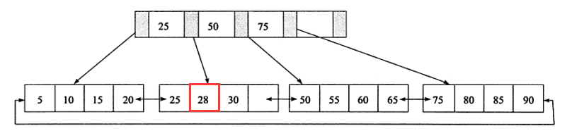
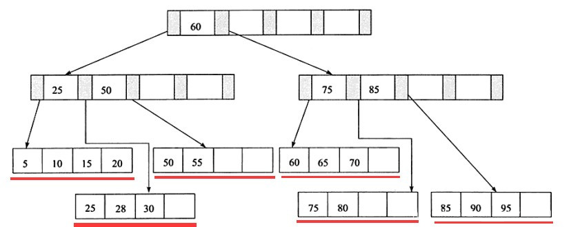
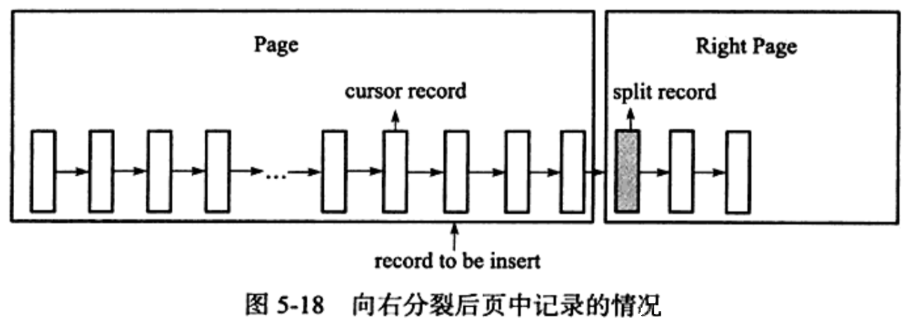

# 第五章 索引与算法

[TOC]

## 一、InnoDB 存储引擎索引概述

InnoDB 支持： B + 树索引、全文索引、哈希索引。

B+ 树索引并不能找到给定键值的具体行，只是被查找数据行所在的页，然后数据库通过把页读入内存中，在内存中查找想要的数据。

其中哈希索引是自适应的，即 InnoDB 会根据表的情况自动为表生成哈希索引，不能人为进行干预。

## 二、数据结构与算法

### （一）二分查找法

使用前提是记录是有序排列的，如每页 Page Directory 中的槽是按照主键的顺序存放的，对于某一条具体记录的查询是通过对 Page Directory 进行二分查找得到的。

### （二）二叉查找树和平衡二叉树

B+ 树是通过二叉查找树，再经过平衡二叉树 B 树演进而来。

二叉查找树：左子树的键值总是小于根的键值，右子树的键值总是大于根的键值，即通过中序遍历为递增顺序。

平衡二叉树数（AVL 树）：首先符合二叉查找树的定义，其次满足任何节点的两个子树的高度最大差为 1。平衡二叉树是性能很高的二叉查找树（不是最高，但最高维护成本高）。其在插入、更新、删除时候通过左旋或者右旋来实现维护，因为 AVL 树通常用于**内存结构**对象，所以维护开销相对较小。

## 三、B+ 树

B+ 树由 B 树（Balance 树）和索引顺序访问方法演化得到。B+ 树是为磁盘或者其他直接存取辅助设备设计的一种平衡查找树。B+ 树中所有记录节点都按照**键值的大小顺序存放在同一层的叶子节点上，由各个叶子节点指针进行连接。


### （一）B+树的插入操作

**B+ 树的插入操作必须保证插入后叶子节点中的记录依然排序**，同时需要考虑插入到B+树的三种情况，对应导致的不同插入算法：

- 叶子页（Leaf Page）仍有空间，索引页（Index Page）仍有空间的情况下，直接将记录插入到叶子节点。
- 叶子页没有空间，索引页仍有空间的情况下，拆分叶子页，将中间的节点放入索引页中，小于中间节点的记录放左边，大于等于中间节点的记录放右边。
- 叶子页没有空间，索引页没有空间的情况下，拆分叶子页，小于中间节点的记录放左边，大于等于中间节点的记录放右边，拆分索引页，小于中间节点的记录放左边，大于中间节点的记录放右边，中间节点放入上一层Index Page

针对情况一：插入键值 28；



针对情况二：再次插入键值 70；（叶子节点之间是有双向链表指针的）


针对情况三：再次插入键值 90；（叶子节点之间是有双向链表指针的）




此外为了保持平衡对于新插入的键值可能需要做大量的拆分页的操作，为了减少因页的拆分带来的磁盘操作，B+ 树提供了类似平衡二叉树的旋转功能。当叶子页已满，但是其左右兄弟节点未满，会将记录转移到兄弟节点上。如上述情况二中插入 70，此时 B+ 树会进行旋转而不是拆分叶子节点，减少一次页的拆分同时高度保持为 2。


### （二）B+ 树的删除操作

B+ 树使用填充因子（最低可设为 50%）来控制树的删除变化，删除操作同样必须保证删除后叶子节点中的记录依然排序，B+ 树的删除操作需要考虑三种情况，同时结合填充因子的变化来衡量：

- 叶子节点大于等于填充因子，且中间节点大于等于填充因子时，直接将记录从叶子节点删除，如果该节点是索引页的节点，用该节点的右节点代替；
- 叶子节点小于填充因子，且中间节点大于等于填充因子时，合并叶子节点和它的兄弟节点，同时更新索引页；
- 叶子节点小于填充因子，且中间节点小于填充因子时，合并叶子节点和它的兄弟节点，更新索引页，合并索引页和它的兄弟节点；


情况一：删除键值为 70 的记录


还是情况一：删除键值为 25 的记录


情况三：删除键值为 60 的记录，删除后填充因子小于 50%，进行合并操作，删除索引页中记录后也要合并。


## 四、B+ 树索引

B+ 树索引的本质就是 B+ 树在数据库中的实现，B+ 索引在数据库中的特点是高扇出性，树的高度一般在 2~4层（每次 IO 大约 0.1s）。数据库中的 B+ 树索引分为聚集索引和辅助索引，其区别是叶子节点存放的是否是一整行的信息。

磁盘信息见：https://tech.meituan.com/2017/05/19/about-desk-io.html 和 https://www.cnblogs.com/morgan363/p/12192159.html

### （一）聚集索引

InnoDB 存储引擎表是索引组织表，即表中数据按照主键顺序存放。聚集索引是按照每张表的主键构造的一颗 B+ 树，同时叶子节点存放的即为整张表的行数据，即叶子节点为数据页，因此索引组织表中的数据也是索引的一部分。同时每个数据页都通过一个双向链表来进行链接。每张表只能拥有一个聚集索引（因为数据页只能按照一棵 B+ 树进行排序），同时因为叶子节点即数据加上双向链表定义了数据的逻辑顺序，便于主键的排序查找和范围查找。

```
EXPLAIN SELECT  * FROM cluster_d ORDER BY a LIMIT 10;
```

下面的结果中并没有进行 filesort。 

   "id": 1,
    "select_type": "SIMPLE",
    "table": "cluster_t",
    "partitions": null,
    "type": "index",
    "possible_keys": null,
    "key": "PRIMARY",
    "key_len": "4",
    "ref": null,
    "rows": 4,
    "filtered": 100,
    "Extra": null
  同时如果针对主键进行范围查询，可以通过叶子节点的上层中间节点就可以得到页的范围，之后直接读取数据页即可。

```
EXPLAIN SELECT  * FROM cluster_d WHERE  a > 1 AND a < 100;
```

从下面的执行计划中：Rows 为查询结果的预估返回行数（不是确切值）。
    "id": 1,
    "select_type": "SIMPLE",
    "table": "cluster_t",
    "partitions": null,
    "type": "range",
    "possible_keys": "PRIMARY",
    "key": "PRIMARY",
    "key_len": "4",
    "ref": null,
    "rows": 3,
    "filtered": 100,
    "Extra": "Using where"

**示例**

创建表，同时让每页只能存放两个行记录。

```mysql
CREATE TABLE cluster_d(
    a INT NOT  NULL,
    b VARCHAR(8000),
    PRIMARY KEY (a)
)ENGINE = InnoDB;

INSERT INTO cluster_d SELECT 1,REPEAT('a',7000);
INSERT INTO cluster_d SELECT 2,REPEAT('a',7000);
INSERT INTO cluster_d SELECT 3,REPEAT('a',7000);
INSERT INTO cluster_d SELECT 4,REPEAT('a',7000);
```

使用工具分析结果为：

```mysql
Total number of page: 8:
File Space Header: 1
Insert Buffer Bitmap: 1
File Segment inode: 1
B-tree Node: 4
Freshly Allocated Page: 1"
page offset: 00000000, page type: <File Space Header>""
page offset: 00000001, page type: <Insert Buffer Bitmap>""
page offset: 00000002, page type: <File Segment inode>"
page offset: 00000003, page type: <B-tree Node>, page level: <0001>
page offset: 00000004, page type: <B-tree Node>, page level: <0000>
page offset: 00000005, page type: <B-tree Node>, page level: <0000>
page offset: 00000006, page type: <B-tree Node>, page level: <0000>"
page offset: 00000000, page type: <Freshly Allocated Page>"
```

使用 hexdump 分析 Page Level 为 0001 的索引根页中的数据，当前聚集索引的高度为 2，因此该页是 B+ 树的根。

```shell
0000c000: CA B5 0B 7A 00 00 00 03 FF FF FF FF FF FF FF FF    J5.z............
0000c010: 00 00 00 00 02 58 08 59 45 BF 00 00 00 00 00 00    .....X.YE?......
0000c020: 00 00 00 00 02 CF 00 02 00 A2 80 05 00 00 00 00    .....O..."......
0000c030: 00 9A 00 02 00 02 00 03 00 00 00 00 00 00 00 00    ................
0000c040: 00 01 00 00 00 00 00 00 01 DB 00 00 02 CF 00 00    .........[...O..
0000c050: 00 02 00 F2 00 00 02 CF 00 00 00 02 00 32 【01 00    ...r...O.....2..
0000c060: 02 00 1B】 【69 6E 66 69 6D 75 6D 00】 04 00 0B 00 00    ...infimum......
0000c070: 73 75 70 72 65 6D 75 6D 00 10 00 11 00 0E 【80 00    supremum........
0000c080: 00 01】 00 00 00 04 00 00 00 19 00 0E 【80 00 00 02】    ................
0000c090: 00 00 00 05 00 00 00 21 FF D6 【80 00 00 04】 00 00    .......!.V......
0000c0a0: 00 06 00 00 00 00 00 00 00 00 00 00 00 00 00 00    ................
0000c0b0: 00 00 00 00 00 00 00 00 00 00 00 00 00 00 00 00    ................
0000c0c0: 00 00 00 00 00 00 00 00 00 00 00 00 00 00 00 00    ................
0000c0d0: 00 00 00 00 00 00 00 00 00 00 00 00 00 00 00 00    ................
......
0000ffe0: 00 00 00 00 00 00 00 00 00 00 00 00 00 00 00 00    ................
0000fff0: 00 00 00 00 00 70 【00 63】 CA B5 0B 7A 02 58 08 59    .....p.cJ5.z.X.Y
```

通过页尾的 Page Directory 分析该页，其中 00 63 表示该页中行开始的位置。0xc063 开始的 69  6e 66 69 6d 75 6d 00 表示 infimum 为行记录，前面的 5 字节：01 00 02 00 1b 即为 Recorder Header。分析第 4 位到第 8 位的值 1 代表该行记录中只有一个记录（InnoDB 的 Page Directory 是稀疏的），即 infimum 本身。通过 Recorder Header 的最后两个字节 00 1b 可以知道下一条记录的位置：c063 + 1b = c07e，对应键值为：80 00 00 01，这就是主键为 1 的键值（因为定义时 INT 设置为无符号的，所以二进制为 0x80 00 00 01 而不是 0x0001），键值后面的值 00 00 00 04 表示指向数据页的页号。同样方式可以获得键值  80 00 00 02 和 80 00 00 04 及其指向的数据页。

因此数据页上存放的是完整的每行的记录，索引页中存放的是仅仅是键值和指向数据页的偏移量。因此该聚集索引树大致为：


聚集索引的存储不是按照物理上连续的，而是逻辑连续的：首先页通过双向链表链接，页按照主键的顺序排序；同时每个页中的记录也是通过双向链表进行维护，因此物理存储上同样可以不按照主键存储。

### （二）辅助索引（非聚集索引）

辅助索引的叶子节点不包含行记录的全部数据，叶子节点除了包含键值之外，每个叶子节点中的索引行还包含了一个书签，该书签用来告诉 InnoDB 存储引擎哪里可以找到与索引相对应的行数据。由于 InnoDB 存储引擎表是索引组织表，因此 InnoDB 存储引擎的辅助索引的书签就是相应行数据的聚集索引键。


辅助索引的存在不影响数据在聚集索引中的组织，因此**每张表上可以有多个辅助索引**，当通过辅助索引来寻找数据，InnoDB 会遍历辅助索引并通过页级别的指针获得指向主键索引的主键，然后再通过主键索引来找到一个完整的行记录。

**通过表空间文件分析 InnoDB 的非聚集索引的实际存储**：

对表 `cluster_d` 修改如下：

```mysql
ALTER TABLE cluster_d ADD c INT NOT NULL;
UPDATE cluster_d SET c = 0 - a;
ALTER TABLE cluster_d ADD KEY idx_c (c);

SHOW INDEX  FROM cluster_d;
```

| Table     | Non_unique | Key_name | Seq_in_index | Column_name | Collation | Cardinality | Sub_part | Packed | Null | Index_type | Comment | Index_comment |      |
| --------- | ---------- | -------- | ------------ | ----------- | --------- | ----------- | -------- | ------ | ---- | ---------- | ------- | ------------- | ---- |
| cluster_d | 0          | PRIMARY  | 1            | a           | A         | 4           |          |        |      | BTREE      |         |               |      |
| cluster_d | 1          | idx_c    | 1            | c           | A         | 4           |          |        |      | BTREE      |         |               |      |

表空间文件为：多出来的 page offset 为 4 的页就是非聚集索引所在页。

```shell
Total number of page: 9:
File Space Header: 1
Insert Buffer Bitmap: 1
File Segment inode: 1
B-tree Node: 5
Freshly Allocated Page: 1"
page offset: 00000000, page type: <File Space Header>""
page offset: 00000001, page type: <Insert Buffer Bitmap>""
page offset: 00000002, page type: <File Segment inode>"
page offset: 00000003, page type: <B-tree Node>, page level: <0001>
page offset: 00000004, page type: <B-tree Node>, page level: <0000>
page offset: 00000005, page type: <B-tree Node>, page level: <0000>
page offset: 00000006, page type: <B-tree Node>, page level: <0000>
page offset: 00000007, page type: <B-tree Node>, page level: <0000>"
page offset: 00000000, page type: <Freshly Allocated Page>"
```

```shell
0000fff0: 00 00 00 00 00 70 00 63 10 DC C9 CB 02 58 1F 40    .....p.c.\IK.X.@
00010000: EC 62 82 76 00 00 00 04 FF FF FF FF 00 00 00 05    lb.v............
00010010: 00 00 00 00 02 58 51 1F 45 BF 00 00 00 00 00 00    .....XQ.E?......
00010020: 00 00 00 00 02 D0 00 02 37 62 80 04 00 00 00 00    .....P..7b......
00010030: 1B F5 00 02 00 00 00 02 00 00 00 00 00 00 00 00    .u..............
00010040: 00 00 00 00 00 00 00 00 01 DC 00 00 00 00 00 00    .........\......
00010050: 00 00 00 00 00 00 00 00 00 00 00 00 00 00 01 00    ................
00010060: 02 00 1D 69 6E 66 69 6D 75 6D 00 03 00 0B 00 00    ...infimum......
00010070: 73 75 70 72 65 6D 75 6D 58 9B 00 00 00 10 1B 75    supremumX......u
00010080: 80 00 00 01 00 00 00 05 46 3D 26 00 00 01 1D 16    ........F=&.....
00010090: 0D 61 61 61 61 61 61 61 61 61 61 61 61 61 61 61    .aaaaaaaaaaaaaaa
000100a0: 61 61 61 61 61 61 61 61 61 61 61 61 61 61 61 61    aaaaaaaaaaaaaaaa
```

因为只有 4 行数据，同时列 c 只有 4 个字节，因为在一个非聚集索引页中即可完成。因为辅助索引 idx_c 和聚集索引关系如下：


辅助索引的叶子节点中包含列 C 的值和主键的值，这里的键值为负数，所以 -1 是以 7f ff ff ff 方式存储。

### （三）B+ 树索引的分裂

数据库中的 B+ 树索引页的分裂并不总是从页的中间记录开始，这样会导致空间的浪费。InnoDB 的 Page Header 中 Page_Last_Insert、Page_Direction、Page_N_Direction 用来保存顺序信息，并通过它们来决定是向左分裂还是向右分裂，同时决定分裂点记录为哪一个。

> 如原纪录为：1,2,3,4,5,6,7,8,9 当插入 10 的时候需要对页进行分裂操作，之前是以中间点 5 作为分裂点，形成页 1:1,2,3,4  页2:5,6,7,8,9,10。因为插入是顺序的，因此页 1 中不会有新的记录被插入，导致空间分配。

插入是随机的,则取页的中间记录作为分裂点的记录,这和之前介绍的相同。若往同一方向进行插入的记录数量为5,并且目前已经定位(cursor)到的记录(InnoDB存储引擎插入时,首先需要进行定位,定位到的记录为待插人记录的前条记录)之后还有3条记录,则分裂点的记录为定位到的记录后的第三条记录,否则分裂点记录就是待插入的记录。
来看一个向右分裂的例子,并且定位到的记录之后还有3条记录,则分裂点记录如图所示。


图5-17向右分裂且定位到的记录之后还有3条记录, split record为分裂点记录最终向右分裂得到如图5-18所示的情况。


对于图5-19的情况,分裂点就为插入记录本身,向右分裂后仅插入记录本身,这在自增插人时是普遍存在的一种情况


### （四）B+ 树索引的管理

#### 1、索引管理

索引的创建和删除可以通过两种方法，一种是Alter Table，另一种是Create/Drop Index。

```mysql
# alter table 方式
## 添加索引
alter table <table_name> add index <index_name>(column_list);
alter table <table_name> add unique(column_list);
alter table <table_name> add primary key(column_list);
## 删除索引
alter table <table_name> drop index <index_name>;
alter table <table_name> drop primary key;

# create/drop index
## 添加索引
create index <index_name> on <table_name>(column_list);
create unique index <index_name> on <table_name>(column_list);
## 删除索引
drop index <index_name> on <table_name>;
```

可以通过 `Show Index From <table name>`命令可以查看索引的信息。

用户可以对整个列的数据进行索引，也可以只索引列开头的部分数据，如列 a 为 varchar(8000)，可以只索引前 100 个字段：`ALTER TABLE t ADD KEY idx_a(a(100));`部分索引通过上面命令显示，查看 `Sub_part`字段值。

```mysql
CREATE TABLE index_t(
    a INT NOT NULL,
    b VARCHAR(3000),
    c INT NOT NULL,
    PRIMARY KEY (a),
    KEY idx_b (b(100)),
    KEY idx_a_c (a, c)
) ENGINE = InnoDB;

SHOW INDEX FROM index_t;
```

| Table   | Non_unique | Key_name | Seq_in_index | Column_name | Collation | Cardinality | Sub_part | Packed | Null | Index_type | Comment | Index_comment |      |
| ------- | ---------- | -------- | ------------ | ----------- | --------- | ----------- | -------- | ------ | ---- | ---------- | ------- | ------------- | ---- |
| index_t | 0          | PRIMARY  | 1            | a           | A         | 0           |          |        |      | BTREE      |         |               |      |
| index_t | 1          | idx_b    | 1            | b           | A         | 0           | 100      |        | YES  | BTREE      |         |               |      |
| index_t | 1          | idx_a_c  | 1            | a           | A         | 0           |          |        |      | BTREE      |         |               |      |
| index_t | 1          | idx_a_c  | 2            | c           | A         | 0           |          |        |      | BTREE      |         |               |      |

Table：索引所在的表名

Non_unique：非唯一索引，primary key 必须唯一，所以值为 0。

Key_name：索引名称，可以用于 Drop index ；

Seq_in_index：索引中该列的位置，主要用于联合索引；

Column_name：索引列的名称；

Collation：列以何种方式存储在索引中。B+ 树索引值为 A，表示排序的，Heap 存储引擎中的 HASH 索引未排序，所以值为 NULL。

Cardinality：表示索引中唯一值的数目的估计值， `cardinality/n_rows_in_table` 尽可能的等于 1，如果非常小应该考虑删除该索引。

同时优化器会根据该值判断是否使用该索引，该值并非每次索引更新时都会更新该值（即非实时更新，只是大概的值）。可以使用 `ANALYZE TABLE <table name>` 命令显式更新该值。当某些情况下发生索引建立了但是没有用到或者两条基本一样的语句执行 EXPLAIN，其中一个使用索引，另一个使用全表扫描，则该值可能为 NULL，此时还是通过上述语句进行显式更新。

Sub_part：是否是列的部分被索引。如 `idx_b` 显示 100，表示只对 b 列的前 100 字节索引，如果是索引整个列则该字段为 NULL。

Packed：关键词如何被压缩，如果没有压缩则为 NULL。

Null：是否索引的列含有 NULL 值，如果为 Yes 表示索引对应的列允许 NULL 值。

Index_type：索引的类型。InnoDB 只支持 B+ 树索引，所以显示 BTree。

Comment：注释。 		

### 2、Fast Index Creation

5.5 版本前 MySQL 对于如索引的添加或者删除这类 DDL 操作，操作过程为（时间较长，堵塞时间较长）：

- 首先创建一张新的临时表，表结构为通过命令 Alter table 新定义的结构；
- 将原表中的数据导入到临时表；
- 删除原表；
- 将临时表命名为原来表名；

Fast Index Creation （FIC）即快速索引创建，对于辅助索引的创建，InnoDB存储引擎会对创建索引的表加上一个S锁，可以并发地读事务（写操作还是不能使用）。对于辅助索引的删除，InnoDB存储引擎只需要更新内部视图，并将辅助索引的空间标记为可用，同时删除MySql数据库内部视图上对该表的索引定义。

FIC 只限定于辅助索引，对主键的创建的删除同样需要重建一张表。

### 3、Online Schema Change

Online Schema Change即在线架构改变，在线是指在事务的创建过程中，可以有读写事务对表进行操作，以提高原有Mysql数据库在DDL操作时的并发性。OSC 只是一个 PHP脚本，同时要修改的表一定要有主键、不能存在外键和触发器。

### 4、Online DDL

FIC 让 InnoDB 避免创建临时表，提升了索引创建效率，但是索引创建时候会阻塞表上的 DML 操作，OSC 解决了部分问题但是存在较大的局限性。

Mysql5.6 开始支持 Online DDL（在线数据定义）操作，允许辅助索引创建的同时，还允许DML（insert、update、delete）操作，极大的提高了 MySQL 数据库在生产环境中的可用性。不仅是辅助索引，其他如「辅助索引的创建与删除」、「改变自增长值」、「添加或删除外键约束」、「列的重命名」。此外可以使用Alter Table语法选择索引的创建方式：

```mysql
ALTER TABLE <table name>
| ADD {INDEX | KEY}[index_name]
[index_type] (index_col_name,....)[index_option]...
ALGORITHM [=] {DEFAULT | INPLACE |COPY}
LOCK [=] {DEFAULT | NONE | SHARED | EXCLUSIVE}
```

- Copy：表示按照创建临时表的方式创建索引
- Inplace：表示索引创建或删除操作不需要创建临时表
- Default：表示根据 `old_alter_table`参数来判断是通过 Inplace 还是 Copy，该参数默认为 Off，表示采用 Inplace 方式

创建索引中的 Lock 部分为索引创建或删除时对表添加锁的情况：

- None：表示执行索引创建或删除操作时，对目标表不添加任何锁，即事务可以进行读写操作，不会受到阻塞，支持最大的并发度；
- Share：表示执行索引的创建或删除操作时，对目标表加一个S锁，支持并发地读事务，遇到写事务会等待；
- Exclusive：表示执行索引创建或删除操作时，对目标表加上一个X锁，读写事务都不能进行，因此会阻塞所有的线程。类似于 Copy 但是不创建临时表。
- Default：表示首先会判断当前操作是否可以使用None模式，若不能则判断是否可以使用Share模式，最后判断是否可以使用Exclusive模式

**InnoDB 实现 Online DDL 原理**：

在执行创建或者删除操作的同时，将 INSERT、UPDATE、DELETE 等 DML 操作日志写入一个缓存中。待完成索引创建后将将其重做应用到表上，从而达到数据一致性。缓存大小由参数 `innodb_online_alter_log_max_size` 控制，默认为 128MB，当放不下会抛出异常。

### 5、Cardinality值

### 1、什么是Cardinality

不是所有查询条件中出现的列都需要添加索引，当某个字段的取值范围很广，机会没有重复时即属于高选择性，此时使用B+树索引是最合适的，如何查看索引是否是高选择性的，通过Show Index结果中的Cardinality列可以知晓，它表示所重复记录数量的预估值，理论情况下它与行数据的比例应该尽可能的接近1

### 2、InnoDB存储引擎的Cardinality统计

数据库对于Cardinality的统计是在引擎层进行的，通过采样方式完成。其统计发生在两个操作中，Insert和Update，当表中1/16的数据发生变化后会进行更新，或者对表中某一行的数据频繁地进行更新操作时，即当更新统计参数stat_modified_counter大于2000000000时，同样会更新Cardinality信息

### 6、B+树索引的使用

### 1、不同应用中B+树索引的使用

对于OLTP应用，即查询一小部分数据时，对索引的使用则是通过索引取得表中少部分的数据。对于OLAP应用，较为复杂的查询涉及表的关联查询，此时索引的添加依旧是有意义的

### 2、联合索引

联合索引是指对表上多个列进行索引，联合索引也是一颗B+树，不同的是联合索引的键值的数量不是1而是大于等于2的。对于(a,b)类型的联合索引，对于单个的a列查询同样可以使用该联合索引。此外它的另一个好处是已经对第二个键值进行了排序处理。

### 3、覆盖索引

InnoDB存储引擎支持覆盖索引，即从辅助索引中就可以得到查询的记录，而不需要查询聚集索引中的记录，此外覆盖索引的好处是辅助索引不包含整行记录的所有信息，其大小远小于聚集索引，可以减少大量的IO操作。此外针对一些统计查询，也可以减少部分IO操作

### 4、优化器选择不使用索引的情况

在某些情况下，优化器会选择扫描聚集索引查找数据，即全表扫描，这类情况多发生于范围查找和Join链接操作。当访问数据占整个表的20%时，优化器会选择聚集索引来查找数据

### 5、索引提示

Mysql数据库支持显示地告诉优化器使用哪个索引，以下两种情况下需要使用索引提示（Index Hint）：

- Mysql数据库优化器错误地选择了某个索引，导致SQL执行很慢
- 某SQL语句可以选择的索引非常多，优化器执行计划时间的开销大于SQL语句本身

### 6、Multi-Range Read优化

Mysql5.6版本开始支持Multi-Range Read（MRR）优化，其目的是为了减少磁盘的随机访问，并且将随机访问转换为较为顺序的数据访问，对于IO-bound类型的SQL查询语句带来极大的提升，此外可以并减少缓冲池中页被代替的次数，并批量处理对键值的查询操作。

对于InnoDB和MyISAM存储引擎的范围查询和Join查询操作，MRR的工作方式如下：

- 将查询得到的辅助索引值存放于一个缓存中，且缓存中的数据是根据辅助索引键值排序的
- 将缓存中的键值根据RowID进行排序
- 根据RowID的排序顺序来访问实际的数据文件

此外启用Multi-Range Read还可以将某些范围的查询拆分为键值对，来进行批量的查询，而非查询出来一部分后再进行过滤

### 7、Index Confition Pushdown优化

一般情况下在进行索引查询时，会更加索引来查找数据，然后再根据Where条件来过滤记录，而在Mysql5.6支持Index Confition Pushdown以后，Mysql数据库会在去除索引的同时，判断是否可以进行Where条件的过滤，在某些情况下，可以大大减少上层SQL层对记录的fetch，从而提高性能

### 7、哈希算法

### 1、哈希表

哈希表也称散列表，由直接寻址表改进而来，在该方式下可以根据关键字计算出槽的位置，再利用哈希函数h可以将关键字域银蛇到哈希表的槽位上。

对于哈希碰撞问题，数据库一般采用的技术称为链接法。链接法会将散列到同一槽中的所有元素放在一个链表中。对于哈希函数，数据库一般采用除法散列实现，如将关键字映射到m个槽的某一个去，则通过k mod m得到余数

### 2、InnoDB存储引擎中的哈希算法

InnoDB存储引擎中采用哈希算法对字典进行查找，其冲突机制采用链表方式，哈希函数采用除法散列方式。m的取值为略大于2倍的缓冲池页数量的质数。

### 3、自适应哈希索引

自适应哈希索引由数据库自身创建并使用，经哈希函数映射到一个哈希表中，对于字典的查找非常快速，但是对于范围查找无能为力

### 8、全文检索

### 1、概述

全文检索是将存储于数据库中的整本书或者整篇文章中的任意内容信息查找出来的技术，它可以根据需要获得全文中所有的有关章、节、段、句、词等信息，也可以进行各种统计和分析

### 2、倒排索引

全文索引通常使用倒排索引实现，倒排索引和B+树索引一样也是一种索引结构，它在辅助表中存储了单词与单词自身在一个或多个文档中所在位置之间的映射。其通常利用关联数组实现，拥有两种表现形式：

- inverted file index，表现形式为{单词，单词所在文档的ID}
- full inverted index，其表现形式为{单词，(单词所在文档的ID，在具体文档中的位置)}

### 3、InnoDB全文检索

InnoDB存储引擎从1.2.x版本开始支持全文检索的技术，采用full inverted index方式，（DocumentId，Postion）被视为一个ilist，因此在全文检索的表中，有两个列，一个是Word字段，另一个是ilist字段，Word字段上设有索引。

倒排索引需要将word存放在一张表中，这个表称为辅助表，InnoDB共有6个辅助表，并且持久化地存放在磁盘上，此外InnoDB还用到了FTS Index Cache全文检索索引缓存，用来提高全文检索的性能。它是一个红黑树结构，根据(word,ilist)进行排序。InnoDB会批量对辅助表进行更新，而不是每次插入后更新一次辅助表。

当前InnoDB存储引擎的全文索引还存在以下限制：

- 每张表只能有一个全文检索的索引
- 由多列组合而成的全文检索的索引列必须使用相同的字符集与排列规则
- 不支持没有单词界定符的语言，如中文、日语、韩语

### 4、全文检索

Mysql支持全文检索的查询，其语法为语法支持全文检索的查询，Match指定了需要被查询的列，Against指定了使用何种方法去进行查询，下面介绍查询模式

```
Mactch()...Against()
```

### 1、Natural Language

全文检索通过Match函数进行查询，默认采用Natural Language模式，其表示查询带有指定word的文档，如通常使用的，若使用全文检索技术，可以使用

```
select * from tableA where body like '%xx%'
select * from tableA where Match(body) Against('xx')
```

Where条件中的使用Match函数，查询返回的结果是根据相关性进行排序的，相关性最高的结果放在第一位，其计算依据如下：1).word是否在文档中出现；2).word在文档中出现的次数；3).word在索引中列的数量；4).多少个文档包含该word

### 2、Boolean

Mysql数据库允许使用In Boolean Mode修饰符来进行全文的检索，Boolean全文检索支持以下几种操作符：

- +表示该word必须存在
- -表示该word必须被排除
- (no operator)表示该word是否是可选的，如果出现，相关性会更高
- @distance表示查询的多个单词之间的距离是否在distance之内，其单位是字节
- \>表示出现该单词时增加相关性
- <表示出现该单词时降低相关性
- ~表示允许出现该单词，但是出现时相关性为负
- *表示以该单词开头的单词
- ”表示短语

### 3、Query Expansion

Mysql数据库支持全文检索的扩展查询，此类查询在查询的关键词太短，用户需要隐含知识时进行。通过在查询短语中添加With Query Expansion或者In Natural Language Mode With Query Expansion可以开启blind query expansion。该查询分为两个阶段：

- 第一阶段：根据搜索的单词进行全文索引查询
- 第二阶段：根据第一阶段产生的分词再进行一次全文检索的查询
