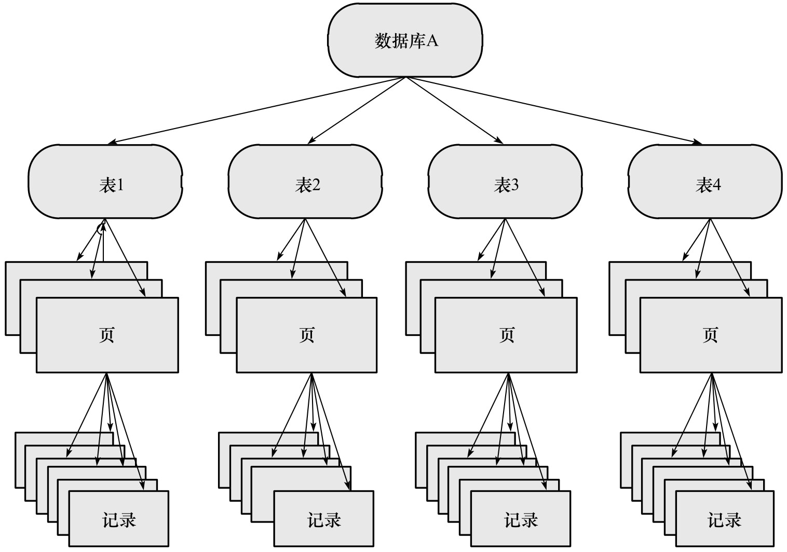

# 第六章：锁

只有当实现本身会增加开销时，行级锁才会增加开销。InnoDB 不需要锁升级，因为一个锁和多个锁的开销是相同的。

锁用于管理和支持对共享资源的并发访问，同时提供数据的完整性和一致性。同时各个存储引擎对锁的实现均不相同，InnoDB 提供一致性的非锁定读、行级锁支持。行级锁没有相关额外的开销，并可以同时得到并发性和一致性。

## 一、Lock 和 Latch

Latch 称为闩锁（轻量级的锁），其要求锁定的时间必须比较短。InnoDB 中的 Latch 分为 mutex（互斥量）和 rwlock（读写锁），目的在于保证并发线程操作临界资源的正确性，并且没有死锁检测的机制。

**Lock 的对象是事务**，用来锁定数据库中的对象（如表、页、行）。通常 lock 的对象仅在对象 commit 或者 rollback 后进行释放（不同事务隔离级别释放的时间可能不同）。且存在死锁检测机制。

|          | lock                                                    | latch                                                        |
| -------- | ------------------------------------------------------- | ------------------------------------------------------------ |
| 对象     | 事务                                                    | 线程                                                         |
| 保护     | 数据库内容                                              | 内存数据结构                                                 |
| 持续时间 | 整个事务过程                                            | 临界资源                                                     |
| 模式     | 行锁、表锁、意向锁                                      | 读写锁、互斥量                                               |
| 死锁     | 通过 waits-for graph、time out 等机制进行死锁检测和处理 | 无死锁检测和处理机制。仅通过应用程序加锁的顺序（lock leveling）保证无死锁的情况发生 |
| 存在于   | Lock Manager 的哈希表中                                 | 每个数据结构的对象中                                         |

**Latch 信息查看**：
通过命令 `SHOW ENGINE INNODB MUTEX`，结果如下：

| Type   | Name                        | Status   |
| ------ | --------------------------- | -------- |
| InnoDB | rwlock: dict0dict.cc:2782   | waits=1  |
| InnoDB | rwlock: dict0dict.cc:1228   | waits=6  |
| InnoDB | rwlock: log0log.cc:846      | waits=68 |
| InnoDB | sum rwlock: buf0buf.cc:1460 | waits=6  |

其中 Type 列总是 InnoDB，Name 列为 latch 的信息和所在源码的位置（行数），列 status 信息结构如下：

名称|说明
---|---
count| mutex 被请求的次数 
spin_waits| spin lock(自旋锁)的次数，InnoDB 存储引擎 latch 在不能获得锁时首先进行自旋，若自旋后还不能获得锁，则进入等待状态 
spin_rounds| 自旋内部循环的总次数,每次自旋的内部循环是一个随机数。 spin rounds/spain waits 表示平均每次自旋所需的内部循环次数 
os_waits| 表示操作系统等待的次数。当 spin lock 通过自旋还不能获得 latch 时，则会进入操作系统等待状态，等待被唤醒 
os_yields| 进行 os_thread_yield 唤醒操作的次数 
os_wait_times| 操作系统等待的时间，单位是 ms 

**lock 信息查看**：

通过 `SHOW ENGINE INNODB STATUS` 和 `information_schema` 架构下的 `INNODB_TRX`、`INNODB_LOCKS` 和 `INNODB_LOCK_WAITS` 来观察锁的信息。

```log
----------
SEMAPHORES
----------
OS WAIT ARRAY INFO: reservation count 112
OS WAIT ARRAY INFO: signal count 104
RW-shared spins 0, rounds 164, OS waits 79
RW-excl spins 0, rounds 151, OS waits 1
RW-sx spins 1, rounds 30, OS waits 1
Spin rounds per wait: 164.00 RW-shared, 151.00 RW-excl, 30.00 RW-sx
```

## 二、InnoDB 存储引擎中的锁

### （一）锁的类型

InnoDB 实现了两种标准的行级锁：

- 共享锁（S Lock）：允许一个事务读一行数据；
- 排它锁（X Lock）：允许一个事务删除或者更新一行数据；

锁兼容：事务 T1 已经获得行 r 的共享锁，事务 T2 可以立即获得行 r 的共享锁；因为读取并不改变行 r 的数据；

锁不兼容：此时事务 T3 想获得行 r 的排它锁，则必须等待事务 T1、T2 释放行 r 上的共享锁。

|      | X      | S      |
| ---- | ------ | ------ |
| X    | 不兼容 | 不兼容 |
| S    | 不兼容 | 兼容   |

这里的 X 和 S 锁都是行锁，兼容是指对统一记录（row）锁的兼容性情况。

InnoDB 通过意向锁支持多粒度锁定，该锁定允许事务在行级上的锁和表级上的锁同时存在。意向锁是将锁定的对象分为多个层次，意味着事务希望在更细粒度上进行加锁。

如果想要对最下层（最细粒度）的对象上锁，首先需要对粗粒度的对象上锁，如当需要对页上的记录 r 上 X 锁，则首先分别需要对数据库 A、表、页上意向锁 IX，最后对记录 r 上 X 锁。如果前面任一部分导致等待，则该操作需要等待粗粒度锁的完成。如在对记录 r 加 X 锁之前，以及有事务对表 1 进行了 S 表锁，则表 1 上已存在 S 锁，之后事务需要对记录 r 上加上 IX，由于锁的不兼容，所以该事务需要等待表锁操作的完成。



InnoDB 的意向锁即为表级别的锁，目的主要是在一个事务中揭示下一行将被请求的锁类型，支持两种意向锁：

- 意向共享锁（IS Lock）：事务想要获得一张表中某几行的共享锁；
- 意向排它锁（IX Lock）：事务想要获得一张表中某几行的排它锁；

InnoDB 支持的是行级别的锁，所以意向锁不会阻塞除全表扫描以外的任何请求。表级意向锁和行级锁的兼容性：

|      | IS     | IX     | S      | X      |
| ---- | ------ | ------ | ------ | ------ |
| IS   | 兼容   | 兼容   | 兼容   | 不兼容 |
| IX   | 兼容   | 兼容   | 不兼容 | 不兼容 |
| S    | 兼容   | 不兼容 | 兼容   | 不兼容 |
| X    | 不兼容 | 不兼容 | 不兼容 | 不兼容 |

查看当前数据库中锁的请求和事务锁的情况通过 information.schema 架构下的 `INNODB_TRX`/`INNODB_LOCKS`/`INNODB_LOCK_WAITS` 三张表。

**表 INNODB_TRX 的结构说明**

该表只显示当前运行的 InnoDB 事务，并不能直接判断说的一些情况。

| **字段名**            | **说明**                                                     |
| --------------------- | ------------------------------------------------------------ |
| trx_id                | InnoDB 存储引擎内部唯一的事务 ID                             |
| trx_state             | 当前事务的状态                                               |
| trx_started           | 事务的开始时间                                               |
| trx_requested_lock_id | 等待事务的锁ID，如 `trx_state` 的状态为 LOCK WAIT，那么该值代表当前的事务等待之前事务占用锁资源的 ID。若 `trx_state` 不是 LOCK WAIT， 则该值为 NULL |
| trx_wait_started      | 事务等待开始的时间                                           |
| trx_weight            | 事务的权重，反映了一个事务修改和锁定的行数。在 InnoDB 中，当发生死锁需要回滚时，InnoDB 存储引擎会选择该值最小的进行回滚 |
| trx_mysql_thread_id   | MySQL 中的线程 ID，`SHOW PROCESSLIST` 显示的结果             |
| trx_query             | 事务运行的语句                                               |

例如下面的 SQL 语句：

```mysql
BEGIN;
SELECT * FROM fq WHERE id = 1 FOR UPDATE;   ---- 客户端一执行；

BEGIN;
UPDATE fq SET name = 'g' WHERE id = 1;  ----- 客户端二执行；

SELECT * FROM information_schema.INNODB_TRX;   ---客户端三执行；
```

输出结果为：

```json
[
  {
    "trx_id": "393252",
    "trx_state": "LOCK WAIT",    =======> trx_id 为 393252 的事务处于 Lock wait 状态
    "trx_started": "2021-08-01 18:37:35",
    "trx_requested_lock_id": "393252:667:3:3",
    "trx_wait_started": "2021-08-01 18:37:35",
    "trx_weight": 2,
    "trx_mysql_thread_id": 5,
    "trx_query": "UPDATE fq SET name = 'g' WHERE id = 1",  ======》运行的 SQL 语句
    "trx_operation_state": "starting index read",
    "trx_tables_in_use": 1,
    "trx_tables_locked": 1,
    "trx_lock_structs": 2,
    "trx_lock_memory_bytes": 1136,
    "trx_rows_locked": 1,
    "trx_rows_modified": 0,
    "trx_concurrency_tickets": 0,
    "trx_isolation_level": "REPEATABLE READ",
    "trx_unique_checks": 1,
    "trx_foreign_key_checks": 1,
    "trx_last_foreign_key_error": null,
    "trx_adaptive_hash_latched": 0,
    "trx_adaptive_hash_timeout": 0,
    "trx_is_read_only": 0,
    "trx_autocommit_non_locking": 0
  },
  {
    "trx_id": "393251",
    "trx_state": "RUNNING",   =======》trx_id 为 393247 事务正在运行
    "trx_started": "2021-08-01 18:37:29",
    "trx_requested_lock_id": null,
    "trx_wait_started": null,
    "trx_weight": 2,
    "trx_mysql_thread_id": 3,
    "trx_query": null,
    "trx_operation_state": null,
    "trx_tables_in_use": 0,
    "trx_tables_locked": 1,
    "trx_lock_structs": 2,
    "trx_lock_memory_bytes": 1136,
    "trx_rows_locked": 1,
    "trx_rows_modified": 0,
    "trx_concurrency_tickets": 0,
    "trx_isolation_level": "REPEATABLE READ",
    "trx_unique_checks": 1,
    "trx_foreign_key_checks": 1,
    "trx_last_foreign_key_error": null,
    "trx_adaptive_hash_latched": 0,
    "trx_adaptive_hash_timeout": 0,
    "trx_is_read_only": 0,
    "trx_autocommit_non_locking": 0
  }
]
```

**表 INNODB_LOCKS 的结构**：

查看锁的相关信息。

| **字段名**  | **说明**                                      |
| ----------- | --------------------------------------------- |
| lock_id     | 锁的 ID                                       |
| lock_trx_id | 事务 ID                                       |
| lock_mode   | 锁的模式                                      |
| lock_type   | 锁的类型，表锁还是行锁                        |
| lock_table  | 要加锁的表                                    |
| lock_index  | 锁住的索引                                    |
| lock_space  | 锁对象的 space id                             |
| lock_page   | 事务锁定页的数量。若是表锁，则该值为 NULL     |
| lock_rec    | 事务锁定行的数量。若是表锁，则该值为 NULL     |
| lock_data   | 事务锁定记录的主键值，若是表锁，则该值为 NULL |

上述操作的结果为：

`SELECT * FROM information_schema.INNODB_LOCKS;` 查看当前锁的信息

```json
[
  {
    "lock_id": "393252:667:3:3",
    "lock_trx_id": "393252",
    "lock_mode": "X",      =======》trx_id 为 393252 的事务也向表 fq 申请一个 X 的行锁
    "lock_type": "RECORD",
    "lock_table": "`lianxi`.`fq` /* Partition `less10` */",
    "lock_index": "PRIMARY",
    "lock_space": 667,
    "lock_page": 3,
    "lock_rec": 3,
    "lock_data": "1"    ====》 申请锁住的资源和 393251 事务是相同的资源，因此只能等待
  },
  {
    "lock_id": "393251:667:3:3",
    "lock_trx_id": "393251",
    "lock_mode": "X", =====》trx_id 为 393251 的事务向表 fq 加了一个 X 的行锁
    "lock_type": "RECORD",
    "lock_table": "`lianxi`.`fq` /* Partition `less10` */",
    "lock_index": "PRIMARY",
    "lock_space": 667,
    "lock_page": 3,
    "lock_rec": 3,
    "lock_data": "1"
  }
]
```

注意：`lock_data` 显示的值并不一定准确。如果是执行范围查找，则 `lock_data` 可能只返回第一行的主键值。同时如果当前资源被锁住了，且锁住的页因为 InnoDB 缓冲池的容量导致该页从缓冲池被刷出，则该值会显示为 NULL，即 InnoDB 不会从磁盘再一次查找。

通过 `INNODB_LOCKS` 表可以获取每张表上锁的情况，从而判断以此引发的等待情况，通过 `INNODB_LOCKS_WAITS` 表可以直观的反映当前事务的等待。

**表 INNODB_LOCK_WAITS 的结构**

| 字段名             | 说明               |
| ------------------ | ------------------ |
| requesting_trx_id  | 申请锁资源的事务ID |
| requesting_lock_id | 申请的锁的ID       |
| blocking_trx_id    | 阻塞的事务ID       |
| blocking_lock_id   | 阻塞的锁的ID       |

通过 `SELECT * FROM information_schema.INNODB_LOCK_WAITS;` 获取结果为：

可以看出是哪个事务阻塞了哪个事务，可以通过给出的事务和锁的 ID 联合前面两张表查询所有信息。

```mysql
[
  {
    "requesting_trx_id": "393252",
    "requested_lock_id": "393252:667:3:3",
    "blocking_trx_id": "393251",
    "blocking_lock_id": "393251:667:3:3"
  }
]
```

### （二）一致性非锁定读

一致性非锁定读指 InnoDB 通过行多版本控制的方式来读取当前执行时间数据库中行的数据。当读取的行正在执行 delete 或者 update 操作，此时读取操作不会等待行上锁的释放，InnoDB 会去读取行的一个快照数据。从而提高了数据库的并发性。

非锁定读的含义：不需要等待访问的行上 X 锁的释放，快照数据是指该行的之前版本的数据，通过 undo 段来实现，同时 undo 用于在事务中回滚数据，因此快照数据本身没有额外的开销。同时读取快照数据不需要上锁，因为没有事务需要对历史的数据进行修改操作。

非锁定读是 InnoDB 的默认读取方式，即读取不会占用和等待表上的锁。但不是在所有的事务隔离级别下都采用非锁定读，同时及时采用但是对于快照数据的定义也不相同。

多版本并发控制（MVCC）：快照数据就是当前数据之前的历史版本，每行记录可能有多个版本，该技术即为多版本并发控制。


在 READ COMMITTED 和 REPEATABLE READ（默认）的隔离级别下，InnoDB 使用非锁定一致性读，但两者对于快照版本定义不同。READ COMMITTED 中，非一致性读总是读取被锁定行的最新一份快照数据，REPEATABLE READ 下，非一致性读总是读取事务开始时的行版本数据。

```mysql
# 会话 sessionA
BEGIN;                   -- 显式开启一个事务，但是事务并没有结束
SELECT * FROM fq WHERE id = 1;

# 会话 sessionB
BEGIN;               -- 再开启一个事务，模拟并发情况，但是事务同样未提交
UPDATE fq SET id = 3 WHERE id = 1; -- 这里对 id = 1 的行加了 X 锁


## 再回到 sessionA 执行
SELECT * FROM fq WHERE id = 1; -- 在默认隔离级别下，此时会使用非锁定的一致性读。   ====》结果为 1
-- 其实此时无论是 READ COM 还是 REPE READ 显示的结果都是一样的，以为 id = 1 的行只被修改了一次，只有一个行版本的记录。

## 再回到 sessionB 执行
COMMIT;   -- 提交会话 B 中的事务

## 再回到 sessionA 执行
SELECT * FROM fq WHERE id = 1;
-- 此时针对不同隔离级别的结果则不同。
-- READ COMM 总是读取行的最新版本，如果行被锁定了，则读取该行版本的最新一个快照。因为 B 已经提交了事务，所以结果为空（id = 1 已经被修改为 3，没有 1 了）
-- REPE READ 总是读取事务开始时的行数据，因此结果仍然为 1。
```


### （三）一致性锁定读

默认事务隔离级别 REPEATABLE READ 模式下，InnoDB 的 SELECT 操作使用一致性非锁定读。但某些情况下用户需要显式地对数据库读取操作进行加锁以保证数据逻辑的一致性。InnoDB 对 SELECT 只读操作语句支持两种一致性的锁定读操作：

- SELECT…FOR UPDATE

    会对读取的行记录加一个 X 锁，其它事务不能对已锁定的行加任何锁。

- SELECT…LOCK IN SHARE MODE

    会对读取的行记录加一个 S 锁，其他事务只能对已锁定的行加 S 锁，如果加 X 锁则被阻塞。

对于一致性非锁定读，即是读取的行被执行 SELECT…FOR UPDATE 也是可以进行读取的；

SELECT…FOR UPDATE 和 SELECT…LOCK IN SHARE MODE 必须在一个事务中，事务被提交之后锁也就释放了，因此上述两个 SELECT 语句前务必使用 BEGIN、START TRANSACTION 或者 SET AUTOCOMMIT =  0。

### （四）自增长和锁

[详细分析博客](https://www.cnblogs.com/zhoujinyi/p/3433823.html?spm=5176.100239.blogcont38438.3.q5AneX)

InnoDB 的内存结构中对每个含有自增长值的表都有一个自增长计数器，当含有自增长的计数器的表进行插入操作时，该计数器会被初始化并且执行下面语句得到计数器的值。`SELECT MAX(auto_inc_col) FROM t FOR UPDATE`，将该值 + 1 赋予自增长列，该实现方式称为 AUTO-INC Locking，该锁是一种特殊的表锁机制，同时为了提高插入性能，锁在完成对自增长值插入的 SQL 语句之后立即释放，而不是等待事务完成才释放。但是对于自增长值的列的并发插入性能仍然较差，事务必须等待前一个插入的完成（不用等完整的事务完成）。

5.1 版本后 InnoDB 提供一种能够提高自增长值插入性能的轻量级互斥量的自增长实现机制。

**自增长的插入进行分类**：插入类型

| 插入类型           | 说明                                                         |
| :----------------- | :----------------------------------------------------------- |
| insert-like        | 指所有的插入语句，如insert，replace，insert—select,replace—select,load data等 |
| simple inserts     | 指能在插入之前就确定插入行数的语句。这些语句包含insert、replace等，需要注意的是：simple inserts不包含insert—on duplicater key update这类SQL语句 |
| bulk inserts       | 指在插入之前不能确定得到插入行数的语句，如insert—select，replace–select，load data |
| mixed-mode inserts | 指插入中有一部分的值是自增长的，有一部分是确定的，如INSERT INTO t1(c1,c2) VALAUES (1,’a’),(null,’b’),(5,’e’); 或者指 INSERT … ON DUPLICATE KEY UPDATE 这类sql语句。 |

该机制通过参数 `innodb_autoinc_lock_mode`来控制自增长的模式，默认值为 1 ，所有取值及其含义如下：

| innodb_autoinc_lock_mode | 说明                                                         |
| :----------------------: | :----------------------------------------------------------- |
|            0             | 这是MySQL5.1.22版本之前自增长的实现方式，即通过表锁的AUTO-INC Locking方式，因为有了新的自增长实现方式，0这个选项不应该是新版用户的首选项 |
|            1             | 这是该参数的默认值。对于simple inserts，该值会用互斥量去对内存中的计数器进行累加的操作，对于bulk inserts，还是使用传统表锁的AUTO-INC Locking方式。在这种配置下，如果不考虑回滚操作，对于自增长列的增长还是连续的，并且在这种方式下，statement-based方式的replication还是能很好地工作。需要注意的是，如果已经使用AUTO-INC Locking方式去产生自增长的值，而这时需要进行simple inserts的操作时，还是需要等待AUTO-INC Locking的释放 |
|            2             | 在这个模式下，对于所有的insert-like自增长的产生都是通过互斥量，而不是通过AUTO-INC Locking的方式，显然这时性能最高的方式。然而会带来一定的问题。因为并发插入的存在，在每次插入时，自增长的值可能不是连续的。最重要的是，基于Statment-base replication会出现问题。因此，使用这个模式，任何时候都应该使用row-base replication，这样才能保证最大的并发性能及replication主从数据的一致。 |

MyISAM 是表锁设计，自增长不需要考虑并发插入问题，和 InnoDB 的自增长实现不同。同时在 InnoDB 中，自增长的列必须是索引，同时必须为索引的第一列，否则抛出异常。

### （五）外键和锁

外键主要用于引用完整性的约束检查，InnoDB 中如果没有显式的对外键列添加索引，则会自动对其加上一个索引从而避免表锁。

对于外键值的插入或更新，首先需要查询父表中的记录，即 SELECT 父表，但是对父表的 select 操作，不是使用一致性非锁定锁，因为这样会发生数据不一致的问题，因此这时使用的是select … lock in share mode方式，即主动对父表加一个S锁，如果这时父表上已经加了X锁，子表的操作会被阻塞。

| 时间 | 会话 A                           | 会话 B                                                       |
| ---- | -------------------------------- | ------------------------------------------------------------ |
| 1    | BEGIN                            |                                                              |
| 2    | DELETE FROM parent WHERE id = 3; |                                                              |
| 3    |                                  | BEGIN                                                        |
| 4    |                                  | INSERT INTO child SELECT 2,3<br />#第二列是外键，执行该句时会把阻塞（wait） |

因为 id = 3 的父表在回话 A 中加了 X 锁，当会话 B 也需要对父表汇总 id = 3 的行加 S 锁会被阻塞。如果访问父表使用一致性非锁定读，则会话 B 会读到父表有 id = 3 的记录，可以进行插入操作，此时会话 A 对事务进行提交，则父表中就不存在 id = 3 的记录，导致数据在父表和子表中不一致。

## 三、锁的算法

#### （一）行锁的 3 种算法

InnoDB 存储引擎有 3 种行锁的算法，其分别是：

- **Record Lock**：单个行记录上的锁

- **Gap Lock**：间隙锁，锁定一个范围，但不包含记录本身

- **Next-Key Lock**：Gap Lock+Record Lock，锁定一个范围，并且锁定记录本身

    解决了 Phantom Problem 问题

`Record Lock` 总是会去**锁住索引记录**，如果 InnoDB 的表在建立的时候没有设置任何一个索引，那么这时 InnoDB 会使用隐式的主键来进行锁定。

`Next-Key Lock` 是结合了 `Gap Lock` 和 `Record Lock` 的一种锁定算法，在 `Next-Key Lock` 算法下，**InnoDB 对于行的查询都是采用这种锁定算法**。该算法底层采用的锁定技术为  `Next-Key Locking`  或者 `previous-key locking`，例如一个索引有 10，11，13 和 20 这四个值，那么该索引被锁定的区间可能为：

```
(-∞,10]   (10,11]  (11,13]  (13,20]  (20,+∞)  ----Next-key Locking，左开右闭
(-∞,10)   [10,11)  [11,13)  [13,20)  [20,+∞)  ----previous-key locking，左闭右开
```

同时若事务 T1 通过 Next-key Locking 锁定了范围：`(10,11]、(11,13]`，如果插入新纪录 T2 则锁定范围变为：`(10,11]、(11,12]、(12,13]`

然而，当查询的索引含有唯一属性时（即查询的列是唯一索引），InnoDB 存储引擎会对 `Next-Key Lock` 进行优化，将其降级为 `Record Lock`，即仅锁住索引本身，而不是范围。

```mysql
CREATE TABLE lock_table(
    a INT PRIMARY KEY
)ENGINE = InnoDB;

INSERT INTO lock_table SELECT 1;
INSERT INTO lock_table SELECT 2;
INSERT INTO lock_table SELECT 5;

BEGIN; -- 客户端一执行（会话 A）
SELECT * FROM lock_table WHERE a = 5 FOR UPDATE;  -- 客户端一执行

SELECT * FROM information_schema.INNODB_TRX;   -- 客户端三执行；结果一个 RUNNING 状态

BEGIN; -- 客户端二执行（会话 B）
INSERT INTO lock_table SELECT 4; -- 客户端二执行

SELECT * FROM information_schema.INNODB_TRX;   -- 客户端三执行；结果一个 RUNNING 状态

COMMIT; -- 客户端二执行

COMMIT; -- 客户端一执行
```

表中包括 1/2/5 三个值，会话 A 首先对 a = 5 进行 X 锁定，当因为 a 是主键且唯一，因此仅仅锁住 5 这个值而不是（2,5）这个范围，因此会话 B 中插入 4 不会阻塞，可以立即插入并且返回，即 Next-Key Lock 降级为 Record Lock。

但是如果查询的列不是唯一索引则不降级

```mysql
```


### 锁问题

- 脏读

脏读指的就是在不同的事务下，当前事务可以读到另外事务未提交的数据，简单来说就是可以读到脏数据。

- 不可重复读

不可重复读和脏读的区别是：脏读是读到未提交的数据，而不可重复读读到的却是已经提交的数据，但是其违反了数据库事务一致性的要求。

### 阻塞

因为不同锁之间的兼容性关系，在有些时刻一个事务中的锁需要等待另一个事务中的锁释放它所占用的资源，这就是阻塞。

在默认情况下InnoDB 存储引擎不会回滚超时引发的错误异常。其实 InnoDB 存储引擎在大部分情况下都不会对异常进行回滚。

### 死锁

死锁是指两个或两个以上的事务在执行过程中，因争夺锁资源而造成的一种互相等待的现象。

解决死锁问题最简单的一种方法是超时，即当两个事务互相等待时，当一个等待时间超过设置的某一阈值时，其中一个事务进行回滚，另一个等待的事务就能继续进行。

除了超时机制，当前数据库还都普遍采用 `wait-for graph（等待图）` 的方式来进行死锁检测。

InnoDB 存储引擎并不会回滚大部分的错误异常，但是死锁除外。发现死锁后，InnoDB 存储引擎会马上回滚一个事务，这点是需要注意的。

## 事务

### 事务概述

事务（Transaction）是数据库区别于文件系统的重要特性之一。事务会把数据库从一种一致状态转换为另一种一致状态。在数据库提交工作时，可以确保要么所有修改都已经保存了，要么所有修改都不保存。

InnoDB 存储引擎中的事务完全符合 ACID 的特性。 ACID 是以下4个词的缩写：

- 原子性（atomicity）

指整个数据库事务是不可分割的工作单位。只有使事务中所有的数据库操作都执行成功，才算整个事务成功。事务中任何一个 SQL 语句执行失败，已经执行成功的 SQL 语句也必须撤销，数据库状态应该退回到执行事务前的状态。

- 一致性（consistency）

一致性指事务将数据库从一种状态转变为下一种一致的状态。在事务开始之前和事务结束以后，数据库的完整性约束没有被破坏。

- 隔离性（isolation）

事务的隔离性要求每个读写事务的对象对其他事务的操作对象能相互分离，即该事务提交前对其他事务都不可见，通常这使用锁来实现。

- 持久性（durability）

事务一旦提交，其结果就是永久性的。即使发生宕机等故障，数据库也能将数据恢复。

### 事务分类

从事务理论的角度来说，可以把事务分为以下几种类型：

- 扁平事务（Flat Transactions）
- 带有保存点的扁平事务（Flat Transactions with Savepoints）
- 链事务（Chained Transactions）
- 嵌套事务（Nested Transactions）
- 分布式事务（Distributed Transactions）

**扁平事务（Flat Transaction）** 是事务类型中最简单的一种，但在实际生产环境中，这可能是使用最为频繁的事务。在扁平事务中，所有操作都处于同一层次，其由BEGIN WORK开始，由COMMIT WORK或ROLLBACK WORK结束，其间的操作是原子的，要么都执行，要么都回滚。

**带有保存点的扁平事务（Flat Transactions with Savepoint）**，除了支持扁平事务支持的操作外，允许在事务执行过程中回滚到同一事务中较早的一个状态。这是因为某些事务可能在执行过程中出现的错误并不会导致所有的操作都无效，放弃整个事务不合乎要求，开销也太大。保存点（Savepoint）用来通知系统应该记住事务当前的状态，以便当之后发生错误时，事务能回到保存点当时的状态。

**链事务（Chained Transaction）**可视为保存点模式的一种变种。带有保存点的扁平事务，当发生系统崩溃时，所有的保存点都将消失，因为其保存点是易失的（volatile），而非持久的（persistent）。这意味着当进行恢复时，事务需要从开始处重新执行，而不能从最近的一个保存点继续执行。

链事务的思想是：在提交一个事务时，释放不需要的数据对象，将必要的处理上下文隐式地传给下一个要开始的事务。注意，提交事务操作和开始下一个事务操作将合并为一个原子操作。这意味着下一个事务将看到上一个事务的结果，就好像在一个事务中进行的一样。图7-3显示了链事务的工作方式：

[](https://gitee.com/qchery/graph-bed/raw/master/202002/25/链事务.jpg)

链事务与带有保存点的扁平事务不同的是，带有保存点的扁平事务能回滚到任意正确的保存点。而链事务中的回滚仅限于当前事务，即只能恢复到最近一个的保存点。对于锁的处理，两者也不相同。链事务在执行 COMMIT 后即释放了当前事务所持有的锁，而带有保存点的扁平事务不影响迄今为止所持有的锁。

**嵌套事务（Nested Transaction）**是一个层次结构框架。由一个顶层事务（top-level transaction）控制着各个层次的事务。顶层事务之下嵌套的事务被称为子事务（subtransaction），其控制每一个局部的变换。嵌套事务的层次结构如图7-4所示。

[](https://gitee.com/qchery/graph-bed/raw/master/202002/25/嵌套事务.jpg)

**分布式事务（Distributed Transactions）**通常是一个在分布式环境下运行的扁平事务，因此需要根据数据所在位置访问网络中的不同节点。

### 事务的实现

原子性、一致性、持久性通过数据库的 `redo log` 和 `undo log` 来完成。`redo log` 称为重做日志，用来保证事务的原子性和持久性。`undo log` 用来保证事务的一致性。

有的 DBA 或许会认为 undo 是 redo 的逆过程，其实不然。 redo 和 undo 的作用都可以视为是一种恢复操作，redo 恢复提交事务修改的页操作，而 undo 回滚行记录到某个特定版本。因此两者记录的内容不同，redo 通常是物理日志，记录的是页的物理修改操作。undo 是逻辑日志，根据每行记录进行记录。

#### redo

重做日志用来实现事务的持久性，即事务 ACID 中的 D。其由两部分组成：一是内存中的`重做日志缓冲（redo log buffer）`，其是易失的；二是`重做日志文件（redo log file）`，其是持久的。

InnoDB 是事务的存储引擎，其通过 Force Log at Commit 机制实现事务的持久性，即当事务提交（COMMIT）时，必须先将该事务的所有日志写入到重做日志文件进行持久化，待事务的 COMMIT 操作完成才算完成。

在 MySQL 数据库中还有一种二进制日志（binlog），其用来进行 POINT-IN-TIME（PIT）的恢复及主从复制（Replication）环境的建立。从表面上看其和重做日志非常相似，都是记录了对于数据库操作的日志。然而，从本质上来看，两者有着非常大的不同。

首先，重做日志是在 InnoDB 存储引擎层产生，而二进制日志是在 MySQL 数据库的上层产生的，并且二进制日志不仅仅针对于 InnoDB 存储引擎，MySQL 数据库中的任何存储引擎对于数据库的更改都会产生二进制日志。

其次，两种日志记录的内容形式不同。MySQL 数据库上层的二进制日志是一种逻辑日志，其记录的是对应的 SQL 语句。而 InnoDB 存储引擎层面的重做日志是物理格式日志，其记录的是对于每个页的修改。

此外，两种日志记录写入磁盘的时间点不同。二进制日志只在事务提交完成后进行一次写入。而 InnoDB 存储引擎的重做日志在事务进行中不断地被写入，这表现为日志并不是随事务提交的顺序进行写入的。

#### undo

重做日志记录了事务的行为，可以很好地通过其对页进行“重做”操作。但是事务有时还需要进行回滚操作，这时就需要 undo。因此在对数据库进行修改时，InnoDB 存储引擎不但会产生 redo，还会产生一定量的 undo。这样如果用户执行的事务或语句由于某种原因失败了，又或者用户用一条 ROLLBACK 语句请求回滚，就可以利用这些undo信息将数据回滚到修改之前的样子。

用户通常对 undo 有这样的误解：undo 用于将数据库物理地恢复到执行语句或事务之前的样子——但事实并非如此。undo 是逻辑日志，因此只是将数据库逻辑地恢复到原来的样子。所有修改都被逻辑地取消了，但是数据结构和页本身在回滚之后可能大不相同。这是因为在多用户并发系统中，可能会有数十、数百甚至数千个并发事务。数据库的主要任务就是协调对数据记录的并发访问。比如，一个事务在修改当前一个页中某几条记录，同时还有别的事务在对同一个页中另几条记录进行修改。因此，不能将一个页回滚到事务开始的样子，因为这样会影响其他事务正在进行的工作。

除了回滚操作，undo 的另一个作用是 MVCC，即在 InnoDB 存储引擎中 MVCC 的实现是通过 undo 来完成。当用户读取一行记录时，若该记录已经被其他事务占用，当前事务可以通过 undo 读取之前的行版本信息，以此实现非锁定读取。

### 事务的隔离级别

SQL 标准定义的四个隔离级别为：

- READ UNCOMMITTED
- READ COMMITTED
- REPEATABLE READ
- SERIALIZABLE

InnoDB 存储引擎默认支持的隔离级别是 `REPEATABLE READ` ，但是与标准 SQL 不同的是，InnoDB 存储引擎在 `REPEATABLE READ` 事务隔离级别下，使用 `Next-Key Lock` 锁的算法，因此避免幻读的产生。

## 备份与恢复

### 复制

#### 复制的原理

复制（replication）是MySQL数据库提供的一种高可用高性能的解决方案，一般用来建立大型的应用。总体来说，replication的工作原理分为以下3个步骤：

1. 主服务器（master）把数据更改记录到二进制日志（binlog）中。
2. 从服务器（slave）把主服务器的二进制日志复制到自己的中继日志（relay log）中。
3. 从服务器重做中继日志中的日志，把更改应用到自己的数据库上，以达到数据的最终一致性。

复制的工作原理并不复杂，其实就是一个完全备份加上二进制日志备份的还原。不同的是这个二进制日志的还原操作基本上实时在进行中。这里特别需要注意的是，复制不是完全实时地进行同步，而是异步实时。这中间存在主从服务器之间的执行延时，如果主服务器的压力很大，则可能导致主从服务器延时较大。复制的工作原理如图8-4所示。

[](https://gitee.com/qchery/graph-bed/raw/master/202002/25/MySQL数据库的复制工作原理.jpg)

从服务器有2个线程，一个是I/O线程，负责读取主服务器的二进制日志，并将其保存为中继日志；另一个是SQL线程，复制执行中继日志。


# 第五章：数据库事务

> 简单的说说：就是数据库区别于文件系统的重要特征之一了。就是事务是访问更新数据库数据的一个单元，在这个事务单元中所有的修改，要么都成功，要么都失败。

------

### 概述与分类

#### 数据库特性

- **原子性(atomicity)：**就是事务操作为最小单位，要么都成功，要么都失败。
- **一致性(consistency)：**
- **隔离性(isolation)：**不同事务之间的数据不会相互影响。
- **持久性(durability)：**事务完成后，数据就为永久性的了（数据不可逆并持久化存储于存储系统当中）

> 就是常说的啥ACID特性。具体干啥用的，不知道。但并不是所有数据库都完全满足这4个特性的。【比如：oracle 数据库，默认事务级别为READ COMMITTED，就不满足隔离性的了。】

#### 事务的分类

- **扁平事务** ：就是简单的单个 begin 、commit、rollback这样子。
- **带有保存点的扁平事务**：在一个事务中有好几个保存点用于部分回滚的东东。
- **链事务**：一个事务结束之后调用另一个事务。（之间有数据结果传递）
- **嵌套事务**：一个事务中 调用另外的子事务。（常见存储过程之间调用，好像相互调用会死锁或死循环的样子）
- **分布式事务**： 是多个节点间的扁平事务集合。（栗子：招行转账到工行，这个操作了两个节点的数据。需要分布式事务，要么都成功，要么都失败。虽然这个事务常见处理时在业务层面完成的。）

> **注意**：**InnoDB是不支持嵌套事务的**，ε=(´ο｀*)))唉 。。。。。

#### 事务特性的实现

数据库的事务是要满足ACID特性的：

- 隔离性：由 锁 来实现
- 原子性、一致性、持久性：由数据库的redo log 和 undo log 来实现；

> redo log为重做日志，用来保证事务的原子性和持久性。（物理页日志）
>
> undo log为回滚日志，用来保证事务的一致性。（逻辑行日志）

### 关于各种日志

#### redo 重做日志

是InnoDB开启事务的时候，就一直在记录重做日志，在commit的时候，会把所有日志写到重做日志文件进行持久化保存。【这个动作为同步fsync操作】

> 默认配置操作为commit的时候同步，但是也可以配置 略

重做日志，分为两个部分：内存中的重做日志缓冲，和 重做日志文件。

然后这里面还有啥log block (重做日志块)、log group(重做日志组)、LSN（日志序列号）等等的东西，都不用管啦，引擎自行处理就好了。

> 查看重做日志情况：`SHOW ENGINE INNODB STATUS;中的Log sequence ...Log flushed up to ...Last checkpoint at .......` 看看就好了。

#### undo 回滚日志

是一种逻辑日志，用于将数据库逻辑地恢复到原来的样子。

`show VARIABLES LIKE 'innodb_undo%'` 可以用这个语句来查询一点简单的信息。

而关于这个回滚日志的其他的东东，我也看不懂了(ノ｀Д)ノ 反正都是InnoDB自己处理的。

### 其他操作

#### purge 清空操作

delete 和update 操作，并不会真正的删除原有的记录，只是标记页记录中的标志位。真正的删除是有purge这里来操作完成的。

是按照一个history list 进行undo log 的查找，并处理清除数据的。对已其他的配置，正常人就不用去调整了。。。

#### group commit

就是一次同步刷新多个事务日志到文件。略

------

> 以上这些乱七八糟的操作，反正都是建议按InnoDB原本的配置就可以了。*(:з」∠)*

------

### 事务控制

> 默认情况下，MySQL是自动提交的。就是在执行完一个sql之后，自动就会commit。

#### 常用的语句命令

- | start transaction | begin ：显示开启事务 |
  | ----------------- | -------------------- |
  |                   |                      |

- commit： 显示事务提交

- rollback：回滚操作，回滚会结束用户事务，并撤销为提交的修改。

- savepoint identifier : 允许始终中添加多个保存点

- release savepoint identifier : 删除事务保存点，如果没有保存点会抛出异常

- rollback to [savepoint] identifier:回滚事务到保存点，但是并没有结束事务

- set transaction：设置事务隔离级别。在前一篇锁的笔记里面有

> 这些的事务控制的命令，在做存储过程的时候是会用上了，普通代码的CURD是不会用到的

#### 分布式事务

InnoDB存储引擎是支持XA事务的，也就是分布式事务。（XA使用的是两次提交的事务解决方案）

通常来说，分布式事务是使用编程语言来完成操作的。比如：**Java的JTA（Java Transaction API）**可以很好的支持Mysql的分布式事务，具体怎么用。。。。。鬼知道啊。。。(ノ｀Д)ノ 用到的时候再说吧，现在接手的业务还没到这个级别。

### 事务的问题

#### 循环提交

> 正常在存储过程中循环更新数据的时候，虽然没有显示的提交【commit】，但是数据库默认会自动提交的。也就是说，每一次的更新都会进行一次的日志同步，这个是很会花时间的。【即使是用了BEGIN，并且在循环中没有显示commit】
>
> 所以，正确的加快速度的做法是，显示的`START TRANSACION`开始事务，在完成后`COMMIT`。这样只会进行一次的重做日志同步。

#### 自动提交

> 这个就是前边说的情况，默认情况下Mysql是自动提交的，在大数据更新的时候可能会影响速度。

#### 自动回滚

> 说的是代码(存储过程)中使用异常捕获，然后自动回滚：像这样
>
> ```SQL
> CREATE PROCEDURE XXXXXXX()
> BEGIN
> DECLARE EXIT HANDLER FOR SQLEXCEPTION ROLLBACK ;
> -- DECLARE EXIT HANDLER FOR SQLEXCEPTION BEGIN ...插入异常日志... END ;
> .........
> END;
> ```
>
> 我觉的挺好啊，不过就是会丢失了，数据库异常返回的信息而已 ╮(╯_╰)╭；
>
> **觉得这个异常捕获可以做一些日志的插入，还是很好的；**

#### 长事务

> 就是执行时间几个小时的事务，需要进行分解为小的事务来处理。（比如处理n亿级别的数据）