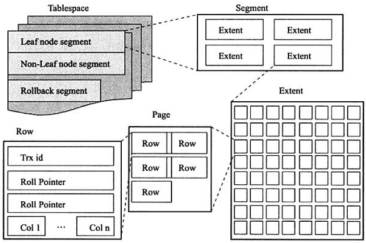

# 第4章 表 

主要分析 InnoDB 存储引擎表的逻辑存储及实现，然后分析物理存储特征（数据在表中是如何组织和存放的）。表是关于特定实体的数据集合（关系型数据库模型的核心）。


## 索引组织表

InnoDB 中所有表都是按照主键顺序组织存放的，该存储方式的表称为：索引组织表。

每张表都有主键，如果创建时候没有显示指定，按照下面规则选择或者创建主键：

- 判断表中是否有非空的唯一索引（Unique Not Null），有则该列为主键。如果有多个则将**建表时第一个定义的非空唯一索引设置为主键**，即按照定义索引的顺序而不是建表时列的顺序。
- 如果不符合则自动创建一个 6 字节大小的指针。

验证表中单列为主键命令（如果主键由多个列组成则不可用）：

`SELECT XXX,YYY, _rowid FROM 表名` 然后看 `_rowid` 值和哪一列相同即可。

## InnoDB 逻辑存储结构

所有数据都被逻辑的存放在表空间(tablespace)中，表空间由段(segment)，区(extent)，页/块(page/block) 组成。



### 表空间

InnoDB 默认共享表空间为 data 目录下的 ibdata1，在开启`innodb_file_per_table`参数之后（设置为 ）N）则每个表中数据存在到独立的表空间，独立表空间只保存表的**数据、索引、插入缓存 Bitmap 页**，而其它的例如：**回滚信息（undo），系统事务信息，二次写缓冲（Double write buffer）等**还在这个共享表空间里面的，所以共享表空间的大小还是会随着数据增多而变大。

> 默认共享表空间，在增大之后，是不会变小的，多出来的空间只会标记为可用，但不会收回的。


**段**：分为：数据段，索引段，回滚段等。这个由系统本身自动管理。

**区**：由连续的页组成的空间，默认每个区都是 1MB 大小【确定大小】，（默认页为16KB，所以一个区可以有64页）

> 新表初始大小小于1MB（96KB），是由于第一个区里有32页大小的碎片页，使用完了之后才会一个区一个区的申请空间。

**页**：也被称为块，为最小的磁盘管理单位，默认 16KB（可设置但不可修改）。 有许多的类型，例如：数据页(B-tree Node)，undo 页(undo Log page)，事务数据页，压缩/未压缩二进制大对象页等等。

**行**：InnoDB 是面向行的（row-oriented），数据是按行进行存放的。每页最多允许存放 16KB/2-200 = 7992 行数据。

> Mysql 中的infobright存储器就属于column-oriented（面向列）的。还有：Sybase IQ、Google Big Table；

**关于每页最多允许存放 16KB/2-200 = 7992 行数据说明：**

**我认为这个确实是内核定义的，在 InnoDB 存储引擎数据页结构中的 `page Header` 中有参数位：`PAGE_N_HEAP`，占 2 字节，表示堆中的记录数，其中第 15 位表示行记录格式。而 -200 位系统预留。所以数据为只有 14 位，就是 16KB/2。**

#### InnoDB 行记录格式

即每一行数据的格式吧： 分为两种：Compact（默认） 和 Redundant 两种。

`show table status like 'table_name'` 中的 `row_format` 属性就是这个东东。

> Compact模式下null是不占空间的，只是占NULL标志偏移量的大小。（空列数/8 bit） Redundant 模式下NULL的CHAR是占最大位的空间的，VACHAR也是不占空间的。
>
> 其它行记录格式： Compressed和Dynamic:使用的完全行溢出的方式存储BLOB数据，只存放20字节的指针。 Compressed：行数据会以zlib算法进行行压缩，对BLOB、TEXT、VARCHAR 能有效的存储。

##### 行溢出数据

数据页默认的大小是16KB（6384字节），而定义的VARCHAR行长度大小65535字节，这里会存在一个也放不下的情况，于是数据会被放到大对象页中（Uncompressed BLOB Page），原数据中保留768字节+偏移量；

> VARCHAR最大长度问题： 定义，**VARCHAR所在行**可以存放6384字节，然而实际有行头数据开销，**最大值为65532字节**。 需要注意的是这里不是单个列的长度。
>
> 数据是否溢出使用大对象页存储： 由于数据存储使用的是B+Tree的结构，一个页中至少要有两个节点，并且页大小为16KB。 所以，这个阈值是8098字节，小于此值当行数据会存储在本身页中，大于这个值则会使用BLOB页进行存储，（这时原行数据只存储前768字节数据+BLOB页的偏移量）

##### 关于CHAR 的行存储结构

在变长字符集的（例如：UTF8）的情况下，InnoDB对CHAR的存储也是看做变长字符类型的，与VARCHAR没有区别的。

#### InnoDB 数据页结构

这一部分没办法┐(ﾟ～ﾟ)┌整理啊，完全就是解释如何看懂InnoDB的二进制存储文件的。根据行页的格式，来分析数据二进制存储的格式。(⊙_⊙) 略过略过。。。。

> 查询当前文件格式：`show variables like 'innodb_file_format%'`【按字母表，包含之前版本格式】

#### 约束

MySQL的约束的使用只是用来做数据校验，并没有生成索引（这两个是不一样的，当然主键和唯一键本身是包含了两者）

常用的约束有：主键，唯一键，外键（忽略基本不用），默认值，非空。

校验的约束：可以使用触发器来完成对数据的高级自定义的约束。（一些数据的操作日志可以由触发器生成）

> **注意**：约束的使用在没有开启严格审核的情况下，数据还是会插入，只是会报个警告而已。 （这里数据会被自动转成0【非空约束】,0000-00-00【时间格式】等合法的奇怪的值插入）
>
> 需要设置：sql_mode = STRICT_TRANS_TABLES （参考官方文档还要很多可设置的值 ）

#### 视图

普通视图，作为虚表的存在提供一个数据处理结果集，仅此而已。

而物化视图，MySQL不支持，╮(╯_╰)╭ 没什么说的了。

> 这里的视图是不存在索引的东东的，所以在大数据量的情况下 查询性能堪忧。 即使是Oracle支持的物化视图，也是没有索引的，而且在做数据主备同步的时候可能存在问题，还有就是本身对聚合函数的限制。

#### 分区表 【重点】

**先说结果：分区对查询性能上的优化非常的有限，并且有很多的限制。** （个人看完认为需要在非常特殊的情况下使用才可以：数据量大并且完全依据时间查询等的情况下）

查看是否可以使用分区：`show variables like '%partition%' 或者 show PLUGINS;`

##### 一些介绍的东西

MySQL所支持的分区为水平分区（即同表的不同行记录分配到不同的物理文件中），而且是局部分区索引（即数据和索引统一存放）。

> 所谓的分区，就是在原本默认一个表一个数据文件`table_name.ibd` 的情况下依据条件，拆分存放好几个数据文件-例如：`table_name#p#p0.ibd table_name#p#p1.ibd table_name#p#p2.ibd`

**MySQL支持的分区类型：**

- RANGE分区：给定区间范围的分区
- LIST分区：离散值的分区
- HASH分区：根据自定义表达式返回值进行分区
- KEY分区：Mysql数据库提供哈希函数进行分区
- COLUMNS分区：为最新支持的分区，分RANGE COLUMNS 和 LIST COLUMNS 分区，支持所有类型。

> **注意：**表中如果有主键或者唯一索引时，分区必须是唯一索引的一个组成部分。

##### 各个分区的详解

这个就直接看创建分区的SQLl吧，没有多少的东西。

> 分区查询效率分析命令：`EXPLAIN PARTITION ....SELECT ........`
>
> 查询分区信息：（使用 information_schema 架构下的 PARTITIONS表）
>
> ```
> select * from information_schema.PARTITIONS 
> where table_schema = database() and table_name='table_name';
> ```

**RANGE分区：**

```mysql
CREATE TABLE sales (
money INT UNSIGEND NOT NULL,
date DATETIME
)ENGINE=INNDB
PARTITION BY RANGE (YEAR(DATE))(   --只支持int
    -- 比如这里如果使用by range (year(date)*100+month(date)) 是不会根据这个进行选择分区的
PARTITION P0 VALUES LESS THEN (2009),  -- NULL 值属于小于0的值
PARTITION P1 VALUES LESS THEN (2010),  -- 表示date为2010的数据会存在p1分区的文件里面
PARTITION P2 VALUES LESS THEN maxvalue,
)
-- 创建表sales ,以时间进行分区。
-- 这里RANGE分区，只支持year（），to_days(),to_seconds(),unix_timestamp() 方法。除了这些，使用其他的方法，结果查询的时候并不会根据分区进行选择。
-- 单独添加分区 像↓↓↓↓这样↓↓↓↓↓↓
ALTER TABLE sales ADD PARTITION (PARTITION p3 values less then (2011); 
```

**LIST分区：**

```mysql
LlCREATE TABLE sales (
money INT UNSIGEND NOT NULL,
date DATETIME
)ENGINE=INNDB
PARTITION BY LIST (money)( 	--只支持int
PARTITION P0 VALUES VALUES IN (1,3,5,7,9),    --表示money 的值在这个列表里面则数据在p0分区文件里面
PARTITION P1 VALUES VALUES IN (0,2,4,6,8,null)   --这里NULL是单独的值
)
```

**HASH分区：**

```mysql
CREATE TABLE sales (
money INT UNSIGEND NOT NULL,
date DATETIME
)ENGINE=INNDB
PARTITION BY HASH (YEAR(date)) 	--只支持int  （还有一个 LINEAR HASH）  对值的哈希值来分区
PARTITIONS 4 ;   --设置4个分区
```

**KEY分区：**

```mysql
.......--与HASH类似 只是使用内部的哈希函数了
PARTITION BY KEY (date) 	
PARTITIONS 4 ;   --设置4个分区
```

到这里的分区的条件都必须是整形的（不是的要用函数处理成整形的）；

**新增分区类型：COLUMNS**

MySQL5.5开始的，支持所有的整形类型，日期类型（DATE,DATETIME），字符串类型（BLOB，TEXT不支持）

```mysql
.........  --RANGE COLUMNS 
PARTITION BY RANGE COLUMNS (DATE)(   --支持各种类型了 无所谓 就这一点变化
PARTITION P0 VALUES LESS THEN ('2019-01-01')
)
.........  --LIST COLUMNS 
PARTITION BY LIST COLUMNS (city)(   --city VARCHAR（25）
PARTITION P0 VALUES IN ('fuzhou','xiamen')
)
```

##### 子分区

只是在原有分区上再进行分区，并且虽然有指定数据和索引分开的地址 ，但是是无效的 ╮(╯_╰)╭

```mysql
--允许在RANGE和LIST 分区基础上再进行 HASH或KEY分区
CREATE TABLE sales (
money INT UNSIGEND NOT NULL,
date DATETIME
)ENGINE=INNDB
PARTITION BY RANGE (YEAR(date))(   
SUBPARTITION BY HASH(TO_DAY(date))
SUBPARTITIONS  2 (
    PARTITION P0 VALUES LESS THEN (2009),  
    PARTITION P1 VALUES LESS THEN (2010),
    PARTITION P2 VALUES LESS THEN maxvalue,
); -- 这样就有 3*2 个分区了
```

##### 最终关心的性能

**在及其严格的查询限制的情况下，可以很好的提升查询性能。**

比如1000W数据量的表，本身使用的查询列已经有索引了，依据B+树索引的情况，只要IO搜索2次即可（1000W最多3次）【因为B+树的高度也就这么高】，如果这个时候对这个表做了10个分区，然后查询的条件不在分区条件中，辣么这里就要做全表10*2 至少20次IO才能查出数据。

是不是不好理解，直接看个例子，以上面**子分区的表作为例子**：

```mysql
-- 条件设置数据量 1000W+  每一年的数据 100W 并且分配了2009-2019 共 （11*2）22个分区
栗子1：
查询：select * from sales where year(date) = 2010 and  money = 10000; 
结果： 查询分区 p0 中的 两个子分区； 
栗子2：select * from sales where money = 10000; 
结果： 查询全部 22个分区；
-- 这是不考虑索引的，如果 money 有建立索引，也是一样的，数据库索引和数据 也是一起分区了的 ╮(╯_╰)╭
-- B+树索引查询IO次数：栗子1:2*2 4次； 栗子2:22*2 44次；【非常的明显啊】
```

> **这里的条件限制大概是这个样子：**
>
> 需要分区条件与查询条件一致，并且大量的数据可以根据此条件 至 查询数量有很大的减少。
