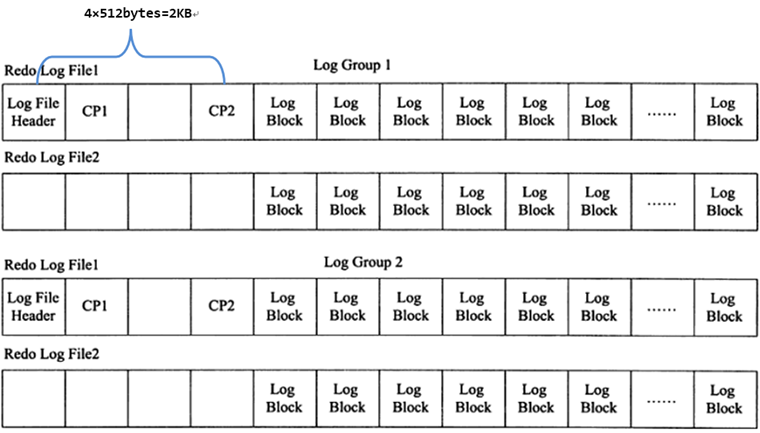

# 事务

[TOC]

## 一、认识事务

### （一）概述

事务（Transaction）目的是把数据库从一种一致状态转换为另一种一致状态。在数据库提交工作时，可以确保要么所有修改都已经保存或都不保存。

事务由一条或多条 SQL 语句组成，事务是访问并更新数据库中各种数据项的一个数据执行单元。

InnoDB 中的默认事务隔离级别为 READ REPEATABLE，完全符合 ACID 的特性，其中隔离性通过锁来完成，原子性、一致性、持久性通过 redo 和 undo 来完成。

- 原子性（atomicity）

    指整个数据库事务是不可分割的工作单位。只有使事务中所有的数据库操作都执行成功，才算整个事务成功。事务中任何一个 SQL 语句执行失败，已经执行成功的 SQL 语句也必须撤销，数据库状态应该退回到执行事务前的状态。

- 一致性（consistency）

    一致性指事务将数据库从一种状态转变为下一种一致的状态。在事务开始之前和事务结束以后，都没有破坏数据库的**完整性约束**。

    > 如事务开始前表中姓名不能重复，如果事务提交或者回滚之后，姓名不唯一了，就是破坏一致性了。

- 隔离性（isolation）

    事务的隔离性要求每个读写事务的对象对其他事务的操作对象能相互分离，即该事务提交前对其他事务都不可见，通常这使用锁来实现。

- 持久性（durability）

    事务一旦提交，其结果就是永久性的。即使发生宕机等故障，数据库也能将数据恢复即只能从事务本身的角度来保证结果的永久性。

    如果非数据库本身故障则可能导致提交数据丢失，因为持久性保证事务系统的高可靠性而不是高可用性。

### （二）事务分类

从事务理论的角度来说，可以把事务分为以下几种类型：

- 扁平事务（Flat Transactions）
- 带有保存点的扁平事务（Flat Transactions with Savepoints）
- 链事务（Chained Transactions）
- 嵌套事务（Nested Transactions）
- 分布式事务（Distributed Transactions）

**扁平事务（Flat Transaction）** 是事务类型中最简单也是在生产中使用最频繁的一种事务。在扁平事务中，所有操作都处于同一层次，其由 BEGIN WORK 开始，由 COMMIT WORK 或 ROLLBACK WORK 结束，其间的操作是原子的，要么都执行，要么都回滚。因此其限制在于不能提交或者回滚事务的某一部分，或分几个步骤提交。

**带有保存点的扁平事务（Flat Transactions with Savepoint）**，除了支持扁平事务支持的操作外，允许在事务执行过程中回滚到同一事务中较早的一个状态。这是因为某些事务可能在执行过程中出现的错误并不会导致所有的操作都无效，放弃整个事务不合乎要求，开销也太大。保存点（Savepoint）用来通知系统应该记住事务当前的状态，以便当之后发生错误时，事务能回到保存点当时的状态。

> 扁平事务中隐式设置了唯一一个保存点，因此回滚只能回滚到事务开始时的状态。

使用 SAVE WORK 函数建立保存点，通知系统记录当前的处理状态。


**链事务（Chained Transaction）**可视为保存点模式的一种变种。带有保存点的扁平事务，当发生系统崩溃时，所有的保存点都将消失，因为其保存点是易失而非持久的。则当进行恢复时，事务需要从开始处重新执行，而不能从最近的一个保存点继续执行。

链事务的思想是：在提交一个事务时，释放不需要的数据对象，将必要的处理上下文隐式地传给下一个要开始的事务。注意，提交事务操作和开始下一个事务操作将合并为一个原子操作。这意味着下一个事务将看到上一个事务的结果，就好像在一个事务中进行的一样。下图为链事务的工作方式：


两者区别在于：带有保存点的扁平事务能回滚到任意正确的保存点，而链事务中的回滚仅限于当前事务，即只能恢复到最近一个的保存点。对于锁的处理，两者也不相同。链事务在执行 COMMIT 后即释放了当前事务所持有的锁，而带有保存点的扁平事务不影响迄今为止所持有的锁。

**嵌套事务（Nested Transaction）**是一个层次结构框架。由一个顶层事务（top-level transaction）控制着各个层次的事务。顶层事务之下嵌套的事务被称为子事务（subTransaction），其控制每一个局部的变换。嵌套事务的层次结构如图所示。


- 嵌套事务是由若干事务组成的一棵树，子树可以是嵌套事务或者是扁平事务；
- 叶子节点事务为扁平事务，根节点为顶层事务，事务前后驱分别为：父事务/子事务；
- 任何子事务都在顶层事务提交之后才真正的提交（子事务可以提交或回滚，但是只有其父事务提交之后才生效）。
- 任何一个事务的回滚都会引起其所有子事务的一同回滚；

叶子节点事务完成访问数据库、发送消息等实际工作，高层的事务仅负责逻辑控制（即何时调用相关子事务），即使一个系统不支持嵌套事务，**可以通过保存点技术来模拟嵌套事务**。如图


**用保存点技术来模拟嵌套事务在锁的持有方面还是嵌套事务有区别的**：当通过保存点技术时，用户无法选择哪些锁需要被子事务继承，哪些需要被父事务保留。也就是说，无论有多少个保存点，所有被锁住的对象都可以被得到和访问。

嵌套事务例如：一个父事务 p1，其持有对象 X 和 Y 的排它锁，现在要开始一个调用子事务 p11，那么父事务 p1 可以不传递锁，也可以传递所有的锁，也可以只传递一个排它锁。如果子事务 p11 中还要持有对象 Z 的排它锁，那么通过反向继承（counter-inherited），父事务 p1 将持有 3 个对象 X，Y，Z 的排它锁。【书本 P 292-293】。

**分布式事务（Distributed Transactions）**通常是一个在分布式环境下运行的扁平事务，因此需要根据数据所在位置访问网络中的不同节点，不同的结点的数据库执行的事务操作又都是扁平的。

对于 InnoDB 存储引擎来说，其支持扁平事务，带有保存点的事务，链事务，分布式事务，而不支持嵌套事务，不过可以通过带保存点的事务来模拟串行的嵌套事务。

## 二、事务的实现

原子性、一致性、持久性通过数据库的 `redo log` 和 `undo log` 来完成。`redo log` 称为重做日志，用来保证事务的原子性和持久性。`undo log` 用来保证事务的一致性（用于帮助事务回滚和 MVCC 功能）。

redo 和 undo 的作用都可以视为是一种恢复操作，redo 恢复提交事务修改的页操作，而 undo 回滚行记录到某个特定版本。因此两者记录的内容不同，redo 通常是物理日志，记录的是页的物理修改操作。undo 是逻辑日志，根据每行记录进行记录。

### （一）redo

#### 1.基本概念

重做日志用来实现事务的持久性。其由两部分组成：一是内存中易失的重做日志缓冲（redo log buffer）；二是持久的重做日志文件（redo log file）。

InnoDB 是事务的存储引擎，其通过 Force Log at Commit 机制实现事务的持久性，即当事务提交（COMMIT）时，必须先将该事务的所有日志写入到重做日志文件进行持久化，待事务的 COMMIT 操作完成才算完成。这里的日志包括 redo log（基本为顺序写，在数据库运行时不需要对 redo log 的文件进行读取操作）和 undo log（需要进行随机读写）。

每次将重做日志缓冲写入重做日志文件后，InnoDB 都需要调用一次 fsync 操作来确保每次日志都写入重做日志文件（因为重做日志文件打开并没有使用 O_DIRECT 选项，因此重做日志缓冲先写入文件系统缓存，所以必须进行 fsync 确保重做日志写入磁盘），且 fsync 效率取决于磁盘，所以磁盘的性能决定事务提交的性能。

参数 `innodb_flush_log_at_trx_commit` 用于控制重做日志刷新到磁盘的策略，默认值为 1 表示事务提交时必须调用一次 fsync 操作，值为 0 表示事务提交时不写入重做日志，写入重做日志仅仅是会在 master thread 中以每秒进行一次重做日志文件的 fsync 操作，值为 2 表示事务提交时将重做日志写入重做日志文件，但仅写入文件系统的缓存中，不进行 fsync 操作（MySQL 宕机事务不会丢失，但是操作系统宕机会丢失未从文件系统缓存刷新到重做日志文件的部分事务）。设置为 0 或者 2 虽然会带来性能提升，但是丧失了事务的 ACID 特性，为了提升事务的提交性能，因为多次插入然后进行一次 COMMIT，不是每插入一次就 COMMIT 一次，这样可以使事务方法在回滚时可以直接回滚到事务最开始的状态。

在 MySQL 库中还有一种二进制日志（binlog），其用来进行 POINT-IN-TIME（PIT）的恢复及主从复制（Replication）环境的建立。其和重做日志差异为：

首先，重做日志是在 InnoDB 存储引擎层产生，而二进制日志是在 MySQL 数据库的上层产生的，并且二进制日志不仅仅针对于 InnoDB 存储引擎，MySQL 数据库中的任何存储引擎对于数据库的更改都会产生二进制日志。

其次，两种日志记录的内容形式不同。MySQL 数据库上层的二进制日志是一种逻辑日志，其记录的是对应的 SQL 语句。而 InnoDB 存储引擎层面的重做日志是物理格式日志，其记录的是对于每个页的修改。

此外，两种日志记录写入磁盘的时间点不同。二进制日志只在事务提交完成后进行一次写入（同时对于每个事务仅包含对应事务的一个日志）。而 InnoDB 存储引擎的重做日志在事务进行中不断地被写入，这表现为日志并不是随事务提交的顺序进行写入的（且其记录的是物理操作日志，因此每个事务对应多个日志条目）。

#### 2.log block

InnoDB 中重做日志缓冲、重做日志文件都是以块（block）的方式保存的，称为重做日志块（log block），每块大小 512 字节，其和磁盘扇区大小一致，因此重做日志的写入可以保证原子性，不需要 doublewrite 技术，如果一个页中产生的重做日志大小大于 512 字节，则分为多个重做日志块进行存储。


log buffer 由 log block 组成（类似于数组），因此使用 `LOG_BLOCK_HDR_NO` 标记这个数组中的位置，该值递增循环使用（第一位用于判断是否为 flush bit，所以最大值为 2G）。`LOG_BLOCK_HDR_DATA_LEN` 表示 log block 占用的实际大小，当写满的时候该值为 0x200（512 字节），`LOG_BLOCK_FIRST_REC_GROUP` 表示 log block 中第一个日志所在的偏移量，如果该值和 `LOG_BLOCK_HDR_DATA_LEN` 相等即表示当前 log block 不包含新的日志。==P299 没理解 12 的含义。==`LOG_BLOCK_CHECKPOINT_NO` 为该 log block 最后被写入时的检查点第 4 字节的值。尾部只有 `LOG_BLOCK_TRL_NO`，该值和 `LOG_BLOCK_HDR_NO` 相同，并在函数 `log_block_init` 中被初始化。

#### 2.log group

重做日志组是一个逻辑上的概念，其多个重做日志文件组成（其中每个日志文件大小相同），并没有一个实际存储的物理文件来表示 log group 信息，且 InnoDB 只有一个 log group，重做日志文件总大小最多为 512GB。

重做日志文件中存储的就是 log buffer 中保存的 log block，因此其也是根据 512 字节为一块的方式进行物理存储的管理，且 InnoDB 在运行过程中，log buffer 会根据一定规则将内存中的  log block 刷新到磁盘中，规则包括：

- 事务提交时；
- 当 log buffer 中有一半的内存空间已经被使用时
- log checkpoint 时

对于 log block 的写入是追加在 redo log file 的最后，让一个 redo log file 写满之后写下一个，使用方式为 round-robin（循环写）;但是因为 redo log file 除了保存 log buffer 刷新到磁盘的 log block，还保存了 2KB 左右的信息，但是 log group 中只有第一个 redo log file 的前 2KB  是保存了 4 个 512 字节大小的块（分别为：log file header、checkpoint1、空、checkpoint2。交替写入 Checkpoint 是为了避免因为介质失败而无法找到可用的 checkpoint 情况），其他 redo log file 的前 2KB 信息为空置状态。因为这个 2KB 信息的存在也需要更新，所以 redo log file 的写入并不是完全顺序的。



####  4.redo log的格式

InnoDB 的存储管理是基于页的，所以其重做日志格式也是基于页的。不同数据库操作对应的重做日志格式不同（目前有 51 种重做日志类型）。


其中 `redo_log_type` 占 1 字节，表示重做日志类型，`space` 表示表空间 ID，`page_no` 表示页的偏移量。`redo log body` 表示每个重做日志的数据部分，恢复时调用相应函数进行解析，如对页记录的插入和删除操作对应格式如下：

 

#### 5.LSN（Log Sequence Number，日志序列号）

InnoDB 中，LSN 占用 8 字节，并且单调递增。LSN 表示的含义有：

- 重做日志写入的总量
- checkpoint 的位置
- 页的版本

LSN 表示事务写入重做日志的字节的总量。例如当前重做日志的 LSN 为 1000，有一个事务 T1 写入了 100 字节的重做日志，那么 LSN 就变为了 1100，以此类推。**即 LSN 记录的是重做日志的总量，其单位为字节**。

LSN 不仅存在于 redo log 中，还存在于数据页中，在每个数据页的头部，通过字段`fil_page_lsn`记录了当前页最后刷新时 LSN 的大小。因为重做日志记录的是每个的日志，所以页中 LSN 用来判断页时候需要进行恢复操作，如果数据页中的 LSN 值小于 redo log 中 LSN 值，则表示数据丢失了一部分，则数据库需要通过将重做日志应用到该页中来进行恢复操作。

redo log 的 LSN 信息通过 show engine innodb status 来查看。因为在一个事务从日志缓冲刷新到重做日志文件并不只是在事务提交时发生，每秒都会有从日志缓冲刷新到重做日志文件的动作，所以这几个值在生产环境中很可能不一致。

```shell
---
LOG
---
Log sequence number 39651698    ## 当前 redo log（in buffer）中的 LSN
Log flushed up to   39651698    ## 刷新到重做日志文件（redo log file on disk）中的 LSN
Pages flushed up to 39651698    ## 刷新到磁盘数据页上的 LSN
Last checkpoint at  39651689    ## 上一次检查点所在位置的 LSN
0 pending log flushes, 0 pending chkp writes
10 log i/o's done, 0.00 log i/o's/second
----------------------
```

innodb 从执行修改语句开始：

(1).首先修改内存中的数据页，并在数据页中记录 LSN，暂且称之为 data_in_buffer_lsn；

(2).并且在修改数据页的同时(几乎是同时)向 redo log in buffer 中写入 redo log，并记录下对应的 LSN，暂且称之为 redo_log_in_buffer_lsn；

(3).写完 buffer 中的日志后，当触发了日志刷盘的几种规则时，会向 redo log file on disk 刷入重做日志，并在该文件中记下对应的 LSN，暂且称之为 redo_log_on_disk_lsn；

(4).数据页不可能永远只停留在内存中，在某些情况下，会触发 checkpoint 来将内存中的脏页(数据脏页和日志脏页)刷到磁盘，所以会在本次 checkpoint 脏页刷盘结束时，在 redo log 中记录 checkpoint 的 LSN 位置，暂且称之为 checkpoint_lsn。

(5).要记录 checkpoint 所在位置很快，只需简单的设置一个标志即可，但是刷数据页并不一定很快，例如这一次 checkpoint 要刷入的数据页非常多。也就是说要刷入所有的数据页需要一定的时间来完成，中途刷入的每个数据页都会记下当前页所在的 LSN，暂且称之为 data_page_on_disk_lsn。

详细说明如下图：


上图中，从上到下的横线分别代表：时间轴、buffer 中数据页中记录的 LSN(data_in_buffer_lsn)、磁盘中数据页中记录的 LSN(data_page_on_disk_lsn)、buffer 中重做日志记录的 LSN(redo_log_in_buffer_lsn)、磁盘中重做日志文件中记录的 LSN(redo_log_on_disk_lsn)以及检查点记录的 LSN(checkpoint_lsn)。

假设在最初时(12:0:00)所有的日志页和数据页都完成了刷盘，也记录好了检查点的 LSN，这时它们的 LSN 都是完全一致的。

假设此时开启了一个事务，并立刻执行了一个 update 操作，执行完成后，buffer 中的数据页和 redo log 都记录好了更新后的 LSN 值，假设为 110。这时候如果执行 show engine innodb status 查看各 LSN 的值，即图中①处的位置状态，结果会是：

```
log sequence number(110) > log flushed up to(100) = pages flushed up to = last checkpoint at
```

之后又执行了一个 delete 语句，LSN 增长到 150。等到 12:00:01 时，触发 redo log 刷盘的规则(其中有一个规则是 innodb_flush_log_at_timeout 控制的默认日志刷盘频率为 1 秒)，这时 redo log file on disk 中的 LSN 会更新到和 redo log in buffer 的 LSN 一样，所以都等于 150，这时 show engine innodb status ，即图中②的位置，结果将会是：

```
log sequence number(150) = log flushed up to > pages flushed up to(100) = last checkpoint at
```

再之后，执行了一个 update 语句，缓存中的 LSN 将增长到 300，即图中③的位置。

假设随后检查点出现，即图中④的位置，正如前面所说，检查点会触发数据页和日志页刷盘，但需要一定的时间来完成，所以在数据页刷盘还未完成时，检查点的 LSN 还是上一次检查点的 LSN，但此时磁盘上数据页和日志页的 LSN 已经增长了，即：

```
log sequence number > log flushed up to 和 pages flushed up to > last checkpoint at
```

但是 log flushed up to 和 pages flushed up to 的大小无法确定，因为日志刷盘可能快于数据刷盘，也可能等于，还可能是慢于。但是 checkpoint 机制有保护数据刷盘速度是慢于日志刷盘的：当数据刷盘速度超过日志刷盘时，将会暂时停止数据刷盘，等待日志刷盘进度超过数据刷盘。

等到数据页和日志页刷盘完毕，即到了位置⑤的时候，所有的 LSN 都等于 300。

随着时间的推移到了 12:00:02，即图中位置⑥，又触发了日志刷盘的规则，但此时 buffer 中的日志 LSN 和磁盘中的日志 LSN 是一致的，所以不执行日志刷盘，即此时 show engine innodb status 时各种 lsn 都相等。

随后执行了一个 insert 语句，假设 buffer 中的 LSN 增长到了 800，即图中位置⑦。此时各种 LSN 的大小和位置①时一样。

随后执行了提交动作，即位置⑧。默认情况下，提交动作会触发日志刷盘，但不会触发数据刷盘，所以 show engine innodb status 的结果是：

```
log sequence number = log flushed up to > pages flushed up to = last checkpoint at
```

最后随着时间的推移，检查点再次出现，即图中位置⑨。但是这次检查点不会触发日志刷盘，因为日志的 LSN 在检查点出现之前已经同步了。假设这次数据刷盘速度极快，快到一瞬间内完成而无法捕捉到状态的变化，这时 show engine innodb status 的结果将是各种 LSN 相等。

#### 6.恢复

InnoDB 不管上次数据期运行时是否正常关闭，都会尝试进行恢复。重做日志记录的是物理日志，因此恢复速度快于逻辑日志（如二进制日志）。

由于 checkpoint 表示已经刷新到磁盘页上的 LSN，因此在恢复过程中仅需恢复 checkpoint 开始的日志部分。如图所示当数据库在 checkpoint 的 LSN 为 10 000 时发生宕机，恢复操作仅恢复 LSN 10 000～13 000 范围内的日志。


InnoDB 的重做日志是物理日志（所以是幂等的），对于下列的 INSERT 操作，其记录的是每个页上的变化。

```sql
CREATE TABLE t(a INT,b INT,PRIMARY KEY(a),KEY(b));
INSERT INTO t SELECT 1,2;
```

由于需要对聚集索引页和辅助索引页进行操作，其记录的重做日志大致为：

`page(2,3),offset 32,value 1,2 #聚集索引`
`page(2,4),offset 64,value 2 #辅助索引`
可以看到记录的是页的物理修改操作，若插入涉及 B+ 树的 split，可能会有更多的页需要记录日志。

### （二）undo

重做日志记录了事务的行为，通过其可以对页进行「重做」操作。但是**事务的回滚操作需要 undo 实现**。因此在对数据库进行修改时，InnoDB 存储引擎不但会产生 redo，还会产生一定量的 undo。这样如果用户执行的事务或语句由于某种原因失败了，又或者用户用一条 ROLLBACK 语句请求回滚，就利用这些 undo 信息将数据回滚到修改之前的样子。

redo 存放在重做日志文件中，undo 存放在数据库内部的共享表空间中的一个 undo 段上，使用工具查看当前共享表空间 ibdata1 类的 undo 页数量为：

```mysql
Total number of page: 4864:
File Space Header: 7
Insert Buffer Bitmap: 7
File Segment inode: 10
System Page: 132
B-tree Node: 42
Transaction system Page: 6
Freshly Allocated Page: 4408
Undo Log Page: 252     ## 当前共享表空间 ibdata1 类的 undo 页数量为 252
```

**undo 是逻辑日志，因此只是将数据库逻辑（非物理）地恢复到原来的样子。所有修改都被逻辑地取消了，但是数据结构和页本身在回滚之后可能大不相同。**这是因为在多用户并发系统中，可能会有数十、数百甚至数千个并发事务。数据库的主要任务就是协调对数据记录的并发访问。比如，一个事务在修改当前一个页中某几条记录，同时还有别的事务在对同一个页中另几条记录进行修改。因此，不能将一个页回滚到事务开始的样子，因为这样会影响其他事务正在进行的工作。

> 如事务中插入 10W 条数据，会导致分配一个新的段（表空间会增大），当 Rollback 时会将插入的事务进行回滚，但是表空间不会收缩。

InnoDB 的回滚是通过执行相反的操作实现：对于 Insert 执行 delete，对于 delete 执行 insert，对于 update 执行相反的 update。

同时在 InnoDB 中 MVCC 的实现是通过 undo 来完成。当用户读取一行记录时，若该记录已经被其他事务占用，当前事务可以通过 undo 读取之前的行版本信息，以此实现非锁定读取。

同样 undo log 会产生 redo log，因为 undo log 也需要持久性的保护。

#### 2.undo 存储管理

InnoDB 对 undo 的管理采用段的方式。InnoDB 中存在 rollback segment（回滚段），每个回滚段中有 1024 个 undo log segment。在每个 undo log segment 段中进行 undo 页的申请，共享表空间偏移量为 5 的页（0,5）记录了所有 rollback segment header 所在的页，该页类型为 `FIL_PAGE_TYPE_SYS`。

目前 InnoDB 支持 128 个 rollback segment，即支持 128*1024 个同时在线事务，常用相关参数为：

- `innodb_undo_directory`：设置 rollback segment 文件所在路径，默认值为 `.` 表示当前 InnoDB 存储引擎的目录（共享表空间），可以指定将其设置到独立表空间中；
- `innodb_undo_logs`：设置 rollback segmnt 个数，默认 128。
- `innodb_undo_tablespaces`：设置构成 rollback segment 文件的数量，即将 rollback segment 较为平均的分布到多个文件中，设置之后的多个文件以 undo 为前缀都放置在 `innodb_undo_directory` 指定的目录下；

 事务在 undo log segment 分配页并写入 undo log 的这个过程同样需要写入重做日志。同时 InnoDB 会将`undo log`放入列表中，以供之后的`purge`操作，然后判断`undo log`所在的页是否可以重用，若可以分配给下个事务使用。

事务提交之后并不能马上删除 undo log 以及 undo log 所在的页，这是因为可能有 MVVC 使用（即其他事务需要通过 undo log 获取行记录之前的版本）。所以在事务提交时将 undo log 放在一个链表中，是否可以最终删除由 purge 线程判断。

### 三、事务控制语句

MySQL 默认事务是自动提交，即执行 SQL 语句之后马上执行 COMMIT 操作。可以通过 `BEGIN`、`STRAT TRANSACTION` 或者 `SET AUTOCOMMIT = 0`禁止自动提交并显式的开启事务。常见事务控制语句包括：

- `START TRANSACTION | BEGIN`：显示开启一个事务

    存储过程中只能使用前者，后者会被识别为 BEGIN。。。END；

- `COMMIT | COMMIT WORK`：提交事务

    默认参数 `completion_type` 为 0 表示没有任何操作，即两者作用一样，但是因为 COMMIT WORK 用于控制事务结束后的行为是 CHAIN 还是 RELEASE，如果参数值为 1 则其等价于 COMMIT AND CHAIN，即事务变成了链事务，会马上自动开启一个相同隔离级别的事务。如果参数值为 2 则等价于 COMMIT AND RELEASE，即事务提交后会自动断开用户服务器的连接；

    ```mysql
    CREATE TABLE commit_table(
        a int,
        PRIMARY KEY (a)
    )ENGINE = InnoDB;
    
    SET @@completion_type = 1;
    
    BEGIN;
    INSERT INTO commit_table SELECT 1;
    COMMIT WORK; -- 提交事务并开启了新的事务，等价于 COMMIT AND CHAIN
    
    -- 下面两个语句因为自动开启了链事务，所以在同一个事务中
    INSERT INTO commit_table SELECT 2;  -- 没有显式的开启事务
    INSERT INTO commit_table SELECT 3;
    ROLLBACK;
    
    SELECT  * FROM commit_table; -- 只有数字 1，即 2,3 在同一个事务中被回滚了
    ```

- `ROLLBACK | ROLLBACK WORK`：回滚事务

    区别同上；

- `SAVEPOINT identifier`：在事务中创建一个名称为 identifier 的保存点，一个事务可以创建多个保存点；

- `RELEASE SAVEPOINT identifier`：删除一个事务保存点，当没有一个保存点却删除时候报异常；

- `ROLLBACK TO SAVEPOINT identifier`：结合 SAVEPOINT 使用，实现将事务回滚到该保存点。

    注意该命令并不会真正的结束事务，必须再次使用 COMMIT 或者 ROLLBACK 来真正的结束事务。

- `SET TRANSACTION`：设置事务的隔离级别，包括：READ UNCOMMITTED、READ COMMITTED、REPEATABLE READ、SERIALIZABLE。

注意：InnoDB 中的事务都是原子的，一方面构成事务的每条语句都会提交（成为永久），或者所有语句都回滚。另一方面构成事务的每条语句要么完全成功，要么完全回滚（语句回滚），**因此一条语句失败并抛出异常时，并不会导致先前已经执行的语句自动回滚**，所有的执行都会保留，必须由用户决定是提交或者回滚。

### 四、隐式提交的 SQL 语句

执行下列的 SQL 语句会有一个隐式的 COMMIT 操作：

- DDL 语句：`ALTER DATABASE … UPGRADE DATA DIRECTORY NAME`、`ALTER EVENT`,` ALTER PROCEDURE`, `ALTER TABLE`, `ALTER VIEW`，`CREATE DATABASE`, `CREATE EVENT`, `CREATE INDEX`, `CREATE PROCEDURE`, `CREATE TABLE`, `CREATE TRIGGER`, `CREATE VIEW`,`DROP DATABASE`, `DROP EVENT`, `DROP INDEX`, `DROP PROCEDURE`，`DROP TABLE`, `DROP TRIGGER`, `DROP VIEW`, `RENAME TABLE`，`TRUNCATE TABLE`。

    `TRUNCATE TABLE` 是 DDL 语句，虽然其和对整张表执行 DELETE 结果一样，但是其不能被回滚。

- 用来隐式地修改 MySQL 架构的操作: CREATE USER、 DROP USER、 GRANT 、RENAME USER、 REVOKE、 SET PASSWORD。

- 管理语句: ANALYZE TABLE、 CACHE INDEX、 CHECK TABLE、 LOAD INDEX  INTO CACHE、 OPTIMIZE TABLE、 REPAIR TABLE。

### 五、对于事务操作的统计

InnoDB 存储引擎的应用需要在考虑每秒请求数（Question Per Second，QPS）的同时，关注每秒事务处理的能力（Transaction Per Second，TPS）。TPS 的计算方法是（com_commit + com_rollback) / time。但是利用该方法进行计算的前提是：所有的事务必须都是显式提交的，如果存在隐式地提交和回滚(默认 auto_commit=1)，不会计算到 com_commit 和 com_rollback 变量中。所以如果有不是显示提交/回滚的事务，则统计没有那么准确。

### 六、事务的隔离级别

**SQL 标准**定义的四个隔离级别为：

- READ UNCOMMITTED：浏览访问，仅仅针对事务而言；
- READ COMMITTED：游标稳定；
- REPEATABLE READ：2.9999° 的隔离，没有幻读的保护；
- SERIALIZABLE ：隔离，或者 3° 的隔离；

InnoDB 存储引擎默认支持的隔离级别是 `REPEATABLE READ` ，但是与标准 SQL 不同的是，InnoDB 存储引擎在 `REPEATABLE READ` 事务隔离级别下，使用 `Next-Key Lock` 锁的算法，因此避免幻读的产生。因此 InnoDB 在默认的 REPEATABLE READ 的事务隔离级别下已经完全能保证事务的隔离性要求，即达到 SQL 标准的 SERIALIZABLE 隔离级别。

原则上隔离级别越低，事务请求的锁越少或保持锁的时间就越短。但是 InnoDB 中选择 REPEATABLE READ 和  SERIALIZABLE 的开销几乎相同，甚至 SERIALIZABLE  性能更优。

```mysql
SET [GLOBAL | SESSION]  TRANSACTION XXX -- 设置当前会话/全局的事务隔离级别

transaction-isolation = READ-COMMITTED -- 修改 MySQL 配置文件，增加该配置实现 MySQL 启动时就设置事务的默认隔离级别

SELECT @@tx_isolation; -- 查看当前会话的事务隔离级别

SELECT @@global.tx_isolation; -- 查看全局的事务隔离级别
```

InnoDB 在 SERIALIZABLE 隔离级别下对每个 SELECT 语句后自动加入 LOCK IN SHARE MODE，即为每个读取操作加上一个共享锁，即不再支持非锁定读。但是因为 InnoDB 的 REPETABLE READ 就达到了 3° 的隔离，所以 SERIALIZABLE 隔离级别通常只用在分布式事务中，不在本地事务中使用。

READ COMMITTED 隔离级别下 InnoDB 只有在唯一性的约束检查和外键约束的检查时候需要 gap lock。其默认只能工作在 replication 二进制日志为 ROW 的格式下，如果二进制日志工作在默认的 STATEMENT 下可能会出现问题；

### 七、分布式事务

#### （一）MySQL 数据库分布式事务

InnoDB 提供了对 XA（eXtended Architecture，分布式事务规范/协议）事务的支持，并通过 XA 事务来支持分布式事务的实现。分布式事务指允许多个独立的事务资源（通常为关系型数据库系统）参与到一个全局的事务中。全局事务要求所有参与的事务要么都提交要么都回滚。在使用分布式事务时，InnoDB 的事务隔离级别必须设置为 SERIALIZABLE。

XA 事务允许不同种类数据库之间的分布式事务，只要参与在全局事务中的每个节点都支持 XA 事务。可以通过参数 `innodb_support_xa` 查看是否启动了 XA 事务（默认为 ON），XA 事务由一个或者多个资源管理器、一个事务管理器、一个应用程序组成。

- 资源管理器：提供访问事务资源的方法，通常每个资源管理器就是一个数据库；【MySQL 数据库】
- 事务管理器：协调参与全局事务中的各个事务。需要和参与全局事务的所有资源管理器进行通信。【连接 MySQL 服务器的客户端】
- 应用程序：定义事务的边界，指定全局事务中的操作。


分布式事务使用两段式提交（two-phase commit）的方式。

阶段一：所有参与全局事务的节点都开始准备（PREPARE），告诉事务管理器它们准备好提交了。

阶段二：事务管理器告诉资源管理器执行 COMMIT 或 ROLLBACK，如果任何一个节点显示不能提交，则所有的节点都被告知需要回滚。

因此分布式事务相比本地事务需要多一次 PREPARE 操作，即收到所有节点的同意信息后再进行 COMMIT 或 ROLLBACK 操作。

单个节点运行分布式事务没有太大意义，同时在 MySQL 数据库的命令下演示多个结点参与的分布式事务行不通。**通常都是通过编程语言完成分布式事务的操作**。

#### （二）内部 XA 事务

上述的分布式事务都是外部事务，即资源管理器是 MySQL 数据库本身，MySQL 中还存在内部 XA 事务，其在存储引擎与插件之间或者在存储引擎与存储引擎之间。

最常见内部 XA 事务存在于 binlog 和 InnoDB 之间，因为针对复制的场景：在事务提交时需要先写二进制日志，然后在写 InnoDB 的重做日志，两者必须是原子操作，否则如果二进制日志写完之后，写入 InnoDB 发生宕机，则 slave 可能会收到 master 传过去的二进制日志并执行，导致主从不一致。


右边改进方案：事务提交时，InnoDB 先进行 PREPARE 操作，将事务的 xid 写入，然后进行二进制日志写入。如果在 InnoDB 提交前，MySQL 宕机了，则 MySQL 在重启后会先检查准备的 UXID 事务是否已经提交，如果没有则在存储引擎层再进行一次提交。

#### 循环提交

正常在存储过程中循环更新数据的时候，虽然没有显示的提交【commit】，但是数据库默认会自动提交的。也就是说，每一次的更新都会进行一次的日志同步，这个是很会花时间的。【即使是用了 BEGIN，并且在循环中没有显示 commit】

所以，正确的加快速度的做法是，显示的`START TRANSACION`开始事务，在完成后`COMMIT`。这样只会进行一次的重做日志同步。

#### 自动提交

这个就是前边说的情况，默认情况下 Mysql 是自动提交的，在大数据更新的时候可能会影响速度。

#### 长事务

就是执行时间几个小时的事务，需要进行分解为小的事务来处理。（比如处理 n 亿级别的数据）

