# 第五章 索引与算法

[TOC]

## 一、InnoDB 存储引擎索引概述

**InnoDB 支持： B+ 树索引、全文索引、哈希索引**。

B+ 树索引并不能找到给定键值的具体行，只是被查找数据行所在的页，然后数据库通过把页读入内存中，在内存中查找想要的数据。

**其中哈希索引是自适应的，即 InnoDB 会根据表的情况自动为表生成哈希索引，不能人为进行干预**。

## 二、数据结构与算法

### （一）二分查找法

使用前提是记录是有序排列的，如每页 Page Directory 中的槽是按照主键的顺序存放的，对于某一条具体记录的查询是通过对 Page Directory 进行二分查找得到的。

### （二）二叉查找树和平衡二叉树

**B+ 树是通过二叉查找树，再经过平衡二叉树 B 树演进而来**。

二叉查找树：左子树的键值总是小于根的键值，右子树的键值总是大于根的键值，即通过中序遍历为递增顺序。

**平衡二叉树数（AVL 树）**：首先符合二叉查找树的定义，其次满足任何节点的两个子树的高度最大差为 1。平衡二叉树是性能很高的二叉查找树（不是最高，但最高维护成本高）。其在插入、更新、删除时候通过左旋或者右旋来实现维护，因为 AVL 树通常用于**内存结构**对象，所以维护开销相对较小。

## 三、B+ 树

**B+ 树由 B 树（Balance 树）和索引顺序访问方法演化得到**。B+ 树是为磁盘或者其他直接存取辅助设备设计的一种平衡查找树。B+ 树中所有记录节点都按照键值的大小顺序存放在同一层的叶子节点上，由各个叶子节点指针进行连接。

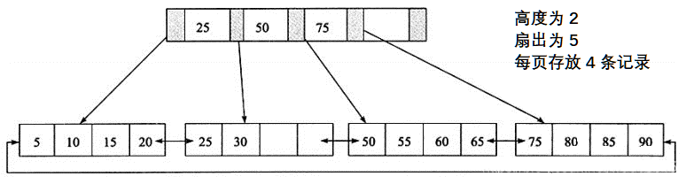

### （一）B+树的插入操作

**B+ 树的插入操作必须保证插入后叶子节点中的记录依然排序**，同时需要考虑插入到 B+ 树的三种情况，对应导致的不同插入算法：

- 叶子页（Leaf Page）仍有空间，索引页（Index Page）仍有空间的情况下，直接将记录插入到叶子节点。
- 叶子页没有空间，索引页仍有空间的情况下，拆分叶子页，将中间的节点放入索引页中，小于中间节点的记录放左边，大于等于中间节点的记录放右边。
- 叶子页没有空间，索引页没有空间的情况下，拆分叶子页，小于中间节点的记录放左边，大于等于中间节点的记录放右边，拆分索引页，小于中间节点的记录放左边，大于中间节点的记录放右边，中间节点放入上一层Index Page

针对情况一：插入键值 28；

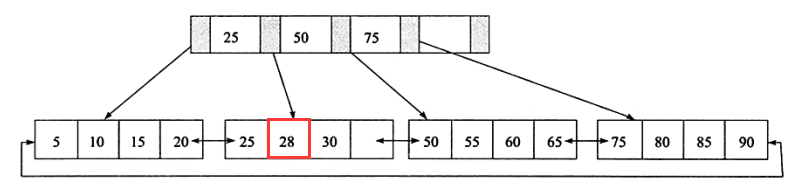

针对情况二：再次插入键值 70；（叶子节点之间是有双向链表指针的）

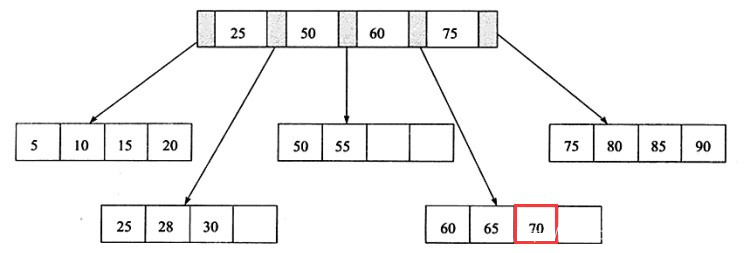

针对情况三：再次插入键值 90；（叶子节点之间是有双向链表指针的）

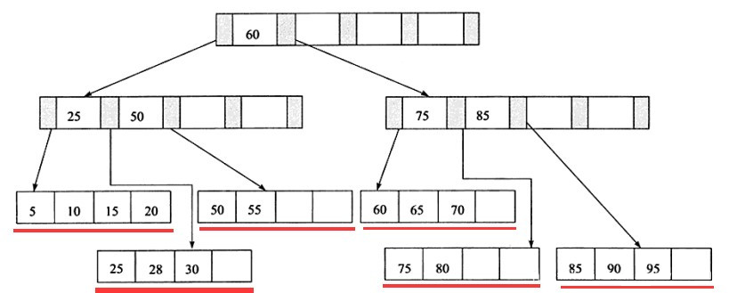


此外为了保持平衡对于新插入的键值可能需要做大量的拆分页的操作，为了减少因页的拆分带来的磁盘操作，B+ 树提供了类似平衡二叉树的旋转功能。当叶子页已满，但是其左右兄弟节点未满，会将记录转移到兄弟节点上。如上述情况二中插入 70，此时 B+ 树会进行旋转而不是拆分叶子节点，减少一次页的拆分同时高度保持为 2。

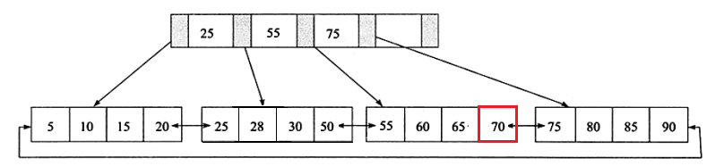

### （二）B+ 树的删除操作

B+ 树使用填充因子（最低可设为 50%）来控制树的删除变化，删除操作同样必须保证删除后叶子节点中的记录依然排序，B+ 树的删除操作需要考虑三种情况，同时结合填充因子的变化来衡量：

- 叶子节点大于等于填充因子，且中间节点大于等于填充因子时，直接将记录从叶子节点删除，如果该节点是索引页的节点，用该节点的右节点代替；
- 叶子节点小于填充因子，且中间节点大于等于填充因子时，合并叶子节点和它的兄弟节点，同时更新索引页；
- 叶子节点小于填充因子，且中间节点小于填充因子时，合并叶子节点和它的兄弟节点，更新索引页，合并索引页和它的兄弟节点；

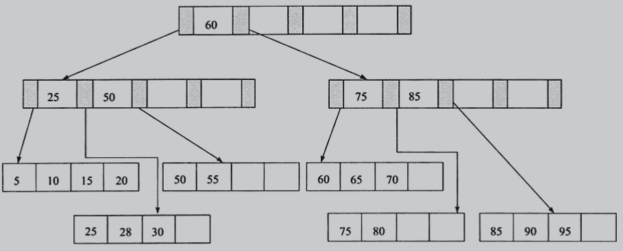

情况一：删除键值为 70 的记录

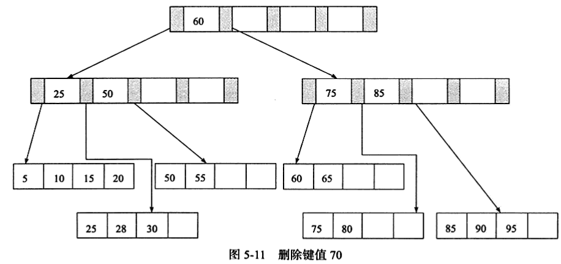

还是情况一：删除键值为 25 的记录

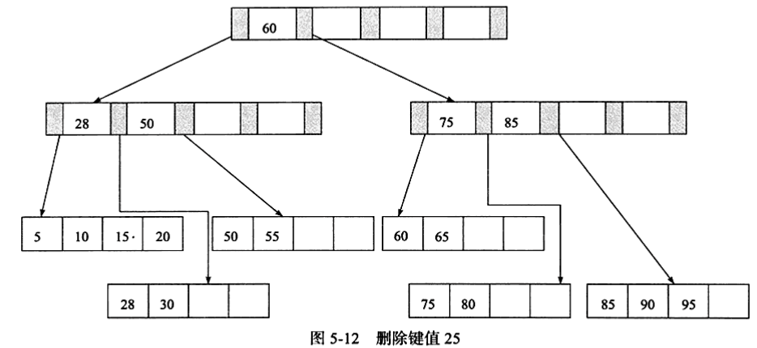

情况三：删除键值为 60 的记录，删除后填充因子小于 50%，进行合并操作，删除索引页中记录后也要合并。

## 四、B+ 树索引

B+ 树索引的本质就是 B+ 树在数据库中的实现，B+ 索引在数据库中的特点是高扇出性，**树的高度一般在 2~4 层（每次 IO 大约 0.1s）**。数据库中的 B+ 树索引分为聚集索引和辅助索引，其区别是叶子节点存放的是否是一整行的信息。

关于树的高度将本地 MySQLNotes 中文章。

磁盘信息见：https://tech.meituan.com/2017/05/19/about-desk-io.html 和 https://www.cnblogs.com/morgan363/p/12192159.html

### （一）聚集索引

InnoDB 存储引擎表是索引组织表，即表中数据按照主键顺序存放。聚集索引是按照每张表的主键构造的一颗 B+ 树，同时叶子节点存放的即为整张表的行数据，即叶子节点为数据页，因此索引组织表中的数据也是索引的一部分。同时每个数据页都通过一个双向链表来进行链接。每张表只能拥有一个聚集索引（因为数据页只能按照一棵 B+ 树进行排序），同时因为叶子节点即数据加上双向链表定义了数据的逻辑顺序，便于主键的排序查找和范围查找。

```mysql
EXPLAIN SELECT  * FROM cluster_d ORDER BY a LIMIT 10;
```

下面的结果中并没有进行 filesort。 

   "id": 1,
    "select_type": "SIMPLE",
    "table": "cluster_t",
    "partitions": null,
    "type": "index",
    "possible_keys": null,
    "key": "PRIMARY",
    "key_len": "4",
    "ref": null,
    "rows": 4,
    "filtered": 100,
    "Extra": null
  同时如果针对主键进行范围查询，可以通过叶子节点的上层中间节点就可以得到页的范围，之后直接读取数据页即可。

```mysql
EXPLAIN SELECT  * FROM cluster_d WHERE  a > 1 AND a < 100;
```

从下面的执行计划中：Rows 为查询结果的预估返回行数（不是确切值）。
    "id": 1,
    "select_type": "SIMPLE",
    "table": "cluster_t",
    "partitions": null,
    "type": "range",
    "possible_keys": "PRIMARY",
    "key": "PRIMARY",
    "key_len": "4",
    "ref": null,
    "rows": 3,
    "filtered": 100,
    "Extra": "Using where"

**示例**

创建表，同时让每页只能存放两个行记录。

```mysql
CREATE TABLE cluster_d(
    a INT NOT  NULL,
    b VARCHAR(8000),
    PRIMARY KEY (a)
)ENGINE = InnoDB;

INSERT INTO cluster_d SELECT 1,REPEAT('a',7000);
INSERT INTO cluster_d SELECT 2,REPEAT('a',7000);
INSERT INTO cluster_d SELECT 3,REPEAT('a',7000);
INSERT INTO cluster_d SELECT 4,REPEAT('a',7000);
```

使用工具分析结果为：

```mysql
Total number of page: 8:
File Space Header: 1
Insert Buffer Bitmap: 1
File Segment inode: 1
B-tree Node: 4
Freshly Allocated Page: 1"
page offset: 00000000, page type: <File Space Header>""
page offset: 00000001, page type: <Insert Buffer Bitmap>""
page offset: 00000002, page type: <File Segment inode>"
page offset: 00000003, page type: <B-tree Node>, page level: <0001>
page offset: 00000004, page type: <B-tree Node>, page level: <0000>
page offset: 00000005, page type: <B-tree Node>, page level: <0000>
page offset: 00000006, page type: <B-tree Node>, page level: <0000>"
page offset: 00000000, page type: <Freshly Allocated Page>"
```

使用 hexdump 分析 Page Level 为 0001 的索引根页中的数据，当前聚集索引的高度为 2，因此该页是 B+ 树的根。

```shell
0000c000: CA B5 0B 7A 00 00 00 03 FF FF FF FF FF FF FF FF    J5.z............
0000c010: 00 00 00 00 02 58 08 59 45 BF 00 00 00 00 00 00    .....X.YE?......
0000c020: 00 00 00 00 02 CF 00 02 00 A2 80 05 00 00 00 00    .....O..."......
0000c030: 00 9A 00 02 00 02 00 03 00 00 00 00 00 00 00 00    ................
0000c040: 00 01 00 00 00 00 00 00 01 DB 00 00 02 CF 00 00    .........[...O..
0000c050: 00 02 00 F2 00 00 02 CF 00 00 00 02 00 32 【01 00    ...r...O.....2..
0000c060: 02 00 1B】 【69 6E 66 69 6D 75 6D 00】 04 00 0B 00 00    ...infimum......
0000c070: 73 75 70 72 65 6D 75 6D 00 10 00 11 00 0E 【80 00    supremum........
0000c080: 00 01】 00 00 00 04 00 00 00 19 00 0E 【80 00 00 02】    ................
0000c090: 00 00 00 05 00 00 00 21 FF D6 【80 00 00 04】 00 00    .......!.V......
0000c0a0: 00 06 00 00 00 00 00 00 00 00 00 00 00 00 00 00    ................
0000c0b0: 00 00 00 00 00 00 00 00 00 00 00 00 00 00 00 00    ................
0000c0c0: 00 00 00 00 00 00 00 00 00 00 00 00 00 00 00 00    ................
0000c0d0: 00 00 00 00 00 00 00 00 00 00 00 00 00 00 00 00    ................
......
0000ffe0: 00 00 00 00 00 00 00 00 00 00 00 00 00 00 00 00    ................
0000fff0: 00 00 00 00 00 70 【00 63】 CA B5 0B 7A 02 58 08 59    .....p.cJ5.z.X.Y
```

通过页尾的 Page Directory 分析该页，其中 00 63 表示该页中行开始的位置。0xc063 开始的 69  6e 66 69 6d 75 6d 00 表示 infimum 为行记录，前面的 5 字节：01 00 02 00 1b 即为 Recorder Header。分析第 4 位到第 8 位的值 1 代表该行记录中只有一个记录（InnoDB 的 Page Directory 是稀疏的），即 infimum 本身。通过 Recorder Header 的最后两个字节 00 1b 可以知道下一条记录的位置：c063 + 1b = c07e，对应键值为：80 00 00 01，这就是主键为 1 的键值（因为定义时 INT 设置为无符号的，所以二进制为 0x80 00 00 01 而不是 0x0001），键值后面的值 00 00 00 04 表示指向数据页的页号。同样方式可以获得键值  80 00 00 02 和 80 00 00 04 及其指向的数据页。

因此数据页上存放的是完整的每行的记录，索引页中存放的是仅仅是键值和指向数据页的偏移量。因此该聚集索引树大致为：

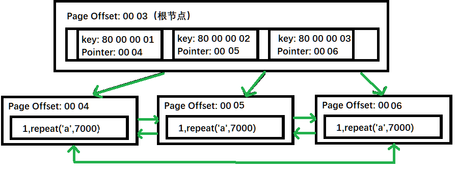

聚集索引的存储不是按照物理上连续的，而是逻辑连续的：首先页通过双向链表链接，页按照主键的顺序排序；同时每个页中的记录也是通过双向链表进行维护，因此物理存储上同样可以不按照主键存储。

### （二）辅助索引（非聚集索引）

辅助索引的叶子节点不包含行记录的全部数据，叶子节点除了包含键值之外，每个叶子节点中的索引行还包含了一个书签，该书签用来告诉 InnoDB 存储引擎哪里可以找到与索引相对应的行数据。由于 InnoDB 存储引擎表是索引组织表，因此 InnoDB 存储引擎的辅助索引的书签就是相应行数据的聚集索引键。

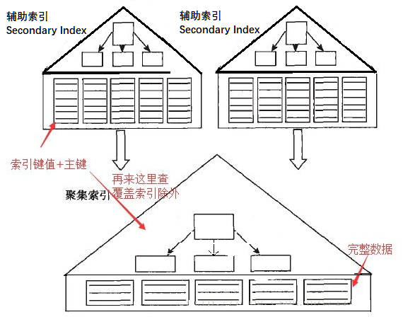

辅助索引的存在不影响数据在聚集索引中的组织，因此**每张表上可以有多个辅助索引**，当通过辅助索引来寻找数据，InnoDB 会遍历辅助索引并通过页级别的指针获得指向主键索引的主键，然后再通过主键索引来找到一个完整的行记录。

**通过表空间文件分析 InnoDB 的非聚集索引的实际存储**：

对表 `cluster_d` 修改如下：

```mysql
ALTER TABLE cluster_d ADD c INT NOT NULL;
UPDATE cluster_d SET c = 0 - a;
ALTER TABLE cluster_d ADD KEY idx_c (c);

SHOW INDEX  FROM cluster_d;
```

| Table     | Non_unique | Key_name | Seq_in_index | Column_name | Collation | Cardinality | Sub_part | Packed | Null | Index_type | Comment | Index_comment |      |
| --------- | ---------- | -------- | ------------ | ----------- | --------- | ----------- | -------- | ------ | ---- | ---------- | ------- | ------------- | ---- |
| cluster_d | 0          | PRIMARY  | 1            | a           | A         | 4           |          |        |      | BTREE      |         |               |      |
| cluster_d | 1          | idx_c    | 1            | c           | A         | 4           |          |        |      | BTREE      |         |               |      |

表空间文件为：多出来的 page offset 为 4 的页就是非聚集索引所在页。

```shell
Total number of page: 9:
File Space Header: 1
Insert Buffer Bitmap: 1
File Segment inode: 1
B-tree Node: 5
Freshly Allocated Page: 1"
page offset: 00000000, page type: <File Space Header>""
page offset: 00000001, page type: <Insert Buffer Bitmap>""
page offset: 00000002, page type: <File Segment inode>"
page offset: 00000003, page type: <B-tree Node>, page level: <0001>
page offset: 00000004, page type: <B-tree Node>, page level: <0000>
page offset: 00000005, page type: <B-tree Node>, page level: <0000>
page offset: 00000006, page type: <B-tree Node>, page level: <0000>
page offset: 00000007, page type: <B-tree Node>, page level: <0000>"
page offset: 00000000, page type: <Freshly Allocated Page>"
```

```shell
0000fff0: 00 00 00 00 00 70 00 63 10 DC C9 CB 02 58 1F 40    .....p.c.\IK.X.@
00010000: EC 62 82 76 00 00 00 04 FF FF FF FF 00 00 00 05    lb.v............
00010010: 00 00 00 00 02 58 51 1F 45 BF 00 00 00 00 00 00    .....XQ.E?......
00010020: 00 00 00 00 02 D0 00 02 37 62 80 04 00 00 00 00    .....P..7b......
00010030: 1B F5 00 02 00 00 00 02 00 00 00 00 00 00 00 00    .u..............
00010040: 00 00 00 00 00 00 00 00 01 DC 00 00 00 00 00 00    .........\......
00010050: 00 00 00 00 00 00 00 00 00 00 00 00 00 00 01 00    ................
00010060: 02 00 1D 69 6E 66 69 6D 75 6D 00 03 00 0B 00 00    ...infimum......
00010070: 73 75 70 72 65 6D 75 6D 58 9B 00 00 00 10 1B 75    supremumX......u
00010080: 80 00 00 01 00 00 00 05 46 3D 26 00 00 01 1D 16    ........F=&.....
00010090: 0D 61 61 61 61 61 61 61 61 61 61 61 61 61 61 61    .aaaaaaaaaaaaaaa
000100a0: 61 61 61 61 61 61 61 61 61 61 61 61 61 61 61 61    aaaaaaaaaaaaaaaa
```

因为只有 4 行数据，同时列 c 只有 4 个字节，因为在一个非聚集索引页中即可完成。因为辅助索引 idx_c 和聚集索引关系如下：

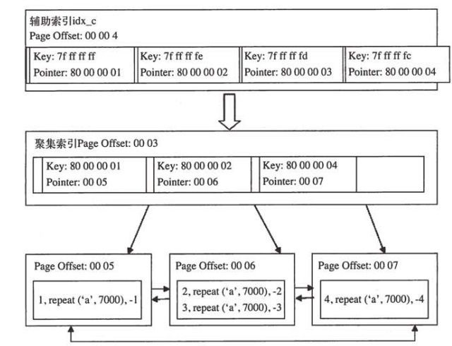

辅助索引的叶子节点中包含列 C 的值和主键的值，这里的键值为负数，所以 -1 是以 7f ff ff ff 方式存储。

### （三）B+ 树索引的分裂

数据库中的 B+ 树索引页的分裂并不总是从页的中间记录开始，这样会导致空间的浪费。InnoDB 的 Page Header 中 Page_Last_Insert、Page_Direction、Page_N_Direction 用来保存顺序信息，并通过它们来决定是向左分裂还是向右分裂，同时决定分裂点记录为哪一个。

> 如原纪录为：1,2,3,4,5,6,7,8,9 当插入 10 的时候需要对页进行分裂操作，之前是以中间点 5 作为分裂点，形成页 1:1,2,3,4  页2:5,6,7,8,9,10。因为插入是顺序的，因此页 1 中不会有新的记录被插入，导致空间分配。

插入是随机的,则取页的中间记录作为分裂点的记录,这和之前介绍的相同。若往同一方向进行插入的记录数量为5,并且目前已经定位(cursor)到的记录(InnoDB存储引擎插入时,首先需要进行定位,定位到的记录为待插人记录的前条记录)之后还有3条记录,则分裂点的记录为定位到的记录后的第三条记录,否则分裂点记录就是待插入的记录。
来看一个向右分裂的例子,并且定位到的记录之后还有3条记录,则分裂点记录如图所示。
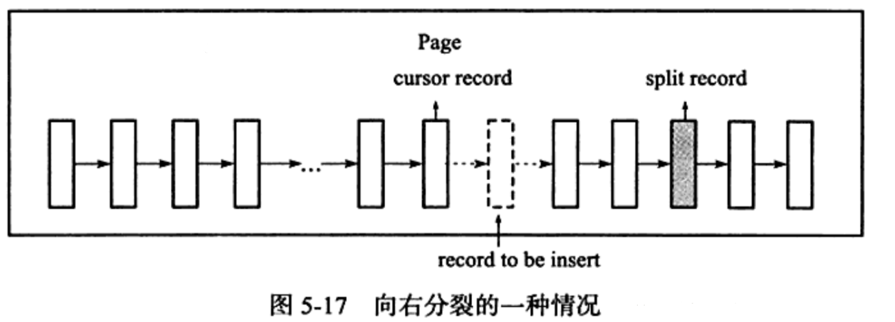

图5-17向右分裂且定位到的记录之后还有3条记录, split record为分裂点记录最终向右分裂得到如图5-18所示的情况。
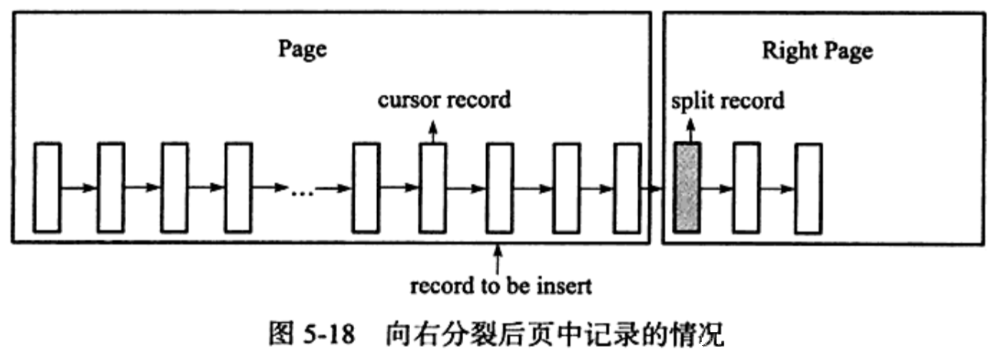

对于图5-19的情况,分裂点就为插入记录本身,向右分裂后仅插入记录本身,这在自增插人时是普遍存在的一种情况
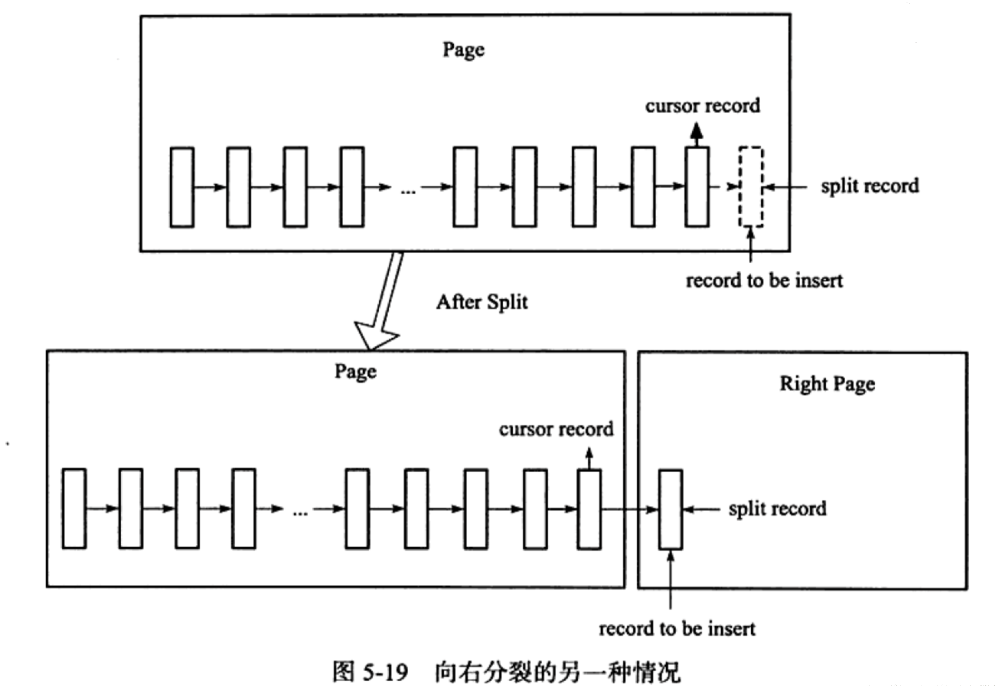

### （四）B+ 树索引的管理

#### 1、索引管理

索引的创建和删除可以通过两种方法，一种是Alter Table，另一种是Create/Drop Index。

```mysql
# alter table 方式
## 添加索引
alter table <table_name> add index <index_name>(column_list);
alter table <table_name> add unique(column_list);
alter table <table_name> add primary key(column_list);
## 删除索引
alter table <table_name> drop index <index_name>;
alter table <table_name> drop primary key;

# create/drop index
## 添加索引
create index <index_name> on <table_name>(column_list);
create unique index <index_name> on <table_name>(column_list);
## 删除索引
drop index <index_name> on <table_name>;
```

可以通过 `Show Index From <table name>`命令可以查看索引的信息。

用户可以对整个列的数据进行索引，也可以只索引列开头的部分数据，如列 a 为 varchar(8000)，可以只索引前 100 个字段：`ALTER TABLE t ADD KEY idx_a(a(100));`部分索引通过上面命令显示，查看 `Sub_part`字段值。

```mysql
CREATE TABLE index_t(
    a INT NOT NULL,
    b VARCHAR(3000),
    c INT NOT NULL,
    PRIMARY KEY (a),
    KEY idx_b (b(100)),
    KEY idx_a_c (a, c)
) ENGINE = InnoDB;

SHOW INDEX FROM index_t;
```

| Table   | Non_unique | Key_name | Seq_in_index | Column_name | Collation | Cardinality | Sub_part | Packed | Null | Index_type | Comment | Index_comment |      |
| ------- | ---------- | -------- | ------------ | ----------- | --------- | ----------- | -------- | ------ | ---- | ---------- | ------- | ------------- | ---- |
| index_t | 0          | PRIMARY  | 1            | a           | A         | 0           |          |        |      | BTREE      |         |               |      |
| index_t | 1          | idx_b    | 1            | b           | A         | 0           | 100      |        | YES  | BTREE      |         |               |      |
| index_t | 1          | idx_a_c  | 1            | a           | A         | 0           |          |        |      | BTREE      |         |               |      |
| index_t | 1          | idx_a_c  | 2            | c           | A         | 0           |          |        |      | BTREE      |         |               |      |

Table：索引所在的表名

Non_unique：非唯一索引，primary key 必须唯一，所以值为 0。

Key_name：索引名称，可以用于 Drop index ；

Seq_in_index：索引中该列的位置，主要用于联合索引；

Column_name：索引列的名称；

Collation：列以何种方式存储在索引中。B+ 树索引值为 A，表示排序的，Heap 存储引擎中的 HASH 索引未排序，所以值为 NULL。

Cardinality：表示索引中唯一值的数目的估计值， `cardinality/n_rows_in_table` 尽可能的等于 1，如果非常小应该考虑删除该索引。

同时优化器会根据该值判断是否使用该索引，该值并非每次索引更新时都会更新该值（即非实时更新，只是大概的值）。可以使用 `ANALYZE TABLE <table name>` 命令显式更新该值。当某些情况下发生索引建立了但是没有用到或者两条基本一样的语句执行 EXPLAIN，其中一个使用索引，另一个使用全表扫描，则该值可能为 NULL，此时还是通过上述语句进行显式更新。

Sub_part：是否是列的部分被索引。如 `idx_b` 显示 100，表示只对 b 列的前 100 字节索引，如果是索引整个列则该字段为 NULL。

Packed：关键词如何被压缩，如果没有压缩则为 NULL。

Null：是否索引的列含有 NULL 值，如果为 Yes 表示索引对应的列允许 NULL 值。

Index_type：索引的类型。InnoDB 只支持 B+ 树索引，所以显示 BTree。

Comment：注释。 		

### 2、Fast Index Creation

5.5 版本前 MySQL 对于如索引的添加或者删除这类 DDL 操作，操作过程为（时间较长，堵塞时间较长）：

- 首先创建一张新的临时表，表结构为通过命令 Alter table 新定义的结构；
- 将原表中的数据导入到临时表；
- 删除原表；
- 将临时表命名为原来表名；

Fast Index Creation （FIC）即快速索引创建，对于辅助索引的创建，InnoDB存储引擎会对创建索引的表加上一个S锁，可以并发地读事务（写操作还是不能使用）。对于辅助索引的删除，InnoDB存储引擎只需要更新内部视图，并将辅助索引的空间标记为可用，同时删除MySql数据库内部视图上对该表的索引定义。

FIC 只限定于辅助索引，对主键的创建的删除同样需要重建一张表。

### 3、Online Schema Change

Online Schema Change即在线架构改变，在线是指在事务的创建过程中，可以有读写事务对表进行操作，以提高原有Mysql数据库在DDL操作时的并发性。OSC 只是一个 PHP脚本，同时要修改的表一定要有主键、不能存在外键和触发器。

### 4、Online DDL

FIC 让 InnoDB 避免创建临时表，提升了索引创建效率，但是索引创建时候会阻塞表上的 DML 操作，OSC 解决了部分问题但是存在较大的局限性。

Mysql5.6 开始支持 Online DDL（在线数据定义）操作，允许辅助索引创建的同时，还允许DML（insert、update、delete）操作，极大的提高了 MySQL 数据库在生产环境中的可用性。不仅是辅助索引，其他如「辅助索引的创建与删除」、「改变自增长值」、「添加或删除外键约束」、「列的重命名」。此外可以使用Alter Table语法选择索引的创建方式：

```mysql
ALTER TABLE <table name>
| ADD {INDEX | KEY}[index_name]
[index_type] (index_col_name,....)[index_option]...
ALGORITHM [=] {DEFAULT | INPLACE |COPY}
LOCK [=] {DEFAULT | NONE | SHARED | EXCLUSIVE}
```

- Copy：表示按照创建临时表的方式创建索引
- Inplace：表示索引创建或删除操作不需要创建临时表
- Default：表示根据 `old_alter_table`参数来判断是通过 Inplace 还是 Copy，该参数默认为 Off，表示采用 Inplace 方式

创建索引中的 Lock 部分为索引创建或删除时对表添加锁的情况：

- None：表示执行索引创建或删除操作时，对目标表不添加任何锁，即事务可以进行读写操作，不会受到阻塞，支持最大的并发度；
- Share：表示执行索引的创建或删除操作时，对目标表加一个S锁，支持并发地读事务，遇到写事务会等待；
- Exclusive：表示执行索引创建或删除操作时，对目标表加上一个X锁，读写事务都不能进行，因此会阻塞所有的线程。类似于 Copy 但是不创建临时表。
- Default：表示首先会判断当前操作是否可以使用None模式，若不能则判断是否可以使用Share模式，最后判断是否可以使用Exclusive模式

**InnoDB 实现 Online DDL 原理**：

在执行创建或者删除操作的同时，将 INSERT、UPDATE、DELETE 等 DML 操作日志写入一个缓存中。待完成索引创建后将将其重做应用到表上，从而达到数据一致性。缓存大小由参数 `innodb_online_alter_log_max_size` 控制，默认为 128MB，当放不下会抛出异常。

## 五、Cardinality 值

不是所有查询条件中出现的列都需要添加索引，当某个字段的取值范围很广，且几乎没有重复时即属于高选择性，此时使用 B+ 树索引是最合适的。且一般当访问表中很少一部分时使用 B+ 树索引才有意义。通过Show Index 结果中的 Cardinality 列（表示索引中不重复记录数量的预估值）可以知晓，理论情况下它与行数据`n_rows_in_table` 的比例应该尽可能的接近 1。

### InnoDB 的 Cardinality 统计

数据库对于 Cardinality 的统计是在存储引擎层进行的，通过采样方式完成。其统计发生在 INSERT 和 UPDATE 操作中，同时只有当上次统计之后，表中 1/16 的数据已发生变化，或者对表中某一行的数据频繁地进行更新操作时（此时就无法适用第一种的条件了），即当更新统计参数（变化次数）stat_modified_counter 大于 2000000000 时，会更新 Cardinality 信息。

实际统计中，默认 InnoDB 会对 8 个叶子节点（Leaf Page）进行采样，采样过程为：

获取 B+ 树索引中叶子节点的数量 A，随机取其中 8 个叶子节点，统计每页不同记录数目，最后将 8 页数目相加 /8 然后乘以 A。因为随机取 8 个节点，所以每次获得的 Cardinality 值可能都不同。只有当表足够小的时候（表中叶子节点数小于或者等于 8）则每次结果都是一样的。

当使用 `analyze table` 、`show table status`、`show index` 或者访问 Information_schema 架构下的 Tables 表和 statistics 时候会导致重新计算索引的 Cardinality 值。

`innodb_stats_transient_sample_pages` 参数表示每次采样页的数量，默认为 8；

`innodb_stats_persistent` 参数表示时候将 analyze table 计算的 Cardinality 值存放到磁盘中，减少了计算次数，默认 OFF；

`innodb_stats_persistent_sample_pages` 参数表示当上面一个参数为 ON 时，每次使用 analyze table 更新 Cardinality 值时每次采样页的数量，默认 20；

`innodb_stats_on_metadata` 参数表示执行上述几个命令的时候，是否重新计算 Cardinality 值。

## 六、B+ 树索引的使用

对于 OLTP 应用，即查询一小部分数据时，对索引的使用则是通过索引取得表中少部分的数据。对于 OLAP 应用，较为复杂的查询涉及表的关联查询，此时索引的添加依旧是有意义的（通常对时间字段加索引，因为大多数统计根据时间维度来筛选）。

### （一）联合索引

联合索引是指对表上多个列进行索引，联合索引也是一颗 B+ 树，不同的是联合索引的键值的数量不是 1 而是大于等于 2 的，同时键值都是排序的，通过叶子节点可以逻辑上顺序地读出所有数据。对于(a,b)类型的联合索引，`where a = XXX and b = YYY` 和 `where a = XXX` 都可以使用该联合索引，但是 `where b = XXX` 不能使用，因为叶子节点上的 b 的值不是有序的。

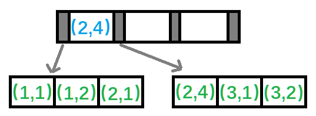

另一个好处是已经对第二个键值进行了排序处理。

```mysql
CREATE TABLE buy_log(
    user_id BIGINT UNSIGNED NOT NULL,
    buy_date DATE,
    KEY (user_id),
    KEY (user_id,buy_date)
)ENGINE =InnoDB;

EXPLAIN SELECT  * FROM buy_log WHERE  user_id = 1;
EXPLAIN SELECT * FROM  buy_log WHERE user_id = 1 ORDER BY  buy_date DESC LIMIT  3;
```

两条查询语句，针对两个索引都可以使用，但是第一条使用单个键值的索引，第二条使用联合索引。因为针对第一个查询：第一个索引的叶子节点包含单个键值，理论上一个页可以存放更多的记录。第二个查询中使用第二个索引，因为第二个索引中的 buy_date 是排好序的，从 Explain 中看出没有进行排序。

两个查询语句的执行结果：

| id   | select_type | table   | partitions | type | possible_keys     | key     | key_len | ref   | rows | filtered | Extra |
| ---- | ----------- | ------- | ---------- | ---- | ----------------- | ------- | ------- | ----- | ---- | -------- | ----- |
| 1    | SIMPLE      | buy_log |            | ref  | user_id,user_id_2 | user_id | 8       | const | 1    | 100      |       |

| id   | select_type | table   | partitions | type | possible_keys     | key       | key_len | ref   | rows | filtered | Extra                    |      |      |
| ---- | ----------- | ------- | ---------- | ---- | ----------------- | --------- | ------- | ----- | ---- | -------- | ------------------------ | ---- | ---- |
| 1    | SIMPLE      | buy_log |            | ref  | user_id,user_id_2 | user_id_2 | 8       | const | 1    | 100      | Using where; Using index |      |      |

如果第二个语句强制使用第一个索引，则从 Explain 中的 Extra 选项中看出，多了 Using filesort，即需要额外的一次排序操作。 

`EXPLAIN SELECT * FROM  buy_log USE INDEX (user_id) WHERE user_id = 1 ORDER BY  buy_date DESC LIMIT  3;`

| id   | select_type | table   | partitions | type | possible_keys | key     | key_len | ref   | rows | filtered | Extra                                  |      |
| ---- | ----------- | ------- | ---------- | ---- | ------------- | ------- | ------- | ----- | ---- | -------- | -------------------------------------- | ---- |
| 1    | SIMPLE      | buy_log |            | ref  | user_id       | user_id | 8       | const | 1    | 100      | Using index condition; Using  filesort |      |

如果要是（a,b,c）三列联合索引，则`where a = XXX order b = XX` 和 `where a = XXX AND b = XX ORDER BY c` 都可以使用索引，但是 `where a = XXX ORDER BY  c` 不行，因为索引（a,c）并未排序，还需要执行 filesort 操作。

### （三）覆盖索引

InnoDB 支持覆盖索引，即从辅助索引中就可以得到查询的记录，而不需要查询聚集索引中的记录，此外覆盖索引的好处是辅助索引不包含整行记录的所有信息，其大小远小于聚集索引，可以减少大量的 IO 操作。

因为 InnoDB 的辅助索引包含了主键信息，因此其叶子节点存放的数据为：（primary key1,primary key2,….key1,key2,…）。则如下面语句都可以使用一次辅助联合索引来完成查询：

```mysql
SELECT key2 FROM table WHERE key1 = XXX;
SELECT primary key2,key2 FROM table WHERE key1 = XXX;
SELECT primary key1,key2 FROM table WHERE key1 = XXX;
SELECT primary key1,primary key2, key2 FROM table WHERE key1 = XXX;
```

此外针对一些统计查询，也可以减少部分 IO 操作。

针对 `SELECT COUNT(*) FROM buy_log` 中，InnoDB 不会选择通过查询聚集索引来进行统计，因为该表上包括辅助索引，同时辅助索引远小于聚集索引，因此使用辅助索引可以减少 IO 操作：

| id   | select_type | table   | partitions | type  | possible_keys | key     | key_len | ref  | rows | filtered | Extra       |
| ---- | ----------- | ------- | ---------- | ----- | ------------- | ------- | ------- | ---- | ---- | -------- | ----------- |
| 1    | SIMPLE      | buy_log |            | index |               | user_id | 8       |      | 1    | 100      | Using index |

`possible_keys` 列为 NULL，但是实际执行时优化器选择了 user_id 索引，同时 Extra 列的 Using index 表示优化器进行了覆盖索引操作。

同时针对如 （a,b）的联合索引，选择列 b 为查询条件时不会使用联合索引。但如果是统计操作且是覆盖索引的，则优化器会进行选择：

`EXPLAIN SELECT COUNT(*) FROM buy_log WHERE buy_date >= '2020-01-01' AND buy_date <= '2021-01-01';`

| id   | select_type | table   | partitions | type  | possible_keys | key       | key_len | ref  | rows | filtered | Extra                    |
| ---- | ----------- | ------- | ---------- | ----- | ------------- | --------- | ------- | ---- | ---- | -------- | ------------------------ |
| 1    | SIMPLE      | buy_log |            | index |               | user_id_2 | 12      |      | 1    | 100      | Using where; Using index |

### （四）优化器选择不使用索引的情况

在某些情况下，优化器会选择扫描聚集索引查找数据，即全表扫描来获取数据，而不是使用索引，这类情况多发生于范围查找和Join链接操作。当访问数据占整个表的20%时，优化器会选择聚集索引来查找数据。

==这里表的索引建不出来和书上一样的，没有分析== =》 P220

在某些情况下,当执行 EXPLAI命令进行SQL语句的分析时,会发现优化器并没有选择索引去查找数据,而是通过扫描聚集索引,也就是直接进行全表的扫描来得到数据。这种情况多发生于范围查找、JOIN链接操作等情况下。例如:
SELECT FROM orderdetails Where orderid>10000 and orderid<102000;
上述这句SQL语句查找订单号大于10000的订单详情,通过命令 SHOW INDEX FROM orderdetails,可观察到的索引如图所示。


可以看到表 orderdetails有( OrderID, ProductID)的联合主键,此外还有对于列OrderID的单个索引。上述这句SQL显然是可以通过扫描 OrderID上的索引进行数据的查找。然而通过 EXPLAIN命令,用户会发现优化器并没有按照 OrderID上的索引来查找数据,如图所示。
在 possible keys一列可以看到查询可以使用 PRIMARY、 OrderID、 OrdersOrder_Details三个索引,但是在最后的索引使用中,优化器选择了 PRIMARY聚集索引,也就是表扫描( table scan),而非 OrderID辅助索引扫描( index scan)。
这是为什么呢?原因在于用户要选取的数据是整行信息,而 OrderID索引不能覆盖到我们要査询的信息,因此在对 OrderID索引查询到指定数据后,还需要一次书签访问来查找整行数据的信息。虽然 OrderID索引中数据是顺序存放的,但是再一次进行书签查找的数据则是无序的,因此变为了磁盘上的离散读操作。如果要求访问的数据量很小,则优化器还是会选择辅助索引,但是当访问的数据占整个表中数据的蛮大一部分时(一般是20%左右),优化器会选择通过聚集索引来查找数据。因为之前已经提到过,顺序读要远远快于离散读。因此对于不能进行索引覆盖的情况,优化器选择辅助索引的情况是,通过辅助索引查找的数据是少量的。这是由当前传统机械硬盘的特性所决定的,即利用顺序读来替换随机读的查找。若用户使用的磁盘是固态硬盘,随机读操作非常快,同时有足够的自信来确认使用辅助索引可以带来更好的性能,那么可以使用关键字 FORCE INDEX来强制使用某个索引,如:
SELECt FROM orderdetails FORCE INDEX(OrderID) Where orderid>10000 and orderid<102000;
这时的执行计划如图所示。


### （五）索引提示

Mysql数据库支持显示地告诉优化器使用哪个索引，以下两种情况下需要使用索引提示（Index Hint）：

- Mysql数据库优化器错误地选择了某个索引，导致SQL执行很慢
- 某SQL语句可以选择的索引非常多，优化器执行计划时间的开销大于SQL语句本身

示例如下：

```mysql
CREATE TABLE a_b(
    a INT NOT NULL ,
    b INT NOT NULL ,
    KEY (a),
    KEY (b)
)ENGINE = InnoDB;

INSERT INTO a_b SELECT 1,1;
INSERT INTO a_b SELECT 1,2;
INSERT INTO a_b SELECT 2,3;
INSERT INTO a_b SELECT 2,4;
INSERT INTO a_b SELECT 1,2;

EXPLAIN SELECT  * FROM  a_b WHERE  a = 1 AND  b = 2;
EXPLAIN SELECT  * FROM  a_b USE INDEX (a) WHERE  a = 1 AND  b = 2;
EXPLAIN SELECT  * FROM  a_b FORCE INDEX (a) WHERE  a = 1 AND  b = 2;
```

第一个执行计划结果为：

| id   | select_type | table | partitions | type        | possible_keys | key  | key_len | ref  | rows | filtered | Extra                                           |      |      |      |
| ---- | ----------- | ----- | ---------- | ----------- | ------------- | ---- | ------- | ---- | ---- | -------- | ----------------------------------------------- | ---- | ---- | ---- |
| 1    | SIMPLE      | a_b   |            | index_merge | a,b           | b,a  | 4,4     |      | 1    | 100      | Using intersect(b,a); Using where;  Using index |      |      |      |

possible_keys 为 a,b，实际使用的索引为列 key 中的 a,b。即 MySQL 使用 a,b 两个索引完成该查询。列 Extra 中的 Using intersect(b,a) 表示根据两个索引得到的结果进行求交的数学运算，最后得到结果。

第二个查询中 USE INDEX 是告诉优化器**可以**选择该索引，实际上优化器还是跟再根据自己的判断进行选择。

| id   | select_type | table | partitions | type | possible_keys | key  | key_len | ref  | rows | filtered | Extra       |
| ---- | ----------- | ----- | ---------- | ---- | ------------- | ---- | ------- | ---- | ---- | -------- | ----------- |
| 1    | SIMPLE      | a_b   |            | ALL  | a             |      |         |      | 9    | 11.11    | Using where |

第三个查询中就相当于强制使用我们制定的索引进行查询了。

| id   | select_type | table | partitions | type | possible_keys | key  | key_len | ref   | rows | filtered | Extra       |
| ---- | ----------- | ----- | ---------- | ---- | ------------- | ---- | ------- | ----- | ---- | -------- | ----------- |
| 1    | SIMPLE      | a_b   |            | ref  | a             | a    | 4       | const | 5    | 11.11    | Using where |

### （六）Multi-Range Read 优化

Mysql5.6 版本开始支持Multi-Range Read（MRR）优化，其目的是为了减少磁盘的随机访问，并且将随机访问转换为较为顺序的数据访问，对于 IO-bound 类型的 SQL 查询语句带来极大的提升，该优化可用于 range、ref、eq_ref 类型的查询，此外该优化好处包括：减少缓冲池中页被代替的次数，和批量处理对键值的查询操作。

对于 InnoDB 和 MyISAM 存储引擎的范围查询和 Join 查询操作，MRR 的工作方式如下：

- 将查询得到的辅助索引值存放于一个缓存中，且缓存中的数据是根据辅助索引键值排序的；
- 将缓存中的键值根据 RowID 进行排序；
- 根据 RowID 的排序顺序来访问实际的数据文件；

此外启用 Multi-Range Read 还可以将某些范围的查询拆分为键值对，来进行批量的查询，而非查询出来一部分后再进行过滤

==P224-225 验证不出来，待补充，笔记没有做==

### 7、Index Confition Pushdown优化

原先在进行索引查询时，会首先根据索引来查找数据，然后再根据 WHERE 条件来过滤记录，而在Mysql5.6支持 Index Confition Pushdown 以后，MySQL 会在取出索引的同时，判断是否可以进行 WHERE 条件的过滤，即将 WHERE 的部分过滤操作放在了存储引擎层，在某些情况下，可以大大减少上层SQL层对记录的索取，从而提高性能。

该优化支持 range/ref/eq_ref/ref_or_null 类型的查询，仅支持 MyISAM 和 InnoDB，当优化器选择该优化时，执行计划的 Extra 列显示 Using Index condition 提示。

**示例**：

当某张表有联合索引(a,b,c），并且查询语句为：`SELECT * FROM <table> WHERE a = XX AND b like '%XX%' AND c like '%XX%';`原来是 MySQL 通过索引定位 a = XX 的记录，因为后面两个索引对其没有帮助，所以取出所有a = XX 的记录，然后再过滤 WHERE 后面两个条件。支持该优化后，在索引取出时，就会进行 WHERE 条件的过滤，然后再去获取记录。

**WHERE 可以过滤的条件是要该索引可以覆盖到的范围**：

`SELECT * FROM salaries WHERE ( from_date between '2020-01-01' AND '2020-01-04') AND (salary between 1 AND 100);`

如果不启动该优化的结果为：

| id   | select_type | table    | partitions | type  | possible_keys | key   | key_len | ref  | rows   | Extra                 |
| ---- | ----------- | -------- | ---------- | ----- | ------------- | ----- | ------- | ---- | ------ | --------------------- |
| 1    | SIMPLE      | salaries |            | range | idx_s         | idx_s | 4       | null | 210740 | Using index condition |

Extra 中的提示，因为该表主键为（emp_no,from_date)的联合索引，所以 idx_s 索引中包含了 from_date 的数据，因此 idx_s 索引使用该优化。

## 七、哈希算法

时间复杂度为 O(1)

### （一）哈希表

哈希表也称散列表，由直接寻址表改进而来，在哈希方式下利用哈希函数 h，根据关键字 k 计算出槽的位置，再利用哈希函数 h 可以将关键字域映射到哈希表的槽位上。

对于哈希碰撞问题，数据库一般采用链接法。链接法会将散列到同一槽中的所有元素放在一个链表中。对于哈希函数，数据库一般采用除法散列实现，如将关键字映射到 m 个槽的某一个中，则通过哈希函数为 `h(k) = k mod m`即 k 除以 m 的余数。

### （二）InnoDB存储引擎中的哈希算法

**InnoDB 中采用哈希算法对字典进行查找，其冲突机制采用链表方式，哈希函数采用除法散列方式**。

对于缓冲池页的哈希表，在缓冲池中的 Page 页都有一个 chain 指针，它指向相同哈希函数值的页。而对于除法散列，**m 的取值为略大于 2 倍的缓冲池页数量的质数**。

例如：当前参数 `innodb_buffer_pool_size` 的设置大小为 10MB，则共有 640 个 16KB 的页。那对于缓冲池页内存的哈希表来说，需要分配 640×2=1280 个槽，但是 1280 不是质数，取比其略大的质数 1399，所以在启动时会分配 1399 个槽的哈希表，用来哈希查询所在缓冲池中的页。哈希表本身需要 20 个字节，每个槽需要 4 个字节，因此一共需要 20+4×1399=5616 个字节。其中哈希表的 20 个字节从`innodb_additional_mem_pool_size` 中进行分配，4×1399=5596 个字节从系统申请分配。因此在对InnoDB 进行内存分配规划时，也应该规划好哈希表这部分内存，这部分内存一般从系统分配，没有参数可以控制。对于前面我们说的 128GB 的缓冲池内存，则分配的哈希表和槽一共需要差不多 640MB 的额外内存空间。

那InnoDB存储引擎对于页是怎么进行查找的呢？上面只是给出了一般的算法，怎么将要查找的页转换成自然数呢？

InnoDB 存储引擎的表空间都有一个 space 号，我们要查的应该是某个表空间的某个连续 16KB 的页，即偏移量 offset。InnoDB 存储引擎将 space 左移 20 位，然后加上这个 space 和 offset，即关键字K=space<<20+space+offset，然后通过除法散列到各个槽中。

### （三）自适应哈希索引

自适应哈希索引由数据库自身创建并使用（不能人为干预），自适应哈希索引经哈希函数映射到一个哈希表中，因此对于字典的查找非常快速【哈希索引只能用于搜索等值的查询】，但是对于范围查找无能为力。

可以通过 `innodb_adaptive_hash_index` 来启动或者禁用该特性，默认开启。

运行状态可以通过 show engine innodb  status ; 查看：

```
=====================================
2021-07-26 08:48:55 0x51d4 INNODB MONITOR OUTPUT
=====================================
Per second averages calculated from the last 46 seconds
-----------------
BACKGROUND THREAD
-----------------
srv_master_thread loops: 121 srv_active, 0 srv_shutdown, 40642 srv_idle
srv_master_thread log flush and writes: 40763
----------
SEMAPHORES
----------
OS WAIT ARRAY INFO: reservation count 69
OS WAIT ARRAY INFO: signal count 66
RW-shared spins 0, rounds 95, OS waits 45
RW-excl spins 0, rounds 147, OS waits 1
RW-sx spins 1, rounds 30, OS waits 1
Spin rounds per wait: 95.00 RW-shared, 147.00 RW-excl, 30.00 RW-sx
------------
TRANSACTIONS
------------
Trx id counter 382304
Purge done for trx's n:o < 379782 undo n:o < 0 state: running but idle
History list length 0
LIST OF TRANSACTIONS FOR EACH SESSION:
---TRANSACTION 283460790458160, not started
0 lock struct(s), heap size 1136, 0 row lock(s)
--------
FILE I/O
--------
I/O thread 0 state: wait Windows aio (insert buffer thread)
I/O thread 1 state: wait Windows aio (log thread)
I/O thread 2 state: wait Windows aio (read thread)
I/O thread 3 state: wait Windows aio (read thread)
I/O thread 4 state: wait Windows aio (read thread)
I/O thread 5 state: wait Windows aio (read thread)
I/O thread 6 state: wait Windows aio (write thread)
I/O thread 7 state: wait Windows aio (write thread)
I/O thread 8 state: wait Windows aio (write thread)
I/O thread 9 state: wait Windows aio (write thread)
Pending normal aio reads: [0, 0, 0, 0] , aio writes: [0, 0, 0, 0] ,
 ibuf aio reads:, log i/o's:, sync i/o's:
Pending flushes (fsync) log: 0; buffer pool: 0
898 OS file reads, 906 OS file writes, 362 OS fsyncs
0.00 reads/s, 0 avg bytes/read, 0.00 writes/s, 0.00 fsyncs/s
-------------------------------------
INSERT BUFFER AND ADAPTIVE HASH INDEX
-------------------------------------
Ibuf: size 1, free list len 0, seg size 2, 0 merges
merged operations:
 insert 0, delete mark 0, delete 0
discarded operations:
 insert 0, delete mark 0, delete 0
Hash table size 2267, node heap has 1 buffer(s)
Hash table size 2267, node heap has 0 buffer(s)
Hash table size 2267, node heap has 0 buffer(s)
Hash table size 2267, node heap has 0 buffer(s)
Hash table size 2267, node heap has 2 buffer(s)
Hash table size 2267, node heap has 1 buffer(s)
Hash table size 2267, node heap has 1 buffer(s)
Hash table size 2267, node heap has 1 buffer(s)
0.00 hash searches/s, 0.00 non-hash searches/s
---
LOG
---
Log sequence number 39459051
Log flushed up to   39459051
Pages flushed up to 39459051
Last checkpoint at  39459042
0 pending log flushes, 0 pending chkp writes
241 log i/o's done, 0.00 log i/o's/second
----------------------
BUFFER POOL AND MEMORY
----------------------
Total large memory allocated 8585216
Dictionary memory allocated 1292379
Buffer pool size   512
Free buffers       250
Database pages     256
Old database pages 0
Modified db pages  0
Pending reads      0
Pending writes: LRU 0, flush list 0, single page 0
Pages made young 0, not young 0
0.00 youngs/s, 0.00 non-youngs/s
Pages read 787, created 105, written 594
0.00 reads/s, 0.00 creates/s, 0.00 writes/s
No buffer pool page gets since the last printout
Pages read ahead 0.00/s, evicted without access 0.00/s, Random read ahead 0.00/s
LRU len: 256, unzip_LRU len: 0
I/O sum[0]:cur[0], unzip sum[0]:cur[0]
--------------
ROW OPERATIONS
--------------
0 queries inside InnoDB, 0 queries in queue
0 read views open inside InnoDB
Process ID=4864, Main thread ID=6544, state: sleeping
Number of rows inserted 54057, updated 0, deleted 0, read 95374
0.00 inserts/s, 0.00 updates/s, 0.00 deletes/s, 0.00 reads/s
----------------------------
END OF INNODB MONITOR OUTPUT
============================
```

其中 non-hash searches/s 就是未使用哈希索引，如在范围查询时候。

## 八、全文检索

B+ 树可以通过索引快速查询 `where a like 'xxx%'` 但是针对 `like '%xxx%'` 即使添加了索引仍然需要进行索引扫描来获得结果。

### （一）概述

全文检索（1.2.x 开始支持）是将存储于数据库中的整本书或者整篇文章中的任意内容信息查找出来的技术，它可以根据需要获得全文中所有的有关章、节、段、句、词等信息，也可以进行各种统计和分析。

### （二）倒排索引

**全文索引通常使用倒排索引实现**，倒排索引和 B+ 树索引一样都是一种索引结构，它在辅助表中存储了单词与单词自身在一个或多个文档中所在位置之间的映射。其通常利用关联数组实现，拥有两种表现形式：

- inverted file index：表现形式为`{单词，单词所在文档的ID}`
- full inverted index：其表现形式为`{单词，(单词所在文档的ID，在具体文档中的位置)}`

**示例**：全文索引表 t 内容为：

| DocumentId【全文检索文档的 Id】 | Text【存储的内容】                     |
| ------------------------------- | -------------------------------------- |
| 1                               | Pease porridge hot,pease porridge cold |
| 2                               | Pease porridge in the pot              |

full inverted index  的关联数组

| Number | Text     | Documents     |
| ------ | -------- | ------------- |
| 1      | cold     | (1:6)         |
| 2      | hot      | (1:3)         |
| 3      | in       | (2:3)         |
| 4      | pease    | (1:1,4),(2:1) |
| 5      | porridge | (1:2,5),(2:2) |
| 6      | pot      | (2,5)         |
| 7      | the      | (2,4)         |

### （三）InnoDB 全文检索

InnoDB 1.2.x版本开始支持全文检索的技术，采用 full inverted index 方式，（DocumentId，Postion）被视为一个 `ilist`，因此在全文检索的表中，有两个列分别为： Word 字段和 ilist 字段，Word 字段上设有索引。

倒排索引需要将 word 存放在一张称为「辅助表（Auxiliary Table）」的表中，为提升全文索引的并行性能，InnoDB 共有 6 个辅助表，并且每张表按照 word 的 Latin 编码进行分区，并且持久化地存放在磁盘上，此外InnoDB 还用到了 FTS Index Cache 全文检索索引缓存，用来提高全文检索的性能。它是一个红黑树结构，根据(word,ilist)进行排序。InnoDB 会批量对辅助表进行更新，而不是每次插入后更新一次辅助表【每次当全文索引进行查询时，首先会将 FTS Index Cache 中对应 word 字段合并到辅助表中，然后再进行查询】。

通过参数 `innodb_ft_aux_table` 可以查看倒排索引的辅助表。

`SET GLOBAL innodb_ft_aux_table = 'lianxi/t';` 设置完成即可查询 information_schema 架构下的表 INNODB_FT_INDEX_TABLE 得到表 t 中的分词信息。

==这里设置语句为执行成功，需要重新尝试==

```mysql
CREATE TABLE text_table(
    a INT  NOT NULL,
    b TEXT NOT NULL,
    PRIMARY KEY (a)
) ENGINE = InnoDB;

INSERT INTO text_table VALUES (1, 'I am GJXAIOU');
INSERT INTO text_table VALUES (2, 'Hello GJXAIOU');

SET GLOBAL innodb_ft_aux_table = 'lianxi/text_table';
```

InnoDB 总是在事务提交时候将分词写入 FTS Index Cache，然后再通过批量更新写入磁盘。当数据库关闭时候在 FTS Index Cache 中的数据库会同步到磁盘上的辅助表中，当出现宕机部分 cache 中的数据库未同步到磁盘时候，下次重启时，当用户对表进行全文检索（查询或者插入）时候，InnoDB 会自动读取未完成的文档，然后进行分词操作，再将分词的结果放入到 FTS Index Cache 中。

参数 `innodb_ft_cache_size` 用于控制 FTS Index Cache 大小，默认 32M。缓存满了在会将其中的 （word,ilist）分词信息同步到磁盘的辅助表中，过大虽然可以提升全文检索的性能，但是宕机时未同步到磁盘的索引信息需要长时间的恢复。

InnoDB 中为了支持全文索引，使用列 `FTS_DOC_ID` 和 word 进行映射，该列类型必须为 BIGINT UNSIGNED NOT NULL，同时会为该列自动加上名为 `FTS_DOC_ID_INDEX` 的 Unique Index。

文档中分词的插入操作是在事务提交时完成，但是针对删除操作，在事务提交时候不删除磁盘辅助表中的记录，而是删除 FTS Cache Index 中的记录。对于辅助表中被删除的记录，InnoDB 会记录其 FTS Document ID，并且将其保存在 DELETE 辅助表中（对应 information_schema 架构下的 `INNODB_FT_DELETED` 表）。

文档的 DML 操作不会删除索引中的数据，只会在对应的 DELETED 表中插入数据，因此索引会变得非常大，可以使用命令：`OPTIMIZE TABLE` 来将已经删除的记录从索引中彻底删除，如果结合 `innodb_optimize_fulltext_only` 设置为 1 则仅仅对倒排索引进行操作，否则还会进行其他操作（如 Cardinality 的重新统计）。同时可以设置参数 `innodb_ft_num_word_optimize` 来限制每次实际删除的分词数量（默认值 2000）防止删除过多降低用户的响应时间。

**示例**：

```mysql
```


第一个查询语句获取分词对应信息表为：

| WORD    | FIRST_DOC_ID | LAST_DOC_ID | DOC_COUNT | DOC_ID | POSITION |
| ------- | ------------ | ----------- | --------- | ------ | -------- |
| gjxaiou | 1            | 3           | 3         | 1      | 5        |
| gjxaiou | 1            | 3           | 3         | 2      | 6        |
| gjxaiou | 1            | 3           | 3         | 3      | 17       |
| hello   | 2            | 2           | 1         | 2      | 0        |
| meet    | 3            | 3           | 1         | 3      | 8        |
| nice    | 3            | 3           | 1         | 3      | 0        |
| you     | 3            | 3           | 1         | 3      | 13       |

每个 Word 都对应一个 DOC_ID 和 POSITION，同时 FIRST_DOC_ID、LAST_DOC_ID、DOC_COUNT 分别表示该 word 第一次/最后一次出现的文档 ID和该 Word 在多少个文档中存在。

第二个 DELETE 语句可以看出：如果删除某个指定 FTS_DOC_ID 的文档，InnoDB 不会直接删除索引中对应的记录，而是将删除文档 ID 插入 DELETED 表中，同时可以通过 OPTIMIZE TABLE 来将倒排索引汇总的该文档的分词信息彻底删除。

删除指定 FTS_DOC_ID 之后的 DELETED 表内容

| DOC_ID |
| ------ |
| 3      |

删除倒排索引后，查询 DELETED  和 BEING_DELETED 表获得的数据就是空的，最后再次查询分词表中数据如下：

| WORD    | FIRST_DOC_ID | LAST_DOC_ID | DOC_COUNT | DOC_ID | POSITION |
| ------- | ------------ | ----------- | --------- | ------ | -------- |
| gjxaiou | 1            | 2           | 2         | 1      | 5        |
| gjxaiou | 1            | 2           | 2         | 2      | 6        |
| hello   | 2            | 2           | 1         | 2      | 0        |

同时 InnoDB 中有一张默认的 stopword 列表（该列表中的 word 不需要对其进行索引分词操作，如 the），位于 information_schema 下的 INNODB_FT_DEFAULT_STOPWORD，用户可以通过参数 `innodb_ft_server_stopword_table` 来自定义该表。

```mysql
CREATE TABLE user_stopword(
    value VARCHAR(30)
)ENGINE = InnoDB;

SET GLOBAL innodb_ft_server_stopword_table = 'lianxi/user_stopword';
```

当前 InnoDB 存储引擎的全文索引还存在以下限制：

- 每张表只能有一个全文检索的索引
- 由多列组合而成的全文检索的索引列必须使用相同的字符集与排列规则
- 不支持没有单词界定符的语言，如中文、日语、韩语

## 四、全文检索

MySQL 通过 `MATCH()...AGAINST()` 语法支持全文检索的查询，MATCH 指定了需要被查询的列，AGAINST 指定了使用何种方法去进行查询。各种查询模式如下所示：

### （一）Natural Language

全文检索通过 Match 函数进行查询，默认采用 Natural Language 模式，其表示查询 body 字段带有指定 word 的文档：

```mysql
select * from tableA where body like '%xx%'   ---无法使用 B+ 树索引
select * from tableA where Match(body) Against('xx' IN NATURAL LANGUAGE MODE)--使用全文索引
```

示例 `EXPLAIN SELECT  * FROM fts_a WHERE MATCH(body) AGAINST('GJXAIOU');` 的执行结果为：

| id   | select_type | table | partitions | type     | possible_keys | key     | key_len | ref   | rows | filtered | Extra                         |      |      |
| ---- | ----------- | ----- | ---------- | -------- | ------------- | ------- | ------- | ----- | ---- | -------- | ----------------------------- | ---- | ---- |
| 1    | SIMPLE      | fts_a |            | fulltext | idx_fts       | idx_fts | 0       | const | 1    | 100      | Using where; Ft_hints: sorted |      |      |

type 列的 fulltext 表示使用全文检索的倒排索引，key 显示的 idx_fts 表示索引名称，如果表中没有创建倒排索引则执行 MATCH 函数会报错。

WHERE 条件中的使用 MATCH 函数，查询返回的结果是根据相关性进行降序排序的，相关性最高的结果放在第一位，其计算依据条件如下：1).word 是否在文档中出现；2).word 在文档中出现的次数；3).word 在索引中列的数量；4).多少个文档包含该 word

相关性的查询语句为：` SELECT FTS_DOC_ID, body, MATCH(body) AGAINST('GJXAIOU' IN NATURAL LANGUAGE MODE) AS Relevance FROM fts_a;`

| FTS_DOC_ID | body          | Relevance            |
| ---------- | ------------- | -------------------- |
| 1          | I am GJXAIOU  | 0.031008131802082062 |
| 2          | Hello GJXAIOU | 0.031008131802082062 |

 同时如果查询的 word 在 stopword 列中则忽略该字符串的查询（在任意文档中该 word 的相关性均为 0），同时查询的 word 的字符长度必须在参数区间 `innodb_ft_min_token_size` 和 `innodb_ft_max_token_size `之间（默认分别为 3 和 84）。	

### （二）Boolean

MySQL 允许使用 `In Boolean Mode` 修饰符来进行全文的检索，Boolean 全文检索支持以下几种操作符：

- `+`表示该 word 必须存在
- `-`表示该 word 必须被排除
- `(no operator)`表示该 word 是可选的，如果出现，相关性会更高
- `@distance` 表示查询的多个单词之间的距离是否在 distance 之内，其单位是字节
- `>` 表示出现该单词时增加相关性
- `<` 表示出现该单词时降低相关性
- `~` 表示允许出现该单词，但是出现时相关性为负
- `*` 表示以该单词开头的单词
- `“`表示短语

示例语句：

```mysql
INSERT INTO fts_a SELECT NULL ,'I am the GJXAIOU';
OPTIMIZE TABLE fts_a;
SELECT FTS_DOC_ID, body FROM fts_a WHERE MATCH(body) AGAINST('"am GJXAIOU" @2' IN BOOLEAN MODE) ;
SELECT FTS_DOC_ID,body FROM fts_a WHERE MATCH(body) AGAINST('-am +GJXAIOU' IN  BOOLEAN MODE);
```

~~两个查询语句输出结果均为完整的表内容，需要看一下问题出在哪里？对应书本 P245~~

### （三）Query Expansion

MySQL 数据库支持全文检索的扩展查询，此类查询通常在查询的关键词太短，用户需要隐含知识时进行。通过在查询短语中添加 `With Query Expansion` 或者 `In Natural Language Mode With Query Expansion` 可以开启 blind query expansion。该查询分为两个阶段：

- 第一阶段：根据搜索的单词进行全文索引查询
- 第二阶段：根据第一阶段产生的分词再进行一次全文检索的查询

**示例如下**：

```mysql
CREATE TABLE articles(
    id INT UNSIGNED NOT NULL AUTO_INCREMENT,
    title VARCHAR(200),
    body TEXT,
    PRIMARY KEY (id),
    FULLTEXT (title,body)
)ENGINE = InnoDB;

INSERT INTO  articles (title, body) VALUES ('MySQL Tutorial','DBMS stands for DataBase'),('optimize MySQL', 'we will show'),('Tuning DB2','For IBM database');

# 常规模式
SELECT  * FROM articles WHERE MATCH(title, body) AGAINST('database' IN NATURAL LANGUAGE MODE );
# 拓展模式
SELECT  * FROM articles WHERE MATCH(title, body) AGAINST('database' WITH QUERY EXPANSION );
```

本次没有显式创建 FTS_DOC_ID 列，InnoDB 会自动创建并且添加唯一索引，同时该表的全文检索索引是根据列 title 和 body 的联合索引，根据 database 关键字全文检索查询的结果如下，常规查询的 body 字段仅仅是包含 database 的，拓展查询结果中除了包括 database 的，也有包括 title 或者 body 字段中包含 mysql/db2 的文档。

| id   | title          | body                     |
| ---- | -------------- | ------------------------ |
| 1    | MySQL Tutorial | DBMS stands for DataBase |
| 3    | Tuning DB2     | For IBM database         |

| id   | title          | body                     |
| ---- | -------------- | ------------------------ |
| 1    | MySQL Tutorial | DBMS stands for DataBase |
| 3    | Tuning DB2     | For IBM database         |
| 2    | optimize MySQL | we will show             |

但是 拓展查询的全文索引可能会带来很多非相关性的查询，谨慎使用。

