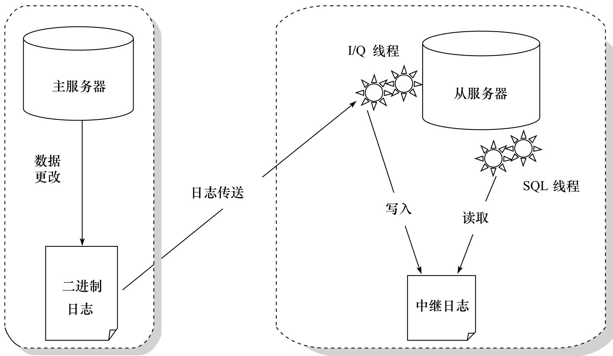

## 备份与恢复

### 复制

#### 复制的原理

复制（replication）是 MySQL 数据库提供的一种高可用高性能的解决方案，一般用来建立大型的应用。总体来说，replication 的工作原理分为以下 3 个步骤：

1. 主服务器（master）把数据更改记录到二进制日志（binlog）中。
2. 从服务器（slave）把主服务器的二进制日志复制到自己的中继日志（relay log）中。
3. 从服务器重做中继日志中的日志，把更改应用到自己的数据库上，以达到数据的最终一致性。

复制的工作原理并不复杂，其实就是一个完全备份加上二进制日志备份的还原。不同的是这个二进制日志的还原操作基本上实时在进行中。这里特别需要注意的是，复制不是完全实时地进行同步，而是异步实时。这中间存在主从服务器之间的执行延时，如果主服务器的压力很大，则可能导致主从服务器延时较大。复制的工作原理如图 8-4 所示。

从服务器有 2 个线程，一个是 I/O 线程，负责读取主服务器的二进制日志，并将其保存为中继日志；另一个是 SQL 线程，复制执行中继日志。

