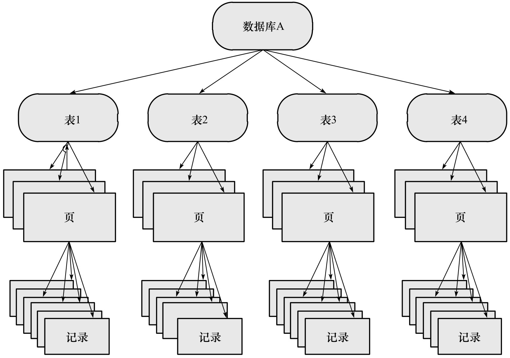
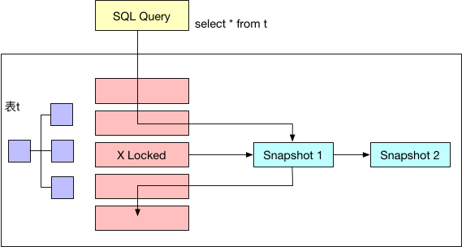
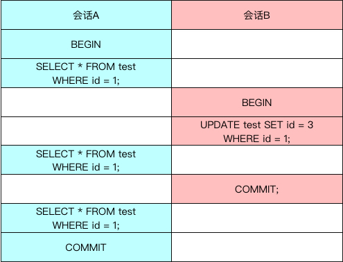
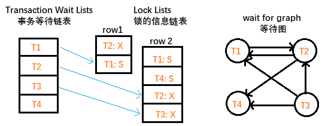
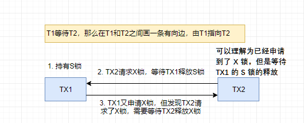

# 第六章：锁

只有当实现本身会增加开销时，行级锁才会增加开销。InnoDB 不需要锁升级，因为**一个锁和多个锁的开销是相同的**。

**锁用于管理和支持对共享资源的并发访问，同时提供数据的完整性和一致性**。同时各个存储引擎对锁的实现均不相同，InnoDB 提供一致性的非锁定读、行级锁支持。行级锁没有相关额外的开销，并可以同时得到并发性和一致性。

## 一、Lock 和 Latch

Latch 称为闩锁（轻量级的锁），其要求锁定的时间必须比较短。InnoDB 中的 Latch 分为 mutex（互斥量）和 rwlock（读写锁），目的在于保证并发线程操作临界资源的正确性，并且没有死锁检测的机制。

**Lock 的对象是事务**，用来锁定数据库中的对象（如表、页、行）。通常 lock 的对象仅在对象 commit 或者 rollback 后进行释放（不同事务隔离级别释放的时间可能不同）。且存在死锁检测机制。

|          | lock                                                    | latch                                                        |
| -------- | ------------------------------------------------------- | ------------------------------------------------------------ |
| 对象     | 事务                                                    | 线程                                                         |
| 保护     | 数据库内容                                              | 内存数据结构                                                 |
| 持续时间 | 整个事务过程                                            | 临界资源                                                     |
| 模式     | 行锁、表锁、意向锁                                      | 读写锁、互斥量                                               |
| 死锁     | 通过 waits-for graph、time out 等机制进行死锁检测和处理 | 无死锁检测和处理机制。仅通过应用程序加锁的顺序（lock leveling）保证无死锁的情况发生 |
| 存在于   | Lock Manager 的哈希表中                                 | 每个数据结构的对象中                                         |

**Latch 信息查看**：
通过命令 `SHOW ENGINE INNODB MUTEX`，结果如下：

| Type   | Name                        | Status   |
| ------ | --------------------------- | -------- |
| InnoDB | rwlock: dict0dict.cc:2782   | waits=1  |
| InnoDB | rwlock: dict0dict.cc:1228   | waits=6  |
| InnoDB | rwlock: log0log.cc:846      | waits=68 |
| InnoDB | sum rwlock: buf0buf.cc:1460 | waits=6  |

其中 Type 列总是 InnoDB，Name 列为 latch 的信息和所在源码的位置（行数），列 status 信息结构如下：

名称|说明
---|---
count| mutex 被请求的次数 
spin_waits| spin lock(自旋锁)的次数，InnoDB 存储引擎 latch 在不能获得锁时首先进行自旋，若自旋后还不能获得锁，则进入等待状态 
spin_rounds| 自旋内部循环的总次数,每次自旋的内部循环是一个随机数。 spin rounds/spain waits 表示平均每次自旋所需的内部循环次数 
os_waits| 表示操作系统等待的次数。当 spin lock 通过自旋还不能获得 latch 时，则会进入操作系统等待状态，等待被唤醒 
os_yields| 进行 os_thread_yield 唤醒操作的次数 
os_wait_times| 操作系统等待的时间，单位是 ms 

**lock 信息查看**：

通过 `SHOW ENGINE INNODB STATUS` 和 `information_schema` 架构下的 `INNODB_TRX`、`INNODB_LOCKS` 和 `INNODB_LOCK_WAITS` 来观察锁的信息。

```log
----------
SEMAPHORES
----------
OS WAIT ARRAY INFO: reservation count 112
OS WAIT ARRAY INFO: signal count 104
RW-shared spins 0, rounds 164, OS waits 79
RW-excl spins 0, rounds 151, OS waits 1
RW-sx spins 1, rounds 30, OS waits 1
Spin rounds per wait: 164.00 RW-shared, 151.00 RW-excl, 30.00 RW-sx
```

## 二、InnoDB 存储引擎中的锁

### （一）锁的类型

InnoDB 实现了两种标准的行级锁：

- 共享锁（S Lock）：允许一个事务读一行数据；
- 排它锁（X Lock）：允许一个事务删除或者更新一行数据；

锁兼容：事务 T1 已经获得行 r 的共享锁，事务 T2 可以立即获得行 r 的共享锁；因为读取并不改变行 r 的数据；

锁不兼容：此时事务 T3 想获得行 r 的排它锁，则必须等待事务 T1、T2 释放行 r 上的共享锁。

|      | X      | S      |
| ---- | ------ | ------ |
| X    | 不兼容 | 不兼容 |
| S    | 不兼容 | 兼容   |

这里的 **X 和 S 锁都是行锁，兼容是指对统一记录（row）锁的兼容性情况**。

InnoDB 通过意向锁支持多粒度锁定，该锁定允许事务在行级上的锁和表级上的锁同时存在。意向锁是将锁定的对象分为多个层次，意味着事务希望在更细粒度上进行加锁。

如果想要对最下层（最细粒度）的对象上锁，首先需要对粗粒度的对象上锁，如当需要对页上的记录 r 上 X 锁，则首先分别需要对数据库 A、表、页上意向锁 IX，最后对记录 r 上 X 锁。如果前面任一部分导致等待，则该操作需要等待粗粒度锁的完成。如在对记录 r 加 X 锁之前，以及有事务对表 1 进行了 S 表锁，则表 1 上已存在 S 锁，之后事务需要对记录 r 上加上 IX，由于锁的不兼容，所以该事务需要等待表锁操作的完成。



**InnoDB 的意向锁即为表级别的锁**，目的主要是在一个事务中揭示下一行将被请求的锁类型，支持两种意向锁：

- 意向共享锁（IS Lock）：事务想要获得一张表中某几行的共享锁；
- 意向排它锁（IX Lock）：事务想要获得一张表中某几行的排它锁；

**InnoDB 支持的是行级别的锁**，所以意向锁不会阻塞除全表扫描以外的任何请求。表级意向锁和行级锁的兼容性：

==问题：已经支持行级锁，为什么还需要意向锁==

|      | IS     | IX     | S      | X      |
| ---- | ------ | ------ | ------ | ------ |
| IS   | 兼容   | 兼容   | 兼容   | 不兼容 |
| IX   | 兼容   | 兼容   | 不兼容 | 不兼容 |
| S    | 兼容   | 不兼容 | 兼容   | 不兼容 |
| X    | 不兼容 | 不兼容 | 不兼容 | 不兼容 |

查看当前数据库中锁的请求和事务锁的情况通过 `information.schema` 架构下的 `INNODB_TRX`/`INNODB_LOCKS`/`INNODB_LOCK_WAITS` 三张表。

**表 INNODB_TRX 的结构说明**

该表只显示当前运行的 InnoDB 事务，并不能直接判断说的一些情况。

| **字段名**                 | **说明**                                                     |
| -------------------------- | ------------------------------------------------------------ |
| trx_id                     | **InnoDB 存储引擎内部唯一的事务 ID**                         |
| trx_state                  | **当前事务的状态**，包括 RUNNING/LOCK  WAIT/ROLLING BACK/COMMITTING |
| trx_started                | 事务的开始时间                                               |
| trx_requested_lock_id      | **等待事务的锁ID**，如 `trx_state` 的状态为 LOCK WAIT，那么该值代表当前的事务等待之前事务占用锁资源的 ID。若 `trx_state` 不是 LOCK WAIT， 则该值为 NULL，和 INNODB_LOCKS  表可以看详细信息 |
| trx_wait_started           | 事务等待开始的时间                                           |
| trx_weight                 | **事务的权重**，反映了一个事务修改和锁定的行数。在 InnoDB 中，当发生死锁需要回滚时，InnoDB 存储引擎会选择该值最小的进行回滚 |
| trx_mysql_thread_id        | MySQL 中的线程 ID，`SHOW PROCESSLIST` 显示的结果             |
| trx_query                  | **事务正在运行的 SQL 语句**                                  |
| trx_operation_state        | 事务当前操作状态                                             |
| trx_tables_in_use          | 当前事务执行的 SQL 中使用的表的个数                          |
| trx_tables_locked          | 当前执行 SQL 的行锁数量                                      |
| trx_lock_structs           | 事务保留的锁数量                                             |
| trx_lock_memory_bytes      | 事务锁住的内存大小，单位为 BYTES                             |
| trx_rows_locked            | 事务锁住的记录数。包含标记为 DELETED，并且已经保存到磁盘但对事务不可见的行 |
| trx_rows_modified          | **事务更改的行数**                                           |
| trx_concurrency_tickets    | 事务并发票数                                                 |
| trx_isolation_level        | **当前事务的隔离级别**                                       |
| trx_unique_checks          | 是否打开唯一性检查的标识                                     |
| trx_foreign_key_checks     | 是否打开外键检查的标识                                       |
| trx_last_foreign_key_error | 最后一次的外键错误信息                                       |
| trx_adaptive_hash_latched  | 自适应散列索引是否被当前事务锁住的标识                       |
| trx_adaptive_hash_timeout  | 是否立刻放弃为自适应散列索引搜索 LATCH 的标识                |
| TRX_IS_READ_ONLY           | 值为1表示事务是read only                                     |
| TRX_AUTOCOMMIT_NON_LOCKING | 值为1表示事务是一个select语句，该语句没有使用for update或者shared mode锁，并且执行开启了autocommit，因此事务只包含一个语句。当TRX_AUTOCOMMIT_NON_LOCKING和TRX_IS_READ_ONLY同时为1，innodb通过降低事务开销和改变表数据库来优化事务。 |

例如下面的 SQL 语句：

```mysql
BEGIN;
SELECT * FROM fq WHERE id = 1 FOR UPDATE;   ---- 客户端一执行；

BEGIN;
UPDATE fq SET name = 'g' WHERE id = 1;  ----- 客户端二执行；

SELECT * FROM information_schema.INNODB_TRX;   ---客户端三执行；
```

输出结果为：

```json
[
  {
    "trx_id": "393252",
    "trx_state": "LOCK WAIT",    =======> trx_id 为 393252 的事务处于 Lock wait 状态
    "trx_started": "2021-08-01 18:37:35",
    "trx_requested_lock_id": "393252:667:3:3",
    "trx_wait_started": "2021-08-01 18:37:35",
    "trx_weight": 2,
    "trx_mysql_thread_id": 5,
    "trx_query": "UPDATE fq SET name = 'g' WHERE id = 1",  ======》运行的 SQL 语句
    "trx_operation_state": "starting index read",
    "trx_tables_in_use": 1,
    "trx_tables_locked": 1,
    "trx_lock_structs": 2,
    "trx_lock_memory_bytes": 1136,
    "trx_rows_locked": 1,
    "trx_rows_modified": 0,
    "trx_concurrency_tickets": 0,
    "trx_isolation_level": "REPEATABLE READ",
    "trx_unique_checks": 1,
    "trx_foreign_key_checks": 1,
    "trx_last_foreign_key_error": null,
    "trx_adaptive_hash_latched": 0,
    "trx_adaptive_hash_timeout": 0,
    "trx_is_read_only": 0,
    "trx_autocommit_non_locking": 0
  },
  {
    "trx_id": "393251",
    "trx_state": "RUNNING",   =======》trx_id 为 393247 事务正在运行
    "trx_started": "2021-08-01 18:37:29",
    "trx_requested_lock_id": null,
    "trx_wait_started": null,
    "trx_weight": 2,
    "trx_mysql_thread_id": 3,
    "trx_query": null,
    "trx_operation_state": null,
    "trx_tables_in_use": 0,
    "trx_tables_locked": 1,
    "trx_lock_structs": 2,
    "trx_lock_memory_bytes": 1136,
    "trx_rows_locked": 1,
    "trx_rows_modified": 0,
    "trx_concurrency_tickets": 0,
    "trx_isolation_level": "REPEATABLE READ",
    "trx_unique_checks": 1,
    "trx_foreign_key_checks": 1,
    "trx_last_foreign_key_error": null,
    "trx_adaptive_hash_latched": 0,
    "trx_adaptive_hash_timeout": 0,
    "trx_is_read_only": 0,
    "trx_autocommit_non_locking": 0
  }
]
```

**表 INNODB_LOCKS 的结构**：

查看锁的相关信息。

| **字段名**  | **说明**                                                     |
| ----------- | ------------------------------------------------------------ |
| lock_id     | 锁的 ID                                                      |
| lock_trx_id | 拥有锁的事务 ID                                              |
| lock_mode   | **锁的模式**。有如下锁类型：行级锁包括：S、X、IS、IX，分别代表：共享锁、排它锁、意向共享锁、意向排它锁。表级锁包括：S_GAP、X_GAP、IS_GAP、IX_GAP 和 AUTO_INC，分别代表共享间隙锁、排它间隙锁、意向共享间隙锁、意向排它间隙锁和自动递增锁。 ==问题：前面说 INNODB 的意向锁为表级别的，但是这里又是行级锁？== |
| lock_type   | **锁的类型**，RECORD 表示行级锁，TABLE 表示表级锁。          |
| lock_table  | 被锁定的或者包含锁定记录的表的名称。                         |
| lock_index  | 当 LOCK_TYPE=’RECORD’ 时，表示索引的名称；否则为 NULL。      |
| lock_space  | 当 LOCK_TYPE=’RECORD’ 时，表示锁定行的表空间 ID；否则为 NULL。 |
| lock_page   | 当为行锁时候，表示事务锁定记录的页号。若是表锁，则该值为 NULL |
| lock_rec    | 当为行锁时候，表示事务锁定行的数量。若是表锁，则该值为 NULL  |
| lock_data   | 当为行锁时候，事务锁定记录（行）的主键值，若是表锁，则该值为 NULL |

上述操作的结果为：

`SELECT * FROM information_schema.INNODB_LOCKS;` 查看当前锁的信息

```json
[
  {
    "lock_id": "393252:667:3:3",
    "lock_trx_id": "393252",
    "lock_mode": "X",      =======》trx_id 为 393252 的事务也向表 fq 申请一个 X 的行锁
    "lock_type": "RECORD",
    "lock_table": "`lianxi`.`fq` /* Partition `less10` */",
    "lock_index": "PRIMARY",
    "lock_space": 667,
    "lock_page": 3,
    "lock_rec": 3,
    "lock_data": "1"    ====》 申请锁住的资源和 393251 事务是相同的资源，因此只能等待
  },
  {
    "lock_id": "393251:667:3:3",
    "lock_trx_id": "393251",
    "lock_mode": "X", =====》trx_id 为 393251 的事务向表 fq 加了一个 X 的行锁
    "lock_type": "RECORD",
    "lock_table": "`lianxi`.`fq` /* Partition `less10` */",
    "lock_index": "PRIMARY",
    "lock_space": 667,
    "lock_page": 3,
    "lock_rec": 3,
    "lock_data": "1"
  }
]
```

**注意：`lock_data` 显示的值并不一定准确。如果是执行范围查找，则 `lock_data` 可能只返回第一行的主键值**。同时如果当前资源被锁住了，且锁住的页因为 InnoDB 缓冲池的容量导致该页从缓冲池被刷出，则该值会显示为 NULL，即 InnoDB 不会从磁盘再一次查找。

通过 `INNODB_LOCKS` 表可以获取每张表上锁的情况，从而判断以此引发的等待情况，通过 `INNODB_LOCKS_WAITS` 表可以直观的反映当前事务的等待。

**表 INNODB_LOCK_WAITS 的结构**

记录锁等待的对应关系

| 字段名             | 说明                  |
| ------------------ | --------------------- |
| requesting_trx_id  | 申请锁资源的事务 ID   |
| requesting_lock_id | 事务所等待的锁定的 ID |
| blocking_trx_id    | 阻塞的事务 ID         |
| blocking_lock_id   | 阻塞的锁的 ID         |

通过 `SELECT * FROM information_schema.INNODB_LOCK_WAITS;` 获取结果为：

可以看出是哪个事务阻塞了哪个事务，可以通过给出的事务和锁的 ID 联合前面两张表查询所有信息。

```mysql
[
  {
    "requesting_trx_id": "393252",
    "requested_lock_id": "393252:667:3:3",
    "blocking_trx_id": "393251",
    "blocking_lock_id": "393251:667:3:3"
  }
]
```

### （二）一致性非锁定读

一致性非锁定读指 InnoDB 通过行多版本控制的方式来读取当前执行时间数据库中行的数据。当读取的行正在执行 delete 或者 update 操作，此时读取操作不会等待行上锁的释放，InnoDB 会去读取行的一个快照数据。从而提高了数据库的并发性。

非锁定读的含义：不需要等待访问的行上 X 锁的释放，快照数据是指该行的之前版本的数据，**通过 undo 段来实现，同时 undo 用于在事务中回滚数据，因此快照数据本身没有额外的开销**。同时读取快照数据不需要上锁，因为没有事务需要对历史的数据进行修改操作。

**非锁定读是 InnoDB 的默认读取方式，即读取不会占用和等待表上的锁**。但不是在所有的事务隔离级别下都采用非锁定读，同时即使采用但是对于快照数据的定义也不相同。

多版本并发控制（MVCC）：快照数据就是当前数据之前的历史版本，每行记录可能有多个版本，该技术即为多版本并发控制。



在 READ COMMITTED 和 REPEATABLE READ（默认）的隔离级别下，InnoDB 使用非锁定一致性读，但两者对于快照版本定义不同。READ COMMITTED 中，非一致性读总是读取被锁定行的最新一份快照数据，REPEATABLE READ 下，非一致性读总是读取事务开始时的行版本数据。

```mysql
# 会话 sessionA
BEGIN;                   -- 显式开启一个事务，但是事务并没有结束
SELECT * FROM fq WHERE id = 1;

# 会话 sessionB
BEGIN;               -- 再开启一个事务，模拟并发情况，但是事务同样未提交
UPDATE fq SET id = 3 WHERE id = 1; -- 这里对 id = 1 的行加了 X 锁


## 再回到 sessionA 执行
SELECT * FROM fq WHERE id = 1; -- 在默认隔离级别下，此时会使用非锁定的一致性读。   ====》结果为 1
-- 其实此时无论是 READ COM 还是 REPE READ 显示的结果都是一样的，因为 id = 1 的行只被修改了一次，只有一个行版本的记录。

## 再回到 sessionB 执行
COMMIT;   -- 提交会话 B 中的事务

## 再回到 sessionA 执行
SELECT * FROM fq WHERE id = 1;
-- 此时针对不同隔离级别的结果则不同。
-- READ COMM 总是读取行的最新版本，如果行被锁定了，则读取该行版本的最新一个快照。因为 B 已经提交了事务，所以结果为空（id = 1 已经被修改为 3，没有 1 了）
-- REPE READ 总是读取事务开始时的行数据，因此结果仍然为 1。
```




### （三）一致性锁定读

默认事务隔离级别 REPEATABLE READ 模式下，InnoDB 的 SELECT 操作使用一致性非锁定读。但某些情况下用户需要显式地对数据库读取操作进行加锁以保证数据逻辑的一致性。InnoDB 对 SELECT 只读操作语句支持两种一致性的锁定读操作：

- `SELECT…FOR UPDATE`

    会对读取的行记录加一个 X 锁，其它事务不能对已锁定的行加任何锁。

- `SELECT…LOCK IN SHARE MODE`

    会对读取的行记录加一个 S 锁，其他事务只能对已锁定的行加 S 锁，如果加 X 锁则被阻塞。

对于一致性非锁定读，即是读取的行被执行 `SELECT…FOR UPDATE` 也是可以进行读取的；

`SELECT…FOR UPDATE` 和 `SELECT…LOCK IN SHARE MODE` 必须在一个事务中，事务被提交之后锁也就释放了，因此上述两个 SELECT 语句前务必使用 `BEGIN`、`START TRANSACTION` 或者 `SET AUTOCOMMIT =  0`。

### （四）自增长和锁

[详细分析博客](https://www.cnblogs.com/zhoujinyi/p/3433823.html?spm=5176.100239.blogcont38438.3.q5AneX)

InnoDB 的内存结构中对每个含有自增长值的表都有一个自增长计数器，当含有自增长的计数器的表进行插入操作时，该计数器会被初始化并且执行下面语句得到计数器的值。`SELECT MAX(auto_inc_col) FROM t FOR UPDATE`，将该值 + 1 赋予自增长列，该实现方式称为 AUTO-INC Locking，该锁是一种特殊的表锁机制，同时为了提高插入性能，**锁在完成对自增长值插入的 SQL 语句之后立即释放，而不是等待事务完成才释放**。但是对于自增长值的列的并发插入性能仍然较差，事务必须等待前一个插入的完成（不用等完整的事务完成）。

5.1 版本后 InnoDB 提供一种能够提高自增长值插入性能的轻量级互斥量的自增长实现机制。

**自增长的插入进行分类**：插入类型

| 插入类型           | 说明                                                         |
| :----------------- | :----------------------------------------------------------- |
| insert-like        | 指所有的插入语句，如insert，replace，insert—select,replace—select,load data等 |
| simple inserts     | 指能在插入之前就确定插入行数的语句。这些语句包含insert、replace等，需要注意的是：simple inserts不包含insert—on duplicater key update这类SQL语句 |
| bulk inserts       | 指在插入之前不能确定得到插入行数的语句，如insert—select，replace–select，load data |
| mixed-mode inserts | 指插入中有一部分的值是自增长的，有一部分是确定的，如INSERT INTO t1(c1,c2) VALAUES (1,’a’),(null,’b’),(5,’e’); 或者指 INSERT … ON DUPLICATE KEY UPDATE 这类sql语句。 |

该机制通过参数 `innodb_autoinc_lock_mode`来控制自增长的模式，默认值为 1 ，所有取值及其含义如下：

| innodb_autoinc_lock_mode | 说明                                                         |
| :----------------------: | :----------------------------------------------------------- |
|            0             | 这是 MySQL 5.1.22 版本之前自增长的实现方式，即通过表锁的 `AUTO-INC Locking` 方式，因为有了新的自增长实现方式，0这个选项不应该是新版用户的首选项 |
|            1             | 这是该参数的**默认值**。对于 simple inserts，该值会用互斥量去对内存中的计数器进行累加的操作，对于 bulk inserts，还是使用传统表锁的 AUTO-INC Locking 方式。在这种配置下，如果不考虑回滚操作，对于自增长列的增长还是连续的，并且在这种方式下，statement-based 方式的 replication 还是能很好地工作。需要注意的是，如果已经使用 AUTO-INC Locking 方式去产生自增长的值，而这时需要进行 simple inserts 的操作时，还是需要等待 AUTO-INC Locking 的释放。 |
|            2             | 在这个模式下，对于所有的 insert-like 自增长的产生都是通过互斥量，而不是通过 AUTO-INC Locking 的方式，显然这时性能最高的方式。然而会带来一定的问题。因为并发插入的存在，在每次插入时，自增长的值可能不是连续的。最重要的是，基于 Statment-base replication 会出现问题。因此，使用这个模式，任何时候都应该使用 row-base replication，这样才能保证最大的并发性能及 replication 主从数据的一致。 |

MyISAM 是表锁设计，自增长不需要考虑并发插入问题，和 InnoDB 的自增长实现不同。同时在 InnoDB 中，自增长的列必须是索引，同时必须为索引的第一列，否则抛出异常。

### （五）外键和锁

外键主要用于引用完整性的约束检查，InnoDB 中如果没有显式的对外键列添加索引，则会自动对其加上一个索引从而避免表锁。

==问题：为什么不加索引会导致表锁？==

对于外键值的插入或更新，首先需要查询父表中的记录，即 SELECT 父表，但是对父表的 SELECT 操作，不是使用一致性非锁定锁，因为这样会发生数据不一致的问题，因此这时使用的是 `select … lock in share mode` 方式，即主动对父表加一个 S 锁，如果这时父表上已经加了 X 锁，子表的操作会被阻塞。==问题：父表和子表怎么区分？==

| 时间 | 会话 A                           | 会话 B                                                       |
| ---- | -------------------------------- | ------------------------------------------------------------ |
| 1    | BEGIN                            |                                                              |
| 2    | DELETE FROM parent WHERE id = 3; |                                                              |
| 3    |                                  | BEGIN                                                        |
| 4    |                                  | INSERT INTO child SELECT 2,3<br /># 第二列是外键，执行该句时会把阻塞（wait） |

因为 id = 3 的父表在回话 A 中加了 X 锁，当会话 B 也需要对父表汇总 id = 3 的行加 S 锁会被阻塞。如果访问父表使用一致性非锁定读，则会话 B 会读到父表有 id = 3 的记录，可以进行插入操作，此时会话 A 对事务进行提交，则父表中就不存在 id = 3 的记录，导致数据在父表和子表中不一致。

## 三、锁的算法

#### （一）行锁的 3 种算法

InnoDB 存储引擎有 3 种行锁的算法，其分别是：

- **Record Lock**：单个行记录上的锁

- **Gap Lock**：间隙锁，锁定一个范围，但不包含记录本身

- **Next-Key Lock**：Gap Lock+Record Lock，锁定一个范围，并且锁定记录本身

    解决了 Phantom Problem 问题

`Record Lock` 总是会去**锁住索引记录**，如果 InnoDB 的表在建立的时候没有设置任何一个索引，那么这时 InnoDB 会使用隐式的主键来进行锁定。

`Next-Key Lock` 是结合了 `Gap Lock` 和 `Record Lock` 的一种锁定算法，在 `Next-Key Lock` 算法下，**InnoDB 对于行的查询都是采用这种锁定算法**。==问题：为什么是查询？== 该算法底层采用的锁定技术为  `Next-Key Locking`  或者 `previous-key locking`，例如一个索引有 10，11，13 和 20 这四个值，那么该索引被锁定的区间可能为：

```
(-∞,10]   (10,11]  (11,13]  (13,20]  (20,+∞)  ----Next-key Locking，左开右闭
(-∞,10)   [10,11)  [11,13)  [13,20)  [20,+∞)  ----previous-key locking，左闭右开
```

同时若事务 T1 通过 Next-key Locking 锁定了范围：`(10,11]、(11,13]`，如果插入新纪录 12 则锁定范围变为：`(10,11]、(11,12]、(12,13]`

然而，当查询的索引含有唯一属性时（即查询的列是唯一索引），InnoDB 存储引擎会对 `Next-Key Lock` 进行优化，将其降级为 `Record Lock`，即仅锁住索引本身，而不是范围。

```mysql
CREATE TABLE lock_table(
    a INT PRIMARY KEY
)ENGINE = InnoDB;

INSERT INTO lock_table SELECT 1;
INSERT INTO lock_table SELECT 2;
INSERT INTO lock_table SELECT 5;

BEGIN; -- 客户端一执行（会话 A）
SELECT * FROM lock_table WHERE a = 5 FOR UPDATE;  -- 客户端一执行

SELECT * FROM information_schema.INNODB_TRX;   -- 客户端三执行；结果一个 RUNNING 状态

BEGIN; -- 客户端二执行（会话 B）
INSERT INTO lock_table SELECT 4; -- 客户端二执行

SELECT * FROM information_schema.INNODB_TRX;   -- 客户端三执行；结果一个 RUNNING 状态

COMMIT; -- 客户端二执行

COMMIT; -- 客户端一执行
```

表中包括 1/2/5 三个值，会话 A 首先对 a = 5 进行 X 锁定，当因为 a 是主键且唯一，因此仅仅锁住 5 这个值而不是（2,5）这个范围，因此会话 B 中插入 4 不会阻塞，可以立即插入并且返回，即 Next-Key Lock 降级为 Record Lock。

但是如果查询的列不是唯一索引则不降级

```mysql
CREATE TABLE table_lock(
    a INT,
    b INT,
    PRIMARY KEY (a),
    KEY (b)
)ENGINE = InnoDB;

INSERT INTO table_lock SELECT 1,1;
INSERT INTO table_lock SELECT 3,1;
INSERT INTO table_lock SELECT 5,3;
INSERT INTO table_lock SELECT 7,6;
INSERT INTO table_lock SELECT 10,8;

BEGIN    -- 会话 A 
SELECT * FROM table_lock WHERE b = 3 FOR UPDATE;  -- 会话 A
```

会话 A 中的查询语句使用辅助索引列 b 进行查询，使用传统的 Next-Key Locking 技术加锁，同时针对两个索引需要分别进行锁定。针对聚合索引仅仅对列 a = 5 的索引加 Record Lock，对于辅助索引加上 Next-Key Lock，锁定范围为（1,3]，InnoDB 还是对辅助索引下一个键值加上 Gap Lock，即还有一个辅助索引范围为 (3,6) 的锁，则在另一个事务中运行以下语句将阻塞

```mysql
SELECT * FROM table_lock WHERE a = 5 Lock In Share Mode; -- 会话 A 已经对聚集索引列 a = 5 的值加上 X 锁，因此阻塞
INSERT INTO table_lock SELECT 4,2; -- 主键插入 4 没有问题，但是插入的辅助索引值 2 在锁定范围（1,3）中，因此阻塞
INSERT INTO table_lock SELECT 6,5; -- 主键 6 未锁定，5 也不在（1,3）内，但在另一个锁定范围（3,6）类，因此阻塞
```

Gap Lock 的作用是为了防止多个事务将记录插入到同一范围内，从而导致 Phantom Problem 问题。如会话 A 中已经锁定了 b = 3 的记录，若没有 Gap Lock 锁定（3,6）则用户可以插入索引 b 列为 3 的记录，导致会话 A 中的用户再次执行同样查询时会返回不同的记录（即 Phantom Problem）。

> 非主键/唯一索引，所以可以插入

可以通过将事务隔离级别设置为 `READ COMMITTED` 或者将参数 `innodb_locks_unsafe_for_binlog` 设置为 1 来显式的关闭 Gap Lock。该种配置下，除了外键约束和唯一性检查仍需要 Gap Lock，其他仅使用 Record Lock 进行锁定。但是该配置破坏了隔离性且对于 replication 会导致主从数据不一致。 

InnoDB 对于 Insert 操作会检查插入记录的下一条记录是否被锁定，如已经被锁定则不允许查询。如上例中会话 A 锁定了表中 b = 3 的记录，即已经锁定 (1,3) 范围，如果其他会话进行如下插入同样会阻塞：

`INSERT INTO table_lock SELECT 2,2;`因为在辅助索引列 b 插入值为 2 的记录会检测到下一个记录 3 已经被索引。可以插入 `INSERT INTO table_lock SELECT 2,0;`

对于唯一键的锁定， Next-Key Lock 降级为 Record Lock 仅存在于查询所有到的唯一索引列。如果唯一索引由多个列组成，而查询仅是查找多个唯一索引列中的一个，则查询为 range 类型查询（非 point 类型），则仍然使用 Next-Key Lock 锁定。

### （二）解决 Phantom Problem

Phantom Problem 是指在同一事务下，连续执行两次同样的 SQL 语句可能导致不同的结果，第二次的 SQL 语句可能会返回之前不存在的行。

```mysql
CREATE TABLE problem_table(
    a INT PRIMARY KEY
)ENGINE = InnoDB;

INSERT INTO problem_table SELECT 1;
INSERT INTO problem_table SELECT 2;
INSERT INTO problem_table SELECT 5;

SET SESSION tx_isolation = 'READ-COMMITTED'; -- 不能使用默认的事务隔离级别
##### 上面需要预执行，保证表中有 1,2,5 三条数据；

BEGIN;  -- 会话 A
SELECT * FROM problem_table WHERE a > 2 FOR UPDATE; -- 会话 A，结果为 5

BEGIN;  -- 会话 B
INSERT INTO problem_table SELECT 4;  -- 会话 B
COMMIT; -- 会话 B

SELECT * FROM problem_table WHERE a > 2 FOR UPDATE;  -- 会话 A，结果为 4,5
```

示例中第二次得到结果为 4,5 本质上违反了事务的隔离性，即当前事务能够看到其它事务的结果。

==问题：会话 B 已经提交了，为什么 A 不应该看到？==

默认隔离级别 REPEATABLE READ 下，InnoDB 通过 Next-Key Locking 机制来避免幻读。即上述语句锁住的不是单个值 5，而是对（2,+∞) 范围加了 X 锁，因此任何对改范围的插入都是不允许的，从而避免了 Phantom Problem。

InnoDB 的 Next-Key Locking 机制可以在应用层面实现唯一性检查。如 `SELECT * FROM table WHERE col = xxx LOCK IN SHARE MODE;`用户在通过索引查询一个值，并对该行添加一个 SLock，则即使查询的值不存在其锁定的也是一个范围，因为若没有返回任何行则新插入的值一定是唯一的。如果在 `SELECT * ...` 操作时有多个事务并发操作，会导致死锁，即只有一个事务的插入会成功，其他事务会抛出死锁错误。

```mysql
BEGIN; -- 会话 A
SELECT * FROM table_lock WHERE b = 4 LOCK IN SHARE MODE; -- 会话 A

BEGIN; -- 会话 B
SELECT * FROM table_lock WHERE b = 4 LOCK IN SHARE MODE; -- 会话 B

INSERT INTO table_lock SELECT 4,4; -- 会话 A，会形成阻塞

INSERT INTO table_lock SELECT 4,4; -- 抛出死锁异常，同时上一步插入执行完成
```

## 四、锁问题

锁定机制可以实现事务的隔离性要求，使得事务可以并发工作。锁只会带来三个问题，如果能防止则将不会产生并发异常。

### （一）脏读

脏页：缓冲池中已经被修改的页，但还没有刷新到磁盘中，即数据库实例内存中的页和磁盘中的页的数据是不一致的（因为异步），当然在刷新到磁盘前，日志都已经被写入了重做日志文件中。当脏页都刷新到磁盘中，两者的数据都会达到最终一致性。

脏数据：事务对缓冲池中行记录的修改，并且还没有被提交。

脏读指的就是在不同的事务下，当前事务可以读到另外事务未提交的数据，即读到脏数据。违反了数据库的隔离性。

```mysql
SET @@tx_isolation='read-uncommitted';  -- 会话 A

SET @@tx_isolation='read-uncommitted';  -- 会话 B
BEGIN;   -- 会话 B
SELECT * FROM problem_table; -- 会话 B，输出 1,2,5

BEGIN;   -- 会话 A
INSERT INTO problem_table SELECT 3; -- 会话 A

SELECT * FROM problem_table; -- 会话 B，输出 1,2,3,5
```

隔离级别设置为 READ UNCOMMITTED 才会发生，通常不会发生。

### （二）不可重复读

不可重复读指在一个事务内多次读取同一数据集合。在事务结束前另一个事务也访问了该同一数据集合并进行 DML 操作，因此在第一个事务的多次读取数据期间因为第二个事务的修改导致在同一个事务内多次读取的数据不一样。

不可重复读和脏读的区别是：脏读是读到未提交的数据，而不可重复读读到的却是已经提交的数据，但是其违反了数据库事务一致性的要求。

```mysql
SET @@tx_isolation='read-committed'; -- 会话 A

SET @@tx_isolation='read-committed'; -- 会话 B

BEGIN; -- 会话 A
SELECT * FROM problem_table; -- 会话 A，结果为 1,2,3,5

BEGIN; -- 会话 B
INSERT INTO problem_table SELECT 6; -- 会话 B
COMMIT; -- 会话 B

SELECT * FROM problem_table; -- 会话 A，结果为 1,2,3,5，6
```

不可重复读通常可以接受，因此读到的是已经提交的数据。InnoDB 默认隔离级别 READ REPEATABLE 中通过 Next-Key Lock 算法来避免不可重复读问题（也被定义为 Phantom Problem）。因为该算法下，对于索引的扫描不仅会锁住扫描到的索引，同时会锁住这些索引覆盖的范围，因此在该范围内的插入都是不允许的，从而避免别的事务在该范围内插入数据导致不可重复读问题。

### （三）丢失更新

丢失更新即一个事务的更新操作会被另一个事务的更新操作所覆盖，导致数据的不一致。如

- 事务 T1 将行记录 r 更新为 V1，但是事务 T1 并未提交；
- 同时事务 T2 将行记录 r 更新为 V2，事务 T2 未提交；
- 事务 T1 提交，然后事务 T2 提交；

但是现有任何隔离级别都不会导致理论意义上的丢失更新，因为对方的 DML 操作都会对行或者其他粗粒度的对象加锁，即步骤二的更新会被阻塞，直到事务 T1 提交。

**但是业务上可能出现逻辑上的丢失更新**

- 事务 T1 查询一行数据，放入本地缓存，并展示给用户 1；【可能在修改前需要查询信息看能否修改】
- 事务 T2 查询该行数据，并将数据展示给用户 2；
- 用户 1 修改该行数据，更新数据库并提交；
- 用户 2 也修改该行数据，更新数据库并提交；

因为查询和修改之间可能存在其他操作，因此需要将操作变成串行化（当然直接更新不会出现丢失更新问题）。变为串行化示例：

```mysql
BEGIN;  -- 会话 A
SELECT cash FROM account WHERE user = 1 FOR UPDATE; -- 会话 A，相当于加了 X 锁

BEGIN; -- 会话 B
SELECT cash FROM account WHERE user = 1 FOR UPDATE; -- 会话 B，因为已经加了 X 锁，所以会等待事务 A 完成才能执行；

UPDATE account SET cash = cash - 100 WHERE user = 1; -- 会话 A
COMMIT; -- 会话 A

UPDATE account SET cash = cash - 10 WHERE user = 1; -- 会话 B
COMMIT; -- 会话 B
```

## 五、阻塞

因为不同锁之间的兼容性关系，在有些时刻一个事务中的锁需要等待另一个事务中的锁释放它所占用的资源，这就是阻塞。阻塞是为了确保事务可以并发且正常的执行。

参数 `innodb_lock_wait_timeout` 控制等待时间（默认 50 秒），该参数是动态的，可以在运行中进行调整 `SET @@innodb_lock_wait_timeout = 60;`，参数 `innodb_rollback_on_timeout` 表示是否在等待超时时对进行中的事务进行回滚（默认为 OFF，不回滚）。

> 超时异常：1205 错误
>
> ERROR 1205(HY000): Lock wait timeout exceeded; try restarting transaction;

在默认情况下 InnoDB 存储引擎不会回滚超时引发的错误异常。其实 InnoDB 存储引擎在大部分情况下都不会对异常进行回滚。

```mysql
BEGIN; -- 事务 A
SELECT * FROM problem_table WHERE a < 4 FOR UPDATE; -- 事务 A，结果为 1,2

BEGIN; -- 事务 B
INSERT INTO problem_table SELECT 5; -- 事务 B，按理应该可以插入，但是一直阻塞
INSERT INTO problem_table SELECT 3; -- 事务 B，触发阻塞，然后超时

SELECT * FROM problem_table; -- 发现记录 5 是存在的，即发生阻塞超时并没有回滚事务 B。
```

==这里需要再次尝试为什么插入 5 和 3 都是会阻塞==，同时对应的锁分别为：

```mysql
mysql> select * from information_schema.innodb_locks;
+----------------+-------------+-----------+-----------+--------------------------+------------+------------+-----------+----------+------------------------+
| lock_id        | lock_trx_id | lock_mode | lock_type | lock_table               | lock_index | lock_space | lock_page | lock_rec | lock_data              |
+----------------+-------------+-----------+-----------+--------------------------+------------+------------+-----------+----------+------------------------+
| 402509:759:3:1 | 402509      | X         | RECORD    | `lianxi`.`problem_table` | PRIMARY    |        759 |         3 |        1 | supremum pseudo-record |
| 402508:759:3:1 | 402508      | X         | RECORD    | `lianxi`.`problem_table` | PRIMARY    |        759 |         3 |        1 | supremum pseudo-record |
+----------------+-------------+-----------+-----------+--------------------------+------------+------------+-----------+----------+------------------------+
2 rows in set, 1 warning (0.00 sec)


mysql> select * from information_schema.innodb_locks;
+----------------+-------------+-----------+-----------+--------------------------+------------+------------+-----------+----------+-----------+
| lock_id        | lock_trx_id | lock_mode | lock_type | lock_table               | lock_index | lock_space | lock_page | lock_rec | lock_data |
+----------------+-------------+-----------+-----------+--------------------------+------------+------------+-----------+----------+-----------+
| 402509:759:3:4 | 402509      | X,GAP     | RECORD    | `lianxi`.`problem_table` | PRIMARY    |        759 |         3 |        4 | 4         |
| 402508:759:3:4 | 402508      | X         | RECORD    | `lianxi`.`problem_table` | PRIMARY    |        759 |         3 |        4 | 4         |
+----------------+-------------+-----------+-----------+--------------------------+------------+------------+-----------+----------+-----------+
2 rows in set, 1 warning (0.00 sec)
```

## 六、死锁

死锁是指两个或两个以上的事务在执行过程中，因争夺锁资源而造成的一种互相等待的现象。

解决死锁问题最简单的一种方法是超时，即当两个事务互相等待时，当一个等待时间超过设置的超时时间阈值时，其中一个事务进行回滚，另一个等待的事务就能继续进行。超时后根据 FIFO 的顺序对事务进行回滚，如果超时的事务占权重较大（如事务操作更新了很多行）则会占用较多的 undo log，则 FIFO 回滚事务的时间会很长。

==问题：其中一个事务进行回滚，另一个等待的事务就能继续进行，这里为什么？不是不会超时回滚吗？==

除了超时机制，InnoDB 也采用了更为主动的 `wait-for graph（等待图）` 死锁检测方式。



图中每个节点都是一个事务，事务 T1 指向 T2 表示事务 T1 等待事务 T2 所占用的相同资源，且事务 T1 发生在事务 T2 后面。

事务等待链表中包括了所有的事务。锁的信息链表中表示了各个事务的状态及其锁的信息。如事务 T1 想占用 row1 的 S 锁，等待事务 T2 占用的 row1 的 X 锁的释放，同时事务 T2 在等待 T1 和 T4 占用的 row2 资源的释放，因此出现了死锁。

InnoDB 通过等待图这种较为主动的死锁检测机制，在每个事务请求锁发生等待时都会判断是否存在回路，若发生则有死锁，此时 InnoDB 会选择回滚 undo 量最小的事务。

InnoDB 存储引擎并不会回滚大部分的错误异常，但是死锁除外。发现死锁后，InnoDB 存储引擎会马上回滚一个事务，这点是需要注意的。

### 死锁示例

死锁只存在于并发的情况，情况一：AB-BA 死锁；

```mysql
BEGIN; -- 事务 A
SELECT * FROM problem_table WHERE a = 1 FOR UPDATE; -- 事务 A，对 a = 1 的行加上 X 锁

BEGIN; -- 事务 B
SELECT * FROM problem_table WHERE a = 2 FOR UPDATE; -- 事务 B，对 a = 2 的行加上 X 锁

SELECT * FROM problem_table WHERE a = 2 FOR UPDATE;-- 事务 A，想对 a = 2 的行加 X 锁，等待

SELECT * FROM problem_table WHERE a = 1 FOR UPDATE;-- 事务 B，想对 a = 1 的行加 X 锁，等待
ERROR 1213 (40001): Deadlock found when trying to get lock; try restarting transaction
```

因为会话 A 和会话 B 的资源相互等待，所以造成死锁。同时 InnoDB 会对死锁的错误异常进行回滚，此时会话 B 中的事务抛出死锁异常后，其事务进行了回滚，因此会话 A 中马上得到记录 2 的资源，所以会话 A 可以不再等待立即执行。

情况二：当前事务持有了待插入记录的下一个记录的 X 锁，但是在等待队列中存在一个 S 锁的请求，发生死锁。

```mysql
SELECT * FROM problem_table;  -- 结果为 1,2,4,5

BEGIN; -- 事务 A
SELECT * FROM problem_table WHERE a = 4 FOR  UPDATE; -- 事务 A，对 a = 4 行上 X 锁

BEGIN; -- 事务 B
SELECT * FROM problem_table WHERE a <= 4 LOCK IN SHARE MODE; -- 事务 B，想对记录 4 加 S 锁的时候发生等待，但是之前请求的锁对于主键值 1,2 都请求成功了。

INSERT INTO problem_table VALUES(3); -- 事务 A
ERROR 1213 (40001): Deadlock found when trying to get lock; try restarting transaction
```

如果最后事务 A 的插入操作能够执行，则会话 B 在获得记录 4 持有的 S 锁之后，还需要向后获得记录 3 的记录，则显得不合理，因此 InnoDB 主动选择死锁，且回滚的是 undo Log 记录大的事务。

### 死锁日志

开启死锁日志记录参数：`set global innodb_print_all_deadlocks = 1;`（默认为 OFF）此时死锁日志会记录到错误日志 `log_error` 文件中。

**模拟死锁**：

```mysql
BEGIN; -- 事务 1
SELECT * FROM problem_table WHERE a = 1 LOCK IN SHARE MODE; -- 事务 1，加上 S 锁

BEGIN; -- 事务 2
DELETE FROM problem_table WHERE a = 1; -- 事务 2，准备上 X 锁，处于阻塞等待状态

DELETE FROM problem_table WHERE a = 1; -- 事务 1，死锁

## 事务 2 抛出死锁异常，进行回滚
```

事务 2 请求对 a = 1 的行的 X 锁，等待事务 1 对 a = 1 行的 S 锁的释放；同时事务 1 也想对 a = 1 行上 X 锁，但是需要等待事务 2 完成对 a = 1 行上完 X 锁，最终事务 1 的 X 锁请求在等待事务 1 的 S 的释放，相当于同一个事务内部自己等自己，造成死锁。

我们用`show engine innodb status;`来查看此时的死锁日志，如下：

```shell
=====================================
2021-08-08 17:24:02 0x3aa8 INNODB MONITOR OUTPUT
=====================================
Per second averages calculated from the last 20 seconds
-----------------
BACKGROUND THREAD
-----------------
srv_master_thread loops: 109 srv_active, 0 srv_shutdown, 443015 srv_idle
srv_master_thread log flush and writes: 443124
----------
SEMAPHORES
----------
OS WAIT ARRAY INFO: reservation count 134
OS WAIT ARRAY INFO: signal count 136
RW-shared spins 0, rounds 241, OS waits 119
RW-excl spins 0, rounds 84, OS waits 2
RW-sx spins 0, rounds 0, OS waits 0
Spin rounds per wait: 241.00 RW-shared, 84.00 RW-excl, 0.00 RW-sx
------------------------
LATEST DETECTED DEADLOCK
------------------------
2021-08-08 17:23:48 0x37e8

# 事务 1
*** (1) TRANSACTION:
## 事务 ID；活跃时间为 16 秒；事务正在根据索引读取数据（删除和更新 InnoDB 内部也是要进行读操作的），如果是 fetching rows 表示事务状态在 row_search_for_mysql 中被设置，表示正在查找记录。如果为 updating or deleting 表示事务真正进入了 update/delete 的函数逻辑（row_update_for_mysql),thread declared inside InnoDB 说明事务已经进入 innodb 层，通常不在 innodb 层的事务大部分会被回滚的。
TRANSACTION 402552, ACTIVE 18 sec starting index read
# 此事务修改了一个表，锁定了一行数据
mysql tables in use 1, locked 1
LOCK WAIT 2 lock struct(s), heap size 1136, 1 row lock(s)
# 线程 Id 为 30，查询 Id 为 6766，数据库 IP 地址为 localhost，账号为 root，更新语句
MySQL thread id 30, OS thread handle 5016, query id 6766 localhost ::1 root updating
# 正在执行的 SQL 语句
delete from problem_table where a = 1

*** (1) WAITING FOR THIS LOCK TO BE GRANTED:
## lock_mode 含义：
### 记录锁（LOCK_REC_NOT_GAP）: lock_mode X locks rec but not gap
### 间隙锁（LOCK_GAP）: lock_mode X locks gap before rec
### Next-key 锁（LOCK_ORNIDARY）: lock_mode X
### 插入意向锁（LOCK_INSERT_INTENTION）: lock_mode X locks gap before rec insert intention
RECORD LOCKS space id 759 page no 3 n bits 72 index PRIMARY of table `lianxi`.`problem_table` trx id 402552 lock_mode X locks rec but not gap waiting
Record lock, heap no 2 PHYSICAL RECORD: n_fields 3; compact format; info bits 0
 0: len 4; hex 80000001; asc     ;;
 1: len 6; hex 00000006246f; asc     $o;;
 2: len 7; hex c0000001370110; asc     7  ;;


# 事务 2
*** (2) TRANSACTION:
TRANSACTION 402553, ACTIVE 48 sec starting index read, thread declared inside InnoDB 5000
mysql tables in use 1, locked 1
4 lock struct(s), heap size 1136, 2 row lock(s)
MySQL thread id 29, OS thread handle 14312, query id 6767 localhost ::1 root updating
delete from problem_table where a = 1
# 事务 2 持有的锁
*** (2) HOLDS THE LOCK(S):
# 持有的是 RECORD Lock，即行级锁；GEN_CLUST_INDEX 表示 Innodb 内部增加的一列作为索引，如果为 index Primary 表示主键索引；锁定的是 test 库的 t 表；事务 Id 为 47885；锁模式为 S 共享锁。（事务1持有的是S锁，S锁与S锁之间是相容的，事务2也能获取S锁。）
RECORD LOCKS space id 759 page no 3 n bits 72 index PRIMARY of table `lianxi`.`problem_table` trx id 402553 lock mode S locks rec but not gap
## 表示等待的行， =》heap no 2 PHYSICAL RECORD 等待 id = 2 的行的锁
Record lock, heap no 2 PHYSICAL RECORD: n_fields 3; compact format; info bits 0
 0: len 4; hex 80000001; asc     ;;
 1: len 6; hex 00000006246f; asc     $o;;
 2: len 7; hex c0000001370110; asc     7  ;;

*** (2) WAITING FOR THIS LOCK TO BE GRANTED:
RECORD LOCKS space id 759 page no 3 n bits 72 index PRIMARY of table `lianxi`.`problem_table` trx id 402553 lock_mode X locks rec but not gap waiting
Record lock, heap no 2 PHYSICAL RECORD: n_fields 3; compact format; info bits 0
 0: len 4; hex 80000001; asc     ;;
 1: len 6; hex 00000006246f; asc     $o;;
 2: len 7; hex c0000001370110; asc     7  ;;

# 死锁处理结果，回滚事务 1
*** WE ROLL BACK TRANSACTION (1)
------------
TRANSACTIONS
------------
Trx id counter 402554
Purge done for trx's n:o < 402551 undo n:o < 0 state: running but idle
History list length 0
LIST OF TRANSACTIONS FOR EACH SESSION:
---TRANSACTION 284092470492672, not started
0 lock struct(s), heap size 1136, 0 row lock(s)
---TRANSACTION 284092470491800, not started
0 lock struct(s), heap size 1136, 0 row lock(s)
---TRANSACTION 402553, ACTIVE 62 sec
4 lock struct(s), heap size 1136, 2 row lock(s), undo log entries 1
MySQL thread id 29, OS thread handle 14312, query id 6767 localhost ::1 root

# 省略日志的其它部分
```



## 七、锁升级

锁升级即将当前锁的粒度降低。例如：数据库可以把一个表的 1000 的行锁升级为一个页锁，或者将页锁升级为表锁。

InnoDB 不存在锁升级，因为其不是根据每个记录来产生行锁，其根据每个事务访问的每个页对锁进行管理，采用的是位图的方式。因此不管一个事务锁住页中的一个记录还是多个记录，其开销是一致的。

示例：表中共 3000 000 个数据页，每页约 100 个记录，则共 3000 000 00 个记录，如果某事务执行全表更新的 SQL，则需要对所有记录加 X 锁。

如果根据每行记录产生锁对象进行加锁，每个锁占用 10 字节，则锁管理就需要 3G 内存；

InnoDB 根据页进行加锁，并采用位图的方式，假设每个页占用 30 字节来存储锁的信息，则锁对象仅仅需要 90MB 内存。