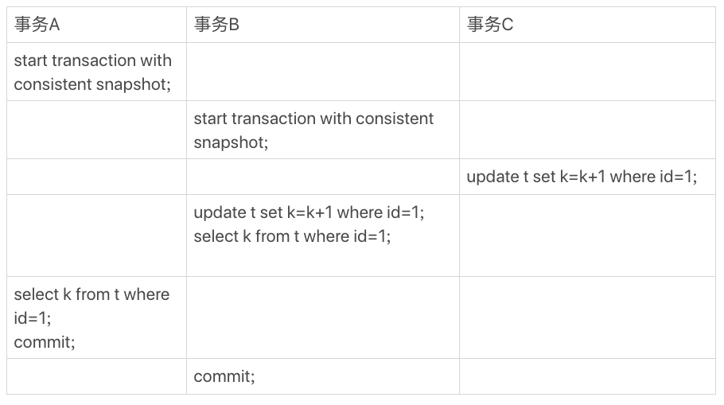
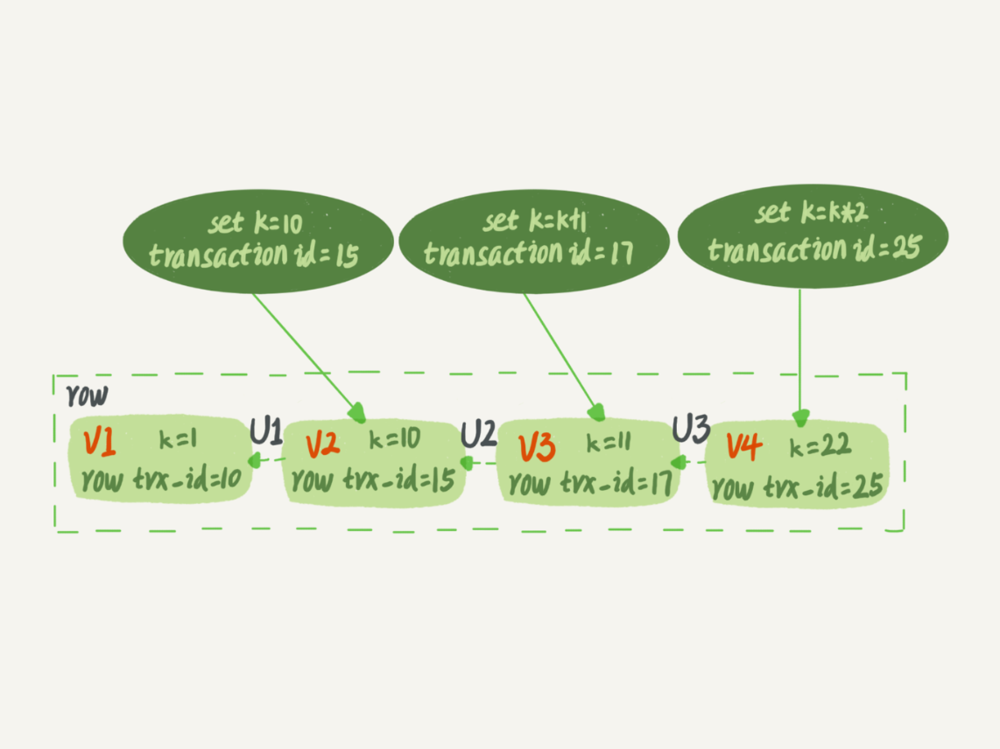
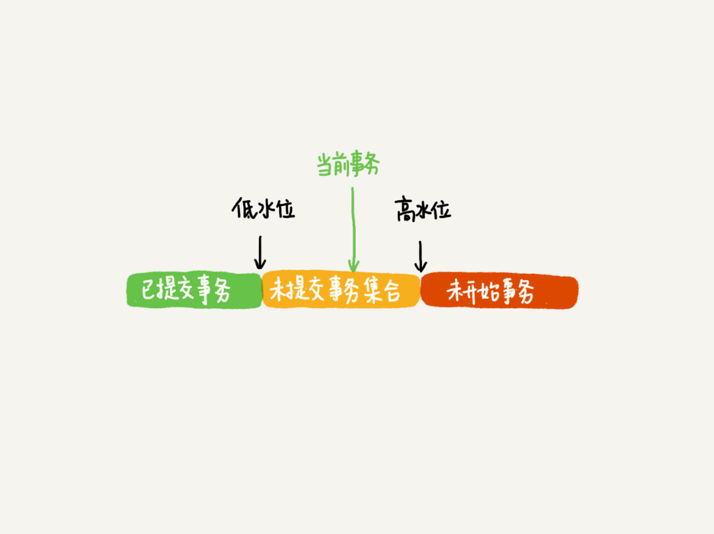
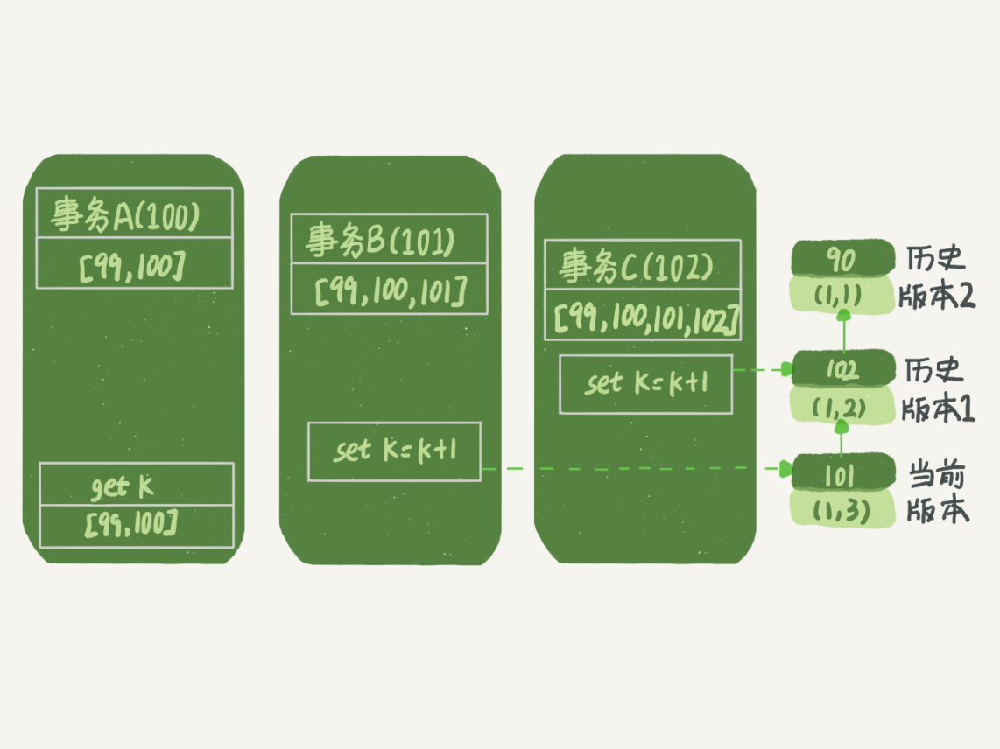
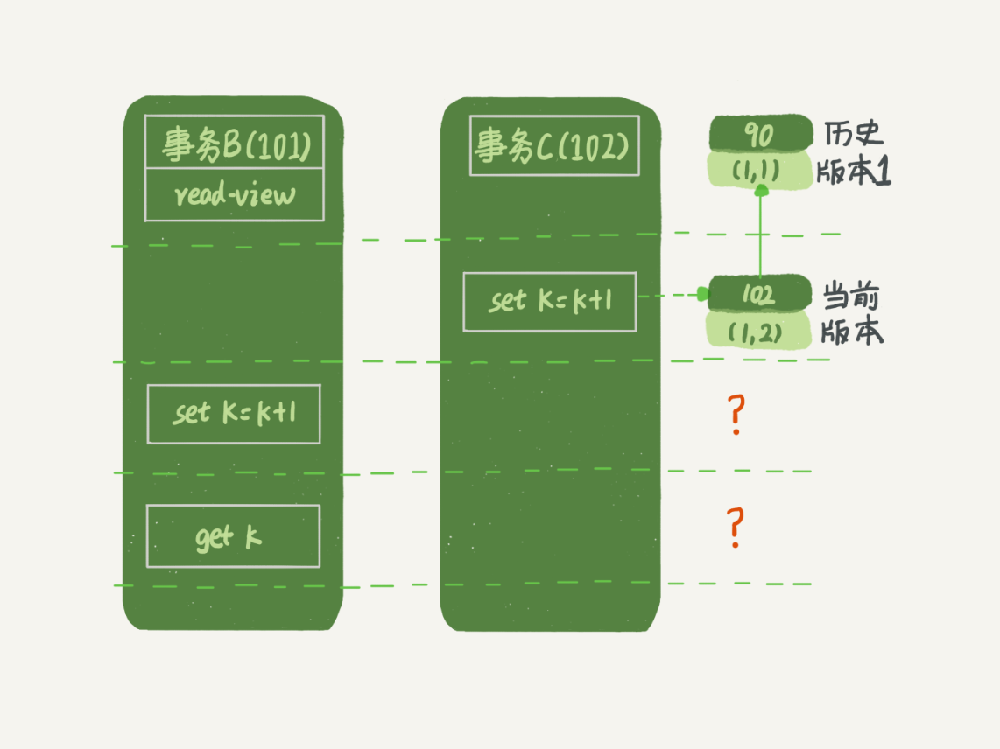
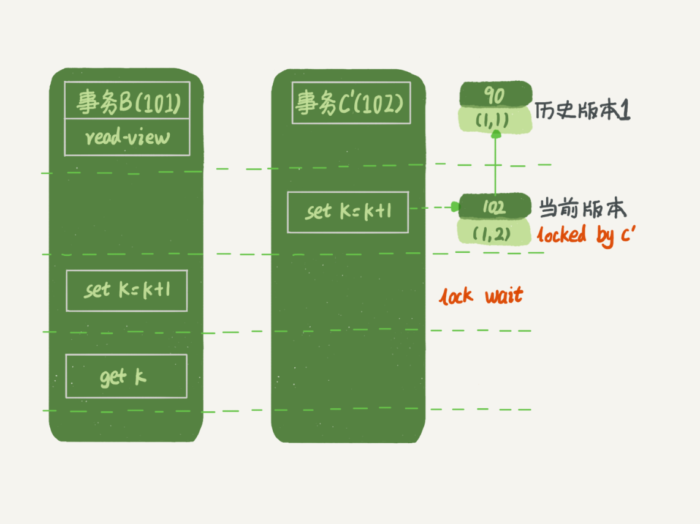
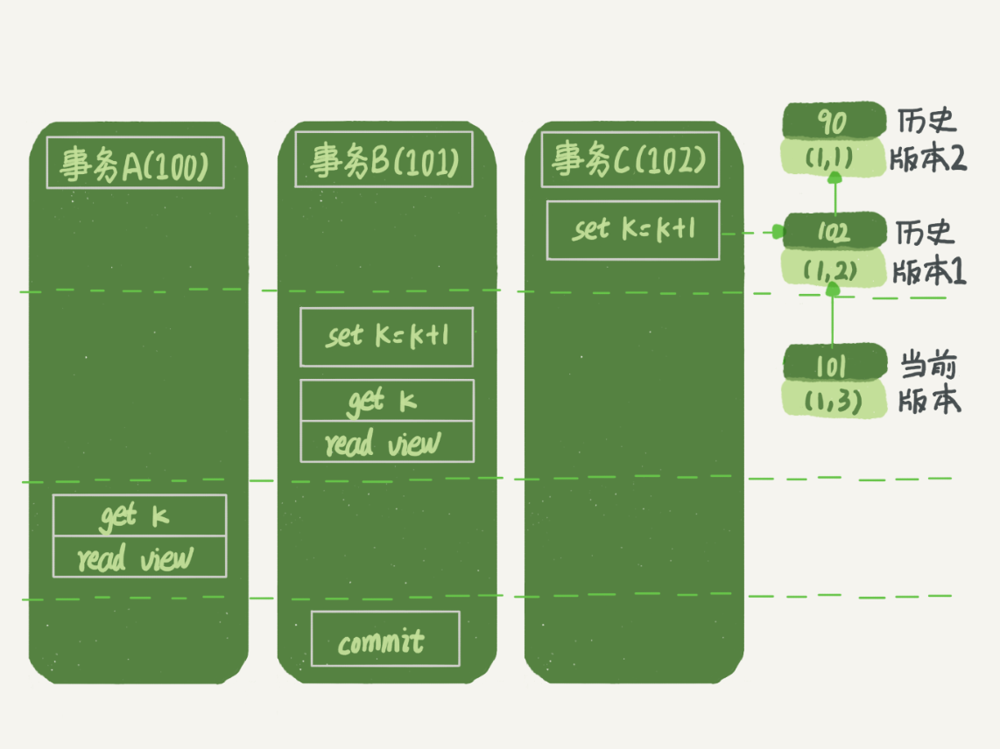
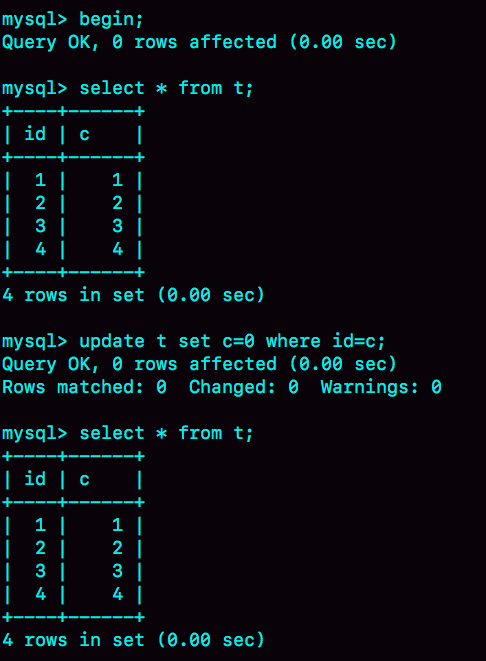

# 08讲事务到底是隔离的还是不隔离的

我在第3篇文章和你讲事务隔离级别的时候提到过，如果是可重复读隔离级别，事务T启动的时候会创建一个视图read-view，之后事务T执行期间，即使有其他事务修改了数据，事务T看到的仍然跟在启动时看到的一样。也就是说，一个在可重复读隔离级别下执行的事务，好像与世无争，不受外界影响。

但是，我在上一篇文章中，和你分享行锁的时候又提到，一个事务要更新一行，如果刚好有另外一个事务拥有这一行的行锁，它又不能这么超然了，会被锁住，进入等待状态。问题是，既然进入了等待状态，那么等到这个事务自己获取到行锁要更新数据的时候，它读到的值又是什么呢？

我给你举一个例子吧。下面是一个只有两行的表的初始化语句。

```
mysql> CREATE TABLE `t` (
  `id` int(11) NOT NULL,
  `k` int(11) DEFAULT NULL,
  PRIMARY KEY (`id`)
) ENGINE=InnoDB;
insert into t(id, k) values(1,1),(2,2);
```



图1 事务A、B、C的执行流程

这里，我们需要注意的是事务的启动时机。

begin/start transaction 命令并不是一个事务的起点，在执行到它们之后的第一个操作InnoDB表的语句（第一个快照读语句），事务才真正启动。如果你想要马上启动一个事务，可以使用start transaction with consistent snapshot 这个命令。

还需要注意的是，在整个专栏里面，我们的例子中如果没有特别说明，都是默认autocommit=1。

在这个例子中，事务C没有显式地使用begin/commit，表示这个update语句本身就是一个事务，语句完成的时候会自动提交。事务B在更新了行之后查询; 事务A在一个只读事务中查询，并且时间顺序上是在事务B的查询之后。

这时，如果我告诉你事务B查到的k的值是3，而事务A查到的k的值是1，你是不是感觉有点晕呢？

所以，今天这篇文章，我其实就是想和你说明白这个问题，希望借由把这个疑惑解开的过程，能够帮助你对InnoDB的事务和锁有更进一步的理解。

在MySQL里，有两个“视图”的概念：

- 一个是view。它是一个用查询语句定义的虚拟表，在调用的时候执行查询语句并生成结果。创建视图的语法是create view ... ，而它的查询方法与表一样。
- 另一个是InnoDB在实现MVCC时用到的一致性读视图，即consistent read view，用于支持RC（Read Committed，读提交）和RR（Repeatable Read，可重复读）隔离级别的实现。

它没有物理结构，作用是事务执行期间用来定义“我能看到什么数据”。

在第3篇文章[《事务隔离：为什么你改了我还看不见？》](https://time.geekbang.org/column/article/68963)中，我跟你解释过一遍MVCC的实现逻辑。今天为了说明查询和更新的区别，我换一个方式来说明，把read view拆开。你可以结合这两篇文章的说明来更深一步地理解MVCC。

# “快照”在MVCC里是怎么工作的？

在可重复读隔离级别下，事务在启动的时候就“拍了个快照”。注意，这个快照是基于整库的。

这时，你会说这看上去不太现实啊。如果一个库有100G，那么我启动一个事务，MySQL就要拷贝100G的数据出来，这个过程得多慢啊。可是，我平时的事务执行起来很快啊。

实际上，我们并不需要拷贝出这100G的数据。我们先来看看这个快照是怎么实现的。

InnoDB里面每个事务有一个唯一的事务ID，叫作transaction id。它是在事务开始的时候向InnoDB的事务系统申请的，是按申请顺序严格递增的。

而每行数据也都是有多个版本的。每次事务更新数据的时候，都会生成一个新的数据版本，并且把transaction id赋值给这个数据版本的事务ID，记为row trx_id。同时，旧的数据版本要保留，并且在新的数据版本中，能够有信息可以直接拿到它。

也就是说，数据表中的一行记录，其实可能有多个版本(row)，每个版本有自己的row trx_id。

如图2所示，就是一个记录被多个事务连续更新后的状态。



图2 行状态变更图

图中虚线框里是同一行数据的4个版本，当前最新版本是V4，k的值是22，它是被transaction id 为25的事务更新的，因此它的row trx_id也是25。

你可能会问，前面的文章不是说，语句更新会生成undo log（回滚日志）吗？那么，**undo log在哪呢？**

实际上，图2中的三个虚线箭头，就是undo log；而V1、V2、V3并不是物理上真实存在的，而是每次需要的时候根据当前版本和undo log计算出来的。比如，需要V2的时候，就是通过V4依次执行U3、U2算出来。

明白了多版本和row trx_id的概念后，我们再来想一下，InnoDB是怎么定义那个“100G”的快照的。

按照可重复读的定义，一个事务启动的时候，能够看到所有已经提交的事务结果。但是之后，这个事务执行期间，其他事务的更新对它不可见。

因此，一个事务只需要在启动的时候声明说，“以我启动的时刻为准，如果一个数据版本是在我启动之前生成的，就认；如果是我启动以后才生成的，我就不认，我必须要找到它的上一个版本”。

当然，如果“上一个版本”也不可见，那就得继续往前找。还有，如果是这个事务自己更新的数据，它自己还是要认的。

在实现上， InnoDB为每个事务构造了一个数组，用来保存这个事务启动瞬间，当前正在“活跃”的所有事务ID。“活跃”指的就是，启动了但还没提交。

数组里面事务ID的最小值记为低水位，当前系统里面已经创建过的事务ID的最大值加1记为高水位。

这个视图数组和高水位，就组成了当前事务的一致性视图（read-view）。

而数据版本的可见性规则，就是基于数据的row trx_id和这个一致性视图的对比结果得到的。

这个视图数组把所有的row trx_id 分成了几种不同的情况。



图3 数据版本可见性规则

这样，对于当前事务的启动瞬间来说，一个数据版本的row trx_id，有以下几种可能：

1. 如果落在绿色部分，表示这个版本是已提交的事务或者是当前事务自己生成的，这个数据是可见的；
2. 如果落在红色部分，表示这个版本是由将来启动的事务生成的，是肯定不可见的；
3. 如果落在黄色部分，那就包括两种情况
    a. 若 row trx_id在数组中，表示这个版本是由还没提交的事务生成的，不可见；
    b. 若 row trx_id不在数组中，表示这个版本是已经提交了的事务生成的，可见。

比如，对于图2中的数据来说，如果有一个事务，它的低水位是18，那么当它访问这一行数据时，就会从V4通过U3计算出V3，所以在它看来，这一行的值是11。

你看，有了这个声明后，系统里面随后发生的更新，是不是就跟这个事务看到的内容无关了呢？因为之后的更新，生成的版本一定属于上面的2或者3(a)的情况，而对它来说，这些新的数据版本是不存在的，所以这个事务的快照，就是“静态”的了。

所以你现在知道了，**InnoDB利用了“所有数据都有多个版本”的这个特性，实现了“秒级创建快照”的能力。**

接下来，我们继续看一下图1中的三个事务，分析下事务A的语句返回的结果，为什么是k=1。

这里，我们不妨做如下假设：

1. 事务A开始前，系统里面只有一个活跃事务ID是99；
2. 事务A、B、C的版本号分别是100、101、102，且当前系统里只有这四个事务；
3. 三个事务开始前，(1,1）这一行数据的row trx_id是90。

这样，事务A的视图数组就是[99,100], 事务B的视图数组是[99,100,101], 事务C的视图数组是[99,100,101,102]。

为了简化分析，我先把其他干扰语句去掉，只画出跟事务A查询逻辑有关的操作：



图4 事务A查询数据逻辑图

从图中可以看到，第一个有效更新是事务C，把数据从(1,1)改成了(1,2)。这时候，这个数据的最新版本的row trx_id是102，而90这个版本已经成为了历史版本。

第二个有效更新是事务B，把数据从(1,2)改成了(1,3)。这时候，这个数据的最新版本（即row trx_id）是101，而102又成为了历史版本。

你可能注意到了，在事务A查询的时候，其实事务B还没有提交，但是它生成的(1,3)这个版本已经变成当前版本了。但这个版本对事务A必须是不可见的，否则就变成脏读了。

好，现在事务A要来读数据了，它的视图数组是[99,100]。当然了，读数据都是从当前版本读起的。所以，事务A查询语句的读数据流程是这样的：

- 找到(1,3)的时候，判断出row trx_id=101，比高水位大，处于红色区域，不可见；
- 接着，找到上一个历史版本，一看row trx_id=102，比高水位大，处于红色区域，不可见；
- 再往前找，终于找到了（1,1)，它的row trx_id=90，比低水位小，处于绿色区域，可见。

这样执行下来，虽然期间这一行数据被修改过，但是事务A不论在什么时候查询，看到这行数据的结果都是一致的，所以我们称之为一致性读。

这个判断规则是从代码逻辑直接转译过来的，但是正如你所见，用于人肉分析可见性很麻烦。

所以，我来给你翻译一下。一个数据版本，对于一个事务视图来说，除了自己的更新总是可见以外，有三种情况：

1. 版本未提交，不可见；
2. 版本已提交，但是是在视图创建后提交的，不可见；
3. 版本已提交，而且是在视图创建前提交的，可见。

现在，我们用这个规则来判断图4中的查询结果，事务A的查询语句的视图数组是在事务A启动的时候生成的，这时候：

- (1,3)还没提交，属于情况1，不可见；
- (1,2)虽然提交了，但是是在视图数组创建之后提交的，属于情况2，不可见；
- (1,1)是在视图数组创建之前提交的，可见。

你看，去掉数字对比后，只用时间先后顺序来判断，分析起来是不是轻松多了。所以，后面我们就都用这个规则来分析。

# 更新逻辑

细心的同学可能有疑问了：**事务B的update语句，如果按照一致性读，好像结果不对哦？**

你看图5中，事务B的视图数组是先生成的，之后事务C才提交，不是应该看不见(1,2)吗，怎么能算出(1,3)来？



图5 事务B更新逻辑图

是的，如果事务B在更新之前查询一次数据，这个查询返回的k的值确实是1。

但是，当它要去更新数据的时候，就不能再在历史版本上更新了，否则事务C的更新就丢失了。因此，事务B此时的set k=k+1是在（1,2）的基础上进行的操作。

所以，这里就用到了这样一条规则：**更新数据都是先读后写的，而这个读，只能读当前的值，称为“当前读”（current read）。**

因此，在更新的时候，当前读拿到的数据是(1,2)，更新后生成了新版本的数据(1,3)，这个新版本的row trx_id是101。

所以，在执行事务B查询语句的时候，一看自己的版本号是101，最新数据的版本号也是101，是自己的更新，可以直接使用，所以查询得到的k的值是3。

这里我们提到了一个概念，叫作当前读。其实，除了update语句外，select语句如果加锁，也是当前读。

所以，如果把事务A的查询语句select * from t where id=1修改一下，加上lock in share mode 或 for update，也都可以读到版本号是101的数据，返回的k的值是3。下面这两个select语句，就是分别加了读锁（S锁，共享锁）和写锁（X锁，排他锁）。

```
mysql> select k from t where id=1 lock in share mode;
mysql> select k from t where id=1 for update;
```

再往前一步，假设事务C不是马上提交的，而是变成了下面的事务C’，会怎么样呢？


图6 事务A、B、C'的执行流程

事务C’的不同是，更新后并没有马上提交，在它提交前，事务B的更新语句先发起了。前面说过了，虽然事务C’还没提交，但是(1,2)这个版本也已经生成了，并且是当前的最新版本。那么，事务B的更新语句会怎么处理呢？

这时候，我们在上一篇文章中提到的“两阶段锁协议”就要上场了。事务C’没提交，也就是说(1,2)这个版本上的写锁还没释放。而事务B是当前读，必须要读最新版本，而且必须加锁，因此就被锁住了，必须等到事务C’释放这个锁，才能继续它的当前读。



图7 事务B更新逻辑图（配合事务C'）

到这里，我们把一致性读、当前读和行锁就串起来了。

现在，我们再回到文章开头的问题：**事务的可重复读的能力是怎么实现的？**

可重复读的核心就是一致性读（consistent read）；而事务更新数据的时候，只能用当前读。如果当前的记录的行锁被其他事务占用的话，就需要进入锁等待。

而读提交的逻辑和可重复读的逻辑类似，它们最主要的区别是：

- 在可重复读隔离级别下，只需要在事务开始的时候创建一致性视图，之后事务里的其他查询都共用这个一致性视图；
- 在读提交隔离级别下，每一个语句执行前都会重新算出一个新的视图。

那么，我们再看一下，在读提交隔离级别下，事务A和事务B的查询语句查到的k，分别应该是多少呢？

这里需要说明一下，“start transaction with consistent snapshot; ”的意思是从这个语句开始，创建一个持续整个事务的一致性快照。所以，在读提交隔离级别下，这个用法就没意义了，等效于普通的start transaction。

下面是读提交时的状态图，可以看到这两个查询语句的创建视图数组的时机发生了变化，就是图中的read view框。（注意：这里，我们用的还是事务C的逻辑直接提交，而不是事务C’）



图8 读提交隔离级别下的事务状态图

这时，事务A的查询语句的视图数组是在执行这个语句的时候创建的，时序上(1,2)、(1,3)的生成时间都在创建这个视图数组的时刻之前。但是，在这个时刻：

- (1,3)还没提交，属于情况1，不可见；
- (1,2)提交了，属于情况3，可见。

所以，这时候事务A查询语句返回的是k=2。

显然地，事务B查询结果k=3。

# 小结

InnoDB的行数据有多个版本，每个数据版本有自己的row trx_id，每个事务或者语句有自己的一致性视图。普通查询语句是一致性读，一致性读会根据row trx_id和一致性视图确定数据版本的可见性。

- 对于可重复读，查询只承认在事务启动前就已经提交完成的数据；
- 对于读提交，查询只承认在语句启动前就已经提交完成的数据；

而当前读，总是读取已经提交完成的最新版本。

你也可以想一下，为什么表结构不支持“可重复读”？这是因为表结构没有对应的行数据，也没有row trx_id，因此只能遵循当前读的逻辑。

当然，MySQL 8.0已经可以把表结构放在InnoDB字典里了，也许以后会支持表结构的可重复读。

又到思考题时间了。我用下面的表结构和初始化语句作为试验环境，事务隔离级别是可重复读。现在，我要把所有“字段c和id值相等的行”的c值清零，但是却发现了一个“诡异”的、改不掉的情况。请你构造出这种情况，并说明其原理。

```
mysql> CREATE TABLE `t` (
  `id` int(11) NOT NULL,
  `c` int(11) DEFAULT NULL,
  PRIMARY KEY (`id`)
) ENGINE=InnoDB;
insert into t(id, c) values(1,1),(2,2),(3,3),(4,4);
```


复现出来以后，请你再思考一下，在实际的业务开发中有没有可能碰到这种情况？你的应用代码会不会掉进这个“坑”里，你又是怎么解决的呢？

你可以把你的思考和观点写在留言区里，我会在下一篇文章的末尾和你讨论这个问题。感谢你的收听，也欢迎你把这篇文章分享给更多的朋友一起阅读。

# 上期问题时间

我在上一篇文章最后，留给你的问题是：怎么删除表的前10000行。比较多的留言都选择了第二种方式，即：在一个连接中循环执行20次 delete from T limit 500。

确实是这样的，第二种方式是相对较好的。

第一种方式（即：直接执行delete from T limit 10000）里面，单个语句占用时间长，锁的时间也比较长；而且大事务还会导致主从延迟。

第三种方式（即：在20个连接中同时执行delete from T limit 500），会人为造成锁冲突。

评论区留言点赞板：

> @Tony Du的评论，详细而且准确。
> @Knight^2o^1 提到了如果可以加上特定条件，将这10000行天然分开，可以考虑第三种。是的，实际上在操作的时候我也建议你尽量拿到ID再删除。
> @荒漠甘泉 提了一个不错的问题，大家需要区分行锁、MDL锁和表锁的区别。对InnoDB表更新一行，可能过了MDL关，却被挡在行锁阶段。


## 精选留言

- 

    夏日雨

    老师你好，有个问题不太理解，对于文中的例子假设transaction id为98的事务在事务A执行select（Q2）之前更新了字段，那么事务A发现这个字段的row trx_id是98，比自己的up_limit_id要小，那此时事务A不就获取到了transaction id为98的事务更新后的值了吗？
    换句话说对于文中"之后的更新，产生的新的数据版本的 row trx_id 都会大于 up_limit_id"这句话不太理解， up_limit_id是已经提交事务id的最大值，那也可能存在一个没有提交的id小于up_limit_id的事务对数据进行更新？还是说transaction id比up_limit_id小的事务都是保证已经提交的？

    2018-11-30 15:01

    作者回复

    你的问题被引用最多，我回复你哈，其它同学看过来

    好吧，今天的课后问题其实比较简单，本来是隐藏在思考题里的彩蛋，被你问出来了哈。

    Innodb 要保证这个规则：事务启动以前所有还没提交的事务，它都不可见。

    但是只存一个已经提交事务的最大值是不够的。 因为存在一个问题，那些比最大值小的事务，之后也可能更新（就是你说的98这个事务）

    所以事务启动的时候还要保存“现在正在执行的所有事物ID列表”，如果一个row trx_id在这列表中，也要不可见。

    虽然踩破了彩蛋，还是赞你的思考哈，置顶让大家学习

    2018-11-30 23:49

- 

    约书亚

    早。
    思考题，RR下，用另外一个事物在update执行之前，先把所有c值修改，应该就可以。比如update t set c = id + 1。
    这个实际场景还挺常见——所谓的“乐观锁”。时常我们会基于version字段对row进行cas式的更新，类似update ...set ... where id = xxx and version = xxx。如果version被其他事务抢先更新，则在自己事务中更新失败，trx_id没有变成自身事务的id，同一个事务中再次select还是旧值，就会出现“明明值没变可就是更新不了”的“异象”（anomaly）。解决方案就是每次cas更新不管成功失败，结束当前事务。如果失败则重新起一个事务进行查询更新。
    记得某期给老师留言提到了，似乎只有MySQL是在一致性视图下采用这种宽松的update机制。也许是考虑易用性吧。其他数据库大多在内部实现cas，只是失败后下一步动作有区别。

    2018-11-30 08:19

    作者回复

    早

    赞

    置顶了

    明天课后问题时间直接指针引用了哈

    补充一下：上面说的“如果失败就重新起一个事务”，里面判断是否成功的标准是 affected_rows 是不是等于预期值。
    比如我们这个例子里面预期值本来是4，当然实际业务中这种语句一般是匹配唯一主键，所以预期住值一般是1。

    

    2018-11-30 08:30

- 

    ithunter

    请教一个问题，业务上有这样的需求，A、B两个用户，如果互相喜欢，则成为好友。设计上是有两张表，一个是like表，一个是friend表，like表有user_id、liker_id两个字段，我设置为复合唯一索引即uk_user_id_liker_id。语句执行顺序是这样的：
    以A喜欢B为例：
    1、先查询对方有没有喜欢自己（B有没有喜欢A）
    select * from like where user_id = B and liker_id = A
    2、如果有，则成为好友
    insert into friend
    3、没有，则只是喜欢关系
    insert into like

    如果A、B同时喜欢对方，会出现不会成为好友的问题。因为上面第1步，双方都没喜欢对方。第1步即使使用了排他锁也不行，因为记录不存在，行锁无法生效。请问这种情况，在mysql锁层面有没有办法处理

    2018-12-05 16:51

    作者回复

    你这个问题很有趣。我想到一个不错的解法。不过我先置顶。让别的同学来回答看看。

    好问题，谁有想法po出来。

    2018-12-06 00:36

- 

    心雨鑫晴

    老师，我有一个问题。当开启事务时，需要保存活跃事务的数组（A），然后获取高水位（B）。我的疑问就是，在这两个动作之间（A和B之间）会不会产生新的事务？如果产生了新的事务，那么这个新的事务相对于当前事务就是可见的，不管有没有提交。

    2018-12-03 19:28

    作者回复

    好问题，有很深入的思考哈

    代码实现上，获取视图数组和高水位是在事务系统的锁保护下做的，可以认为是原子操作，期间不能创建事务。

    2018-12-04 03:43

- 

    Leo

    老师在文中说: "所以，在执行事务 B 的 Q1 语句的时候，一看自己的版本号是 101，最新数据的版本号也是 101，可以用，所以 Q1 得到的 k 的值是 3。"，
    \1. 这里不参考up_limit_id了吗？
    \2. 如果参考，事务B的up_limit_id是在执行update语句前重新计算的，还是在执行Q1语句前重新计算的？

    

    2018-11-30 07:36

    作者回复

    \1. 判断可见性两个规则：一个是up_limit_id ,另一个是“自己修改的”；这里用到第二个规则

    \2. 这时候事务Bup_limit_id还是99

    2018-11-30 08:09

- 

    阿建

    以下是一个错误的理解，在编写评论的过程中用前面刚学到的知识把自己的结论推翻，有一种快感，所以还是决定发出来。 哈哈~

    事务A(100) | 事务B(101)
    \-------------------
    | select(1)
    \-------------------
    | update
    \-------------------
    update |
    \-------------------
    | select(2)
    \-------------------
    事务A B在事务启动时的up_limit_id为99
    事务B update 之后表格的每一行的row_trx_id变为101
    事务A 再update 之后每一行的row_trx_id变为100
    事务B的select(2)时因为隔离级别是RR，所以去遍历的时候找row_trx_id<=101的版本返回，优先找到版本为100的，就会导致select(2)并没有取到自己的更新。
    对于对于自己的修改也认这句话和undo-log的介绍，我觉的这种情况下会获取不到自己更新的最新的数据。不知道我理解的对不对。

    不对！因为事务A的update是会被行锁锁住的，而且锁是要在事务B结束之后才释放，所以不存在在事务B的update之后还在事务中被事务A给更新，导致上面的问题。

    2018-11-30 21:00

    作者回复

    

    我在学习过程中也是最喜欢这种“自己推翻自己结论”的快感

    2018-11-30 22:46

- 

    墨萧

    可重复读情况下，事务c的102早于事务b的101，如果事务c再get k，那不是就取得101的值了？不太明白。

    2018-11-30 07:38

    作者回复

    咱们例子里面，事务C是直接提交的，再执行一个GET 就是另外一个事务了…

    如果你说的是用begin 来启动一个多语句事务，那么事务c在更新后查询，还是看到row trx_id是102的。 【注意：如果它还没提交，101根本生成不出来，因为事务B被行锁挡着呢】

    2018-11-30 08:13

- 

    某、人

    这篇理论知识很丰富,需要先总结下
    1.innodb支持RC和RR隔离级别实现是用的一致性视图(consistent read view)

    2.事务在启动时会拍一个快照,这个快照是基于整个库的.
    基于整个库的意思就是说一个事务内,整个库的修改对于该事务都是不可见的(对于快照读的情况)
    如果在事务内select t表,另外的事务执行了DDL t表,根据发生时间,要嘛锁住要嘛报错(参考第六章)

    3.事务是如何实现的MVCC呢?
    (1)每个事务都有一个事务ID,叫做transaction id(严格递增)
    (2)事务在启动时,找到已提交的最大事务ID记为up_limit_id。
    (3)事务在更新一条语句时,比如id=1改为了id=2.会把id=1和该行之前的row trx_id写到undo log里,
    并且在数据页上把id的值改为2,并且把修改这条语句的transaction id记在该行行头
    (4)再定一个规矩,一个事务要查看一条数据时,必须先用该事务的up_limit_id与该行的transaction id做比对,
    如果up_limit_id>=transaction id,那么可以看.如果up_limit_id<transaction id,则只能去undo log里去取。去undo log查找数据的时候,也需要做比对,必须up_limit_id>transaction id,才返回数据

    4.什么是当前读,由于当前读都是先读后写,只能读当前的值,所以为当前读.会更新事务内的up_limit_id为该事务的transaction id

    5.为什么rr能实现可重复读而rc不能,分两种情况
    (1)快照读的情况下,rr不能更新事务内的up_limit_id,
    而rc每次会把up_limit_id更新为快照读之前最新已提交事务的transaction id,则rc不能可重复读
    (2)当前读的情况下,rr是利用record lock+gap lock来实现的,而rc没有gap,所以rc不能可重复读

    2018-11-30 16:45

    作者回复

    

    本篇知识点全get

    2018-12-01 09:45

- 

    Eric

    我不是dba，这个课程还是需要一些基础才会更有帮助，有些章节对我来说确实看起来有些吃力，但是在坚持，一遍看不懂看两遍、三遍，同时查漏补缺的去找一些资料补充盲点，还组了个一起学习的群，希望能坚持下去，收获满满

    2018-11-30 10:29

    作者回复

    赞
    慢慢来

    2018-11-30 11:44

- 

    lucky star

    答案：
    分析： 假设有两个事务A和B， 且A事务是更新c=0的事务； 给定条件： 1， 事务A update 语句已经执行成功， 说明没有另外一个活动中的事务在执行修改条件为id in 1,2,3,4或c in 1,2,3,4, 否则update会被锁阻塞； 2，事务A再次执行查询结果却是一样， 说明什么？说明事务B把id或者c给修改了， 而且已经提交了， 导致事务A“当前读”没有匹配到对应的条件； 事务A的查询语句说明了事务B执行更新后，提交事务B一定是在事务A第一条查询语句之后执行的；

    所以执行顺序应该是：
    1， 事务A select * from t;
    2, 事务B update t set c = c + 4; // 只要c或者id大于等于5就行; 当然这行也可以和1调换， 不影响
    3, 事务B commit;
    4, 事务A update t set c = 0 where id = c; // 当前读； 此时已经没有匹配的行
    5， 事务A select * from t;

    读完第三篇后就陷入了事务执行原理的泥潭中了， 也找了不少相关资料， 但总感觉还不是特别明白， 今天看完这篇终于茅塞顿开呀， 仿佛打通了任督二脉了。。。。

    

    2018-12-15 23:21

    作者回复

    嗯嗯，分析得很对。

    茅塞顿开的感觉很好，恭喜

    2018-12-16 02:05

- 

    老师您好：
    今天重新看了一下这章您的修改地方，有个地方不明白
    落在黄色区域未提交事务集合部分怎么还要分类，低水位+高水位不就是这个数组了吗，之前说，这个数组是记录事务启动瞬间，所有已经启动还未提交的事务ID，那不应该是未提交的事务吗，不就应该是不可读的吗
    之前说的是启动时会获取一个最大row trx_id，所有大于这个id都不认，这个id肯定是已经提交了的事务的才对啊，这个id不才应该是数组的高水位吗，这里有点懵了

    2018-12-03 18:49

    作者回复

    你设计一个“比低水位大，但是在当前事务启动前，就已经提交了的例子

    2018-12-03 22:02

- 

    薛畅

    评论区的好多留言都认为 up_limit_id 是已经提交事务 id 的最大值，但是老师并未指出有何不对，这让我很困惑。
    老师在第二版的文章中通篇未提 up_limit_id，但是文章中有这么一段话：“InnoDB 为每个事务构造了一个数组，用来保存这个事务启动启动瞬间，当前正在“活跃”的所有事务 ID。“活跃”指的就是，启动了但还没提交。数组里面事务 ID 的最小值记为低水位，当前系统里面已经创建过的事务 ID 的最大值加 1 记为高水位”。那么这个 up_limit_id 指的是不是数组里面事务 ID 的最小值，假如是的话，那么 up_limit_id 并不是已经提交事务 id 的最大值，而是活跃事物的最小值。

    2018-12-03 13:49

    作者回复

    在这版里面就是用“低水位”来作为活跃的最小ID的概念，

    嗯其实是为了理解原理，用了不同的表述方式哈。

    后面发现上一版的描述方法太公式化了，不利于人工分析

    2018-12-03 14:11

- 

    qpm

    这是典型的“丢失更新”问题。一个事务的更新操作被另外一个事务的更新操作覆盖。在RR状态下，普通select的时候是会获得旧版本数据的，但是update的时候就检索到最新的数据。
    解决方法：在读取的过程中设置一个排他锁，在 begin 事务里， select 语句中增加 for update 后缀，这样可以保证别的事务在此事务完成commit前无法操作记录。参考《MySQL技术内幕 InnoDB存储引擎》

    2018-12-01 00:35

- 

    york

    思考题为何我做出来成功修改为0了啊？

    2018-11-30 12:44

    作者回复

    那就是没复现

    2018-12-01 10:05

- 

    Sinyo

    原来在同一行数据，最新版本的 row trx_id 是可能会小于旧版本的 row trx_id的，这里才搞明白(惭愧脸)。。

    2018-12-07 10:05

    作者回复

    赞，这个想通的感觉是很爽的

    2018-12-07 11:23

- 

    Sawyer

    简单的总结一下：
    \1. 一致性识图，保证了当前事务从启动到提交期间，读取到的数据是一致的（包括当前事务的修改）。
    \2. 当前读，保证了当前事务修改数据时，不会丢失其他事务已经提交的修改。
    \3. 两阶段锁协议，保证了当前事务修改数据时，不会丢失其他事务未提交的修改。
    \4. RR是通过事务启动时创建一致性识图来实现，RC是语句执行时创建一致性识图来实现。

    2018-12-03 14:10

- 

    WL

    想请教一下老师, 在数据可见性规则那一部分中的第三种可能的b情况: "若 row trx_id 不在数组中，表示这个版本是已经提交了的事务生成的，可见。"对于这部分内容我开始不是很理解, 后来反复思考了一下, 可见性规则这部分是不是在说明这种情况: 因为数据的row trx_id是依次递增的, 但是事务由于创建和提交的时间不可预期所以transactionId可能是跳跃的, 所以假如有事务A, 比A的transactionId大的数据的row trx_id对于事务A一定不可见, 但是比A的transactionId小的数据的row trx_id也可能在A的事务数组中, 所以要判断一次. 不知道这么理解对不对?

    2018-12-08 14:54

    作者回复

    是的，最后这个“可能”说得很好，
    可能在，也可能不在，就用“是否在数组中”来判断

    2018-12-09 13:31

- 

    信信

    老师您好，有处疑问，文中说：“对于图 2 中的数据来说，如果有一个事务，它的低水位是 18，那么当它访问这一行数据时，就会从 V4 通过 U3 计算出 V3。”看上去像是一定会取小于低水位的值。那假如我的事务id是27，活跃数组是18，19，26，这样的话事务id为25的数据我也认呀。恳请老师解惑。

    2018-12-04 00:27

- 

    Mr.Strive.Z.H.L

    这个必须要单独回复一下老师：
    我的所有留言老师都一一回复，问题全部都解释的很清楚。在学校其实mysql用的非常简单，真的要说一下这个课实在太好了，把原理讲得简单易懂，并且评论里的讨论加深了自己的认知。
    所以真的很感谢老师~~感谢感谢

    2018-12-12 12:03

    作者回复

    也谢谢你，说明你的问题质量高哦。

    其实我没有回复大家所有的评论，
    不过问得认真详细的、又跟其他同学问题不重复的问题，我会尽量全部回复，

    因为把问题问清楚本身是要花心思的，不能辜负呀

    

    2018-12-12 18:04

- 

    阿狸爱JAVA

    只是理解一下这感觉身体被掏空，如果为我自己去实现这样的功能，我只想静静，何况我看到的只是冰山一角。不得不说很佩服

    2018-12-12 12:00