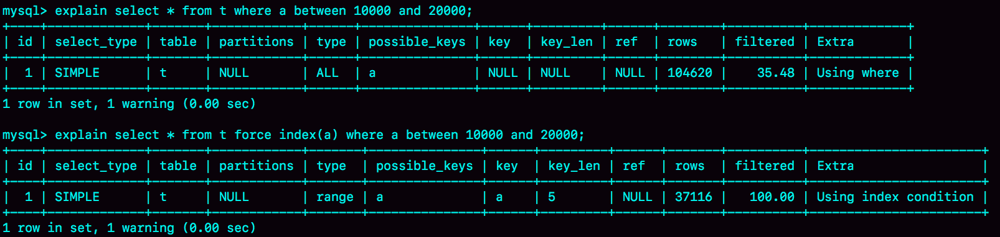
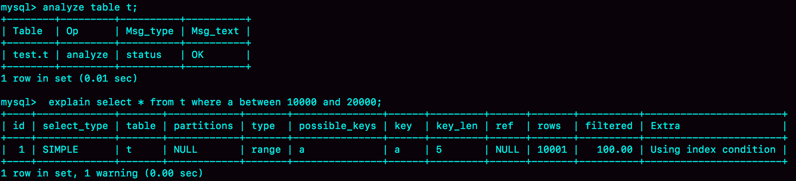
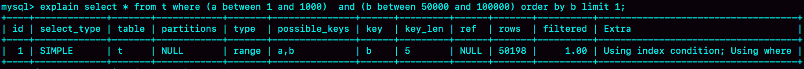
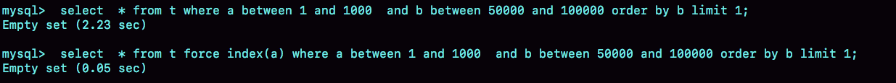
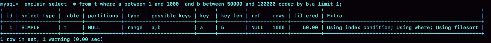
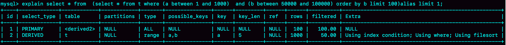

# 10讲MySQL为什么有时候会选错索引

在 MySQL 中一张表其实是可以支持多个索引的。但是，你写 SQL 语句的时候，并没有主动指定使用哪个索引。也就是说，使用哪个索引是由 MySQL 来确定的。

但是一条本来可以执行得很快的语句，却可能由于 MySQL 选错了索引，而导致执行速度变得很慢？

我们先建一个简单的表，表里有 a、b 两个字段，并分别建上索引：

```mysql
CREATE TABLE `t` (
  `id` int(11) NOT NULL,
  `a` int(11) DEFAULT NULL,
  `b` int(11) DEFAULT NULL,
  PRIMARY KEY (`id`),
  KEY `a` (`a`),
  KEY `b` (`b`)
) ENGINE=InnoDB;
```

然后，我们往表 t 中插入 10 万行记录，取值按整数递增，即：(1,1,1)，(2,2,2)，(3,3,3) 直到(100000,100000,100000)。

我是用存储过程来插入数据的，这里我贴出来方便你复现：

```mysql
delimiter ;;
create procedure idata()
begin
  declare i int;
  set i=1;
  while(i<=100000)do
    insert into t values(i, i, i);
    set i=i+1;
  end while;
end;;
delimiter ;
call idata();
```

接下来，我们分析一条 SQL 语句：

```mysql
mysql> explain select * from t where a between 10000 and 20000;
+-+--------+-------+---------+-----+-------------+----+----+----+-----+------+--------+
|id|select_type|table|partitions|type|possible_keys|key|key_len|ref|rows|filtered|Extra|
+-+--------+-------+---------+-----+-------------+----+----+----+-----+------+--------+
|1|SIMPLE  |t  | NULL  | range | a   | a  |5   |NULL|10001|100.00| Using index condition |
+-+--------+-------+---------+-----+-------------+----+----+----+-----+------+--------+
1 row in set, 1 warning (0.00 sec)
```

从这条查询语句的执行也确实符合预期，key 这个字段值是’a’，表示优化器选择了索引 a。

在我们已经准备好的包含了 10 万行数据的表上，我们再做如下操作。

| Session A                                   | Session B                                                |
| ------------------------------------------- | -------------------------------------------------------- |
| start transaction with consistent snapshot; |                                                          |
|                                             | delete from t;<br />call idata();                        |
|                                             | explain select * from t where a between 10000 and 20000; |
| commit;                                     |                                                          |

图 2 session A 和session B 的执行流程

session A开启了一个事务。随后，session B 把数据都删除后，又调用了 idata 这个存储过程，插入了 10 万行数据。

这时候，session B 的查询语句 `select * from t where a between 10000 and 20000` 就不会再选择索引 a 了。我们可以通过慢查询日志（slow log）来查看一下具体的执行情况。

```mysql
mysql> explain select * from t where a between 10000 and 20000;
+-+--------+-------+---------+-----+-------------+----+----+----+-----+------+--------+
|id|select_type|table|partitions|type|possible_keys|key|key_len|ref|rows|filtered|Extra|
+-+--------+-------+---------+-----+-------------+----+----+----+-----+------+--------+
|1|SIMPLE  |t  | NULL  | ALL | a   | NULL  |NULL   |NULL|30106|33.22| Using where |
+-+--------+-------+---------+-----+-------------+----+----+----+-----+------+--------+
1 row in set, 1 warning (0.01 sec)
```

为了说明优化器选择的结果是否正确，我增加了一个对照，即：使用 force index(a) 来让优化器强制使用索引 a。

下面的三条SQL语句，就是这个实验过程。

```mysql
set long_query_time=0;
select * from t where a between 10000 and 20000; /*Q1*/
select * from t force index(a) where a between 10000 and 20000;/*Q2*/
```

- 第一句，是将慢查询日志的阈值设置为 0，表示这个线程接下来的语句都会被记录入慢查询日志中；
- 第二句，Q1 是 session B 原来的查询；
- 第三句，Q2 是加了 force index(a) 来和 session B 原来的查询语句执行情况对比。

如图 3 所示是这三条 SQL 语句执行完成后的慢查询日志。

> 通过  show variables like "%slow_query_log_file%";  查看慢日志的位置

```mysql
# Time: 2022-10-13T15:33:45.668727Z
# User@Host: root[root] @ localhost [::1]  Id:     4
# Query_time: 0.041032  Lock_time: 0.000087 Rows_sent: 10001  Rows_examined: 100000
SET timestamp=1665675225;
select * from t where a between 10000 and 20000;

# Time: 2022-10-13T15:33:57.423743Z
# User@Host: root[root] @ localhost [::1]  Id:     4
# Query_time: 0.012959  Lock_time: 0.000099 Rows_sent: 10001  Rows_examined: 10001
SET timestamp=1665675237;
select * from t force index(a) where a between 10000 and 20000;
```

图3 slow log结果

可以看到，Q1 扫描了 10 万行，显然是走了全表扫描，执行时间是 40 毫秒。Q2 扫描了 10001 行，执行了 21 毫秒。也就是说，我们在没有使用 force index 的时候，MySQL 用错了索引，导致了更长的执行时间。

这个例子对应的是我们平常不断地删除历史数据和新增数据的场景。这时，MySQL 竟然会选错索引，是不是有点奇怪呢？今天，我们就从这个奇怪的结果说起吧。

## 一、优化器的逻辑

选择索引是优化器的工作，而优化器选择索引的目的，是找到一个最优的执行方案，并用最小的代价去执行语句。在数据库里面，扫描行数是影响执行代价的因素之一。扫描的行数越少，意味着访问磁盘数据的次数越少，消耗的 CPU 资源越少。

当然，**扫描行数并不是唯一的判断标准，优化器还会结合是否使用临时表、是否排序等因素进行综合判断**。

我们这个简单的查询语句并没有涉及到临时表和排序，所以 MySQL 选错索引肯定是在判断扫描行数的时候出问题了。

**扫描行数的判断逻辑如下：**

MySQL 在真正开始执行语句之前，并不能精确地知道满足这个条件的记录有多少条，而只能根据统计信息来估算记录数。

这个统计信息就是索引的“区分度”。显然，一个索引上不同的值越多，这个索引的区分度就越好。而一个索引上不同的值的个数，我们称之为“基数”（cardinality）。即基数越大，索引的区分度越好。

可以使用 `show index` 方法，看到一个索引的基数。虽然这个表的每一行的三个字段值都是一样的，但是在统计信息中，这三个索引的基数值并不同，而且其实都不准确。

```mysql
mysql> show index from t;
+-------+------------+----------+--------------+-------------+-----------+-------------+----------+--------+------+------------+---------+---------------+
| Table | Non_unique | Key_name | Seq_in_index | Column_name | Collation | Cardinality | Sub_part | Packed | Null | Index_type | Comment | Index_comment |
+-------+------------+----------+--------------+-------------+-----------+-------------+----------+--------+------+------------+---------+---------------+
| t     |          0 | PRIMARY  |            1 | id          | A         |       29107 |     NULL | NULL   |      | BTREE      |         |               |
| t     |          1 | a        |            1 | a           | A         |       28516 |     NULL | NULL   | YES  | BTREE      |         |               |
| t     |          1 | b        |            1 | b           | A         |       29248 |     NULL | NULL   | YES  | BTREE      |         |               |
+-------+------------+----------+--------------+-------------+-----------+-------------+----------+--------+------+------------+---------+---------------+
3 rows in set (0.00 sec)
```

**MySQL 使用采样统计的方法得到索引的基数**

> 因为把整张表取出来一行行统计，虽然可以得到精确的结果，但是代价太高了，所以只能选择“采样统计”。

采样统计的时候，InnoDB 默认会选择 N 个数据页，统计这些页面上的不同值，得到一个平均值，然后乘以这个索引的页面数，就得到了这个索引的基数。

而数据表是会持续更新的，索引统计信息也不会固定不变。所以，当变更的数据行数超过 1/M 的时候，会自动触发重新做一次索引统计。

在 MySQL 中，有两种存储索引统计的方式，可以通过设置参数 `innodb_stats_persistent` 的值来选择：

- 设置为 on 的时候（默认），表示统计信息会持久化存储。这时，默认的 N 是 20，M 是 10。
- 设置为 off 的时候，表示统计信息只存储在内存中。这时，默认的 N 是 8，M 是 16。

由于是采样统计，所以不管 N 是 20 还是 8，这个基数都是很容易不准的。

但是表中这次的索引统计值（cardinality列）虽然不够精确，但大体上还是差不多的，选错索引一定还有别的原因。

其实索引统计只是一个输入，对于一个具体的语句来说，优化器还要判断，执行这个语句本身要扫描多少行。

接下来，我们再一起看看优化器预估的，这两个语句的扫描行数是多少。



**rows 这个字段表示的是预计扫描行数**。

其中，Q1 的结果还是符合预期的，rows 的值是 104620；但是 Q2 的 rows 值是37116，偏差就大了。而图 1 中我们用explain 命令看到的 rows 是只有 10001 行，是这个偏差误导了优化器的判断。

- 问题一：优化器为什么放着扫描 37000 行的执行计划不用，却选择了扫描行数是 100000 的执行计划呢？

  因为，如果使用索引 a，每次从索引 a 上拿到一个值，都要回到主键索引上查出整行数据，这个代价优化器也要算进去的。而如果选择扫描10万行，是直接在主键索引上扫描的，没有额外的代价。

  优化器会估算这两个选择的代价，从结果看来，优化器认为直接扫描主键索引更快。当然，从执行时间看来，这个选择并不是最优的。

  使用普通索引需要把回表的代价算进去，在图 1 执行 explain 的时候，也考虑了这个策略的代价 ，但图1的选择是对的。也就是说，这个策略并没有问题。

所以冤有头债有主，MySQL选错索引，这件事儿还得归咎到没能准确地判断出扫描行数。至于为什么会得到错误的扫描行数，这个原因就作为课后问题，留给你去分析了。

既然是统计信息不对，那就修正。analyze table t 命令，可以用来重新统计索引信息。执行结果如图，是对的。



所以在实践中，如果发现 explain 的结果预估的 rows 值跟实际情况差距比较大，可以采用这个方法来处理。

其实，如果只是索引统计不准确，通过 analyze 命令可以解决很多问题，但是前面我们说了，优化器可不止是看扫描行数。

依然是基于这个表 t，我们看看另外一个语句：

```mysql
mysql> select * from t where (a between 1 and 1000)  and (b between 50000 and 100000) order by b limit 1;
```

从条件上看，这个查询没有符合条件的记录，因此会返回空集合。

在开始执行这条语句之前，你可以先设想一下，如果你来选择索引，会选择哪一个呢？

为了便于分析，我们先来看一下a、b这两个索引的结构图。


图7 a、b索引的结构图

如果使用索引 a 进行查询，那么就是扫描索引 a 的前 1000 个值，然后取到对应的 id，再到主键索引上去查出每一行，然后根据字段 b 来过滤。显然这样需要扫描 1000 行。

如果使用索引 b 进行查询，那么就是扫描索引 b 的最后 50001 个值，与上面的执行过程相同，也是需要回到主键索引上取值再判断，所以需要扫描 50001 行。

所以你一定会想，如果使用索引 a 的话，执行速度明显会快很多。那么，下面我们就来看看到底是不是这么一回事儿。

```mysql
mysql> explain select * from t where (a between 1 and 1000) and (b between 50000 and 100000) order by b limit 1;
```



可以看到，返回结果中 key 字段显示，这次优化器选择了索引 b，而 rows 字段显示需要扫描的行数是 50198。

从这个结果中，你可以得到两个结论：

1. 扫描行数的估计值依然不准确；
2. 这个例子里 MySQL 又选错了索引。

## 二、索引选择异常和处理

其实大多数时候优化器都能找到正确的索引，但偶尔你还是会碰到我们上面举例的这两种情况：原本可以执行得很快的 SQL 语句，执行速度却比你预期的慢很多，你应该怎么办呢？

**方法一：采用 `force index` 强行选择一个索引。** MySQL 会根据词法解析的结果分析出可能可以使用的索引作为候选项，然后在候选列表中依次判断每个索引需要扫描多少行。如果 `force index` 指定的索引在候选索引列表中，就直接选择这个索引，不再评估其他索引的执行代价。

我们来看看第二个例子。刚开始分析时，我们认为选择索引 a 会更好。现在，我们就来看看执行效果：



原本语句需要执行 `2.23` 秒，而当你使用 `force index(a)` 的时候，只用了 0.05 秒，比优化器的选择快了 40 多倍。

即优化器没有选择正确的索引，`force index` 起到了“矫正”的作用。

不过很多程序员不喜欢使用 `force index`，一来这么写不优美，二来如果索引改了名字，这个语句也得改，显得很麻烦。而且如果以后迁移到别的数据库的话，这个语法还可能会不兼容。

但其实使用 `force index` 最主要的问题还是变更的及时性。因为选错索引的情况还是比较少出现的，所以开发的时候通常不会先写上 `force index`。而是等到线上出现问题的时候，你才会再去修改 SQL 语句、加上 `force index`。但是修改之后还要测试和发布，对于生产系统来说，这个过程不够敏捷。

所以，数据库的问题最好还是在数据库内部来解决。那么，在数据库里面该怎样解决呢？

既然优化器放弃了使用索引 a，说明 a 还不够合适，所以**第二种方法就是，我们可以考虑修改语句，引导 MySQL 使用我们期望的索引。**比如，在这个例子里，显然把 `order by b limit 1` 改成 `order by b,a limit 1`，语义的逻辑是相同的。

我们来看看改之后的效果：



图10 order by b,a limit 1 执行结果

之前优化器选择使用索引 b，是因为它认为使用索引 b 可以避免排序（b 本身是索引，已经是有序的了，如果选择索引 b 的话，不需要再做排序，只需要遍历），所以即使扫描行数多，也判定为代价更小。

现在 `order by b,a` 这种写法，要求按照 b,a 排序，就意味着使用这两个索引都需要排序。因此，扫描行数成了影响决策的主要条件，于是此时优化器选了只需要扫描 1000 行的索引 a。

当然，这种修改并不是通用的优化手段，只是刚好在这个语句里面有 limit 1，因此如果有满足条件的记录，`order by b limit 1` 和 `order by b,a limit 1` 都会返回 b 是最小的那一行，逻辑上一致，才可以这么做。

如果你觉得修改语义这件事儿不太好，这里还有一种改法，图11是执行效果。

```mysql
mysql> select * from  (select * from t where (a between 1 and 1000)  and (b between 50000 and 100000) order by b limit 100)alias limit 1;
```



图11 改写 SQL 的 explain

在这个例子里，我们用 `limit 100` 让优化器意识到，使用b索引代价是很高的。其实是我们根据数据特征诱导了一下优化器，也不具备通用性。

**第三种方法是，在有些场景下，我们可以新建一个更合适的索引，来提供给优化器做选择，或删掉误用的索引。**

不过，在这个例子中，我没有找到通过新增索引来改变优化器行为的方法。这种情况其实比较少，尤其是经过 DBA 索引优化过的库，再碰到这个 bug，找到一个更合适的索引一般比较难。

如果我说还有一个方法是删掉索引 b，你可能会觉得好笑。但实际上我碰到过两次这样的例子，最终是 DBA 跟业务开发沟通后，发现这个优化器错误选择的索引其实根本没有必要存在，于是就删掉了这个索引，优化器也就重新选择到了正确的索引。

## 三、小结

今天我们一起聊了聊索引统计的更新机制，并提到了优化器存在选错索引的可能性。

**对于由于索引统计信息不准确导致的问题，你可以用 `analyze table` 来解决。**

而对于其他优化器误判的情况，你可以在应用端用 `force index` 来强行指定索引，也可以通过修改语句来引导优化器，还可以通过增加或者删除索引来绕过这个问题。

你可能会说，今天这篇文章后面的几个例子，怎么都没有展开说明其原理。我要告诉你的是，今天的话题，我们面对的是MySQL的bug，每一个展开都必须深入到一行行代码去量化，实在不是我们在这里应该做的事情。

所以，我把我用过的解决方法跟你分享，希望你在碰到类似情况的时候，能够有一些思路。

你平时在处理MySQL优化器bug的时候有什么别的方法，也发到评论区分享一下吧。

最后，我给你留下一个思考题。前面我们在构造第一个例子的过程中，通过session A的配合，让session B删除数据后又重新插入了一遍数据，然后就发现explain结果中，rows字段从10001变成37000多。

而如果没有session A的配合，只是单独执行delete from t 、call idata()、explain这三句话，会看到rows字段其实还是10000左右。你可以自己验证一下这个结果。

这是什么原因呢？也请你分析一下吧。

你可以把你的分析结论写在留言区里，我会在下一篇文章的末尾和你讨论这个问题。感谢你的收听，也欢迎你把这篇文章分享给更多的朋友一起阅读。

# 上期问题时间

我在上一篇文章最后留给你的问题是，如果某次写入使用了change buffer机制，之后主机异常重启，是否会丢失change buffer和数据。

这个问题的答案是不会丢失，留言区的很多同学都回答对了。虽然是只更新内存，但是在事务提交的时候，我们把change buffer的操作也记录到redo log里了，所以崩溃恢复的时候，change buffer也能找回来。

在评论区有同学问到，merge的过程是否会把数据直接写回磁盘，这是个好问题。这里，我再为你分析一下。

merge的执行流程是这样的：

1. 从磁盘读入数据页到内存（老版本的数据页）；
2. 从change buffer里找出这个数据页的change buffer 记录(可能有多个），依次应用，得到新版数据页；
3. 写redo log。这个redo log包含了数据的变更和change buffer的变更。

到这里merge过程就结束了。这时候，数据页和内存中change buffer对应的磁盘位置都还没有修改，属于脏页，之后各自刷回自己的物理数据，就是另外一个过程了。

评论区留言点赞板：

> @某、人 把02篇的redo log更新细节和change buffer的更新串了起来；
> @Ivan 回复了其他同学的问题，并联系到Checkpoint机制；
> @约书亚 问到了merge和redolog的关系。

## 精选留言

- 

    某、人

    今天这个问题不是特别明白为什么。session A开启了一致性读,session B delete或者insert,之前记录都已经放进了undo了。二级索引的记录也写进了redo和change buffer,应该说删除了索引页也不影响session A的重复读。估计是开启了一致性读之后,在这个事务执行期间,不能释放空间,导致统计信息变大。还是需要老师解释下具体的细节

    今天有两个问题,想请教下老师
    1.我的理解是由于B是查找(50000,100000),由于B+树有序,通过二分查找找到b=50000的值,从50000往右扫描,一条一条回表查数据,在执行器上做where a(1,1000)的筛选,然后做判断是否够不够limit的数,够就结束循环。由于这里b(50000,100000)必然不存在a(1,1000),所以需要扫描5W行左右.但是如果把a改为(50001,51000),扫描行数没有变。那么是因为优化器给的扫描行数有问题还是执行器没有结束循环？为什么不结束循环?
    (好像rows能直观展示limit起作用,必须在执行器上过滤数据,不能在索引上过滤数据,不知道为什么这样设计)

    2.假设b上数据是会有很多重复的数据,b的最大值也存在多行重复
    select * from t where (a between 1 and 1000) and (b between 50000 and 100000) order by b desc limit 1;
    这里倒序去扫描b索引树,选取的是b值最大,id值为一个固定值(既不最大也不最小)
    select * from t force index(a) where (a between 1 and 1000) and (b between 50000 and 100000) order by b desc limit 1;
    由于这里选取的是a索引,排序不能用到索引,只能用优化排序.选取的是b值最大,id值最小那一行
    这就是典型的两条相同的sql,但是索引选择的不同,出现的数据不一致。
    所以如果是order by b,a就可以避免这种情况的引起的不一致,也可以避免堆排序造成的不一致
    但是如果是asc没有出现这种情况。这里出现不一致,应该还不是由于堆排序造成的。这是什么原因造成的？

    2018-12-05 20:54

    作者回复

    \1. 好问题，而且你做了个不错的对照实验。是的，加了limit 1 能减少扫描多少行，其实优化器也不确定，【得执行才知道】，所以显示的时候还是按照“最多可能扫多少行”来显示。

    \2. 你这个例子里，如果确实是按照b扫描了，应该肯定是ID最大值呀，除非ID最大的那个记录，a条件不满足。但是一定是“满足a条件里面最大的那个ID的”，你再验证下。

    而如果是用了a, 那就有临时表排序，临时表排序有三种算法，还分内存还是磁盘临时表… 这里展开不了了，后面《order by是怎么工作的》这篇会讲。

    2018-12-05 22:22

- 

    bowenz

    在5.7.21 percona 版本实验，未出现案例1的情况 。
    dev02> select @@global.tx_isolation,@@tx_isolation,version(),"session A";
    +-----------------------+-----------------+---------------+-----------+
    | @@global.tx_isolation | @@tx_isolation | version() | session A |
    +-----------------------+-----------------+---------------+-----------+
    | REPEATABLE-READ | REPEATABLE-READ | 5.7.21-20-log | session A |
    +-----------------------+-----------------+---------------+-----------+
    dev02> start transaction with consistent snapshot;
    Query OK, 0 rows affected (0.00 sec)
    dev02> commit;
    Query OK, 0 rows affected (0.00 sec)
    dev02> select now() ;
    +---------------------+
    | now() |
    +---------------------+
    | 2018-12-04 22:03:48 |
    +---------------------+
    1 row in set (0.00 sec)
    dev02> select @@global.tx_isolation,@@tx_isolation,version(),"session B";
    +-----------------------+-----------------+---------------+-----------+
    | @@global.tx_isolation | @@tx_isolation | version() | session B |
    +-----------------------+-----------------+---------------+-----------+
    | REPEATABLE-READ | REPEATABLE-READ | 5.7.21-20-log | session B |
    +-----------------------+-----------------+---------------+-----------+
    1 row in set, 2 warnings (0.00 sec)

    dev02> delete from t;
    Query OK, 100000 rows affected (0.51 sec)

    dev02> call idata();
    Query OK, 1 row affected (2 min 38.34 sec)

    dev02> select now();
    +---------------------+
    | now() |
    +---------------------+
    | 2018-12-04 22:03:58 |
    +---------------------+
    1 row in set (0.00 sec)

    dev02> explain select * from t where a between 10000 and 20000;
    | id | select_type | table | partitions | type | possible_keys | key | key_len | ref | rows | filtered | Extra |
    | 1 | SIMPLE | t | NULL | range | a | a | 5 | NULL | 10001 | 100.00 | Using index condition |

    2018-12-05 14:12

    作者回复

    Session A提交早了… 从上到下按照时间顺序执行哈

    2018-12-05 20:14

- 

    路过

    老师，关于本章中的“基数”（cardinality）问题。既然已经为列a创建了索引，即有专门的数据页存放索引。遍历索引是很快的，从而得到“基数”的值应该很快呀。为何要到原始的数据页中，找N页，统计上面不同的值呢？有点多此一举啊。如果这样操作，会导致信息不准确，比如本来一个页中有50条数据，后来其中20条数据被删除了，空间没有被释放，这导致统计的信息就发生偏差。基数信息就更不准确了。
    从原始页中计算“基数”，是不是考虑到索引页中的数据具有滞后性，即更新了表中数据，要过一会才更新索引页？
    请老师指正，谢谢！

    

    2018-12-05 22:46

    作者回复

    啊，误会了，确实是哪个索引的基数就是在哪个索引树上拿的。

    你的理解是对的，我文中也是这个意思哦

    2018-12-06 00:21

- 

    某、人

    趁着答案公布之前的最后时间,再来尝试性答一下这个题
    1.为什么没有session A,session B扫描的行数是1W
    由于mysql是使用标记删除来删除记录的,并不从索引和数据文件中真正的删除。
    如果delete和insert中间的间隔相对较小,purge线程还没有来得及清理该记录。
    如果主键相同的情况下,新插入的insert会沿用之前删除的delete的记录的空间。
    由于相同的数据量以及表大小,所以导致了统计信息没有变化
    2.为什么开启了session A,session B扫描行数变成3W
    由于session A开启了一致性读,目的为了保证session A的可重复读,insert只能
    另起炉灶,不能占用delete的空间。所以出现的情况就是delete虽然删除了,但是
    未释放空间,insert又增加了空间。导致统计信息有误

    2018-12-06 23:34

    作者回复

    

    2018-12-07 00:05

- 

    斜面镜子 Bill

    问题的思考：
    我理解 session A 开启的事务对 session B的delete操作后的索引数据的统计时效产生了影响，因为需要保证事务A的重复读，在数据页没有实际删除，而索引的统计选择了N个数据页，这部分数据页不收到前台事务的影响，所以整体统计值会变大，直接影响了索引选择的准确性；

    2018-12-05 10:59

    作者回复

    

    2018-12-05 12:07

- 

    Niko.

    我试了几遍 也是没有复现选错索引
    A会话
    mysql> select @@tx_isolation;
    +-----------------+
    | @@tx_isolation |
    +-----------------+
    | REPEATABLE-READ |
    +-----------------+
    1 row in set, 1 warning (0.01 sec)

    mysql> select @@version
    -> ;
    +------------+
    | @@version |
    +------------+
    | 5.7.22-log |
    +------------+
    1 row in set (0.00 sec)
    mysql> start transaction with consistent snapshot;
    Query OK, 0 rows affected (0.00 sec)

    B会话
    mysql> delete from t;
    Query OK, 100000 rows affected (2.58 sec)

    mysql> call idata();
    Query OK, 1 row affected (24.32 sec)

    mysql> explain select * from t where a between 10000 and 20000;
    +----+-------------+-------+------------+-------+---------------+------+---------+------+-------+----------+-----------------------+
    | id | select_type | table | partitions | type | possible_keys | key | key_len | ref | rows | filtered | Extra |
    +----+-------------+-------+------------+-------+---------------+------+---------+------+-------+----------+-----------------------+
    | 1 | SIMPLE | t | NULL | range | a | a | 5 | NULL | 10001 | 100.00 | Using index condition |
    +----+-------------+-------+------------+-------+---------------+------+---------+------+-------+----------+-----------------------+
    1 row in set, 1 warning (0.00 sec)

    为啥呢？

    2018-12-12 11:09

- 

    某、人

    谢谢老师的回答.
    1.确实有时候感觉虽然显示了扫描行数比较多,但是limit应该是起了作用的,从执行时间就能看出来。
    2.失误,确实是应该满足a条件id最大的。
    临时表排序之前了解过一点,1.常规排序。2.优化排序 3.优先队列排序(堆排序)
    由于选取的字段没超过max_length_for_sort_data,所以选取的是优化排序,只需要进行一次I/O。

    2018-12-05 23:00

- 

    沉浮

    图十下面第二段
    现在 limit b,a 这种写法，要求按照 b,a 排序，就意味着使用这两个索引都需要排序。
    应该是order by b,a吧
    另外有个问题请教林老师，根据经验大表增加索引的时候比较慢，这个是理解的，但是删除索引的时候能做到秒删，这个什么原理呢？

    2018-12-05 09:20

    作者回复

    是，已经修改了，谢谢。

    删除的时候是标记删除，所以很快。
    建索引是要扫描数据和真正生成索引树，是会慢些

    2018-12-05 12:43

- 

    Ying

    现学现用 今天有个500万的表 分页查询特别慢。
    select * from table where create_time and create_time>=时间戳 and create_time<=时间戳
    and subtype='xx' and type='xx' and company_id =x order by create_time limited 90,30 ;
    已经建立了组合索引 union_index包括字段 create_time subtype type company_id
    但是 explain 发现竟然走了create_time 的索引
    语句里加了一个use index(union_index) ，立马好了
    真正的解决了客户的实际问题啊。 感谢老师

    2018-12-05 20:04

    作者回复

    

    而且发评论的时候还做了很细致地脱敏，赞

    2018-12-05 21:27

- 

    Leon

    公司测试机器IO性能太差，插十万条要27分钟，做这个文章的实验要1个小时以上

    2018-12-05 16:01

    作者回复

    ………

    不会吧，插入10万条27分钟… 你把innodb_flush_log_at_trx_commit 和 sync_binlog都设置成0试试

    2018-12-05 23:13

- 

    曹龙飞

    丁老师，按照图2的流程,还参考了老师下一篇文章末尾的视频,还是没有重现选错索引的情况；操作循序是没有问题，隔离级别和表的存储引擎类型我都检查了，我想问的是:这个是必现的吗？如果是必现，不出现的可能原因又有哪些呢？

    2018-12-25 11:00

- 

    andy

    create table #t
    (
    a int,
    b int,
    c int
    )

    insert into #t values(1,1,1)

    declare @count int
    set @count=1

    while @count<=70000
    begin
    insert into #t select a+@count,b+@count,c+@count from #t
    set @count= @count*2
    end

    插入测试数据，这种方法我试过很快，不过不能准确插入10万条，以上是SQL Server的语法

    2018-12-10 09:49

- 

    J!

    我想问下mysql dbname 的长度在源码中是在哪里定义的，为什么最大长度是64=?

    2018-12-06 21:12

- 

    EAGLE

    老师，看了一篇文章说innodb如果不加order by默认是按照主键排序的。也就是说如果不加order by，查询结果也是有一定次序的。那么如果没有业务需求，纯粹只是为了分页显示数据，不加order by也是可以的吗？

    2018-12-06 16:35

    作者回复

    文章说错了…
    默认按照“查询使用的索引”排序

    2018-12-06 17:49

- 

    york

    老师：
    \1. 我的机器也没复现图2所指的问题，MySQL版本5.7.24
    \2. set sql_long_query=0命令，在我的MySQL执行报错
    Unknown system variable 'sql_long_query'
    \3. 用虚拟机插入10万条数据耗时长的问题，可能是因为创建虚拟机时，磁盘选择的是动态增长容量的方式，其他同学可以试试。

    2018-12-06 15:11

    作者回复

    set sql_long_query=0; 改成 set long_query_time=0;

    2018-12-06 16:22

- 

    做梦到天亮list

    舒服了

    2018-12-05 23:52

- 

    Ryoma

    请问使用insert ... on duplicate key update对性能有什么影响呢

    2018-12-05 20:25

    作者回复

    比分成两句快

    2018-12-05 22:29

- 

    萧若愚

    请教个问题，如果一个表的字段名中包含表情符号比如 a，查询表的结果中字段名变为a？，该表的字符集已设为 utf8_mb4。查看 information_schema 表中字段名也是a？，发现 information_schema 表的默认字符集是 utf8。查询时若条件语句中用到该字段名时，用`a?`，`a`，以及 a 都可正确查询到结果，这是为什么？还有，如何查询出正确的字段名，即查询结果中为 a 而不是 a?。谢谢！

    2018-12-05 11:32

    作者回复

    这个问题会在后面《乱码怎么办》中展开哈。

    先简单回答一个，字段名的乱码是改不了了，返回结果的schema信息固定只能用utf8, utf8不认识表情符号…

    2018-12-05 12:10

- 

    高枕

    老师，您文中提到：“从 change buffer 里找出这个数据页的 change buffer 记录 (可能有多个），依次应用，得到新版数据页；

    写 redo log。这个 redo log 包含了数据的变更和 change buffer 的变更。”
    您的意思是，这些新版的数据页后的数据 ，没有直接写回到磁盘（数据页），而是写进了redo log？
    写回数据页和更新系统表空间对应的change buffer是另外的一个过程？
    写进

    2018-12-05 10:17

    作者回复

    \1. 是的

    2018-12-05 12:48

- 

    高枕

    老师，您文中最后写道：“这时候，数据页和内存中 change buffer 对应的磁盘位置都还没有修改，属于脏页，之后各自刷回自己的物理数据，就是另外一个过程了。”
    能再给解释下change buffer和数据页对应的磁盘位置是哪里吗？
    我理解change buffer 对应的磁盘位置是系统表空间，数据页所在的磁盘位置是表空间的位置，marge并没有把数据直接写道这个表空间的位置吗？

    2018-12-05 10:07

    作者回复

    前面两句理解对应位置是对的哈，
    最后一句问题：没有马上写

    2018-12-05 11:08