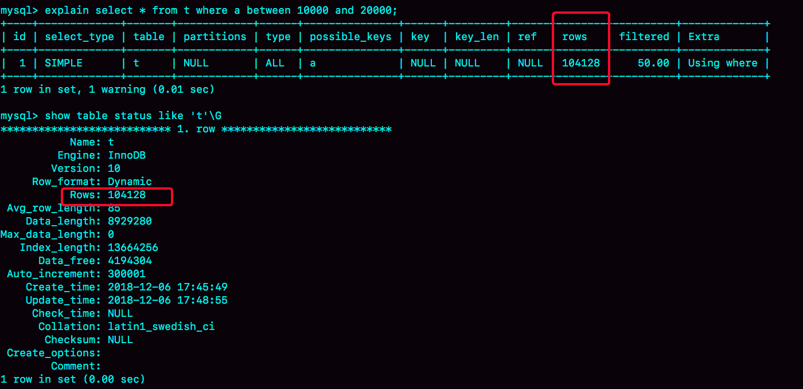

# 11讲怎么给字符串字段加索引

现在，几乎所有的系统都支持邮箱登录，如何在邮箱这样的字段上建立合理的索引，是我们今天要讨论的问题。

假设，你现在维护一个支持邮箱登录的系统，用户表是这么定义的：

```mysql
mysql> create table SUser(
ID bigint unsigned primary key,
email varchar(64), 
... 
)engine=innodb; 
```

由于要使用邮箱登录，所以业务代码中一定会出现类似于这样的语句：

```mysql
mysql> select f1, f2 from SUser where email='xxx';
```

如果 email 这个字段上没有索引，那么这个语句就只能做全表扫描。同时，MySQL 是支持前缀索引的，即可以定义字符串的一部分作为索引。默认地，如果你创建索引的语句不指定前缀长度，那么索引就会包含整个字符串。

比如，这两个在 email 字段上创建索引的语句：

```mysql
mysql> alter table SUser add index index1(email);
或
mysql> alter table SUser add index index2(email(6));
```

第一个语句创建的 index1 索引里面，包含了每个记录的整个字符串；而第二个语句创建的 index2 索引里面，对于每个记录都是只取前 6 个字节。

这两种不同的定义在数据结构和存储上有什么区别呢？如图2和3所示，就是这两个索引的示意图。


图1 email 索引结构


图2 email(6) 索引结构

从图中你可以看到，由于email(6)这个索引结构中每个邮箱字段都只取前 6 个字节（即：zhangs），所以占用的空间会更小，这就是使用前缀索引的优势。

但，这同时带来的损失是，可能会增加额外的记录扫描次数。

接下来，我们再看看下面这个语句，在这两个索引定义下分别是怎么执行的。

```mysql
select id,name,email from SUser where email='zhangssxyz@xxx.com';
```

**如果使用的是 index1**（即 email 整个字符串的索引结构），执行顺序是这样的：

1. 从 index1 索引树找到满足索引值是 `zhangssxyz@xxx.com` 的这条记录，取得 ID2 的值；
2. 到主键上查到主键值是 ID2 的行，判断 email 的值是正确的，将这行记录加入结果集；
3. 取 index1 索引树上刚刚查到的位置的下一条记录，发现已经不满足 `email='zhangssxyz@xxx.com'` 的条件了，循环结束。

这个过程中，只需要回主键索引取一次数据，所以系统认为只扫描了一行。

**如果使用的是 index2**（即email(6)索引结构），执行顺序是这样的：

1. 从 index2 索引树找到满足索引值是 `zhangs`的记录，找到的第一个是 ID1；
2. 到主键上查到主键值是 ID1 的行，判断出 email 的值不是 `zhangssxyz@xxx.com`，这行记录丢弃；
3. 取 index2 上刚刚查到的位置的下一条记录，发现仍然是 ’zhangs’，取出 ID2，再到 ID 索引上取整行然后判断，这次值对了，将这行记录加入结果集；
4. 重复上一步，直到在 idxe2 上取到的值不是’zhangs’时，循环结束。

在这个过程中，要回主键索引取 4 次数据，也就是扫描了 4 行。

通过这个对比，你很容易就可以发现，使用前缀索引后，可能会导致查询语句读数据的次数变多。

但是，对于这个查询语句来说，如果你定义的 index2 不是 email(6) 而是 email(7），也就是说取 email 字段的前7个字节来构建索引的话，即满足前缀’zhangss’的记录只有一个，也能够直接查到 ID2，只扫描一行就结束了。

因此**使用前缀索引，定义好长度，就可以做到既节省空间，又不用额外增加太多的查询成本。**

于是，你就有个问题：当要给字符串创建前缀索引时，有什么方法能够确定我应该使用多长的前缀呢？

实际上，我们在建立索引时关注的是区分度，区分度越高越好。因为区分度越高，意味着重复的键值越少。因此，我们可以通过统计索引上有多少个不同的值来判断要使用多长的前缀。

首先，你可以使用下面这个语句，算出这个列上有多少个不同的值：

```mysql
mysql> select count(distinct email) as L from SUser;
```

然后，依次选取不同长度的前缀来看这个值，比如我们要看一下 4~7 个字节的前缀索引，可以用这个语句：

```mysql
mysql> select 
  count(distinct left(email,4)）as L4,
  count(distinct left(email,5)）as L5,
  count(distinct left(email,6)）as L6,
  count(distinct left(email,7)）as L7,
from SUser;
```

当然，使用前缀索引很可能会损失区分度，所以你需要预先设定一个可以接受的损失比例，比如 5%。然后，在返回的 L4~L7 中，找出不小于 L * 95% 的值，假设这里 L6、L7 都满足，你就可以选择前缀长度为 6。

## 一、前缀索引对覆盖索引的影响

**使用前缀索引可能会增加扫描行数，这会影响到性能**。其实，前缀索引的影响不止如此，我们再看一下另外一个场景。

你先来看看这个 SQL 语句：

```mysql
select id,email from SUser where email='zhangssxyz@xxx.com';
```

与前面例子中的 SQL 语句

```mysql
select id,name,email from SUser where email='zhangssxyz@xxx.com';
```

相比，这个语句只要求返回 id 和 email 字段。

所以，如果使用 index1（即 email 整个字符串的索引结构）的话，可以利用覆盖索引，从 index1 查到结果后直接就返回了，不需要回到 ID 索引再去查一次。而如果使用 index2（即 email(6) 索引结构）的话，就不得不回到 ID 索引再去判断 email 字段的值。

即使你将 index2 的定义修改为 email(18) 的前缀索引，这时候虽然 index2 已经包含了所有的信息，但 InnoDB 还是要回到 id 索引再查一下，因为系统并不确定前缀索引的定义是否截断了完整信息。

即**使用前缀索引就用不上覆盖索引对查询性能的优化**了，这也是你在选择是否使用前缀索引时需要考虑的一个因素。

## 二、其他方式

对于类似于邮箱这样的字段来说，使用前缀索引的效果可能还不错。但是，遇到前缀的区分度不够好的情况时，我们要怎么办呢？

比如，我们国家的身份证号，一共 18 位，其中前 6 位是地址码，所以同一个县的人的身份证号前 6 位一般会是相同的。

假设你维护的数据库是一个市的公民信息系统，这时候如果对身份证号做长度为 6 的前缀索引的话，这个索引的区分度就非常低了。

按照我们前面说的方法，可能你需要创建长度为 12 以上的前缀索引，才能够满足区分度要求。

但是，索引选取的越长，占用的磁盘空间就越大，相同的数据页能放下的索引值就越少，搜索的效率也就会越低。

那么，如果我们能够确定业务需求里面只有按照身份证进行等值查询的需求，还有没有别的处理方法呢？这种方法，既可以占用更小的空间，也能达到相同的查询效率。

**第一种方式是使用倒序存储。**如果你存储身份证号的时候把它倒过来存，每次查询的时候，你可以这么写：

```mysql
mysql> select field_list from t where id_card = reverse('input_id_card_string');
```

由于身份证号的最后 6 位没有地址码这样的重复逻辑，所以最后这 6 位很可能就提供了足够的区分度。当然了，实践中你不要忘记使用 `count(distinct)` 方法去做个验证。

**第二种方式是使用 hash 字段。**你可以在表上再创建一个整数字段，来保存身份证的校验码，同时在这个字段上创建索引。

```mysql
mysql> alter table t add id_card_crc int unsigned, add index(id_card_crc);
```

然后每次插入新记录的时候，都同时用 `crc32()` 这个函数得到校验码填到这个新字段。由于校验码可能存在冲突，也就是说两个不同的身份证号通过 `crc32()` 函数得到的结果可能是相同的，所以你的查询语句 where 部分要判断 `id_card` 的值是否精确相同。

```mysql
mysql> SELECT field_list 
FROM t 
WHERE id_card_crc=crc32('input_id_card_string') and id_card='input_id_card_string'
```

这样，索引的长度变成了 4 个字节，比原来小了很多。

接下来，我们再一起看看**使用倒序存储和使用 hash 字段这两种方法的异同点。**

相同点：都不支持范围查询。倒序存储的字段上创建的索引是按照倒序字符串的方式排序的，已经没有办法利用索引方式查出身份证号码在 [ID_X, ID_Y] 的所有市民了。同样地，hash 字段的方式也只能支持等值查询。

它们的区别，主要体现在以下三个方面：

1. 从占用的额外空间来看，倒序存储方式在主键索引上，不会消耗额外的存储空间，而 hash 字段方法需要增加一个字段。当然，倒序存储方式使用 4 个字节的前缀长度应该是不够的，如果再长一点，这个消耗跟额外这个 hash 字段也差不多抵消了。
2. 在 CPU 消耗方面，倒序方式每次写和读的时候，都需要额外调用一次 reverse 函数，而 hash 字段的方式需要额外调用一次 crc32() 函数。如果只从这两个函数的计算复杂度来看的话，reverse 函数额外消耗的 CPU 资源会更小些。
3. 从查询效率上看，使用 hash 字段方式的查询性能相对更稳定一些。因为 crc32 算出来的值虽然有冲突的概率，但是概率非常小，可以认为每次查询的平均扫描行数接近 1。而倒序存储方式毕竟还是用的前缀索引的方式，也就是说还是会增加扫描行数。

## 小结

在今天这篇文章中，我跟你聊了聊字符串字段创建索引的场景。我们来回顾一下，你可以使用的方式有：

1. 直接创建完整索引，这样可能比较占用空间；
2. 创建前缀索引，节省空间，但会增加查询扫描次数，并且不能使用覆盖索引；
3. 倒序存储，再创建前缀索引，用于绕过字符串本身前缀的区分度不够的问题；
4. 创建hash字段索引，查询性能稳定，有额外的存储和计算消耗，跟第三种方式一样，都不支持范围扫描。

在实际应用中，你要根据业务字段的特点选择使用哪种方式。

好了，又到了最后的问题时间。

如果你在维护一个学校的学生信息数据库，学生登录名的统一格式是”学号@gmail.com", 而学号的规则是：十五位的数字，其中前三位是所在城市编号、第四到第六位是学校编号、第七位到第十位是入学年份、最后五位是顺序编号。

系统登录的时候都需要学生输入登录名和密码，验证正确后才能继续使用系统。就只考虑登录验证这个行为的话，你会怎么设计这个登录名的索引呢？

你可以把你的分析思路和设计结果写在留言区里，我会在下一篇文章的末尾和你讨论这个问题。感谢你的收听，也欢迎你把这篇文章分享给更多的朋友一起阅读。

## 上期问题时间

上篇文章中的第一个例子，评论区有几位同学说没有复现，大家要检查一下隔离级别是不是RR（Repeatable Read，可重复读），创建的表t是不是InnoDB引擎。我把复现过程做成了一个视频，供你参考。


在上一篇文章最后，我给你留的问题是，为什么经过这个操作序列，explain的结果就不对了？这里，我来为你分析一下原因。

delete 语句删掉了所有的数据，然后再通过call idata()插入了10万行数据，看上去是覆盖了原来的10万行。

但是，session A开启了事务并没有提交，所以之前插入的10万行数据是不能删除的。这样，之前的数据每一行数据都有两个版本，旧版本是delete之前的数据，新版本是标记为deleted的数据。

这样，索引a上的数据其实就有两份。

然后你会说，不对啊，主键上的数据也不能删，那没有使用force index的语句，使用explain命令看到的扫描行数为什么还是100000左右？（潜台词，如果这个也翻倍，也许优化器还会认为选字段a作为索引更合适）

是的，不过这个是主键，主键是直接按照表的行数来估计的。而表的行数，优化器直接用的是show table status的值。

这个值的计算方法，我会在后面有文章为你详细讲解。


评论区留言点赞板：

> @斜面镜子 Bill 的评论最接近答案；
> @某、人 做了两个很不错的对照试验；
> @ye7zi 等几位同学很认真的验证，赞态度。大家的机器如果IO能力比较差的话，做这个验证的时候，可以把innodb_flush_log_at_trx_commit 和 sync_binlog 都设置成0。

## 精选留言

- 

    封建的风

    原谅我偷懒的想法，一个学校每年预估2万新生，50年才100万记录，能节省多少空间，直接全字段索引。省去了开发转换及局限性风险，碰到超大量迫不得已再用后两种办法

    2018-12-08 23:23

    作者回复

    从业务量预估优化和收益，这个意识很好呢

    2018-12-09 12:56

- 

    小文

    首先排除全部索引，占空间，其次排除前缀索引，区分度不高，再排除倒序索引，区分度还没前缀索引高。
    最后hash索引适合，而且只是登录检验，不需要范围查询。

    2018-12-07 08:50

- 

    某、人

    老师针对上一期的答案有两个问题:
    1.为什么事务A未提交,之前插入的10W数据不能删除啊？不是应该都进undo和change buffer了嘛,
    根据mvcc查之前的版本就可以了啊。
    2.不明白为什么第二次调用插入的存储过程,id就变为100000-200000,id是固定插入的,又不是自增的

    2018-12-07 00:36

    作者回复

    \1. 这里说的“不能删”，其实就是说的，undo log不能删，逻辑上还在

    \2. 你说的对… 我最开始的例子是用自增主键，改完自己晕了，堪误了哈

    2018-12-07 15:31

- 

    老杨同志

    老师整篇都讲的是字符串索引，但是思考题的学号比较特殊，15位数字+固定后缀“@gmail.com”
    这种特殊的情况，可以把学号使用bigint存储,占4个字节，比前缀索引空间占用要小。跟hash索引比，
    也有区间查询的优势

    2018-12-07 11:26

    作者回复

    Bigint 8 个字节哦，赞思路。

    嗯问题不是唯一答案，大家集思广益哈

    2018-12-07 13:17

- 

    进阶的码农

    老师按照你视频里的例子又做了一下还是不行
    mysql版本8.0.12
    +-----------+
    | version() |
    +-----------+
    | 8.0.12 |
    +-----------+
    是innodb 隔离级别是RR
    1.先打开一个客户端A 执行start transaction with consistent snapshot;没有commit
    2.然后在重新打开一个mysql客户端B 执行
    delete from t;call idata(); explain select * from t between 10000 and 20000;
    +----+-------------+-------+------------+-------+---------------+------+---------+------+-------+----------+-----------------------+
    | id | select_type | table | partitions | type | possible_keys | key | key_len | ref | rows | filtered | Extra |
    +----+-------------+-------+------------+-------+---------------+------+---------+------+-------+----------+-----------------------+
    | 1 | SIMPLE | t | NULL | range | a | a | 5 | NULL | 10001 | 100.00 | Using index condition |
    +----+-------------+-------+------------+-------+---------------+------+---------+------+-------+----------+-----------------------+

    2018-12-07 19:47

- 

    Hunter

    是不是还是之前的思路，把邮件的地址里面@的前一段做倒排存储，然后就可以使用前缀索引了。
    或者也可以用年份和顺序号单独存一列，这样就有点类似哈希了，优点是还可以支持范围查询。

    2018-12-07 08:49

- 

    Livis

    课后题思考：可以使用学号拼接密码构建一个hash值，每次登录校验时重新计算hash值匹配；

    2018-12-07 08:05

- 

    某、人

    回答下今天老师的问题:
    1.在user建立索引,由于学号的最后7位才能确定到某个学生.不满足最左前缀,那么select from where '%1234567%'无法使用索引,是全表扫描。但是这种情况也有优化的办法,如果该表上的字段比较多,可以这样改写select password from t join (select id from where user like '%1234567%') as a on a.id=t.id
    通过全扫描二级索引得到唯一id值.再用id值与t表关联的时候,就能迅速的定位到某一行了,避免全表扫描
    不过在本次问题里,这种方式效果不好

    2.hash索引,建立(hashuser,user,password)索引,不用回表,覆盖索引,但是索引占用长度长。
    或者建立(hashuser)索引,因为hashuser基本上能确定到唯一值,虽然回表但是扫描的行数也就两行,效率也挺高。但是hash索引对于insert和update操作要多做一些额外的操作。要嘛通过程序计算出hash值,插入表里,要嘛就通过触发器来做。

    3.建立前缀索引,由于后面是固定email,可以考虑只存学号.由于学号后面7位就能确定到某一个学生,可以用倒序存储+前缀索引。不过由于前缀索引不能在int类型上建立,只能用varchar类型。虽然前缀索引无法用到覆盖索引,不过回表扫描的行数也就一行,效率也挺高。这种方式来说,对insert和update相对还好。还有前缀索引还有个影响是不能用于排序。

    

    2018-12-08 20:03

- 

    Tony Du

    对于上一期的问题的回答，“索引 a 上的数据其实就有两份”，是不是这样理解，
    其中一份是已经被标记为deleted的数据，另一份是新插入的数据，对索引数据的预估把已经被标记为deleted的数据也算上去了？MySQL对索引数据的预估为什么不去check 被标记为deleted的数据？
    这种场景一旦发生，就会导致预估索引数据不准确，有什么好的方法去避免和解决？

    

    2018-12-07 10:51

    作者回复

    理解对的，

    方法就是避免长事务（session A 就是模拟一个长事务）

    2018-12-07 11:13

- 

    剃刀吗啡

    通常我们都是在创建表的时候根据业务创建索引，这时候分析前缀没意义，因为没数。等表大了上千万行后再执行前缀分析也不合适啊。
    另外，不是不推荐在where中使用函数吗？使用reverse不影响性能？

    2018-12-12 09:31

- 

    lttzzlll

    只取 四位年份+五位编号 并转化为int类型作为唯一主键

    2018-12-07 22:11

- 

    SaimSaim

    没看懂答案,上期题目说rows其实还是1W,现在这里又说是10W

    2018-12-28 15:01

- 

    alias cd=rm -rf

    我会考虑用hash字段方式，因为这个场景下用hash字段方式查询效率更稳定。

    另外，我能平时做业务的时候出于更通用的考虑，好像很少在业务上用函数，

    2018-12-20 23:16

- 

    轻歌赋

    从第9位开始截取到末尾，额外增加一个字段存储该值，然后在上面建立索引。因为是一个学校的同一年入学的学生的顺序号不可能一样，因此可以直接这样做。空间增加了一个字段和相应的索引长度。时间上根据建立的索引来，如果支持查找一个范围内，那么推荐b树。否则推荐hash。

    2018-12-19 12:57

- 

    欧阳成

    数据量有多大才考虑用后两种索引，怎样去平衡这个（业务量与收益）？

    2018-12-18 11:51

- 

    假装有网名

    邮箱后缀是一样的了，然后去掉后缀倒序索引

    2018-12-17 21:46

- 

    William

    针对本章问题想法如下：
    1、将按照规则生成的名称 ，存入单独字段，做全列索引。

    2、按规则生成的名称做倒序索引。
    优先级 1 > 2
    请老师指教。

    2018-12-17 16:35

    作者回复

    倒序索引的话建议把邮箱部分去掉哈。
    可以看一下其它同学评论，和下期末尾

    2018-12-17 18:11

- 

    萧箫萧

    问个问题
    a.xxx=100 int类型
    a.mmm=-1
    执行
    select * from a where a.xxx="01e2g5hg3afasf4t4j65" and a.mmm ="-1"
    为什么这样搜索也可以获取到a.xxx是100的这条信息

    2018-12-14 19:13

- 

    吴先森V

    请教一个问题, 下面这条SQL order_id 和 user_id 都是 int 类型，都加了索引，在看 EXPLAIN 的时候 执行只使用了 order_id 索引， 为什么 user_id 索引没有采用呢？如果WHERE 条件后面都有索引是否都会执行、还是优化器会选择最有效率都一个索引执行？ 将两个调整成组合索引也没有效果, 如果 force index(user_id) 则全表扫描。 能帮忙解答下吗？谢谢
    SELECT
    count(1)
    FROM
    A a
    WHERE
    EXISTS(
    SELECT
    1
    FROM
    B b
    WHERE
    b.order_id = a.order_id
    AND b.user_id = a.user_id
    );

    2018-12-13 14:03

    作者回复

    只能用一个索引，如果两个都用就是merge-index算法，一般优化器很少采用

    2018-12-13 21:57

- 

    树下品茶

    如果是维护“一个学校”的学生信息数据库，那数据量会非常小，但感觉老师指的是维护一个“学校的学生信息数据库”，应该是多个学校，可能是市级或者省级或者国家级的一个学校登录系统，那么数据量会大不少。因为学生不是一般app的用户或者政府机关里记录的公民，学生是会离校的，如果定期把已经离校的学生从表中转移到历史表，那么数据量是可控的。
    在定期清理离校学生信息的情况下，如果总数据量预估不太大，不如直接把登录编号作为索引，那么回表取一次密码就行了。如果再追求速度且空间也允许，那么把索引和密码做个联合索引，连回表都不用回。如果总数据量预估还是有点大的话就通过hash索引走比较好。不了解现在学生数量没法估计，只是一个思路

    2018-12-13 10:48

    作者回复

    嗯你说的对，数据量和压力预估，是先于语句具体设计的

    2018-12-13 12:28