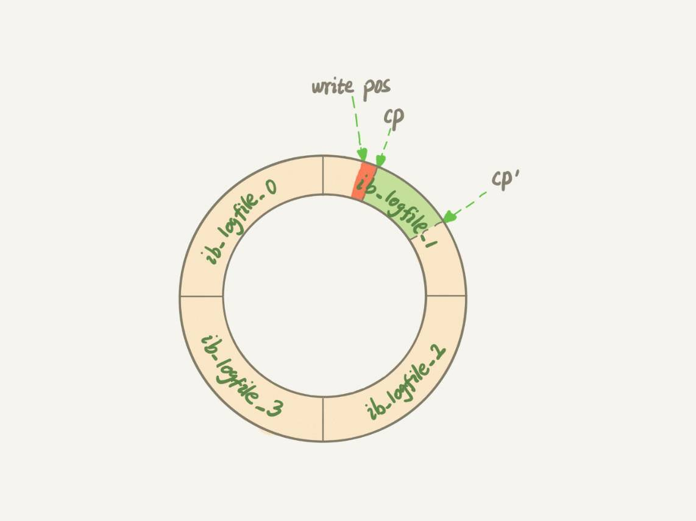
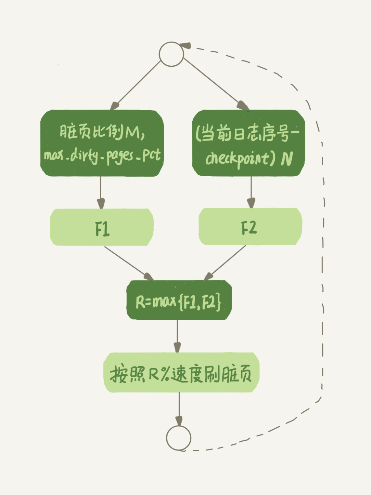

# 12讲为什么我的MySQL会“抖”一下

平时的工作中，不知道你有没有遇到过这样的场景，一条 SQL 语句，正常执行的时候特别快，但是有时也不知道怎么回事，它就会变得特别慢，并且这样的场景很难复现，它不只随机，而且持续时间还很短。就像是数据库“抖”了一下。

## 一、你的SQL语句为什么变“慢”了

在前面第2篇文章[《日志系统：一条SQL更新语句是如何执行的？》](https://time.geekbang.org/column/article/68633)中，我为你介绍了 WAL 机制。InnoDB 在处理更新语句的时候，只做了写日志这一个磁盘操作。这个日志叫作 redo log（重做日志），在更新内存写完 redo log 后，就返回给客户端，本次更新成功。

做下类比的话，掌柜记账的账本是数据文件，记账用的粉板是日志文件（redo log），掌柜的记忆就是内存。

掌柜总要找时间把账本更新一下，这对应的就是把内存里的数据写入磁盘的过程，术语就是 flush。

**当内存数据页跟磁盘数据页内容不一致的时候，我们称这个内存页为“脏页”。内存数据写入到磁盘后，内存和磁盘上的数据页的内容就一致了，称为“干净页”**。

不论是脏页还是干净页，都在内存中。在这个例子里，内存对应的就是掌柜的记忆。

接下来，我们用一个示意图来展示一下“孔乙己赊账”的整个操作过程。假设原来孔乙己欠账10文，这次又要赊9文。


图1 “孔乙己赊账”更新和flush过程

回到文章开头的问题，你不难想象，平时执行很快的更新操作，其实就是在写内存和日志，而MySQL偶尔“抖”一下的那个瞬间，可能就是在刷脏页（flush）。

那么，什么情况会引发数据库的flush过程呢？

我们还是继续用咸亨酒店掌柜的这个例子，想一想：掌柜在什么情况下会把粉板上的赊账记录改到账本上？

- 第一种场景是，粉板满了，记不下了。这时候如果再有人来赊账，掌柜就只得放下手里的活儿，将粉板上的记录擦掉一些，留出空位以便继续记账。当然在擦掉之前，他必须先将正确的账目记录到账本中才行。
    这个场景，对应的就是InnoDB的redo log写满了。这时候系统会停止所有更新操作，把checkpoint往前推进，redo log留出空间可以继续写。我在第二讲画了一个redo log的示意图，这里我改成环形，便于大家理解。



图2 redo log状态图

checkpoint可不是随便往前修改一下位置就可以的。比如图2中，把checkpoint位置从CP推进到CP’，就需要将两个点之间的日志（浅绿色部分），对应的所有脏页都flush到磁盘上。之后，图中从write pos到CP’之间就是可以再写入的redo log的区域。

- 第二种场景是，这一天生意太好，要记住的事情太多，掌柜发现自己快记不住了，赶紧找出账本把孔乙己这笔账先加进去。
    这种场景，对应的就是系统内存不足。当需要新的内存页，而内存不够用的时候，就要淘汰一些数据页，空出内存给别的数据页使用。如果淘汰的是“脏页”，就要先将脏页写到磁盘。
    你一定会说，这时候难道不能直接把内存淘汰掉，下次需要请求的时候，从磁盘读入数据页，然后拿redo log出来应用不就行了？这里其实是从性能考虑的。如果刷脏页一定会写盘，就保证了每个数据页有两种状态：
    - 一种是内存里存在，内存里就肯定是正确的结果，直接返回；
    - 另一种是内存里没有数据，就可以肯定数据文件上是正确的结果，读入内存后返回。
        这样的效率最高。
- 第三种场景是，生意不忙的时候，或者打烊之后。这时候柜台没事，掌柜闲着也是闲着，不如更新账本。
    这种场景，对应的就是MySQL认为系统“空闲”的时候。当然，MySQL“这家酒店”的生意好起来可是会很快就能把粉板记满的，所以“掌柜”要合理地安排时间，即使是“生意好”的时候，也要见缝插针地找时间，只要有机会就刷一点“脏页”。
- 第四种场景是，年底了咸亨酒店要关门几天，需要把账结清一下。这时候掌柜要把所有账都记到账本上，这样过完年重新开张的时候，就能就着账本明确账目情况了。
    这种场景，对应的就是MySQL正常关闭的情况。这时候，MySQL会把内存的脏页都flush到磁盘上，这样下次MySQL启动的时候，就可以直接从磁盘上读数据，启动速度会很快。

接下来，**你可以分析一下上面四种场景对性能的影响。**

其中，第三种情况是属于MySQL空闲时的操作，这时系统没什么压力，而第四种场景是数据库本来就要关闭了。这两种情况下，你不会太关注“性能”问题。所以这里，我们主要来分析一下前两种场景下的性能问题。

第一种是“redo log写满了，要flush脏页”，这种情况是InnoDB要尽量避免的。因为出现这种情况的时候，整个系统就不能再接受更新了，所有的更新都必须堵住。如果你从监控上看，这时候更新数会跌为0。

第二种是“内存不够用了，要先将脏页写到磁盘”，这种情况其实是常态。**InnoDB用缓冲池（buffer pool）管理内存，缓冲池中的内存页有三种状态：**

- 第一种是，还没有使用的；
- 第二种是，使用了并且是干净页；
- 第三种是，使用了并且是脏页。

InnoDB的策略是尽量使用内存，因此对于一个长时间运行的库来说，未被使用的页面很少。

而当要读入的数据页没有在内存的时候，就必须到缓冲池中申请一个数据页。这时候只能把最久不使用的数据页从内存中淘汰掉：如果要淘汰的是一个干净页，就直接释放出来复用；但如果是脏页呢，就必须将脏页先刷到磁盘，变成干净页后才能复用。

所以，刷脏页虽然是常态，但是出现以下这两种情况，都是会明显影响性能的：

1. 一个查询要淘汰的脏页个数太多，会导致查询的响应时间明显变长；
2. 日志写满，更新全部堵住，写性能跌为0，这种情况对敏感业务来说，是不能接受的。

所以，InnoDB需要有控制脏页比例的机制，来尽量避免上面的这两种情况。

# InnoDB刷脏页的控制策略

接下来，我就来和你说说InnoDB脏页的控制策略，以及和这些策略相关的参数。

首先，你要正确地告诉InnoDB所在主机的IO能力，这样InnoDB才能知道需要全力刷脏页的时候，可以刷多快。

这就要用到innodb_io_capacity这个参数了，它会告诉InnoDB你的磁盘能力。这个值我建议你设置成磁盘的IOPS。磁盘的IOPS可以通过fio这个工具来测试，下面的语句是我用来测试磁盘随机读写的命令：

```
 fio -filename=$filename -direct=1 -iodepth 1 -thread -rw=randrw -ioengine=psync -bs=16k -size=500M -numjobs=10 -runtime=10 -group_reporting -name=mytest 
```

其实，因为没能正确地设置innodb_io_capacity参数，而导致的性能问题也比比皆是。之前，就曾有其他公司的开发负责人找我看一个库的性能问题，说MySQL的写入速度很慢，TPS很低，但是数据库主机的IO压力并不大。经过一番排查，发现罪魁祸首就是这个参数的设置出了问题。

他的主机磁盘用的是SSD，但是innodb_io_capacity的值设置的是300。于是，InnoDB认为这个系统的能力就这么差，所以刷脏页刷得特别慢，甚至比脏页生成的速度还慢，这样就造成了脏页累积，影响了查询和更新性能。

虽然我们现在已经定义了“全力刷脏页”的行为，但平时总不能一直是全力刷吧？毕竟磁盘能力不能只用来刷脏页，还需要服务用户请求。所以接下来，我们就一起看看InnoDB怎么控制引擎按照“全力”的百分比来刷脏页。

根据我前面提到的知识点，试想一下，**如果你来设计策略控制刷脏页的速度，会参考哪些因素呢？**

这个问题可以这么想，如果刷太慢，会出现什么情况？首先是内存脏页太多，其次是redo log写满。

所以，InnoDB的刷盘速度就是要参考这两个因素：一个是脏页比例，一个是redo log写盘速度。

InnoDB会根据这两个因素先单独算出两个数字。

参数innodb_max_dirty_pages_pct是脏页比例上限，默认值是75%。InnoDB会根据当前的脏页比例（假设为M），算出一个范围在0到100之间的数字，计算这个数字的伪代码类似这样：

```
F1(M)
{
  if M>=innodb_max_dirty_pages_pct then
      return 100;
  return 100*M/innodb_max_dirty_pages_pct;
}
```

InnoDB每次写入的日志都有一个序号，当前写入的序号跟checkpoint对应的序号之间的差值，我们假设为N。InnoDB会根据这个N算出一个范围在0到100之间的数字，这个计算公式可以记为F2(N)。F2(N)算法比较复杂，你只要知道N越大，算出来的值越大就好了。

然后，**根据上述算得的F1(M)和F2(N)两个值，取其中较大的值记为R，之后引擎就可以按照innodb_io_capacity定义的能力乘以R%来控制刷脏页的速度。**

上述的计算流程比较抽象，不容易理解，所以我画了一个简单的流程图。图中的F1、F2就是上面我们通过脏页比例和redo log写入速度算出来的两个值。



图3 InnoDB刷脏页速度策略

现在你知道了，InnoDB会在后台刷脏页，而刷脏页的过程是要将内存页写入磁盘。所以，无论是你的查询语句在需要内存的时候可能要求淘汰一个脏页，还是由于刷脏页的逻辑会占用IO资源并可能影响到了你的更新语句，都可能是造成你从业务端感知到MySQL“抖”了一下的原因。

要尽量避免这种情况，你就要合理地设置innodb_io_capacity的值，并且**平时要多关注脏页比例，不要让它经常接近75%**。

其中，脏页比例是通过Innodb_buffer_pool_pages_dirty/Innodb_buffer_pool_pages_total得到的，具体的命令参考下面的代码：

```
mysql> select VARIABLE_VALUE into @a from global_status where VARIABLE_NAME = 'Innodb_buffer_pool_pages_dirty';
select VARIABLE_VALUE into @b from global_status where VARIABLE_NAME = 'Innodb_buffer_pool_pages_total';
select @a/@b;
```

接下来，我们再看一个有趣的策略。

一旦一个查询请求需要在执行过程中先flush掉一个脏页时，这个查询就可能要比平时慢了。而MySQL中的一个机制，可能让你的查询会更慢：在准备刷一个脏页的时候，如果这个数据页旁边的数据页刚好是脏页，就会把这个“邻居”也带着一起刷掉；而且这个把“邻居”拖下水的逻辑还可以继续蔓延，也就是对于每个邻居数据页，如果跟它相邻的数据页也还是脏页的话，也会被放到一起刷。

在InnoDB中，innodb_flush_neighbors 参数就是用来控制这个行为的，值为1的时候会有上述的“连坐”机制，值为0时表示不找邻居，自己刷自己的。

找“邻居”这个优化在机械硬盘时代是很有意义的，可以减少很多随机IO。机械硬盘的随机IOPS一般只有几百，相同的逻辑操作减少随机IO就意味着系统性能的大幅度提升。

而如果使用的是SSD这类IOPS比较高的设备的话，我就建议你把innodb_flush_neighbors的值设置成0。因为这时候IOPS往往不是瓶颈，而“只刷自己”，就能更快地执行完必要的刷脏页操作，减少SQL语句响应时间。

在MySQL 8.0中，innodb_flush_neighbors参数的默认值已经是0了。

# 小结

今天这篇文章，我延续第2篇中介绍的WAL的概念，和你解释了这个机制后续需要的刷脏页操作和执行时机。利用WAL技术，数据库将随机写转换成了顺序写，大大提升了数据库的性能。

但是，由此也带来了内存脏页的问题。脏页会被后台线程自动flush，也会由于数据页淘汰而触发flush，而刷脏页的过程由于会占用资源，可能会让你的更新和查询语句的响应时间长一些。在文章里，我也给你介绍了控制刷脏页的方法和对应的监控方式。

文章最后，我给你留下一个思考题吧。

一个内存配置为128GB、innodb_io_capacity设置为20000的大规格实例，正常会建议你将redo log设置成4个1GB的文件。

但如果你在配置的时候不慎将redo log设置成了1个100M的文件，会发生什么情况呢？又为什么会出现这样的情况呢？

你可以把你的分析结论写在留言区里，我会在下一篇文章的末尾和你讨论这个问题。感谢你的收听，也欢迎你把这篇文章分享给更多的朋友一起阅读。

# 上期问题时间

上期我留给你的问题是，给一个学号字段创建索引，有哪些方法。

由于这个学号的规则，无论是正向还是反向的前缀索引，重复度都比较高。因为维护的只是一个学校的，因此前面6位（其中，前三位是所在城市编号、第四到第六位是学校编号）其实是固定的，邮箱后缀都是@gamil.com，因此可以只存入学年份加顺序编号，它们的长度是9位。

而其实在此基础上，可以用数字类型来存这9位数字。比如201100001，这样只需要占4个字节。其实这个就是一种hash，只是它用了最简单的转换规则：字符串转数字的规则，而刚好我们设定的这个背景，可以保证这个转换后结果的唯一性。

评论区中，也有其他一些很不错的见解。

评论用户@封建的风 说，一个学校的总人数这种数据量，50年才100万学生，这个表肯定是小表。为了业务简单，直接存原来的字符串。这个答复里面包含了“优化成本和收益”的思想，我觉得值得at出来。

@小潘 同学提了另外一个极致的方向。如果碰到表数据量特别大的场景，通过这种方式的收益是很不错的。

**评论区留言点赞板：**

> @lttzzlll ，提到了用整型存“四位年份+五位编号”的方法；
> 由于整个学号的值超过了int上限，@老杨同志 也提到了用8个字节的bigint来存的方法。

## 精选留言

- 

    Tony Du

    当内存不够用了，要将脏页写到磁盘，会有一个数据页淘汰机制（最久不使用），假设淘汰的是脏页，则此时脏页所对应的redo log的位置是随机的，当有多个不同的脏页需要刷，则对应的redo log可能在不同的位置，这样就需要把redo log的多个不同位置刷掉，这样对于redo log的处理不是就会很麻烦吗？（合并间隙，移动位置？）
    另外，redo log的优势在于将磁盘随机写转换成了顺序写，如果需要将redo log的不同部分刷掉（刷脏页），不是就在redo log里随机读写了么？

    2018-12-10 13:16

    作者回复

    好问题。

    其实由于淘汰的时候，刷脏页过程不用动redo log文件的。

    这个有个额外的保证，是redo log在“重放”的时候，如果一个数据页已经是刷过的，会识别出来并跳过。

    

    2018-12-10 15:00

- 

    某、人

    redo log是关系型数据库的核心啊,保证了ACID里的D。所以redo log是牵一发而动全身的操作
    按照老师说的当内存数据页跟磁盘数据页不一致的时候,把内存页称为'脏页'。如果redo log
    设置得太小,redo log写满.那么会涉及到哪些操作呢,我认为是以下几点:
    1.把相对应的数据页中的脏页持久化到磁盘,checkpoint往前推
    2.由于redo log还记录了undo的变化,undo log buffer也要持久化进undo log
    3.当innodb_flush_log_at_trx_commit设置为非1,还要把内存里的redo log持久化到磁盘上
    4.redo log还记录了change buffer的改变,那么还要把change buffer purge到idb
    以及merge change buffer.merge生成的数据页也是脏页,也要持久化到磁盘
    上述4种操作,都是占用系统I/O,影响DML,如果操作频繁,会导致'抖'得向现在我们过冬一样。
    但是对于select操作来说,查询时间相对会更快。因为系统脏页变少了,不用去淘汰脏页,直接复用
    干净页即可。还有就是对于宕机恢复,速度也更快,因为checkpoint很接近LSN,恢复的数据页相对较少
    所以要控制刷脏的频率,频率快了,影响DML I/O,频率慢了,会导致读操作耗时长。
    我是这样想的这个问题,有可能不太对,特别是对于第4点是否会merge以及purge,还需要老师的解答

    2018-12-10 23:16

    作者回复

    抖得像过冬一样，

    你说得很对，第4点没错的，出现这种情况的时候，连change buffer的优化也没意义了

    2018-12-11 12:10

- 

    yesir

    我观察了下公司的数据库确实发现了抖动现象，有几个问题，
    1）Innodb_buffer_pool_pages_total这个值很大，百万级别的，而且数值不像是人为设置上去的，是怎么来的呢？
    2）Innodb_buffer_pool_pages_dirty达到4万多的时候就开始flush了，脏页比例是75，这肯定是远达不到的，ssd磁盘，innodb_io_capacity是200，肯定可以提高。文章中说flush的触发条件有2个，一个是内存不够了，一个是redo log 满了，那么我这个场景是哪种情况呢

    2018-12-11 23:02

    作者回复

    1） 这个是innodb 数据页总是，过百万是正常的，16K一个，Bufree pool size 16G 就是100万了

    2）你这个例子就是io_capacity设太小了…

    2018-12-12 00:40

- 

    Ryoma

    关于粉板和redo log的类比我觉得有一点不太合适：redo log记录的是实时欠款，比如账本中是10文，又欠了9文，此时redo log 记录的是19；而粉板的话，只会追加某人欠款+9文，不会关注原来已欠款多少（不然某人赊账时，我还需要找到账本中的这个人，才知道他之前欠款多少，我觉得这个场景跟MySQL中的场景还是有区别的）

    

    2018-12-12 10:19

    作者回复

    Redo log里也是记的+9哦

    2018-12-12 11:19

- 

    岁月安然

    “内存不够用了，要先将脏页写到磁盘“和“redo log 写满了，要 flush 脏页”可以理解为一个脏页本身占用内存，释放内存需要将脏页写入到磁盘才能释放。而redo log写满只有当redo log对应的脏页flush到磁盘上才能释放对应空间。有几个问题：
    1、“内存不够用了，要先将脏页写到磁盘“redo log对应的空间会释放嘛？“redo log 写满了，要 flush 脏页”对应的内存页会释放嘛？
    2、将脏页flush到磁盘上是直接将脏页数据覆盖到对应磁盘上的数据？还是从磁盘上取到数据后取根据redo log记录进行更新后再写入到磁盘？
    3、redo log是怎么记录对应脏页是否已经flush了？如果断电了重启导致内存丢失，前面几章说通过redo log进行数据恢复那redo log又怎么去释放空间？

    2018-12-10 11:14

    作者回复

    \1. Redolog 的空间是循环使用的，无所谓释放。 对应的内存页会变成干净页。但是等淘汰的时候才会逐出内存

    \2. 好问题，前者

    \3. 不用记，重启了就从checkpoint 的位置往后扫。 如果已经之前刷过盘的, 不会重复应用redi log。 好问题

    2018-12-10 13:12

- 

    melon

    又思考了一下，请老师帮忙看一下理解的对不对：buffer pool里维护着一个脏页列表，假设现在redo log 的 checkpoint 记录的 LSN 为 10，现在内存中的一干净页有修改，修改后该页的LSN为12，大于 checkpoint 的LSN，则在写redo log的同时该页也会被标记为脏页记录到脏页列表中，现在内存不足，该页需要被淘汰掉，该页会被刷到磁盘，磁盘中该页的LSN为12，该页也从脏页列表中移除，现在redo log 需要往前推进checkpoint，到LSN为12的这条log时，发现内存中的脏页列表里没有该页，且磁盘上该页的LSN也已经为12，则该页已刷脏，已为干净页，跳过。

    2018-12-11 14:41

    作者回复

    对的。

    2018-12-11 18:20

- 

    jimmy

    老师，我想问一下，innodb是如何知道一个页是不是脏页的，是有标记位还是通过redolog的ckeckpoint来确定的？

    2018-12-10 18:29

    作者回复

    每个数据页头部有LSN，8字节，每次修改都会变大。

    对比这个LSN跟checkpoint 的LSN，比checkpoint小的一定是干净页

    2018-12-10 19:13

- 

    Ying

    redolog 设置过小，会导致频繁刷脏页，还可能引发连坐，这样抖的频率可能会明显变高，系统会不断卡死的

    2018-12-10 02:10

- 

    Tony Du

    当内存不够用了，要将脏页写到磁盘，会有一个数据页淘汰机制（最久不使用），假设淘汰的是脏页，则此时脏页所对应的redo log的位置是随机的，当有多个不同的脏页需要刷，则对应的redo log可能在不同的位置，这样就需要把redo log的多个不同位置刷掉，这样对于redo log的处理不是就会很麻烦吗？（合并间隙，移动位置？）
    另外，redo log的优势在于将磁盘随机写转换成了顺序写，如果需要将redo log的不同部分刷掉（刷脏页），不是就在redo log里随机读写了么？

    作者回复
    好问题。

    其实由于淘汰的时候，刷脏页过程不用动redo log文件的。

    这个有个额外的保证，是redo log在“重放”的时候，如果一个数据页已经是刷过的，会识别出来并跳过。

    我的回复
    这个额外保证是如何做到的？能不能稍微解释下
    通过刷脏页时数据页更新的timestamp来对比redo log的timestamp？

    2018-12-11 09:11

    作者回复

    LSN，每次写redo log都带的一个数字， 数据页上也有，对比大小的，因为太细节没有写到文章中。

    2018-12-11 12:06

- 

    进击的菜鸡

    看完这一章明白了原来数据落盘不仅仅只是定时刷redo log及快写满是才会进行。当内存不足要淘汰掉的数据页为脏页时会直接将内存中脏页的数据刷入磁盘。不过此时产生了几个疑问。
    1、如果直接将内存中的数据页刷入磁盘，那redo log中的数据怎么办，会去删除吗？如果是那redo log岂不就不连续了。如果不是的话当刷redo log时又该怎么判断此时硬盘中的数据已经是最新的数据了呢。
    2、在执行DML操作时应该是总共有两处写磁盘是吗？先是innodb层的redo log落盘，紧接着MySQL server层的bin log落盘。这两处写磁盘都是同步写操作吗？
    还望老师可以在百忙之中不吝赐教，感激不尽*^o^*

    2019-01-06 16:41

- 

    喔～

    老师，请问下访问某条记录时，存储引擎是如何判断这条记录所在的数据页是否在内存当中，这个查内存机制是如何实现的？

    2018-12-20 13:29

    作者回复

    每个页面有编号的。拿着编号去内存看，没有，就去磁盘

    2018-12-20 16:08

- 

    老鱼头

    那个说fio命令会破坏硬盘的兄弟，是没用对命令。估计把-filename=/dev/sdb1 。。。这个的意思是从 分区 sdb1 的第一个扇区开始写入随机数据，去判断这个磁盘的写入速度。如果指定路径+文件名就不会出这事了~比如老师给的例子~

    2018-12-12 08:24

    作者回复

    嗯嗯，你说的对

    写文章的时候，我还故意用变量，这样直接拷贝会出错，然后自己再写个路径，已经考虑了安全了

    2018-12-12 10:45

- 

    lionetes

    很多测试人员再做压力测试的时候 出现刚开始 insert update 很快 一会 就出现很慢,并且延迟很大，大部分是因为redo log 设置太小 引起的,完美诠释

    2018-12-11 16:23

    作者回复

    常见的误用场景

    2018-12-11 18:19

- 

    算不出流源

    思考题:redo log较小，此时F2(N)就容易较大，后台刷脏页的速度就会较快，但是机器iops很高，所以即使在mysql负载较高的情况下，也不会造成redo log写满，因为innodb会照着最大iops的目标去请求io，而读写数据库的业务请求也机器朝最大iops能力去挤，最终两类io需求相互竞争达到一个动态平衡，redo log不会被灌满，但业务请求也没有空闲的时候执行速度快。
    所以我认为应该不是造成抖动，而是业务负载较大的情况下，完成业务请求的平均时间会较系统空闲时加倍。不知道理解有没有问题，请老师指正

    2018-12-11 13:22

    作者回复

    这个“动态平衡”确实是用“间歇性地卡住业务请求”作为代价的

    2018-12-11 18:23

- 

    Inon

    老师您好，一直有个问题，想请教下：就是远程通过JDBC一次查询可能查询出上万条数据。但我在客户端迭代读出来的时候都是一条一条取的。我想问，数据库端一次查询，会将查询的上万条真实数据结果一次性放在一个缓冲中，等客户端来取。还是构建一个查询数据结构，只是定位查询结果位置的，每次客户端通过游标通过查询结果位置实时读磁盘取数据的？

    2018-12-10 22:09

- 

    克己过

    老师！！！fio这条命令是会破坏硬盘的！而且百度搜出来不加硬盘坏关键词去搜，搜出来的文章没有一篇会告诉你这个事情！！！不说了，我去恢复数据了

    2018-12-10 22:03

    作者回复

    没有吧，怎么会破坏硬盘？我和以前同事一直这么用的呀…

    你确定是这个命令导致的吗

    2018-12-12 03:26

- 

    信信

    老师，你好，针对上一期问题的解答中有个疑问：为啥201100001要从字符串转数字，本来只需要2字节，转成数字需要4字节。是因为相同的内容，数字查找比字符串查找有优势吗？

    2018-12-10 20:06

    作者回复

    为什么说这是两个字节？按字符一个个算是9个

    2018-12-10 22:08

- 

    阿建

    redo-log内存满了，不停的要刷脏页回磁盘。现象就会是发现机器io不高，但是mysql明显的卡顿。

    2018-12-10 16:28

- 

    峰

    redo日志设置太小，内存又比较大，导致innodb缓存的脏页还没多少就开始大量flush，刷写频率增大。感觉有点像jvm中，年轻代内存设置小点，导致频繁younggc。当然这就是个权衡，毕竟redo和内存不能无限大。

    2018-12-10 11:43

    作者回复

    引申不错

    2018-12-10 13:07

- 

    夹心面包

    
    老师请问下 innodb_io_capacity我们默认是200,在高并发插入场景下,cpu使用率很低,但是cpu iowait高,这种情况下 调大 innodb_io_capacity 是否有用呢,我用了您的测试方法,iops随机读写都为1K

    

    2018-12-10 11:10

    作者回复

    那说明你们磁盘不太好…

    2018-12-10 13:13