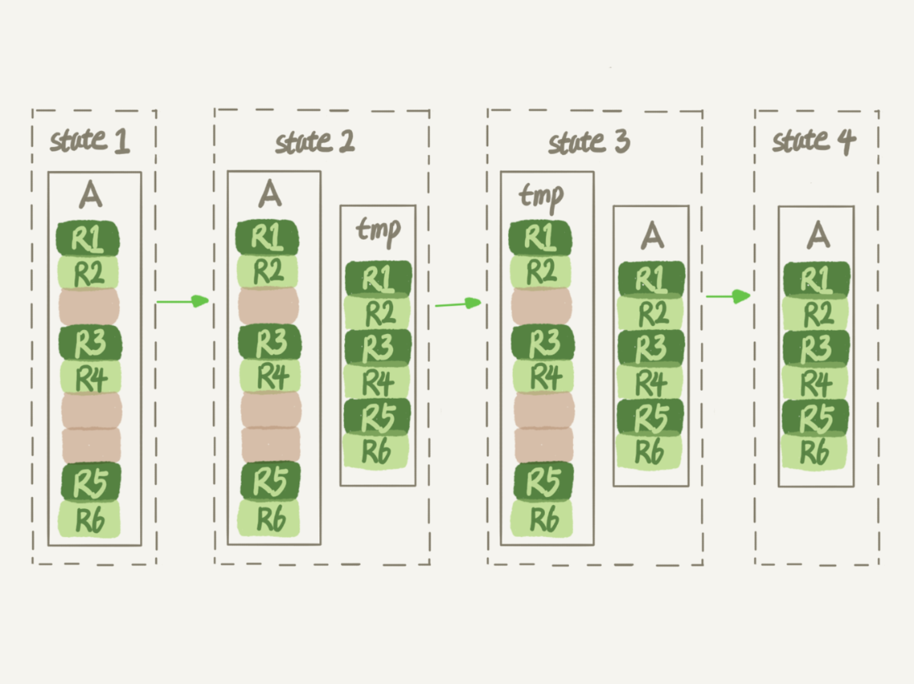

# 13讲为什么表数据删掉一半，表文件大小不变

经常会有同学来问我，我的数据库占用空间太大，我把一个最大的表删掉了一半的数据，怎么表文件的大小还是没变？

那么今天，我就和你聊聊数据库表的空间回收，看看如何解决这个问题。

这里，我们还是针对 MySQL 中应用最广泛的 InnoDB 引擎展开讨论。一个 InnoDB 表包含两部分，即：表结构定义和数据。在 MySQL 8.0 版本以前，表结构是存在以.frm 为后缀的文件里。而 MySQL 8.0 版本，则已经允许把表结构定义放在系统数据表中了。因为表结构定义占用的空间很小，所以我们今天主要讨论的是表数据。

接下来，我会先和你说明为什么简单地删除表数据达不到表空间回收的效果，然后再和你介绍正确回收空间的方法。

# 参数innodb_file_per_table

表数据既可以存在共享表空间里，也可以是单独的文件。这个行为是由参数 innodb_file_per_table 控制的：

1. 这个参数设置为 OFF 表示的是，表的数据放在系统共享表空间，也就是跟数据字典放在一起；
2. 这个参数设置为 ON 表示的是，每个 InnoDB 表数据存储在一个以 .ibd 为后缀的文件中。

从 MySQL 5.6.6 版本开始，它的默认值就是 ON 了。

我建议你不论使用 MySQL 的哪个版本，都将这个值设置为 ON。因为，一个表单独存储为一个文件更容易管理，而且在你不需要这个表的时候，通过 drop table 命令，系统就会直接删除这个文件。而如果是放在共享表空间中，即使表删掉了，空间也是不会回收的。

所以，**将innodb_file_per_table设置为ON，是推荐做法，我们接下来的讨论都是基于这个设置展开的。**

我们在删除整个表的时候，可以使用 drop table 命令回收表空间。但是，我们遇到的更多的删除数据的场景是删除某些行，这时就遇到了我们文章开头的问题：表中的数据被删除了，但是表空间却没有被回收。

我们要彻底搞明白这个问题的话，就要从数据删除流程说起了。

# 数据删除流程

我们先再来看一下 InnoDB 中一个索引的示意图。在前面[第4](https://time.geekbang.org/column/article/69236)和[第5](https://time.geekbang.org/column/article/69636)篇文章中，我和你介绍索引时曾经提到过，InnoDB 里的数据都是用 B+树的结构组织的。


图 1 B+树索引示意图

假设，我们要删掉 R4 这个记录，InnoDB 引擎只会把 R4 这个记录标记为删除。如果之后要再插入一个 ID 在 300 和 600 之间的记录时，可能会复用这个位置。但是，磁盘文件的大小并不会缩小。

现在，你已经知道了 InnoDB 的数据是按页存储的，那么如果我们删掉了一个数据页上的所有记录，会怎么样？

答案是，整个数据页就可以被复用了。

但是，**数据页的复用跟记录的复用是不同的。**

记录的复用，只限于符合范围条件的数据。比如上面的这个例子，R4 这条记录被删除后，如果插入一个 ID 是 400 的行，可以直接复用这个空间。但如果插入的是一个 ID 是 800 的行，就不能复用这个位置了。

而当整个页从 B+树里面摘掉以后，可以复用到任何位置。以图 1 为例，如果将数据页 page A 上的所有记录删除以后，page A 会被标记为可复用。这时候如果要插入一条 ID=50 的记录需要使用新页的时候，page A 是可以被复用的。

如果相邻的两个数据页利用率都很小，系统就会把这两个页上的数据合到其中一个页上，另外一个数据页就被标记为可复用。

进一步地，如果我们用 delete 命令把整个表的数据删除呢？结果就是，所有的数据页都会被标记为可复用。但是磁盘上，文件不会变小。

你现在知道了，delete 命令其实只是把记录的位置，或者数据页标记为了“可复用”，但磁盘文件的大小是不会变的。也就是说，通过 delete 命令是不能回收表空间的。这些可以复用，而没有被使用的空间，看起来就像是“空洞”。

实际上，**不止是删除数据会造成空洞，插入数据也会。**

如果数据是按照索引递增顺序插入的，那么索引是紧凑的。但如果数据是随机插入的，就可能造成索引的数据页分裂。

假设图 1 中 page A 已经满了，这时我要再插入一行数据，会怎样呢？


图 2 插入数据导致页分裂

可以看到，由于 page A 满了，再插入一个 ID 是 550 的数据时，就不得不再申请一个新的页面 page B 来保存数据了。页分裂完成后，page A 的末尾就留下了空洞（注意：实际上，可能不止 1 个记录的位置是空洞）。

另外，更新索引上的值，可以理解为删除一个旧的值，再插入一个新值。不难理解，这也是会造成空洞的。

也就是说，经过大量增删改的表，都是可能是存在空洞的。所以，如果能够把这些空洞去掉，就能达到收缩表空间的目的。

而重建表，就可以达到这样的目的。

# 重建表

试想一下，如果你现在有一个表 A，需要做空间收缩，为了把表中存在的空洞去掉，你可以怎么做呢？

你可以新建一个与表 A 结构相同的表 B，然后按照主键 ID 递增的顺序，把数据一行一行地从表 A 里读出来再插入到表 B 中。

由于表 B 是新建的表，所以表 A 主键索引上的空洞，在表 B 中就都不存在了。显然地，表 B 的主键索引更紧凑，数据页的利用率也更高。如果我们把表 B 作为临时表，数据从表 A 导入表 B 的操作完成后，用表 B 替换 A，从效果上看，就起到了收缩表 A 空间的作用。

这里，你可以使用 alter table A engine=InnoDB 命令来重建表。在 MySQL 5.5 版本之前，这个命令的执行流程跟我们前面描述的差不多，区别只是这个临时表 B 不需要你自己创建，MySQL 会自动完成转存数据、交换表名、删除旧表的操作。



图 3 改锁表 DDL

显然，花时间最多的步骤是往临时表插入数据的过程，如果在这个过程中，有新的数据要写入到表 A 的话，就会造成数据丢失。因此，在整个 DDL 过程中，表 A 中不能有更新。也就是说，这个 DDL 不是 Online 的。

而在**MySQL 5.6版本开始引入的Online DDL，对这个操作流程做了优化。**

我给你简单描述一下引入了 Online DDL 之后，重建表的流程：

1. 建立一个临时文件，扫描表 A 主键的所有数据页；
2. 用数据页中表 A 的记录生成 B+树，存储到临时文件中；
3. 生成临时文件的过程中，将所有对 A 的操作记录在一个日志文件（row log）中，对应的是图中 state2 的状态；
4. 临时文件生成后，将日志文件中的操作应用到临时文件，得到一个逻辑数据上与表 A 相同的数据文件，对应的就是图中 state3 的状态；
5. 用临时文件替换表 A 的数据文件。


图 4 Online DDL

可以看到，与图 3 过程的不同之处在于，由于日志文件记录和重放操作这个功能的存在，这个方案在重建表的过程中，允许对表 A 做增删改操作。这也就是 Online DDL 名字的来源。

我记得有同学在第 6 篇讲表锁的文章[《全局锁和表锁 ：给表加个字段怎么索这么多阻碍？》](https://time.geekbang.org/column/article/69862)的评论区留言说，DDL 之前是要拿 MDL 写锁的，这样还能叫 Online DDL 吗？

确实，图 4 的流程中，alter 语句在启动的时候需要获取 MDL 写锁，但是这个写锁在真正拷贝数据之前就退化成读锁了。

为什么要退化呢？为了实现 Online，MDL 读锁不会阻塞增删改操作。

那为什么不干脆直接解锁呢？为了保护自己，禁止其他线程对这个表同时做 DDL。

而对于一个大表来说，Online DDL 最耗时的过程就是拷贝数据到临时表的过程，这个步骤的执行期间可以接受增删改操作。所以，相对于整个 DDL 过程来说，锁的时间非常短。对业务来说，就可以认为是 Online 的。

需要补充说明的是，上述的这些重建方法都会扫描原表数据和构建临时文件。对于很大的表来说，这个操作是很消耗 IO 和 CPU 资源的。因此，如果是线上服务，你要很小心地控制操作时间。如果想要比较安全的操作的话，我推荐你使用 GitHub 开源的 gh-ost 来做。

# Online 和 inplace

说到 Online，我还要再和你澄清一下它和另一个跟 DDL 有关的、容易混淆的概念 inplace 的区别。

你可能注意到了，在图 3 中，我们把表 A 中的数据导出来的存放位置叫作 tmp_table。这是一个临时表，是在 server 层创建的。

在图 4 中，根据表 A 重建出来的数据是放在“tmp_file”里的，这个临时文件是 InnoDB 在内部创建出来的。整个 DDL 过程都在 InnoDB 内部完成。对于 server 层来说，没有把数据挪动到临时表，是一个“原地”操作，这就是“inplace”名称的来源。

所以，我现在问你，如果你有一个 1TB 的表，现在磁盘间是 1.2TB，能不能做一个 inplace 的 DDL 呢？

答案是不能。因为，tmp_file 也是要占用临时空间的。

我们重建表的这个语句 alter table t engine=InnoDB，其实隐含的意思是：

```
alter table t engine=innodb,ALGORITHM=inplace;
```

跟 inplace 对应的就是拷贝表的方式了，用法是：

```
alter table t engine=innodb,ALGORITHM=copy;
```

当你使用 ALGORITHM=copy 的时候，表示的是强制拷贝表，对应的流程就是图 3 的操作过程。

但我这样说你可能会觉得，inplace 跟 Online 是不是就是一个意思？

其实不是的，只是在重建表这个逻辑中刚好是这样而已。

比如，如果我要给 InnoDB 表的一个字段加全文索引，写法是：

```
alter table t add FULLTEXT(field_name);
```

这个过程是 inplace 的，但会阻塞增删改操作，是非 Online 的。

如果说这两个逻辑之间的关系是什么的话，可以概括为：

1. DDL 过程如果是 Online 的，就一定是 inplace 的；
2. 反过来未必，也就是说 inplace 的 DDL，有可能不是 Online 的。截止到 MySQL 8.0，添加全文索引（FULLTEXT index）和空间索引(SPATIAL index)就属于这种情况。

最后，我们再延伸一下。

在第 10 篇文章[《MySQL为什么有时候会选错索引》](https://time.geekbang.org/column/article/71173)的评论区中，有同学问到使用 optimize table、analyze table 和 alter table 这三种方式重建表的区别。这里，我顺便再简单和你解释一下。

- 从 MySQL 5.6 版本开始，alter table t engine = InnoDB（也就是 recreate）默认的就是上面图 4 的流程了；
- analyze table t 其实不是重建表，只是对表的索引信息做重新统计，没有修改数据，这个过程中加了 MDL 读锁；
- optimize table t 等于 recreate+analyze。

# 小结

今天这篇文章，我和你讨论了数据库中收缩表空间的方法。

现在你已经知道了，如果要收缩一个表，只是 delete 掉表里面不用的数据的话，表文件的大小是不会变的，你还要通过 alter table 命令重建表，才能达到表文件变小的目的。我跟你介绍了重建表的两种实现方式，Online DDL 的方式是可以考虑在业务低峰期使用的，而 MySQL 5.5 及之前的版本，这个命令是会阻塞 DML 的，这个你需要特别小心。

最后，又到了我们的课后问题时间。

假设现在有人碰到了一个“想要收缩表空间，结果适得其反”的情况，看上去是这样的：

1. 一个表 t 文件大小为 1TB；
2. 对这个表执行 alter table t engine=InnoDB；
3. 发现执行完成后，空间不仅没变小，还稍微大了一点儿，比如变成了 1.01TB。

你觉得可能是什么原因呢 ？

你可以把你觉得可能的原因写在留言区里，我会在下一篇文章的末尾把大家描述的合理的原因都列出来，以后其他同学就不用掉到这样的坑里了。感谢你的收听，也欢迎你把这篇文章分享给更多的朋友一起阅读。

# 上期问题时间

在上期文章最后，我留给你的问题是，如果一个高配的机器，redo log 设置太小，会发生什么情况。

每次事务提交都要写 redo log，如果设置太小，很快就会被写满，也就是下面这个图的状态，这个“环”将很快被写满，write pos 一直追着 CP。


这时候系统不得不停止所有更新，去推进 checkpoint。

这时，你看到的现象就是**磁盘压力很小，但是数据库出现间歇性的性能下跌。**

评论区留言点赞板：

> @某、人 给了一个形象的描述，而且提到了，在这种情况下，连change buffer的优化也失效了。因为checkpoint一直要往前推，这个操作就会触发merge操作，然后又进一步地触发刷脏页操作；
> 有几个同学提到了内存淘汰脏页，对应的redo log的操作，这个我们会在后面的文章中展开，大家可以先看一下 @melon 同学的描述了解一下；
> @算不出流源 提到了“动态平衡”，其实只要出现了这种“平衡”，意味着本应该后台的操作，就已经影响了业务应用，属于有损失的平衡。

## 精选留言

- 

    undifined

    老师，有几个问题：
    1.Truncate 会释放表空间吗
    2.重建表的时候如果没有数据更新，有没有可能产生页分裂和空洞
    3.页分裂是发生在索引还是数据上
    4.应用 row log 的过程会不会再次产生页分裂和空洞
    5.不影响增删改，就是 Online；相对 Server层没有新建临时表，就是 inplace，这里怎么判断是不是相对 Server 层没有新建临时表
    辛苦老师解答一下，谢谢老师

    2018-12-12 10:41

    作者回复

    \1. Truncate 可以理解为drop+create
    \2. Online 可以认为没有
    \3. 数据也是索引哦
    \4. 可能会
    \5. 好问题，我放到明天答疑部分

    2018-12-12 11:16

- 

    郜

    麻烦咨询个问题，“在图 3 中，我们把表 A 中的数据导出来的存放位置叫作 tmp_table。这是一个临时表，是在 server 层创建的。”
    在server层创建的表也是将A表数据copy到了临时表，为什么在空间不够用时就没有问题，而inplace在InnoDB执行则会再占用一份存储？

    

    2018-12-13 11:07

    作者回复

    额，

    Copy的时候肯定更要的…

    这里特别指出来，是因为大多数人很容易理解copy需要临时空间，但是误以为inplace不需要

    
    Anyway,好问题

    2018-12-13 18:13

- 

    陈飞

    老师，请问下分布式ID（雪花算法生成的ID）生成的索引会比自增长的ID性能低吗？

    雪花算法生成的ID是越来越大的，但不是逐渐递增，长度用的的bitint，麻烦解答下，非常感谢。

    2018-12-13 13:57

    作者回复

    好问题。

    
    性能一样的，没有一定要“连续”，只要是递增

    2018-12-13 18:11

- 

    发条橙子 。

    老师 ， 我的确实是 5.7 版本。我今天看了些关于 online ddl的文章 ，再结合表锁那章评论的内容，有几个点还想确认一下 ，希望老师能解答一下 。

    \1. 是不是 5.6 之后 所有的 alter 操作(增删字段、增删索引等)都是支持 online ddl

    \2. 如果 alter 都是 online ddl 那么是不是如果 alter操作 获取到mdl写锁 时， 后面的 查询需要mdl读锁会暂时阻塞， 但是mdl会马上降为读锁 ，后面的操作会继续进行不会堵塞 。等再升到写锁 ，后面操作又会暂时阻塞。

    \3. 当 alter 降到mdl 读锁时 ， 这时候可以新增数据么 ， mdl表级读锁 不会影响到 insert 或者 update的行锁么

    \4. 如果将 alter 操作显式的放到事务里 ，事务不提交 ， 另一个事务查询的时候会查询到alter 操作后的表结构 ， 比如新增了一个字段。这个是什么原因 ，是否打破了 mvcc 的定义呢

    2018-12-13 23:49

    作者回复

    \1. 不是哦，我文章里说的加全文索引就不online

    \2. 对，这两个暂时，都是时间很短的

    \3. 是，DML语句加的是MDL读锁，读读不冲突

    \4. 好问题 ， 不过alter table 语句会默认提交前面的事务，然后自己独立执行

    2018-12-14 00:36

- 

    飞翔

    我想到的其中一种可能：
    本来就很紧凑，没能整出多少剩余空间。
    重新收缩的过程中，页会按90%满的比例来重新整理页数据（10%留给UPDATE使用），
    未整理之前页已经占用90%以上，收缩之后，文件就反而变大了。

    2018-12-12 11:16

    作者回复

    一个漂亮的答案

    2018-12-12 11:43

- 

    帆帆帆帆帆帆帆帆

    @undifined怎么判断是不是相对 Server 层没有新建临时表。一个最直观的判断方法是看命令执行后影响的行数，没有新建临时表的话新建的行数是0。

    2018-12-12 14:41

    作者回复

    ，下一篇答疑直接贴你答案

    2018-12-12 17:56

- 

    某、人

    通过第10期的课后思考题学习到如果delete的数据还会被用于MVCC,那么该数据页(二级索引和聚簇索引)上的记录不会被物理删除,是被标记删除。只有当该事务不会用于mvcc了,才可以被purge线程把之前标记删除的数据真正删除掉.但是即便数据物理删除了,磁盘空间也不会返回给操作系统.可以通过show table status like 't';观察data_free来预估该表的碎片。如果过大,可以用alter table t engine=innodb来清除
    我有几个问题请教下老师:
    1.inplace相对于其他在线改表软件,多了MDL X锁.既然都是通过临时表/文件来做,为什么一开始要上MDL X锁？
    2.gh-ost使用binlog来做同步,假设从position 1开始,先lock S前面1000条数据做cp,这时有事务对后面1000条数据做了修改或者插入。等cp后面这个1000条时,会把修改好的数据cp到临时表.最后又应用binlog,那么这相当于做了两次操作,请问这部分数据是怎么处理的？
    3.online会把过程中对表的操作记录在一个(row log)中,那么中途这些DML事务,是怎么判定的commit?我做测试,中途这些事务都是成功的。但是有在做online DDL快完了,commit那个阶段,DDL报唯一键冲突,这又是什么原因造成的啊？我没有模拟出来这个例子

    2018-12-13 20:26

    作者回复

    \1. 确保没有启发请求在用这个表

    \2. Binlog设置为row格式，幂等的

    \3. 这个我觉得其实是bug,就没提。你在DDL期间，往原表插入一个已经存在相同主键的一行试试

    2018-12-13 21:51

- 

    尘封

    老师，请教一个问题，和本文无关，既然mysql支持了打包数据排序模式，能够更紧凑的分配内存进行排序，那定义表结构的时候，varchar(10)存储hello和varchar(100)存储hello的优势在哪里呢？谢谢

    2018-12-12 07:32

    作者回复

    你这个问题放在第16篇问就刚刚好了。

    以前不支持紧凑排序的时候有，现在没啥了差别了，小于256都差不多

    2018-12-12 10:47

- 

    V。

    可能性有两个。
    \1. 生成临时表过程中，row log中新增的数据较多，导致表的行数变多。
    \2. 生成临时表过程中，row log中有部分插入和删除操作会产生“空洞”。
    个人感觉，第一种情况，突然多了高于1％的数据，比较少见；但第二种情况，在某些业务中，经常出现。

    2018-12-12 09:46

- 

    库淘淘

    alter table A engine=InnoDB 中由写锁降为读锁。有个疑问 为何不直接就加个MDL读锁 ,这样DDL 也执行不了,应用redo 替换文件后释放读锁即可

    2018-12-13 16:04

    作者回复

    如果有别的线程正在读这个表的数据，得等下

    2018-12-13 18:07

- 

    lionetes

    在alter table engine =innodb 未完成前,做了DML 操作, 并且是在已经重构完的数据引起的DML操作，产生了空洞. 导致变大 重构未处理的数据 即使产生了 空洞，到100% 后也能清理碎片空间.

    truncate table 里面的 数据 不产生 binlog,无法恢复， 如果速度上面来讲 还是drop table 更快. 但对于 超大的table 做drop， truncate 时候也是很危险了，容易整个数据库 hang 住，因为要对 buffer pool 中对应的页面清除, 可以对ibd 文件做 ln 操作生成 ibd.hdlk 然后 rm -f ibd 最后 drop table 会很快

    对经常delete 数据的表 用以前讲的 循环删除 方法，来删除 也是 不错的. 当然要根据情况做 碎片整理

    2018-12-12 22:34

- 

    帆帆帆帆帆帆帆帆

    执行完成后，空间不仅没变小，还稍微大了一点儿。比较常见的情况是表上只有insert，没有update的情况，如一些存放历史操作记录的表。

    2018-12-12 14:42

- 

    wang chen wen

    optimize table t 等于 recreate+analyze
    老师请教个问题recreate出来应该是几乎全新的，analyze的必要性？

    2018-12-12 09:45

    作者回复

    好问题，这个得是比较极端的情况下才有必要，所以我比较喜欢直接用alter

    2018-12-12 10:30

- 

    天王

    delete删除表数据，只是打上一个可复用标记，如果是数据页上一部分数据打上标记，如果按照自增主键insert数据，那表空间的数据不会复用，如果是整个数据页的所有数据打上标记，那么可以复用。2个3相临的数据页，如果空洞太多，合并成一个页，另外一个可以标记复用。重建表可以减少空洞，文件大小可以减小，本质上是通过，创建临时文件，将数据在临时文件上，重建一份，重建过程，按照顺序插入，极大减少了黑洞，数据都拷贝到临时文件以后，会有删除原来文件，切换到新文件。文件会减小了。

    

    

    2018-12-12 09:14

    作者回复

    

    2018-12-12 10:32

- 

    杰之7

    通过这一节的阅读学习，了解了删除表中的数据以后，表的大小并没有减少，这种现象我们叫做空洞，对于增删改都会产生这种现象。为什么会是这样，我想是计算机系统或许内存方面的内容。

    对于这种现象，老师给予的解决方法是重建表，就是将原表数据重新建立在一张表。同时在高版本Mysql的Innodb支持online操作，同时，老师解释了onplace和inplace的区别。

    中途有两个礼拜没有跟上进度学习，很惭愧，接下来一月会尽快跟上老师的步伐。

    2019-01-10 13:21

- 

    金龟

    老师，请教个问题，在innodb中是不是b+树的每个节点都是一页，比如最上层的根节点就是一页。下层有5个节点就是5页。

    2018-12-30 11:45

    作者回复

    是的

    2018-12-30 19:31

- 

    海曙云崖

    怎么判断online DDL 的阶段是在MDL还是读锁阶段呢

    2018-12-26 15:10

    作者回复

    Show processlist可以看到

    不过MDL锁阶段很短

    2018-12-26 17:06

- 

    三木禾

    数据页A满了，随机插入一条数据，不得不申请一个新的数据页，这时候数据页A会留下空洞，我的问题是，既然满了，为什么还有空洞呢？

    2018-12-24 15:18

    作者回复

    申请新页B，把一部分数据从A挪到B，A就空出一些

    2018-12-24 16:20

- 

    zzkkll99

    老师我想问一下，为什么对表结构进行修改要读原数据。不可以直接修改吗

    2018-12-20 17:28

    作者回复

    你说的原数据是说表里的数据吗？

    MySQL 官方版本还不支持只改表结构

    2018-12-20 18:07

- 

    壹口尘埃

    网上找到一个Inplace和Online的区别，写的挺好的，贴出来方便大家理解：
    MySQL各版本，对于add Index的处理方式是不同的，主要有三种：

    （1）Copy Table方式
    这是InnoDB最早支持的创建索引的方式。顾名思义，创建索引是通过临时表拷贝的方式实现的。

    新建一个带有新索引的临时表，将原表数据全部拷贝到临时表，然后Rename，完成创建索引的操作。

    这个方式创建索引，创建过程中，原表是可读的。但是会消耗一倍的存储空间。

    （2）Inplace方式
    这是原生MySQL 5.5，以及innodb_plugin中提供的创建索引的方式。所谓Inplace，也就是索引创建在原表上直接进行，不会拷贝临时表。相对于Copy Table方式，这是一个进步。

    Inplace方式创建索引，创建过程中，原表同样可读的，但是不可写。

    （3）Online方式
    这是MySQL 5.6.7中提供的创建索引的方式。无论是Copy Table方式，还是Inplace方式，创建索引的过程中，原表只能允许读取，不可写。对应用有较大的限制，因此MySQL最新版本中，InnoDB支持了所谓的Online方式创建索引。

    InnoDB的Online Add Index，首先是Inplace方式创建索引，无需使用临时表。在遍历聚簇索引，收集记录并插入到新索引的过程中，原表记录可修改。而修改的记录保存在Row Log中。当聚簇索引遍历完毕，并全部插入到新索引之后，重放Row Log中的记录修改，使得新索引与聚簇索引记录达到一致状态。

    与Copy Table方式相比，Online Add Index采用的是Inplace方式，无需Copy Table，减少了空间开销；与此同时，Online Add Index只有在重放Row Log最后一个Block时锁表，减少了锁表的时间。

    与Inplace方式相比，Online Add Index吸收了Inplace方式的优势，却减少了锁表的时间。

    2018-12-19 14:40