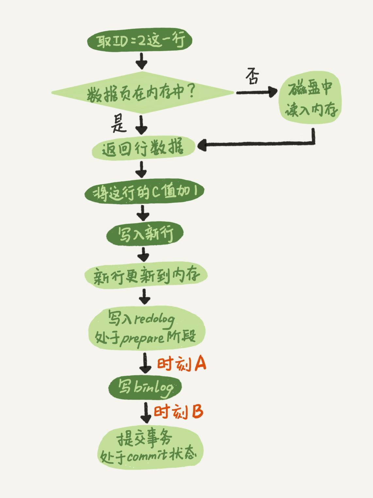
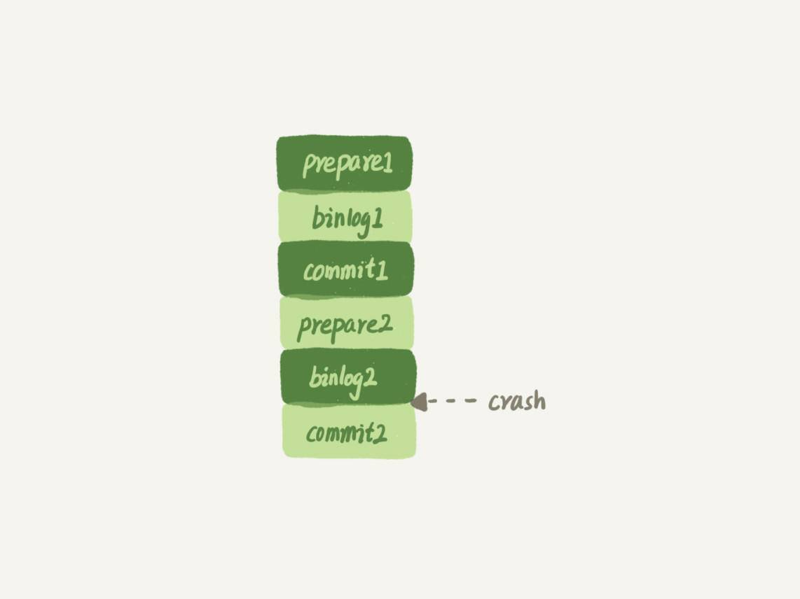

# 15讲答疑文章（一）：日志和索引相关问题

在今天这篇答疑文章更新前，MySQL实战这个专栏已经更新了14篇。在这些文章中，大家在评论区留下了很多高质量的留言。现在，每篇文章的评论区都有热心的同学帮忙总结文章知识点，也有不少同学提出了很多高质量的问题，更有一些同学帮忙解答其他同学提出的问题。

在浏览这些留言并回复的过程中，我倍受鼓舞，也尽我所知地帮助你解决问题、和你讨论。可以说，你们的留言活跃了整个专栏的氛围、提升了整个专栏的质量，谢谢你们。

评论区的大多数留言我都直接回复了，对于需要展开说明的问题，我都拿出小本子记了下来。这些被记下来的问题，就是我们今天这篇答疑文章的素材了。

到目前为止，我已经收集了47个问题，很难通过今天这一篇文章全部展开。所以，我就先从中找了几个联系非常紧密的问题，串了起来，希望可以帮你解决关于日志和索引的一些疑惑。而其他问题，我们就留着后面慢慢展开吧。

# 日志相关问题

我在第2篇文章[《日志系统：一条SQL更新语句是如何执行的？》](https://time.geekbang.org/column/article/68633)中，和你讲到binlog（归档日志）和redo log（重做日志）配合崩溃恢复的时候，用的是反证法，说明了如果没有两阶段提交，会导致MySQL出现主备数据不一致等问题。

在这篇文章下面，很多同学在问，在两阶段提交的不同瞬间，MySQL如果发生异常重启，是怎么保证数据完整性的？

现在，我们就从这个问题开始吧。

我再放一次两阶段提交的图，方便你学习下面的内容。



图1 两阶段提交示意图

这里，我要先和你解释一个误会式的问题。有同学在评论区问到，这个图不是一个update语句的执行流程吗，怎么还会调用commit语句？

他产生这个疑问的原因，是把**两个“commit”的概念**混淆了：

- 他说的“commit语句”，是指MySQL语法中，用于提交一个事务的命令。一般跟begin/start transaction 配对使用。
- 而我们图中用到的这个“commit步骤”，指的是事务提交过程中的一个小步骤，也是最后一步。当这个步骤执行完成后，这个事务就提交完成了。
- “commit语句”执行的时候，会包含“commit 步骤”。

而我们这个例子里面，没有显式地开启事务，因此这个update语句自己就是一个事务，在执行完成后提交事务时，就会用到这个“commit步骤“。

接下来，我们就一起分析一下**在两阶段提交的不同时刻，MySQL异常重启会出现什么现象。**

如果在图中时刻A的地方，也就是写入redo log 处于prepare阶段之后、写binlog之前，发生了崩溃（crash），由于此时binlog还没写，redo log也还没提交，所以崩溃恢复的时候，这个事务会回滚。这时候，binlog还没写，所以也不会传到备库。到这里，大家都可以理解。

大家出现问题的地方，主要集中在时刻B，也就是binlog写完，redo log还没commit前发生crash，那崩溃恢复的时候MySQL会怎么处理？

我们先来看一下崩溃恢复时的判断规则。

1. 如果redo log里面的事务是完整的，也就是已经有了commit标识，则直接提交；
2. 如果redo log里面的事务只有完整的prepare，则判断对应的事务binlog是否存在并完整：
    a. 如果是，则提交事务；
    b. 否则，回滚事务。

这里，时刻B发生crash对应的就是2(a)的情况，崩溃恢复过程中事务会被提交。

现在，我们继续延展一下这个问题。

## 追问1：MySQL怎么知道binlog是完整的?

回答：一个事务的binlog是有完整格式的：

- statement格式的binlog，最后会有COMMIT；
- row格式的binlog，最后会有一个XID event。

另外，在MySQL 5.6.2版本以后，还引入了binlog-checksum参数，用来验证binlog内容的正确性。对于binlog日志由于磁盘原因，可能会在日志中间出错的情况，MySQL可以通过校验checksum的结果来发现。所以，MySQL还是有办法验证事务binlog的完整性的。

## 追问2：redo log 和 binlog是怎么关联起来的?

回答：它们有一个共同的数据字段，叫XID。崩溃恢复的时候，会按顺序扫描redo log：

- 如果碰到既有prepare、又有commit的redo log，就直接提交；
- 如果碰到只有parepare、而没有commit的redo log，就拿着XID去binlog找对应的事务。

## 追问3：处于prepare阶段的redo log加上完整binlog，重启就能恢复，MySQL为什么要这么设计?

回答：其实，这个问题还是跟我们在反证法中说到的数据与备份的一致性有关。在时刻B，也就是binlog写完以后MySQL发生崩溃，这时候binlog已经写入了，之后就会被从库（或者用这个binlog恢复出来的库）使用。

所以，在主库上也要提交这个事务。采用这个策略，主库和备库的数据就保证了一致性。

## 追问4：如果这样的话，为什么还要两阶段提交呢？干脆先redo log写完，再写binlog。崩溃恢复的时候，必须得两个日志都完整才可以。是不是一样的逻辑？

回答：其实，两阶段提交是经典的分布式系统问题，并不是MySQL独有的。

如果必须要举一个场景，来说明这么做的必要性的话，那就是事务的持久性问题。

对于InnoDB引擎来说，如果redo log提交完成了，事务就不能回滚（如果这还允许回滚，就可能覆盖掉别的事务的更新）。而如果redo log直接提交，然后binlog写入的时候失败，InnoDB又回滚不了，数据和binlog日志又不一致了。

两阶段提交就是为了给所有人一个机会，当每个人都说“我ok”的时候，再一起提交。

## 追问5：不引入两个日志，也就没有两阶段提交的必要了。只用binlog来支持崩溃恢复，又能支持归档，不就可以了？

回答：这位同学的意思是，只保留binlog，然后可以把提交流程改成这样：… -> “数据更新到内存” -> “写 binlog” -> “提交事务”，是不是也可以提供崩溃恢复的能力？

答案是不可以。

如果说**历史原因**的话，那就是InnoDB并不是MySQL的原生存储引擎。MySQL的原生引擎是MyISAM，设计之初就有没有支持崩溃恢复。

InnoDB在作为MySQL的插件加入MySQL引擎家族之前，就已经是一个提供了崩溃恢复和事务支持的引擎了。

InnoDB接入了MySQL后，发现既然binlog没有崩溃恢复的能力，那就用InnoDB原有的redo log好了。

而如果说**实现上的原因**的话，就有很多了。就按照问题中说的，只用binlog来实现崩溃恢复的流程，我画了一张示意图，这里就没有redo log了。



图2 只用binlog支持崩溃恢复

这样的流程下，binlog还是不能支持崩溃恢复的。我说一个不支持的点吧：binlog没有能力恢复“数据页”。

如果在图中标的位置，也就是binlog2写完了，但是整个事务还没有commit的时候，MySQL发生了crash。

重启后，引擎内部事务2会回滚，然后应用binlog2可以补回来；但是对于事务1来说，系统已经认为提交完成了，不会再应用一次binlog1。

但是，InnoDB引擎使用的是WAL技术，执行事务的时候，写完内存和日志，事务就算完成了。如果之后崩溃，要依赖于日志来恢复数据页。

也就是说在图中这个位置发生崩溃的话，事务1也是可能丢失了的，而且是数据页级的丢失。此时，binlog里面并没有记录数据页的更新细节，是补不回来的。

你如果要说，那我优化一下binlog的内容，让它来记录数据页的更改可以吗？但，这其实就是又做了一个redo log出来。

所以，至少现在的binlog能力，还不能支持崩溃恢复。

## 追问6：那能不能反过来，只用redo log，不要binlog？

回答：如果只从崩溃恢复的角度来讲是可以的。你可以把binlog关掉，这样就没有两阶段提交了，但系统依然是crash-safe的。

但是，如果你了解一下业界各个公司的使用场景的话，就会发现在正式的生产库上，binlog都是开着的。因为binlog有着redo log无法替代的功能。

一个是归档。redo log是循环写，写到末尾是要回到开头继续写的。这样历史日志没法保留，redo log也就起不到归档的作用。

一个就是MySQL系统依赖于binlog。binlog作为MySQL一开始就有的功能，被用在了很多地方。其中，MySQL系统高可用的基础，就是binlog复制。

还有很多公司有异构系统（比如一些数据分析系统），这些系统就靠消费MySQL的binlog来更新自己的数据。关掉binlog的话，这些下游系统就没法输入了。

总之，由于现在包括MySQL高可用在内的很多系统机制都依赖于binlog，所以“鸠占鹊巢”redo log还做不到。你看，发展生态是多么重要。

## 追问7：redo log一般设置多大？

回答：redo log太小的话，会导致很快就被写满，然后不得不强行刷redo log，这样WAL机制的能力就发挥不出来了。

所以，如果是现在常见的几个TB的磁盘的话，就不要太小气了，直接将redo log设置为4个文件、每个文件1GB吧。

## 追问8：正常运行中的实例，数据写入后的最终落盘，是从redo log更新过来的还是从buffer pool更新过来的呢？

回答：这个问题其实问得非常好。这里涉及到了，“redo log里面到底是什么”的问题。

实际上，redo log并没有记录数据页的完整数据，所以它并没有能力自己去更新磁盘数据页，也就不存在“数据最终落盘，是由redo log更新过去”的情况。

1. 如果是正常运行的实例的话，数据页被修改以后，跟磁盘的数据页不一致，称为脏页。最终数据落盘，就是把内存中的数据页写盘。这个过程，甚至与redo log毫无关系。
2. 在崩溃恢复场景中，InnoDB如果判断到一个数据页可能在崩溃恢复的时候丢失了更新，就会将它读到内存，然后让redo log更新内存内容。更新完成后，内存页变成脏页，就回到了第一种情况的状态。

## 追问9：redo log buffer是什么？是先修改内存，还是先写redo log文件？

回答：这两个问题可以一起回答。

在一个事务的更新过程中，日志是要写多次的。比如下面这个事务：

```
begin;
insert into t1 ...
insert into t2 ...
commit;
```

这个事务要往两个表中插入记录，插入数据的过程中，生成的日志都得先保存起来，但又不能在还没commit的时候就直接写到redo log文件里。

所以，redo log buffer就是一块内存，用来先存redo日志的。也就是说，在执行第一个insert的时候，数据的内存被修改了，redo log buffer也写入了日志。

但是，真正把日志写到redo log文件（文件名是 ib_logfile+数字），是在执行commit语句的时候做的。

（这里说的是事务执行过程中不会“主动去刷盘”，以减少不必要的IO消耗。但是可能会出现“被动写入磁盘”，比如内存不够、其他事务提交等情况。这个问题我们会在后面第22篇文章《MySQL有哪些“饮鸩止渴”的提高性能的方法？》中再详细展开）。

单独执行一个更新语句的时候，InnoDB会自己启动一个事务，在语句执行完成的时候提交。过程跟上面是一样的，只不过是“压缩”到了一个语句里面完成。

以上这些问题，就是把大家提过的关于redo log和binlog的问题串起来，做的一次集中回答。如果你还有问题，可以在评论区继续留言补充。

# 业务设计问题

接下来，我再和你分享@ithunter 同学在第8篇文章[《](https://time.geekbang.org/column/article/70562)[事务到底是隔离的还是不隔离的？](https://time.geekbang.org/column/article/70562)[》](https://time.geekbang.org/column/article/70562)的评论区提到的跟索引相关的一个问题。我觉得这个问题挺有趣、也挺实用的，其他同学也可能会碰上这样的场景，在这里解答和分享一下。

问题是这样的（我文字上稍微做了点修改，方便大家理解）：

> 业务上有这样的需求，A、B两个用户，如果互相关注，则成为好友。设计上是有两张表，一个是like表，一个是friend表，like表有user_id、liker_id两个字段，我设置为复合唯一索引即uk_user_id_liker_id。语句执行逻辑是这样的：

> 以A关注B为例：
> 第一步，先查询对方有没有关注自己（B有没有关注A）
> select * from like where user_id = B and liker_id = A;

> 如果有，则成为好友
> insert into friend;

> 没有，则只是单向关注关系
> insert into like;

> 但是如果A、B同时关注对方，会出现不会成为好友的情况。因为上面第1步，双方都没关注对方。第1步即使使用了排他锁也不行，因为记录不存在，行锁无法生效。请问这种情况，在MySQL锁层面有没有办法处理？

首先，我要先赞一下这样的提问方式。虽然极客时间现在的评论区还不能追加评论，但如果大家能够一次留言就把问题讲清楚的话，其实影响也不大。所以，我希望你在留言提问的时候，也能借鉴这种方式。

接下来，我把@ithunter 同学说的表模拟出来，方便我们讨论。

```
CREATE TABLE `like` (
  `id` int(11) NOT NULL AUTO_INCREMENT,
  `user_id` int(11) NOT NULL,
  `liker_id` int(11) NOT NULL,
  PRIMARY KEY (`id`),
  UNIQUE KEY `uk_user_id_liker_id` (`user_id`,`liker_id`)
) ENGINE=InnoDB;

CREATE TABLE `friend` (
  id` int(11) NOT NULL AUTO_INCREMENT,
  `friend_1_id` int(11) NOT NULL,
  `firned_2_id` int(11) NOT NULL,
  UNIQUE KEY `uk_friend` (`friend_1_id`,`firned_2_id`)
  PRIMARY KEY (`id`)
) ENGINE=InnoDB;
```

虽然这个题干中，并没有说到friend表的索引结构。但我猜测friend_1_id和friend_2_id也有索引，为便于描述，我给加上唯一索引。

顺便说明一下，“like”是关键字，我一般不建议使用关键字作为库名、表名、字段名或索引名。

我把他的疑问翻译一下，在并发场景下，同时有两个人，设置为关注对方，就可能导致无法成功加为朋友关系。

现在，我用你已经熟悉的时刻顺序表的形式，把这两个事务的执行语句列出来：


图3 并发“喜欢”逻辑操作顺序

由于一开始A和B之间没有关注关系，所以两个事务里面的select语句查出来的结果都是空。

因此，session 1的逻辑就是“既然B没有关注A，那就只插入一个单向关注关系”。session 2也同样是这个逻辑。

这个结果对业务来说就是bug了。因为在业务设定里面，这两个逻辑都执行完成以后，是应该在friend表里面插入一行记录的。

如提问里面说的，“第1步即使使用了排他锁也不行，因为记录不存在，行锁无法生效”。不过，我想到了另外一个方法，来解决这个问题。

首先，要给“like”表增加一个字段，比如叫作 relation_ship，并设为整型，取值1、2、3。

> 值是1的时候，表示user_id 关注 liker_id;
> 值是2的时候，表示liker_id 关注 user_id;
> 值是3的时候，表示互相关注。

然后，当 A关注B的时候，逻辑改成如下所示的样子：

应用代码里面，比较A和B的大小，如果A<B，就执行下面的逻辑

```
mysql> begin; /*启动事务*/
insert into `like`(user_id, liker_id, relation_ship) values(A, B, 1) on duplicate key update relation_ship=relation_ship | 1;
select relation_ship from `like` where user_id=A and liker_id=B;
/*代码中判断返回的 relation_ship，
  如果是1，事务结束，执行 commit
  如果是3，则执行下面这两个语句：
  */
insert ignore into friend(friend_1_id, friend_2_id) values(A,B);
commit;
```

如果A>B，则执行下面的逻辑

```
mysql> begin; /*启动事务*/
insert into `like`(user_id, liker_id, relation_ship) values(B, A, 2) on duplicate key update relation_ship=relation_ship | 2;
select relation_ship from `like` where user_id=B and liker_id=A;
/*代码中判断返回的 relation_ship，
  如果是2，事务结束，执行 commit
  如果是3，则执行下面这两个语句：
*/
insert ignore into friend(friend_1_id, friend_2_id) values(B,A);
commit;
```

这个设计里，让“like”表里的数据保证user_id < liker_id，这样不论是A关注B，还是B关注A，在操作“like”表的时候，如果反向的关系已经存在，就会出现行锁冲突。

然后，insert … on duplicate语句，确保了在事务内部，执行了这个SQL语句后，就强行占住了这个行锁，之后的select 判断relation_ship这个逻辑时就确保了是在行锁保护下的读操作。

操作符 “|” 是按位或，连同最后一句insert语句里的ignore，是为了保证重复调用时的幂等性。

这样，即使在双方“同时”执行关注操作，最终数据库里的结果，也是like表里面有一条关于A和B的记录，而且relation_ship的值是3， 并且friend表里面也有了A和B的这条记录。

不知道你会不会吐槽：之前明明还说尽量不要使用唯一索引，结果这个例子一上来我就创建了两个。这里我要再和你说明一下，之前文章我们讨论的，是在“业务开发保证不会插入重复记录”的情况下，着重要解决性能问题的时候，才建议尽量使用普通索引。

而像这个例子里，按照这个设计，业务根本就是保证“我一定会插入重复数据，数据库一定要要有唯一性约束”，这时就没啥好说的了，唯一索引建起来吧。

# 小结

这是专栏的第一篇答疑文章。

我针对前14篇文章，大家在评论区中的留言，从中摘取了关于日志和索引的相关问题，串成了今天这篇文章。这里我也要再和你说一声，有些我答应在答疑文章中进行扩展的话题，今天这篇文章没来得及扩展，后续我会再找机会为你解答。所以，篇幅所限，评论区见吧。

最后，虽然这篇是答疑文章，但课后问题还是要有的。

我们创建了一个简单的表t，并插入一行，然后对这一行做修改。

```
mysql> CREATE TABLE `t` (
`id` int(11) NOT NULL primary key auto_increment,
`a` int(11) DEFAULT NULL
) ENGINE=InnoDB;
insert into t values(1,2);
```

这时候，表t里有唯一的一行数据(1,2)。假设，我现在要执行：

```
mysql> update t set a=2 where id=1;
```

你会看到这样的结果：


结果显示，匹配(rows matched)了一行，修改(Changed)了0行。

仅从现象上看，MySQL内部在处理这个命令的时候，可以有以下三种选择：

1. 更新都是先读后写的，MySQL读出数据，发现a的值本来就是2，不更新，直接返回，执行结束；
2. MySQL调用了InnoDB引擎提供的“修改为(1,2)”这个接口，但是引擎发现值与原来相同，不更新，直接返回；
3. InnoDB认真执行了“把这个值修改成(1,2)"这个操作，该加锁的加锁，该更新的更新。

你觉得实际情况会是以上哪种呢？你可否用构造实验的方式，来证明你的结论？进一步地，可以思考一下，MySQL为什么要选择这种策略呢？

你可以把你的验证方法和思考写在留言区里，我会在下一篇文章的末尾和你讨论这个问题。感谢你的收听，也欢迎你把这篇文章分享给更多的朋友一起阅读。

# 上期问题时间

上期的问题是，用一个计数表记录一个业务表的总行数，在往业务表插入数据的时候，需要给计数值加1。

逻辑实现上是启动一个事务，执行两个语句：

1. insert into 数据表；
2. update 计数表，计数值加1。

从系统并发能力的角度考虑，怎么安排这两个语句的顺序。

这里，我直接复制 @阿建 的回答过来供你参考：

> 并发系统性能的角度考虑，应该先插入操作记录，再更新计数表。
> 知识点在[《行锁功过：怎么减少行锁对性能的影响？》](https://time.geekbang.org/column/article/70215)
> 因为更新计数表涉及到行锁的竞争，先插入再更新能最大程度地减少事务之间的锁等待，提升并发度。

评论区有同学说，应该把update计数表放后面，因为这个计数表可能保存了多个业务表的计数值。如果把update计数表放到事务的第一个语句，多个业务表同时插入数据的话，等待时间会更长。

这个答案的结论是对的，但是理解不太正确。即使我们用一个计数表记录多个业务表的行数，也肯定会给表名字段加唯一索引。类似于下面这样的表结构：

```
CREATE TABLE `rows_stat` (
  `table_name` varchar(64) NOT NULL,
  `row_count` int(10) unsigned NOT NULL,
  PRIMARY KEY (`table_name`)
) ENGINE=InnoDB;
```

在更新计数表的时候，一定会传入where table_name=$table_name，使用主键索引，更新加行锁只会锁在一行上。

而在不同业务表插入数据，是更新不同的行，不会有行锁。

评论区留言点赞板：

> @北天魔狼、@斜面镜子 Bil 和@Bin 等同学，都给出了正确答案；
> @果然如此 同学提了一个好问题，虽然引入事务，避免看到”业务上还没提交的更新”，但是Redis的计数被提前看到了。核心原因还是两个系统，不支持一致性视图；
> @ 帆帆帆帆帆帆帆帆 同学的问题提醒了大家，count(id)也是可以走普通索引得到的。

## 精选留言

- 

    某、人

    孔乙己来到酒馆大喊一声老板来二两酒赊着,酒馆生意太好,老板把孔乙己的欠账记录记到小黑板上并记录了孔乙己点的菜单。孔乙己跟别人吹了会牛,忘了叫的几两酒了。又给老板说,老板把酒改成二两。老板也不确定孔乙己叫没叫酒,就去查菜单,发现孔乙己确实点了酒,但是本来就二两,也就难得麻烦了,又要修改小黑板,又要改菜单。直接就给孔乙己说已经改好了。

    2018-12-17 17:07

    作者回复

    老板看完板，正要告知孔乙己今日总账是赊账二两酒，
    小二连忙过来拦住，“老板，刚刚孔乙己刚又赊账了一碟茴香豆。”
    老板大惊，“差点亏了我一碟豆子！我怎不知？”
    小二道，“老板你方才看板的之时没拿记账笔，我看记账笔没人使用，按店规自然可用。老板你自己没看”

    老板惊呼，“亏的你小心”。

    暗地想店规确有不妥。

    于是把店规“变账须用记账笔。” 改为
    “改帐均须动笔。纵为不变之帐，仍需覆写之”

    

    2018-12-17 20:50

- 

    萤火虫

    林老师的每次更新我都会跟着看 跟着学 已经坚持15节课了 受益良多 只是心里有时会反问自己 底层原理有那么重要吗？ 会用不就行了吗？ 自己不知道该怎么推翻这些想法 加上自己有个不好的习惯 就是容易放弃 希望自己能够坚持到最后。

    2018-12-17 11:37

    作者回复

    加油。

    说下我自己的理解。

    我在带新人的时候，要求大家在写SQL语句的时候，心里是有数的，知道每个语句执行的结果，以及这些代码会消耗什么资源、如果慢了会慢在哪里、每个语句执行会占用哪些锁等等。

    有的新人会问“为什么需要这么麻烦，我执行一下，看看结果对不对，对了就行，不对就改，是不是也可以？”

    我说不可以。因为如果这样，我们就会受到很多局限，即使我们定位自己是业务开发人员。

    这里我说一个限制：

    这会限制基于数据库的业务架构能力。一个语句可以试，一个五个语句的事务分析就要试很多次，一个复杂业务系统的数据库设计，是试不出来的。

    原理可以帮我们剪枝，排除掉那些理论上明显错误的方案，这样才有精力真的去试那些有限的、可能正确的方案。

    
    我们不需要100%精通MySQL(我自己离这个目标也相去甚远），但是只要多知道一些原理，就能多剪一些枝，架构设计就能少一些错误选项的干扰，设计出来的项目架构正确的可能性更高。

    我自己特别喜欢这个剪枝的过程和感觉，他表示我用以前学习的时间，来节省了现在工作的时间。

    
    当然，“原理”是一个很大的概念，有的原理更接近实战，有的远一些。这个专栏我挑的是跟平时使用相关的原理，以便大家可以有机会边学边用。

    一起加油吧

    

    2018-12-17 12:24

- 

    Gavin

    课后问题：
    在命令行先执行以下命令（注意不要提交事务）：
    BEGIN;
    UPDATE t SET a=2 WHERE id=1;

    新建一个命令行终端，执行以下命令：
    UPDATE t SET a=2 WHERE id=1;

    从新建的命令行终端的执行结果看，这条更新语句被阻塞了，如果时间足够的话（InnoDB行锁默认等待时间是50秒），还会报锁等待超时的错误。
    综上，MySQL应该是采用第3种方式处理题述场景。

    对于MySQL为什么采用这种方式，我们可以利用《08 | 事务到底是隔离的还是不隔离的？》图5的更新逻辑图来解释：假设事务C更新后a的值就是2，而事务B执行再执行UPDATE t SET a=2 WHERE id=1;时不按第3种方式处理，即不加锁不更新，那么在事务B中接下来查询a的值将还是1，因为对事务B来说，trx_id为102版本的数据是不可见的，这就违反了“当前读的规则”。

    以上是我的理解与分析，不是很确定准确与否。

    

    2018-12-17 17:47

    作者回复

    漂亮

    2018-12-17 18:08

- 

    null

    看到自己的问题上榜，这是对自己的最大鼓励。

    学习专栏之前，自己只是一个 CRUD boy，平时同事间讨论 MySQL 的问题，自己完全搭不上话，因为对 MySQL 底层原理完全不懂。对 MySQL 的认知就仅限一点：索引能提高查询效率。但是为什么能提高？不知道！！

    现在回想，以前犯过很多错误：
    \1. 主键使用 UUID，非自增主键。
    \2. 滥用索引，其实可以通过“最左前缀原则”来精减索引。
    \3. 不管 SQL 语句是否合理，只要能返回结果集就是好 SQL。
    \4. 建表时字段类型拿捏不准。

    现在都会反复学习专栏的每一篇文章，每次学习都有不一样的收获。
    第一次可能是：喔，原来有这么个知识点，但对它的实现原理一知半解。
    第二次却是：对它的实现原理有了更深的认识，加强对知识的理解，基本会形成一个比较清晰的逻辑。
    第三次是，MySQL 的这种实现原理，是为了解决什么问题等等。

    现在感觉有点“走火入魔”了，以前执行查询语句，关注的多久能返回结果集。
    现在关注的却是：连接器、分析器、优化器、执行器和 InnoDB 引擎。
    连接成功后，获取我的权限，查询缓存，命中缓存直接返回，否则进行后续的操作。（记得老师留言区回复过：连接器取权限，执行器用权限。而编写留言到这产生了一个疑问：查询缓存前，应该会校验权限，所以连接器也会用权限？）
    分析器阶段进行词法分析，解析关键字，字段名，表名等。语法分析判断语法是否正确。（记得第一篇《基础架构》留言提到语义分析，今晚要找资料学习下）。
    优化器阶段生成执行计划，选择索引（这时会怀疑 MySQL 选择的索引是否最优），能否使用索引下推和覆盖索引减少回表查询，提高性能。
    执行器阶段调用引擎接口查询数据，Server 层要啥，引擎给啥，InnoDB 只给必要的值。
    查询结束后，返回结果集，并将结果集放入查询缓存。

    更新语句的关注点是隔离性，视图，MVCC，回滚日志，redo log，binlog，两阶段提交等。
    写业务代码时，会考虑事务内的 SQL 语句，能否调整 SQL 语句的顺序，减少更新表时行锁对性能的影响。
    在建表的时，会反复推敲这个索引是否合理。使用普通索引还是唯一索引更为合适。能否通过“最左前缀原则”来减少创建索引的个数。如果索引字段的类型是字符串并长度太长，如何优化使用前缀索引，减少空间占用，提高查询性能。

    学习专栏后，基本上涉及到 MySQL 的内容，这些知识点都会浮现在脑海中。昨天还差点应用这些知识，帮同事优化他的 SQL 语句。昨天跟往常一样，当写代码写累了，就跑到同事那溜达溜达。
    他正在线上的备库测试查询百万数据要多久，另一位同事建议他使用 force index 强制索引，这次执行 5 秒，再执行零点几秒。
    他惊乎，为啥这次这么快。我说，这次查了缓存。我还想帮他看看 SQL 语句，是否 MySQL 选择错了索引，导致使用 force index 显式指定索引。说不定使用 order by field 就解决了呢，哈哈哈哈。后面有事，没有继续跟进他这问题了。

    非常感恩，跟着老师学习，让我体会到了学习是一件自然而又充满魅力的事情，也让我从一个基础不牢固的小白，一步步地充实了自己的知识库，另外老师非常尽责，经常半夜回复答疑，希望老师保重身体。谢谢！！

    2018-12-18 14:11

    作者回复

    “我说，这次查了缓存”

    哈哈，这个场景好棒，这个画面感，有一种扫地僧的感觉

    一起加油

    

    2018-12-18 15:05

- 

    力挽狂澜爆炸输出的臭臭宁

    针对不能只用binlog完成数据恢复我的理解：
    按照文中这个话题下的示例，因为MySQL写数据是写在内存里的，不保证落盘，所以commit1的数据也可能丢失；但是恢复只恢复binlog失败的也就是commit2的数据，所以数据会丢失。
    这样理解对吗？

    2018-12-20 20:36

    作者回复

    是的，binlog一来时机控制不好（就是你说的这个），二来内容的能力不足（没有页面信息）

    

    2018-12-20 22:16

- 

    Eric

    老师，您实在是太良心了。整理这些问题应该很费时间吧。看完答疑之后感觉又加深了一遍印象。像很多知识点都需要反复理解才能真正掌握。答疑来的很及时，感谢！

    2018-12-17 09:47

- 

    陈新仁

    【操作符“|”是逻辑或，连同最后一句insert语句里...】
    老师，“|” 这应该叫位运算符的按位或操作符，逻辑或是“||”吧？
    这里的幂等性原理就是：A < B: relation_ship = 2 | 1; A > B:relation_ship = 1 | 2；重复插入 3 | 1 或者 3 | 2 。位运算： 2 | 1 == 1 | 2 == 3 | 1 == 3 | 2 == 3。感觉这里想法很巧妙。

    2018-12-17 11:26

    作者回复

    你说得对，是按位或，看得很细致

    我发个堪误

    2018-12-17 14:16

- 

    于海

    在极客时间也学了不少课程，林老师是这其中最认真负责的，好的课程是用“心”写出来的

    2018-12-17 16:05

    作者回复

    谢谢
    希望大家都有收获

    2018-12-17 18:14

- 

    观弈道人

    萤火虫的问题应该是道出了很多业务开发的心声，工具本来是方便开发人员的却带来了很大学习负担，如springboot 本来是为方便使用spring,现在市场环境（招聘方）要求懂它的原理，导致大量精力投入学习这些上层知识，不断迭代版本不断跟进。

    2018-12-26 08:04

- 

    郭江伟

    创建测试数据：
    mysql> create table t(id int primary key auto_increment,a int );
    mysql> insert into t values(1,2);
    mysql> begin;
    Query OK, 0 rows affected (0.00 sec)
    mysql> update t set a=2 where id=1;
    Query OK, 0 rows affected (0.00 sec)
    查看系统锁情况：
    show engine innodb status
    ---TRANSACTION 958998, ACTIVE 51 sec
    2 lock struct(s), heap size 1136, 1 row lock(s)
    MySQL thread id 2, OS thread handle 139663691581184, query id 22 localhost root
    mysql> show processlist;
    +----+------+-----------+--------------------+---------+------+----------+------------------+
    | Id | User | Host | db | Command | Time | State | Info |
    +----+------+-----------+--------------------+---------+------+----------+------------------+
    | 2 | root | localhost | sysbench | Sleep | 352 | | NULL |
    | 3 | root | localhost | NULL | Sleep | 301 | | NULL |
    +----+------+-----------+--------------------+---------+------+----------+------------------+
    其中Thread id=2 为update会话，说明系统有锁
    另一会话执行 update t set a=2 where id=1;
    ERROR 1205 (HY000): Unknown error 1205 MySQL error code 1205 (ER_LOCK_WAIT_TIMEOUT): Lock wait timeout exceeded; try restarting transaction
    提交第一个会话查看生成的binlog
    \### INSERT INTO `sysbench`.`t`
    \### SET
    \### @1=1 /* INT meta=0 nullable=0 is_null=0 */
    \### @2=2 /* INT meta=0 nullable=1 is_null=0 */
    \# at 858
    \#181217 14:28:21 server id 9012 end_log_pos 889 CRC32 0xf96f7fcb Xid = 20
    COMMIT/*!*/;
    \# at 889
    \#181217 14:42:14 server id 9012 end_log_pos 930 CRC32 0x3de034ba Rotate to bin.000089 pos: 4
    SET @@SESSION.GTID_NEXT= 'AUTOMATIC' /* added by mysqlbinlog */ /*!*/;
    DELIMITER ;
    \# End of log file
    /*!50003 SET COMPLETION_TYPE=@OLD_COMPLETION_TYPE*/;
    /*!50530 SET @@SESSION.PSEUDO_SLAVE_MODE=0*/;
    发现没有update的binlog产生，也就是说该语句在server层没有实际执行
    用hexdump对比update前后的数据行，发现事务id和回滚id也没变，说明innodb没有实际更新行。
    鉴于该语句产生了行锁，有事务信息，但是没有实际修改，可判断innodb在更新前后值一样时不会实际更新数据

    2018-12-17 15:13

    作者回复

    Hexdump前有没有关闭MySQL?

    2018-12-17 22:10

- 

    郭刚

    结论是方式3：
    autocommit设置的是0

    实验过程：
    session1:
    mysql> update t set a=2 where id=1;
    Query OK, 0 rows affected (0.00 sec)
    Rows matched: 1 Changed: 0 Warnings: 0
    session2:
    mysql> update t set a=2 where id=1;
    ERROR 1205 (HY000): Lock wait timeout exceeded; try restarting transaction

    2018-12-17 17:54

- 

    某、人

    老师提几个问题：
    1.事务在执行过程中，binlog是否像redo log一样记录到binlog_cache里？
    2.为什么把redo log buffer设置成全局参数，binlog cache设置为事务级别参数？
    3.为什么一般是binlog落盘比redo log更耗时？
    4.如果sync为1，dump线程是等到binlog 成功flush，再从binlog cache中把binlog event发送给从库？如果非1,是在最后xid写入就从binlog cache中把binlog event发送给从库？

    2018-12-17 01:22

    作者回复

    \1. 嗯，它有单独的内存，redo log buffer

    \2. Binlog cache size也是global 的呀，我还去确认了5.5～5.7，你用的是哪个版本？

    \3. 这个数据是怎么得到的

    \4. 写完磁盘就发，然后再回来flush。
    不是，放在binlog cache表示“这事务还没做完”，不发的

    2018-12-17 11:55

- 

    观弈道人

    丁老师，不好意思，刚才提的A > B, A < B问题，我要再重复一下。A > B: 应该是表示当前业务操作为A用户关注B用户, sql为: insert into like('a_user_id', 'b_user_id', 1), 如果反向关联则为insert into like('b_user_id', 'a_user_id', 2), 互相关联则relation_ship update 为3, 您的意思是通过relation_ship表示user_id,liker_id哪个为被关注方,哪个是关注方，所以，我还是理解 A > B ,不应该理解成 A 大于 B,而是A 关注 B，我认为A 大于 B的比较是没有意义的，比较疑惑我这样理解偏差在哪里?

    2019-01-02 16:59

    作者回复

    不是A关注B，就是A大于B，说的是用户id哦

    2019-01-02 17:26

- 

    Smile

    如果 A>B，则执行下面的逻辑

    /* 代码中判断返回的 relation_ship.....
    如果是 1，事务结束，执行 commit
    \----------
    老师，这里应该为 “如果是2” 吧

    

    2018-12-18 16:53

    作者回复

    是的是的，
    我从上面拷下来后注释忘记改了，

    你看得好细致

    2018-12-18 17:43

- 

    明亮

    接上一个提问，如果给redo总体大小设置4G，这时在一个事务中写10G数据是否可成功行呢？

    2018-12-18 12:55

- 

    mahonebags

    我给表新加了一个update_time on update current_timestamp字段，发现会加锁，但是提交后update_time不会变化，而且也没有binlog生成，所以是加锁了但是实际没更新？

    2018-12-18 10:06

- 

    Laputa

    老师，间隙锁是如何运行的？
    实际中遇到一个问题：
    假如我有一张表 table1，id列为主键
    事务1：
    begin;
    select * from table1 where id = 1 for update;
    此时开始事务2：
    begin;
    select * from table1 where id = 1 for update;
    事务1继续执行：
    \#若id为1的记录不存在则执行：
    insert into table1 values(1);
    此时事务1会阻塞,应该是在获取锁；
    然后事务2也会执行同样的逻辑，因为id为1的记录不存在，也会执行插入操作：
    insert into table1 values(1);
    此时事务2会报死锁，事务1会执行成功：
    Deadlock found when trying to get lock; try restarting transaction；

    业务上的逻辑是这样的：
    根据ID查找对应的记录，如果不存在就插入对应的记录，若存在就更新对应的记录，当有两个请求同时执行此逻辑且对应ID不存在的时候，就会报错，老师能不解释下间隙锁和如何避免此种情况的死锁，谢谢

    2018-12-17 23:22

    作者回复

    这真是个好问题，第21篇会讲到

    2018-12-19 02:42

- 

    Dkey

    老师，我想问一下
    \1. redo log跟binlog都是在commit阶段进行sync磁盘操作的吗（双1）
    \2. master线程每秒也会刷盘redo log跟commit阶段刷盘是不冲突的吧。
    \3. sync_binlog为1时发送binlog是在sync到磁盘之后吗？反之是在flush之后。被发送的binlog是从binlog文件读取出来的。
    感谢回答

    2018-12-17 13:28

- 

    melon

    思考题：应该是第三种，因为两个事务并行执行该update，有一个会卡住，说明有加锁，而且update语句执行后，查看ibd文件和redo log文件的修改时间都更新了。通过show engine innodb status 进一步验证，查看LSN确实增加了，而且Number of rows updated 也加+1了。

    2018-12-17 13:24

- 

    信信

    如果图1的“写入redo log”是写内存，当时刻B发生crash，重启后这部分redo log都丢失了，那么何谈判断redo log是否有完整的prepare还是commit标志呢？

    2018-12-17 13:14

    作者回复

    不是哦，
    在事务执行期间是在redo log buffer.

    在图中写binlog之前，就已经都写了盘并且fsync了

    2018-12-17 22:15