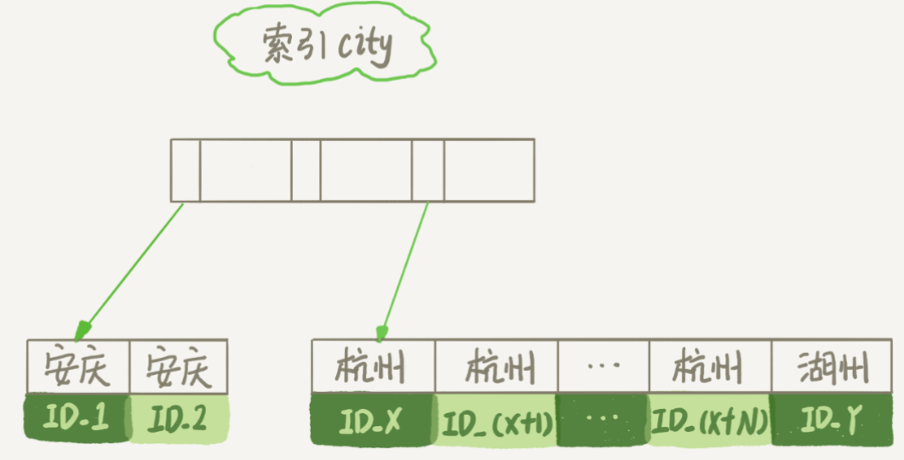
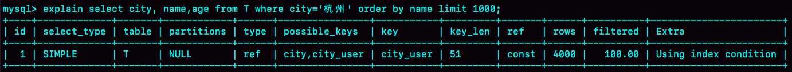
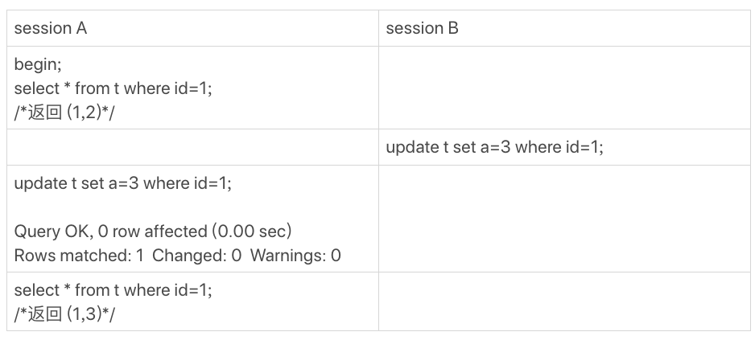

# 16讲“orderby”是怎么工作的

以我们前面举例用过的市民表为例，假设你要查询城市是「杭州」的所有人名字，并且按照姓名排序返回前 1000 个人的姓名、年龄。表的部分定义如下：

```sql
CREATE TABLE `t` (
  `id` int(11) NOT NULL,
  `city` varchar(16) NOT NULL,
  `name` varchar(16) NOT NULL,
  `age` int(11) NOT NULL,
  `addr` varchar(128) DEFAULT NULL,
  PRIMARY KEY (`id`),
  KEY `city` (`city`)
) ENGINE=InnoDB;
```

SQL 语句可以这么写：

```sql
SELECT city,name,age FROM t WHERE city='杭州' ORDER BY name LIMIT 1000  ;
```

下面描述该语句的执行流程，以及有什么参数会影响执行的行为。

## 一、全字段排序

为避免全表扫描，我们需要在 city 字段加上索引。然后用 explain 命令来看看这个语句的执行情况。


Extra 这个字段中的 `Using filesort` 表示的就是需要排序，**MySQL 会给每个线程分配一块内存用于排序，称为 `sort_buffer`**。

为了说明这个 SQL查询语句的执行过程，我们先来看一下city这个索引的示意图。



从图中可以看到，满足 `city='杭州’` 条件的行，是从 `ID_X` 到 `ID_(X+N)` 的这些记录。

通常情况下，这个语句执行流程如下所示 ：

1. 初始化 `sort_buffer`，确定放入`name`、`city`、`age` 这三个字段；
2. 从索引 `city` 找到第一个满足 `city='杭州’` 条件的主键 `id`，也就是图中的 `ID_X`；
3. 到主键 id 索引取出整行，取 `name`、`city`、`age` 三个字段的值，存入 `sort_buffer` 中；
4. 从索引 `city` 取下一个记录的主键 id；
5. 重复步骤 3、4 直到 city 的值不满足查询条件为止，对应的主键 id 也就是图中的 `ID_Y`；
6. 对 `sort_buffer` 中的数据按照字段 name 做快速排序；
7. 按照排序结果取前 1000 行返回给客户端。

我们暂且把这个排序过程，称为全字段排序，执行流程的示意图如下所示，下一篇文章中我们还会用到这个排序。


**图中「按name排序」这个动作，可能在内存中完成，也可能需要使用外部排序，这取决于排序所需的内存和参数`sort_buffer_size`。**

`sort_buffer_size`，就是 MySQL 为排序开辟的内存（sort_buffer）的大小。如果要排序的数据量小于 `sort_buffer_size`，排序就在内存中完成。但如果排序数据量太大，内存放不下，则不得不利用磁盘临时文件辅助排序。

你可以用下面介绍的方法，来确定一个排序语句是否使用了临时文件。

```sql
/* 打开optimizer_trace，只对本线程有效 */
SET optimizer_trace='enabled=on'; 

/* @a保存Innodb_rows_read的初始值 */
select VARIABLE_VALUE into @a from  performance_schema.session_status where variable_name = 'Innodb_rows_read';

/* 执行语句 */
select city, name,age from t where city='杭州' order by name limit 1000; 

/* 查看 OPTIMIZER_TRACE 输出 */
SELECT * FROM `information_schema`.`OPTIMIZER_TRACE`\G

/* @b保存Innodb_rows_read的当前值 */
select VARIABLE_VALUE into @b from performance_schema.session_status where variable_name = 'Innodb_rows_read';

/* 计算Innodb_rows_read差值 */
select @b-@a;
```

这个方法是通过查看 `OPTIMIZER_TRACE` 的结果来确认的，你可以从 `number_of_tmp_files` 中看到是否使用了临时文件。


`number_of_tmp_files` 表示的是，排序过程中使用的临时文件数。你一定奇怪，为什么需要 12 个文件？内存放不下时，就需要使用外部排序，外部排序一般使用归并排序算法。可以这么简单理解，**MySQL 将需要排序的数据分成 12 份，每一份单独排序后存在这些临时文件中。然后把这 12 个有序文件再合并成一个有序的大文件。**

如果 `sort_buffer_size` 超过了需要排序的数据量的大小，`number_of_tmp_files` 就是 0，表示排序可以直接在内存中完成。否则就需要放在临时文件中排序。`sort_buffer_size` 越小，需要分成的份数越多，`number_of_tmp_files` 的值就越大。

图中其他两个值的意思如下：

我们的示例表中有 4000 条满足 `city='杭州’` 的记录，所以你可以看到 `examined_rows=4000`，表示参与排序的行数是 4000行。

`sort_mode` 里面的 `packed_additional_fields` 的意思是，排序过程对字符串做了“紧凑”处理。即使 name 字段的定义是`varchar(16)`，在排序过程中还是要按照实际长度来分配空间的。

同时，最后一个查询语句 `select @b-@a` 的返回结果是 4000，表示整个执行过程只扫描了 4000 行。

这里需要注意的是，为了避免对结论造成干扰，我把 `internal_tmp_disk_storage_engine` 设置成 MyISAM。否则，`select @b-@a` 的结果会显示为 4001。这是因为查询 `OPTIMIZER_TRACE` 这个表时，需要用到临时表，而`internal_tmp_disk_storage_engine` 的默认值是 InnoDB。如果使用的是 InnoDB 引擎的话，把数据从临时表取出来的时候，会让 `Innodb_rows_read` 的值加 1。

## 二、rowid 排序

在上面这个算法过程里面，只对原表的数据读了一遍，剩下的操作都是在 `sort_buffer` 和临时文件中执行的。但这个算法有一个问题，就是如果查询要返回的字段很多的话，那么 `sort_buffer` 里面要放的字段数太多，这样内存里能够同时放下的行数很少，要分成很多个临时文件，排序的性能会很差。

所以如果单行很大，这个方法效率不够好。那么，**如果 MySQL 认为排序的单行长度太大会怎么做呢？**

接下来，我来修改一个参数，让 MySQL 采用另外一种算法。

```sql
SET max_length_for_sort_data = 16;
```

`max_length_for_sort_data`，是 MySQL 中专门控制用于排序的行数据的长度的一个参数。它的意思是，如果单行的长度超过这个值，MySQL 就认为单行太大，要换一个算法。

`city`、`name`、`age` 这三个字段的定义总长度是 36，我把 `max_length_for_sort_data`设置为 16，我们再来看看计算过程有什么改变。

新的算法放入 `sort_buffer` 的字段，只有要排序的列（即 name 字段）和主键 id。

但这时，排序的结果就因为少了 `city`和 `age` 字段的值，不能直接返回了，整个执行流程就变成如下所示的样子：

1. 初始化 `sort_buffer`，确定放入两个字段，即 `name`和 `id`；
2. 从索引 `city` 找到第一个满足 `city='杭州’` 条件的主键 id，也就是图中的 `ID_X`；
3. 到主键 id 索引取出整行，取 `name`、`id` 这两个字段，存入 `sort_buffer`中；
4. 从索引 `city` 取下一个记录的主键 id；
5. 重复步骤 3、4 直到不满足 `city='杭州’` 条件为止，也就是图中的 `ID_Y`；
6. 对 `sort_buffer` 中的数据按照字段 `name` 进行排序；
7. 遍历排序结果，取前 1000 行，并按照 id 的值回到原表中取出 `city`、`name` 和 `age` 三个字段返回给客户端。

这个执行流程的示意图如下，我把它称为 rowid 排序。


对比全字段排序流程图你会发现，rowid 排序多访问了一次表 t 的主键索引，就是步骤7。

需要说明的是，最后的“结果集”是一个逻辑概念，实际上 MySQL 服务端从排序后的 `sort_buffer` 中依次取出 id，然后到原表查到 `city`、`name` 和 `age`这三个字段的结果，不需要在服务端再耗费内存存储结果，是直接返回给客户端的。

根据这个说明过程和图示，你可以想一下，这个时候执行 `select @b-@a`，结果会是多少呢？

现在，我们就来看看结果有什么不同。

首先，图中的 `examined_rows` 的值还是 4000，表示用于排序的数据是 4000 行。但是 `select @b-@a` 这个语句的值变成 5000了。

因为这时候除了排序过程外，在排序完成后，还要根据 id 去原表取值。由于语句是 `limit 1000`，因此会多读 1000 行。


从OPTIMIZER_TRACE的结果中，你还能看到另外两个信息也变了。

- `sort_mode` 变成了 `<sort_key, rowid>`，表示参与排序的只有 name 和 id 这两个字段。
- `number_of_tmp_files` 变成 10 了，是因为这时候参与排序的行数虽然仍然是 `4000` 行，但是每一行都变小了，因此需要排序的总数据量就变小了，需要的临时文件也相应地变少了。

## 三、全字段排序 VS rowid 排序

如果 MySQL 实在是担心排序内存太小，会影响排序效率，才会采用 rowid 排序算法，这样排序过程中一次可以排序更多行，但是需要再回到原表去取数据。

如果 MySQL 认为内存足够大，会优先选择全字段排序，把需要的字段都放到 `sort_buffer` 中，这样排序后就会直接从内存里面返回查询结果了，不用再回到原表去取数据。

这也就体现了 MySQL 的一个设计思想：**如果内存够，就要多利用内存，尽量减少磁盘访问。**

**对于 InnoDB 表来说，rowid 排序会要求回表多造成磁盘读，因此不会被优先选择。**

因此 MySQL 做排序是一个成本比较高的操作。其实，并不是所有的 order by 语句，都需要排序操作的。从上面分析的执行过程，我们可以看到，MySQL 之所以需要生成临时表，并且在临时表上做排序操作，**其原因是原来的数据都是无序的。**如果能够保证从 city 这个索引上取出来的行，天然就是按照 name 递增排序的话，是不是就可以不用再排序了呢？

所以，我们可以在这个市民表上创建一个 city 和 name 的联合索引，对应的 SQL 语句是：

```sql
ALTER TABLE t ADD INDEX idx_city_user(city, name);
```

作为与 city 索引的对比，我们来看看这个索引的示意图。


在这个索引里面，我们依然可以用树搜索的方式定位到第一个满足 `city='杭州’` 的记录，并且额外确保了，接下来按顺序取“下一条记录”的遍历过程中，只要 city 的值是杭州，name 的值就一定是有序的。

这样整个查询过程的流程就变成了：

1. 从索引`(city,name)`找到第一个满足 `city='杭州’`条件的主键 id；
2. 到主键 id 索引取出整行，取 `name`、`city`、`age` 三个字段的值，作为结果集的一部分直接返回；
3. 从索引 `(city,name)` 取下一个记录主键 id；
4. 重复步骤 2、3，直到查到第 1000 条记录，或者是不满足 `city='杭州’` 条件时循环结束。


图8 引入 (city,name) 联合索引后，查询语句的执行计划

从 Explain 也可以看到，这个查询过程不需要临时表，也不需要排序。



从图中可以看到，`Extra` 字段中没有 `Using filesort` 了，即不需要排序了。而且由于 `(city,name)` 这个联合索引本身有序，所以这个查询也不用把 4000 行全都读一遍，只要找到满足条件的前 1000 条记录就可以退出了。即该例子只需要扫描 1000 次。

既然说到这里了，我们再往前讨论，**这个语句的执行流程有没有可能进一步简化呢？**不知道你还记不记得，我在第5篇文章[《 深入浅出索引（下）》](https://time.geekbang.org/column/article/69636)中，和你介绍的覆盖索引。**覆盖索引是指，索引上的信息足够满足查询请求，不需要再回到主键索引上去取数据。**

针对这个查询，我们可以创建一个 `city`、`name` 和 `age` 的联合索引，对应的 SQL 语句就是：

```sql
ALTER TABLE t ADD INDEX idx_city_user_age(city, name, age);
```

这时，对于 `city` 字段的值相同的行来说，还是按照 `name` 字段的值递增排序的，此时的查询语句也就不再需要排序了。这样整个查询语句的执行流程就变成了：

1. 从索引`(city,name,age)` 找到第一个满足 `city='杭州’`条件的记录，取出其中的 `city`、`name` 和 `age` 这三个字段的值，作为结果集的一部分直接返回；
2. 从索引`(city,name,age)`取下一个记录，同样取出这三个字段的值，作为结果集的一部分直接返回；
3. 重复执行步骤 2，直到查到第 1000 条记录，或者是不满足 `city='杭州’` 条件时循环结束。


图10 引入(city,name,age)联合索引后，查询语句的执行流程以及 explain 执行结果：


图11 引入(city,name,age)联合索引后，查询语句的执行计划

可以看到，**`Extra` 字段里面多了 `Using index`，表示的就是使用了覆盖索引**，性能上会快很多。

当然，这里并不是说要为了每个查询能用上覆盖索引，就要把语句中涉及的字段都建上联合索引，毕竟索引还是有维护代价的。这是一个需要权衡的决定。

## 四、小结

这篇文章介绍了 MySQL 里面 `order by` 语句的几种算法流程。

在开发系统的时候，你总是不可避免地会使用到order by语句。你心里要清楚每个语句的排序逻辑是怎么实现的，还要能够分析出在最坏情况下，每个语句的执行对系统资源的消耗。

最后，我给你留下一个思考题吧。

假设你的表里面已经有了city_name(city, name)这个联合索引，然后你要查杭州和苏州两个城市中所有的市民的姓名，并且按名字排序，显示前100条记录。如果SQL查询语句是这么写的 ：

```
mysql> select * from t where city in ('杭州',"苏州") order by name limit 100;
```

那么，这个语句执行的时候会有排序过程吗，为什么？

如果业务端代码由你来开发，需要实现一个在数据库端不需要排序的方案，你会怎么实现呢？

进一步地，如果有分页需求，要显示第101页，也就是说语句最后要改成 “limit 10000,100”， 你的实现方法又会是什么呢？

你可以把你的思考和观点写在留言区里，我会在下一篇文章的末尾和你讨论这个问题。感谢你的收听，也欢迎你把这篇文章分享给更多的朋友一起阅读。

## 五、上期问题时间

上期的问题是，当MySQL去更新一行，但是要修改的值跟原来的值是相同的，这时候MySQL会真的去执行一次修改吗？还是看到值相同就直接返回呢？

这是第一次我们课后问题的三个选项都有同学选的，所以我要和你需要详细说明一下。

第一个选项是，MySQL读出数据，发现值与原来相同，不更新，直接返回，执行结束。这里我们可以用一个锁实验来确认。

假设，当前表t里的值是(1,2)。


图12 锁验证方式

session B的update 语句被blocked了，加锁这个动作是InnoDB才能做的，所以排除选项1。

第二个选项是，MySQL调用了InnoDB引擎提供的接口，但是引擎发现值与原来相同，不更新，直接返回。有没有这种可能呢？这里我用一个可见性实验来确认。

假设当前表里的值是(1,2)。



图13 可见性验证方式

session A的第二个select 语句是一致性读（快照读)，它是不能看见session B的更新的。

现在它返回的是(1,3)，表示它看见了某个新的版本，这个版本只能是session A自己的update语句做更新的时候生成。（如果你对这个逻辑有疑惑的话，可以回顾下第8篇文章[《事务到底是隔离的还是不隔离的？》](https://time.geekbang.org/column/article/70562)中的相关内容）

所以，我们上期思考题的答案应该是选项3，即：InnoDB认真执行了“把这个值修改成(1,2)"这个操作，该加锁的加锁，该更新的更新。

然后你会说，MySQL怎么这么笨，就不会更新前判断一下值是不是相同吗？如果判断一下，不就不用浪费InnoDB操作，多去更新一次了？

其实MySQL是确认了的。只是在这个语句里面，MySQL认为读出来的值，只有一个确定的 (id=1), 而要写的是(a=3)，只从这两个信息是看不出来“不需要修改”的。

作为验证，你可以看一下下面这个例子。


图14 可见性验证方式--对照

**补充说明：**

上面我们的验证结果都是在binlog_format=statement格式下进行的。

@didiren 补充了一个case， 如果是binlog_format=row 并且binlog_row_image=FULL的时候，由于MySQL需要在binlog里面记录所有的字段，所以在读数据的时候就会把所有数据都读出来了。

根据上面说的规则，“既然读了数据，就会判断”， 因此在这时候，select * from t where id=1，结果就是“返回 (1,2)”。

同理，如果是binlog_row_image=NOBLOB, 会读出除blob 外的所有字段，在我们这个例子里，结果还是“返回 (1,2)”。

对应的代码如图15所示。这是MySQL 5.6版本引入的，在此之前我没有看过。所以，特此说明。


图15 binlog_row_image=FULL读字段逻辑

类似的，@mahonebags 同学提到了timestamp字段的问题。结论是：如果表中有timestamp字段而且设置了自动更新的话，那么更新“别的字段”的时候，MySQL会读入所有涉及的字段，这样通过判断，就会发现不需要修改。

这两个点我会在后面讲更新性能的文章中再展开。

评论区留言点赞板：

> @Gavin 、@melon、@阿建 等同学提到了锁验证法；
> @郭江伟 同学提到了两个点，都非常好，有去实际验证。结论是这样的：
> 第一，hexdump看出来没改应该是WAL机制生效了，要过一会儿，或者把库shutdown看看。
> 第二，binlog没写是MySQL Server层知道行的值没变，所以故意不写的，这个是在row格式下的策略。你可以把binlog_format 改成statement再验证下。

## 精选留言

- 

    某、人

    回答下@发条橙子同学的问题:
    问题一：
    1)无条件查询如果只有order by create_time,即便create_time上有索引,也不会使用到。
    因为优化器认为走二级索引再去回表成本比全表扫描排序更高。
    所以选择走全表扫描,然后根据老师讲的两种方式选择一种来排序
    2)无条件查询但是是order by create_time limit m.如果m值较小,是可以走索引的.
    因为优化器认为根据索引有序性去回表查数据,然后得到m条数据,就可以终止循环,那么成本比全表扫描小,则选择走二级索引。
    即便没有二级索引,mysql针对order by limit也做了优化,采用堆排序。这部分老师明天会讲

    问题二:
    如果是group by a,a上不能使用索引的情况,是走rowid排序。
    如果是group by limit,不能使用索引的情况,是走堆排序
    如果是只有group by a,a上有索引的情况,又根据选取值不同,索引的扫描方式又有不同
    select * from t group by a --走的是索引全扫描,至于这里为什么选择走索引全扫描,还需要老师解惑下
    select a from t group by a --走的是索引松散扫描,也就说只需要扫描每组的第一行数据即可,不用扫描每一行的值

    问题三:
    bigint和int加数字都不影响能存储的值。
    bigint(1)和bigint(19)都能存储2^64-1范围内的值,int是2^32-1。只是有些前端会根据括号里来截取显示而已。建议不加varchar()就必须带,因为varchar()括号里的数字代表能存多少字符。假设varchar(2),就只能存两个字符,不管是中文还是英文。目前来看varchar()这个值可以设得稍稍大点,因为内存是按照实际的大小来分配内存空间的,不是按照值来预分配的。

    老师我有几个问题:
    1.我还是想在确认之前问的问题。一个长连接,一条sql申请了sort_buffer_size等一系列的会话级别的内存,sql成功执行完,该连接变为sleep状态。这些内存只是内容会被情况,但是占用的内存空间不会释放?
    2.假设要给a值加1,执行器先找引擎取a=1的行,然后执行器给a+1,在调用接口写入a+1了数据。那么加锁不应该是在执行器第一次去取数据时，引擎层就加该加的锁？为什么要等到第二次调用写入数据时,才加锁。第一次和第二次之间,难道不会被其他事务修改吗？如果没有锁保证
    3.始终没太明白堆排序是采用的什么算法使得只需要对limit的数据进行排序就可以,而不是排序所有的数据在取前m条。--不过这里期待明天的文章

    2018-12-20 17:17

    作者回复

    发条橙子同学的问题：
    问题1:你回答得比我回复的答案还好！
    问题2:这个后面我们展开哈，要配图才能说得清
    问题3:回答得也很好，需要注意的是255这个边界。小于255都需要一个字节记录长度，超过255就需要两个字节

    你的问题：#好问题_#
    \1. 排序相关的内存在排序后就free掉还给系统了
    \2. 读的时候加了写锁的
    \3. 堆排序要读所有行的，只读一次，我估计你已经理解对了

    

    2018-12-20 18:52

- 

    didiren

    刚才又测了一下，在binlog-row-image=full的情况下，第二次update是不写redolog的，说明update并没有发生
    这样我就理解了，当full时，mysql需要读到在更新时读到a值，所以会判断a值不变，不需要更新，与你给出的update t set a=3 where id=1 and a=3原理相同，但binlog-row-image会影响查询结果还是会让人吃一惊

    2018-12-19 17:24

    作者回复

    是的。

    这个我也盲点了。

    但是细想MySQL 选择这个策略又是合理的。

    我需要再更新一下专栏内容

    2018-12-19 19:03

- 

    null

    re: 问题3:回答得也很好，需要注意的是255这个边界。小于255都需要一个字节记录长度，超过255就需要两个字节

    11 月过数据库设计方案，总监现场抛了一个问题，就是关于 varchar 255 的。现在回看，木有人回答到点上，都说是历史原因。
    下回再问，就可以分享这一点了。 ()”哇哈哈～

    2018-12-21 09:45

    作者回复

    最怕的回答“历史原因”、“大家都这么做的所以…”、“别人要求的”

    2018-12-21 10:41

- 

    老杨同志

    1)
    mysql> select * from t where city in ('杭州'," 苏州 ") order by name limit 100;
    需要排序
    原因是索引顺序城市、名称 与 单独按name排序的顺序不一致。

    2）如果不想mysql排序
    方案a
    可以执行两条语句
    select * from t where city = '杭州' limit 100;
    select * from t where city = '苏州' limit 100;
    然后把200条记录在java中排序。
    方案b
    分别取前100，然后在数据端对200条数据进行排序。可以sort buffer就可以完成排序了。
    少了一次应用程序与数据库的网络交互
    select * from (
    select * from t where city = '杭州' limit 100
    union all
    select * from t where city = '苏州' limit 100
    ) as tt order by name limit 100

    
    3）对分页的优化。
    没有特别好的办法。如果业务允许不提供排序功能，不提供查询最后一页，只能一页一页的翻，基本上前几页的数据已经满足客户需求。
    为了意义不大的功能优化，可能会得不偿失。
    如果一定要优化可以 select id from t where city in ('杭州'," 苏州 ") order by name limit 10000,100
    因为有city\name索引，上面的语句走覆盖索引就可以完成，不用回表。
    最后使用 select * from t where id in (); 取得结果
    对于这个优化方法，我不好确定的是临界点，前几页直接查询就可以，最后几页使用这个优化方法。
    但是中间的页码应该怎么选择不太清楚

    

    2018-12-19 10:04

    作者回复

    从业务上砍掉功能，这个意识很好

    2018-12-19 12:28

- 

    波波

    笔记:
    1.MySQL会为每个线程分配一个内存（sort_buffer）用于排序该内存大小为sort_buffer_size
    1>如果排序的数据量小于sort_buffer_size，排序将会在内存中完成
    2>如果排序数据量很大，内存中无法存下这么多数据，则会使用磁盘临时文件来辅助排序，也称外部排序
    3>在使用外部排序时，MySQL会分成好几份单独的临时文件用来存放排序后的数据，然后在将这些文件合并成一个大文件

    
    2.mysql会通过遍历索引将满足条件的数据读取到sort_buffer，并且按照排序字段进行快速排序
    1>如果查询的字段不包含在辅助索引中，需要按照辅助索引记录的主键返回聚集索引取出所需字段
    2>该方式会造成随机IO，在MySQL5.6提供了MRR的机制，会将辅助索引匹配记录的主键取出来在内存中进行排序，然后在回表
    3>按照情况建立联合索引来避免排序所带来的性能损耗，允许的情况下也可以建立覆盖索引来避免回表

    全字段排序
    1.通过索引将所需的字段全部读取到sort_buffer中
    2.按照排序字段进行排序
    3.将结果集返回给客户端

    
    缺点：
    1.造成sort_buffer中存放不下很多数据，因为除了排序字段还存放其他字段，对sort_buffer的利用效率不高
    2.当所需排序数据量很大时，会有很多的临时文件，排序性能也会很差

    优点：MySQL认为内存足够大时会优先选择全字段排序，因为这种方式比rowid 排序避免了一次回表操作

    
    rowid排序
    1.通过控制排序的行数据的长度来让sort_buffer中尽可能多的存放数据，max_length_for_sort_data
    2.只将需要排序的字段和主键读取到sort_buffer中，并按照排序字段进行排序
    3.按照排序后的顺序，取id进行回表取出想要获取的数据
    4.将结果集返回给客户端

    优点：更好的利用内存的sort_buffer进行排序操作，尽量减少对磁盘的访问

    缺点：回表的操作是随机IO，会造成大量的随机读，不一定就比全字段排序减少对磁盘的访问

    
    3.按照排序的结果返回客户所取行数

    2018-12-19 13:33

    作者回复

    

    2018-12-21 14:11

- 

    峰

    由于city有两个值，相当于匹配到了索引树的两段区域，虽然各自都是按name排序，但整体需要做一次归并，当然只是limit100，所以够数就行。再然后如果需要不做排序，业务端就按city不同的取值查询两次，每次都limit100，然后业务端做归并处理喽。再然后要做分页的话，好吧，我的思路是先整出一张临时的结果表，create table as select rownumber,* from t where city=x order by name(写的不对哈，只是表达意思，rownumber为行数,并为主键)然后直接从这张表中按rownumber进行分页查询就好。

    2018-12-19 08:31

    作者回复

    分页这个再考虑考虑哈

    2018-12-19 09:39

- 

    cyberbit

    
    1.不会有排序，这种情况属于《高性能mysql》里提到的“in技法”，符合索引的最左原则，是2个等值查询，可以用到右边的索引列。
    2.分页查询，可以用延迟关联来优化：
    select * from t join
    (select id from t where city in('杭州','苏州') order by name limit 10000,100) t_id
    on t.id=t_id.id;

    

    2018-12-19 11:54

- 

    尘封

    请问，第7步中遍历排序结果，取前 1000 行，并按照 id 的值回到原表中取出 city、name 和 age 三个字段返回给客户端：这里会把id再进行排序吗？转随机io为顺序io？

    2018-12-19 01:30

    作者回复

    要是排序就结果不符合order by 的语义逻辑了…

    2018-12-19 09:39

- 

    赵海亮

    老师你好，全字段排序那一节，我做了实验，我的排序缓存大小是1M， examined rows 是7715892，查询的三个字段都有数据，那么如果这些数据都放到缓存应该需要（4+8+11）*7715892等于160M，但是我看了都没有用到临时表，这是为什么？

    CREATE TABLE `phone_call_logs` (
    `id` int(11) unsigned NOT NULL AUTO_INCREMENT COMMENT '主键ID',
    `city_id` int(11) NOT NULL DEFAULT '11',
    `call_sender` varchar(40) DEFAULT NULL COMMENT '电话主叫号码',
    `phone_id` bigint(20) NOT NULL DEFAULT '0' COMMENT '手机id',
    PRIMARY KEY (`id`),
    KEY `idx_city` (`city_id`)
    ) ENGINE=InnoDB AUTO_INCREMENT=64551193;
    ----------------sort_buffer_size=1M----------------------------
    root:(none)> show variables like 'sort_buffer_size';
    +------------------+---------+
    | Variable_name | Value |
    +------------------+---------+
    | sort_buffer_size | 1048576 |
    +------------------+---------+
    1 row in set (0.00 sec)
    ---------------查询sql---------------------
    select city_id,phone_id,call_sender from phone_call_logs where city_id=11 order by phone_id desc limit 1000;

    
    -----------------------执行计划结果---------------------------------------------

    "filesort_priority_queue_optimization": {
    "limit": 1000,
    "rows_estimate": 146364461,
    "row_size": 146,
    "memory_available": 1048576,
    "chosen": true
    },
    "filesort_execution": [
    ],
    "filesort_summary": {
    "rows": 1001,
    "examined_rows": 7715892,
    "number_of_tmp_files": 0,
    "sort_buffer_size": 154160,
    "sort_mode": "<sort_key, additional_fields>"

    

    2018-12-19 19:41

    作者回复

    好问题，明天见
    （明天的一篇也是跟排序有关的哦）

    2018-12-20 00:29

- 

    didiren

    感谢！针对我之前提出的疑问，我又详细的做了实验，发现一个新的问题，我感觉是个bug，希望解答
    \# SessionA
    mysql> show variables like '%binlog_row_image%';
    | Variable_name | Value |
    | binlog_row_image | FULL |
    mysql> create table t (id int not null primary key auto_increment,
    -> a int default null)
    -> engine=innodb;
    mysql> insert into t values(1,2);
    mysql> set tx_isolation = 'repeatable-read';
    mysql> begin;
    mysql> select * from t where id = 1;
    | id | a |
    | 1 | 2 |
    此时在另一个SessionB执行update t set a=3 where id = 1;成功更新一条记录。通过show engine innodb status看，Log sequence number 2573458
    然后在SessionA继续。。
    mysql> update t set a=3 where id = 1;
    Rows matched: 1 Changed: 0 Warnings: 0
    Log sequence number 2573467
    mysql> select * from t where id = 1;
    | id | a |
    | 1 | 2 |

    这里与你给出的答案里的实验结果不同
    可以看到redolog是记录了第二次的update的，但是select却没有看到更新后的值，于是我又换了一个平时测试用的实例，同样的步骤却得到了与你的答案相同的结果
    然后我对比了2个实例的参数，发现当binlog-row-image=minimal时第二次查询结果a=3，当binlog-row-image=full时第二次查询结果a=2，而且不论哪个参数，redolog都会因为SessionA的update增长，说明redolog都做了记录，update是发生了的，但是binlog-row-image参数会影响查询结果，难以理解，我用的mysql版本是官方的5.7.13

    下面是binlog-row-image = minimal的实验结果
    mysql> set binlog_row_image=MINIMAL;
    mysql> drop table t;
    mysql> create table t (id int not null primary key auto_increment,
    -> a int default null)
    -> engine=innodb;
    insert into t values(1,2);
    mysql> insert into t values(1,2);
    mysql> set tx_isolation = 'repeatable-read';
    mysql> begin;
    mysql> select * from t where id = 1;
    | id | a |
    | 1 | 2 |
    此时在另一个SessionB执行update t set a=3 where id = 1;成功更新一条记录。
    mysql> update t set a=3 where id = 1;
    Rows matched: 1 Changed: 0 Warnings: 0
    mysql> select * from t where id = 1;
    | id | a |
    | 1 | 3 |

    2018-12-19 17:01

    作者回复

    ！！！

    你说的对

    我验证的是statement格式。

    MySQL 看来选了不错吧路径。

    这个我之前真不知道

    多谢

    

    2018-12-19 19:02

- 

    明亮

    需要排序，可以将原来的索引中name字段放前面，city字段放后面，来建索引就可以了

    2018-12-19 08:08

    作者回复

    这样不太好哈，变成全索引扫描了

    2018-12-19 09:36

- 

    edcSam

    类如图二的索引图，我一直有一个困惑。city的索引图上，有小一些的长方形和大一些的长方形。有时候箭头源自于小长方形，有些箭头又源自于大长方形。这究竟是什么含义？

    2019-01-12 09:34

    作者回复

    原意是要宽的表示数据项，窄的表示指针
    我们修改下图哈，不容易引起疑问。
    细致

    2019-01-12 12:53

- 

    唐名之

    1：用@cyberbit 提供的方式，执行计划是不会使用到排序，但执行时间比使用排序消耗的多；
    2：分页limit过大时会导致大量排序，可以记录上一页最后的ID，下一页查询条件带上 where ID>上一页最后ID limit 100

    2019-01-09 14:56

    作者回复

    \1. 为什么这么说呢？
    \2. 对的

    2019-01-10 19:27

- 

    felix

    MySQL对limit有什么优化吗？是只能配合索引使用吗？谢谢

    2019-01-04 09:09

    作者回复

    没有一定要配合索引哦

    下一篇有讲到一个limit 排序优化

    2019-01-04 09:38

- 

    刘会俊

    接上一次的留言。谢谢老师的回复，昨天找到原因了，因为我造的总数据只有6条，使用select city,name,age from t where city='杭州' order by name limit 1000的时候，使用explain分析的结果中，type为ALL，优化器认为6条数据走全表扫描比用city索引再回表的方式快，所以没有走city索引，看到的结果里examined_rows就是总的6条数据了，我用了force index(city)结果就跟您的一样了。不好意思老师，我是个开发，数据库的一些参数和知识不太熟悉，提了一些弱智问题请您见谅。

    2019-01-03 08:38

    作者回复

    
    把问题描述清楚大家就共同学习到啦

    2019-01-03 10:03

- 

    刘会俊

    老师，我使用那一条建表语句和查询语句，最后使用explain得出的结果是using where；using filesort，然后我发现select * from information_schema.optimizer_trace\G;得到的结果是
    "filesort_summary": {
    "rows": 4,
    "examined_rows": 6,
    "number_of_tmp_files": 0,
    "sort_buffer_size": 71880,
    "sort_mode": "<sort_key, packed_additional_fields>"
    }
    表里只有4条符合的数据，我没搞懂为什么examined_rows是6，因为6是总数据量为6条。

    2019-01-02 16:10

    作者回复

    哪个查询语句…

    2019-01-02 17:38

- 

    过去、今日

    进行排序后的临时文件分成几份是和sort_buffer_size有关，那数据库设置这个值会不会越大越好？

    2018-12-31 18:25

    作者回复

    好问题

    不能哦，并发起来的时候内存占用过大，会到自己系统OOM的

    2018-12-31 20:29

- 

    吴鸿达

    波波可是百度dba

    2018-12-28 22:02

    作者回复

    额感觉你知道些什么

    2018-12-28 22:44

- 

    J!

    order by 主键 desc limit 1也会索引全表？

    2018-12-27 21:16

    作者回复

    索引全表是什么意思

    2018-12-27 22:11

- 

    小岭哥

    为什么建立组合索引之后会天然的按照name递增排序呢

    2018-12-26 07:14

    作者回复

    因为索引要求“有序”

    2018-12-26 09:56
