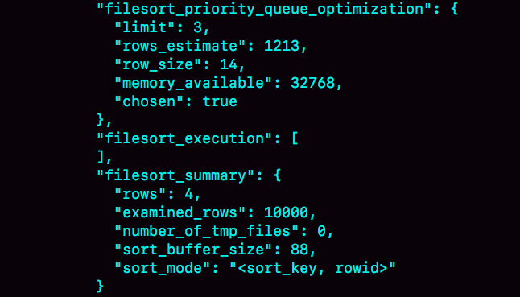
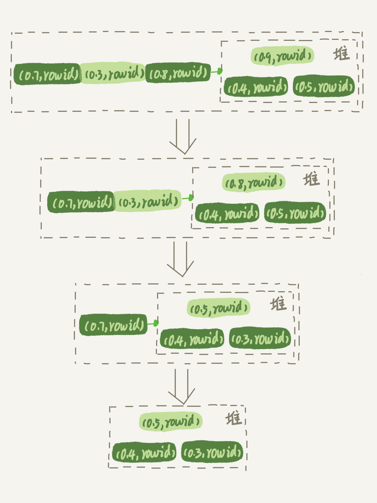

# 17讲如何正确地显示随机消息

我在上一篇文章，为你讲解完order by语句的几种执行模式后，就想到了之前一个做英语学习App的朋友碰到过的一个性能问题。今天这篇文章，我就从这个性能问题说起，和你说说MySQL中的另外一种排序需求，希望能够加深你对MySQL排序逻辑的理解。

这个英语学习App首页有一个随机显示单词的功能，也就是根据每个用户的级别有一个单词表，然后这个用户每次访问首页的时候，都会随机滚动显示三个单词。他们发现随着单词表变大，选单词这个逻辑变得越来越慢，甚至影响到了首页的打开速度。

现在，如果让你来设计这个SQL语句，你会怎么写呢？

为了便于理解，我对这个例子进行了简化：去掉每个级别的用户都有一个对应的单词表这个逻辑，直接就是从一个单词表中随机选出三个单词。这个表的建表语句和初始数据的命令如下：

```
mysql> CREATE TABLE `words` (
  `id` int(11) NOT NULL AUTO_INCREMENT,
  `word` varchar(64) DEFAULT NULL,
  PRIMARY KEY (`id`)
) ENGINE=InnoDB;

delimiter ;;
create procedure idata()
begin
  declare i int;
  set i=0;
  while i<10000 do
    insert into words(word) values(concat(char(97+(i div 1000)), char(97+(i % 1000 div 100)), char(97+(i % 100 div 10)), char(97+(i % 10))));
    set i=i+1;
  end while;
end;;
delimiter ;

call idata();
```

为了便于量化说明，我在这个表里面插入了10000行记录。接下来，我们就一起看看要随机选择3个单词，有什么方法实现，存在什么问题以及如何改进。

# 内存临时表

首先，你会想到用order by rand()来实现这个逻辑。

```
mysql> select word from words order by rand() limit 3;
```

这个语句的意思很直白，随机排序取前3个。虽然这个SQL语句写法很简单，但执行流程却有点复杂的。

我们先用explain命令来看看这个语句的执行情况。


图1 使用explain命令查看语句的执行情况

Extra字段显示Using temporary，表示的是需要使用临时表；Using filesort，表示的是需要执行排序操作。

因此这个Extra的意思就是，需要临时表，并且需要在临时表上排序。

这里，你可以先回顾一下[上一篇文章](https://time.geekbang.org/column/article/73479)中全字段排序和rowid排序的内容。我把上一篇文章的两个流程图贴过来，方便你复习。


图2 全字段排序


图3 rowid排序

然后，我再问你一个问题，你觉得对于临时内存表的排序来说，它会选择哪一种算法呢？回顾一下上一篇文章的一个结论：**对于InnoDB表来说**，执行全字段排序会减少磁盘访问，因此会被优先选择。

我强调了“InnoDB表”，你肯定想到了，**对于内存表，回表过程只是简单地根据数据行的位置，直接访问内存得到数据，根本不会导致多访问磁盘**。优化器没有了这一层顾虑，那么它会优先考虑的，就是用于排序的行越少越好了，所以，MySQL这时就会选择rowid排序。

理解了这个算法选择的逻辑，我们再来看看语句的执行流程。同时，通过今天的这个例子，我们来尝试分析一下语句的扫描行数。

这条语句的执行流程是这样的：

1. 创建一个临时表。这个临时表使用的是memory引擎，表里有两个字段，第一个字段是double类型，为了后面描述方便，记为字段R，第二个字段是varchar(64)类型，记为字段W。并且，这个表没有建索引。
2. 从words表中，按主键顺序取出所有的word值。对于每一个word值，调用rand()函数生成一个大于0小于1的随机小数，并把这个随机小数和word分别存入临时表的R和W字段中，到此，扫描行数是10000。
3. 现在临时表有10000行数据了，接下来你要在这个没有索引的内存临时表上，按照字段R排序。
4. 初始化 sort_buffer。sort_buffer中有两个字段，一个是double类型，另一个是整型。
5. 从内存临时表中一行一行地取出R值和位置信息（我后面会和你解释这里为什么是“位置信息”），分别存入sort_buffer中的两个字段里。这个过程要对内存临时表做全表扫描，此时扫描行数增加10000，变成了20000。
6. 在sort_buffer中根据R的值进行排序。注意，这个过程没有涉及到表操作，所以不会增加扫描行数。
7. 排序完成后，取出前三个结果的位置信息，依次到内存临时表中取出word值，返回给客户端。这个过程中，访问了表的三行数据，总扫描行数变成了20003。

接下来，我们通过慢查询日志（slow log）来验证一下我们分析得到的扫描行数是否正确。

```
# Query_time: 0.900376  Lock_time: 0.000347 Rows_sent: 3 Rows_examined: 20003
SET timestamp=1541402277;
select word from words order by rand() limit 3;
```

其中，Rows_examined：20003就表示这个语句执行过程中扫描了20003行，也就验证了我们分析得出的结论。

这里插一句题外话，在平时学习概念的过程中，你可以经常这样做，先通过原理分析算出扫描行数，然后再通过查看慢查询日志，来验证自己的结论。我自己就是经常这么做，这个过程很有趣，分析对了开心，分析错了但是弄清楚了也很开心。

现在，我来把完整的排序执行流程图画出来。


图4 随机排序完整流程图1

图中的pos就是位置信息，你可能会觉得奇怪，这里的“位置信息”是个什么概念？在上一篇文章中，我们对InnoDB表排序的时候，明明用的还是ID字段。

这时候，我们就要回到一个基本概念：**MySQL的表是用什么方法来定位“一行数据”的。**

在前面[第4](https://time.geekbang.org/column/article/69236)和[第5](https://time.geekbang.org/column/article/69636)篇介绍索引的文章中，有几位同学问到，如果把一个InnoDB表的主键删掉，是不是就没有主键，就没办法回表了？

其实不是的。如果你创建的表没有主键，或者把一个表的主键删掉了，那么InnoDB会自己生成一个长度为6字节的rowid来作为主键。

这也就是排序模式里面，rowid名字的来历。实际上它表示的是：每个引擎用来唯一标识数据行的信息。

- 对于有主键的InnoDB表来说，这个rowid就是主键ID；
- 对于没有主键的InnoDB表来说，这个rowid就是由系统生成的；
- MEMORY引擎不是索引组织表。在这个例子里面，你可以认为它就是一个数组。因此，这个rowid其实就是数组的下标。

到这里，我来稍微小结一下：**order by rand()使用了内存临时表，内存临时表排序的时候使用了rowid排序方法。**

# 磁盘临时表

那么，是不是所有的临时表都是内存表呢？

其实不是的。tmp_table_size这个配置限制了内存临时表的大小，默认值是16M。如果临时表大小超过了tmp_table_size，那么内存临时表就会转成磁盘临时表。

磁盘临时表使用的引擎默认是InnoDB，是由参数internal_tmp_disk_storage_engine控制的。

当使用磁盘临时表的时候，对应的就是一个没有显式索引的InnoDB表的排序过程。

为了复现这个过程，我把tmp_table_size设置成1024，把sort_buffer_size设置成 32768, 把 max_length_for_sort_data 设置成16。

```
set tmp_table_size=1024;
set sort_buffer_size=32768;
set max_length_for_sort_data=16;
/* 打开 optimizer_trace，只对本线程有效 */
SET optimizer_trace='enabled=on'; 

/* 执行语句 */
select word from words order by rand() limit 3;

/* 查看 OPTIMIZER_TRACE 输出 */
SELECT * FROM `information_schema`.`OPTIMIZER_TRACE`\G
```



图5 OPTIMIZER_TRACE部分结果

然后，我们来看一下这次OPTIMIZER_TRACE的结果。

因为将max_length_for_sort_data设置成16，小于word字段的长度定义，所以我们看到sort_mode里面显示的是rowid排序，这个是符合预期的，参与排序的是随机值R字段和rowid字段组成的行。

这时候你可能心算了一下，发现不对。R字段存放的随机值就8个字节，rowid是6个字节（至于为什么是6字节，就留给你课后思考吧），数据总行数是10000，这样算出来就有140000字节，超过了sort_buffer_size 定义的 32768字节了。但是，number_of_tmp_files的值居然是0，难道不需要用临时文件吗？

这个SQL语句的排序确实没有用到临时文件，采用是MySQL 5.6版本引入的一个新的排序算法，即：优先队列排序算法。接下来，我们就看看为什么没有使用临时文件的算法，也就是归并排序算法，而是采用了优先队列排序算法。

其实，我们现在的SQL语句，只需要取R值最小的3个rowid。但是，如果使用归并排序算法的话，虽然最终也能得到前3个值，但是这个算法结束后，已经将10000行数据都排好序了。

也就是说，后面的9997行也是有序的了。但，我们的查询并不需要这些数据是有序的。所以，想一下就明白了，这浪费了非常多的计算量。

而优先队列算法，就可以精确地只得到三个最小值，执行流程如下：

1. 对于这10000个准备排序的(R,rowid)，先取前三行，构造成一个堆；

（对数据结构印象模糊的同学，可以先设想成这是一个由三个元素组成的数组）

1. 取下一个行(R’,rowid’)，跟当前堆里面最大的R比较，如果R’小于R，把这个(R,rowid)从堆中去掉，换成(R’,rowid’)；
2. 重复第2步，直到第10000个(R’,rowid’)完成比较。

这里我简单画了一个优先队列排序过程的示意图。



图6 优先队列排序算法示例

图6是模拟6个(R,rowid)行，通过优先队列排序找到最小的三个R值的行的过程。整个排序过程中，为了最快地拿到当前堆的最大值，总是保持最大值在堆顶，因此这是一个最大堆。

图5的OPTIMIZER_TRACE结果中，filesort_priority_queue_optimization这个部分的chosen=true，就表示使用了优先队列排序算法，这个过程不需要临时文件，因此对应的number_of_tmp_files是0。

这个流程结束后，我们构造的堆里面，就是这个10000行里面R值最小的三行。然后，依次把它们的rowid取出来，去临时表里面拿到word字段，这个过程就跟上一篇文章的rowid排序的过程一样了。

我们再看一下上面一篇文章的SQL查询语句：

```
select city,name,age from t where city='杭州' order by name limit 1000  ;
```

你可能会问，这里也用到了limit，为什么没用优先队列排序算法呢？原因是，这条SQL语句是limit 1000，如果使用优先队列算法的话，需要维护的堆的大小就是1000行的(name,rowid)，超过了我设置的sort_buffer_size大小，所以只能使用归并排序算法。

总之，不论是使用哪种类型的临时表，order by rand()这种写法都会让计算过程非常复杂，需要大量的扫描行数，因此排序过程的资源消耗也会很大。

再回到我们文章开头的问题，怎么正确地随机排序呢？

# 随机排序方法

我们先把问题简化一下，如果只随机选择1个word值，可以怎么做呢？思路上是这样的：

1. 取得这个表的主键id的最大值M和最小值N;
2. 用随机函数生成一个最大值到最小值之间的数 X = (M-N)*rand() + N;
3. 取不小于X的第一个ID的行。

我们把这个算法，暂时称作随机算法1。这里，我直接给你贴一下执行语句的序列:

```
mysql> select max(id),min(id) into @M,@N from t ;
set @X= floor((@M-@N+1)*rand() + @N);
select * from t where id >= @X limit 1;
```

这个方法效率很高，因为取max(id)和min(id)都是不需要扫描索引的，而第三步的select也可以用索引快速定位，可以认为就只扫描了3行。但实际上，这个算法本身并不严格满足题目的随机要求，因为ID中间可能有空洞，因此选择不同行的概率不一样，不是真正的随机。

比如你有4个id，分别是1、2、4、5，如果按照上面的方法，那么取到 id=4的这一行的概率是取得其他行概率的两倍。

如果这四行的id分别是1、2、40000、40001呢？这个算法基本就能当bug来看待了。

所以，为了得到严格随机的结果，你可以用下面这个流程:

1. 取得整个表的行数，并记为C。
2. 取得 Y = floor(C * rand())。 floor函数在这里的作用，就是取整数部分。
3. 再用limit Y,1 取得一行。

我们把这个算法，称为随机算法2。下面这段代码，就是上面流程的执行语句的序列。

```
mysql> select count(*) into @C from t;
set @Y = floor(@C * rand());
set @sql = concat("select * from t limit ", @Y, ",1");
prepare stmt from @sql;
execute stmt;
DEALLOCATE prepare stmt;
```

由于limit 后面的参数不能直接跟变量，所以我在上面的代码中使用了prepare+execute的方法。你也可以把拼接SQL语句的方法写在应用程序中，会更简单些。

这个随机算法2，解决了算法1里面明显的概率不均匀问题。

MySQL处理limit Y,1 的做法就是按顺序一个一个地读出来，丢掉前Y个，然后把下一个记录作为返回结果，因此这一步需要扫描Y+1行。再加上，第一步扫描的C行，总共需要扫描C+Y+1行，执行代价比随机算法1的代价要高。

当然，随机算法2跟直接order by rand()比起来，执行代价还是小很多的。

你可能问了，如果按照这个表有10000行来计算的话，C=10000，要是随机到比较大的Y值，那扫描行数也跟20000差不多了，接近order by rand()的扫描行数，为什么说随机算法2的代价要小很多呢？我就把这个问题留给你去课后思考吧。

现在，我们再看看，如果我们按照随机算法2的思路，要随机取3个word值呢？你可以这么做：

1. 取得整个表的行数，记为C；
2. 根据相同的随机方法得到Y1、Y2、Y3；
3. 再执行三个limit Y, 1语句得到三行数据。

我们把这个算法，称作随机算法3。下面这段代码，就是上面流程的执行语句的序列。

```
mysql> select count(*) into @C from t;
set @Y1 = floor(@C * rand());
set @Y2 = floor(@C * rand());
set @Y3 = floor(@C * rand());
select * from t limit @Y1，1； //在应用代码里面取Y1、Y2、Y3值，拼出SQL后执行
select * from t limit @Y2，1；
select * from t limit @Y3，1；
```

# 小结

今天这篇文章，我是借着随机排序的需求，跟你介绍了MySQL对临时表排序的执行过程。

如果你直接使用order by rand()，这个语句需要Using temporary 和 Using filesort，查询的执行代价往往是比较大的。所以，在设计的时候你要量避开这种写法。

今天的例子里面，我们不是仅仅在数据库内部解决问题，还会让应用代码配合拼接SQL语句。在实际应用的过程中，比较规范的用法就是：尽量将业务逻辑写在业务代码中，让数据库只做“读写数据”的事情。因此，这类方法的应用还是比较广泛的。

最后，我给你留下一个思考题吧。

上面的随机算法3的总扫描行数是 C+(Y1+1)+(Y2+1)+(Y3+1)，实际上它还是可以继续优化，来进一步减少扫描行数的。

我的问题是，如果你是这个需求的开发人员，你会怎么做，来减少扫描行数呢？说说你的方案，并说明你的方案需要的扫描行数。

你可以把你的设计和结论写在留言区里，我会在下一篇文章的末尾和你讨论这个问题。感谢你的收听，也欢迎你把这篇文章分享给更多的朋友一起阅读。

# 上期问题时间

我在上一篇文章最后留给你的问题是，select * from t where city in (“杭州”," 苏州 ") order by name limit 100;这个SQL语句是否需要排序？有什么方案可以避免排序？

虽然有(city,name)联合索引，对于单个city内部，name是递增的。但是由于这条SQL语句不是要单独地查一个city的值，而是同时查了"杭州"和" 苏州 "两个城市，因此所有满足条件的name就不是递增的了。也就是说，这条SQL语句需要排序。

那怎么避免排序呢？

这里，我们要用到(city,name)联合索引的特性，把这一条语句拆成两条语句，执行流程如下：

1. 执行select * from t where city=“杭州” order by name limit 100; 这个语句是不需要排序的，客户端用一个长度为100的内存数组A保存结果。
2. 执行select * from t where city=“苏州” order by name limit 100; 用相同的方法，假设结果被存进了内存数组B。
3. 现在A和B是两个有序数组，然后你可以用归并排序的思想，得到name最小的前100值，就是我们需要的结果了。

如果把这条SQL语句里“limit 100”改成“limit 10000,100”的话，处理方式其实也差不多，即：要把上面的两条语句改成写：

```
select * from t where city="杭州" order by name limit 10100; 
```

和

```
 select * from t where city="苏州" order by name limit 10100。
```

这时候数据量较大，可以同时起两个连接一行行读结果，用归并排序算法拿到这两个结果集里，按顺序取第10001~10100的name值，就是需要的结果了。

当然这个方案有一个明显的损失，就是从数据库返回给客户端的数据量变大了。

所以，如果数据的单行比较大的话，可以考虑把这两条SQL语句改成下面这种写法：

```
select id,name from t where city="杭州" order by name limit 10100; 
```

和

```
select id,name from t where city="苏州" order by name limit 10100。
```

然后，再用归并排序的方法取得按name顺序第10001~10100的name、id的值，然后拿着这100个id到数据库中去查出所有记录。

上面这些方法，需要你根据性能需求和开发的复杂度做出权衡。

评论区留言点赞板：

> 评论区很多同学都提到不能排序，说明各位对索引的存储都理解对了。
> @峰 同学提到了归并排序，是我们这个问题解法的核心思想；
> @老杨同志 的回答中提到了“从业务上砍掉功能”，这个也确实是在业务设计中可以考虑的一个方向；
> @某、人 帮忙回答了@发条橙子同学的问题，尤其是对问题一的回答，非常精彩。

## 精选留言

- 

    老杨同志

    对应单词这种总量不是很多的数据，第一感觉应该装jdk缓存或者redis缓存。由于需要随机访问，数组比较好。假如一个单词平均10个字节，10*10000，不到1M就装下了。
    如果一定要用数据库来做，老师的方案1比较好，空洞的问题，如果单词库不变，可以在上线前整理数据，把空洞处理调。比如：原来单词存在A表，新建B表 ，执行 insert into B(word) select word from A. B的id是自增的，就会生成连续的主键。当然如果A表写比较频繁，且数据量较大，业务上禁用 这种写法，RR的隔离级别会锁A表

    

    2018-12-21 10:09

    作者回复

    重新整理表这个思路很赞

    看得出你是业务经验很丰富啊，这几次问题，对底层实现和业务功能的平衡，考虑点很不错

    2018-12-21 10:39

- 

    雪中鼠[悠闲]

    如果按照业务需求，随机取三个，数据库还在设计阶段,可以增加一个主键字段,用来记录每行记录的rowid，这样一万行，那就是连续的一万，然后随机，用该随机rowid回表查询该行记录

    2018-12-21 08:59

    作者回复

    这个也是个好方法，就是确保连续，可以快速的得到C和几个偏移量

    2018-12-21 11:08

- 

    吴宇晨

    我觉得可以按Y排个序，第一条取完，拿到对应id，然后有一条语句就是where id大于xxx，limit y2-y1，1

    2018-12-21 08:00

    作者回复

    抓住了关键点

    2018-12-21 11:15

- 

    慧鑫coming

    又到周五了，开心

    2018-12-21 08:04

- 

    HuaMax

    假设Y1，Y2，Y3是由小到大的三个数，则可以优化成这样，这样扫描行数为Y3
    id1 = select * from t limit @Y1，1；
    id2= select * from t where id > id1 limit @Y2-@Y1，1；
    select * from t where id > id2 limit @Y3 - @Y2，1；

    2018-12-21 17:47

    作者回复

    

    2018-12-21 21:15

- 

    freesia

    从上一讲到这一讲，我发现老师在处理问题时，提出的方法就不再是单纯依靠MySQL解决，因为可能会耗费很多资源，而是把问题分担一部分到客户端，比如客户端拿到数据后再排序，或者客户端产生随机数再到MySQL中去查询。

    2018-12-23 17:57

    作者回复

    嗯嗯，MySQL 的代码和业务代码都是代码 配合起来用

    2018-12-23 22:13

- 

    李皮皮皮皮皮

    我经常在文中看到多个事务的执行时序。线下做实验的时候，是怎么保证能按这个时序执行呢？

    2018-12-21 20:01

    作者回复

    开两个窗口，按顺序执行命令哦

    2018-12-21 20:49

- 

    岁月安然

    为什么随机算法2比order by rand()的代价小很多？
    因为随机算法2进行limit获取数据的时候是根据主键排序获取的，主键天然索引排序。获取到第9999条的数据也远比order by rand()方法的组成临时表R字段排序再获取rowid代价小的多。

    2018-12-21 11:45

    作者回复

    对的，

    你是第一个回答正文中间问题的

    2018-12-21 11:57

- 

    董航

    堆结构，大顶树，小顶树！！！

    2018-12-21 11:05

- 

    王飞洋

    归并排序，优先队列，算法无处不在。

    2018-12-21 08:05

    作者回复

    要说算法还是隔壁王老师讲的专业，这里咱们就只追求MySQL 里面用到的，能给大家讲明白就行了

    2018-12-21 11:59

- 

    路过

    老师，我为快速执行存储过程。把参数位置为：
    innodb_flush_log_at_trx_commit=2
    sync_binlog=0
    执行马上就结束了。否则要等很久。请教老师，上面修改后，数据和log还没有真正刷到磁盘。请问我在哪里可以看到相关的信息。
    使用show engine innodb status\G 看到：
    0 pending log flushes, 0 pending chkp writes
    20197 log i/o's done, 0.00 log i/o's/second
    谢谢！

    2018-12-22 16:10

    作者回复

    确实没地方看

    2018-12-22 22:44

- 

    风动草

    老师好！您说的在建二级索引的过程中，是把主键取出来构造二级索引，而且要读全表，这个读全表意思是不是，读了主键，就意味着主键的叶子节点也一起读出来了？

    2018-12-22 09:45

    作者回复

    是的

    2018-12-22 14:07

- 

    无眠

    一直比较疑惑什么情况下会产生临时表Using temporary，希望老师指点下

    2018-12-21 18:29

    作者回复

    查询需要临时表，比如我们这个例子里，需要临时表来放rand()结果

    2018-12-21 21:02

- 

    银太@巨益科技

    请教下老师：
    表A有sku和warehouse两个字段组成的唯一索引,udx_sku_warehouse，高并发下容易死锁
    执行的语句：update A set quantity=quantity+1 where sku=xx and warehouse=xx
    查看死锁的日志：两个事务都在等待udx_sku_warehouse的X锁，但两个事务修改的并不是同一条记录，不是很明白，可以讲解一下吗？多谢
    *** (1) TRANSACTION:
    TRANSACTION 466841895, ACTIVE 0.021 sec starting index read
    mysql tables in use 1, locked 1
    LOCK WAIT 11 lock struct(s), heap size 2936, 9 row lock(s), undo log entries 11
    LOCK BLOCKING MySQL thread id: 1927379 block 1895984
    MySQL thread id 1895984, OS thread handle 0x2b2ffed85700, query id 783954740 10.27.8.222 oms updating
    UPDATE oms_stock
    SET quantity = quantity + -1
    WHERE sku_id = 13978218638755841
    AND virtual_warehouse_id = 13867758969455616
    *** (1) WAITING FOR THIS LOCK TO BE GRANTED:
    RECORD LOCKS space id 297 page no 89 n bits 424 index `udx_sku_id_warehouse_id` of table `oms_biz`.`oms_stock` trx id 466841895 lock_mode X locks rec but not gap waiting
    Record lock, heap no 18 PHYSICAL RECORD: n_fields 3; compact format; info bits 0

    *** (2) TRANSACTION:
    TRANSACTION 466841901, ACTIVE 0.015 sec starting index read
    mysql tables in use 1, locked 1
    11 lock struct(s), heap size 2936, 8 row lock(s), undo log entries 9
    MySQL thread id 1927379, OS thread handle 0x2b2f97440700, query id 783954758 10.27.8.222 oms updating
    UPDATE oms_stock
    SET quantity = quantity + -1
    WHERE sku_id = 1809040003028
    AND virtual_warehouse_id = 13867758969455616
    *** (2) HOLDS THE LOCK(S):
    RECORD LOCKS space id 297 page no 89 n bits 424 index `udx_sku_id_warehouse_id` of table `oms_biz`.`oms_stock` trx id 466841901 lock_mode X locks rec but not gap
    Record lock, heap no 18 PHYSICAL RECORD: n_fields 3; compact format; info bits 0

    *** (2) WAITING FOR THIS LOCK TO BE GRANTED:
    RECORD LOCKS space id 297 page no 74 n bits 400 index `udx_sku_id_warehouse_id` of table `oms_biz`.`oms_stock` trx id 466841901 lock_mode X locks rec but not gap waiting
    Record lock, heap no 12 PHYSICAL RECORD: n_fields 3; compact format; info bits 0

    2018-12-21 17:25

    作者回复

    你一个事务里面是不是不止一个这样的update 语句?

    2018-12-21 22:15

- 

    penelopewu

    运行老师给的存储过程特别慢，怎么排查原因呢，mysql版本是8.0.13

    2018-12-21 15:56

    作者回复

    把innodb_flush_at_trx_commit设置成2，sync_binlog设置成1000看看

    2018-12-21 21:18

- 

    倪大人

    课后题可以在随机出Y1、Y2、Y3后，算出Ymax、Ymin
    再用 select id from t limit Ymin，(Ymax - Ymin)；
    得到id集后算出Y1、Y2、Y3对应的三个id
    最后 select * from t where id in (id1, id2, id3)
    这样扫描的行数应该是C+Ymax+3

    2018-12-21 11:10

    作者回复

    漂亮

    2018-12-21 11:53

- 

    Mr.Strive.Z.H.L

    老师你好，回顾这篇的时候突然有个疑惑。
    执行器只是调引擎接口获取结果，但是我认为order by的排序过程应该是在执行器执行的吧？内存临时表使用的memory引擎，应该也是在server端，而磁盘临时表应该是innodb内部。
    我这么理解对吗？还是说整个排序过程全部都在innodb内部执行？
    对此突然有点疑惑………

    2018-12-29 11:21

    作者回复

    mysql的执行过程都是由执行器来调度的

    不论创建memory临时表还是innodb临时表，都是执行器调用引擎的创建表接口实现的

    写数据和读数据也是

    排序这个操作，是在server层做的

    2018-12-30 10:00

- 

    Mr.Strive.Z.H.L

    老师您好，这篇的order by rand()用到了临时表。
    那么嵌套的sql语句：
    select * from (select * from t1 where ...) t2 where .....
    括号内部查询出的结果集是不是也会以 临时表的形式 存在？?如果是的话，那么这个临时表是不是也存储在innodb内部呀，等待事务结束后再清空？？

    2018-12-27 10:50

    作者回复

    子查询不一定会需要临时表，你要看explain的结果哈

    如果需要临时表，还要再看临时表大小，小的用memory引擎，大的用innodb

    2018-12-27 17:45

- 

    极客童

    上期问题，虽然想到归并排序，但是没觉得会手动重新排序，以为会有办法从sql下手，哈哈。
    对归并排序，我认为可以select * from table limit 100 offset 10000，再计算，速度更快。

    2018-12-25 15:56

- 

    高枕

    老师，怎样让mysql使用优先队列排序法而不使用归并排序算法呢？

    2018-12-25 09:57

    作者回复

    排序内存设大点

    2018-12-25 13:27