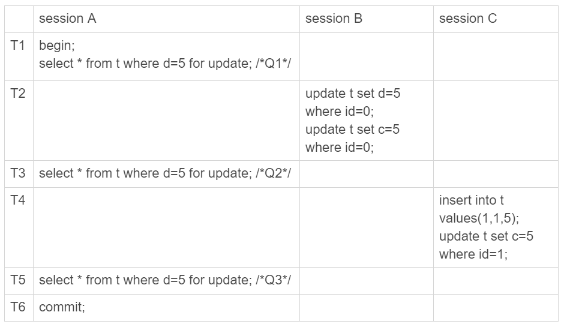
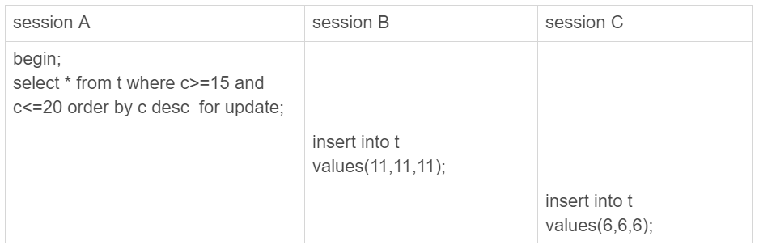

# 20讲幻读是什么，幻读有什么问题

在上一篇文章最后，我给你留了一个关于加锁规则的问题。今天，我们就从这个问题说起吧。

为了便于说明问题，这一篇文章，我们就先使用一个小一点儿的表。建表和初始化语句如下（为了便于本期的例子说明，我把上篇文章中用到的表结构做了点儿修改）：

```mysql
CREATE TABLE `t` (
  `id` int(11) NOT NULL,
  `c` int(11) DEFAULT NULL,
  `d` int(11) DEFAULT NULL,
  PRIMARY KEY (`id`),
  KEY `c` (`c`)
) ENGINE=InnoDB;

insert into t values(0,0,0),(5,5,5),
(10,10,10),(15,15,15),(20,20,20),(25,25,25);
```

这个表除了主键 id 外，还有一个索引 c，初始化语句在表中插入了 6 行数据。

上期我留给你的问题是，下面的语句序列，是怎么加锁的，加的锁又是什么时候释放的呢？

```mysql
begin;
select * from t where d=5 for update;
commit;
```

这个语句会命中 d=5 的这一行，对应的主键 id=5，因此在 select 语句执行完成后，id=5 这一行会加一个写锁，而且由于两阶段锁协议，这个写锁会在执行 commit 语句的时候释放。

由于字段 d 上没有索引，因此这条查询语句会做全表扫描。那么，其他被扫描到的，但是不满足条件的 5 行记录上，会不会被加锁呢？

InnoDB 的默认事务隔离级别是可重复读，所以本文接下来没有特殊说明的部分，都是设定在可重复读隔离级别下。

## 一、幻读是什么？

现在，我们就来分析一下，如果只在 id=5 这一行加锁，而其他行的不加锁的话，会怎么样。

下面先来看一下这个场景：

|      | session A                                                    | session B                        | session C                    |
| ---- | ------------------------------------------------------------ | -------------------------------- | ---------------------------- |
| T1   | begin;<br />select * from t where d = 5 for update;//Q1<br />==>result:(5,5,5) |                                  |                              |
| T2   |                                                              | update t set d = 5 where id = 0; |                              |
| T3   | select * from t where d = 5 for update;//Q2<br />==>result:(0,0,5),(5,5,5) |                                  |                              |
| T4   |                                                              |                                  | insert into t values(1,1,5); |
| T5   | select * from t where d = 5 for update;//Q3<br />==>result:(0,0,5),(1,1,5),(5,5,5) |                                  |                              |
| T6   | commit;                                                      |                                  |                              |

图 1 假设只在 id=5 这一行加行锁

session A 里执行了三次查询，分别是 Q1、Q2 和 Q3。它们的 SQL 语句都是 `select * from t where d=5 for update`。这个语句的意思是查所有 d=5 的行，而且使用的是当前读，并且加上写锁。现在，我们来看一下这三条 SQL 语句，分别会返回什么结果。

1. Q1 只返回 id=5 这一行；
2. 在 T2 时刻，session B 把 id=0 这一行的 d 值改成了 5，因此 T3 时刻 Q2 查出来的是 id=0 和 id=5 这两行；
3. 在 T4 时刻，session C 又插入一行（1,1,5），因此 T5 时刻 Q3 查出来的是 id=0、id=1 和 id=5 的这三行。

其中，Q3 读到 id=1 这一行的现象，被称为“幻读”。也就是说，幻读指的是一个事务在前后两次查询同一个范围的时候，后一次查询看到了前一次查询没有看到的行。

这里，我需要对“幻读”做一个说明：

1. 在可重复读隔离级别下，普通的查询是快照读，是不会看到别的事务插入的数据的。因此，幻读在“当前读”下才会出现。
2. 上面 session B 的修改结果，被 session A 之后的 select 语句用“当前读”看到，不能称为幻读。幻读仅专指“新插入的行”。

如果只从第 8 篇文章[《事务到底是隔离的还是不隔离的？》](https://time.geekbang.org/column/article/70562)我们学到的事务可见性规则来分析的话，上面这三条 SQL 语句的返回结果都没有问题。

因为这三个查询都是加了 for update，都是当前读。而当前读的规则，就是要能读到所有已经提交的记录的最新值。并且，session B 和 sessionC 的两条语句，执行后就会提交，所以 Q2 和 Q3 就是应该看到这两个事务的操作效果，而且也看到了，这跟事务的可见性规则并不矛盾。

但是，这是不是真的没问题呢？

不，这里还真就有问题。

# 幻读有什么问题？

**首先是语义上的。**session A 在 T1 时刻就声明了，“我要把所有 d=5 的行锁住，不准别的事务进行读写操作”。而实际上，这个语义被破坏了。

如果现在这样看感觉还不明显的话，我再往 session B 和 session C 里面分别加一条 SQL 语句，你再看看会出现什么现象。



图 2 假设只在 id=5 这一行加行锁--语义被破坏

session B 的第二条语句 update t set c=5 where id=0，语义是“我把 id=0、d=5 这一行的 c 值，改成了 5”。

由于在 T1 时刻，session A 还只是给 id=5 这一行加了行锁， 并没有给 id=0 这行加上锁。因此，session B 在 T2 时刻，是可以执行这两条 update 语句的。这样，就破坏了 session A 里 Q1 语句要锁住所有 d=5 的行的加锁声明。

session C 也是一样的道理，对 id=1 这一行的修改，也是破坏了 Q1 的加锁声明。

**其次，是数据一致性的问题。**

我们知道，锁的设计是为了保证数据的一致性。而这个一致性，不止是数据库内部数据状态在此刻的一致性，还包含了数据和日志在逻辑上的一致性。

为了说明这个问题，我给 session A 在 T1 时刻再加一个更新语句，即：update t set d=100 where d=5。


图 3 假设只在 id=5 这一行加行锁--数据一致性问题

update 的加锁语义和 select ...for update 是一致的，所以这时候加上这条 update 语句也很合理。session A 声明说“要给 d=5 的语句加上锁”，就是为了要更新数据，新加的这条 update 语句就是把它认为加上了锁的这一行的 d 值修改成了 100。

现在，我们来分析一下图 3 执行完成后，数据库里会是什么结果。

1. 经过 T1 时刻，id=5 这一行变成 (5,5,100)，当然这个结果最终是在 T6 时刻正式提交的;
2. 经过 T2 时刻，id=0 这一行变成(0,5,5);
3. 经过 T4 时刻，表里面多了一行(1,5,5);
4. 其他行跟这个执行序列无关，保持不变。

这样看，这些数据也没啥问题，但是我们再来看看这时候 binlog 里面的内容。

1. T2 时刻，session B 事务提交，写入了两条语句；
2. T4 时刻，session C 事务提交，写入了两条语句；
3. T6 时刻，session A 事务提交，写入了 update t set d=100 where d=5 这条语句。

我统一放到一起的话，就是这样的：

```
update t set d=5 where id=0; /*(0,0,5)*/
update t set c=5 where id=0; /*(0,5,5)*/

insert into t values(1,1,5); /*(1,1,5)*/
update t set c=5 where id=1; /*(1,5,5)*/

update t set d=100 where d=5;/*所有d=5的行，d改成100*/
```

好，你应该看出问题了。这个语句序列，不论是拿到备库去执行，还是以后用 binlog 来克隆一个库，这三行的结果，都变成了 (0,5,100)、(1,5,100)和(5,5,100)。

也就是说，id=0 和 id=1 这两行，发生了数据不一致。这个问题很严重，是不行的。

到这里，我们再回顾一下，**这个数据不一致到底是怎么引入的？**

我们分析一下可以知道，这是我们假设“select * from t where d=5 for update 这条语句只给 d=5 这一行，也就是 id=5 的这一行加锁”导致的。

所以我们认为，上面的设定不合理，要改。

那怎么改呢？我们把扫描过程中碰到的行，也都加上写锁，再来看看执行效果。


图 4 假设扫描到的行都被加上了行锁

由于 session A 把所有的行都加了写锁，所以 session B 在执行第一个 update 语句的时候就被锁住了。需要等到 T6 时刻 session A 提交以后，session B 才能继续执行。

这样对于 id=0 这一行，在数据库里的最终结果还是 (0,5,5)。在 binlog 里面，执行序列是这样的：

```
insert into t values(1,1,5); /*(1,1,5)*/
update t set c=5 where id=1; /*(1,5,5)*/

update t set d=100 where d=5;/*所有d=5的行，d改成100*/

update t set d=5 where id=0; /*(0,0,5)*/
update t set c=5 where id=0; /*(0,5,5)*/
```

可以看到，按照日志顺序执行，id=0 这一行的最终结果也是(0,5,5)。所以，id=0 这一行的问题解决了。

但同时你也可以看到，id=1 这一行，在数据库里面的结果是(1,5,5)，而根据 binlog 的执行结果是(1,5,100)，也就是说幻读的问题还是没有解决。为什么我们已经这么“凶残”地，把所有的记录都上了锁，还是阻止不了 id=1 这一行的插入和更新呢？

原因很简单。在 T3 时刻，我们给所有行加锁的时候，id=1 这一行还不存在，不存在也就加不上锁。

**也就是说，即使把所有的记录都加上锁，还是阻止不了新插入的记录，**这也是为什么“幻读”会被单独拿出来解决的原因。

到这里，其实我们刚说明完文章的标题 ：幻读的定义和幻读有什么问题。

接下来，我们再看看 InnoDB 怎么解决幻读的问题。

# 如何解决幻读？

现在你知道了，产生幻读的原因是，行锁只能锁住行，但是新插入记录这个动作，要更新的是记录之间的“间隙”。因此，为了解决幻读问题，InnoDB 只好引入新的锁，也就是间隙锁(Gap Lock)。

顾名思义，间隙锁，锁的就是两个值之间的空隙。比如文章开头的表 t，初始化插入了 6 个记录，这就产生了 7 个间隙。


图 5 表 t 主键索引上的行锁和间隙锁

这样，当你执行 select * from t where d=5 for update 的时候，就不止是给数据库中已有的 6 个记录加上了行锁，还同时加了 7 个间隙锁。这样就确保了无法再插入新的记录。

也就是说这时候，在一行行扫描的过程中，不仅将给行加上了行锁，还给行两边的空隙，也加上了间隙锁。

现在你知道了，数据行是可以加上锁的实体，数据行之间的间隙，也是可以加上锁的实体。但是间隙锁跟我们之前碰到过的锁都不太一样。

比如行锁，分成读锁和写锁。下图就是这两种类型行锁的冲突关系。


图 6 两种行锁间的冲突关系

也就是说，跟行锁有冲突关系的是“另外一个行锁”。

但是间隙锁不一样，**跟间隙锁存在冲突关系的，是“往这个间隙中插入一个记录”这个操作。**间隙锁之间都不存在冲突关系。

这句话不太好理解，我给你举个例子：


图 7 间隙锁之间不互锁

这里 session B 并不会被堵住。因为表 t 里并没有 c=7 这个记录，因此 session A 加的是间隙锁(5,10)。而 session B 也是在这个间隙加的间隙锁。它们有共同的目标，即：保护这个间隙，不允许插入值。但，它们之间是不冲突的。

间隙锁和行锁合称 next-key lock，每个 next-key lock 是前开后闭区间。也就是说，我们的表 t 初始化以后，如果用 select * from t for update 要把整个表所有记录锁起来，就形成了 7 个 next-key lock，分别是 (-∞,0]、(0,5]、(5,10]、(10,15]、(15,20]、(20, 25]、(25, +suprenum]。

> 备注：这篇文章中，如果没有特别说明，我们把间隙锁记为开区间，把next-key lock记为前开后闭区间。

你可能会问说，这个 suprenum 从哪儿来的呢？

这是因为+∞是开区间。实现上，InnoDB 给每个索引加了一个不存在的最大值 suprenum，这样才符合我们前面说的“都是前开后闭区间”。

**间隙锁和next-key lock的引入，帮我们解决了幻读的问题，但同时也带来了一些“困扰”。**

在前面的文章中，就有同学提到了这个问题。我把他的问题转述一下，对应到我们这个例子的表来说，业务逻辑这样的：任意锁住一行，如果这一行不存在的话就插入，如果存在这一行就更新它的数据，代码如下：

```
begin;
select * from t where id=N for update;

/*如果行不存在*/
insert into t values(N,N,N);
/*如果行存在*/
update t set d=N set id=N;

commit;
```

可能你会说，这个不是 insert ... on duplicate key update 就能解决吗？但其实在有多个唯一键的时候，这个方法是不能满足这位提问同学的需求的。至于为什么，我会在后面的文章中再展开说明。

现在，我们就只讨论这个逻辑。

这个同学碰到的现象是，这个逻辑一旦有并发，就会碰到死锁。你一定也觉得奇怪，这个逻辑每次操作前用 for update 锁起来，已经是最严格的模式了，怎么还会有死锁呢？

这里，我用两个 session 来模拟并发，并假设 N=9。


图 8 间隙锁导致的死锁

你看到了，其实都不需要用到后面的 update 语句，就已经形成死锁了。我们按语句执行顺序来分析一下：

1. session A 执行 select ... for update 语句，由于 id=9 这一行并不存在，因此会加上间隙锁(5,10);
2. session B 执行 select ... for update 语句，同样会加上间隙锁(5,10)，间隙锁之间不会冲突，因此这个语句可以执行成功；
3. session B 试图插入一行(9,9,9)，被 session A 的间隙锁挡住了，只好进入等待；
4. session A 试图插入一行(9,9,9)，被 session B 的间隙锁挡住了。

至此，两个 session 进入互相等待状态，形成死锁。当然，InnoDB 的死锁检测马上就发现了这对死锁关系，让 session A 的 insert 语句报错返回了。

你现在知道了，**间隙锁的引入，可能会导致同样的语句锁住更大的范围，这其实是影响了并发度的**。其实，这还只是一个简单的例子，在下一篇文章中我们还会碰到更多、更复杂的例子。

你可能会说，为了解决幻读的问题，我们引入了这么一大串内容，有没有更简单一点的处理方法呢。

我在文章一开始就说过，如果没有特别说明，今天和你分析的问题都是在可重复读隔离级别下的，间隙锁是在可重复读隔离级别下才会生效的。所以，你如果把隔离级别设置为读提交的话，就没有间隙锁了。但同时，你要解决可能出现的数据和日志不一致问题，需要把 binlog 格式设置为 row。这，也是现在不少公司使用的配置组合。

前面文章的评论区有同学留言说，他们公司就使用的是读提交隔离级别加 binlog_format=row 的组合。他曾问他们公司的 DBA 说，你为什么要这么配置。DBA 直接答复说，因为大家都这么用呀。

所以，这个同学在评论区就问说，这个配置到底合不合理。

关于这个问题本身的答案是，如果读提交隔离级别够用，也就是说，业务不需要可重复读的保证，这样考虑到读提交下操作数据的锁范围更小（没有间隙锁），这个选择是合理的。

但其实我想说的是，配置是否合理，跟业务场景有关，需要具体问题具体分析。

但是，如果 DBA 认为之所以这么用的原因是“大家都这么用”，那就有问题了，或者说，迟早会出问题。

比如说，大家都用读提交，可是逻辑备份的时候，mysqldump 为什么要把备份线程设置成可重复读呢？（这个我在前面的文章中已经解释过了，你可以再回顾下第 6 篇文章[《全局锁和表锁 ：给表加个字段怎么有这么多阻碍？》](https://time.geekbang.org/column/article/69862)的内容）

然后，在备份期间，备份线程用的是可重复读，而业务线程用的是读提交。同时存在两种事务隔离级别，会不会有问题？

进一步地，这两个不同的隔离级别现象有什么不一样的，关于我们的业务，“用读提交就够了”这个结论是怎么得到的？

如果业务开发和运维团队这些问题都没有弄清楚，那么“没问题”这个结论，本身就是有问题的。

# 小结

今天我们从上一篇文章的课后问题说起，提到了全表扫描的加锁方式。我们发现即使给所有的行都加上行锁，仍然无法解决幻读问题，因此引入了间隙锁的概念。

我碰到过很多对数据库有一定了解的业务开发人员，他们在设计数据表结构和业务 SQL 语句的时候，对行锁有很准确的认识，但却很少考虑到间隙锁。最后的结果，就是生产库上会经常出现由于间隙锁导致的死锁现象。

行锁确实比较直观，判断规则也相对简单，间隙锁的引入会影响系统的并发度，也增加了锁分析的复杂度，但也有章可循。下一篇文章，我就会为你讲解 InnoDB 的加锁规则，帮你理顺这其中的“章法”。

作为对下一篇文章的预习，我给你留下一个思考题。



图 9 事务进入锁等待状态

如果你之前没有了解过本篇文章的相关内容，一定觉得这三个语句简直是风马牛不相及。但实际上，这里 session B 和 session C 的 insert 语句都会进入锁等待状态。

你可以试着分析一下，出现这种情况的原因是什么？

这里需要说明的是，这其实是我在下一篇文章介绍加锁规则后才能回答的问题，是留给你作为预习的，其中 session C 被锁住这个分析是有点难度的。如果你没有分析出来，也不要气馁，我会在下一篇文章和你详细说明。

你也可以说说，你的线上 MySQL 配置的是什么隔离级别，为什么会这么配置？你有没有碰到什么场景，是必须使用可重复读隔离级别的呢？

你可以把你的碰到的场景和分析写在留言区里，我会在下一篇文章选取有趣的评论跟大家一起分享和分析。感谢你的收听，也欢迎你把这篇文章分享给更多的朋友一起阅读。

# 上期问题时间

我们在本文的开头回答了上期问题。有同学的回答中还说明了读提交隔离级别下，在语句执行完成后，是只有行锁的。而且语句执行完成后，InnoDB 就会把不满足条件的行行锁去掉。

当然了，c=5 这一行的行锁，还是会等到 commit 的时候才释放的。

评论区留言点赞板：

> @薛畅 、@张永志同学给出了正确答案。而且提到了在读提交隔离级别下，是只有行锁的。
> @帆帆帆帆帆帆帆帆、@欧阳成 对上期的例子做了验证，需要说明一下，需要在启动配置里面增加performance_schema=on，才能用上这个功能，performance_schema库里的表才有数据。

## 精选留言

- 

    令狐少侠

    老师，今天的文章对我影响很大，发现之前掌握的知识有些错误的地方，课后我用你的表结构根据以前不清楚的地方实践了一遍，现在有两个问题，麻烦您解答下
    1.我在事务1中执行 begin;select * from t where c=5 for update;事务未提交，然后事务2中begin;update t set c=5 where id=0;执行阻塞，替换成update t set c=11 where id=0;执行不阻塞，我觉得原因是事务1执行时产生next-key lock范围是(0,5].(5,10]。我想问下update set操作c=xxx是会加锁吗？以及加锁的原理。
    2.一直以为gap只会在二级索引上，看了你的死锁案例，发现主键索引上也会有gap锁？

    2018-12-28 15:37

    作者回复

    \1. 好问题。你可以理解为要在索引c上插入一个(c=5,id=0)这一行，是落在(0,5],(5,10]里面的，11可以对吧

    \2. 嗯，主键索引的间隙上也要有Gap lock保护的

    2018-12-28 15:54

- 

    薛畅

    可重复读隔离级别下，经试验：
    SELECT * FROM t where c>=15 and c<=20 for update; 会加如下锁：
    next-key lock:(10, 15], (15, 20]
    gap lock:(20, 25)

    SELECT * FROM t where c>=15 and c<=20 order by c desc for update; 会加如下锁：
    next-key lock:(5, 10], (10, 15], (15, 20]
    gap lock:(20, 25)

    session C 被锁住的原因就是根据索引 c 逆序排序后多出的 next-key lock:(5, 10]

    同时我有个疑问：加不加 next-key lock:(5, 10] 好像都不会影响到 session A 可重复读的语义，那么为什么要加这个锁呢？

    2018-12-29 09:03

    作者回复

    是的，这个其实就是为啥总结规则有点麻烦，有时候只是因为代码是这么写的

    2018-12-29 09:18

- 

    AI杜嘉嘉

    说真的，这一系列文章实用性真的很强，老师非常负责，想必牵扯到老师大量精力，希望老师再出好文章，谢谢您了，辛苦了

    2018-12-28 13:59

    作者回复

    精力花了没事，睡一觉醒来还是一条好汉
    主要还是得大家有收获，我就值了

    2018-12-28 19:03

- 

    郭江伟

    insert into t values(0,0,0),(5,5,5),
    (10,10,10),(15,15,15),(20,20,20),(25,25,25);
    运行mysql> begin;
    Query OK, 0 rows affected (0.00 sec)
    mysql> select * from t where c>=15 and c<=20 order by c desc for update;
    c 索引会在最右侧包含主键值，c索引的值为(0,0) (5,5) (10,10) (15,15) (20,20) (25,25)
    此时c索引上锁的范围其实还要匹配主键值 。
    思考题答案是，上限会扫到c索引(20,20) 上一个键，为了防止c为20 主键值小于25 的行插入，需要锁定(20,20) (25,25) 两者的间隙；开启另一会话(26,25,25)可以插入，而(24,25,25)会被堵塞。
    下限会扫描到(15,15)的下一个键也就是(10,10),测试语句会继续扫描一个键就是(5,5) ，此时会锁定，(5,5) 到(15,15)的间隙，由于id是主键不可重复所以下限也是闭区间；
    在本例的测试数据中添加(21,25,25)后就可以正常插入(24,25,25)

    2018-12-28 13:38

    作者回复

    感觉你下一篇看起来会很轻松了哈

    2018-12-28 19:04

- 

    慧鑫coming

    这篇需要多读几遍，again

    2018-12-28 08:24

- 

    沉浮

    通过打印锁日志帮助理解问题
    锁信息见括号里的说明。

    TABLE LOCK table `guo_test`.`t` trx id 105275 lock mode IX
    RECORD LOCKS space id 31 page no 4 n bits 80 index c of table `guo_test`.`t` trx id 105275 lock_mode X
    Record lock, heap no 4 PHYSICAL RECORD: n_fields 2; compact format; info bits 0 ----(Next-Key Lock，索引锁c（5，10])
    0: len 4; hex 8000000a; asc ;;
    1: len 4; hex 8000000a; asc ;;

    Record lock, heap no 5 PHYSICAL RECORD: n_fields 2; compact format; info bits 0 ----(Next-Key Lock，索引锁c (10,15])
    0: len 4; hex 8000000f; asc ;;
    1: len 4; hex 8000000f; asc ;;

    Record lock, heap no 6 PHYSICAL RECORD: n_fields 2; compact format; info bits 0 ----(Next-Key Lock，索引锁c (15,20])
    0: len 4; hex 80000014; asc ;;
    1: len 4; hex 80000014; asc ;;

    Record lock, heap no 7 PHYSICAL RECORD: n_fields 2; compact format; info bits 0 ----(Next-Key Lock，索引锁c (20,25])
    0: len 4; hex 80000019; asc ;;
    1: len 4; hex 80000019; asc ;;

    RECORD LOCKS space id 31 page no 3 n bits 80 index PRIMARY of table `guo_test`.`t` trx id 105275 lock_mode X locks rec but not gap
    Record lock, heap no 5 PHYSICAL RECORD: n_fields 5; compact format; info bits 0
    ----(记录锁 锁c=15对应的主键）
    0: len 4; hex 8000000f; asc ;;
    1: len 6; hex 0000000199e3; asc ;;
    2: len 7; hex ca000001470134; asc G 4;;
    3: len 4; hex 8000000f; asc ;;
    4: len 4; hex 8000000f; asc ;;

    Record lock, heap no 6 PHYSICAL RECORD: n_fields 5; compact format; info bits 0
    0: len 4; hex 80000014; asc ;;
    ----(记录锁 锁c=20对应的主键）
    1: len 6; hex 0000000199e3; asc ;;
    2: len 7; hex ca000001470140; asc G @;;
    3: len 4; hex 80000014; asc ;;
    4: len 4; hex 80000014; asc ;;
    由于字数限制，正序及无排序的日志无法帖出，倒序日志比这两者，多了范围(Next-Key Lock，索引锁c（5，10])，个人理解是，加锁分两次，第一次，即正序的锁，第二次为倒序的锁，即多出的(5,10],在RR隔离级别，
    innodb在加锁的过程中会默认向后锁一个记录，加上Next-Key Lock,第一次加锁的时候10已经在范围，由于倒序，向后，即向5再加Next-key Lock,即多出的(5,10]范围

    2018-12-28 16:06

    作者回复

    优秀

    2018-12-28 17:14

- 

    往事随风，顺其自然

    总结：for update 是锁住所有行还有间隙锁，但是间隙之间互不冲突，但是互不冲突，为什么插入9这一行会被间隙锁等待，原来没有这一行，这和查询9这一行不是一样？

    2018-12-28 08:09

- 

    en

    老师您好，我mysql的隔离级别是可重复读，数据是(0,0,0),(5,5,5),(10,10,10),(15,15,15),(20,20,20),(25,25,25)，使用了begin;select * from t where c>=15 and c<=20 order by c desc for update;然后sessionB的11阻塞了，但是(6,6,6)的插入成功了这是什么原因呢？

    2018-12-31 10:21

- 

    郭健

    老师，想请教您几个问题。1.在第六章MDL锁的时候，您说给大表增加字段和增加索引的时候要小心，之前做过测试，给一个一千万的数据增加索引有时需要40分钟，但是增加索引不会对表增加MDL锁吧。除了增加索引慢，还会对数据库有什么影响吗，我问我们dba，他说就开始和结束的时候上一下锁，没什么影响，我个人是持怀疑态度的。2，老师讲到表锁除了MDL锁，还有显示命令lock table的命令的表锁，老师我可以认为，在mysql中如果不显示使用lock table表锁的话，那么mysql是永远不会使用表锁的，如果锁的条件没有索引，使用的是锁住行锁+间隙控制并发。

    2018-12-30 16:13

    作者回复

    \1. 在锁方面你们dba说的基本是对的。一开始和结束有写锁，执行中间40分钟只有读锁
    但是1000万的表要做40分钟，可能意味着系统压力大（或者配置偏小），这样可能不是没影响对，比较这个操作还是要吃IO和CPU的

    \2. 嗯，innodb引擎是这样的。

    2018-12-30 19:23

- 

    滔滔

    老师，听了您的课收获满满～～感谢您的付出！您可不可以在分析死锁的时候讲一下如何分析死锁日志，期待～～

    2018-12-29 18:20

    作者回复

    谢谢你的肯定。

    嗯死锁分析会有一篇专门说。

    不过你可以提前说一下碰到的疑问

    2018-12-29 20:08

- 

    胡月

    老师，今天线上遇上了一个死锁的问题，您能帮我分析下吗。
    根据前面文章的理解：死锁产生的原因如下
    线程1：update语句where c= 1 然后 update语句where c=2
    线程2：update语句where c=2然后 update语句where c=1
    如果线程1获取c=1的锁，等待c=2的锁，线程2获取了c=2的锁，等待c=1的锁，就会产生死锁。
    但是线上的情况是
    线程1：update语句where c= 1 然后 update语句where c=2
    线程2：update语句where c=1然后 update语句where c=2
    按说不会产生死锁啊，因为如果线程1获取了c=1的锁，线程2就阻塞了。线程1执行完之后，线程2执行就可以了死锁日志如下：

    (1) TRANSACTION:
    TRANSACTION 9418928, ACTIVE 0.088 sec fetching rows
    mysql tables in use 1, locked 1
    LOCK WAIT 66 lock struct(s), heap size 13864, 8 row lock(s)
    LOCK BLOCKING MySQL thread id: 11495130 block 11105198
    MySQL thread id 11105198, OS thread handle 0x2b086bf45700, query id 88822589 39.106.161.89 daogou Searching rows for update
    UPDATE union_pid
    SET USE_TIMES = USE_TIMES + 1
    WHERE PID = 'mm_128160800_40474215_33107450401'
    (1) WAITING FOR THIS LOCK TO BE GRANTED:
    RECORD LOCKS space id 134 page no 93 n bits 192 index `PRIMARY` of table `shanfan`.`union_pid` trx id 9418928 lock_mode X locks rec but not gap waiting
    Record lock, heap no 86 PHYSICAL RECORD: n_fields 12; compact format; info bits 0

    (2) TRANSACTION:
    TRANSACTION 9418929, ACTIVE 0.088 sec fetching rows
    mysql tables in use 1, locked 1
    280 lock struct(s), heap size 46632, 17 row lock(s), undo log entries 1
    MySQL thread id 11495130, OS thread handle 0x2b086be41700, query id 88822594 39.106.161.89 daogou Searching rows for update
    UPDATE union_pid
    SET USE_TIMES = USE_TIMES + 1
    WHERE PID = '1000501132_0_1432392817'
    (2) HOLDS THE LOCK(S):
    RECORD LOCKS space id 134 page no 93 n bits 192 index `PRIMARY` of table `shanfan`.`union_pid` trx id 9418929 lock_mode X locks rec but not gap
    Record lock, heap no 86 PHYSICAL RECORD: n_fields 12; compact format; info bits 0

    (2) WAITING FOR THIS LOCK TO BE GRANTED:
    RECORD LOCKS space id 134 page no 68 n bits 264 index `PRIMARY` of table `shanfan`.`union_pid` trx id 9418929 lock_mode X locks rec but not gap waiting
    Record lock, heap no 116 PHYSICAL RECORD: n_fields 12; compact format; info bits 0

    WE ROLL BACK TRANSACTION (1)

    2018-12-29 18:08

    作者回复

    PID是唯一索引吗？ 给一下表结构。这两个语句分别对应的主键ID如果单独查出来分别是多少

    2018-12-29 20:33

- 

    高枕

    林老师，今天我又回头看第四节 深入浅出谈索引（上），里面有这样一段话：为了让一个查询尽量少地读磁盘，就必须让查询过程访问尽量少的数据块。那么，我们就不应该使用二叉树，而是要使用“N 叉”树。这里，“N 叉”树中的“N”取决于数据块的大小。
    我想问的是，
    一 mysql是以page为最小单位的，mysql一次磁盘io能只读一个块吗？还是多个块组成的page？
    二 若一次只能读一个page，也就是多个块的话，这个N的大小是不是应该取决于page的大小呢？
    三 主键索引叶子结点存放的实际数据，应该是通过指针跟叶子结点连接的吗？还是直接存在叶子结点所在的页里吗？

    2018-12-29 12:21

- 

    信信

    老师你好，如果图1的字段d有索引，按前面说的T1时刻后，只有id等于5这一行加了写锁。那么session B 操作的是id等于0这一行，应该不会被阻断吧？如果没阻断的话，仍然会产生语义问题及数据不一致的情况啊。想不明白。。。

    2018-12-29 00:36

    作者回复

    如果d有索引，而且写法是d=5，那么其他语句要把其他行的d改成5，也是不行的哦

    2018-12-29 09:15

- 

    可凡不凡

    老师
    update tab1 set name =(select name from tab2 where status =2)...
    tab2.status 上有二级非唯一索引,rr 隔离级别
    上述情况
    tab2.id 上的的索引会被锁吗?
    实际开发 看到的死锁情况 是这条语句在等待 s 锁 但是没有 gap 锁,也没有设置 semi-consistent read

    2018-12-28 09:44

    作者回复

    Tab2满足条件的航上会加读锁

    2018-12-28 10:05

- 

    小新

    这篇文章真的需要多啃几遍，

    2018-12-28 08:53

    作者回复

    嗯嗯，而且这篇是下篇的基础

    2018-12-28 09:43

- 

    Justin

    下一章老师会不会讲走普通索引，锁普通索引的时候，主键索引，以及其他索引的加锁顺序或者规则呢？很是好奇

    2018-12-28 00:50

    作者回复

    嗯嗯，就是这些内容

    这篇文章末尾的问题如果一眼看懂的同学应该看起来就轻松的

    2018-12-28 09:46

- 

    spraith

    以前没用过 for update 语句，我上一个问题的答案应该找到了，原来 select 语句只有加了 for update 语句才会加写锁的

    2019-01-12 03:11

    作者回复

    你得到了它

    2019-01-12 13:02

- 

    spraith

    图1的Q1语句，每次 select 是否都是自动加写锁的？如果是，那为了实现可重复读搞出来的mvcc好像就没必要了啊，因为别的事务都只能等待前面的写锁释放才能再写，所以Q1所在的事务自然就能实现“可重复读”，似乎不需要mvcc。
    求老师解答

    2019-01-12 03:06

- 

    alias cd=rm -rf

    思考题猜测：
    因为sessionA虽然有索引，但是因为排序需要扫描全表。所以为全表增加了gap lock。导致insert都需要等待锁释放。
    是否sessionA不加order by，sessionC就不用block了？

    2019-01-10 09:23

- 

    三木禾

    老师，我的数据库版本是5.6.39-log，存储引擎为innodb,事务的隔离级别为 REPEATABLE-READ
    CREATE TABLE `t` (
    `id` int(11) NOT NULL,
    `c` int(11) DEFAULT NULL,
    `d` int(11) DEFAULT NULL,
    PRIMARY KEY (`id`),
    KEY `c` (`c`)
    ) ENGINE=InnoDB DEFAULT CHARSET=utf8；
    但是我在一个sessionA执行begin; select * from t where d=5 for update;
    得到 5 | 5 | 5 | 这一行数据
    sessionB 执行update t set id=5 set id=0; 然后这条语句阻塞
    sessionC执行insert into t(id,c,d) values(1,1,5); 也阻塞，跟您的图1 的执行结果不一样，为什么啊？

    

    2019-01-07 20:46

    作者回复

    图1是为了推导“如果不阻塞会发生什么现象”

    最后我们推论出来需要阻塞

    实际上跟你验证的这个结果一致的

    2019-01-07 22:04