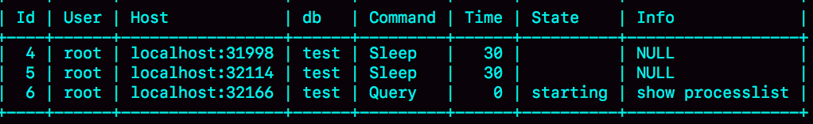
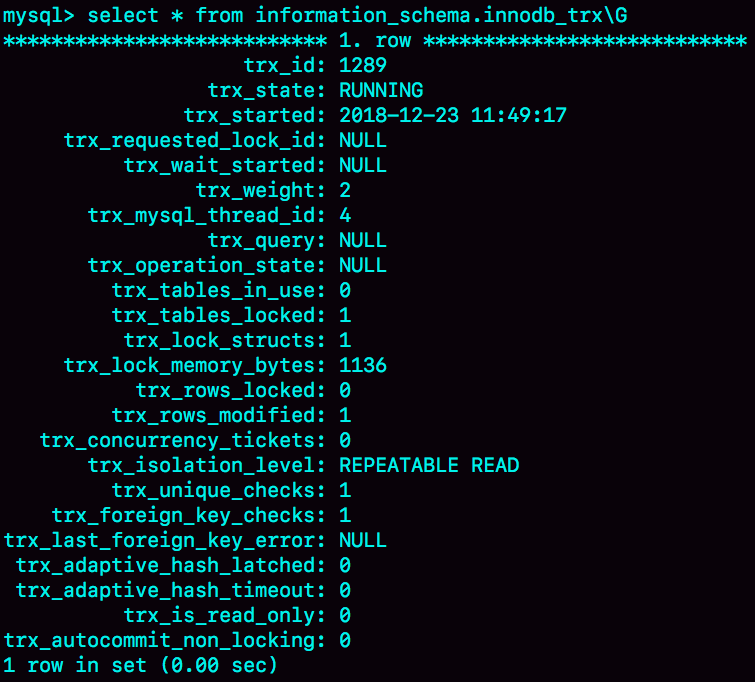
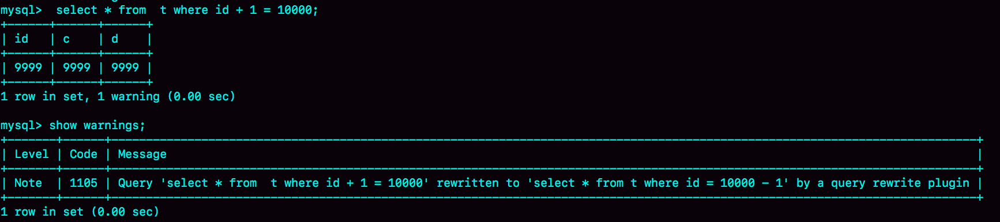
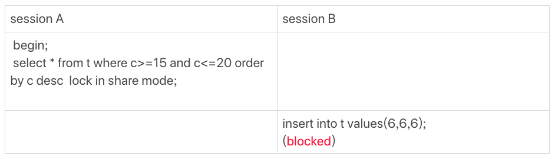

# 22讲MySQL有哪些“饮鸩止渴”提高性能的方法

不知道你在实际运维过程中有没有碰到这样的情景：业务高峰期，生产环境的MySQL压力太大，没法正常响应，需要短期内、临时性地提升一些性能。

我以前做业务护航的时候，就偶尔会碰上这种场景。用户的开发负责人说，不管你用什么方案，让业务先跑起来再说。

但，如果是无损方案的话，肯定不需要等到这个时候才上场。今天我们就来聊聊这些临时方案，并着重说一说它们可能存在的风险。

# 短连接风暴

正常的短连接模式就是连接到数据库后，执行很少的SQL语句就断开，下次需要的时候再重连。如果使用的是短连接，在业务高峰期的时候，就可能出现连接数突然暴涨的情况。

我在第1篇文章[《基础架构：一条SQL查询语句是如何执行的？》](https://time.geekbang.org/column/article/68319)中说过，MySQL建立连接的过程，成本是很高的。除了正常的网络连接三次握手外，还需要做登录权限判断和获得这个连接的数据读写权限。

在数据库压力比较小的时候，这些额外的成本并不明显。

但是，短连接模型存在一个风险，就是一旦数据库处理得慢一些，连接数就会暴涨。max_connections参数，用来控制一个MySQL实例同时存在的连接数的上限，超过这个值，系统就会拒绝接下来的连接请求，并报错提示“Too many connections”。对于被拒绝连接的请求来说，从业务角度看就是数据库不可用。

在机器负载比较高的时候，处理现有请求的时间变长，每个连接保持的时间也更长。这时，再有新建连接的话，就可能会超过max_connections的限制。

碰到这种情况时，一个比较自然的想法，就是调高max_connections的值。但这样做是有风险的。因为设计max_connections这个参数的目的是想保护MySQL，如果我们把它改得太大，让更多的连接都可以进来，那么系统的负载可能会进一步加大，大量的资源耗费在权限验证等逻辑上，结果可能是适得其反，已经连接的线程拿不到CPU资源去执行业务的SQL请求。

那么这种情况下，你还有没有别的建议呢？我这里还有两种方法，但要注意，这些方法都是有损的。

**第一种方法：先处理掉那些占着连接但是不工作的线程。**

max_connections的计算，不是看谁在running，是只要连着就占用一个计数位置。对于那些不需要保持的连接，我们可以通过kill connection主动踢掉。这个行为跟事先设置wait_timeout的效果是一样的。设置wait_timeout参数表示的是，一个线程空闲wait_timeout这么多秒之后，就会被MySQL直接断开连接。

但是需要注意，在show processlist的结果里，踢掉显示为sleep的线程，可能是有损的。我们来看下面这个例子。


图1 sleep线程的两种状态

在上面这个例子里，如果断开session A的连接，因为这时候session A还没有提交，所以MySQL只能按照回滚事务来处理；而断开session B的连接，就没什么大影响。所以，如果按照优先级来说，你应该优先断开像session B这样的事务外空闲的连接。

但是，怎么判断哪些是事务外空闲的呢？session C在T时刻之后的30秒执行show processlist，看到的结果是这样的。



图2 sleep线程的两种状态，show processlist结果

图中id=4和id=5的两个会话都是Sleep 状态。而要看事务具体状态的话，你可以查information_schema库的innodb_trx表。



图3 从information_schema.innodb_trx查询事务状态

这个结果里，trx_mysql_thread_id=4，表示id=4的线程还处在事务中。

因此，如果是连接数过多，你可以优先断开事务外空闲太久的连接；如果这样还不够，再考虑断开事务内空闲太久的连接。

从服务端断开连接使用的是kill connection + id的命令， 一个客户端处于sleep状态时，它的连接被服务端主动断开后，这个客户端并不会马上知道。直到客户端在发起下一个请求的时候，才会收到这样的报错“ERROR 2013 (HY000): Lost connection to MySQL server during query”。

从数据库端主动断开连接可能是有损的，尤其是有的应用端收到这个错误后，不重新连接，而是直接用这个已经不能用的句柄重试查询。这会导致从应用端看上去，“MySQL一直没恢复”。

你可能觉得这是一个冷笑话，但实际上我碰到过不下10次。

所以，如果你是一个支持业务的DBA，不要假设所有的应用代码都会被正确地处理。即使只是一个断开连接的操作，也要确保通知到业务开发团队。

**第二种方法：减少连接过程的消耗。**

有的业务代码会在短时间内先大量申请数据库连接做备用，如果现在数据库确认是被连接行为打挂了，那么一种可能的做法，是让数据库跳过权限验证阶段。

跳过权限验证的方法是：重启数据库，并使用–skip-grant-tables参数启动。这样，整个MySQL会跳过所有的权限验证阶段，包括连接过程和语句执行过程在内。

但是，这种方法特别符合我们标题里说的“饮鸩止渴”，风险极高，是我特别不建议使用的方案。尤其你的库外网可访问的话，就更不能这么做了。

在MySQL 8.0版本里，如果你启用–skip-grant-tables参数，MySQL会默认把 --skip-networking参数打开，表示这时候数据库只能被本地的客户端连接。可见，MySQL官方对skip-grant-tables这个参数的安全问题也很重视。

除了短连接数暴增可能会带来性能问题外，实际上，我们在线上碰到更多的是查询或者更新语句导致的性能问题。其中，查询问题比较典型的有两类，一类是由新出现的慢查询导致的，一类是由QPS（每秒查询数）突增导致的。而关于更新语句导致的性能问题，我会在下一篇文章和你展开说明。

# 慢查询性能问题

在MySQL中，会引发性能问题的慢查询，大体有以下三种可能：

1. 索引没有设计好；
2. SQL语句没写好；
3. MySQL选错了索引。

接下来，我们就具体分析一下这三种可能，以及对应的解决方案。

**导致慢查询的第一种可能是，索引没有设计好。**

这种场景一般就是通过紧急创建索引来解决。MySQL 5.6版本以后，创建索引都支持Online DDL了，对于那种高峰期数据库已经被这个语句打挂了的情况，最高效的做法就是直接执行alter table 语句。

比较理想的是能够在备库先执行。假设你现在的服务是一主一备，主库A、备库B，这个方案的大致流程是这样的：

1. 在备库B上执行 set sql_log_bin=off，也就是不写binlog，然后执行alter table 语句加上索引；
2. 执行主备切换；
3. 这时候主库是B，备库是A。在A上执行 set sql_log_bin=off，然后执行alter table 语句加上索引。

这是一个“古老”的DDL方案。平时在做变更的时候，你应该考虑类似gh-ost这样的方案，更加稳妥。但是在需要紧急处理时，上面这个方案的效率是最高的。

**导致慢查询的第二种可能是，语句没写好。**

比如，我们犯了在第18篇文章[《为什么这些SQL语句逻辑相同，性能却差异巨大？》](https://time.geekbang.org/column/article/74059)中提到的那些错误，导致语句没有使用上索引。

这时，我们可以通过改写SQL语句来处理。MySQL 5.7提供了query_rewrite功能，可以把输入的一种语句改写成另外一种模式。

比如，语句被错误地写成了 select * from t where id + 1 = 10000，你可以通过下面的方式，增加一个语句改写规则。

```
mysql> insert into query_rewrite.rewrite_rules(pattern, replacement, pattern_database) values ("select * from t where id + 1 = ?", "select * from t where id = ? - 1", "db1");

call query_rewrite.flush_rewrite_rules();
```

这里，call query_rewrite.flush_rewrite_rules()这个存储过程，是让插入的新规则生效，也就是我们说的“查询重写”。你可以用图4中的方法来确认改写规则是否生效。



图4 查询重写效果

**导致慢查询的第三种可能，就是碰上了我们在第10篇文章**[**《MySQL为什么有时候会选错索引？》**](https://time.geekbang.org/column/article/71173)**中提到的情况，MySQL选错了索引。**

这时候，应急方案就是给这个语句加上force index。

同样地，使用查询重写功能，给原来的语句加上force index，也可以解决这个问题。

上面我和你讨论的由慢查询导致性能问题的三种可能情况，实际上出现最多的是前两种，即：索引没设计好和语句没写好。而这两种情况，恰恰是完全可以避免的。比如，通过下面这个过程，我们就可以预先发现问题。

1. 上线前，在测试环境，把慢查询日志（slow log）打开，并且把long_query_time设置成0，确保每个语句都会被记录入慢查询日志；
2. 在测试表里插入模拟线上的数据，做一遍回归测试；
3. 观察慢查询日志里每类语句的输出，特别留意Rows_examined字段是否与预期一致。（我们在前面文章中已经多次用到过Rows_examined方法了，相信你已经动手尝试过了。如果还有不明白的，欢迎给我留言，我们一起讨论）。

不要吝啬这段花在上线前的“额外”时间，因为这会帮你省下很多故障复盘的时间。

如果新增的SQL语句不多，手动跑一下就可以。而如果是新项目的话，或者是修改了原有项目的 表结构设计，全量回归测试都是必要的。这时候，你需要工具帮你检查所有的SQL语句的返回结果。比如，你可以使用开源工具pt-query-digest(https://www.percona.com/doc/percona-toolkit/3.0/pt-query-digest.html)。

# QPS突增问题

有时候由于业务突然出现高峰，或者应用程序bug，导致某个语句的QPS突然暴涨，也可能导致MySQL压力过大，影响服务。

我之前碰到过一类情况，是由一个新功能的bug导致的。当然，最理想的情况是让业务把这个功能下掉，服务自然就会恢复。

而下掉一个功能，如果从数据库端处理的话，对应于不同的背景，有不同的方法可用。我这里再和你展开说明一下。

1. 一种是由全新业务的bug导致的。假设你的DB运维是比较规范的，也就是说白名单是一个个加的。这种情况下，如果你能够确定业务方会下掉这个功能，只是时间上没那么快，那么就可以从数据库端直接把白名单去掉。
2. 如果这个新功能使用的是单独的数据库用户，可以用管理员账号把这个用户删掉，然后断开现有连接。这样，这个新功能的连接不成功，由它引发的QPS就会变成0。
3. 如果这个新增的功能跟主体功能是部署在一起的，那么我们只能通过处理语句来限制。这时，我们可以使用上面提到的查询重写功能，把压力最大的SQL语句直接重写成"select 1"返回。

当然，这个操作的风险很高，需要你特别细致。它可能存在两个副作用：

1. 如果别的功能里面也用到了这个SQL语句模板，会有误伤；
2. 很多业务并不是靠这一个语句就能完成逻辑的，所以如果单独把这一个语句以select 1的结果返回的话，可能会导致后面的业务逻辑一起失败。

所以，方案3是用于止血的，跟前面提到的去掉权限验证一样，应该是你所有选项里优先级最低的一个方案。

同时你会发现，其实方案1和2都要依赖于规范的运维体系：虚拟化、白名单机制、业务账号分离。由此可见，更多的准备，往往意味着更稳定的系统。

# 小结

今天这篇文章，我以业务高峰期的性能问题为背景，和你介绍了一些紧急处理的手段。

这些处理手段中，既包括了粗暴地拒绝连接和断开连接，也有通过重写语句来绕过一些坑的方法；既有临时的高危方案，也有未雨绸缪的、相对安全的预案。

在实际开发中，我们也要尽量避免一些低效的方法，比如避免大量地使用短连接。同时，如果你做业务开发的话，要知道，连接异常断开是常有的事，你的代码里要有正确地重连并重试的机制。

DBA虽然可以通过语句重写来暂时处理问题，但是这本身是一个风险高的操作，做好SQL审计可以减少需要这类操作的机会。

其实，你可以看得出来，在这篇文章中我提到的解决方法主要集中在server层。在下一篇文章中，我会继续和你讨论一些跟InnoDB有关的处理方法。

最后，又到了我们的思考题时间了。

今天，我留给你的课后问题是，你是否碰到过，在业务高峰期需要临时救火的场景？你又是怎么处理的呢？

你可以把你的经历和经验写在留言区，我会在下一篇文章的末尾选取有趣的评论跟大家一起分享和分析。感谢你的收听，也欢迎你把这篇文章分享给更多的朋友一起阅读。

# 上期问题时间

前两期我给你留的问题是，下面这个图的执行序列中，为什么session B的insert语句会被堵住。


我们用上一篇的加锁规则来分析一下，看看session A的select语句加了哪些锁：

1. 由于是order by c desc，第一个要定位的是索引c上“最右边的”c=20的行，所以会加上间隙锁(20,25)和next-key lock (15,20]。
2. 在索引c上向左遍历，要扫描到c=10才停下来，所以next-key lock会加到(5,10]，这正是阻塞session B的insert语句的原因。
3. 在扫描过程中，c=20、c=15、c=10这三行都存在值，由于是select *，所以会在主键id上加三个行锁。

因此，session A 的select语句锁的范围就是：

1. 索引c上 (5, 25)；
2. 主键索引上id=10、15、20三个行锁。

这里，我再啰嗦下，你会发现我在文章中，每次加锁都会说明是加在“哪个索引上”的。因为，锁就是加在索引上的，这是InnoDB的一个基础设定，需要你在分析问题的时候要一直记得。

评论区留言点赞板：

> @HuaMax 给出了正确的解释。

> @Justin 同学提了个好问题，<=到底是间隙锁还是行锁？其实，这个问题，你要跟“执行过程”配合起来分析。在InnoDB要去找“第一个值”的时候，是按照等值去找的，用的是等值判断的规则；找到第一个值以后，要在索引内找“下一个值”，对应于我们规则中说的范围查找。

> @信信 提了一个不错的问题，要知道最终的加锁是根据实际执行情况来的。所以，如果一个select * from ... for update 语句，优化器决定使用全表扫描，那么就会把主键索引上next-key lock全加上。

> @nero 同学的问题，提示我需要提醒大家注意，“有行”才会加行锁。如果查询条件没有命中行，那就加next-key lock。当然，等值判断的时候，需要加上优化2（即：索引上的等值查询，向右遍历时且最后一个值不满足等值条件的时候，next-key lock退化为间隙锁。）。

> @小李子、@发条橙子同学，都提了很好的问题，这期高质量评论很多，你也都可以去看看。

最后，我要为元旦期间还坚持学习的同学们，点个赞 ^_^

## 精选留言

- 

    某、人

    最近才发生了个案列:
    由于一个delete大事务导致磁盘空间满了,数据库hang住,连接不上,所以无法kill掉该大事务
    当时的观察到的现象是:
    binlog有一个文件已经达到50多G
    lsof | grep delete 该tmp文件100多G
    redo log还是只有4个组,每个文件1G
    undo log大概有100来G
    由于数据库连不上,只有把连接切到从库,kill掉主库的进程。过了几分钟,binlog文件才缩小为原来的大小。把主库启起来,但是recovery非常慢。后面kill掉,又以innodb_force_recovery=3恢复,recovery也是半天没反应。由于这个库也不是重要的库,就把新的主库的备份文件重做了之前的主库,以从库启起来

    通过最近的学习+测试分析了下,为什么binlog达到了50多G。tmp文件100多G.
    由于binlog_cache不够用,把binlog写进了tmp文件中,binlog文件50多G,说明事务已经执行完成,是binlog在fsync阶段,把空间占满了。fsync并不是一个move而是相当于copy。要等binlog完全落盘以后,才会删除之前的tmp文件。redo log由于是循环写,而且在事务执行过程中,就会把redo log分为mtx落地到磁盘上。所以没有一次性暴增,还是以1G的大小持续写.
    我也是后续做测试,观察在事务进行中,redo log文件一直都有变化。binlog没有变化
    binlog是在事务执行完以后,才一次性fsync到磁盘
    但是为什么recovery=3的情况下,还比较耗时。我估计是之前脏页较多,而redo log又全部被覆盖掉,
    需要先通过binlog来恢复redo log,然后再通过redo log来恢复数据页。

    请问老师有没有更好的办法来处理这种hang住的情况?
    如果在操作系统层面kill掉执行的线程,就好了。
    昨天提到的问题3,我也没有测试出来Sending to client这个状态.是之前别人问到的,我也挺懵

    2019-01-03 19:56

    作者回复

    先说明下，binlog是没有“恢复redolog”的能力的哈。其它部分分析得很好

    Binlog 这么大，说明是大事务，崩溃恢复的时候要处理的redolog 很多，估计耗时间耗在这。

    这种磁盘空间满的情况，以前我的处理方法是把最老的binlog移动到别的盘（如果确定日志已经备份到备份系统了就删掉），目的是腾出空间让这个事务执行完成。
    后面可以考虑这种方案，强制重启还是有点伤的，不过核心还是做好监控，不让出现磁盘100%写满的情况

    2019-01-03 22:09

- 

    Long

    不是专业DBA，遇到过几次数据库问题，有的能解决，有的好像除了重启或者干等着没啥好办法。
    MySQL5.6版本遇到的部分问题：

    \1. 几个线程处于killed状态一直kill不掉（1天），然后备份的时候MySQL backup flush all tables with read lock的时候被阻塞，后面的线程只能等待flush table, kill backup以后也没有办法kill那几个killed状态的语句（processlist显示的killed状态的语句的就是show columns, show create table这样的），后面没办法，重启了server。（看到老师后面第25讲有关于kill的解释，非常期待新知识）

    \2. 一个非常大（大几百万行）的表truncate，结果后面所有的线程都阻塞了，类似于下面这个MySQL bug的场景，结果就是等这个truncate结束。没有继续干预。
    https://bugs.mysql.com/bug.php?id=80060

    \3. 某个新功能上线以后，一个记录操作人员操作页面操作时间KPI的功能，由于sql性能不好，在业务上线跑了3天后数据量增多到临界值，突然影响了整个系统性能。数据库发现是大量的sql执行状态是converting heap to MyISAM，sql写法类似 select (select * from table) where id(有索引)= xxxx order by yyyy
    DBA以及他们团队要求重启。但是分析了几分钟后提供了几个意见给"DBA"，并解释重启解决不了问题：首先这个问题重启是解决不了，因为每次这个sql查询全表，查询分配的临时表空间不足了，需要把结果集转到磁盘上，重启了sql动作没变，参数没变所以重启解决不了问题。
    页面查询也没法屏蔽，页面查询也无法过滤条件，
    （1）和研发确认后，表数据删除不影响功能，只影响客户的KPI报表，先备份表，然后删除，后面等功能修复了再补回去。
    （2）调整max_heap_table_size，tmp_table_size，扩大几倍
    （3）给这个sql的唯一的一个order by字段加个索引。
    同时催促研发提供hotfix。最终选择了最简单有效的（1）问题解决，研发迅速后面也发了hotfix解决了。

    \4. 某个消费高峰时间段，高频查询被触发，一天几十万次执行，由于存量数据越来越多，查询性能越来越慢，主要是索引没有很好规划，导致CPU资源使用飙升，后面的sql执行越来越慢。 最后尝试了给2个字段添加单独的索引，解决了50%的问题，看到执行计划，extra里面，索引合并使用了intersect，性能还是慢，然后立马drop原先的2个单独索引，创建两个字段的联合索引，问题解决了。

    \5. 死锁回滚，导致的MySQL hang住了，当时刚入门，只能简单复现死锁，没有保留所有的日志，现在想查也查不了了。。。
    感觉大部分都是慢sql和高频事务导致的。

    （当然后面的慢sql监控分析，项目上就很重视了。。）

    
    今天看了这期专栏，发现5.7的这个功能，query_rewrite，受教了。等我们升到5.7以后，可以实际操练下。上面的问题3，也可以用这个功能了（因为是新业务，新表，特殊sql，完全可以起到hotfix的作用）。

    
    请老师帮忙看下上面几次故障是否有更好，更专业的解决方案。多谢

    2019-01-02 03:08

    作者回复

    \1. Kill 掉备份线程在当时是最好的办法了。不过我之前确实也没碰到过show create table 不能kill的情况，我看下代码，如果能复现出来加入那篇文章中
    \2. 嗯，80060这个问题是因为要truncate，所以要回收脏页导致慢，不过这个问题在5.5.23就优化掉了哦，看你使用的是5.6，可能是别的原因。truncate如果不是被锁，而是已经在执行了，确实还是别做别的事情，等结束最好；
    \3. 这个语句是因为子查询要用临时表，跟order by 无关的（你看到的阶段还没开始order by 操作）。这个语句的临时表都能多到把磁盘打满，增加tmp_table_size是没用的。
    就是说这三个方法里面2和3其实都无效。你们当时的选择很精准呀。
    而且前面提出“重启无效”的这个人值得团队内大力表扬（是不是就是你）
    另外这个语句，看着像有机会优化的样子，核心方向是去掉临时表
    4.可以只删掉其中一个独立索引，再加一个联合索引，就是变成(a,b)和(b)这两种索引，也就是把(a)改成(a,b)，这样是加法，相对比较安全。删除索引是一个要很小心的操作，少删一个多一份安全，之后再通过观察索引b的使用情况，确定没必要再删。interset确实一般都比较慢。
    \5. 正常回滚很快的，是不是大事务回滚？这种还是得从消除大事务入手

    

    2019-01-02 09:35

- 

    某、人

    老师,我有几个问题:
    1.如果把order by去掉或者order by c asc,往右扫描,为什么没有加[25,30)next-key lock?
    2.执行session A,为什么slow log里的Rows_examined为2?按照答案来讲不应该是为3嘛
    3.thread states里sending data包括sending data to the client,
    另外还有一种state是Sending to client(5.7.8之前叫Writing to net)是writing a packet to the client.
    请问针对发送数据给客户端,这两种状态有什么区别？

    2019-01-02 16:50

    作者回复

    \1. Next-key lock是前开后闭区间呀，有扫描到25，所以(20,25]

    \2. Rows_examined 是server层统计的，这个不满足的值没返回给server

    \3. 你show processlist 结果发我看下，代码中没搜到

    2019-01-02 23:20

- 

    Tony Du

    对于上期问题的解答，有一点不是特别理解，
    因为order by desc，在索引c上向左遍历，对于（15， 25）这段区间没有问题，
    然后，扫描到c=10才停下来，理论上把（10，15]这个区间锁上就应该是完备的了呀。（5，10]这段区间是否锁上对结果应该没有影响呀，为什么会需要（5，10] 这段的next-key lock ?

    

    2019-01-02 16:00

    作者回复

    就是这么实现的

    C=10还是要锁的，如果不锁可能被删除

    2019-01-02 17:29

- 

    Tony Du

    对于上期问题的解答，有一点不是特别理解，
    因为order by desc，在索引c上向左遍历，对于（15， 25）这段区间没有问题，
    然后，扫描到c=10才停下来，理论上把（10，15]这个区间锁上就应该是完备的了呀。（5，10]这段区间是否锁上对结果应该没有影响呀，为什么会需要（5，10] 这段的next-key lock ?
    2019-01-02
    作者回复
    就是这么实现的

    C=10还是要锁的，如果不锁可能被删除

    我的回复：
    所以，如果把sql改成
    select * from t where c>=15 and c<=20 order by c asc lock in share mode;
    那锁的范围就应该是索引c上（10，25）了吧。
    同样查询条件，不同的order顺序，锁的范围不一样，稍微感觉有一点奇怪...

    

    2019-01-03 09:51

    作者回复

    嗯，因为执行索引遍历的顺序不一样，其实锁范围不一样也算合理啦

    2019-01-03 10:13

- 

    Long

    老师好，看到有的同学在讨论锁的释放问题。

    之前分析过一个锁表异常，很多用workbench或者类似客户端的同学可能会遇到，
    复现方式：
    Step 1：显示的打开一个事务，或者把autocommit=0，或者mysql workbench中把自动提交的置灰按钮打开以后
    Step 2: 执行一个sql（比如，update或者delete之类的），然后sql还没有返回执行结果的中途点击workbench 自带的那个stop的红色的按钮。
    这个时候很多人可能就不再做其他操作，大多会认为执行已经结束了。但是实际上，锁还在继续锁着的并不会释放。

    系统日志记录：
    （1）processlist的状态是sleep，info为null
    （2）innodb_trx的状态是running，trx_query为null
    （3）performance_schema.events_statements_current表中的，
    sql_text，digest_text：是有正确的sql的。---这个5.6以后就有了，如果ps打开的话，应该是可以看到的。
    message_text ：Query execution was interrupted
    （4）inoodb_locks，lock_waits，以及show engine innodb status，只有出现锁等待的时候才会记录，如果只有一个事务的记录行锁，或者表锁，是不会记录的。（不知道是否有参考控制，还是默认的）
    （5）关于行锁记录数的问题，从测试的结果看，inoodb_trx的locked rows，当我点停止的时候，锁定行数保持不变了，当我继续点击执行的时候，锁定记录行数会在之前的记录上向上累加，并不是从0开始。

    然后查了audit log以后发现，客户端（mysqlworkbench）送给server端的是KILL QUERY thread_id，而不是Kill thread_id，
    所以MySQL只是终止了事务中的statement执行，但是并不会释放锁，因为目前的琐的获取和释放都是基于事务结束的（提交或者回滚）。
    这里面关于kill query/ thread_id的区别解释
    https://dev.mysql.com/doc/refman/5.6/en/kill.html

    解决方法：
    自己解决：kill 对应的thread_id，或者关闭执行窗口（这个时候会送个quit给server端）。
    别人解决：有super权限的人kill thread_id。

    关于kill的那个文章，其实对所有DDL，DML的操作释放过程，还没有全部搞清楚，期待老师的第25讲。

    2019-01-02 22:36

    作者回复

    总结的非常好，而且现象很全面。
    核心的一个点是：kill query 只是终止当前执行语句，并不会让事务回滚

    2019-01-03 10:16

- 

    曾剑

    老师，关于上期遗留问题的解答，我有一点疑惑：
    解答中的1中，第一个要定位的是索引 c 上“最右边的”c=20 的行，为啥只会加上间隙锁（20,25）和next-key lock(15,20]呢，为啥不是两个next-key lock(15,20]和(20,25]呢？25上的行锁难道是退化的？老师上一篇文章中说到加锁的基本原则中第一点是加锁的基本单位是next-key lock，而退化都是基于索引上的等值查询才会发生呀？盼老师指点迷津。

    

    2019-01-02 14:13

    作者回复

    就是优化2，找第一个值的时候是等值查询

    2019-01-02 14:50

- 

    往事随风，顺其自然

    为什么我的电脑上没有慢查询的日志文件，mysql5.7
    ysql> show VARIABLES like '%slow%';
    +---------------------------+--------------------------+
    | Variable_name | Value |
    +---------------------------+--------------------------+
    | log_slow_admin_statements | OFF |
    | log_slow_slave_statements | OFF |
    | slow_launch_time | 2 |
    | slow_query_log | ON |
    | slow_query_log_file | DESKTOP-76FNKS3-slow.log |
    +---------------------------+--------------------------+

    DESKTOP-76FNKS3-slow.log 这个文件再本地磁盘找不到

    2019-01-04 20:35

    作者回复

    Show variables like “output”

    2019-01-04 21:40

- 

    往事随风，顺其自然

    mysql5.7为什么不存在下面的数据库和表
    mysql> use query_rewrite;
    ERROR 1049 (42000): Unknown database 'query_rewrite'
    mysql>

    

    2019-01-04 20:20

    作者回复

    搜一下用法吧

    2019-01-04 21:29

- 

    堕落天使

    老师，您好：
    我引用一下 Ryoma 的留言，如下：
    Ryoma
    我之前的描述有点问题，其实想问的是：为什么加了 order by c desc，第一个定位c=20 的行，会加上间隙锁 (20,25) 和 next-key lock (15,20]？
    如果没有order by c desc，第一次命中c=15时，只会加上next-key lock(10.15]；
    而有了order by c desc，我的理解是第一次命中c=20只需要加上next-key lock (15,20]
    当然最后(20,25)还是加上了锁，老师的结论是对的，我也测试过了，但是我不知道如何解释。
    唯一能想到的解释是order by c desc 并不会改变优化2这个原则：即等值查询时，会向右遍历且最后一个值不满足等值条件；同时order by c desc 带来一个类似于优化2的向左遍历原则。
    进而导致最后的锁范围是(5,25)；而没有order by c desc的范围是(10,25]。
    2019-01-03
    作者回复
    因为执行c=20的时候，由于要order by c desc, 就要先找到“最右边第一个c=20的行”，
    这个怎么找呢，只能向右找到25，才能知道它左边那个20是“最右的20”

    我的问题是：
    \1. 按照老师您说的，先找c=20，由于是order by c desc，所以要找最右边的20，即找到25。那如果c是唯一索引呢？是不是就不会找到25了（是否会加 (20,25) 的gap lock）？我把语句改造了一下，“select * from t_20 where id >= 15 and id<=20 ORDER BY id desc lock in share mode;”。发现当 session A 执行完这行语句不提交的时候，session B 执行 “insert into t_20 values(24,24,24);” 是阻塞的。也就是说也加了(20,25)的间隙锁。这又是为什么呢？
    \2. 间隙锁本身不冲突，但和插入语句冲突。那么delete语句呢?
    我做了个如下实验（以下语句按时间顺序排序）：
    session A
    begin;
    select * from t_20 where c=10 lock in share mode;

    session B
    delete from t_20 where c=15;
    insert into t_20 values(16,16,16);
    (blocked)

    session B 中第一条delete语句执行正常，第二条insert语句被阻塞。
    我的分析是：session A在索引c上的锁是：(5,10] (10,15)；当session B把(15,15,15)这条记录删了之后，(10,15)的间隙就不存在了，所以此时session A在索引c上的锁变为：(5,10] (10,20)。这时再在session B中插入(16,16,16)就被阻塞了。这个分析正确吗？

    2019-01-04 19:17

    作者回复

    对，我在第30篇会说到这个问题哈

    2019-01-10 16:10

- 

    不二

    老师，曾剑同学的问题
    关于上期遗留问题的解答，我有一点疑惑：
    解答中的1中，第一个要定位的是索引 c 上“最右边的”c=20 的行，为啥只会加上间隙锁（20,25）和next-key lock(15,20]呢，为啥不是两个next-key lock(15,20]和(20,25]呢？25上的行锁难道是退化的？老师上一篇文章中说到加锁的基本原则中第一点是加锁的基本单位是next-key lock，而退化都是基于索引上的等值查询才会发生呀？盼老师指点迷津。
    您给回答是定位到c=20的时候，是等值查询，所以加的是(20,25)的间隙锁，25的行锁退化了，那么在上一期中的案例五：唯一索引范围锁 bug，那id<=15,不也是先定位到id=15，然后向右扫描，那应该也是等值查询，那么应该加的是（15，20）间隙锁，那为啥你说的加的是（15，20],为啥这个id=20的行锁也加上了呢，为啥同样是范围查询，一个行锁退化了，一个没有退化呢，求老师指点迷津

    

    2019-01-04 11:41

    作者回复

    \1. 第一次就是找c=20,这个就是一次等值查找
    \2. 案例5那个，等值查的是id=10,然后向右遍历。这两个，一个是有order by desc,索引的扫描方向不一样，“找第一个”的值也是不一样的

    2019-01-04 12:52

- 

    张永志

    说一个锁全库(schema)的案例，数据库晚间定时任务执行CTAS操作，由于需要执行十几分钟，导致严重会话阻塞，全库所有表上的增删改查全被阻塞。
    后改为先建表再插数解决。

    2019-01-04 08:28

    作者回复

    嗯嗯。看来你也是趟过好多坑啦，
    CTAS不是好用法

    2019-01-04 09:19

- 

    张永志

    我是从Oracle转到MySQL来的，先接触的Oracle再看MySQL就经常喜欢拿两者对比，包括表数据存储结构，二级索引的异同，redo，binlog，锁机制，以及默认隔离级别。
    研究锁后，根据自己的理解得出一个结论，MySQL默认隔离级别选为RR也是无奈之举！
    因为当时binlog还是语句格式，为了保证binlog事务顺序正确就得有gap和next key锁。
    而对开发人员来说，他们未必清楚事务隔离级别，且大多数开发都是从Oracle转向MySQL的，故果断将隔离级别全部调整为RC。

    

    2019-01-04 08:14

    作者回复

    是的，以前有很多oracle专家，然后大家就觉得RC够用。

    不过他们不是“以为够用”，他们是真的分析过业务场景，分析业务的用法，确认够用。这种是很好的实践

    2019-01-04 09:22

- 

    张永志

    分享一个主从切换时遇到的问题，主从切换前主库要改为只读，设置只读后，show master status发现binlog一直在变化，当时应用没断开。
    主库并不是其他库的从库，怎么搞的呢？
    检查业务用户权限发现拥有super权限，查看授权语句原来是grant all on *.* to user，这里要说的是*.* 权限就太大了，而且这个也很容易被误解，需要特别注意。

    2019-01-04 08:00

    作者回复

    对的，readonly对super无效；
    一方面是尽量不要给业务super
    一方面你做完readonly还会去确认binlog有没有变，这个意识很好哦

    2019-01-04 09:15

- 

    张永志

    小系统，昨天一直报CPU使用率高，报警阈值设定为CPU平均使用率0.8。
    登录看进程都在执行同一条SQL，活动会话有40个，主机逻辑CPU只有4个，这负载能不高吗？
    检查SQL，表很小不到两万行，创建一个复合索引后，负载立刻就消失不见啦

    2019-01-04 07:40

    作者回复

    立竿见影

    2019-01-04 08:20

- 

    某、人

    经过老师这么一提醒,又想起了之前讲的redo log文件在切换的时候,是要把脏页持久化的,所以redo log被大事务占用了也没关系.脏页持久化只需要用最后更新的那个redo log文件,因为checkpoint随着redo log切换已经往前推了。所以也没有要恢复redo log这么一说了。而且redo log比binlog还要先落盘,确实binlog不应该有能力恢复redo log。
    这个实例本来也就是存监控数据的,所以没有做好监控。(灯下黑)

    2019-01-03 23:17

    作者回复

    知识点后来就是互相交织的

    2019-01-04 00:28

- 

    斜面镜子 Bill

    业务侧查询特地表A的SQL均通过显式地开启事务控制，存在部分的慢SQL，高并发的查询影响了表A查询的commit效率，没有及时释放DML锁，此时业务发起DDL操作，获取MDL写锁被阻塞，导致后续需要获取MDL读锁的SQL被阻塞，快速导致这个库的连接池被用完，阻塞了整个实例的查询！

    

    2019-01-03 20:44

    作者回复

    是的，我见过太多这种悲剧了
    还是得让做DDL的同学细心看着，拿不到MDL锁就暂时放弃，
    这种有客户端重试的时候系统很快就连接耗尽了

    2019-01-03 22:11

- 

    斜面镜子 Bill

    业务侧查询特地表A的SQL均通过显式地开启事务控制，存在部分的慢SQL，高并发的查询影响了表A查询的commit效率，没有及时释放DML锁，此时业务发起DDL操作，获取MDL写锁被阻塞，导致后续需要获取MDL读锁的SQL被阻塞，快速导致这个库的连接池被用完，阻塞了整个实例的查询！

    2019-01-03 20:44

    作者回复

    是，这个很可怕的（看来还挺常见

    2019-01-10 14:14

- 

    Ryoma

    我之前的描述有点问题，其实想问的是：为什么加了 order by c desc，第一个定位c=20 的行，会加上间隙锁 (20,25) 和 next-key lock (15,20]？

    如果没有order by c desc，第一次命中c=15时，只会加上next-key lock(10.15]；
    而有了order by c desc，我的理解是第一次命中c=20只需要加上next-key lock (15,20]

    当然最后(20,25)还是加上了锁，老师的结论是对的，我也测试过了，但是我不知道如何解释。
    唯一能想到的解释是order by c desc 并不会改变优化2这个原则：即等值查询时，会向右遍历且最后一个值不满足等值条件；同时order by c desc 带来一个类似于优化2的向左遍历原则。
    进而导致最后的锁范围是(5,25)；而没有order by c desc的范围是(10,25]。

    

    2019-01-03 20:06

    作者回复

    因为执行c=20的时候，由于要order by c desc, 就要先找到“最右边第一个c=20的行”，
    这个怎么找呢，只能向右找到25，才能知道它左边那个20是“最右的20”

    

    2019-01-03 22:22

- 

    一大只

    老师，我找到我上次说RR隔离级别下，session 1:begin;select * from t where d=5 for update; session 2:update t set d=5 where id=0;可以执行的原因了，我配置文件中禁用了间隙锁，innodb_locks_unsafe_for_binlog=on,改成off默认值就正常了。

    2019-01-03 15:20

    作者回复

    居然开了这个，生产不建议开哦

    2019-01-03 22:24