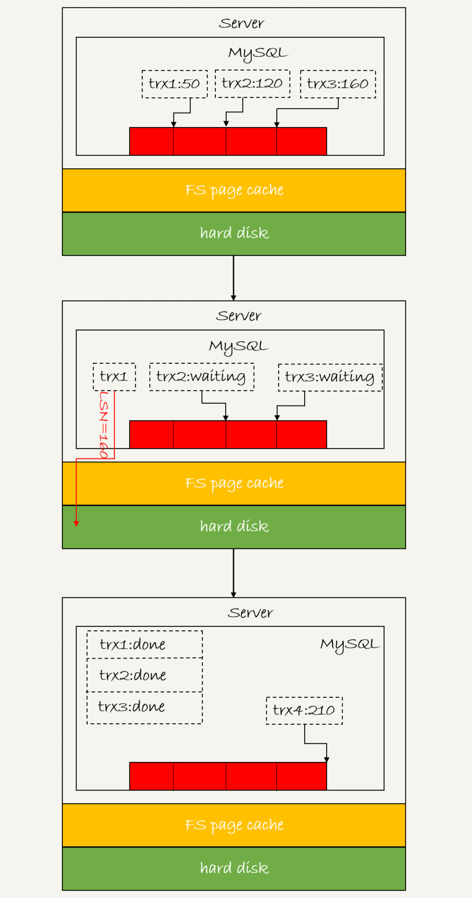

# 23讲MySQL是怎么保证数据不丢的

今天这篇文章，我会继续和你介绍在业务高峰期临时提升性能的方法。今天介绍的方法，跟数据的可靠性有关。

在专栏前面文章和答疑篇中，着重介绍了 WAL 机制（可以再回顾下[第2篇](https://time.geekbang.org/column/article/68633)、[第9篇](https://time.geekbang.org/column/article/70848)、[第12篇](https://time.geekbang.org/column/article/71806)和[第15篇](https://time.geekbang.org/column/article/73161)文章中的相关内容），得到的结论是：**只要 redo log 和 binlog 保证持久化到磁盘，就能确保 MySQL 异常重启后，数据可以恢复。**

评论区有同学又继续追问，redo log 的写入流程是怎么样的，如何保证 redo log 真实地写入了磁盘。那么今天再一起看看 MySQL 写入 binlog 和 redo log 的流程。

## 一、binlog 的写入机制

**binlog 的写入逻辑比较简单：事务执行过程中，先把日志写到 binlog cache，事务提交的时候，再把 binlog cache 写到 binlog 文件中。**

一个事务的 binlog 是不能被拆开的，因此不论这个事务多大，也要确保一次性写入。这就涉及到了 binlog cache 的保存问题。

系统给 binlog cache 分配了一片内存，每个线程一个，参数 `binlog_cache_size` 用于控制单个线程内 binlog cache 所占内存的大小。如果超过了这个参数规定的大小，就要暂存到磁盘。

事务提交的时候，执行器把 binlog cache 里的完整事务写入到 binlog 中，并清空 binlog cache。状态如图 1 所示。

图 1 binlog 写盘状态

可以看到，**每个线程有自己 binlog cache，但是共用同一份 binlog 文件**。

- 图中的 write，指的就是指把日志写入到文件系统的 page cache，并没有把数据持久化到磁盘，所以速度比较快。
- 图中的 fsync，才是将数据持久化到磁盘的操作。一般情况下，我们认为 fsync 才占磁盘的 IOPS。

write 和 fsync 的时机，是由参数 `sync_binlog` 控制的：

- `sync_binlog=0` 的时候，表示每次提交事务都只 write，不 fsync；

- `sync_binlog=1` 的时候，表示每次提交事务都会执行 fsync；

- `sync_binlog=N(N>1)` 的时候，表示每次提交事务都 write，但累积 N 个事务后才 fsync。

因此，在出现 IO 瓶颈的场景里，将 `sync_binlog` 设置成一个比较大的值，可以提升性能。在实际的业务场景中，考虑到丢失日志量的可控性，一般不建议将这个参数设成 0，比较常见的是将其设置为 100~1000 中的某个数值。

但是，将 `sync_binlog` 设置为 N，对应的风险是：如果主机发生异常重启，会丢失最近 N 个事务的 binlog 日志。

> 线上系统配置为 1；

## 二、redo log 的写入机制

在专栏的[第15篇答疑文章](https://time.geekbang.org/column/article/73161)中，介绍了 redo log buffer。**事务在执行过程中，生成的 redo log 是要先写到 redo log buffer 的**。

但是 redo log buffer 里面的内容，不需要每次生成后都直接持久化到磁盘。

如果事务执行期间 MySQL 发生异常重启，那这部分日志就丢了。由于事务并没有提交，所以这时日志丢了也不会有损失。

那么，另外一个问题是，事务还没提交的时候，redo log buffer 中的部分日志有没有可能被持久化到磁盘呢？

答案是，确实会有。

这个问题，要从 redo log 可能存在的三种状态说起。这三种状态，对应的就是图2 中的三个颜色块。

图2 MySQL redo log存储状态

这三种状态分别是：

- 存在 redo log buffer 中，物理上是在MySQL进程内存中，即红色部分；

- 写到磁盘(write)，但是没有持久化（fsync)，物理上是在文件系统的 page cache 里面，即黄色部分；

- 持久化到磁盘，对应的是 hard disk，即绿色部分。

日志写到 redo log buffer 是很快的，wirte 到 page cache 也差不多，但是持久化到磁盘的速度就慢多了。

为了控制 redo log 的写入策略，InnoDB 提供了 `innodb_flush_log_at_trx_commit` 参数，它有三种可能取值：

- 设置为 0 的时候，表示每次事务提交时都只是把 redo log 留在 redo log buffer 中;

- 设置为 1 的时候，表示每次事务提交时都将 redo log 直接持久化到磁盘；  ==》线上配置

- 设置为 2 的时候，表示每次事务提交时都只是把 redo log 写到 page cache。

InnoDB 有一个后台线程，每隔 1 秒，就会把 redo log buffer 中的日志，调用 write 写到文件系统的 page cache，然后调用 fsync 持久化到磁盘。

**注意，事务执行中间过程的 redo log 也是直接写在 redo log buffer 中的，这些 redo log 也会被后台线程一起持久化到磁盘。也就是说，一个没有提交的事务的 redo log，也是可能已经持久化到磁盘的。**

实际上，除了后台线程每秒一次的轮询操作外，还有两种场景会让一个没有提交的事务的 redo log 写入到磁盘中。

1. **一种是，redo log buffer 占用的空间即将达到 `innodb_log_buffer_size` 一半的时候，后台线程会主动写盘。**注意，由于这个事务并没有提交，所以这个写盘动作只是 write，而没有调用 fsync，也就是只留在了文件系统的 page cache。
2. **另一种是，并行的事务提交的时候，顺带将这个事务的 redo log buffer 持久化到磁盘。**假设一个事务 A 执行到一半，已经写了一些 redo log 到 buffer 中，这时候有另外一个线程的事务 B 提交，如果 `innodb_flush_log_at_trx_commit` 设置的是 1，那么按照这个参数的逻辑，事务 B 要把 redo log buffer 里的日志全部持久化到磁盘。这时候，就会带上事务 A 在 redo log buffer 里的日志一起持久化到磁盘。

这里需要说明的是，我们介绍两阶段提交的时候说过，时序上 redo log 先 prepare，再写 binlog，最后再把 redo log commit。

如果把 `innodb_flush_log_at_trx_commit` 设置成 1，那么 redo log 在 prepare 阶段就要持久化一次，因为有一个崩溃恢复逻辑是要依赖于 prepare 的redo log，再加上 binlog 来恢复的。（如果你印象有点儿模糊了，可以再回顾下[第15篇文章](https://time.geekbang.org/column/article/73161)中的相关内容）。

每秒一次后台轮询刷盘，再加上崩溃恢复这个逻辑，InnoDB 就认为 redo log 在 commit 的时候就不需要 fsync 了，只会 write 到文件系统的 page cache 中就够了。

通常我们说 MySQL 的“双1”配置，指的就是 `sync_binlog` 和 `innodb_flush_log_at_trx_commit` 都设置成 1。也就是说，一个事务完整提交前，需要等待两次刷盘，一次是 redo log（prepare 阶段），一次是 binlog。

这时候，你可能有一个疑问，这意味着我从 MySQL 看到的 TPS 是每秒两万的话，每秒就会写四万次磁盘。但是，我用工具测试出来，磁盘能力也就两万左右，怎么能实现两万的 TPS？

解释这个问题，就要用到组提交（group commit）机制了。

这里，我需要先和你介绍日志逻辑序列号（log sequence number，LSN）的概念。LSN 是单调递增的，用来对应 redo log 的一个个写入点。每次写入长度为 length 的 redo log，LSN 的值就会加上 length。

LSN 也会写到 InnoDB 的数据页中，来确保数据页不会被多次执行重复的 redo log。关于 LSN 和 redo log、checkpoint 的关系，我会在后面的文章中详细展开。

如图3所示，是三个并发事务(trx1, trx2, trx3)在 prepare 阶段，都写完 redo log buffer，持久化到磁盘的过程，对应的 LSN 分别是 50、120 和 160。

图3 redo log 组提交

从图中可以看到，

1. trx1 是第一个到达的，会被选为这组的 leader；
2. 等 trx1 要开始写盘的时候，这个组里面已经有了三个事务，这时候 LSN 也变成了 160；
3. trx1 去写盘的时候，带的就是 LSN=160，因此等 trx1 返回时，所有 LSN 小于等于 160 的 redo log，都已经被持久化到磁盘；
4. 这时候 trx2 和 trx3 就可以直接返回了。

所以，一次组提交里面，组员越多，节约磁盘 IOPS 的效果越好。但如果只有单线程压测，那就只能老老实实地一个事务对应一次持久化操作了。

**在并发更新场景下，第一个事务写完 redo log buffer 以后，接下来这个 fsync 越晚调用，组员可能越多，节约 IOPS 的效果就越好。**

为了让一次fsync带的组员更多，MySQL有一个很有趣的优化：拖时间。在介绍两阶段提交的时候，我曾经给你画了一个图，现在我把它截过来。

图4 两阶段提交

图中，我把“写binlog”当成一个动作。但实际上，写 binlog 是分成两步的：

1. 先把 binlog 从 binlog cache 中写到磁盘上的 binlog 文件；
2. 调用 fsync 持久化。

MySQL 为了让组提交的效果更好，把 redo log 做 fsync 的时间拖到了步骤 1 之后。也就是说，上面的图变成了这样：

图5 两阶段提交细化

这么一来，binlog 也可以组提交了。在执行图5中第4步把binlog fsync到磁盘时，如果有多个事务的binlog已经写完了，也是一起持久化的，这样也可以减少IOPS的消耗。

不过通常情况下第3步执行得会很快，所以binlog的write和fsync间的间隔时间短，导致能集合到一起持久化的binlog比较少，因此binlog的组提交的效果通常不如redo log的效果那么好。

如果你想提升binlog组提交的效果，可以通过设置 binlog_group_commit_sync_delay 和 binlog_group_commit_sync_no_delay_count来实现。

1. binlog_group_commit_sync_delay参数，表示延迟多少微秒后才调用fsync;
2. binlog_group_commit_sync_no_delay_count参数，表示累积多少次以后才调用fsync。

这两个条件是或的关系，也就是说只要有一个满足条件就会调用fsync。

所以，当binlog_group_commit_sync_delay设置为0的时候，binlog_group_commit_sync_no_delay_count也无效了。

之前有同学在评论区问到，WAL机制是减少磁盘写，可是每次提交事务都要写redo log和binlog，这磁盘读写次数也没变少呀？

现在你就能理解了，WAL机制主要得益于两个方面：

1. redo log 和 binlog都是顺序写，磁盘的顺序写比随机写速度要快；
2. 组提交机制，可以大幅度降低磁盘的IOPS消耗。

分析到这里，我们再来回答这个问题：**如果你的MySQL现在出现了性能瓶颈，而且瓶颈在IO上，可以通过哪些方法来提升性能呢？**

针对这个问题，可以考虑以下三种方法：

1. 设置 binlog_group_commit_sync_delay 和 binlog_group_commit_sync_no_delay_count参数，减少binlog的写盘次数。这个方法是基于“额外的故意等待”来实现的，因此可能会增加语句的响应时间，但没有丢失数据的风险。
2. 将sync_binlog 设置为大于1的值（比较常见是100~1000）。这样做的风险是，主机掉电时会丢binlog日志。
3. 将innodb_flush_log_at_trx_commit设置为2。这样做的风险是，主机掉电的时候会丢数据。

我不建议你把innodb_flush_log_at_trx_commit 设置成0。因为把这个参数设置成0，表示redo log只保存在内存中，这样的话MySQL本身异常重启也会丢数据，风险太大。而redo log写到文件系统的page cache的速度也是很快的，所以将这个参数设置成2跟设置成0其实性能差不多，但这样做MySQL异常重启时就不会丢数据了，相比之下风险会更小。

# 小结

在专栏的[第2篇](https://time.geekbang.org/column/article/68633)和[第15篇](https://time.geekbang.org/column/article/73161)文章中，我和你分析了，如果redo log和binlog是完整的，MySQL是如何保证crash-safe的。今天这篇文章，我着重和你介绍的是MySQL是“怎么保证redo log和binlog是完整的”。

希望这三篇文章串起来的内容，能够让你对crash-safe这个概念有更清晰的理解。

之前的第15篇答疑文章发布之后，有同学继续留言问到了一些跟日志相关的问题，这里为了方便你回顾、学习，我再集中回答一次这些问题。

**问题1：**执行一个update语句以后，我再去执行hexdump命令直接查看ibd文件内容，为什么没有看到数据有改变呢？

回答：这可能是因为WAL机制的原因。update语句执行完成后，InnoDB只保证写完了redo log、内存，可能还没来得及将数据写到磁盘。

**问题2：**为什么binlog cache是每个线程自己维护的，而redo log buffer是全局共用的？

回答：MySQL这么设计的主要原因是，binlog是不能“被打断的”。一个事务的binlog必须连续写，因此要整个事务完成后，再一起写到文件里。

而redo log并没有这个要求，中间有生成的日志可以写到redo log buffer中。redo log buffer中的内容还能“搭便车”，其他事务提交的时候可以被一起写到磁盘中。

**问题3：**事务执行期间，还没到提交阶段，如果发生crash的话，redo log肯定丢了，这会不会导致主备不一致呢？

回答：不会。因为这时候binlog 也还在binlog cache里，没发给备库。crash以后redo log和binlog都没有了，从业务角度看这个事务也没有提交，所以数据是一致的。

**问题4：**如果binlog写完盘以后发生crash，这时候还没给客户端答复就重启了。等客户端再重连进来，发现事务已经提交成功了，这是不是bug？

回答：不是。

你可以设想一下更极端的情况，整个事务都提交成功了，redo log commit完成了，备库也收到binlog并执行了。但是主库和客户端网络断开了，导致事务成功的包返回不回去，这时候客户端也会收到“网络断开”的异常。这种也只能算是事务成功的，不能认为是bug。

实际上数据库的crash-safe保证的是：

1. 如果客户端收到事务成功的消息，事务就一定持久化了；
2. 如果客户端收到事务失败（比如主键冲突、回滚等）的消息，事务就一定失败了；
3. 如果客户端收到“执行异常”的消息，应用需要重连后通过查询当前状态来继续后续的逻辑。此时数据库只需要保证内部（数据和日志之间，主库和备库之间）一致就可以了。

最后，又到了课后问题时间。

今天我留给你的思考题是：你的生产库设置的是“双1”吗？ 如果平时是的话，你有在什么场景下改成过“非双1”吗？你的这个操作又是基于什么决定的？

另外，我们都知道这些设置可能有损，如果发生了异常，你的止损方案是什么？

你可以把你的理解或者经验写在留言区，我会在下一篇文章的末尾选取有趣的评论和你一起分享和分析。感谢你的收听，也欢迎你把这篇文章分享给更多的朋友一起阅读。

# 上期问题时间

我在上篇文章最后，想要你分享的是线上“救火”的经验。

@Long 同学，在留言中提到了几个很好的场景。

- 其中第3个问题，“如果一个数据库是被客户端的压力打满导致无法响应的，重启数据库是没用的。”，说明他很好地思考了。
    这个问题是因为重启之后，业务请求还会再发。而且由于是重启，buffer pool被清空，可能会导致语句执行得更慢。
- 他提到的第4个问题也很典型。有时候一个表上会出现多个单字段索引（而且往往这是因为运维工程师对索引原理不够清晰做的设计），这样就可能出现优化器选择索引合并算法的现象。但实际上，索引合并算法的效率并不好。而通过将其中的一个索引改成联合索引的方法，是一个很好的应对方案。

还有其他几个同学提到的问题场景，也很好，很值得你一看。

> @Max 同学提到一个很好的例子：客户端程序的连接器，连接完成后会做一些诸如show columns的操作，在短连接模式下这个影响就非常大了。
> 这个提醒我们，在review项目的时候，不止要review我们自己业务的代码，也要review连接器的行为。一般做法就是在测试环境，把general_log打开，用业务行为触发连接，然后通过general log分析连接器的行为。

> @Manjusaka 同学的留言中，第二点提得非常好：如果你的数据库请求模式直接对应于客户请求，这往往是一个危险的设计。因为客户行为不可控，可能突然因为你们公司的一个运营推广，压力暴增，这样很容易把数据库打挂。
> 在设计模型里面设计一层，专门负责管理请求和数据库服务资源，对于比较重要和大流量的业务，是一个好的设计方向。

> @Vincent 同学提了一个好问题，用文中提到的DDL方案，会导致binlog里面少了这个DDL语句，后续影响备份恢复的功能。由于需要另一个知识点（主备同步协议），我放在后面的文章中说明。

## 精选留言

- 

    锅子

    老师好，有一个疑问：当设置sync_binlog=0时，每次commit都只时write到page cache，并不会fsync。但是做实验时binlog文件中还是会有记录，这是什么原因呢？是不是后台线程每秒一次的轮询也会将binlog cache持久化到磁盘？还是有其他的参数控制呢？

    2019-01-04 11:09

    作者回复

    你看到的“binlog的记录”，也是从page cache读的哦。
    Page cache是操作系统文件系统上的

    好问题

    2019-01-04 11:41

- 

    一大只

    你是怎么验证的？等于0的时候虽然有走这个逻辑，但是最后调用fsync之前判断是0，就啥也没做就走了
    回复老师:
    老师，我说的sync_binlog=0或=1效果一样，就是看语句实际执行的效果，参数binlog_group_commit_sync_delay我设置成了500000微秒，在=1或=0时，对表进行Insert，然后都会有0.5秒的等待，也就是执行时间都是0.51 sec，关闭binlog_group_commit_sync_delay，insert执行会飞快，所以我认为=1或=0都是受组提交参数的影响的。

    2019-01-05 17:49

    作者回复

    
    非常好

    然后再补上我回答的这个逻辑，就完备了

    

    2019-01-05 18:35

- 

    倪大人

    老师求解sync_binlog和binlog_group_commit_sync_no_delay_count这两个参数区别

    如果
    sync_binlog = N
    binlog_group_commit_sync_no_delay_count = M
    binlog_group_commit_sync_delay = 很大值
    这种情况fsync什么时候发生呀，min(N,M)吗？
    感觉sync_binlog搭配binlog_group_commit_sync_delay也可以实现组提交？

    如果
    sync_binlog = 0
    binlog_group_commit_sync_no_delay_count = 10
    这种情况下是累计10个事务fsync一次？

    2019-01-04 11:14

    作者回复

    好问题，我写这篇文章的时候也为了这个问题去翻了代码，是这样的：
    达到N次以后，可以刷盘了，然后再进入(sync_delay和no_delay_count)这个逻辑；

    Sync_delay如果很大，就达到no_delay_count才刷；

    只要sync_binlog=0,也会有前面的等待逻辑，但是等完后还是不调fsync

    2019-01-06 16:14

- 

    WilliamX

    为什么 binlog cache 是每个线程自己维护的，而 redo log buffer 是全局共用的？
    这个问题，感觉还有一点，binlog存储是以statement或者row格式存储的，而redo log是以page页格式存储的。page格式，天生就是共有的，而row格式，只跟当前事务相关

    2019-01-04 10:50

    作者回复

    嗯，这个解释也很好。

    2019-01-04 11:05

- 

    永恒记忆

    主从模式下，内网从库如果设置双1，刚还原的数据发现根本追不上主库，所以从库设置了0，老师后面章节会讲关于mysql包括主从监控这块的内容吗。

    2019-01-04 09:31

    作者回复

    会讲到

    2019-01-04 10:26

- 

    往事随风，顺其自然

    redolog 里面有已经提交事物日志，还有未提交事物日志都持久化到磁盘，此时异常重启，binlog 里面不是多余记录的未提交事物，干嘛不设计不添加未提交事物不更好

    2019-01-04 09:14

- 

    猪哥哥

    老师好, 能说下innodb_log_buffer_size参数的作用吗

    2019-01-10 17:14

- 

    roaming

    看了几遍，终于看明白了

    2019-01-10 17:03

    作者回复

    

    2019-01-10 23:35

- 

    猪哥哥

    老师 我想问下文件系统的page cache还是不是内存, 是不是文件系统向内核申请的一块的内存?

    2019-01-10 16:20

    作者回复

    你理解的是对的

    2019-01-10 23:35

- 

    xiaoyou

    老师，请教一个问题，文章说innodb的 redo log 在commit的时候不进行fsync，只会write 到page cache中。当sync_binlog>1,如果redo log 完成了prepare持久化落盘，binlog只是write page cache，此时commit标识完成write 但没有落盘，而client收到commit成功，这个时候主机掉电，启动的时候做崩溃恢复，没有commit标识和binglog，事务会回滚。我看文章说sync_binlog设置为大于1的值，会丢binlog日志,此时数据也会丢失吧？

    2019-01-09 17:40

    作者回复

    你说的对，分析得很好

    2019-01-09 22:19

- 

    匿名的朋友

    丁奇老师你好，对于undo和redo日志，有个疑问，mysql服务层调用引擎层去获取数据，比方说是innodb引擎，innodb引擎是不是可以获取到这个实例里边所有以innodb作为引擎的表，
    还有就是事务处理时会涉及到undo和redo日志文件，是不是所有以innodb为引擎的数据表共用undo和redo日志文件呢？

    2019-01-09 12:59

    作者回复

    \1. 不用去找“所有innodb表”，用到再打开

    \2. 大家共用的

    2019-01-09 14:48

- 

    Geek_527020

    事务还未结束，binlog和redo log就写到磁盘中了，如果出现了事务回滚，写到磁盘的数据要删除吗，如果不删除，MYSQL奔溃重启，岂不是多了操作，请老师解答下疑惑

    2019-01-08 17:21

    作者回复

    没事，这些操作没提交，崩溃恢复的时候就回滚了

    2019-01-08 20:22

- 

    Mr.Strive.Z.H.L

    老师你好：
    这一节的疑惑比较多，嘻嘻
    还想在确认一个问题：
    我认为redolog的组提交 是从write开始的组提交。个人认为write到pagecache的时候是不需要加锁的。
    而binlog的组提交，在write阶段，都是单线程对自己的binlog cache write到pagecache。这个时候必须加锁。虽然sync阶段，两者都是批量进行的。但是从write阶段来看，binlog并没有实现真正意义上实现组提交，没法解决上锁问题。（在网上看到，binlog真正的组提交，分为三个阶段，每个阶段一个队列，这种实现好像是比较新的mysql版本才使用的）

    我这么理解对吗？

    2019-01-08 12:16

    作者回复

    写binlog可以并发写的，大家约好磁盘自己写自己的就行^_^

    2019-01-10 19:12

- 

    Mr.Strive.Z.H.L

    老师你好，看了@倪大人的问题，个人认为：
    sync_binlog和binlog_group_commit_sync_no_delay_count的最大区别主要在于，数据的丢失与否吧？

    sync_binlog = N：每个事务write后就响应客户端了。刷盘是N次事务后刷盘。N次事务之间宕机，数据丢失。

    binlog_group_commit_sync_no_delay_count=N： 必须等到N个后才能提交。换言之，会增加响应客户端的时间。但是一旦响应了，那么数据就一定持久化了。宕机的话，数据是不会丢失的。

    不知道我这么理解对不对？

    

    2019-01-08 12:09

    作者回复

    你的理解很到位

    2019-01-10 19:05

- 

    Mr.Strive.Z.H.L

    老师好，关于组提交还是有几个疑惑：
    我理解的，组提交分为binlog和redolog。
    binlog如果没有组提交的话，是不是涉及到 写binlog的顺序与写redolog的顺序不一致的问题？这个顺序问题需要加锁来解决，事务之间串行执行prepare到commit的过程。
    而binlog有了组提交，内部实际上通过队列的机制，既保证了组提交减少IOPS消耗，同时队列的机制保证了binlog和redolog写入的顺序性。

    上述这么理解正确吗？

    还有一个问题就是图5两阶段提交细化的过程：
    binlog的write 到 sync之间插入了 redolog的 sync。图上的顺序表示binlog的sync必须等到redolog的sync执行后才能执行？ redolog在引擎内部，binlog在server端，这个串行是如何保证的？？（因为我认为server与innodb只会交互两次呀，第一次是prepare请求，第二次是最后的commit请求，binlog怎么做到等待redolog sync完后再sync？）

    2019-01-08 10:25

    作者回复

    \1. 默认行为是opt_binlog_order_commits=ON，是保证顺序的；

    \2. 就是一个线程按顺序一个阶段一个阶段地调用下来，这么保证顺序的

    2019-01-10 19:03

- 

    月缺

    事务还没提交的时候，redo log buffer 中的部分日志有可能被持久化到磁盘，这块是8.0重构redolog后的无锁化才有的新特性嘛，看源码之前是有个prepare commit mutex锁的

    2019-01-08 09:17

    作者回复

    不是，这个应该是最早的策略之一了

    2019-01-08 11:16

- 

    慧鑫coming

    老师，请问binlog_group_commit_sync_no_delay_count和sync_binlog参数有什么区别，前者设置为10后者设置为5，那是几次write page_cache才写盘一次？

    2019-01-07 09:26

    作者回复

    这样就是每10次fsync一下(sync_no_delay_count >sync_binlog)

    2019-01-07 10:21

- 

    52rock

    老师好，windows系统下MySQL偶尔有坏库的情况，恢复数据比较麻烦，有什么配置可以优化
    1.某个表提示打不开，也无法重建表
    2.mysql无法启动 1067
    3.binlog日志文件无法写入，删了log文件后正常。

    my.ini配置如下
    [mysqld]
    \# use 5.6.20
    [mysqld]
    bind-address = 0.0.0.0
    character-set-server=utf8
    log-bin=my.bin
    binlog_format=statement
    server-id=1

    \#不需要同步的库
    binlog-ignore-db=information_schema
    binlog-ignore-db=performance_schema
    binlog-ignore-db=mysql

    max_connect_errors = 3000
    wait_timeout=2880000
    interactive_timeout=2880000

    query_cache_size = 0
    query_cache_type = 0

    sql-mode=NO_AUTO_CREATE_USER,NO_ENGINE_SUBSTITUTION

    max_allowed_packet =256MB
    read_buffer_size = 8M
    read_rnd_buffer_size = 16M
    lower_case_table_names = 1
    key_buffer_size = 15M

    table_open_cache = 400
    table_definition_cache = 400
    table_open_cache_instances = 64
    metadata_locks_hash_instances=64

    sort_buffer_size = 16M
    join_buffer_size = 16M
    thread_cache_size = 768
    query_cache_size = 0
    query_cache_type = 0
    tmp_table_size = 96M
    performance_schema=OFF
    open_files_limit = 65535
    back_log = 1024

    innodb_buffer_pool_size=800MB
    \# 4MB-8MB ok
    innodb_file_per_table = 1
    external-locking = FALSE
    \#skip-external-locking
    expire_logs_days=45
    max_binlog_size=200M
    skip-name-resolve=OFF
    transaction-isolation=repeatable-read
    log_warnings=0

    2019-01-06 21:54

    作者回复

    删除了什么log后正常的？

    2019-01-07 02:07

- 

    滔滔

    老师，想请教一个问题，想从一个有自增主键(id)的表中取出主键值最大的n条记录，怎样操作效率最高呢？使用order by id limit n是最快的方式吗？

    2019-01-06 21:39

    作者回复

    嗯，这样很快的

    2019-01-07 02:05

- 

    某、人

    有调到非双1的时候,在大促时非核心库和从库延迟较多的情况。
    设置的是sync_binlog=0和innodb_flush_log_at_trx_commit=2
    针对0和2,在mysql crash时不会出现异常,在主机挂了时，会有几种风险:
    1.如果事务的binlog和redo log都还未fsync,则该事务数据丢失
    2.如果事务binlog fsync成功,redo log未fsync,则该事务数据丢失。
    虽然binlog落盘成功,但是binlog没有恢复redo log的能力,所以redo log不能恢复.
    不过后续可以解析binlog来恢复这部分数据
    3.如果事务binlog fsync未成功,redo log成功。
    由于redo log恢复数据是在引擎层,所以重新启动数据库,redo log能恢复数据,但是不能恢复server层的binlog,则binlog丢失。
    如果该事务还未从FS page cache里发送给从库,那么主从就会出现不一致的情况
    4.如果binlog和redo log都成功fsync,那么皆大欢喜。

    老师我有几个问题:
    1.因为binlog不能被打断,那么binlog做fsync是单线程吧?
    如果是的话,那么binlog的write到fsync的时间,就应该是redo log fsync+上一个事务的binlog fsync时间。
    但是测试到的现象,一个超大事务做fsync时,对其它事务的提交影响也不大。
    如果是多线程做fsync,怎么保证的一个事务binlog在磁盘上的连续性？
    \2. 5.7的并行复制是基于binlog组成员并行的,为什么很多文章说是表级别的并行复制？

    2019-01-06 20:09

    作者回复

    \1. Write的时候只要写进去了，fsync其实很快的。连续性是write的时候做的（写的时候保证了连续）

    \2. 你的理解应该是对的。不是表级

    2019-01-06 21:27