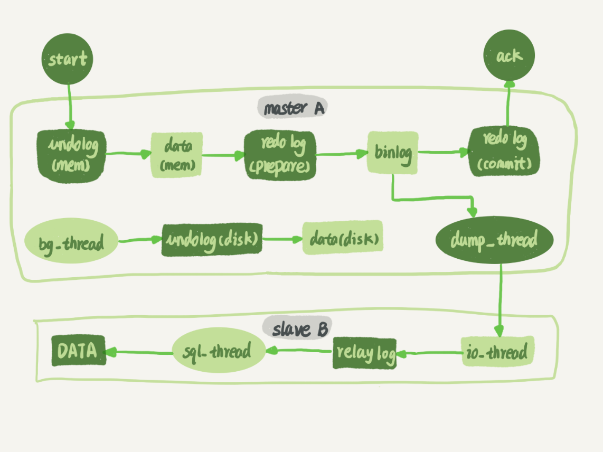
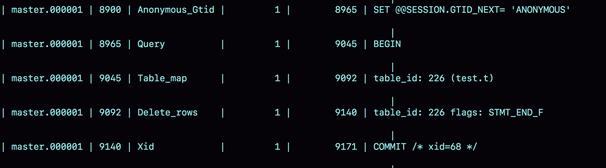
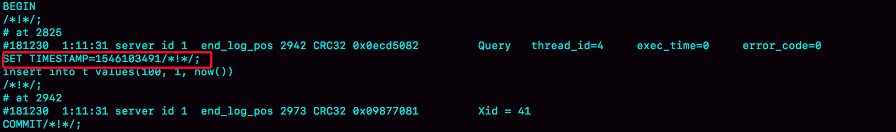

# 24讲MySQL是怎么保证主备一致的

在前面的文章中，我不止一次地和你提到了binlog，大家知道binlog可以用来归档，也可以用来做主备同步，但它的内容是什么样的呢？为什么备库执行了binlog就可以跟主库保持一致了呢？今天我就正式地和你介绍一下它。

毫不夸张地说，MySQL能够成为现下最流行的开源数据库，binlog功不可没。

在最开始，MySQL是以容易学习和方便的高可用架构，被开发人员青睐的。而它的几乎所有的高可用架构，都直接依赖于binlog。虽然这些高可用架构已经呈现出越来越复杂的趋势，但都是从最基本的一主一备演化过来的。

今天这篇文章我主要为你介绍主备的基本原理。理解了背后的设计原理，你也可以从业务开发的角度，来借鉴这些设计思想。

# MySQL主备的基本原理

如图1所示就是基本的主备切换流程。


图 1 MySQL主备切换流程

在状态1中，客户端的读写都直接访问节点A，而节点B是A的备库，只是将A的更新都同步过来，到本地执行。这样可以保持节点B和A的数据是相同的。

当需要切换的时候，就切成状态2。这时候客户端读写访问的都是节点B，而节点A是B的备库。

在状态1中，虽然节点B没有被直接访问，但是我依然建议你把节点B（也就是备库）设置成只读（readonly）模式。这样做，有以下几个考虑：

1. 有时候一些运营类的查询语句会被放到备库上去查，设置为只读可以防止误操作；
2. 防止切换逻辑有bug，比如切换过程中出现双写，造成主备不一致；
3. 可以用readonly状态，来判断节点的角色。

你可能会问，我把备库设置成只读了，还怎么跟主库保持同步更新呢？

这个问题，你不用担心。因为readonly设置对超级(super)权限用户是无效的，而用于同步更新的线程，就拥有超级权限。

接下来，我们再看看**节点A到B这条线的内部流程是什么样的**。图2中画出的就是一个update语句在节点A执行，然后同步到节点B的完整流程图。



图2 主备流程图

图2中，包含了我在上一篇文章中讲到的binlog和redo log的写入机制相关的内容，可以看到：主库接收到客户端的更新请求后，执行内部事务的更新逻辑，同时写binlog。

备库B跟主库A之间维持了一个长连接。主库A内部有一个线程，专门用于服务备库B的这个长连接。一个事务日志同步的完整过程是这样的：

1. 在备库B上通过change master命令，设置主库A的IP、端口、用户名、密码，以及要从哪个位置开始请求binlog，这个位置包含文件名和日志偏移量。
2. 在备库B上执行start slave命令，这时候备库会启动两个线程，就是图中的io_thread和sql_thread。其中io_thread负责与主库建立连接。
3. 主库A校验完用户名、密码后，开始按照备库B传过来的位置，从本地读取binlog，发给B。
4. 备库B拿到binlog后，写到本地文件，称为中转日志（relay log）。
5. sql_thread读取中转日志，解析出日志里的命令，并执行。

这里需要说明，后来由于多线程复制方案的引入，sql_thread演化成为了多个线程，跟我们今天要介绍的原理没有直接关系，暂且不展开。

分析完了这个长连接的逻辑，我们再来看一个问题：binlog里面到底是什么内容，为什么备库拿过去可以直接执行。

# binlog的三种格式对比

我在[第15篇答疑文章](https://time.geekbang.org/column/article/73161)中，和你提到过binlog有两种格式，一种是statement，一种是row。可能你在其他资料上还会看到有第三种格式，叫作mixed，其实它就是前两种格式的混合。

为了便于描述binlog的这三种格式间的区别，我创建了一个表，并初始化几行数据。

```
mysql> CREATE TABLE `t` (
  `id` int(11) NOT NULL,
  `a` int(11) DEFAULT NULL,
  `t_modified` timestamp NOT NULL DEFAULT CURRENT_TIMESTAMP,
  PRIMARY KEY (`id`),
  KEY `a` (`a`),
  KEY `t_modified`(`t_modified`)
) ENGINE=InnoDB;

insert into t values(1,1,'2018-11-13');
insert into t values(2,2,'2018-11-12');
insert into t values(3,3,'2018-11-11');
insert into t values(4,4,'2018-11-10');
insert into t values(5,5,'2018-11-09');
```

如果要在表中删除一行数据的话，我们来看看这个delete语句的binlog是怎么记录的。

注意，下面这个语句包含注释，如果你用MySQL客户端来做这个实验的话，要记得加-c参数，否则客户端会自动去掉注释。

```
mysql> delete from t /*comment*/  where a>=4 and t_modified<='2018-11-10' limit 1;
```

当binlog_format=statement时，binlog里面记录的就是SQL语句的原文。你可以用

```
mysql> show binlog events in 'master.000001';
```

命令看binlog中的内容。


图3 statement格式binlog 示例

现在，我们来看一下图3的输出结果。

- 第一行SET @@SESSION.GTID_NEXT='ANONYMOUS’你可以先忽略，后面文章我们会在介绍主备切换的时候再提到；
- 第二行是一个BEGIN，跟第四行的commit对应，表示中间是一个事务；
- 第三行就是真实执行的语句了。可以看到，在真实执行的delete命令之前，还有一个“use ‘test’”命令。这条命令不是我们主动执行的，而是MySQL根据当前要操作的表所在的数据库，自行添加的。这样做可以保证日志传到备库去执行的时候，不论当前的工作线程在哪个库里，都能够正确地更新到test库的表t。
    use 'test’命令之后的delete 语句，就是我们输入的SQL原文了。可以看到，binlog“忠实”地记录了SQL命令，甚至连注释也一并记录了。
- 最后一行是一个COMMIT。你可以看到里面写着xid=61。你还记得这个XID是做什么用的吗？如果记忆模糊了，可以再回顾一下[第15篇文章](https://time.geekbang.org/column/article/73161)中的相关内容。

为了说明statement 和 row格式的区别，我们来看一下这条delete命令的执行效果图：


图4 delete执行warnings

可以看到，运行这条delete命令产生了一个warning，原因是当前binlog设置的是statement格式，并且语句中有limit，所以这个命令可能是unsafe的。

为什么这么说呢？这是因为delete 带limit，很可能会出现主备数据不一致的情况。比如上面这个例子：

1. 如果delete语句使用的是索引a，那么会根据索引a找到第一个满足条件的行，也就是说删除的是a=4这一行；
2. 但如果使用的是索引t_modified，那么删除的就是 t_modified='2018-11-09’也就是a=5这一行。

由于statement格式下，记录到binlog里的是语句原文，因此可能会出现这样一种情况：在主库执行这条SQL语句的时候，用的是索引a；而在备库执行这条SQL语句的时候，却使用了索引t_modified。因此，MySQL认为这样写是有风险的。

那么，如果我把binlog的格式改为binlog_format=‘row’， 是不是就没有这个问题了呢？我们先来看看这时候binog中的内容吧。



图5 row格式binlog 示例

可以看到，与statement格式的binlog相比，前后的BEGIN和COMMIT是一样的。但是，row格式的binlog里没有了SQL语句的原文，而是替换成了两个event：Table_map和Delete_rows。

1. Table_map event，用于说明接下来要操作的表是test库的表t;
2. Delete_rows event，用于定义删除的行为。

其实，我们通过图5是看不到详细信息的，还需要借助mysqlbinlog工具，用下面这个命令解析和查看binlog中的内容。因为图5中的信息显示，这个事务的binlog是从8900这个位置开始的，所以可以用start-position参数来指定从这个位置的日志开始解析。

```
mysqlbinlog  -vv data/master.000001 --start-position=8900;
```


图6 row格式binlog 示例的详细信息

从这个图中，我们可以看到以下几个信息：

- server id 1，表示这个事务是在server_id=1的这个库上执行的。
- 每个event都有CRC32的值，这是因为我把参数binlog_checksum设置成了CRC32。
- Table_map event跟在图5中看到的相同，显示了接下来要打开的表，map到数字226。现在我们这条SQL语句只操作了一张表，如果要操作多张表呢？每个表都有一个对应的Table_map event、都会map到一个单独的数字，用于区分对不同表的操作。
- 我们在mysqlbinlog的命令中，使用了-vv参数是为了把内容都解析出来，所以从结果里面可以看到各个字段的值（比如，@1=4、 @2=4这些值）。
- binlog_row_image的默认配置是FULL，因此Delete_event里面，包含了删掉的行的所有字段的值。如果把binlog_row_image设置为MINIMAL，则只会记录必要的信息，在这个例子里，就是只会记录id=4这个信息。
- 最后的Xid event，用于表示事务被正确地提交了。

你可以看到，当binlog_format使用row格式的时候，binlog里面记录了真实删除行的主键id，这样binlog传到备库去的时候，就肯定会删除id=4的行，不会有主备删除不同行的问题。

# 为什么会有mixed格式的binlog？

基于上面的信息，我们来讨论一个问题：**为什么会有mixed这种binlog格式的存在场景？**推论过程是这样的：

- 因为有些statement格式的binlog可能会导致主备不一致，所以要使用row格式。
- 但row格式的缺点是，很占空间。比如你用一个delete语句删掉10万行数据，用statement的话就是一个SQL语句被记录到binlog中，占用几十个字节的空间。但如果用row格式的binlog，就要把这10万条记录都写到binlog中。这样做，不仅会占用更大的空间，同时写binlog也要耗费IO资源，影响执行速度。
- 所以，MySQL就取了个折中方案，也就是有了mixed格式的binlog。mixed格式的意思是，MySQL自己会判断这条SQL语句是否可能引起主备不一致，如果有可能，就用row格式，否则就用statement格式。

也就是说，mixed格式可以利用statment格式的优点，同时又避免了数据不一致的风险。

因此，如果你的线上MySQL设置的binlog格式是statement的话，那基本上就可以认为这是一个不合理的设置。你至少应该把binlog的格式设置为mixed。

比如我们这个例子，设置为mixed后，就会记录为row格式；而如果执行的语句去掉limit 1，就会记录为statement格式。

当然我要说的是，现在越来越多的场景要求把MySQL的binlog格式设置成row。这么做的理由有很多，我来给你举一个可以直接看出来的好处：**恢复数据**。

接下来，我们就分别从delete、insert和update这三种SQL语句的角度，来看看数据恢复的问题。

通过图6你可以看出来，即使我执行的是delete语句，row格式的binlog也会把被删掉的行的整行信息保存起来。所以，如果你在执行完一条delete语句以后，发现删错数据了，可以直接把binlog中记录的delete语句转成insert，把被错删的数据插入回去就可以恢复了。

如果你是执行错了insert语句呢？那就更直接了。row格式下，insert语句的binlog里会记录所有的字段信息，这些信息可以用来精确定位刚刚被插入的那一行。这时，你直接把insert语句转成delete语句，删除掉这被误插入的一行数据就可以了。

如果执行的是update语句的话，binlog里面会记录修改前整行的数据和修改后的整行数据。所以，如果你误执行了update语句的话，只需要把这个event前后的两行信息对调一下，再去数据库里面执行，就能恢复这个更新操作了。

其实，由delete、insert或者update语句导致的数据操作错误，需要恢复到操作之前状态的情况，也时有发生。MariaDB的[Flashback](https://mariadb.com/kb/en/library/flashback/)工具就是基于上面介绍的原理来回滚数据的。

虽然mixed格式的binlog现在已经用得不多了，但这里我还是要再借用一下mixed格式来说明一个问题，来看一下这条SQL语句：

```
mysql> insert into t values(10,10, now());
```

如果我们把binlog格式设置为mixed，你觉得MySQL会把它记录为row格式还是statement格式呢？

先不要着急说结果，我们一起来看一下这条语句执行的效果。


图7 mixed格式和now()

可以看到，MySQL用的居然是statement格式。你一定会奇怪，如果这个binlog过了1分钟才传给备库的话，那主备的数据不就不一致了吗？

接下来，我们再用mysqlbinlog工具来看看：



图8 TIMESTAMP 命令

从图中的结果可以看到，原来binlog在记录event的时候，多记了一条命令：SET TIMESTAMP=1546103491。它用 SET TIMESTAMP命令约定了接下来的now()函数的返回时间。

因此，不论这个binlog是1分钟之后被备库执行，还是3天后用来恢复这个库的备份，这个insert语句插入的行，值都是固定的。也就是说，通过这条SET TIMESTAMP命令，MySQL就确保了主备数据的一致性。

我之前看过有人在重放binlog数据的时候，是这么做的：用mysqlbinlog解析出日志，然后把里面的statement语句直接拷贝出来执行。

你现在知道了，这个方法是有风险的。因为有些语句的执行结果是依赖于上下文命令的，直接执行的结果很可能是错误的。

所以，用binlog来恢复数据的标准做法是，用 mysqlbinlog工具解析出来，然后把解析结果整个发给MySQL执行。类似下面的命令：

```
mysqlbinlog master.000001  --start-position=2738 --stop-position=2973 | mysql -h127.0.0.1 -P13000 -u$user -p$pwd;
```

这个命令的意思是，将 master.000001 文件里面从第2738字节到第2973字节中间这段内容解析出来，放到MySQL去执行。

# 循环复制问题

通过上面对MySQL中binlog基本内容的理解，你现在可以知道，binlog的特性确保了在备库执行相同的binlog，可以得到与主库相同的状态。

因此，我们可以认为正常情况下主备的数据是一致的。也就是说，图1中A、B两个节点的内容是一致的。其实，图1中我画的是M-S结构，但实际生产上使用比较多的是双M结构，也就是图9所示的主备切换流程。


图 9 MySQL主备切换流程--双M结构

对比图9和图1，你可以发现，双M结构和M-S结构，其实区别只是多了一条线，即：节点A和B之间总是互为主备关系。这样在切换的时候就不用再修改主备关系。

但是，双M结构还有一个问题需要解决。

业务逻辑在节点A上更新了一条语句，然后再把生成的binlog 发给节点B，节点B执行完这条更新语句后也会生成binlog。（我建议你把参数log_slave_updates设置为on，表示备库执行relay log后生成binlog）。

那么，如果节点A同时是节点B的备库，相当于又把节点B新生成的binlog拿过来执行了一次，然后节点A和B间，会不断地循环执行这个更新语句，也就是循环复制了。这个要怎么解决呢？

从上面的图6中可以看到，MySQL在binlog中记录了这个命令第一次执行时所在实例的server id。因此，我们可以用下面的逻辑，来解决两个节点间的循环复制的问题：

1. 规定两个库的server id必须不同，如果相同，则它们之间不能设定为主备关系；
2. 一个备库接到binlog并在重放的过程中，生成与原binlog的server id相同的新的binlog；
3. 每个库在收到从自己的主库发过来的日志后，先判断server id，如果跟自己的相同，表示这个日志是自己生成的，就直接丢弃这个日志。

按照这个逻辑，如果我们设置了双M结构，日志的执行流就会变成这样：

1. 从节点A更新的事务，binlog里面记的都是A的server id；
2. 传到节点B执行一次以后，节点B生成的binlog 的server id也是A的server id；
3. 再传回给节点A，A判断到这个server id与自己的相同，就不会再处理这个日志。所以，死循环在这里就断掉了。

# 小结

今天这篇文章，我给你介绍了MySQL binlog的格式和一些基本机制，是后面我要介绍的读写分离等系列文章的背景知识，希望你可以认真消化理解。

binlog在MySQL的各种高可用方案上扮演了重要角色。今天介绍的可以说是所有MySQL高可用方案的基础。在这之上演化出了诸如多节点、半同步、MySQL group replication等相对复杂的方案。

我也跟你介绍了MySQL不同格式binlog的优缺点，和设计者的思考。希望你在做系统开发时候，也能借鉴这些设计思想。

最后，我给你留下一个思考题吧。

说到循环复制问题的时候，我们说MySQL通过判断server id的方式，断掉死循环。但是，这个机制其实并不完备，在某些场景下，还是有可能出现死循环。

你能构造出一个这样的场景吗？又应该怎么解决呢？

你可以把你的设计和分析写在评论区，我会在下一篇文章跟你讨论这个问题。感谢你的收听，也欢迎你把这篇文章分享给更多的朋友一起阅读。

# 上期问题时间

上期我留给你的问题是，你在什么时候会把线上生产库设置成“非双1”。我目前知道的场景，有以下这些：

1. 业务高峰期。一般如果有预知的高峰期，DBA会有预案，把主库设置成“非双1”。
2. 备库延迟，为了让备库尽快赶上主库。@永恒记忆和@Second Sight提到了这个场景。
3. 用备份恢复主库的副本，应用binlog的过程，这个跟上一种场景类似。
4. 批量导入数据的时候。

一般情况下，把生产库改成“非双1”配置，是设置innodb_flush_logs_at_trx_commit=2、sync_binlog=1000。

评论区留言点赞板：

> @way 同学提到了一个有趣的现象，由于从库设置了 binlog_group_commit_sync_delay和binlog_group_commit_sync_no_delay_count导致一直延迟的情况。我们在主库设置这两个参数，是为了减少binlog的写盘压力。备库这么设置，尤其在“快要追上”的时候，就反而会受这两个参数的拖累。一般追主备就用“非双1”（追上记得改回来）。

> @一大只 同学验证了在sync_binlog=0的情况下，设置sync_delay和sync_no_delay_count的现象，点赞这种发现边界的意识和手动验证的好习惯。是这样的：sync_delay和sync_no_delay_count的逻辑先走，因此该等还是会等。等到满足了这两个条件之一，就进入sync_binlog阶段。这时候如果判断sync_binlog=0，就直接跳过，还是不调fsync。

> @锅子 同学提到，设置sync_binlog=0的时候，还是可以看到binlog文件马上做了修改。这个是对的，我们说“写到了page cache”，就是文件系统的page cache。而你用ls命令看到的就是文件系统返回的结果。

## 精选留言

- 

    观弈道人

    老师你好，问个备份问题，假如周日23点做了备份，周二20点需要恢复数据，那么在用binlog恢复时，如何恰好定位到周日23点的binlog,谢谢。

    2019-01-07 07:44

    作者回复

    Mysqlbinlog有个参数—stop-datetime

    2019-01-07 09:55

- 

    hua168

    大神，我前些天去面试，面试官问了一题:
    mysql做主从，一段时间后发现从库在高峰期会发生一两条条数据丢失（不记得是查询行空白还是查询不到了），主从正常，怎么判断？
    1.我问他是不是所以从库都是一样，他说不一样
    2.我说低峰期重做新的从库观察，查看日志有没有报错？他好像不满意这个答案。

    二、他还问主库挂了怎么办？
    \1. mysql主从+keepalived/heartbeat
    有脑裂，还是有前面丢数据问题
    \2. 用MMM或HMA之类
    3.用ZK之类

    三、写的压力大怎么办？
    我回答，分库，分表

    感觉整天他都不怎么满意，果然没让我复试了，我郁闷呀，我就面试运维的，问数据这么详细。
    大神，能说下我哪里有问题吗？现在我都想不明白

    2019-01-08 05:49

    作者回复

    运维现在要求也挺高的

    第一个问题其实我也没看懂，“高峰期丢数据”是指主备延迟查不到数据，还是真的丢了，得先问清楚下

    不过你回答的第二点不太好，低峰期重做这个大家都知道要这么做，而且只是修复动作，没办法用来定位原因，面试官是要问你分析问题的方法（方向错误）
    重搭从库错误日志里面什么都没有的（这个比较可惜，暴露了对字节不够了解，一般不了解的方法在面试的时候是不如不说的）

    第二个问题三点都是你回答的吗？那还算回答得可以的，但是不能只讲名词，要找个你熟悉细节的方案展开一下

    三方向也是对的

    我估计就是第一个问题减分比较厉害

    2019-01-08 11:24

- 

    堕落天使

    老师，您好，问一个关于change buffer的问题。
    对于insert语句来说，change buffer的优化主要在非唯一的二级索引上，因为主键是唯一索引，插入必须要判断是否存在。
    那么对于update语句呢？如下（假设c有非唯一索引，id是主键，d没有索引）：
    update t set d=2 where c=10;
    原先以为：从索引c取出id之后，不会回表，也不会把修改行的数据读入内存，而是直接在change buffer中记录一下。但看了今天得内容之后又迷糊了，因为如果不把修改行的数据读入内存，它又怎么把旧数据写入binlog中呢？
    所以我想问的就是，上面的sql语句会不会把修改行的内容也读进内存？如果读进内存，那读进内存的这一步难道就为了写binlog吗？如果不读进内存，那binlog中的旧数据又是怎么来的呢？还有delete语句也同理。

    2019-01-07 20:53

    作者回复

    修改的行要读入内存呀

    写binlog只需要主键索引上的值

    你这个语句的话，如果字段c d上都有索引，那么c用不上chsnge buffer,
    D可能可以同上

    2019-01-07 22:06

- 

    柚子

    大佬您好，文中说现在越来越多的使用row方式的binlog，那么只能选择接受写入慢和占用空间大的弊端么？

    2019-01-07 14:50

    作者回复

    是的，当然还有minimal可选，会好些

    2019-01-07 16:34

- 

    HuaMax

    课后题。如果在同步的过程中修改了server id，那用原server id 生成的log被两个M认为都不是自己的而被循环执行，不知这种情况会不会发生

    2019-01-07 14:06

    作者回复

    是的，会

    2019-01-07 22:00

- 

    风二中

    在主库执行这条 SQL 语句的时候，用的是索引 a；而在备库执行这条 SQL 语句的时候，却使用了索引 t_modified
    老师，您好，这里索引选择不一样，是因为前面提到的mysql 会选错索引吗？这种情况应该发生比较少吧，这里应该都会选择索引a吧，还是说这里只是一个事例，还有更复杂的情况

    2019-01-12 13:59

    作者回复

    对，只是一个举例的

    2019-01-12 15:19

- 

    秋一匹

    老师，您好。我这慢了一步。。。学习晚了点。我这之前碰到了个问题，有一段时间主从复制延迟比较厉害，达到5s左右吧，一般都是1～2秒吧。首先排除不是网络原因。想问下还有哪些因素会影响主从复制呢？

    2019-01-10 13:51

    作者回复

    还是要给一下更具体的信息
    比如主库的tps
    备库的跟复制相关的配置等信息

    2019-01-10 23:34

- 

    Mr.Strive.Z.H.L

    老师你好：
    有一个疑惑，多条语句同时在commit阶段过程中，如果发生写入binlog和写入redolog的顺序不一致的情况。主从备份的时候，从库是不是会导致数据不一致呀？

    2019-01-10 10:03

- 

    未知

    老师在讲row模式的数据恢复时，感觉insert，update，delete的数据格式和undo log的差不多。之前文章一直说redo和binlog，老师抽空也讲下undo和回滚段的知识。

    2019-01-10 09:00

    作者回复

    Undo前面大致有说过了，你要了解undo的什么内容呢

    2019-01-10 10:24

- 

    光

    林老师今天遇到个问题就是主从同步延迟，查到主从状态中出现：Slave_SQL_Running_State: Waiting for Slave Workers to free pending events。不知道这个是否会引起延迟。查了些资料说得都不是很明白。老师是否可以简短解答下。以及这种延迟如何避免。

    2019-01-09 19:42

    作者回复

    这个的意思是， 现在工作线程里面等待的队列太多，都已经超过上限了，要等工作线程消化掉一些事务再分

    简单说，就是备库的应用日志的队列太慢了。。

    2019-01-10 19:30

- 

    梁中华

    我有一个比较极端一点的HA问题，假设主库的binlog刚写成功还未来得及把binlog同步到从库，主库就掉电了，这时候从库的数据会不完整吗？
    第二个问题，原主库重启加入集群后，那条没有传出去的binlog会如何处理？

    2019-01-09 10:42

- 

    不迷失

    请教一下，生产环境能不能使用正常使用表连接？要注意哪些地方？DBA总是说不建议用，还催促我将使用了表连接的地方改造，但也说不出个所以然。目前在两个百万级数据的表中有用到内连接，并没有觉得有什么问题

    2019-01-08 20:46

    作者回复

    索引使用正确，不要出现全表扫描，其实OK的

    2019-01-08 21:17

- 

    hua168

    这样，我是想增加一些经验，怕后面试又遇到，想问一下大神分析思路，这种问题没经验回答。
    我就差点回答用阿里云的DRDS了

    现在开源的mysql中间件生存环境中用什么比较多呀？mycat还是网易的cetus？

    海量存储阿里云有OSS，有没有对应的开源软件呀？用于生存环境的，没有接触过，想问下，搞下实验后再去找工作。

    2019-01-08 20:41

    作者回复

    中间件作为练手这些都可以的

    你搜“开源分布式存储系统”

    2019-01-08 21:19

- 

    React

    老师好，文章前面说主从最好从机设置readonly.那么在双主的情况(互为主备)下，设置不同的自增值是否就可以不用设置只读了？且此时复制是否可以跳过主键冲突，因为自增值不同？

    2019-01-08 20:25

    作者回复

    如果自增值严格控制了，也没必要设置跳过主键冲突了对吧（反正不冲突）

    除非你的业务就是设计好支持多点写入，否则还是把不写入的都设置上readonly吧

    2019-01-08 22:28

- 

    鸠翱

    也就是说 statement格式是不能用来恢复数据的是嘛……

    2019-01-08 20:14

    作者回复

    不能用在使用flashback机制恢复

    2019-01-08 22:26

- 

    hua168

    面试官说的是mysql做一主多从，读写分离，运行一段时间后，发现从库在业务高峰期不规律性出现从库丢失数据，而所有从库丢失的数据情况都不一样，在一个从库查询某条记录是空的（不记得是空白还是直接查不到，真的没数据了，并不是延迟了，主从没停，就是没写进从库），在另一个从库却能查到，有的在这个从库查到了，另一个从库查不到，因为运行了几个月客户反馈才发现此问题，不确定所有从库中哪个从库数据是没有丢失的，和主库一致，怎么办？
    我回答:
    1.在业务低峰期，锁库，重新做主从，但是如果一天不能同步完的话，白天主库还要解锁。不会搞了……
    又不像mongoDB那样不用记录pos值
    2.减少主库io压力试下，比如分库分表
    3.查看日志之类……

    二、mysql主库高可用
    mysql主从+keepalived/heatbeat
    HMA/MMM
    ZK
    是我看配置视频，老师简单讲了一下，我在网上搜的

    三、主库写压力过大
    只能通过分库，分表
    也是我看linux运维培训视频老师说的

    2019-01-08 17:12

    作者回复

    其实要是我回答，我也只能说以主库为准按顺序重做，都过了这么久了还能咋样

    2019-01-08 20:16

- 

    null

    老师，我请教一个问题。现在我有一张表里面存储的有用户id和用户头像，用户头像存的二进制。我批量查询用户头像，比如我查500个用户id的头像，我将500个用户id分成十等份，每份50个id，然后开启线程池用10个线程并行查询。现在的问题是先提交查询的那个线程查询时间可能只用了一两秒，后面提交的那几个线程查询时间依次增加，最久的大概需要五六秒。我们数据库用的Oracle，虽然不是mysql，但是我感觉Oracle不至于10个线程的并发都扛不住还需要排队处理啊，想请教一下老师出现这种情况是什么原因导致的呢

    2019-01-08 16:45

    作者回复

    我觉得你要先查一下为啥第一个查询要用1-2秒，这个请求看起来应该挺快呀

    2019-01-08 20:19

- 

    夜空中最亮的星（华仔）

    这节课完全学懂了，开心

    2019-01-08 16:41

    作者回复

    

    2019-01-10 19:14

- 

    夜空中最亮的星（华仔）

    级联复制，3个数据库，首尾相连，应会出现死循环

    2019-01-08 16:40

    作者回复

    不会哦，1给2，2给3，3给1，1就放弃了

    不过引入第三个节点的思路是对的哈

    2019-01-08 20:08

- 

    ccstorm

    老师，您好！请教一个课题之外的问题，请问mysql小版本需要更新么。我现在项目用的5.6，请问需要升级到5.7么，如果升级的话需要注意什么，谢谢老师！

    2019-01-08 15:52

    作者回复

    够用就不动

    2019-01-08 20:10