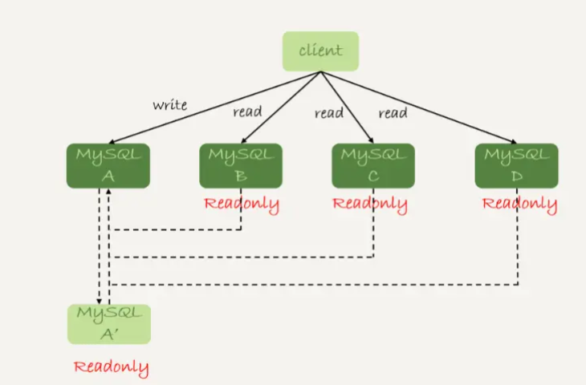
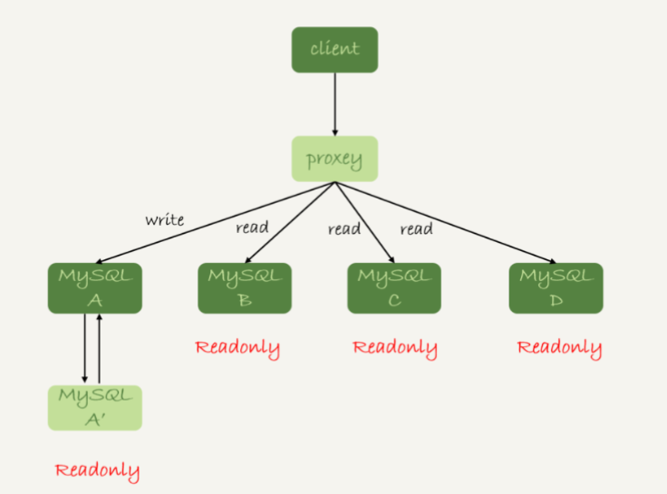
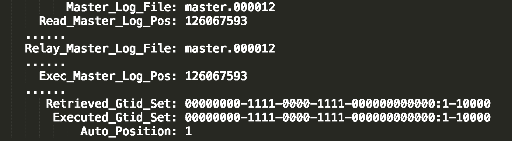
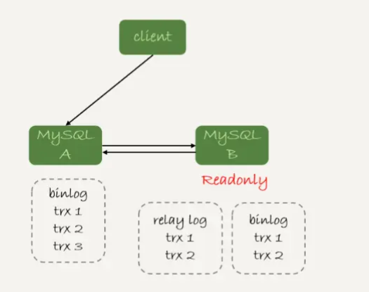
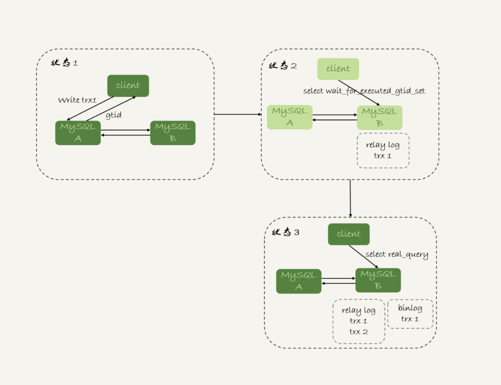

# 28讲读写分离有哪些坑

==重要==

在上一篇文章中，我和你介绍了一主多从的结构以及切换流程。今天我们就继续聊聊一主多从架构的应用场景：读写分离，以及怎么处理主备延迟导致的读写分离问题。

我们在上一篇文章中提到的一主多从的结构，其实就是读写分离的基本结构了。这里，我再把这张图贴过来，方便你理解。



图1 读写分离基本结构

读写分离的主要目标就是分摊主库的压力。图 1 中的结构是客户端（client）主动做负载均衡，这种模式下一般会把数据库的连接信息放在客户端的连接层。也就是说，由客户端来选择后端数据库进行查询。

还有一种架构是，在 MySQL 和客户端之间有一个中间代理层 proxy，客户端只连接 proxy， 由 proxy 根据请求类型和上下文决定请求的分发路由。



图2 带 proxy 的读写分离架构

接下来，我们就看一下客户端直连和带 proxy 的读写分离架构，各有哪些特点。

1. 客户端直连方案，因为少了一层 proxy 转发，所以查询性能稍微好一点儿，并且整体架构简单，排查问题更方便。但是这种方案，由于要了解后端部署细节，**所以在出现主备切换、库迁移等操作的时候，客户端都会感知到，并且需要调整数据库连接信息。**
    你可能会觉得这样客户端也太麻烦了，信息大量冗余，架构很丑。其实也未必，一般采用这样的架构，一定会伴随一个负责管理后端的组件，比如 Zookeeper，尽量让业务端只专注于业务逻辑开发。
2. 带 proxy 的架构，对客户端比较友好。客户端不需要关注后端细节，连接维护、后端信息维护等工作，都是由 proxy 完成的。但这样的话，对后端维护团队的要求会更高。而且，proxy 也需要有高可用架构。因此，带 proxy 架构的整体就相对比较复杂。

理解了这两种方案的优劣，具体选择哪个方案就取决于数据库团队提供的能力了。但目前看，趋势是往带 proxy 的架构方向发展的。

但是，不论使用哪种架构，你都会碰到我们今天要讨论的问题：由于主从可能存在延迟，客户端执行完一个更新事务后马上发起查询，如果查询选择的是从库的话，就有可能读到刚刚的事务更新之前的状态。

**这种“在从库上会读到系统的一个过期状态”的现象，在这篇文章里，我们暂且称之为“过期读”。**

前面我们说过了几种可能导致主备延迟的原因，以及对应的优化策略，但是主从延迟还是不能 100% 避免的。

不论哪种结构，客户端都希望查询从库的数据结果，跟查主库的数据结果是一样的。

接下来，我们就来讨论怎么处理过期读问题。

这里，我先把文章中涉及到的处理过期读的方案汇总在这里，以帮助你更好地理解和掌握全文的知识脉络。这些**方案包括**：

- 强制走主库方案；
- sleep 方案；
- 判断主备无延迟方案；
- 配合 semi-sync 方案；
- 等主库位点方案；
- 等 GTID 方案。

## 一、强制走主库方案

强制走主库方案其实就是，将查询请求做分类。通常情况下，我们可以将查询请求分为这么两类：

1. 对于必须要拿到最新结果的请求，强制将其发到主库上。比如，在一个交易平台上，卖家发布商品以后，马上要返回主页面，看商品是否发布成功。那么，这个请求需要拿到最新的结果，就必须走主库。
2. 对于可以读到旧数据的请求，才将其发到从库上。在这个交易平台上，买家来逛商铺页面，就算晚几秒看到最新发布的商品，也是可以接受的。那么，这类请求就可以走从库。

你可能会说，这个方案是不是有点畏难和取巧的意思，但其实这个方案是用得最多的。

当然，这个方案最大的问题在于，有时候你会碰到“所有查询都不能是过期读”的需求，比如一些金融类的业务。这样的话，你就要放弃读写分离，所有读写压力都在主库，等同于放弃了扩展性。

因此接下来，我们来讨论的话题是：可以支持读写分离的场景下，有哪些解决过期读的方案，并分析各个方案的优缺点。

## 二、Sleep 方案

主库更新后，读从库之前先 sleep 一下。具体的方案就是，类似于执行一条 `select sleep(1)` 命令。

这个方案的假设是，大多数情况下主备延迟在 1 秒之内，做一个 sleep 可以有很大概率拿到最新的数据。

这个方案给你的第一感觉，很可能是不靠谱儿，应该不会有人用吧？并且，你还可能会说，直接在发起查询时先执行一条 sleep 语句，用户体验很不友好啊。

但，这个思路确实可以在一定程度上解决问题。为了看起来更靠谱儿，我们可以换一种方式。

以卖家发布商品为例，商品发布后，用 Ajax（Asynchronous JavaScript + XML，异步JavaScript和XML）直接把客户端输入的内容作为“新的商品”显示在页面上，而不是真正地去数据库做查询。

这样，卖家就可以通过这个显示，来确认产品已经发布成功了。等到卖家再刷新页面，去查看商品的时候，其实已经过了一段时间，也就达到了 sleep 的目的，进而也就解决了过期读的问题。

也就是说，这个 sleep 方案确实解决了类似场景下的过期读问题。但，从严格意义上来说，这个方案存在的问题就是不精确。这个不精确包含了两层意思：

1. 如果这个查询请求本来 0.5 秒就可以在从库上拿到正确结果，也会等 1 秒；
2. 如果延迟超过 1 秒，还是会出现过期读。

看到这里，你是不是有一种“你是不是在逗我”的感觉，这个改进方案虽然可以解决类似 Ajax 场景下的过期读问题，但还是怎么看都不靠谱儿。别着急，接下来我就和你介绍一些更准确的方案。

## 三、判断主备无延迟方案

要确保备库无延迟，通常有三种做法。

通过前面的[第25篇](https://time.geekbang.org/column/article/76795)文章，我们知道 `show slave status` 结果里的 `seconds_behind_master` 参数的值，可以用来衡量主备延迟时间的长短。

所以**第一种确保主备无延迟的方法是，**每次从库执行查询请求前，先判断 `seconds_behind_master` 是否已经等于 0。如果还不等于 0 ，那就必须等到这个参数变为 0 才能执行查询请求。

`seconds_behind_master` 的单位是秒，如果你觉得精度不够的话，还可以采用对比位点和 GTID 的方法来确保主备无延迟，也就是我们接下来要说的第二和第三种方法。

如图 3 所示，是一个 `show slave status` 结果的部分截图。



图3 show slave status结果

现在，我们就通过这个结果，来看看具体如何通过对比位点和 GTID 来确保主备无延迟。

**第二种方法，**对比位点确保主备无延迟：

- `Master_Log_File` 和 `Read_Master_Log_Pos`，表示的是读到的主库的最新位点；
- `Relay_Master_Log_File` 和 `Exec_Master_Log_Pos`，表示的是备库执行的最新位点。

如果 `Master_Log_File` 和 `Relay_Master_Log_File`、`Read_Master_Log_Pos` 和 `Exec_Master_Log_Pos` 这两组值完全相同，就表示接收到的日志已经同步完成。

**第三种方法，**对比 GTID 集合确保主备无延迟：

- Auto_Position=1 ，表示这对主备关系使用了GTID协议。
- Retrieved_Gtid_Set，是备库收到的所有日志的GTID集合；
- Executed_Gtid_Set，是备库所有已经执行完成的GTID集合。

如果这两个集合相同，也表示备库接收到的日志都已经同步完成。

可见，对比位点和对比GTID这两种方法，都要比判断seconds_behind_master是否为0更准确。

在执行查询请求之前，先判断从库是否同步完成的方法，相比于sleep方案，准确度确实提升了不少，但还是没有达到“精确”的程度。为什么这么说呢？

我们现在一起来回顾下，一个事务的binlog在主备库之间的状态：

1. 主库执行完成，写入binlog，并反馈给客户端；
2. binlog被从主库发送给备库，备库收到；
3. 在备库执行binlog完成。

我们上面判断主备无延迟的逻辑，是“备库收到的日志都执行完成了”。但是，从binlog在主备之间状态的分析中，不难看出还有一部分日志，处于客户端已经收到提交确认，而备库还没收到日志的状态。

如图4所示就是这样的一个状态。



图4 备库还没收到trx3

这时，主库上执行完成了三个事务trx1、trx2和trx3，其中：

1. trx1和trx2已经传到从库，并且已经执行完成了；
2. trx3在主库执行完成，并且已经回复给客户端，但是还没有传到从库中。

如果这时候你在从库B上执行查询请求，按照我们上面的逻辑，从库认为已经没有同步延迟，但还是查不到trx3的。严格地说，就是出现了过期读。

那么，这个问题有没有办法解决呢？

# 配合semi-sync

要解决这个问题，就要引入半同步复制，也就是semi-sync replication。

semi-sync做了这样的设计：

1. 事务提交的时候，主库把binlog发给从库；
2. 从库收到binlog以后，发回给主库一个ack，表示收到了；
3. 主库收到这个ack以后，才能给客户端返回“事务完成”的确认。

也就是说，如果启用了semi-sync，就表示所有给客户端发送过确认的事务，都确保了备库已经收到了这个日志。

在[第25篇文章](https://time.geekbang.org/column/article/76795)的评论区，有同学问到：如果主库掉电的时候，有些binlog还来不及发给从库，会不会导致系统数据丢失？

答案是，如果使用的是普通的异步复制模式，就可能会丢失，但semi-sync就可以解决这个问题。

这样，semi-sync配合前面关于位点的判断，就能够确定在从库上执行的查询请求，可以避免过期读。

但是，semi-sync+位点判断的方案，只对一主一备的场景是成立的。在一主多从场景中，主库只要等到一个从库的ack，就开始给客户端返回确认。这时，在从库上执行查询请求，就有两种情况：

1. 如果查询是落在这个响应了ack的从库上，是能够确保读到最新数据；
2. 但如果是查询落到其他从库上，它们可能还没有收到最新的日志，就会产生过期读的问题。

其实，判断同步位点的方案还有另外一个潜在的问题，即：如果在业务更新的高峰期，主库的位点或者GTID集合更新很快，那么上面的两个位点等值判断就会一直不成立，很可能出现从库上迟迟无法响应查询请求的情况。

实际上，回到我们最初的业务逻辑里，当发起一个查询请求以后，我们要得到准确的结果，其实并不需要等到“主备完全同步”。

为什么这么说呢？我们来看一下这个时序图。


图5 主备持续延迟一个事务

图5所示，就是等待位点方案的一个bad case。图中备库B下的虚线框，分别表示relaylog和binlog中的事务。可以看到，图5中从状态1 到状态4，一直处于延迟一个事务的状态。

备库B一直到状态4都和主库A存在延迟，如果用上面必须等到无延迟才能查询的方案，select语句直到状态4都不能被执行。

但是，其实客户端是在发完trx1更新后发起的select语句，我们只需要确保trx1已经执行完成就可以执行select语句了。也就是说，如果在状态3执行查询请求，得到的就是预期结果了。

到这里，我们小结一下，semi-sync配合判断主备无延迟的方案，存在两个问题：

1. 一主多从的时候，在某些从库执行查询请求会存在过期读的现象；
2. 在持续延迟的情况下，可能出现过度等待的问题。

接下来，我要和你介绍的等主库位点方案，就可以解决这两个问题。

# 等主库位点方案

要理解等主库位点方案，我需要先和你介绍一条命令：

```
select master_pos_wait(file, pos[, timeout]);
```

这条命令的逻辑如下：

1. 它是在从库执行的；
2. 参数file和pos指的是主库上的文件名和位置；
3. timeout可选，设置为正整数N表示这个函数最多等待N秒。

这个命令正常返回的结果是一个正整数M，表示从命令开始执行，到应用完file和pos表示的binlog位置，执行了多少事务。

当然，除了正常返回一个正整数M外，这条命令还会返回一些其他结果，包括：

1. 如果执行期间，备库同步线程发生异常，则返回NULL；
2. 如果等待超过N秒，就返回-1；
3. 如果刚开始执行的时候，就发现已经执行过这个位置了，则返回0。

对于图5中先执行trx1，再执行一个查询请求的逻辑，要保证能够查到正确的数据，我们可以使用这个逻辑：

1. trx1事务更新完成后，马上执行show master status得到当前主库执行到的File和Position；
2. 选定一个从库执行查询语句；
3. 在从库上执行select master_pos_wait(File, Position, 1)；
4. 如果返回值是>=0的正整数，则在这个从库执行查询语句；
5. 否则，到主库执行查询语句。

我把上面这个流程画出来。


图6 master_pos_wait方案

这里我们假设，这条select查询最多在从库上等待1秒。那么，如果1秒内master_pos_wait返回一个大于等于0的整数，就确保了从库上执行的这个查询结果一定包含了trx1的数据。

步骤5到主库执行查询语句，是这类方案常用的退化机制。因为从库的延迟时间不可控，不能无限等待，所以如果等待超时，就应该放弃，然后到主库去查。

你可能会说，如果所有的从库都延迟超过1秒了，那查询压力不就都跑到主库上了吗？确实是这样。

但是，按照我们设定不允许过期读的要求，就只有两种选择，一种是超时放弃，一种是转到主库查询。具体怎么选择，就需要业务开发同学做好限流策略了。

# GTID方案

如果你的数据库开启了GTID模式，对应的也有等待GTID的方案。

MySQL中同样提供了一个类似的命令：

```
 select wait_for_executed_gtid_set(gtid_set, 1);
```

这条命令的逻辑是：

1. 等待，直到这个库执行的事务中包含传入的gtid_set，返回0；
2. 超时返回1。

在前面等位点的方案中，我们执行完事务后，还要主动去主库执行show master status。而MySQL 5.7.6版本开始，允许在执行完更新类事务后，把这个事务的GTID返回给客户端，这样等GTID的方案就可以减少一次查询。

这时，等GTID的执行流程就变成了：

1. trx1事务更新完成后，从返回包直接获取这个事务的GTID，记为gtid1；
2. 选定一个从库执行查询语句；
3. 在从库上执行 select wait_for_executed_gtid_set(gtid1, 1)；
4. 如果返回值是0，则在这个从库执行查询语句；
5. 否则，到主库执行查询语句。

跟等主库位点的方案一样，等待超时后是否直接到主库查询，需要业务开发同学来做限流考虑。

我把这个流程图画出来。



图7 wait_for_executed_gtid_set方案

在上面的第一步中，trx1事务更新完成后，从返回包直接获取这个事务的GTID。问题是，怎么能够让MySQL在执行事务后，返回包中带上GTID呢？

你只需要将参数session_track_gtids设置为OWN_GTID，然后通过API接口mysql_session_track_get_first从返回包解析出GTID的值即可。

在专栏的[第一篇文章](https://time.geekbang.org/column/article/68319)中，我介绍mysql_reset_connection的时候，评论区有同学留言问这类接口应该怎么使用。

这里我再回答一下。其实，MySQL并没有提供这类接口的SQL用法，是提供给程序的API(https://dev.mysql.com/doc/refman/5.7/en/c-api-functions.html)。

比如，为了让客户端在事务提交后，返回的GITD能够在客户端显示出来，我对MySQL客户端代码做了点修改，如下所示：


图8 显示更新事务的GTID--代码

这样，就可以看到语句执行完成，显示出GITD的值。


图9 显示更新事务的GTID--效果

当然了，这只是一个例子。你要使用这个方案的时候，还是应该在你的客户端代码中调用mysql_session_track_get_first这个函数。

# 小结

在今天这篇文章中，我跟你介绍了一主多从做读写分离时，可能碰到过期读的原因，以及几种应对的方案。

这几种方案中，有的方案看上去是做了妥协，有的方案看上去不那么靠谱儿，但都是有实际应用场景的，你需要根据业务需求选择。

即使是最后等待位点和等待GTID这两个方案，虽然看上去比较靠谱儿，但仍然存在需要权衡的情况。如果所有的从库都延迟，那么请求就会全部落到主库上，这时候会不会由于压力突然增大，把主库打挂了呢？

其实，在实际应用中，这几个方案是可以混合使用的。

比如，先在客户端对请求做分类，区分哪些请求可以接受过期读，而哪些请求完全不能接受过期读；然后，对于不能接受过期读的语句，再使用等GTID或等位点的方案。

但话说回来，过期读在本质上是由一写多读导致的。在实际应用中，可能会有别的不需要等待就可以水平扩展的数据库方案，但这往往是用牺牲写性能换来的，也就是需要在读性能和写性能中取权衡。

最后 ，我给你留下一个问题吧。

假设你的系统采用了我们文中介绍的最后一个方案，也就是等GTID的方案，现在你要对主库的一张大表做DDL，可能会出现什么情况呢？为了避免这种情况，你会怎么做呢？

你可以把你的分析和方案设计写在评论区，我会在下一篇文章跟你讨论这个问题。感谢你的收听，也欢迎你把这篇文章分享给更多的朋友一起阅读。

# 上期问题时间

上期给你留的问题是，在GTID模式下，如果一个新的从库接上主库，但是需要的binlog已经没了，要怎么做？

@某、人同学给了很详细的分析，我把他的回答略做修改贴过来。

1. 如果业务允许主从不一致的情况，那么可以在主库上先执行show global variables like ‘gtid_purged’，得到主库已经删除的GTID集合，假设是gtid_purged1；然后先在从库上执行reset master，再执行set global gtid_purged =‘gtid_purged1’；最后执行start slave，就会从主库现存的binlog开始同步。binlog缺失的那一部分，数据在从库上就可能会有丢失，造成主从不一致。
2. 如果需要主从数据一致的话，最好还是通过重新搭建从库来做。
3. 如果有其他的从库保留有全量的binlog的话，可以把新的从库先接到这个保留了全量binlog的从库，追上日志以后，如果有需要，再接回主库。
4. 如果binlog有备份的情况，可以先在从库上应用缺失的binlog，然后再执行start slave。

评论区留言点赞板：

> @悟空 同学级联实验，验证了seconds_behind_master的计算逻辑。

> @_CountingStars 问了一个好问题：MySQL是怎么快速定位binlog里面的某一个GTID位置的？答案是，在binlog文件头部的Previous_gtids可以解决这个问题。

> @王朋飞 同学问了一个好问题，sql_slave_skip_counter跳过的是一个event，由于MySQL总不能执行一半的事务，所以既然跳过了一个event，就会跳到这个事务的末尾，因此set global sql_slave_skip_counter=1;start slave是可以跳过整个事务的。


## 精选留言

- 

    有铭

    这专栏真的是干货满满，每看一篇我都有“我发现我真的不会使用MySQL”和“我原来把MySQL用错了”的挫败感

    2019-01-16 14:23

    作者回复

    这样我觉得你和我的时间都值了

    把你更新了认识的点发到评论区，这样会印象更深哈

    2019-01-16 15:04

- 

    某、人

    老师我先请教两个问题(估计大多数同学都有这个疑惑):
    1.现在的中间件可以说是乱花渐欲迷人眼,请问老师哪一款中间件适合大多数不分库分表,只是做读写分离业务的proxy,能推荐一款嘛?毕竟大多数公司都没有专门做中间件开发的团队
    2.如果是业务上进行了分库分表,老师能推荐一款分库分表的proxy嘛？我目前了解到的针对分库分表的proxy都或多或少有些问题。不过分布式数据库是一个趋势也是一个难点。

    2019-01-16 23:12

    作者回复

    额，这个最难回答了

    说实话因为我原来团队是团队自己做的proxy（没有开源），所以我对其他proxy用得并不多，实在不敢随便指一个。

    如果我说个比较熟悉的话，可能MariaDB MaxScale还不错

    2019-01-17 01:18

- 

    曾剑

    老师写的每一篇文章都能让我获益良多。每一篇都值得看好几遍。
    今天的问题，大表做DDL的时候可能会出现主从延迟，导致等 GTID 的方案可能会导致这部分流量全打到主库，或者全部超时。
    如果这部分流量太大的话，我会选择上一篇文章介绍的两种方法：
    1.在各个从库先SET sql_log_bin = OFF，然后做DDL，所有从库及备主全做完之后，做主从切换，最后在原来的主库用同样的方式做DDL。
    2.从库上执行DDL；将从库上执行DDL产生的GTID在主库上利用生成一个空事务GTID的方式将这个GTID在主库上生成出来。
    各个从库做完之后再主从切换，然后再在原来的主库上同样做一次。
    需要注意的是如果有MM架构的情况下，承担写职责的主库上的slave需要先停掉。

    2019-01-16 10:08

    作者回复

    表示这两篇文章你都get到了

    2019-01-16 11:50

- 

    二马

    最近做性能测试时发现当并发用户达到一定量(比如500)，部分用户连接不上，能否介绍下MySQL连接相关问题，谢谢！

    2019-01-16 07:31

    作者回复

    修改max_connections参数

    2019-01-16 10:17

- 

    猪哥哥

    老师, 你真棒, 我公司的生产环境解决过期读使用的就是强制走主库方案, 看了这篇文章, 困惑了很久的问题迎刃而解！很感谢!

    2019-01-17 11:08

- 

    易翔

    为老师一句你的时间和我的时间都值了。点赞

    2019-01-16 21:53

- 

    Mr.Strive.Z.H.L

    老师您好：
    关于主库大表的DDL操作，我看了问题答案，有两种方案。第一种是读写请求转到主库，在主库上做DDL。第二种是从库上做DDL，完成后进行主从切换。

    关于第二种，有一个疑惑：
    从库上做DDL，读写请求走主库，等到从库完成后，从库必须要同步DDL期间，主库完成的事务后才能进行主从切换。而如果DDL操作是删除一列，那么在同步过程中会出错呀？（比如抛出这一列不存在的错误）。

    2019-01-21 11:25

- 

    black_mirror

    林老师 您好
    1.mysql_session_track_get_fitst这个函数，从github下载mysql源码后怎么尝试简单编译，如图8？
    \2. mysql_session_track_get_fitst这个函数貌似不支持python语言，我想模拟文中等gtid方法，不会java怎么办？

    2019-01-21 10:03

- 

    black_mirror

    林老师 您好
    请问mysql_session_track_get_fitst这个函数查询了官方资料都需要可以修改源码
    1.在不懂c++情况下，github上下载源码后怎么尝试简单编译使用，如图8代码
    \2. mysql_session_track_get_fitst函数貌似没有python语言api，不会java，想在代码层面模拟整个过程，还有木有解决方法？

    2019-01-21 09:59

    作者回复

    不知道python是不是有方法可以把c代码作为扩展模块

    2019-01-21 10:25

- 

    辣椒

    老师，mysql_session_track_get_first是c的，有没有java的？

    2019-01-18 16:58

    作者回复

    额，这个我还真不知道，抱歉哈。

    2019-01-18 17:20

- 

    信信

    老师您好，文中判断主备无延迟方案的第二种和第三种方法，都是对比了主从执行完的日志是否相同。因为不会出现图4下方说的：“从库认为已经没有同步延迟，但还是查不到 trx3 的。”因为如果从库未执行trx3的话，第二，第三种方法都是不通过的。

    2019-01-18 11:33

    作者回复

    不会哦
    如果trx3还没传到备库，备库是会认为已经同步完成了

    2019-01-18 12:24

- 

    Max

    我一般是先是在从库上设置 set_log_bin=off，然后执行ddl,语句。
    然后完成以后，主从做一下切换。然后在主库上在执行一下set_log_bin=off,执行ddl语句。
    然后在做一下主从切换。
    个人对pt-online-scheman-change不是很推荐使用，它的原理基本是创建触发器，然后创建和旧表一样结构的数据表，
    把旧表的数据复制过去。最后删除旧表。以前做个一个测试，如果旧表一直在被select,删除过程会一直会等待。
    所以个人不是很建议。万一不小心变成从删库到路步，那就得不偿失了。

    老师，有个问题想请教一下，一主多从可以多到什么地步，以前我们CTO解决的方案就是加机器，一主十三从。
    当时我是反对的，其实个人建议还是从SQL，业务上面去优化。而不是一味的加机器。如果加机器解决的话，还要DBA做什么呢？

    2019-01-17 16:17

    作者回复

    前面的分析很好哈

    
    然后一主13从有点多了，否则主库生成binlog太快的话，主库的网卡会被打爆。要这么多的话，得做级联。

    DBA解决不能靠加机器解决的事情^_^ 而且如果通过优化，可以把13变成3，那也是DBA的价值

    2019-01-17 17:29

- 

    coderfocus

    一步一步 循序渐渐 讲的太棒了 感谢老师

    2019-01-17 13:47

- 

    ThinkingQuest

    楼上有人提到8小时自动断开连接的问题。
    mysql中有wait_timeout和interactive_timeout两个参数。

    这俩参数挺容易混淆的，往上博客文章说的很多，但是不敢相信他们。
    官方的解释在这里：
    https://dev.mysql.com/doc/refman/8.0/en/server-system-variables.html#sysvar_interactive_timeout
    https://dev.mysql.com/doc/refman/8.0/en/server-system-variables.html#sysvar_wait_timeout

    只说用这两个参数中的哪个，取决于客户端调用mysql_real_connect()的时候传递的options中是否使用了CLIENT_INTERACTIVE选项。

    但是很多做java开发的同学，想必并不知道JDBC的connector用的是哪一个。
    我倾向于认为是interactive_timeout。 mysql client cli大概是wait_timeout吧。
    其实做一个实验就可以知道结果。 但是不阅读mysql代码，大概不能理解mysql为什么设计这么两个timeout，是出于什么考虑的。

    2019-01-17 09:39

    作者回复

    JDBC的connector我也没研究过，不过我认为应该是非interactive模式。

    需要这两个的原因，还是因为有不同的使用模式，给MySQL客户端和一些其他的可视化工具客户端使用。

    2019-01-17 17:31

- 

    不停

    高手，你这现在在哪里上班了，有兴趣来我们公司耍耍么？

    2019-01-16 17:33

- 

    万勇

    老师，请教下。
    1.对大表做ddl，是可以采用先在备库上set global log_bin=off，先做完ddl，然后切换主备库。为了保证数据一致性，在切主备的时候，数据库会有个不可用的时间段，对业务会造成影响。现在的架构方式，中间层还有proxy，意味着proxy也需要修改主备配置，做reload。这样做的话，感觉成本太高，在真正的生产环境中，这种方法适用吗？
    2.目前我们常采用的是对几百万以上的表用pt-online-schema-change，这种方式会产生大量的binlog，业务高峰期不能做，会引起主备延迟。在生产业务中，我觉得等主库节点或者等gtid这种方案挺不错，至少能保证业务，但也会增加主库的压力。
    3.5.7版本出的group_replication多写模式性能不知道如何？架构变动太大，还不敢上。

    

    2019-01-16 17:22

    作者回复

    \1. 是这样的，我们说的是，如果非紧急情况下，还是尽量用gh-ost，在“紧急”的情况下，才这么做；确实是要绕过proxy的，也就是说，这事儿是要负责运维的同学做；
    \2. pt工具是有这个问题，试一下gh-ost哈；group_replication多写模式国内我还没有听到国内有公司在生产上大规模用的，如果你有使用经验，分享一下哈

    2019-01-16 18:43

- 

    永恒记忆

    老师好，有几个问题想请教下，
    1.如果不想有过期读，用等GTID的方案，那么每次查询都要有等GTID的相关操作，增加的这部分对性能有多少影响；
    2.我们用的读写分离proxy不支持等GTID，那是不是自己要在客户端实现这部分逻辑，等于读写分离的架构既用了proxy，又在客户端做了相关策略，感觉这方案更适合有能力自研proxy的公司啊；
    3.感觉目前大多数生产环境还是用的读主库这种方式避免过期读，如果只能用这种方案的话该怎么扩展mysql架构来避免主库压力太大呢。
    我们是项目上线很久然后加的读写分离，好多service层代码写的不好，可以读从库的sql被写到了事务中，这样会被proxy转到主库上读，所以导致主库负担了好多读的sql，感觉读写分离不仅对mysql这块要掌握，整体的代码结构上也要有所调整吧。

    2019-01-16 14:14

    作者回复

    \1. 这个等待时间其实就基本上是主备延迟的时间
    \2. 用了proxy这事情就得proxy做了，就不要客户端做了。没有gtid，可以用倒数第二种方法呀：）
    \3. 是的，其实“走主库”这种做法还挺多的。我之前看到有的公司的做法，就是直接拆库了。等于一套“一主多从”拆成多套。

    2019-01-16 15:02

- 

    HuaMax

    课后题。对大表做ddl是一个大事务，等待从库执行，基本就会超时，最后都返回到主库执行，这样的话不如跳过等待从库这一步，但是像老师文中提到需要做好限流。从另一个角度，对于主库的ddl操作，从业务场景去考虑，一般随后到来的查询不会被这个ddl影响，而是对新的业务变更有影响，这样的话，也可以跳过等待从库这一步，直接让从库执行即可。不知道理解是否正确？

    2019-01-16 11:23

    作者回复

    核心是要处理延迟问题，比如怎么操作可以不会产生延迟

    

    2019-01-16 14:49

- 

    \* 晓 *

    老师好，如果用MGR或InnoDB cluster方案做读写分离的话可以替代文中提到的方案吗？这两个方案建议在生产中大量使用吗？

    2019-01-16 09:00

    作者回复

    MGR开始有国内公司在使用了

    InnoDB cluster也可以的，但是一般就是平时一写多读，只在主备切换的时候，短暂允许多写

    2019-01-16 10:26

- 

    Stalary

    老师，我有一个问题啊，测试服用hakri连接池连接mysql，但是每次超过八小时不使用，数据库连接就会被自动回收了，这个有什么好的解决办法嘛？

    2019-01-16 08:48

    作者回复

    应该就是我直播时说的这个情况吧。 https://time.geekbang.org/column/article/73370

    wait_timeout 这个参数默认是8小时，改个更大的值试试

    2019-01-16 10:25